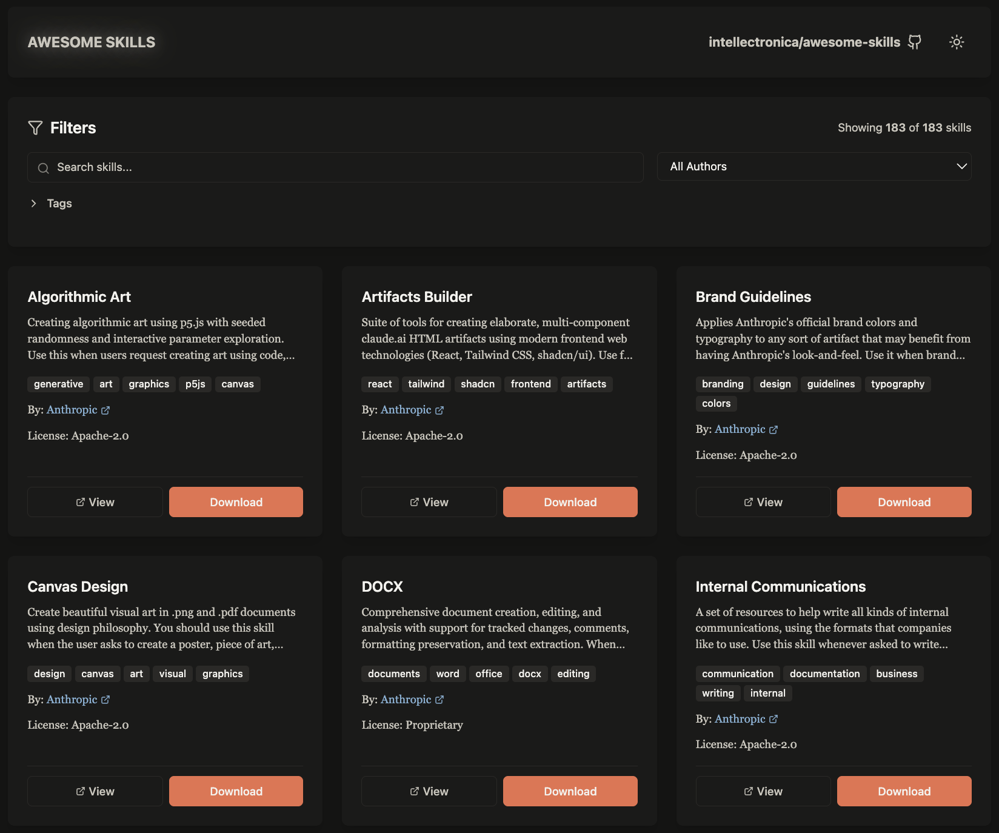

# Awesome Skills

**A directory of skills for AI agents.**

Skills extend the capabilities of AI agents with packaged routines, workflows, and knowledge.

You can run these skills in [Claude](https://www.anthropic.com/news/skills) or with any AI agent using the [Skillz MCP server](https://github.com/intellectronica/skillz).

## Contributing

If you have a skill to share, please submit a pull request adding it to [`skills.yaml`](https://github.com/intellectronica/awesome-skills/blob/main/skills.yaml) or [open an issue](https://github.com/intellectronica/awesome-skills/issues).

## Credit & License

This repository is maintained with love by **[Eleanor Berger](https://intellectronica.net/) ([`@intellectronica`](https://github.com/intellectronica))** and is avaialble in the **public domain** under the [CC0-1.0 Universal License](LICENSE).

The linked skills each have their own license.

---

---

## Skills

<!-- SKILLS_START -->
### [Accessibility Testing](https://github.com/proffesor-for-testing/agentic-qe/tree/main/.claude/skills/accessibility-testing)

WCAG 2.2 compliance testing, screen reader validation, and inclusive design verification. Use when ensuring legal compliance (ADA, Section 508), testing for disabilities, or building accessible applications for 1 billion disabled users globally.

- **Author**: [Dragan Spiridonov](https://github.com/proffesor-for-testing) ([`@proffesor-for-testing`](https://github.com/proffesor-for-testing))
- **License**: [MIT](https://raw.githubusercontent.com/proffesor-for-testing/agentic-qe/main/LICENSE)
- **Skill**: https://github.com/proffesor-for-testing/agentic-qe/tree/main/.claude/skills/accessibility-testing
- **Tags**: `accessibility`, `security`, `testing`

---

### [ACE System Skill](https://github.com/masharratt/claude-flow-novice/tree/main/.claude/skills/cfn-ace-system)

Simplified Claude Flow for beginners - AI agent orchestration        made easy

- **Author**: [masharratt](https://github.com/masharratt) ([`@masharratt`](https://github.com/masharratt))
- **Skill**: https://github.com/masharratt/claude-flow-novice/tree/main/.claude/skills/cfn-ace-system
- **Tags**: `ai`

---

### [Advanced Exploratory Testing](https://github.com/proffesor-for-testing/agentic-qe/tree/main/.claude/skills/exploratory-testing-advanced)

Advanced exploratory testing techniques with Session-Based Test Management (SBTM), RST heuristics, and test tours. Use when planning exploration sessions, investigating bugs, or discovering unknown quality risks.

- **Author**: [Dragan Spiridonov](https://github.com/proffesor-for-testing) ([`@proffesor-for-testing`](https://github.com/proffesor-for-testing))
- **License**: [MIT](https://raw.githubusercontent.com/proffesor-for-testing/agentic-qe/main/LICENSE)
- **Skill**: https://github.com/proffesor-for-testing/agentic-qe/tree/main/.claude/skills/exploratory-testing-advanced
- **Tags**: `debugging`, `testing`

---

### [Advanced Kubernetes](https://github.com/williamzujkowski/standards/tree/main/skills/cloud-native/advanced-kubernetes)

Custom Resource Definitions (CRDs) extend Kubernetes API with custom

- **Author**: [William Zujkowski](https://github.com/williamzujkowski) ([`@williamzujkowski`](https://github.com/williamzujkowski))
- **License**: [MIT](https://raw.githubusercontent.com/williamzujkowski/standards/master/LICENSE)
- **Skill**: https://github.com/williamzujkowski/standards/tree/main/skills/cloud-native/advanced-kubernetes
- **Tags**: `ai`, `api`, `devops`, `kubernetes`, `testing`, `web`

---

### [Advanced RE Analysis](https://github.com/KevinMitchell-OSWP-CISSP/EmberScale-Enhanced/tree/main/examples/custom_re_skill)

Specialized reverse engineering analysis workflows for binary analysis, pattern recognition, and vulnerability assessment

- **Author**: [Kevin](https://github.com/KevinMitchell-OSWP-CISSP) ([`@KevinMitchell-OSWP-CISSP`](https://github.com/KevinMitchell-OSWP-CISSP))
- **License**: [MIT](https://raw.githubusercontent.com/KevinMitchell-OSWP-CISSP/EmberScale-Enhanced/master/LICENSE)
- **Skill**: https://github.com/KevinMitchell-OSWP-CISSP/EmberScale-Enhanced/tree/main/examples/custom_re_skill
- **Tags**: `security`

---

### [Aeon](https://github.com/K-Dense-AI/claude-scientific-skills/tree/main/scientific-packages/aeon)

Access and utilize the Aeon Python package for scientific computing.

- **Author**: [K-Dense AI](https://k-dense.ai) ([`@K-Dense-AI`](https://github.com/K-Dense-AI))
- **License**: [MIT](https://raw.githubusercontent.com/K-Dense-AI/claude-scientific-skills/main/LICENSE)
- **Skill**: https://github.com/K-Dense-AI/claude-scientific-skills/tree/main/scientific-packages/aeon
- **Tags**: `data`, `library`, `python`, `scientific`

---

### [Agent Delegation](https://github.com/rsmdt/the-startup/tree/main/plugins/start/skills/agent-delegation)

Generate structured agent prompts with FOCUS/EXCLUDE templates for task delegation. Use when breaking down complex tasks, launching parallel specialists, coordinating multiple agents, creating agent instructions, determining execution strategy, or preventing file path collisions. Handles task decomposition, parallel vs sequential logic, scope validation, and retry strategies.

- **Author**: [Rudolf S.](https://github.com/rsmdt) ([`@rsmdt`](https://github.com/rsmdt))
- **License**: [MIT](https://raw.githubusercontent.com/rsmdt/the-startup/main/LICENSE)
- **Skill**: https://github.com/rsmdt/the-startup/tree/main/plugins/start/skills/agent-delegation
- **Tags**: `ai`

---

### [Agent Discovery Skill](https://github.com/masharratt/claude-flow-novice/tree/main/.claude/skills/cfn-agent-discovery)

Simplified Claude Flow for beginners - AI agent orchestration        made easy

- **Author**: [masharratt](https://github.com/masharratt) ([`@masharratt`](https://github.com/masharratt))
- **Skill**: https://github.com/masharratt/claude-flow-novice/tree/main/.claude/skills/cfn-agent-discovery
- **Tags**: `ai`

---

### [Agent Factory](https://github.com/alirezarezvani/claude-code-skill-factory/tree/main/generated-skills/agent-factory)

Claude Code agent generation system that creates custom agents and sub-agents with enhanced YAML frontmatter, tool access patterns, and MCP integration support following proven production patterns

- **Author**: [Alireza Rezvani](https://github.com/alirezarezvani) ([`@alirezarezvani`](https://github.com/alirezarezvani))
- **License**: [MIT](https://raw.githubusercontent.com/alirezarezvani/claude-code-skill-factory/main/LICENSE)
- **Skill**: https://github.com/alirezarezvani/claude-code-skill-factory/tree/main/generated-skills/agent-factory
- **Tags**: `development`

---

### [Agent Output Processing Skill (Universal)](https://github.com/masharratt/claude-flow-novice/tree/main/.claude/skills/cfn-agent-output-processing)

Simplified Claude Flow for beginners - AI agent orchestration        made easy

- **Author**: [masharratt](https://github.com/masharratt) ([`@masharratt`](https://github.com/masharratt))
- **Skill**: https://github.com/masharratt/claude-flow-novice/tree/main/.claude/skills/cfn-agent-output-processing
- **Tags**: `ai`

---

### [Agent Prompt Evolution](https://github.com/yaleh/meta-cc/tree/main/.claude/skills/agent-prompt-evolution)

Track and optimize agent specialization during methodology development. Use when agent specialization emerges (generic agents show >5x performance gap), multi-experiment comparison needed, or methodology transferability analysis required. Captures agent set evolution (Aₙ tracking), meta-agent evolution (Mₙ tracking), specialization decisions (when/why to create specialized agents), and reusability assessment (universal vs domain-specific vs task-specific). Enables systematic cross-experiment learning and optimized M₀ evolution. 2-3 hours overhead per experiment.

- **Author**: [Yale Huang](https://github.com/yaleh) ([`@yaleh`](https://github.com/yaleh))
- **License**: [MIT](https://raw.githubusercontent.com/yaleh/meta-cc/main/LICENSE)
- **Skill**: https://github.com/yaleh/meta-cc/tree/main/.claude/skills/agent-prompt-evolution
- **Tags**: `scientific`

---

### [Agent Selector Skill](https://github.com/masharratt/claude-flow-novice/tree/main/.claude/skills/cfn-agent-selector)

Simplified Claude Flow for beginners - AI agent orchestration        made easy

- **Author**: [masharratt](https://github.com/masharratt) ([`@masharratt`](https://github.com/masharratt))
- **Skill**: https://github.com/masharratt/claude-flow-novice/tree/main/.claude/skills/cfn-agent-selector
- **Tags**: `ai`

---

### [Agent Skill Creator](https://github.com/FrancyJGLisboa/agent-skill-creator)

This enhanced skill should be used when the user asks to create an agent, automate a repetitive workflow, create a custom skill, or needs advanced agent creation capabilities. Activates with phrases like every day, daily I have to, I need to repeat, create agent for, automate workflow, create skill for, need to automate, turn process into agent. Supports single agents, multi-agent suites, transcript processing, template-based creation, and interactive configuration. Claude will use the enhanced protocol to research APIs, define analyses, structure everything, implement functional code, and create complete skills autonomously with optional user guidance.

- **Author**: [Francy Lisboa](https://github.com/FrancyJGLisboa) ([`@FrancyJGLisboa`](https://github.com/FrancyJGLisboa))
- **Skill**: https://github.com/FrancyJGLisboa/agent-skill-creator
- **Tags**: `development`

---

### [Agent Spawning](https://github.com/masharratt/claude-flow-novice/tree/main/.claude/skills/cfn-agent-spawning)

Simplified Claude Flow for beginners - AI agent orchestration        made easy

- **Author**: [masharratt](https://github.com/masharratt) ([`@masharratt`](https://github.com/masharratt))
- **Skill**: https://github.com/masharratt/claude-flow-novice/tree/main/.claude/skills/cfn-agent-spawning
- **Tags**: `ai`

---

### [Agent Swap Mechanism Skill](https://github.com/masharratt/claude-flow-novice/tree/main/.claude/skills/cfn-agent-swap)

Simplified Claude Flow for beginners - AI agent orchestration        made easy

- **Author**: [masharratt](https://github.com/masharratt) ([`@masharratt`](https://github.com/masharratt))
- **Skill**: https://github.com/masharratt/claude-flow-novice/tree/main/.claude/skills/cfn-agent-swap
- **Tags**: `ai`

---

### [AgentDB Advanced Features](https://github.com/agenticsorg/lean-agentic/tree/main/.claude/skills/agentdb-advanced)

Master advanced AgentDB features including QUIC synchronization, multi-database management, custom distance metrics, hybrid search, and distributed systems integration. Use when building distributed AI systems, multi-agent coordination, or advanced vector search applications.

- **Author**: [agenticsorg](https://github.com/agenticsorg) ([`@agenticsorg`](https://github.com/agenticsorg))
- **License**: [MIT](https://raw.githubusercontent.com/agenticsorg/lean-agentic/main/LICENSE)
- **Skill**: https://github.com/agenticsorg/lean-agentic/tree/main/.claude/skills/agentdb-advanced
- **Tags**: `ai`, `data`

---

### [AgentDB Advanced Features](https://github.com/proffesor-for-testing/agentic-qe/tree/main/.claude/skills/agentdb-advanced)

Master advanced AgentDB features including QUIC synchronization, multi-database management, custom distance metrics, hybrid search, and distributed systems integration. Use when building distributed AI systems, multi-agent coordination, or advanced vector search applications.

- **Author**: [Dragan Spiridonov](https://github.com/proffesor-for-testing) ([`@proffesor-for-testing`](https://github.com/proffesor-for-testing))
- **License**: [MIT](https://raw.githubusercontent.com/proffesor-for-testing/agentic-qe/main/LICENSE)
- **Skill**: https://github.com/proffesor-for-testing/agentic-qe/tree/main/.claude/skills/agentdb-advanced
- **Tags**: `data`

---

### [AgentDB Advanced Features](https://github.com/ruvnet/agentic-flow/tree/main/.claude/skills/agentdb-advanced)

Master advanced AgentDB features including QUIC synchronization, multi-database management, custom distance metrics, hybrid search, and distributed systems integration. Use when building distributed AI systems, multi-agent coordination, or advanced vector search applications.

- **Author**: [rUv](https://github.com/ruvnet) ([`@ruvnet`](https://github.com/ruvnet))
- **Skill**: https://github.com/ruvnet/agentic-flow/tree/main/.claude/skills/agentdb-advanced
- **Tags**: `data`

---

### [AgentDB Advanced Features](https://github.com/ruvnet/claude-flow/tree/main/.claude/skills/agentdb-advanced)

Master advanced AgentDB features including QUIC synchronization, multi-database management, custom distance metrics, hybrid search, and distributed systems integration. Use when building distributed AI systems, multi-agent coordination, or advanced vector search applications.

- **Author**: [rUv](https://github.com/ruvnet) ([`@ruvnet`](https://github.com/ruvnet))
- **License**: [MIT](https://raw.githubusercontent.com/ruvnet/claude-flow/main/LICENSE)
- **Skill**: https://github.com/ruvnet/claude-flow/tree/main/.claude/skills/agentdb-advanced
- **Tags**: `data`

---

### [AgentDB Learning Plugins](https://github.com/agenticsorg/lean-agentic/tree/main/.claude/skills/agentdb-learning)

Create and train AI learning plugins with AgentDB's 9 reinforcement learning algorithms. Includes Decision Transformer, Q-Learning, SARSA, Actor-Critic, and more. Use when building self-learning agents, implementing RL, or optimizing agent behavior through experience.

- **Author**: [agenticsorg](https://github.com/agenticsorg) ([`@agenticsorg`](https://github.com/agenticsorg))
- **License**: [MIT](https://raw.githubusercontent.com/agenticsorg/lean-agentic/main/LICENSE)
- **Skill**: https://github.com/agenticsorg/lean-agentic/tree/main/.claude/skills/agentdb-learning
- **Tags**: `design`

---

### [AgentDB Learning Plugins](https://github.com/proffesor-for-testing/agentic-qe/tree/main/.claude/skills/agentdb-learning)

Create and train AI learning plugins with AgentDB's 9 reinforcement learning algorithms. Includes Decision Transformer, Q-Learning, SARSA, Actor-Critic, and more. Use when building self-learning agents, implementing RL, or optimizing agent behavior through experience.

- **Author**: [Dragan Spiridonov](https://github.com/proffesor-for-testing) ([`@proffesor-for-testing`](https://github.com/proffesor-for-testing))
- **License**: [MIT](https://raw.githubusercontent.com/proffesor-for-testing/agentic-qe/main/LICENSE)
- **Skill**: https://github.com/proffesor-for-testing/agentic-qe/tree/main/.claude/skills/agentdb-learning
- **Tags**: `development`

---

### [AgentDB Learning Plugins](https://github.com/ruvnet/agentic-flow/tree/main/.claude/skills/agentdb-learning)

Create and train AI learning plugins with AgentDB's 9 reinforcement learning algorithms. Includes Decision Transformer, Q-Learning, SARSA, Actor-Critic, and more. Use when building self-learning agents, implementing RL, or optimizing agent behavior through experience.

- **Author**: [rUv](https://github.com/ruvnet) ([`@ruvnet`](https://github.com/ruvnet))
- **Skill**: https://github.com/ruvnet/agentic-flow/tree/main/.claude/skills/agentdb-learning
- **Tags**: `development`

---

### [AgentDB Learning Plugins](https://github.com/ruvnet/claude-flow/tree/main/.claude/skills/agentdb-learning)

Create and train AI learning plugins with AgentDB's 9 reinforcement learning algorithms. Includes Decision Transformer, Q-Learning, SARSA, Actor-Critic, and more. Use when building self-learning agents, implementing RL, or optimizing agent behavior through experience.

- **Author**: [rUv](https://github.com/ruvnet) ([`@ruvnet`](https://github.com/ruvnet))
- **License**: [MIT](https://raw.githubusercontent.com/ruvnet/claude-flow/main/LICENSE)
- **Skill**: https://github.com/ruvnet/claude-flow/tree/main/.claude/skills/agentdb-learning
- **Tags**: `development`

---

### [AgentDB Memory Patterns](https://github.com/agenticsorg/lean-agentic/tree/main/.claude/skills/agentdb-memory-patterns)

Implement persistent memory patterns for AI agents using AgentDB. Includes session memory, long-term storage, pattern learning, and context management. Use when building stateful agents, chat systems, or intelligent assistants.

- **Author**: [agenticsorg](https://github.com/agenticsorg) ([`@agenticsorg`](https://github.com/agenticsorg))
- **License**: [MIT](https://raw.githubusercontent.com/agenticsorg/lean-agentic/main/LICENSE)
- **Skill**: https://github.com/agenticsorg/lean-agentic/tree/main/.claude/skills/agentdb-memory-patterns
- **Tags**: `design`

---

### [AgentDB Memory Patterns](https://github.com/proffesor-for-testing/agentic-qe/tree/main/.claude/skills/agentdb-memory-patterns)

Implement persistent memory patterns for AI agents using AgentDB. Includes session memory, long-term storage, pattern learning, and context management. Use when building stateful agents, chat systems, or intelligent assistants.

- **Author**: [Dragan Spiridonov](https://github.com/proffesor-for-testing) ([`@proffesor-for-testing`](https://github.com/proffesor-for-testing))
- **License**: [MIT](https://raw.githubusercontent.com/proffesor-for-testing/agentic-qe/main/LICENSE)
- **Skill**: https://github.com/proffesor-for-testing/agentic-qe/tree/main/.claude/skills/agentdb-memory-patterns
- **Tags**: `design`

---

### [AgentDB Memory Patterns](https://github.com/ruvnet/agentic-flow/tree/main/.claude/skills/agentdb-memory-patterns)

Implement persistent memory patterns for AI agents using AgentDB. Includes session memory, long-term storage, pattern learning, and context management. Use when building stateful agents, chat systems, or intelligent assistants.

- **Author**: [rUv](https://github.com/ruvnet) ([`@ruvnet`](https://github.com/ruvnet))
- **Skill**: https://github.com/ruvnet/agentic-flow/tree/main/.claude/skills/agentdb-memory-patterns
- **Tags**: `design`

---

### [AgentDB Memory Patterns](https://github.com/ruvnet/claude-flow/tree/main/.claude/skills/agentdb-memory-patterns)

Implement persistent memory patterns for AI agents using AgentDB. Includes session memory, long-term storage, pattern learning, and context management. Use when building stateful agents, chat systems, or intelligent assistants.

- **Author**: [rUv](https://github.com/ruvnet) ([`@ruvnet`](https://github.com/ruvnet))
- **License**: [MIT](https://raw.githubusercontent.com/ruvnet/claude-flow/main/LICENSE)
- **Skill**: https://github.com/ruvnet/claude-flow/tree/main/.claude/skills/agentdb-memory-patterns
- **Tags**: `design`

---

### [AgentDB Performance Optimization](https://github.com/agenticsorg/lean-agentic/tree/main/.claude/skills/agentdb-optimization)

Optimize AgentDB performance with quantization (4-32x memory reduction), HNSW indexing (150x faster search), caching, and batch operations. Use when optimizing memory usage, improving search speed, or scaling to millions of vectors.

- **Author**: [agenticsorg](https://github.com/agenticsorg) ([`@agenticsorg`](https://github.com/agenticsorg))
- **License**: [MIT](https://raw.githubusercontent.com/agenticsorg/lean-agentic/main/LICENSE)
- **Skill**: https://github.com/agenticsorg/lean-agentic/tree/main/.claude/skills/agentdb-optimization
- **Tags**: `ai`

---

### [AgentDB Performance Optimization](https://github.com/proffesor-for-testing/agentic-qe/tree/main/.claude/skills/agentdb-optimization)

Optimize AgentDB performance with quantization (4-32x memory reduction), HNSW indexing (150x faster search), caching, and batch operations. Use when optimizing memory usage, improving search speed, or scaling to millions of vectors.

- **Author**: [Dragan Spiridonov](https://github.com/proffesor-for-testing) ([`@proffesor-for-testing`](https://github.com/proffesor-for-testing))
- **License**: [MIT](https://raw.githubusercontent.com/proffesor-for-testing/agentic-qe/main/LICENSE)
- **Skill**: https://github.com/proffesor-for-testing/agentic-qe/tree/main/.claude/skills/agentdb-optimization
- **Tags**: `development`

---

### [AgentDB Performance Optimization](https://github.com/ruvnet/agentic-flow/tree/main/.claude/skills/agentdb-optimization)

Optimize AgentDB performance with quantization (4-32x memory reduction), HNSW indexing (150x faster search), caching, and batch operations. Use when optimizing memory usage, improving search speed, or scaling to millions of vectors.

- **Author**: [rUv](https://github.com/ruvnet) ([`@ruvnet`](https://github.com/ruvnet))
- **Skill**: https://github.com/ruvnet/agentic-flow/tree/main/.claude/skills/agentdb-optimization
- **Tags**: `development`

---

### [AgentDB Performance Optimization](https://github.com/ruvnet/claude-flow/tree/main/.claude/skills/agentdb-optimization)

Optimize AgentDB performance with quantization (4-32x memory reduction), HNSW indexing (150x faster search), caching, and batch operations. Use when optimizing memory usage, improving search speed, or scaling to millions of vectors.

- **Author**: [rUv](https://github.com/ruvnet) ([`@ruvnet`](https://github.com/ruvnet))
- **License**: [MIT](https://raw.githubusercontent.com/ruvnet/claude-flow/main/LICENSE)
- **Skill**: https://github.com/ruvnet/claude-flow/tree/main/.claude/skills/agentdb-optimization
- **Tags**: `development`

---

### [AgentDB Vector Search](https://github.com/agenticsorg/lean-agentic/tree/main/.claude/skills/agentdb-vector-search)

Implement semantic vector search with AgentDB for intelligent document retrieval, similarity matching, and context-aware querying. Use when building RAG systems, semantic search engines, or intelligent knowledge bases.

- **Author**: [agenticsorg](https://github.com/agenticsorg) ([`@agenticsorg`](https://github.com/agenticsorg))
- **License**: [MIT](https://raw.githubusercontent.com/agenticsorg/lean-agentic/main/LICENSE)
- **Skill**: https://github.com/agenticsorg/lean-agentic/tree/main/.claude/skills/agentdb-vector-search
- **Tags**: `data`, `documentation`

---

### [AgentDB Vector Search](https://github.com/proffesor-for-testing/agentic-qe/tree/main/.claude/skills/agentdb-vector-search)

Implement semantic vector search with AgentDB for intelligent document retrieval, similarity matching, and context-aware querying. Use when building RAG systems, semantic search engines, or intelligent knowledge bases.

- **Author**: [Dragan Spiridonov](https://github.com/proffesor-for-testing) ([`@proffesor-for-testing`](https://github.com/proffesor-for-testing))
- **License**: [MIT](https://raw.githubusercontent.com/proffesor-for-testing/agentic-qe/main/LICENSE)
- **Skill**: https://github.com/proffesor-for-testing/agentic-qe/tree/main/.claude/skills/agentdb-vector-search
- **Tags**: `design`

---

### [AgentDB Vector Search](https://github.com/ruvnet/agentic-flow/tree/main/.claude/skills/agentdb-vector-search)

Implement semantic vector search with AgentDB for intelligent document retrieval, similarity matching, and context-aware querying. Use when building RAG systems, semantic search engines, or intelligent knowledge bases.

- **Author**: [rUv](https://github.com/ruvnet) ([`@ruvnet`](https://github.com/ruvnet))
- **Skill**: https://github.com/ruvnet/agentic-flow/tree/main/.claude/skills/agentdb-vector-search
- **Tags**: `design`

---

### [AgentDB Vector Search](https://github.com/ruvnet/claude-flow/tree/main/.claude/skills/agentdb-vector-search)

Implement semantic vector search with AgentDB for intelligent document retrieval, similarity matching, and context-aware querying. Use when building RAG systems, semantic search engines, or intelligent knowledge bases.

- **Author**: [rUv](https://github.com/ruvnet) ([`@ruvnet`](https://github.com/ruvnet))
- **License**: [MIT](https://raw.githubusercontent.com/ruvnet/claude-flow/main/LICENSE)
- **Skill**: https://github.com/ruvnet/claude-flow/tree/main/.claude/skills/agentdb-vector-search
- **Tags**: `design`

---

### [Agentic Quality Engineering](https://github.com/proffesor-for-testing/agentic-qe/tree/main/.claude/skills/agentic-quality-engineering)

Using AI agents as force multipliers in quality work. Use when designing autonomous testing systems, implementing PACT principles, or scaling quality engineering with intelligent agents. Core skill for all QE agents in the fleet.

- **Author**: [Dragan Spiridonov](https://github.com/proffesor-for-testing) ([`@proffesor-for-testing`](https://github.com/proffesor-for-testing))
- **License**: [MIT](https://raw.githubusercontent.com/proffesor-for-testing/agentic-qe/main/LICENSE)
- **Skill**: https://github.com/proffesor-for-testing/agentic-qe/tree/main/.claude/skills/agentic-quality-engineering
- **Tags**: `ai`, `api-testing`, `multi-agent`, `test-automation`, `testing`

---

### [Agenticflow](https://github.com/PixelML/agenticflow-skill)

This skill enables you to design, build, and validate AgenticFlow automation workflows from natural language requirements. Use this when users mention AgenticFlow, automation workflows, or want to integrate external services (Gmail, Slack, Shopify, CRM systems, etc.) into automated processes. You can transform user requirements into production-ready workflows with both standard nodes and MCP integrations.

- **Author**: [PixelML](https://github.com/PixelML) ([`@PixelML`](https://github.com/PixelML))
- **License**: [MIT](https://raw.githubusercontent.com/PixelML/agenticflow-skill/main/LICENSE.txt)
- **Skill**: https://github.com/PixelML/agenticflow-skill
- **Tags**: `development`

---

### [Agile Product Owner](https://github.com/alirezarezvani/claude-skills/tree/main/product-team/agile-product-owner)

Agile product ownership toolkit for Senior Product Owner including INVEST-compliant user story generation, sprint planning, backlog management, and velocity tracking. Use for story writing, sprint planning, stakeholder communication, and agile ceremonies.

- **Author**: [Alireza Rezvani](https://github.com/alirezarezvani) ([`@alirezarezvani`](https://github.com/alirezarezvani))
- **License**: [MIT](https://raw.githubusercontent.com/alirezarezvani/claude-skills/main/LICENSE)
- **Skill**: https://github.com/alirezarezvani/claude-skills/tree/main/product-team/agile-product-owner
- **Tags**: `content`, `project-management`, `scientific`

---

### [Ai Assisted Development](https://github.com/baz-scm/awesome-reviewers/tree/main/_skills/ai-assisted-development)

Leveraging AI coding assistants and tools to boost development productivity, while maintaining oversight to ensure quality results.

- **Author**: [baz-scm](https://github.com/baz-scm) ([`@baz-scm`](https://github.com/baz-scm))
- **Skill**: https://github.com/baz-scm/awesome-reviewers/tree/main/_skills/ai-assisted-development
- **Tags**: `productivity`

---

### [AI Maestro Agent Messaging](https://github.com/23blocks-OS/ai-maestro/tree/main/skills/agent-messaging)

Send and receive messages between AI agent sessions using AI Maestro's messaging system. Use this skill when the user asks to "send a message", "check inbox", "read messages", "notify [session]", "tell [agent]", or any inter-agent communication.

- **Author**: [23blocks-OS](https://github.com/23blocks-OS) ([`@23blocks-OS`](https://github.com/23blocks-OS))
- **License**: [MIT](https://raw.githubusercontent.com/23blocks-OS/ai-maestro/main/LICENSE)
- **Skill**: https://github.com/23blocks-OS/ai-maestro/tree/main/skills/agent-messaging
- **Tags**: `development`

---

### [AI SDK Core](https://github.com/jezweb/claude-skills/tree/main/skills/ai-sdk-core)

|

- **Author**: [Jeremy Dawes](https://github.com/jezweb) ([`@jezweb`](https://github.com/jezweb))
- **Skill**: https://github.com/jezweb/claude-skills/tree/main/skills/ai-sdk-core
- **Tags**: `ai`, `scientific`, `web`

---

### [AI SDK UI](https://github.com/jezweb/claude-skills/tree/main/skills/ai-sdk-ui)

|

- **Author**: [Jeremy Dawes](https://github.com/jezweb) ([`@jezweb`](https://github.com/jezweb))
- **Skill**: https://github.com/jezweb/claude-skills/tree/main/skills/ai-sdk-ui
- **Tags**: `web`

---

### [Alembic](https://github.com/manutej/luxor-claude-marketplace/tree/main/plugins/luxor-database-pro/skills/alembic)

Comprehensive Alembic database migration management for customer support systems

- **Author**: [manutej](https://github.com/manutej) ([`@manutej`](https://github.com/manutej))
- **Skill**: https://github.com/manutej/luxor-claude-marketplace/tree/main/plugins/luxor-database-pro/skills/alembic
- **Tags**: `business`, `data`, `database`, `orm`, `postgresql`

---

### [Alex Hormozi Pitch](https://github.com/danielmiessler/Personal_AI_Infrastructure/tree/main/.claude/skills/alex-hormozi-pitch)

Create irresistible offers and pitches using Alex Hormozi's methodology from $100M Offers. Guides through value equation, guarantee frameworks, pricing psychology, and creating offers "too good not to take" for any product or service.

- **Author**: [Daniel Miessler 🛡️](https://github.com/danielmiessler) ([`@danielmiessler`](https://github.com/danielmiessler))
- **Skill**: https://github.com/danielmiessler/Personal_AI_Infrastructure/tree/main/.claude/skills/alex-hormozi-pitch
- **Tags**: `development`

---

### [Algo Sensei](https://github.com/karanb192/algo-sensei)

Your personal DSA & LeetCode mentor. Use for problem explanations, progressive hints, code reviews, mock interviews, pattern recognition, complexity analysis, and custom problem generation. Automatically adapts to your learning style and request type.

- **Author**: [Karan Bansal](https://github.com/karanb192) ([`@karanb192`](https://github.com/karanb192))
- **Skill**: https://github.com/karanb192/algo-sensei
- **Tags**: `development`, `scientific`

---

### [Algorithmic Art](https://github.com/AgiFlow/claude-code-prompt-analysis/tree/main/.claude/skills/algorithmic-art)

Creating algorithmic art using p5.js with seeded randomness and interactive parameter exploration. Use this when users request creating art using code, generative art, algorithmic art, flow fields, or particle systems. Create original algorithmic art rather than copying existing artists' work to avoid copyright violations.

- **Author**: [AgiFlow](https://github.com/AgiFlow) ([`@AgiFlow`](https://github.com/AgiFlow))
- **License**: [MIT](https://raw.githubusercontent.com/AgiFlow/claude-code-prompt-analysis/main/LICENSE)
- **Skill**: https://github.com/AgiFlow/claude-code-prompt-analysis/tree/main/.claude/skills/algorithmic-art
- **Tags**: `development`, `scientific`

---

### [Algorithmic Art](https://github.com/anthropics/skills/tree/main/algorithmic-art)

Creating algorithmic art using p5.js with seeded randomness and interactive parameter exploration. Use this when users request creating art using code, generative art, algorithmic art, flow fields, or particle systems. Create original algorithmic art rather than copying existing artists' work to avoid copyright violations.

- **Author**: [Anthropic](https://www.anthropic.com) ([`@anthropics`](https://github.com/anthropics))
- **License**: [Apache-2.0](https://raw.githubusercontent.com/anthropics/skills/main/algorithmic-art/LICENSE.txt)
- **Skill**: https://github.com/anthropics/skills/tree/main/algorithmic-art
- **Tags**: `ai`, `design`, `image`, `javascript`, `web`

---

### [Algorithmic Art](https://github.com/ComposioHQ/awesome-claude-skills/tree/main/algorithmic-art copy)

Creating algorithmic art using p5.js with seeded randomness and interactive parameter exploration. Use this when users request creating art using code, generative art, algorithmic art, flow fields, or particle systems. Create original algorithmic art rather than copying existing artists' work to avoid copyright violations.

- **Author**: [ComposioHQ](https://github.com/ComposioHQ) ([`@ComposioHQ`](https://github.com/ComposioHQ))
- **Skill**: https://github.com/ComposioHQ/awesome-claude-skills/tree/main/algorithmic-art copy
- **Tags**: `development`, `scientific`

---

### [Algorithmic Art](https://github.com/gked2121/claude-skills/tree/main/official-anthropic-skills/algorithmic-art)

Creating algorithmic art using p5.js with seeded randomness and interactive parameter exploration. Use this when users request creating art using code, generative art, algorithmic art, flow fields, or particle systems. Create original algorithmic art rather than copying existing artists' work to avoid copyright violations.

- **Author**: [gked2121](https://github.com/gked2121) ([`@gked2121`](https://github.com/gked2121))
- **Skill**: https://github.com/gked2121/claude-skills/tree/main/official-anthropic-skills/algorithmic-art
- **Tags**: `design`, `development`

---

### [Algorithmic Art](https://github.com/LeastBit/Claude_skills_zh-CN/tree/main/algorithmic-art_算法艺术)

使用带种子随机性的 p5.js，通过交互式参数探索生成原创算法艺术。适用于用户提出涉及代码生成艺术、算法艺术、流场或粒子系统的请求。始终创作原创算法艺术，避免直接复制现有艺术家的作品，以免引发版权问题。

- **Author**: [LeastBit](https://github.com/LeastBit) ([`@LeastBit`](https://github.com/LeastBit))
- **Skill**: https://github.com/LeastBit/Claude_skills_zh-CN/tree/main/algorithmic-art_算法艺术
- **Tags**: `development`

---

### [Algorithmic Art](https://github.com/lifangda/claude-plugins/tree/main/cli-tool/skills-library/creative-design/algorithmic-art)

Creating algorithmic art using p5.js with seeded randomness and interactive parameter exploration. Use this when users request creating art using code, generative art, algorithmic art, flow fields, or particle systems. Create original algorithmic art rather than copying existing artists' work to avoid copyright violations.

- **Author**: [lifangda](https://github.com/lifangda) ([`@lifangda`](https://github.com/lifangda))
- **Skill**: https://github.com/lifangda/claude-plugins/tree/main/cli-tool/skills-library/creative-design/algorithmic-art
- **Tags**: `design`, `development`

---

### [Algorithmic Art](https://github.com/OneWave-AI/claude-skills/tree/main/official-anthropic-skills/algorithmic-art)

Creating algorithmic art using p5.js with seeded randomness and interactive parameter exploration. Use this when users request creating art using code, generative art, algorithmic art, flow fields, or particle systems. Create original algorithmic art rather than copying existing artists' work to avoid copyright violations.

- **Author**: [OneWave-AI](https://github.com/OneWave-AI) ([`@OneWave-AI`](https://github.com/OneWave-AI))
- **License**: [MIT](https://raw.githubusercontent.com/OneWave-AI/claude-skills/main/LICENSE)
- **Skill**: https://github.com/OneWave-AI/claude-skills/tree/main/official-anthropic-skills/algorithmic-art
- **Tags**: `design`, `development`

---

### [Algorithmic Art](https://github.com/Prat011/awesome-llm-skills/tree/main/algorithmic-art)

Creating algorithmic art using p5.js with seeded randomness and interactive parameter exploration. Use this when users request creating art using code, generative art, algorithmic art, flow fields, or particle systems. Create original algorithmic art rather than copying existing artists' work to avoid copyright violations.

- **Author**: [Prathit](https://github.com/Prat011) ([`@Prat011`](https://github.com/Prat011))
- **Skill**: https://github.com/Prat011/awesome-llm-skills/tree/main/algorithmic-art
- **Tags**: `design`, `development`

---

### [Algorithmic Art Generation](https://github.com/lifangda/claude-plugins/tree/main/cli-tool/skills-library/creative-ai/algorithmic-art)

|

- **Author**: [lifangda](https://github.com/lifangda) ([`@lifangda`](https://github.com/lifangda))
- **Skill**: https://github.com/lifangda/claude-plugins/tree/main/cli-tool/skills-library/creative-ai/algorithmic-art
- **Tags**: `scientific`

---

### [Alphafold Database](https://github.com/K-Dense-AI/claude-scientific-skills/tree/main/scientific-databases/alphafold-database)

Access and utilize the Alphafold Database database for scientific research.

- **Author**: [K-Dense AI](https://k-dense.ai) ([`@K-Dense-AI`](https://github.com/K-Dense-AI))
- **License**: [MIT](https://raw.githubusercontent.com/K-Dense-AI/claude-scientific-skills/main/LICENSE)
- **Skill**: https://github.com/K-Dense-AI/claude-scientific-skills/tree/main/scientific-databases/alphafold-database
- **Tags**: `data`, `database`, `scientific`

---

### [Analysis Phase](https://github.com/marcusgoll/Spec-Flow/tree/main/.claude/skills/analysis-phase)

Standard Operating Procedure for /analyze phase. Covers cross-artifact consistency validation and breaking change detection.

- **Author**: [Marcus Gollahon](https://github.com/marcusgoll) ([`@marcusgoll`](https://github.com/marcusgoll))
- **Skill**: https://github.com/marcusgoll/Spec-Flow/tree/main/.claude/skills/analysis-phase
- **Tags**: `development`

---

### [Analyzing Schedule](https://github.com/natea/ExoMind/tree/main/skills/analyzing-schedule)

Highly skilled voice-based assistant with intimate knowledge of your preferences, interests, worldview who can synthesize random thoughts from curated info sources, and act on your behalf.

- **Author**: [Nate Aune](https://github.com/natea) ([`@natea`](https://github.com/natea))
- **Skill**: https://github.com/natea/ExoMind/tree/main/skills/analyzing-schedule
- **Tags**: `development`

---

### [Angular Development](https://github.com/manutej/luxor-claude-marketplace/tree/main/plugins/luxor-frontend-essentials/skills/angular-development)

Comprehensive Angular framework development covering components, directives, services, dependency injection, routing, and reactive programming based on official Angular documentation

- **Author**: [manutej](https://github.com/manutej) ([`@manutej`](https://github.com/manutej))
- **Skill**: https://github.com/manutej/luxor-claude-marketplace/tree/main/plugins/luxor-frontend-essentials/skills/angular-development
- **Tags**: `angular`, `architecture`, `async`, `development`, `documentation`, `typescript`, `web`

---

### [Angular Migration](https://github.com/camoneart/claude-code/tree/main/skills/angular-migration)

Migrate from AngularJS to Angular using hybrid mode, incremental component rewriting, and dependency injection updates. Use when upgrading AngularJS applications, planning framework migrations, or modernizing legacy Angular code.

- **Author**: [kaishu aoyama](https://github.com/camoneart) ([`@camoneart`](https://github.com/camoneart))
- **Skill**: https://github.com/camoneart/claude-code/tree/main/skills/angular-migration
- **Tags**: `development`, `web`

---

### [Angular Migration](https://github.com/wshobson/agents/tree/main/plugins/framework-migration/skills/angular-migration)

Migrate from AngularJS to Angular using hybrid mode, incremental component rewriting, and dependency injection updates. Use when upgrading AngularJS applications, planning framework migrations, or modernizing legacy Angular code.

- **Author**: [Seth Hobson](https://github.com/wshobson) ([`@wshobson`](https://github.com/wshobson))
- **License**: [MIT](https://raw.githubusercontent.com/wshobson/agents/main/LICENSE)
- **Skill**: https://github.com/wshobson/agents/tree/main/plugins/framework-migration/skills/angular-migration
- **Tags**: `development`, `web`

---

### [Anndata](https://github.com/K-Dense-AI/claude-scientific-skills/tree/main/scientific-packages/anndata)

Access and utilize the Anndata Python package for scientific computing.

- **Author**: [K-Dense AI](https://k-dense.ai) ([`@K-Dense-AI`](https://github.com/K-Dense-AI))
- **License**: [MIT](https://raw.githubusercontent.com/K-Dense-AI/claude-scientific-skills/main/LICENSE)
- **Skill**: https://github.com/K-Dense-AI/claude-scientific-skills/tree/main/scientific-packages/anndata
- **Tags**: `data`, `library`, `python`, `scientific`

---

### [Another Skill](https://github.com/codienters/sheikh-cli/tree/main/.claude/skills/another-skill)

Another test skill for unit testing

- **Author**: [Lukas](https://github.com/codienters) ([`@codienters`](https://github.com/codienters))
- **Skill**: https://github.com/codienters/sheikh-cli/tree/main/.claude/skills/another-skill
- **Tags**: `testing`

---

### [Answering Research Questions](https://github.com/kthorn/research-superpower/tree/main/skills/research/answering-research-questions)

Main orchestration workflow for systematic literature research - search, evaluate, traverse, synthesize

- **Author**: [Kurt Thorn](https://github.com/kthorn) ([`@kthorn`](https://github.com/kthorn))
- **Skill**: https://github.com/kthorn/research-superpower/tree/main/skills/research/answering-research-questions
- **Tags**: `development`

---

### [Anti Slop](https://github.com/rand/cc-experiments/tree/main/skills/anti-slop)

Comprehensive toolkit for detecting and eliminating "AI slop" - generic, low-quality AI-generated patterns in natural language, code, and design. Use when reviewing or improving content quality, preventing generic AI patterns, cleaning up existing content, or enforcing quality standards in writing, code, or design work.

- **Author**: [Rand Arete](https://github.com/rand) ([`@rand`](https://github.com/rand))
- **License**: [MIT](https://raw.githubusercontent.com/rand/cc-polymath/main/LICENSE)
- **Skill**: https://github.com/rand/cc-experiments/tree/main/skills/anti-slop
- **Tags**: `design`

---

### [Apache Airflow Orchestration](https://github.com/manutej/luxor-claude-marketplace/tree/main/plugins/luxor-data-engineering/skills/apache-airflow-orchestration)

Complete guide for Apache Airflow orchestration including DAGs, operators, sensors, XComs, task dependencies, dynamic workflows, and production deployment

- **Author**: [manutej](https://github.com/manutej) ([`@manutej`](https://github.com/manutej))
- **Skill**: https://github.com/manutej/luxor-claude-marketplace/tree/main/plugins/luxor-data-engineering/skills/apache-airflow-orchestration
- **Tags**: `airflow`, `data`, `development`, `iot`, `kubernetes`, `orchestration`

---

### [Apache Spark Data Processing](https://github.com/manutej/luxor-claude-marketplace/tree/main/plugins/luxor-data-engineering/skills/apache-spark-data-processing)

Complete guide for Apache Spark data processing including RDDs, DataFrames, Spark SQL, streaming, MLlib, and production deployment

- **Author**: [manutej](https://github.com/manutej) ([`@manutej`](https://github.com/manutej))
- **Skill**: https://github.com/manutej/luxor-claude-marketplace/tree/main/plugins/luxor-data-engineering/skills/apache-spark-data-processing
- **Tags**: `ai`, `data`, `distributed`, `kafka`, `pandas`, `spark`

---

### [Api Best Practices](https://github.com/webdevtodayjason/titanium-plugins/tree/main/plugins/titanium-toolkit/skills/api-best-practices)

REST API design patterns, OpenAPI specifications, versioning strategies, authentication, error handling, and security best practices. Use when designing APIs, creating endpoints, documenting APIs, or implementing backend services that expose HTTP APIs.

- **Author**: [Jason Brashear (AKA SEM)](https://github.com/webdevtodayjason) ([`@webdevtodayjason`](https://github.com/webdevtodayjason))
- **License**: [MIT](https://raw.githubusercontent.com/webdevtodayjason/titanium-plugins/main/LICENSE)
- **Skill**: https://github.com/webdevtodayjason/titanium-plugins/tree/main/plugins/titanium-toolkit/skills/api-best-practices
- **Tags**: `security`, `web`

---

### [Api Design](https://github.com/akaszubski/autonomous-dev/tree/main/plugins/autonomous-dev/skills/api-design)

REST API design best practices, versioning strategies, error handling, pagination, and OpenAPI documentation. Use when designing or implementing REST APIs, HTTP endpoints, or API documentation.

- **Author**: [Andrew Kaszubski](https://github.com/akaszubski) ([`@akaszubski`](https://github.com/akaszubski))
- **Skill**: https://github.com/akaszubski/autonomous-dev/tree/main/plugins/autonomous-dev/skills/api-design
- **Tags**: `documentation`, `web`

---

### [API Design](https://github.com/yaleh/meta-cc/tree/main/.claude/skills/api-design)

Systematic API design methodology with 6 validated patterns covering parameter categorization, safe refactoring, audit-first approach, automated validation, quality gates, and example-driven documentation. Use when designing new APIs, improving API consistency, implementing breaking change policies, or building API quality enforcement. Provides deterministic decision trees (5-tier parameter system), validation tool architecture, pre-commit hook patterns. Validated with 82.5% cross-domain transferability, 37.5% efficiency gains through audit-first refactoring.

- **Author**: [Yale Huang](https://github.com/yaleh) ([`@yaleh`](https://github.com/yaleh))
- **License**: [MIT](https://raw.githubusercontent.com/yaleh/meta-cc/main/LICENSE)
- **Skill**: https://github.com/yaleh/meta-cc/tree/main/.claude/skills/api-design
- **Tags**: `documentation`, `education`, `web`

---

### [Api Design Principles](https://github.com/camoneart/claude-code/tree/main/skills/api-design-principles)

Master REST and GraphQL API design principles to build intuitive, scalable, and maintainable APIs that delight developers. Use when designing new APIs, reviewing API specifications, or establishing API design standards.

- **Author**: [kaishu aoyama](https://github.com/camoneart) ([`@camoneart`](https://github.com/camoneart))
- **Skill**: https://github.com/camoneart/claude-code/tree/main/skills/api-design-principles
- **Tags**: `development`, `web`

---

### [Api Design Principles](https://github.com/lifangda/claude-plugins/tree/main/cli-tool/skills-library/backend-development/api-design-principles)

Master REST and GraphQL API design principles to build intuitive, scalable, and maintainable APIs that delight developers. Use when designing new APIs, reviewing API specifications, or establishing API design standards.

- **Author**: [lifangda](https://github.com/lifangda) ([`@lifangda`](https://github.com/lifangda))
- **Skill**: https://github.com/lifangda/claude-plugins/tree/main/cli-tool/skills-library/backend-development/api-design-principles
- **Tags**: `development`, `web`

---

### [Api Design Principles](https://github.com/wshobson/agents/tree/main/plugins/backend-development/skills/api-design-principles)

Master REST and GraphQL API design principles to build intuitive, scalable, and maintainable APIs that delight developers. Use when designing new APIs, reviewing API specifications, or establishing API design standards.

- **Author**: [Seth Hobson](https://github.com/wshobson) ([`@wshobson`](https://github.com/wshobson))
- **License**: [MIT](https://raw.githubusercontent.com/wshobson/agents/main/LICENSE)
- **Skill**: https://github.com/wshobson/agents/tree/main/plugins/backend-development/skills/api-design-principles
- **Tags**: `development`, `web`

---

### [Api Documentation](https://github.com/CuriousLearner/devkit/tree/main/skills/api-documentation)

Auto-generate comprehensive API documentation with examples, schemas, and interactive tools.

- **Author**: [CuriousLearner](https://github.com/CuriousLearner) ([`@CuriousLearner`](https://github.com/CuriousLearner))
- **License**: [MIT](https://raw.githubusercontent.com/CuriousLearner/devkit/main/LICENSE)
- **Skill**: https://github.com/CuriousLearner/devkit/tree/main/skills/api-documentation
- **Tags**: `documentation`, `education`, `scientific`

---

### [Api Documentation Writer](https://github.com/gked2121/claude-skills/tree/main/api-documentation-writer)

Generate comprehensive API documentation including endpoint descriptions, request/response examples, authentication guides, error codes, and SDKs. Creates OpenAPI/Swagger specs, REST API docs, and developer-friendly reference materials. Use when users need to document APIs, create technical references, or write developer documentation.

- **Author**: [gked2121](https://github.com/gked2121) ([`@gked2121`](https://github.com/gked2121))
- **Skill**: https://github.com/gked2121/claude-skills/tree/main/api-documentation-writer
- **Tags**: `development`, `documentation`, `security`, `web`

---

### [Api Documentation Writer](https://github.com/OneWave-AI/claude-skills/tree/main/api-documentation-writer)

Generate comprehensive API documentation including endpoint descriptions, request/response examples, authentication guides, error codes, and SDKs. Creates OpenAPI/Swagger specs, REST API docs, and developer-friendly reference materials. Use when users need to document APIs, create technical references, or write developer documentation.

- **Author**: [OneWave-AI](https://github.com/OneWave-AI) ([`@OneWave-AI`](https://github.com/OneWave-AI))
- **License**: [MIT](https://raw.githubusercontent.com/OneWave-AI/claude-skills/main/LICENSE)
- **Skill**: https://github.com/OneWave-AI/claude-skills/tree/main/api-documentation-writer
- **Tags**: `ai`, `development`, `documentation`, `security`, `web`

---

### [Api Gateway Patterns](https://github.com/manutej/luxor-claude-marketplace/tree/main/plugins/luxor-devops-suite/skills/api-gateway-patterns)

Comprehensive API gateway patterns skill covering Kong, routing, rate limiting, authentication, load balancing, traffic management, and production gateway architecture

- **Author**: [manutej](https://github.com/manutej) ([`@manutej`](https://github.com/manutej))
- **Skill**: https://github.com/manutej/luxor-claude-marketplace/tree/main/plugins/luxor-devops-suite/skills/api-gateway-patterns
- **Tags**: `security`

---

### [Api Integration Builder](https://github.com/Toowiredd/claude-skills-automation/tree/main/skills/api-integration-builder)

Generates production-ready API clients with TypeScript types, retry logic, rate limiting, authentication (OAuth, API keys), error handling, and mock responses. Use when user says "integrate API", "API client", "connect to service", or requests third-party service integration.

- **Author**: [Toowiredd](https://github.com/Toowiredd) ([`@Toowiredd`](https://github.com/Toowiredd))
- **License**: [MIT](https://raw.githubusercontent.com/Toowiredd/claude-skills-automation/master/LICENSE)
- **Skill**: https://github.com/Toowiredd/claude-skills-automation/tree/main/skills/api-integration-builder
- **Tags**: `scientific`, `security`

---

### [Api Security](https://github.com/williamzujkowski/standards/tree/main/skills/security/api-security)

1. Broken Object Level Authorization (BOLA) - API fails to validate user

- **Author**: [William Zujkowski](https://github.com/williamzujkowski) ([`@williamzujkowski`](https://github.com/williamzujkowski))
- **License**: [MIT](https://raw.githubusercontent.com/williamzujkowski/standards/master/LICENSE)
- **Skill**: https://github.com/williamzujkowski/standards/tree/main/skills/security/api-security
- **Tags**: `ai`, `security`, `testing`

---

### [Api Tester](https://github.com/CuriousLearner/devkit/tree/main/skills/api-tester)

Quick API endpoint testing with comprehensive request/response validation.

- **Author**: [CuriousLearner](https://github.com/CuriousLearner) ([`@CuriousLearner`](https://github.com/CuriousLearner))
- **License**: [MIT](https://raw.githubusercontent.com/CuriousLearner/devkit/main/LICENSE)
- **Skill**: https://github.com/CuriousLearner/devkit/tree/main/skills/api-tester
- **Tags**: `testing`

---

### [Api Testing Patterns](https://github.com/proffesor-for-testing/agentic-qe/tree/main/.claude/skills/api-testing-patterns)

Apply comprehensive API testing patterns including contract testing, REST/GraphQL testing, and integration testing. Use when testing APIs, microservices, or designing API test strategies.

- **Author**: [Dragan Spiridonov](https://github.com/proffesor-for-testing) ([`@proffesor-for-testing`](https://github.com/proffesor-for-testing))
- **License**: [MIT](https://raw.githubusercontent.com/proffesor-for-testing/agentic-qe/main/LICENSE)
- **Skill**: https://github.com/proffesor-for-testing/agentic-qe/tree/main/.claude/skills/api-testing-patterns
- **Tags**: `api`, `api-testing`, `integration-testing`, `microservices`, `testing`, `web`

---

### [Applying Next.js Basic Principles](https://github.com/camoneart/claude-code/tree/main/skills/nextjs-basic-principle)

Apply Next.js design principles and best practices for App Router, Server Components, caching strategies, and modern patterns including Next.js 16 updates. Use when building Next.js applications, implementing features, reviewing architecture, migrating to Next.js 16, or when the user mentions Next.js development, components, routing, optimization, or version updates.

- **Author**: [kaishu aoyama](https://github.com/camoneart) ([`@camoneart`](https://github.com/camoneart))
- **Skill**: https://github.com/camoneart/claude-code/tree/main/skills/nextjs-basic-principle
- **Tags**: `development`

---

### [Arboreto](https://github.com/K-Dense-AI/claude-scientific-skills/tree/main/scientific-packages/arboreto)

Access and utilize the Arboreto Python package for scientific computing.

- **Author**: [K-Dense AI](https://k-dense.ai) ([`@K-Dense-AI`](https://github.com/K-Dense-AI))
- **License**: [MIT](https://raw.githubusercontent.com/K-Dense-AI/claude-scientific-skills/main/LICENSE)
- **Skill**: https://github.com/K-Dense-AI/claude-scientific-skills/tree/main/scientific-packages/arboreto
- **Tags**: `data`, `library`, `python`, `scientific`

---

### [Architecture Design](https://github.com/vukhanhtruong/claude-rock/tree/main/plugins/architecture-design/skills)

Creates detailed software architecture documentation (ARCHITECTURE.md) with C4 diagrams, OpenAPI specs, and PDF export for various stacks and patterns.

- **Author**: [Truong Vu](https://github.com/vukhanhtruong) ([`@vukhanhtruong`](https://github.com/vukhanhtruong))
- **License**: [MIT](https://raw.githubusercontent.com/vukhanhtruong/claude-rock/main/LICENSE.md)
- **Skill**: https://github.com/vukhanhtruong/claude-rock/tree/main/plugins/architecture-design/skills
- **Tags**: `development`, `documentation`

---

### [Architecture Documenter](https://github.com/CuriousLearner/devkit/tree/main/skills/architecture-documenter)

Document system architecture and technical design decisions for effective team communication and ...

- **Author**: [CuriousLearner](https://github.com/CuriousLearner) ([`@CuriousLearner`](https://github.com/CuriousLearner))
- **License**: [MIT](https://raw.githubusercontent.com/CuriousLearner/devkit/main/LICENSE)
- **Skill**: https://github.com/CuriousLearner/devkit/tree/main/skills/architecture-documenter
- **Tags**: `development`

---

### [Architecture Patterns](https://github.com/akaszubski/autonomous-dev/tree/main/plugins/autonomous-dev/skills/architecture-patterns)

This skill should be used when designing system architecture, making architectural decisions, or evaluating design patterns. It provides guidance on common patterns, ADR templates, design principles, and tradeoff analysis.

- **Author**: [Andrew Kaszubski](https://github.com/akaszubski) ([`@akaszubski`](https://github.com/akaszubski))
- **Skill**: https://github.com/akaszubski/autonomous-dev/tree/main/plugins/autonomous-dev/skills/architecture-patterns
- **Tags**: `design`

---

### [Architecture Patterns](https://github.com/camoneart/claude-code/tree/main/skills/architecture-patterns)

Implement proven backend architecture patterns including Clean Architecture, Hexagonal Architecture, and Domain-Driven Design. Use when architecting complex backend systems or refactoring existing applications for better maintainability.

- **Author**: [kaishu aoyama](https://github.com/camoneart) ([`@camoneart`](https://github.com/camoneart))
- **Skill**: https://github.com/camoneart/claude-code/tree/main/skills/architecture-patterns
- **Tags**: `web`

---

### [Architecture Patterns](https://github.com/lifangda/claude-plugins/tree/main/cli-tool/skills-library/backend-development/architecture-patterns)

Implement proven backend architecture patterns including Clean Architecture, Hexagonal Architecture, and Domain-Driven Design. Use when architecting complex backend systems or refactoring existing applications for better maintainability.

- **Author**: [lifangda](https://github.com/lifangda) ([`@lifangda`](https://github.com/lifangda))
- **Skill**: https://github.com/lifangda/claude-plugins/tree/main/cli-tool/skills-library/backend-development/architecture-patterns
- **Tags**: `web`

---

### [Architecture Patterns](https://github.com/wshobson/agents/tree/main/plugins/backend-development/skills/architecture-patterns)

Implement proven backend architecture patterns including Clean Architecture, Hexagonal Architecture, and Domain-Driven Design. Use when architecting complex backend systems or refactoring existing applications for better maintainability.

- **Author**: [Seth Hobson](https://github.com/wshobson) ([`@wshobson`](https://github.com/wshobson))
- **License**: [MIT](https://raw.githubusercontent.com/wshobson/agents/main/LICENSE)
- **Skill**: https://github.com/wshobson/agents/tree/main/plugins/backend-development/skills/architecture-patterns
- **Tags**: `web`

---

### [Argentic Framework Development](https://github.com/angkira/argentic/tree/main/argentic-skill)

Expert knowledge for building AI agents with Argentic - a Python microframework for async MQTT-based agents with multi-LLM support, custom tools, and multi-agent orchestration

- **Author**: [Yuriy Medvedev](https://github.com/angkira) ([`@angkira`](https://github.com/angkira))
- **Skill**: https://github.com/angkira/argentic/tree/main/argentic-skill
- **Tags**: `design`

---

### [Article Extractor](https://github.com/michalparkola/tapestry-skills-for-claude-code/tree/main/article-extractor)

Extract clean, readable content from web articles and blog posts, removing ads, navigation, and clutter using Mozilla Readability or trafilatura.

- **Author**: [Michal Parkola](https://github.com/michalparkola) ([`@michalparkola`](https://github.com/michalparkola))
- **License**: [MIT](https://raw.githubusercontent.com/michalparkola/tapestry-skills-for-claude-code/main/LICENSE)
- **Skill**: https://github.com/michalparkola/tapestry-skills-for-claude-code/tree/main/article-extractor
- **Tags**: `content`, `web`

---

### [Article Extractor](https://github.com/lifangda/claude-plugins/tree/main/cli-tool/skills-library/knowledge-management/article-extractor)

Extract clean article content from URLs (blog posts, articles, tutorials) and save as readable text. Use when user wants to download, extract, or save an article/blog post from a URL without ads, navigation, or clutter.

- **Author**: [lifangda](https://github.com/lifangda) ([`@lifangda`](https://github.com/lifangda))
- **Skill**: https://github.com/lifangda/claude-plugins/tree/main/cli-tool/skills-library/knowledge-management/article-extractor
- **Tags**: `development`

---

### [Article-to-Prototype Skill](https://github.com/FrancyJGLisboa/agent-skill-creator/tree/main/article-to-prototype-cskill)

Meta-skill that teaches Claude Code to create complete agents with Claude Skills in a fully autonomous way!

- **Author**: [Francy Lisboa](https://github.com/FrancyJGLisboa) ([`@FrancyJGLisboa`](https://github.com/FrancyJGLisboa))
- **Skill**: https://github.com/FrancyJGLisboa/agent-skill-creator/tree/main/article-to-prototype-cskill
- **Tags**: `development`

---

### [Artifacts Builder](https://github.com/AgiFlow/claude-code-prompt-analysis/tree/main/.claude/skills/artifacts-builder)

Suite of tools for creating elaborate, multi-component claude.ai HTML artifacts using modern frontend web technologies (React, Tailwind CSS, shadcn/ui). Use for complex artifacts requiring state management, routing, or shadcn/ui components - not for simple single-file HTML/JSX artifacts.

- **Author**: [AgiFlow](https://github.com/AgiFlow) ([`@AgiFlow`](https://github.com/AgiFlow))
- **License**: [MIT](https://raw.githubusercontent.com/AgiFlow/claude-code-prompt-analysis/main/LICENSE)
- **Skill**: https://github.com/AgiFlow/claude-code-prompt-analysis/tree/main/.claude/skills/artifacts-builder
- **Tags**: `ai`, `web`

---

### [Artifacts Builder](https://github.com/anthropics/skills/tree/main/artifacts-builder)

Suite of tools for creating elaborate, multi-component claude.ai HTML artifacts using modern frontend web technologies (React, Tailwind CSS, shadcn/ui). Use for complex artifacts requiring state management, routing, or shadcn/ui components - not for simple single-file HTML/JSX artifacts.

- **Author**: [Anthropic](https://www.anthropic.com) ([`@anthropics`](https://github.com/anthropics))
- **License**: [Apache-2.0](https://raw.githubusercontent.com/anthropics/skills/main/artifacts-builder/LICENSE.txt)
- **Skill**: https://github.com/anthropics/skills/tree/main/artifacts-builder
- **Tags**: `react`, `tailwind`, `web`

---

### [Artifacts Builder](https://github.com/ComposioHQ/awesome-claude-skills/tree/main/artifacts-builder)

Suite of tools for creating elaborate, multi-component claude.ai HTML artifacts using modern frontend web technologies (React, Tailwind CSS, shadcn/ui). Use for complex artifacts requiring state management, routing, or shadcn/ui components - not for simple single-file HTML/JSX artifacts.

- **Author**: [ComposioHQ](https://github.com/ComposioHQ) ([`@ComposioHQ`](https://github.com/ComposioHQ))
- **Skill**: https://github.com/ComposioHQ/awesome-claude-skills/tree/main/artifacts-builder
- **Tags**: `ai`, `web`

---

### [Artifacts Builder](https://github.com/gked2121/claude-skills/tree/main/official-anthropic-skills/artifacts-builder)

Suite of tools for creating elaborate, multi-component claude.ai HTML artifacts using modern frontend web technologies (React, Tailwind CSS, shadcn/ui). Use for complex artifacts requiring state management, routing, or shadcn/ui components - not for simple single-file HTML/JSX artifacts.

- **Author**: [gked2121](https://github.com/gked2121) ([`@gked2121`](https://github.com/gked2121))
- **Skill**: https://github.com/gked2121/claude-skills/tree/main/official-anthropic-skills/artifacts-builder
- **Tags**: `development`, `web`

---

### [Artifacts Builder](https://github.com/LeastBit/Claude_skills_zh-CN/tree/main/artifacts-builder_制品构建器)

一套基于现代前端技术（React、Tailwind CSS、shadcn/ui）的工具，用来创建复杂的 claude.ai HTML 成品。适用于需要状态管理、路由或 shadcn/ui 组件的复杂作品，不适用于简单的单文件 HTML/JSX。

- **Author**: [LeastBit](https://github.com/LeastBit) ([`@LeastBit`](https://github.com/LeastBit))
- **Skill**: https://github.com/LeastBit/Claude_skills_zh-CN/tree/main/artifacts-builder_制品构建器
- **Tags**: `ai`, `web`

---

### [Artifacts Builder](https://github.com/lifangda/claude-plugins/tree/main/cli-tool/skills-library/official-skills/artifacts-builder)

Suite of tools for creating elaborate, multi-component claude.ai HTML artifacts using modern frontend web technologies (React, Tailwind CSS, shadcn/ui). Use for complex artifacts requiring state management, routing, or shadcn/ui components - not for simple single-file HTML/JSX artifacts.

- **Author**: [lifangda](https://github.com/lifangda) ([`@lifangda`](https://github.com/lifangda))
- **Skill**: https://github.com/lifangda/claude-plugins/tree/main/cli-tool/skills-library/official-skills/artifacts-builder
- **Tags**: `ai`, `web`

---

### [Artifacts Builder](https://github.com/lifangda/claude-plugins/tree/main/cli-tool/skills-library/uncategorized/artifacts-builder)

Suite of tools for creating elaborate, multi-component claude.ai HTML artifacts using modern frontend web technologies (React, Tailwind CSS, shadcn/ui). Use for complex artifacts requiring state management, routing, or shadcn/ui components - not for simple single-file HTML/JSX artifacts.

- **Author**: [lifangda](https://github.com/lifangda) ([`@lifangda`](https://github.com/lifangda))
- **Skill**: https://github.com/lifangda/claude-plugins/tree/main/cli-tool/skills-library/uncategorized/artifacts-builder
- **Tags**: `development`, `web`

---

### [Artifacts Builder](https://github.com/OneWave-AI/claude-skills/tree/main/official-anthropic-skills/artifacts-builder)

Suite of tools for creating elaborate, multi-component claude.ai HTML artifacts using modern frontend web technologies (React, Tailwind CSS, shadcn/ui). Use for complex artifacts requiring state management, routing, or shadcn/ui components - not for simple single-file HTML/JSX artifacts.

- **Author**: [OneWave-AI](https://github.com/OneWave-AI) ([`@OneWave-AI`](https://github.com/OneWave-AI))
- **License**: [MIT](https://raw.githubusercontent.com/OneWave-AI/claude-skills/main/LICENSE)
- **Skill**: https://github.com/OneWave-AI/claude-skills/tree/main/official-anthropic-skills/artifacts-builder
- **Tags**: `development`, `web`

---

### [Artifacts Builder](https://github.com/Prat011/awesome-llm-skills/tree/main/artifacts-builder)

Suite of tools for creating elaborate, multi-component claude.ai HTML artifacts using modern frontend web technologies (React, Tailwind CSS, shadcn/ui). Use for complex artifacts requiring state management, routing, or shadcn/ui components - not for simple single-file HTML/JSX artifacts.

- **Author**: [Prathit](https://github.com/Prat011) ([`@Prat011`](https://github.com/Prat011))
- **Skill**: https://github.com/Prat011/awesome-llm-skills/tree/main/artifacts-builder
- **Tags**: `development`, `web`

---

### [Ash](https://github.com/joshprice/claude-skills-from-usage-rules/tree/main/.claude/skills/ash)

Rules for working with Ash

- **Author**: [joshprice](https://github.com/joshprice) ([`@joshprice`](https://github.com/joshprice))
- **Skill**: https://github.com/joshprice/claude-skills-from-usage-rules/tree/main/.claude/skills/ash
- **Tags**: `development`

---

### [Ash Authentication](https://github.com/joshprice/claude-skills-from-usage-rules/tree/main/.claude/skills/ash-authentication)

AshAuthentication Usage Rules

- **Author**: [Josh Price](https://github.com/joshprice) ([`@joshprice`](https://github.com/joshprice))
- **Skill**: https://github.com/joshprice/claude-skills-from-usage-rules/tree/main/.claude/skills/ash-authentication
- **Tags**: `security`

---

### [Ash Graphql](https://github.com/joshprice/claude-skills-from-usage-rules/tree/main/.claude/skills/ash-graphql)

Rules for working with AshGraphql

- **Author**: [joshprice](https://github.com/joshprice) ([`@joshprice`](https://github.com/joshprice))
- **Skill**: https://github.com/joshprice/claude-skills-from-usage-rules/tree/main/.claude/skills/ash-graphql
- **Tags**: `web`

---

### [Ash Phoenix](https://github.com/joshprice/claude-skills-from-usage-rules/tree/main/.claude/skills/ash-phoenix)

Rules for working with AshPhoenix

- **Author**: [Josh Price](https://github.com/joshprice) ([`@joshprice`](https://github.com/joshprice))
- **Skill**: https://github.com/joshprice/claude-skills-from-usage-rules/tree/main/.claude/skills/ash-phoenix
- **Tags**: `development`

---

### [Ash Postgres](https://github.com/joshprice/claude-skills-from-usage-rules/tree/main/.claude/skills/ash-postgres)

Rules for working with AshPostgres

- **Author**: [joshprice](https://github.com/joshprice) ([`@joshprice`](https://github.com/joshprice))
- **Skill**: https://github.com/joshprice/claude-skills-from-usage-rules/tree/main/.claude/skills/ash-postgres
- **Tags**: `data`

---

### [Aso Optimizer](https://github.com/dock-aso/aso-optimizer-skill/tree/main/aso-optimizer)

Comprehensive App Store Optimization (ASO) toolkit for iOS and Android apps. Use when user needs help with keyword research, competitor analysis, optimizing app store metadata (title, subtitle, description, keywords), or localizing app store content across multiple languages. Guides through ASO workflow from keyword discovery to final metadata optimization.

- **Author**: [Dock ASO Tool for Inde Dev](https://github.com/dock-aso) ([`@dock-aso`](https://github.com/dock-aso))
- **Skill**: https://github.com/dock-aso/aso-optimizer-skill/tree/main/aso-optimizer
- **Tags**: `development`

---

### [Ast Analyzer](https://github.com/bejranonda/LLM-Autonomous-Agent-Plugin-for-Claude/tree/main/skills/ast-analyzer)

Deep Abstract Syntax Tree analysis for understanding code structure, dependencies, impact analysis, and pattern detection at the structural level across multiple programming languages

- **Author**: [ART.gineering - Werapol Bejranonda](https://github.com/bejranonda) ([`@bejranonda`](https://github.com/bejranonda))
- **Skill**: https://github.com/bejranonda/LLM-Autonomous-Agent-Plugin-for-Claude/tree/main/skills/ast-analyzer
- **Tags**: `development`

---

### [Astropy](https://github.com/K-Dense-AI/claude-scientific-skills/tree/main/scientific-packages/astropy)

Access and utilize the Astropy Python package for scientific computing.

- **Author**: [K-Dense AI](https://k-dense.ai) ([`@K-Dense-AI`](https://github.com/K-Dense-AI))
- **License**: [MIT](https://raw.githubusercontent.com/K-Dense-AI/claude-scientific-skills/main/LICENSE)
- **Skill**: https://github.com/K-Dense-AI/claude-scientific-skills/tree/main/scientific-packages/astropy
- **Tags**: `data`, `library`, `python`, `scientific`

---

### [Async Python Patterns](https://github.com/lifangda/claude-plugins/tree/main/cli-tool/skills-library/python-development/async-python-patterns)

Master Python asyncio, concurrent programming, and async/await patterns for high-performance applications. Use when building async APIs, concurrent systems, or I/O-bound applications requiring non-blocking operations.

- **Author**: [lifangda](https://github.com/lifangda) ([`@lifangda`](https://github.com/lifangda))
- **Skill**: https://github.com/lifangda/claude-plugins/tree/main/cli-tool/skills-library/python-development/async-python-patterns
- **Tags**: `development`

---

### [Async Python Patterns](https://github.com/wshobson/agents/tree/main/plugins/python-development/skills/async-python-patterns)

Master Python asyncio, concurrent programming, and async/await patterns for high-performance applications. Use when building async APIs, concurrent systems, or I/O-bound applications requiring non-blocking operations.

- **Author**: [Seth Hobson](https://github.com/wshobson) ([`@wshobson`](https://github.com/wshobson))
- **License**: [MIT](https://raw.githubusercontent.com/wshobson/agents/main/LICENSE)
- **Skill**: https://github.com/wshobson/agents/tree/main/plugins/python-development/skills/async-python-patterns
- **Tags**: `development`

---

### [Asyncio Concurrency Patterns](https://github.com/manutej/luxor-claude-marketplace/tree/main/plugins/luxor-specialized-tools/skills/asyncio-concurrency-patterns)

Complete guide for asyncio concurrency patterns including event loops, coroutines, tasks, futures, async context managers, and performance optimization

- **Author**: [manutej](https://github.com/manutej) ([`@manutej`](https://github.com/manutej))
- **Skill**: https://github.com/manutej/luxor-claude-marketplace/tree/main/plugins/luxor-specialized-tools/skills/asyncio-concurrency-patterns
- **Tags**: `async`, `development`, `performance-testing`, `python`

---

### [Athlete Social Media Manager](https://github.com/gked2121/claude-skills/tree/main/athlete-social-media-manager)

Create brand-safe content for athletes. Personal branding strategy, engagement optimization, crisis communication, sponsor integration.

- **Author**: [gked2121](https://github.com/gked2121) ([`@gked2121`](https://github.com/gked2121))
- **Skill**: https://github.com/gked2121/claude-skills/tree/main/athlete-social-media-manager
- **Tags**: `business`, `design`

---

### [Athlete Social Media Manager](https://github.com/OneWave-AI/claude-skills/tree/main/athlete-social-media-manager)

Create brand-safe content for athletes. Personal branding strategy, engagement optimization, crisis communication, sponsor integration.

- **Author**: [OneWave-AI](https://github.com/OneWave-AI) ([`@OneWave-AI`](https://github.com/OneWave-AI))
- **License**: [MIT](https://raw.githubusercontent.com/OneWave-AI/claude-skills/main/LICENSE)
- **Skill**: https://github.com/OneWave-AI/claude-skills/tree/main/athlete-social-media-manager
- **Tags**: `business`, `design`

---

### [Auth Analyzer](https://github.com/CuriousLearner/devkit/tree/main/skills/auth-analyzer)

Review and analyze authentication and authorization patterns for security vulnerabilities.

- **Author**: [CuriousLearner](https://github.com/CuriousLearner) ([`@CuriousLearner`](https://github.com/CuriousLearner))
- **License**: [MIT](https://raw.githubusercontent.com/CuriousLearner/devkit/main/LICENSE)
- **Skill**: https://github.com/CuriousLearner/devkit/tree/main/skills/auth-analyzer
- **Tags**: `content`, `security`

---

### [Auth Implementation Patterns](https://github.com/wshobson/agents/tree/main/plugins/developer-essentials/skills/auth-implementation-patterns)

Master authentication and authorization patterns including JWT, OAuth2, session management, and RBAC to build secure, scalable access control systems. Use when implementing auth systems, securing APIs, or debugging security issues.

- **Author**: [Seth Hobson](https://github.com/wshobson) ([`@wshobson`](https://github.com/wshobson))
- **License**: [MIT](https://raw.githubusercontent.com/wshobson/agents/main/LICENSE)
- **Skill**: https://github.com/wshobson/agents/tree/main/plugins/developer-essentials/skills/auth-implementation-patterns
- **Tags**: `development`, `security`, `web`

---

### [Authentication Security](https://github.com/williamzujkowski/standards/tree/main/skills/security/authentication)

Authentication security standards covering OAuth2 flows (authorization code, PKCE), JWT best practices (RS256, expiration), MFA (TOTP, WebAuthn), session management, and NIST 800-63B compliance for production systems

- **Author**: [William Zujkowski](https://github.com/williamzujkowski) ([`@williamzujkowski`](https://github.com/williamzujkowski))
- **License**: [MIT](https://raw.githubusercontent.com/williamzujkowski/standards/master/LICENSE)
- **Skill**: https://github.com/williamzujkowski/standards/tree/main/skills/security/authentication
- **Tags**: `compliance`, `content`, `development`, `security`, `web`

---

### [Authorization Security](https://github.com/williamzujkowski/standards/tree/main/skills/security/authorization)

Authorization security standards covering RBAC, ABAC, policy enforcement, OAuth2 scopes, resource-based access control, and NIST 800-53 compliance (AC-3, AC-4, AC-6) for production systems

- **Author**: [William Zujkowski](https://github.com/williamzujkowski) ([`@williamzujkowski`](https://github.com/williamzujkowski))
- **License**: [MIT](https://raw.githubusercontent.com/williamzujkowski/standards/master/LICENSE)
- **Skill**: https://github.com/williamzujkowski/standards/tree/main/skills/security/authorization
- **Tags**: `compliance`, `content`, `security`

---

### [Auto Release Manager](https://github.com/Dev-GOM/claude-code-marketplace/tree/main/plugins/auto-release-manager/skills)

Automate version updates and releases for any project type (Node.js, Python, Rust, Unity, Unreal, etc.). Detect project type, update version files, generate CHANGELOG, and handle git operations with cross-platform support.

- **Author**: [DevGOM](https://github.com/Dev-GOM) ([`@Dev-GOM`](https://github.com/Dev-GOM))
- **License**: [MIT](https://raw.githubusercontent.com/Dev-GOM/claude-code-marketplace/main/LICENSE)
- **Skill**: https://github.com/Dev-GOM/claude-code-marketplace/tree/main/plugins/auto-release-manager/skills
- **Tags**: `documentation`, `gaming`, `scientific`

---

### [Automatic Memory Persistence Skill](https://github.com/masharratt/claude-flow-novice/tree/main/.claude/skills/cfn-automatic-memory-persistence)

Simplified Claude Flow for beginners - AI agent orchestration        made easy

- **Author**: [masharratt](https://github.com/masharratt) ([`@masharratt`](https://github.com/masharratt))
- **Skill**: https://github.com/masharratt/claude-flow-novice/tree/main/.claude/skills/cfn-automatic-memory-persistence
- **Tags**: `ai`

---

### [Autonomous Development](https://github.com/bejranonda/LLM-Autonomous-Agent-Plugin-for-Claude/tree/main/skills/autonomous-development)

Comprehensive autonomous development strategies including milestone planning, incremental implementation, auto-debugging, and continuous quality assurance for full development lifecycle management

- **Author**: [ART.gineering - Werapol Bejranonda](https://github.com/bejranonda) ([`@bejranonda`](https://github.com/bejranonda))
- **Skill**: https://github.com/bejranonda/LLM-Autonomous-Agent-Plugin-for-Claude/tree/main/skills/autonomous-development
- **Tags**: `development`, `testing`

---

### [Aws Advanced Patterns](https://github.com/williamzujkowski/standards/tree/main/skills/cloud-native/aws-advanced)

Orchestration & Events:

- **Author**: [William Zujkowski](https://github.com/williamzujkowski) ([`@williamzujkowski`](https://github.com/williamzujkowski))
- **License**: [MIT](https://raw.githubusercontent.com/williamzujkowski/standards/master/LICENSE)
- **Skill**: https://github.com/williamzujkowski/standards/tree/main/skills/cloud-native/aws-advanced
- **Tags**: `ai`, `aws`, `devops`, `dynamodb`, `monitoring`, `testing`

---

### [AWS CDK Development](https://github.com/zxkane/aws-skills/tree/main/skills/aws-cdk-development)

AWS CDK development skill with integrated MCP servers for infrastructure as code. Includes CDK best practices, pre-deployment validation scripts, and comprehensive CDK patterns reference.

- **Author**: [zxkane](https://github.com/zxkane) ([`@zxkane`](https://github.com/zxkane))
- **License**: [MIT](https://raw.githubusercontent.com/zxkane/aws-skills/main/LICENSE)
- **Skill**: https://github.com/zxkane/aws-skills/tree/main/skills/aws-cdk-development
- **Tags**: `aws`, `cloud`, `devops`, `terraform`

---

### [Aws Cloud Architecture](https://github.com/manutej/luxor-claude-marketplace/tree/main/plugins/luxor-devops-suite/skills/aws-cloud-architecture)

Comprehensive guide to AWS cloud architecture covering compute, storage, databases, networking, security, serverless, and cost optimization with production-ready patterns

- **Author**: [manutej](https://github.com/manutej) ([`@manutej`](https://github.com/manutej))
- **Skill**: https://github.com/manutej/luxor-claude-marketplace/tree/main/plugins/luxor-devops-suite/skills/aws-cloud-architecture
- **Tags**: `aws`, `cloud`, `data`, `devops`, `security`, `serverless`, `terraform`

---

### [Aws Cloud Services](https://github.com/manutej/luxor-claude-marketplace/tree/main/plugins/luxor-devops-suite/skills/aws-cloud-services)

Comprehensive AWS cloud services skill covering S3, Lambda, DynamoDB, EC2, RDS, IAM, CloudFormation, and enterprise cloud architecture patterns with AWS SDK

- **Author**: [manutej](https://github.com/manutej) ([`@manutej`](https://github.com/manutej))
- **Skill**: https://github.com/manutej/luxor-claude-marketplace/tree/main/plugins/luxor-devops-suite/skills/aws-cloud-services
- **Tags**: `devops`

---

### [AWS Cost & Operations](https://github.com/zxkane/aws-skills/tree/main/skills/aws-cost-operations)

Cost optimization, monitoring, and operational excellence with integrated MCP servers. Includes cost estimation, monitoring patterns, security assessment, and operational best practices.

- **Author**: [zxkane](https://github.com/zxkane) ([`@zxkane`](https://github.com/zxkane))
- **License**: [MIT](https://raw.githubusercontent.com/zxkane/aws-skills/main/LICENSE)
- **Skill**: https://github.com/zxkane/aws-skills/tree/main/skills/aws-cost-operations
- **Tags**: `aws`, `cloud`, `monitoring`

---

### [Aws Rds](https://github.com/giuseppe-trisciuoglio/developer-kit/tree/main/skills/aws-java/aws-sdk-java-v2-rds)

AWS RDS (Relational Database Service) management using AWS SDK for Java 2.x. Use when working with RDS instances, creating databases, managing snapshots, parameter groups, or querying RDS metadata and configurations.

- **Author**: [Giuseppe Trisciuoglio](https://github.com/giuseppe-trisciuoglio) ([`@giuseppe-trisciuoglio`](https://github.com/giuseppe-trisciuoglio))
- **Skill**: https://github.com/giuseppe-trisciuoglio/developer-kit/tree/main/skills/aws-java/aws-sdk-java-v2-rds
- **Tags**: `aws`, `data`, `database`, `development`, `java`, `library`, `mysql`

---

### [Aws Rds Aurora Spring Data Jpa Configuration](https://github.com/giuseppe-trisciuoglio/developer-kit/tree/main/skills/aws-java/aws-rds-spring-boot-integration)

Focused guide for configuring AWS RDS Aurora (MySQL/PostgreSQL) with Spring Data JPA. Use when setting up Aurora database connections, configuring datasources, connection pooling, and production-ready settings.

- **Author**: [Giuseppe Trisciuoglio](https://github.com/giuseppe-trisciuoglio) ([`@giuseppe-trisciuoglio`](https://github.com/giuseppe-trisciuoglio))
- **Skill**: https://github.com/giuseppe-trisciuoglio/developer-kit/tree/main/skills/aws-java/aws-rds-spring-boot-integration
- **Tags**: `aws`, `data`, `database`, `development`, `spring`

---

### [Aws Sdk Java V2 Bedrock](https://github.com/giuseppe-trisciuoglio/developer-kit/tree/main/skills/aws-java/aws-sdk-java-v2-bedrock)

Amazon Bedrock patterns using AWS SDK for Java 2.x. Use when working with foundation models (listing, invoking), text generation, image generation, embeddings, streaming responses, or integrating generative AI with Spring Boot applications.

- **Author**: [Giuseppe Trisciuoglio](https://github.com/giuseppe-trisciuoglio) ([`@giuseppe-trisciuoglio`](https://github.com/giuseppe-trisciuoglio))
- **Skill**: https://github.com/giuseppe-trisciuoglio/developer-kit/tree/main/skills/aws-java/aws-sdk-java-v2-bedrock
- **Tags**: `ai`, `aws`, `development`, `java`, `library`, `llm`

---

### [Aws Sdk Java V2 Core](https://github.com/giuseppe-trisciuoglio/developer-kit/tree/main/skills/aws-java/aws-sdk-java-v2-core)

Core patterns and best practices for AWS SDK for Java 2.x. Use when configuring AWS service clients, setting up authentication, managing credentials, configuring timeouts, HTTP clients, or following AWS SDK best practices.

- **Author**: [Giuseppe Trisciuoglio](https://github.com/giuseppe-trisciuoglio) ([`@giuseppe-trisciuoglio`](https://github.com/giuseppe-trisciuoglio))
- **Skill**: https://github.com/giuseppe-trisciuoglio/developer-kit/tree/main/skills/aws-java/aws-sdk-java-v2-core
- **Tags**: `aws`, `development`, `java`, `library`, `security`

---

### [Aws Sdk Java V2 Dynamodb](https://github.com/giuseppe-trisciuoglio/developer-kit/tree/main/skills/aws-java/aws-sdk-java-v2-dynamodb)

Amazon DynamoDB patterns using AWS SDK for Java 2.x. Use when working with DynamoDB tables, items (CRUD operations), queries, scans, batch operations, transactions, DynamoDB Enhanced Client, or GSI/LSI indexes.

- **Author**: [Giuseppe Trisciuoglio](https://github.com/giuseppe-trisciuoglio) ([`@giuseppe-trisciuoglio`](https://github.com/giuseppe-trisciuoglio))
- **Skill**: https://github.com/giuseppe-trisciuoglio/developer-kit/tree/main/skills/aws-java/aws-sdk-java-v2-dynamodb
- **Tags**: `aws`, `database`, `development`, `dynamodb`, `java`, `library`, `mongodb`

---

### [Aws Sdk Java V2 Kms](https://github.com/giuseppe-trisciuoglio/developer-kit/tree/main/skills/aws-java/aws-sdk-java-v2-kms)

AWS Key Management Service (KMS) patterns using AWS SDK for Java 2.x. Use when creating/managing encryption keys, encrypting/decrypting data, generating data keys, digital signing, key rotation, or integrating encryption into Spring Boot applications.

- **Author**: [Giuseppe Trisciuoglio](https://github.com/giuseppe-trisciuoglio) ([`@giuseppe-trisciuoglio`](https://github.com/giuseppe-trisciuoglio))
- **Skill**: https://github.com/giuseppe-trisciuoglio/developer-kit/tree/main/skills/aws-java/aws-sdk-java-v2-kms
- **Tags**: `aws`, `data`, `development`, `java`, `library`, `security`

---

### [Aws Sdk Java V2 Lambda](https://github.com/giuseppe-trisciuoglio/developer-kit/tree/main/skills/aws-java/aws-sdk-java-v2-lambda)

AWS Lambda patterns using AWS SDK for Java 2.x. Use when invoking Lambda functions, creating/updating functions, managing function configurations, working with Lambda layers, or integrating Lambda with Spring Boot applications.

- **Author**: [Giuseppe Trisciuoglio](https://github.com/giuseppe-trisciuoglio) ([`@giuseppe-trisciuoglio`](https://github.com/giuseppe-trisciuoglio))
- **Skill**: https://github.com/giuseppe-trisciuoglio/developer-kit/tree/main/skills/aws-java/aws-sdk-java-v2-lambda
- **Tags**: `aws`, `database`, `development`, `java`, `library`, `serverless`

---

### [Aws Sdk Java V2 Messaging](https://github.com/giuseppe-trisciuoglio/developer-kit/tree/main/skills/aws-java/aws-sdk-java-v2-messaging)

AWS messaging patterns using AWS SDK for Java 2.x for SQS and SNS. Use when working with SQS queues (send/receive messages, FIFO queues, DLQ), SNS topics (publish messages, subscriptions), or implementing pub/sub patterns.

- **Author**: [Giuseppe Trisciuoglio](https://github.com/giuseppe-trisciuoglio) ([`@giuseppe-trisciuoglio`](https://github.com/giuseppe-trisciuoglio))
- **Skill**: https://github.com/giuseppe-trisciuoglio/developer-kit/tree/main/skills/aws-java/aws-sdk-java-v2-messaging
- **Tags**: `aws`, `development`, `event-driven`, `java`, `library`

---

### [Aws Sdk Java V2 S3](https://github.com/giuseppe-trisciuoglio/developer-kit/tree/main/skills/aws-java/aws-sdk-java-v2-s3)

Amazon S3 patterns and examples using AWS SDK for Java 2.x. Use when working with S3 buckets, uploading/downloading objects, multipart uploads, presigned URLs, S3 Transfer Manager, object operations, or S3-specific configurations.

- **Author**: [Giuseppe Trisciuoglio](https://github.com/giuseppe-trisciuoglio) ([`@giuseppe-trisciuoglio`](https://github.com/giuseppe-trisciuoglio))
- **Skill**: https://github.com/giuseppe-trisciuoglio/developer-kit/tree/main/skills/aws-java/aws-sdk-java-v2-s3
- **Tags**: `aws`, `development`, `java`, `library`

---

### [Aws Sdk Java V2 Secrets Manager](https://github.com/giuseppe-trisciuoglio/developer-kit/tree/main/skills/aws-java/aws-sdk-java-v2-secrets-manager)

AWS Secrets Manager patterns using AWS SDK for Java 2.x. Use when storing/retrieving secrets (passwords, API keys, tokens), rotating secrets automatically, managing database credentials, or integrating secret management into Spring Boot applications.

- **Author**: [Giuseppe Trisciuoglio](https://github.com/giuseppe-trisciuoglio) ([`@giuseppe-trisciuoglio`](https://github.com/giuseppe-trisciuoglio))
- **Skill**: https://github.com/giuseppe-trisciuoglio/developer-kit/tree/main/skills/aws-java/aws-sdk-java-v2-secrets-manager
- **Tags**: `aws`, `data`, `development`, `java`, `library`, `security`, `web`

---

### [AWS Serverless & Event-Driven Architecture](https://github.com/zxkane/aws-skills/tree/main/skills/aws-serverless-eda)

Serverless and event-driven architecture patterns based on Well-Architected Framework. Includes serverless design principles, event-driven patterns, Step Functions orchestration, and saga patterns.

- **Author**: [zxkane](https://github.com/zxkane) ([`@zxkane`](https://github.com/zxkane))
- **License**: [MIT](https://raw.githubusercontent.com/zxkane/aws-skills/main/LICENSE)
- **Skill**: https://github.com/zxkane/aws-skills/tree/main/skills/aws-serverless-eda
- **Tags**: `architecture`, `aws`, `event-driven`, `serverless`

---

### [Aws Solution Architect](https://github.com/alirezarezvani/claude-code-skill-factory/tree/main/generated-skills/aws-solution-architect)

Expert AWS solution architecture for startups focusing on serverless, scalable, and cost-effective cloud infrastructure with modern DevOps practices and infrastructure-as-code

- **Author**: [Alireza Rezvani](https://github.com/alirezarezvani) ([`@alirezarezvani`](https://github.com/alirezarezvani))
- **License**: [MIT](https://raw.githubusercontent.com/alirezarezvani/claude-code-skill-factory/main/LICENSE)
- **Skill**: https://github.com/alirezarezvani/claude-code-skill-factory/tree/main/generated-skills/aws-solution-architect
- **Tags**: `devops`

---

### [Axum Web Framework](https://github.com/manutej/luxor-claude-marketplace/tree/main/plugins/luxor-backend-toolkit/skills/axum-web-framework)

Complete guide for Axum web framework including routing, extractors, middleware, state management, error handling, and production deployment

- **Author**: [manutej](https://github.com/manutej) ([`@manutej`](https://github.com/manutej))
- **Skill**: https://github.com/manutej/luxor-claude-marketplace/tree/main/plugins/luxor-backend-toolkit/skills/axum-web-framework
- **Tags**: `api`, `async`, `development`, `rust`

---

### [Azure DevOps Work Items](https://github.com/charlesjones-dev/claude-code-plugins-dev/tree/main/plugins/ai-ado/skills/ado-work-items)

Guide for creating Azure DevOps work items (Features, User Stories, Tasks). This skill should be used when working with ADO MCP tools to create work items with proper hierarchy and formatting.

- **Author**: [Charles Jones](https://github.com/charlesjones-dev) ([`@charlesjones-dev`](https://github.com/charlesjones-dev))
- **Skill**: https://github.com/charlesjones-dev/claude-code-plugins-dev/tree/main/plugins/ai-ado/skills/ado-work-items
- **Tags**: `devops`

---

### [Backend Endpoint](https://github.com/alekspetrov/navigator/tree/main/skills/backend-endpoint)

Create REST/GraphQL API endpoint with validation, error handling, and tests. Auto-invoke when user says "add endpoint", "create API", "new route", or "add route".

- **Author**: [Aleks Petrov](https://github.com/alekspetrov) ([`@alekspetrov`](https://github.com/alekspetrov))
- **Skill**: https://github.com/alekspetrov/navigator/tree/main/skills/backend-endpoint
- **Tags**: `testing`, `web`

---

### [Backend Test](https://github.com/alekspetrov/navigator/tree/main/skills/backend-test)

Generate backend tests (unit, integration, mocks). Auto-invoke when user says "write test for", "add test", "test this", or "create test".

- **Author**: [Aleks Petrov](https://github.com/alekspetrov) ([`@alekspetrov`](https://github.com/alekspetrov))
- **Skill**: https://github.com/alekspetrov/navigator/tree/main/skills/backend-test
- **Tags**: `scientific`, `testing`, `web`

---

### [Baseline Quality Assessment](https://github.com/yaleh/meta-cc/tree/main/.claude/skills/baseline-quality-assessment)

Achieve comprehensive baseline (V_meta ≥0.40) in iteration 0 to enable rapid convergence. Use when planning iteration 0 time allocation, domain has established practices to reference, rich historical data exists for immediate quantification, or targeting 3-4 iteration convergence. Provides 4 quality levels (minimal/basic/comprehensive/exceptional), component-by-component V_meta calculation guide, and 3 strategies for comprehensive baseline (leverage prior art, quantify baseline, domain universality analysis). 40-50% iteration reduction when V_meta(s₀) ≥0.40 vs <0.20. Spend 3-4 extra hours in iteration 0, save 3-6 hours overall.

- **Author**: [Yale Huang](https://github.com/yaleh) ([`@yaleh`](https://github.com/yaleh))
- **License**: [MIT](https://raw.githubusercontent.com/yaleh/meta-cc/main/LICENSE)
- **Skill**: https://github.com/yaleh/meta-cc/tree/main/.claude/skills/baseline-quality-assessment
- **Tags**: `development`

---

### [Bash Defensive Patterns](https://github.com/wshobson/agents/tree/main/plugins/shell-scripting/skills/bash-defensive-patterns)

Master defensive Bash programming techniques for production-grade scripts. Use when writing robust shell scripts, CI/CD pipelines, or system utilities requiring fault tolerance and safety.

- **Author**: [Seth Hobson](https://github.com/wshobson) ([`@wshobson`](https://github.com/wshobson))
- **License**: [MIT](https://raw.githubusercontent.com/wshobson/agents/main/LICENSE)
- **Skill**: https://github.com/wshobson/agents/tree/main/plugins/shell-scripting/skills/bash-defensive-patterns
- **Tags**: `development`, `devops`

---

### [Bats Testing Patterns](https://github.com/wshobson/agents/tree/main/plugins/shell-scripting/skills/bats-testing-patterns)

Master Bash Automated Testing System (Bats) for comprehensive shell script testing. Use when writing tests for shell scripts, CI/CD pipelines, or requiring test-driven development of shell utilities.

- **Author**: [Seth Hobson](https://github.com/wshobson) ([`@wshobson`](https://github.com/wshobson))
- **License**: [MIT](https://raw.githubusercontent.com/wshobson/agents/main/LICENSE)
- **Skill**: https://github.com/wshobson/agents/tree/main/plugins/shell-scripting/skills/bats-testing-patterns
- **Tags**: `devops`, `testing`

---

### [Bd Issue Tracking](https://github.com/steveyegge/beads/tree/main/examples/claude-code-skill)

Track complex, multi-session work with dependency graphs using bd (beads) issue tracker. Use when work spans multiple sessions, has complex dependencies, or requires persistent context across compaction cycles. For simple single-session linear tasks, TodoWrite remains appropriate.

- **Author**: [Steve Yegge](https://github.com/steveyegge) ([`@steveyegge`](https://github.com/steveyegge))
- **License**: [MIT](https://raw.githubusercontent.com/steveyegge/beads/main/LICENSE)
- **Skill**: https://github.com/steveyegge/beads/tree/main/examples/claude-code-skill
- **Tags**: `design`

---

### [Benchling Integration](https://github.com/K-Dense-AI/claude-scientific-skills/tree/main/scientific-integrations/benchling-integration)

Access and utilize the Benchling Integration integration for laboratory workflows.

- **Author**: [K-Dense AI](https://k-dense.ai) ([`@K-Dense-AI`](https://github.com/K-Dense-AI))
- **License**: [MIT](https://raw.githubusercontent.com/K-Dense-AI/claude-scientific-skills/main/LICENSE)
- **Skill**: https://github.com/K-Dense-AI/claude-scientific-skills/tree/main/scientific-integrations/benchling-integration
- **Tags**: `integration-testing`, `orchestration`, `scientific`

---

### [Better Auth](https://github.com/mrgoonie/claudekit-skills/tree/main/.claude/skills/better-auth)

Guide for implementing Better Auth - a framework-agnostic authentication and authorization framework for TypeScript. Use when adding authentication features like email/password, OAuth, 2FA, passkeys, or advanced auth functionality to applications.

- **Author**: [Goon](https://github.com/mrgoonie) ([`@mrgoonie`](https://github.com/mrgoonie))
- **Skill**: https://github.com/mrgoonie/claudekit-skills/tree/main/.claude/skills/better-auth
- **Tags**: `ai`, `security`

---

### [Billing Automation](https://github.com/camoneart/claude-code/tree/main/skills/billing-automation)

Build automated billing systems for recurring payments, invoicing, subscription lifecycle, and dunning management. Use when implementing subscription billing, automating invoicing, or managing recurring payment systems.

- **Author**: [kaishu aoyama](https://github.com/camoneart) ([`@camoneart`](https://github.com/camoneart))
- **Skill**: https://github.com/camoneart/claude-code/tree/main/skills/billing-automation
- **Tags**: `business`

---

### [Billing Automation](https://github.com/lifangda/claude-plugins/tree/main/cli-tool/skills-library/payment-processing/billing-automation)

Build automated billing systems for recurring payments, invoicing, subscription lifecycle, and dunning management. Use when implementing subscription billing, automating invoicing, or managing recurring payment systems.

- **Author**: [lifangda](https://github.com/lifangda) ([`@lifangda`](https://github.com/lifangda))
- **Skill**: https://github.com/lifangda/claude-plugins/tree/main/cli-tool/skills-library/payment-processing/billing-automation
- **Tags**: `business`

---

### [Billing Automation](https://github.com/wshobson/agents/tree/main/plugins/payment-processing/skills/billing-automation)

Build automated billing systems for recurring payments, invoicing, subscription lifecycle, and dunning management. Use when implementing subscription billing, automating invoicing, or managing recurring payment systems.

- **Author**: [Seth Hobson](https://github.com/wshobson) ([`@wshobson`](https://github.com/wshobson))
- **License**: [MIT](https://raw.githubusercontent.com/wshobson/agents/main/LICENSE)
- **Skill**: https://github.com/wshobson/agents/tree/main/plugins/payment-processing/skills/billing-automation
- **Tags**: `business`

---

### [Biomni](https://github.com/K-Dense-AI/claude-scientific-skills/tree/main/scientific-packages/biomni)

Access and utilize the Biomni Python package for scientific computing.

- **Author**: [K-Dense AI](https://k-dense.ai) ([`@K-Dense-AI`](https://github.com/K-Dense-AI))
- **License**: [MIT](https://raw.githubusercontent.com/K-Dense-AI/claude-scientific-skills/main/LICENSE)
- **Skill**: https://github.com/K-Dense-AI/claude-scientific-skills/tree/main/scientific-packages/biomni
- **Tags**: `data`, `library`, `python`, `scientific`

---

### [Biopython](https://github.com/K-Dense-AI/claude-scientific-skills/tree/main/scientific-packages/biopython)

Access and utilize the Biopython Python package for scientific computing.

- **Author**: [K-Dense AI](https://k-dense.ai) ([`@K-Dense-AI`](https://github.com/K-Dense-AI))
- **License**: [MIT](https://raw.githubusercontent.com/K-Dense-AI/claude-scientific-skills/main/LICENSE)
- **Skill**: https://github.com/K-Dense-AI/claude-scientific-skills/tree/main/scientific-packages/biopython
- **Tags**: `data`, `library`, `python`, `scientific`

---

### [Biorxiv Database](https://github.com/K-Dense-AI/claude-scientific-skills/tree/main/scientific-databases/biorxiv-database)

Access and utilize the Biorxiv Database database for scientific research.

- **Author**: [K-Dense AI](https://k-dense.ai) ([`@K-Dense-AI`](https://github.com/K-Dense-AI))
- **License**: [MIT](https://raw.githubusercontent.com/K-Dense-AI/claude-scientific-skills/main/LICENSE)
- **Skill**: https://github.com/K-Dense-AI/claude-scientific-skills/tree/main/scientific-databases/biorxiv-database
- **Tags**: `data`, `database`, `scientific`

---

### [Bioservices](https://github.com/K-Dense-AI/claude-scientific-skills/tree/main/scientific-packages/bioservices)

Access and utilize the Bioservices Python package for scientific computing.

- **Author**: [K-Dense AI](https://k-dense.ai) ([`@K-Dense-AI`](https://github.com/K-Dense-AI))
- **License**: [MIT](https://raw.githubusercontent.com/K-Dense-AI/claude-scientific-skills/main/LICENSE)
- **Skill**: https://github.com/K-Dense-AI/claude-scientific-skills/tree/main/scientific-packages/bioservices
- **Tags**: `data`, `library`, `python`, `scientific`

---

### [Bracket Predictor](https://github.com/gked2121/claude-skills/tree/main/bracket-predictor)

March Madness, playoff brackets, tournament picks. Upset potential, chalk vs contrarian strategies, historical trends, confidence levels.

- **Author**: [gked2121](https://github.com/gked2121) ([`@gked2121`](https://github.com/gked2121))
- **Skill**: https://github.com/gked2121/claude-skills/tree/main/bracket-predictor
- **Tags**: `scientific`

---

### [Bracket Predictor](https://github.com/OneWave-AI/claude-skills/tree/main/bracket-predictor)

March Madness, playoff brackets, tournament picks. Upset potential, chalk vs contrarian strategies, historical trends, confidence levels.

- **Author**: [OneWave-AI](https://github.com/OneWave-AI) ([`@OneWave-AI`](https://github.com/OneWave-AI))
- **License**: [MIT](https://raw.githubusercontent.com/OneWave-AI/claude-skills/main/LICENSE)
- **Skill**: https://github.com/OneWave-AI/claude-skills/tree/main/bracket-predictor
- **Tags**: `ai`, `scientific`

---

### [Brainstorming](https://github.com/obra/superpowers/tree/main/skills/brainstorming)

Use when creating or developing anything, before writing code or implementation plans - refines rough ideas into fully-formed designs through structured Socratic questioning, alternative exploration, and incremental validation

- **Author**: [Jesse Vincent](https://github.com/obra) ([`@obra`](https://github.com/obra))
- **License**: [MIT](https://raw.githubusercontent.com/obra/superpowers/main/LICENSE)
- **Skill**: https://github.com/obra/superpowers/tree/main/skills/brainstorming
- **Tags**: `business`, `collaboration`, `design`, `multi-agent`

---

### [Brainstorming](https://github.com/lifangda/claude-plugins/tree/main/cli-tool/skills-library/problem-solving/brainstorming)

Use when creating or developing anything, before writing code or implementation plans - refines rough ideas into fully-formed designs through structured Socratic questioning, alternative exploration, and incremental validation

- **Author**: [lifangda](https://github.com/lifangda) ([`@lifangda`](https://github.com/lifangda))
- **Skill**: https://github.com/lifangda/claude-plugins/tree/main/cli-tool/skills-library/problem-solving/brainstorming
- **Tags**: `development`

---

### [Brand Consistency Checker](https://github.com/gked2121/claude-skills/tree/main/brand-consistency-checker)

Scan documents and slides for off-brand colors, fonts, and logos. Validate against brand guidelines and suggest corrections.

- **Author**: [gked2121](https://github.com/gked2121) ([`@gked2121`](https://github.com/gked2121))
- **Skill**: https://github.com/gked2121/claude-skills/tree/main/brand-consistency-checker
- **Tags**: `design`

---

### [Brand Consistency Checker](https://github.com/OneWave-AI/claude-skills/tree/main/brand-consistency-checker)

Scan documents and slides for off-brand colors, fonts, and logos. Validate against brand guidelines and suggest corrections.

- **Author**: [OneWave-AI](https://github.com/OneWave-AI) ([`@OneWave-AI`](https://github.com/OneWave-AI))
- **License**: [MIT](https://raw.githubusercontent.com/OneWave-AI/claude-skills/main/LICENSE)
- **Skill**: https://github.com/OneWave-AI/claude-skills/tree/main/brand-consistency-checker
- **Tags**: `design`

---

### [Brand Guidelines](https://github.com/AgiFlow/claude-code-prompt-analysis/tree/main/.claude/skills/brand-guidelines)

Applies Anthropic's official brand colors and typography to any sort of artifact that may benefit from having Anthropic's look-and-feel. Use it when brand colors or style guidelines, visual formatting, or company design standards apply.

- **Author**: [AgiFlow](https://github.com/AgiFlow) ([`@AgiFlow`](https://github.com/AgiFlow))
- **License**: [MIT](https://raw.githubusercontent.com/AgiFlow/claude-code-prompt-analysis/main/LICENSE)
- **Skill**: https://github.com/AgiFlow/claude-code-prompt-analysis/tree/main/.claude/skills/brand-guidelines
- **Tags**: `ai`, `design`

---

### [Brand Guidelines](https://github.com/anthropics/skills/tree/main/brand-guidelines)

Applies Anthropic's official brand colors and typography to any sort of artifact that may benefit from having Anthropic's look-and-feel. Use it when brand colors or style guidelines, visual formatting, or company design standards apply.

- **Author**: [Anthropic](https://www.anthropic.com) ([`@anthropics`](https://github.com/anthropics))
- **License**: [Apache-2.0](https://raw.githubusercontent.com/anthropics/skills/main/brand-guidelines/LICENSE.txt)
- **Skill**: https://github.com/anthropics/skills/tree/main/brand-guidelines
- **Tags**: `design`

---

### [Brand Guidelines](https://github.com/ComposioHQ/awesome-claude-skills/tree/main/brand-guidelines)

Applies Anthropic's official brand colors and typography to any sort of artifact that may benefit from having Anthropic's look-and-feel. Use it when brand colors or style guidelines, visual formatting, or company design standards apply.

- **Author**: [ComposioHQ](https://github.com/ComposioHQ) ([`@ComposioHQ`](https://github.com/ComposioHQ))
- **Skill**: https://github.com/ComposioHQ/awesome-claude-skills/tree/main/brand-guidelines
- **Tags**: `ai`, `design`

---

### [Brand Guidelines](https://github.com/gked2121/claude-skills/tree/main/official-anthropic-skills/brand-guidelines)

Applies Anthropic's official brand colors and typography to any sort of artifact that may benefit from having Anthropic's look-and-feel. Use it when brand colors or style guidelines, visual formatting, or company design standards apply.

- **Author**: [gked2121](https://github.com/gked2121) ([`@gked2121`](https://github.com/gked2121))
- **Skill**: https://github.com/gked2121/claude-skills/tree/main/official-anthropic-skills/brand-guidelines
- **Tags**: `design`

---

### [Brand Guidelines](https://github.com/LeastBit/Claude_skills_zh-CN/tree/main/brand-guidelines_品牌指南)

将 Anthropic 官方品牌配色与字体应用到需要呈现 Anthropic 风格的任何产出物上。当涉及品牌配色、风格规范、视觉格式或公司设计标准时请使用本技能。

- **Author**: [LeastBit](https://github.com/LeastBit) ([`@LeastBit`](https://github.com/LeastBit))
- **Skill**: https://github.com/LeastBit/Claude_skills_zh-CN/tree/main/brand-guidelines_品牌指南
- **Tags**: `business`, `design`

---

### [Brand Guidelines](https://github.com/lifangda/claude-plugins/tree/main/cli-tool/skills-library/enterprise-communication/brand-guidelines)

Applies Anthropic's official brand colors and typography to any sort of artifact that may benefit from having Anthropic's look-and-feel. Use it when brand colors or style guidelines, visual formatting, or company design standards apply.

- **Author**: [lifangda](https://github.com/lifangda) ([`@lifangda`](https://github.com/lifangda))
- **Skill**: https://github.com/lifangda/claude-plugins/tree/main/cli-tool/skills-library/enterprise-communication/brand-guidelines
- **Tags**: `design`

---

### [Brand Guidelines](https://github.com/lifangda/claude-plugins/tree/main/cli-tool/skills-library/official-skills/brand-guidelines)

Applies Anthropic's official brand colors and typography to any sort of artifact that may benefit from having Anthropic's look-and-feel. Use it when brand colors or style guidelines, visual formatting, or company design standards apply.

- **Author**: [lifangda](https://github.com/lifangda) ([`@lifangda`](https://github.com/lifangda))
- **Skill**: https://github.com/lifangda/claude-plugins/tree/main/cli-tool/skills-library/official-skills/brand-guidelines
- **Tags**: `ai`, `design`

---

### [Brand Guidelines](https://github.com/OneWave-AI/claude-skills/tree/main/official-anthropic-skills/brand-guidelines)

Applies Anthropic's official brand colors and typography to any sort of artifact that may benefit from having Anthropic's look-and-feel. Use it when brand colors or style guidelines, visual formatting, or company design standards apply.

- **Author**: [OneWave-AI](https://github.com/OneWave-AI) ([`@OneWave-AI`](https://github.com/OneWave-AI))
- **License**: [MIT](https://raw.githubusercontent.com/OneWave-AI/claude-skills/main/LICENSE)
- **Skill**: https://github.com/OneWave-AI/claude-skills/tree/main/official-anthropic-skills/brand-guidelines
- **Tags**: `design`

---

### [Brand Guidelines](https://github.com/Prat011/awesome-llm-skills/tree/main/brand-guidelines)

Applies Anthropic's official brand colors and typography to any sort of artifact that may benefit from having Anthropic's look-and-feel. Use it when brand colors or style guidelines, visual formatting, or company design standards apply.

- **Author**: [Prathit](https://github.com/Prat011) ([`@Prat011`](https://github.com/Prat011))
- **Skill**: https://github.com/Prat011/awesome-llm-skills/tree/main/brand-guidelines
- **Tags**: `design`

---

### [Browser App Creator](https://github.com/Toowiredd/claude-skills-automation/tree/main/skills/browser-app-creator)

Creates complete single-file HTML/CSS/JS web apps with localStorage persistence, ADHD-optimized UI (60px+ buttons), dark mode, and offline functionality. Use when user says "create app", "build tool", "make dashboard", or requests any browser-based interface.

- **Author**: [Toowiredd](https://github.com/Toowiredd) ([`@Toowiredd`](https://github.com/Toowiredd))
- **License**: [MIT](https://raw.githubusercontent.com/Toowiredd/claude-skills-automation/master/LICENSE)
- **Skill**: https://github.com/Toowiredd/claude-skills-automation/tree/main/skills/browser-app-creator
- **Tags**: `development`, `web`

---

### [Browsing](https://github.com/obra/superpowers-chrome/tree/main/skills/browsing)

Use when you need direct browser control - teaches Chrome DevTools Protocol for controlling existing browser sessions, multi-tab management, form automation, and content extraction via use_browser MCP tool

- **Author**: [Jesse Vincent](https://github.com/obra) ([`@obra`](https://github.com/obra))
- **Skill**: https://github.com/obra/superpowers-chrome/tree/main/skills/browsing
- **Tags**: `development`

---

### [Budget Optimizer](https://github.com/gked2121/claude-skills/tree/main/budget-optimizer)

Analyze spending patterns and find savings. 50/30/20 rule, subscription audit, debt payoff strategies, emergency fund roadmap.

- **Author**: [gked2121](https://github.com/gked2121) ([`@gked2121`](https://github.com/gked2121))
- **Skill**: https://github.com/gked2121/claude-skills/tree/main/budget-optimizer
- **Tags**: `project-management`

---

### [Budget Optimizer](https://github.com/OneWave-AI/claude-skills/tree/main/budget-optimizer)

Analyze spending patterns and find savings. 50/30/20 rule, subscription audit, debt payoff strategies, emergency fund roadmap.

- **Author**: [OneWave-AI](https://github.com/OneWave-AI) ([`@OneWave-AI`](https://github.com/OneWave-AI))
- **License**: [MIT](https://raw.githubusercontent.com/OneWave-AI/claude-skills/main/LICENSE)
- **Skill**: https://github.com/OneWave-AI/claude-skills/tree/main/budget-optimizer
- **Tags**: `project-management`

---

### [Bug Reporting Excellence](https://github.com/proffesor-for-testing/agentic-qe/tree/main/.claude/skills/bug-reporting-excellence)

Write high-quality bug reports that get fixed quickly. Use when reporting bugs, training teams on bug reporting, or establishing bug report standards.

- **Author**: [Dragan Spiridonov](https://github.com/proffesor-for-testing) ([`@proffesor-for-testing`](https://github.com/proffesor-for-testing))
- **License**: [MIT](https://raw.githubusercontent.com/proffesor-for-testing/agentic-qe/main/LICENSE)
- **Skill**: https://github.com/proffesor-for-testing/agentic-qe/tree/main/.claude/skills/bug-reporting-excellence
- **Tags**: `collaboration`, `data`, `documentation`, `testing`

---

### [Build Quality Gates Implementation](https://github.com/yaleh/meta-cc/tree/main/.claude/skills/build-quality-gates)

|

- **Author**: [Yale Huang](https://github.com/yaleh) ([`@yaleh`](https://github.com/yaleh))
- **License**: [MIT](https://raw.githubusercontent.com/yaleh/meta-cc/main/LICENSE)
- **Skill**: https://github.com/yaleh/meta-cc/tree/main/.claude/skills/build-quality-gates
- **Tags**: `ai`, `automation`, `ci-cd`, `content`, `development`

---

### [Building Paper Screening Rubrics](https://github.com/kthorn/research-superpower/tree/main/skills/research/building-screening-rubrics)

Collaboratively build and refine paper screening rubrics through brainstorming, test-driven development, and iterative feedback

- **Author**: [Kurt Thorn](https://github.com/kthorn) ([`@kthorn`](https://github.com/kthorn))
- **Skill**: https://github.com/kthorn/research-superpower/tree/main/skills/research/building-screening-rubrics
- **Tags**: `testing`

---

### [Byterover Notion Sync](https://github.com/RyanNg1403/byterover-skills/tree/main/byterover-notion-sync)

Advanced memory and knowledge management workflows for Byterover MCP Server. Use when creating implementation reports with timelines, documenting features as PRDs, or syncing project documentation folders with automatic conflict resolution. Extends basic retrieve/store operations with structured workflows for documentation, analysis, and knowledge synthesis.

- **Author**: [Nguyễn Thuận Phát](https://github.com/RyanNg1403) ([`@RyanNg1403`](https://github.com/RyanNg1403))
- **License**: [MIT](https://raw.githubusercontent.com/RyanNg1403/byterover-skills/main/LICENSE)
- **Skill**: https://github.com/RyanNg1403/byterover-skills/tree/main/byterover-notion-sync
- **Tags**: `documentation`

---

### [Cache-Aware Web Research Skill](https://github.com/yaniv-golan/cconductor/tree/main/src/claude-runtime/skills/cache-aware-web-research)

Claude Code -powered Research, Orchestrated.

- **Author**: [Yaniv Golan](https://github.com/yaniv-golan) ([`@yaniv-golan`](https://github.com/yaniv-golan))
- **License**: [MIT](https://raw.githubusercontent.com/yaniv-golan/cconductor/main/LICENSE)
- **Skill**: https://github.com/yaniv-golan/cconductor/tree/main/src/claude-runtime/skills/cache-aware-web-research
- **Tags**: `development`

---

### [Canvas Design](https://github.com/AgiFlow/claude-code-prompt-analysis/tree/main/.claude/skills/canvas-design)

Create beautiful visual art in .png and .pdf documents using design philosophy. You should use this skill when the user asks to create a poster, piece of art, design, or other static piece. Create original visual designs, never copying existing artists' work to avoid copyright violations.

- **Author**: [AgiFlow](https://github.com/AgiFlow) ([`@AgiFlow`](https://github.com/AgiFlow))
- **License**: [MIT](https://raw.githubusercontent.com/AgiFlow/claude-code-prompt-analysis/main/LICENSE)
- **Skill**: https://github.com/AgiFlow/claude-code-prompt-analysis/tree/main/.claude/skills/canvas-design
- **Tags**: `development`

---

### [Canvas Design](https://github.com/anthropics/skills/tree/main/canvas-design)

Create beautiful visual art in .png and .pdf documents using design philosophy. You should use this skill when the user asks to create a poster, piece of art, design, or other static piece. Create original visual designs, never copying existing artists' work to avoid copyright violations.

- **Author**: [Anthropic](https://www.anthropic.com) ([`@anthropics`](https://github.com/anthropics))
- **License**: [Apache-2.0](https://raw.githubusercontent.com/anthropics/skills/main/canvas-design/LICENSE.txt)
- **Skill**: https://github.com/anthropics/skills/tree/main/canvas-design
- **Tags**: `design`, `image`, `web`

---

### [Canvas Design](https://github.com/ComposioHQ/awesome-claude-skills/tree/main/canvas-design)

Create beautiful visual art in .png and .pdf documents using design philosophy. You should use this skill when the user asks to create a poster, piece of art, design, or other static piece. Create original visual designs, never copying existing artists' work to avoid copyright violations.

- **Author**: [ComposioHQ](https://github.com/ComposioHQ) ([`@ComposioHQ`](https://github.com/ComposioHQ))
- **Skill**: https://github.com/ComposioHQ/awesome-claude-skills/tree/main/canvas-design
- **Tags**: `development`

---

### [Canvas Design](https://github.com/gked2121/claude-skills/tree/main/official-anthropic-skills/canvas-design)

Create beautiful visual art in .png and .pdf documents using design philosophy. You should use this skill when the user asks to create a poster, piece of art, design, or other static piece. Create original visual designs, never copying existing artists' work to avoid copyright violations.

- **Author**: [gked2121](https://github.com/gked2121) ([`@gked2121`](https://github.com/gked2121))
- **Skill**: https://github.com/gked2121/claude-skills/tree/main/official-anthropic-skills/canvas-design
- **Tags**: `design`

---

### [Canvas Design](https://github.com/LeastBit/Claude_skills_zh-CN/tree/main/canvas-design_画布设计)

基于设计哲学在 .png 与 .pdf 文档中创作精美视觉作品。当用户请求海报、艺术作品、设计稿或其他静态作品时，请使用本技能。务必创作原创视觉设计，避免复制现有艺术家的作品，以免触犯版权。

- **Author**: [LeastBit](https://github.com/LeastBit) ([`@LeastBit`](https://github.com/LeastBit))
- **Skill**: https://github.com/LeastBit/Claude_skills_zh-CN/tree/main/canvas-design_画布设计
- **Tags**: `development`

---

### [Canvas Design](https://github.com/lifangda/claude-plugins/tree/main/cli-tool/skills-library/creative-ai/canvas-design)

Create beautiful visual art in .png and .pdf documents using design philosophy. You should use this skill when the user asks to create a poster, piece of art, design, or other static piece. Create original visual designs, never copying existing artists' work to avoid copyright violations.

- **Author**: [lifangda](https://github.com/lifangda) ([`@lifangda`](https://github.com/lifangda))
- **Skill**: https://github.com/lifangda/claude-plugins/tree/main/cli-tool/skills-library/creative-ai/canvas-design
- **Tags**: `development`

---

### [Canvas Design](https://github.com/lifangda/claude-plugins/tree/main/cli-tool/skills-library/creative-design/canvas-design)

Create beautiful visual art in .png and .pdf documents using design philosophy. You should use this skill when the user asks to create a poster, piece of art, design, or other static piece. Create original visual designs, never copying existing artists' work to avoid copyright violations.

- **Author**: [lifangda](https://github.com/lifangda) ([`@lifangda`](https://github.com/lifangda))
- **Skill**: https://github.com/lifangda/claude-plugins/tree/main/cli-tool/skills-library/creative-design/canvas-design
- **Tags**: `design`

---

### [Canvas Design](https://github.com/mrgoonie/claudekit-skills/tree/main/.claude/skills/canvas-design)

Create beautiful visual art in .png and .pdf documents using design philosophy. You should use this skill when the user asks to create a poster, piece of art, design, or other static piece. Create original visual designs, never copying existing artists' work to avoid copyright violations.

- **Author**: [Goon](https://github.com/mrgoonie) ([`@mrgoonie`](https://github.com/mrgoonie))
- **Skill**: https://github.com/mrgoonie/claudekit-skills/tree/main/.claude/skills/canvas-design
- **Tags**: `design`

---

### [Canvas Design](https://github.com/OneWave-AI/claude-skills/tree/main/official-anthropic-skills/canvas-design)

Create beautiful visual art in .png and .pdf documents using design philosophy. You should use this skill when the user asks to create a poster, piece of art, design, or other static piece. Create original visual designs, never copying existing artists' work to avoid copyright violations.

- **Author**: [OneWave-AI](https://github.com/OneWave-AI) ([`@OneWave-AI`](https://github.com/OneWave-AI))
- **License**: [MIT](https://raw.githubusercontent.com/OneWave-AI/claude-skills/main/LICENSE)
- **Skill**: https://github.com/OneWave-AI/claude-skills/tree/main/official-anthropic-skills/canvas-design
- **Tags**: `design`

---

### [Canvas Design](https://github.com/Prat011/awesome-llm-skills/tree/main/canvas-design)

Create beautiful visual art in .png and .pdf documents using design philosophy. You should use this skill when the user asks to create a poster, piece of art, design, or other static piece. Create original visual designs, never copying existing artists' work to avoid copyright violations.

- **Author**: [Prathit](https://github.com/Prat011) ([`@Prat011`](https://github.com/Prat011))
- **Skill**: https://github.com/Prat011/awesome-llm-skills/tree/main/canvas-design
- **Tags**: `design`

---

### [Capa Officer](https://github.com/alirezarezvani/claude-skills/tree/main/ra-qm-team/capa-officer)

Senior CAPA Officer specialist for managing Corrective and Preventive Actions within Quality Management Systems. Provides CAPA process management, root cause analysis, effectiveness verification, and continuous improvement coordination. Use for CAPA investigations, corrective action planning, preventive action implementation, and CAPA system optimization.

- **Author**: [Alireza Rezvani](https://github.com/alirezarezvani) ([`@alirezarezvani`](https://github.com/alirezarezvani))
- **License**: [MIT](https://raw.githubusercontent.com/alirezarezvani/claude-skills/main/LICENSE)
- **Skill**: https://github.com/alirezarezvani/claude-skills/tree/main/ra-qm-team/capa-officer
- **Tags**: `development`

---

### [Card News Generator](https://github.com/bear2u/my-skills/tree/main/skills/card-news-generator)

Create 600x600 Instagram-style card news series automatically with optional background images. User provides topic, colors, and optional images - Claude generates content and creates multiple cards with proper text wrapping.

- **Author**: [suji-father](https://github.com/bear2u) ([`@bear2u`](https://github.com/bear2u))
- **Skill**: https://github.com/bear2u/my-skills/tree/main/skills/card-news-generator
- **Tags**: `content`

---

### [Cave Exploration](https://github.com/ClaudeCode-NPC/Whispers-from-the-Star/tree/main/.claude/skills/cave-exploration)

洞穴探险 - Stella发现一个深邃的洞穴系统,深入探索发现bioluminescent晶体、地下水源和神秘的古老痕迹

- **Author**: [ClaudeCode-NPC](https://github.com/ClaudeCode-NPC) ([`@ClaudeCode-NPC`](https://github.com/ClaudeCode-NPC))
- **License**: [Apache 2.0](https://raw.githubusercontent.com/ClaudeCode-NPC/Whispers-from-the-Star/master/LICENSE)
- **Skill**: https://github.com/ClaudeCode-NPC/Whispers-from-the-Star/tree/main/.claude/skills/cave-exploration
- **Tags**: `gaming`

---

### [Cc Chrome Devtools Mcp Skill](https://github.com/justfinethanku/cc_chrome_devtools_mcp_skill)

Comprehensive Chrome DevTools automation for performance testing, Core Web Vitals measurement (INP, LCP, CLS), network monitoring, accessibility validation, responsive testing, and browser automation. Uses Chrome DevTools Protocol via MCP to provide professional-grade web application testing, debugging, and analysis capabilities including performance tracing, HAR export, device emulation, and multi-page workflows.

- **Author**: [Jonathan Edwards](https://github.com/justfinethanku) ([`@justfinethanku`](https://github.com/justfinethanku))
- **Skill**: https://github.com/justfinethanku/cc_chrome_devtools_mcp_skill
- **Tags**: `testing`, `web`

---

### [Cellxgene Census](https://github.com/K-Dense-AI/claude-scientific-skills/tree/main/scientific-packages/cellxgene-census)

Access and utilize the Cellxgene Census Python package for scientific computing.

- **Author**: [K-Dense AI](https://k-dense.ai) ([`@K-Dense-AI`](https://github.com/K-Dense-AI))
- **License**: [MIT](https://raw.githubusercontent.com/K-Dense-AI/claude-scientific-skills/main/LICENSE)
- **Skill**: https://github.com/K-Dense-AI/claude-scientific-skills/tree/main/scientific-packages/cellxgene-census
- **Tags**: `data`, `library`, `python`, `scientific`

---

### [Ceo Advisor](https://github.com/alirezarezvani/claude-skills/tree/main/c-level-advisor/ceo-advisor)

Executive leadership guidance for strategic decision-making, organizational development, and stakeholder management. Includes strategy analyzer, financial scenario modeling, board governance frameworks, and investor relations playbooks. Use when planning strategy, preparing board presentations, managing investors, developing organizational culture, making executive decisions, or when user mentions CEO, strategic planning, board meetings, investor updates, organizational leadership, or executive strategy.

- **Author**: [Alireza Rezvani](https://github.com/alirezarezvani) ([`@alirezarezvani`](https://github.com/alirezarezvani))
- **License**: [MIT](https://raw.githubusercontent.com/alirezarezvani/claude-skills/main/LICENSE)
- **Skill**: https://github.com/alirezarezvani/claude-skills/tree/main/c-level-advisor/ceo-advisor
- **Tags**: `business`

---

### [CFN Loop Orchestration Skill](https://github.com/masharratt/claude-flow-novice/tree/main/.claude/skills/cfn-loop-orchestration)

Simplified Claude Flow for beginners - AI agent orchestration        made easy

- **Author**: [masharratt](https://github.com/masharratt) ([`@masharratt`](https://github.com/masharratt))
- **Skill**: https://github.com/masharratt/claude-flow-novice/tree/main/.claude/skills/cfn-loop-orchestration
- **Tags**: `ai`

---

### [CFN Loop Validation Skill](https://github.com/masharratt/claude-flow-novice/tree/main/.claude/skills/cfn-loop-validation)

Simplified Claude Flow for beginners - AI agent orchestration        made easy

- **Author**: [masharratt](https://github.com/masharratt) ([`@masharratt`](https://github.com/masharratt))
- **Skill**: https://github.com/masharratt/claude-flow-novice/tree/main/.claude/skills/cfn-loop-validation
- **Tags**: `ai`

---

### [Champion Identifier](https://github.com/gked2121/claude-skills/tree/main/champion-identifier)

Analyze LinkedIn profiles in target accounts to identify potential internal champions. Evaluates role, career path, mutual connections, interests, and suggests personalization approach. Use when you need to find who will champion your solution internally.

- **Author**: [gked2121](https://github.com/gked2121) ([`@gked2121`](https://github.com/gked2121))
- **Skill**: https://github.com/gked2121/claude-skills/tree/main/champion-identifier
- **Tags**: `scientific`

---

### [Champion Identifier](https://github.com/OneWave-AI/claude-skills/tree/main/champion-identifier)

Analyze LinkedIn profiles in target accounts to identify potential internal champions. Evaluates role, career path, mutual connections, interests, and suggests personalization approach. Use when you need to find who will champion your solution internally.

- **Author**: [OneWave-AI](https://github.com/OneWave-AI) ([`@OneWave-AI`](https://github.com/OneWave-AI))
- **License**: [MIT](https://raw.githubusercontent.com/OneWave-AI/claude-skills/main/LICENSE)
- **Skill**: https://github.com/OneWave-AI/claude-skills/tree/main/champion-identifier
- **Tags**: `ai`, `scientific`

---

### [Changelog Generator](https://github.com/ComposioHQ/awesome-claude-skills/tree/master/changelog-generator)

Automatically creates user-facing changelogs from git commits by analyzing history and transforming technical commits into customer-friendly release notes.

- **Author**: [ComposioHQ](https://composio.dev) ([`@ComposioHQ`](https://github.com/ComposioHQ))
- **License**: [Apache-2.0](https://raw.githubusercontent.com/ComposioHQ/awesome-claude-skills/master/LICENSE)
- **Skill**: https://github.com/ComposioHQ/awesome-claude-skills/tree/master/changelog-generator
- **Tags**: `automation`, `documentation`, `git`

---

### [Changelog Generator](https://github.com/ComposioHQ/awesome-claude-skills/tree/main/changelog-generator)

Automatically creates user-facing changelogs from git commits by analyzing commit history, categorizing changes, and transforming technical commits into clear, customer-friendly release notes. Turns hours of manual changelog writing into minutes of automated generation.

- **Author**: [ComposioHQ](https://github.com/ComposioHQ) ([`@ComposioHQ`](https://github.com/ComposioHQ))
- **Skill**: https://github.com/ComposioHQ/awesome-claude-skills/tree/main/changelog-generator
- **Tags**: `content`, `documentation`, `scientific`

---

### [Changelog Generator](https://github.com/CuriousLearner/devkit/tree/main/skills/changelog-generator)

Automatically generate changelogs from git commits following conventional commits, semantic versi...

- **Author**: [CuriousLearner](https://github.com/CuriousLearner) ([`@CuriousLearner`](https://github.com/CuriousLearner))
- **License**: [MIT](https://raw.githubusercontent.com/CuriousLearner/devkit/main/LICENSE)
- **Skill**: https://github.com/CuriousLearner/devkit/tree/main/skills/changelog-generator
- **Tags**: `documentation`, `scientific`

---

### [Changelog Generator](https://github.com/lifangda/claude-plugins/tree/main/cli-tool/skills-library/cicd-automation/changelog-generator)

Automatically creates user-facing changelogs from git commits by analyzing commit history, categorizing changes, and transforming technical commits into clear, customer-friendly release notes. Turns hours of manual changelog writing into minutes of automated generation.

- **Author**: [lifangda](https://github.com/lifangda) ([`@lifangda`](https://github.com/lifangda))
- **Skill**: https://github.com/lifangda/claude-plugins/tree/main/cli-tool/skills-library/cicd-automation/changelog-generator
- **Tags**: `content`, `documentation`, `scientific`

---

### [Changelog Generator](https://github.com/Prat011/awesome-llm-skills/tree/main/changelog-generator)

Automatically creates user-facing changelogs from git commits by analyzing commit history, categorizing changes, and transforming technical commits into clear, customer-friendly release notes. Turns hours of manual changelog writing into minutes of automated generation.

- **Author**: [Prathit](https://github.com/Prat011) ([`@Prat011`](https://github.com/Prat011))
- **Skill**: https://github.com/Prat011/awesome-llm-skills/tree/main/changelog-generator
- **Tags**: `documentation`

---

### [Chaos Engineering Resilience](https://github.com/proffesor-for-testing/agentic-qe/tree/main/.claude/skills/chaos-engineering-resilience)

Chaos engineering principles, controlled failure injection, resilience testing, and system recovery validation. Use when testing distributed systems, building confidence in fault tolerance, or validating disaster recovery.

- **Author**: [Dragan Spiridonov](https://github.com/proffesor-for-testing) ([`@proffesor-for-testing`](https://github.com/proffesor-for-testing))
- **License**: [MIT](https://raw.githubusercontent.com/proffesor-for-testing/agentic-qe/main/LICENSE)
- **Skill**: https://github.com/proffesor-for-testing/agentic-qe/tree/main/.claude/skills/chaos-engineering-resilience
- **Tags**: `ai`, `architecture`, `devops`, `distributed`, `testing`

---

### [Chart Generator](https://github.com/CuriousLearner/devkit/tree/main/skills/chart-generator)

Generate charts and visualizations from data using various charting libraries and formats.

- **Author**: [CuriousLearner](https://github.com/CuriousLearner) ([`@CuriousLearner`](https://github.com/CuriousLearner))
- **License**: [MIT](https://raw.githubusercontent.com/CuriousLearner/devkit/main/LICENSE)
- **Skill**: https://github.com/CuriousLearner/devkit/tree/main/skills/chart-generator
- **Tags**: `scientific`

---

### [Checking ChEMBL for Structured SAR Data](https://github.com/kthorn/research-superpower/tree/main/skills/research/checking-chembl)

Check if medicinal chemistry papers are in ChEMBL database to access curated bioactivity data

- **Author**: [Kurt Thorn](https://github.com/kthorn) ([`@kthorn`](https://github.com/kthorn))
- **Skill**: https://github.com/kthorn/research-superpower/tree/main/skills/research/checking-chembl
- **Tags**: `data`, `scientific`

---

### [Checks Phase](https://github.com/marcusgoll/Spec-Flow/tree/main/.claude/skills/checks-phase)

Standard Operating Procedure for /fix-ci phase. Fix CI/deployment blockers after PR creation.

- **Author**: [Marcus Gollahon](https://github.com/marcusgoll) ([`@marcusgoll`](https://github.com/marcusgoll))
- **Skill**: https://github.com/marcusgoll/Spec-Flow/tree/main/.claude/skills/checks-phase
- **Tags**: `development`

---

### [Chembl Database](https://github.com/K-Dense-AI/claude-scientific-skills/tree/main/scientific-databases/chembl-database)

Access and utilize the Chembl Database database for scientific research.

- **Author**: [K-Dense AI](https://k-dense.ai) ([`@K-Dense-AI`](https://github.com/K-Dense-AI))
- **License**: [MIT](https://raw.githubusercontent.com/K-Dense-AI/claude-scientific-skills/main/LICENSE)
- **Skill**: https://github.com/K-Dense-AI/claude-scientific-skills/tree/main/scientific-databases/chembl-database
- **Tags**: `data`, `database`, `scientific`

---

### [Chrome Devtools](https://github.com/mrgoonie/claudekit-skills/tree/main/.claude/skills/chrome-devtools)

Browser automation, debugging, and performance analysis using Puppeteer CLI scripts. Use for automating browsers, taking screenshots, analyzing performance, monitoring network traffic, web scraping, form automation, and JavaScript debugging.

- **Author**: [Goon](https://github.com/mrgoonie) ([`@mrgoonie`](https://github.com/mrgoonie))
- **Skill**: https://github.com/mrgoonie/claudekit-skills/tree/main/.claude/skills/chrome-devtools
- **Tags**: `testing`, `web`

---

### [Ci Cd](https://github.com/williamzujkowski/standards/tree/main/skills/devops/ci-cd)

CI/CD pipeline standards for GitHub Actions, GitLab CI, and deployment automation. Covers testing gates, security scanning, artifact management, and deployment strategies for reliable software delivery.

- **Author**: [William Zujkowski](https://github.com/williamzujkowski) ([`@williamzujkowski`](https://github.com/williamzujkowski))
- **License**: [MIT](https://raw.githubusercontent.com/williamzujkowski/standards/master/LICENSE)
- **Skill**: https://github.com/williamzujkowski/standards/tree/main/skills/devops/ci-cd
- **Tags**: `devops`, `security`, `testing`

---

### [Ci Cd Pipeline Patterns](https://github.com/manutej/luxor-claude-marketplace/tree/main/plugins/luxor-devops-suite/skills/ci-cd-pipeline-patterns)

Comprehensive CI/CD pipeline patterns skill covering GitHub Actions, workflows, automation, testing, deployment strategies, and release management for modern software delivery

- **Author**: [manutej](https://github.com/manutej) ([`@manutej`](https://github.com/manutej))
- **Skill**: https://github.com/manutej/luxor-claude-marketplace/tree/main/plugins/luxor-devops-suite/skills/ci-cd-pipeline-patterns
- **Tags**: `development`, `devops`, `testing`

---

### [CI/CD Optimization](https://github.com/yaleh/meta-cc/tree/main/.claude/skills/ci-cd-optimization)

Comprehensive CI/CD pipeline methodology with quality gates, release automation, smoke testing, observability, and performance tracking. Use when setting up CI/CD from scratch, build time over 5 minutes, no automated quality gates, manual release process, lack of pipeline observability, or broken releases reaching production. Provides 5 quality gate categories (coverage threshold 75-80%, lint blocking, CHANGELOG validation, build verification, test pass rate), release automation with conventional commits and automatic CHANGELOG generation, 25 smoke tests across execution/consistency/structure categories, CI observability with metrics tracking and regression detection, performance optimization including native-only testing for Go cross-compilation. Validated in meta-cc with 91.7% pattern validation rate (11/12 patterns), 2.5-3.5x estimated speedup, GitHub Actions native with 70-80% transferability to GitLab CI and Jenkins.

- **Author**: [Yale Huang](https://github.com/yaleh) ([`@yaleh`](https://github.com/yaleh))
- **License**: [MIT](https://raw.githubusercontent.com/yaleh/meta-cc/main/LICENSE)
- **Skill**: https://github.com/yaleh/meta-cc/tree/main/.claude/skills/ci-cd-optimization
- **Tags**: `devops`, `testing`

---

### [Cinder](https://github.com/joshprice/claude-skills-from-usage-rules/tree/main/.claude/skills/cinder)

Cinder Usage Rules

- **Author**: [Josh Price](https://github.com/joshprice) ([`@joshprice`](https://github.com/joshprice))
- **Skill**: https://github.com/joshprice/claude-skills-from-usage-rules/tree/main/.claude/skills/cinder
- **Tags**: `development`

---

### [Clarification Phase](https://github.com/marcusgoll/Spec-Flow/tree/main/.claude/skills/clarification-phase)

Standard Operating Procedure for /clarify phase. Covers question generation, prioritization, structured formats, and spec integration.

- **Author**: [Marcus Gollahon](https://github.com/marcusgoll) ([`@marcusgoll`](https://github.com/marcusgoll))
- **Skill**: https://github.com/marcusgoll/Spec-Flow/tree/main/.claude/skills/clarification-phase
- **Tags**: `scientific`

---

### [Classify files according to specific rules](https://github.com/run-llama/vibe-llama/tree/main/documentation/skills/text-classification)

Invoke this skill BEFORE implementing any text/document classification task to learn the correct llama_cloud_services API usage. Required reading before writing classification code." Requires the llama_cloud_services package and LLAMA_CLOUD_API_KEY as an environment variable.

- **Author**: [run-llama](https://github.com/run-llama) ([`@run-llama`](https://github.com/run-llama))
- **License**: [MIT](https://raw.githubusercontent.com/run-llama/vibe-llama/main/LICENSE)
- **Skill**: https://github.com/run-llama/vibe-llama/tree/main/documentation/skills/text-classification
- **Tags**: `development`

---

### [Claude Agent Sdk](https://github.com/jezweb/claude-skills/tree/main/skills/claude-agent-sdk)

|

- **Author**: [Jeremy Dawes](https://github.com/jezweb) ([`@jezweb`](https://github.com/jezweb))
- **Skill**: https://github.com/jezweb/claude-skills/tree/main/skills/claude-agent-sdk
- **Tags**: `ai`, `security`, `web`

---

### [Claude Api](https://github.com/jezweb/claude-skills/tree/main/skills/claude-api)

|

- **Author**: [Jeremy Dawes](https://github.com/jezweb) ([`@jezweb`](https://github.com/jezweb))
- **Skill**: https://github.com/jezweb/claude-skills/tree/main/skills/claude-api
- **Tags**: `development`, `web`

---

### [Claude Code Expert Skill](https://github.com/mrgoonie/claudekit-skills/tree/main/.claude/skills/claude-code)

All powerful skills of ClaudeKit.cc!

- **Author**: [Goon](https://github.com/mrgoonie) ([`@mrgoonie`](https://github.com/mrgoonie))
- **Skill**: https://github.com/mrgoonie/claudekit-skills/tree/main/.claude/skills/claude-code
- **Tags**: `development`

---

### [Claude Plugin Validation](https://github.com/bejranonda/LLM-Autonomous-Agent-Plugin-for-Claude/tree/main/skills/claude-plugin-validation)

Comprehensive validation system for Claude Code plugins to ensure compliance with official plugin development guidelines and prevent installation failures

- **Author**: [ART.gineering - Werapol Bejranonda](https://github.com/bejranonda) ([`@bejranonda`](https://github.com/bejranonda))
- **Skill**: https://github.com/bejranonda/LLM-Autonomous-Agent-Plugin-for-Claude/tree/main/skills/claude-plugin-validation
- **Tags**: `ai`, `development`, `security`

---

### [Claude Sdk Integration Patterns](https://github.com/manutej/luxor-claude-marketplace/tree/main/plugins/luxor-ai-integration/skills/claude-sdk-integration-patterns)

Expert integration patterns for Claude API and TypeScript SDK covering Messages API, streaming responses, tool use, error handling, token optimization, and production-ready implementations for building AI-powered applications

- **Author**: [manutej](https://github.com/manutej) ([`@manutej`](https://github.com/manutej))
- **Skill**: https://github.com/manutej/luxor-claude-marketplace/tree/main/plugins/luxor-ai-integration/skills/claude-sdk-integration-patterns
- **Tags**: `development`

---

### [Claudeisms Operational Guidelines](https://github.com/jeffersonwarrior/claudisms/tree/main/.claude/skills/claudeisms)

Apply strict operational protocols for AI task execution including sequential processing, minimal responses, no destructive operations without confirmation

- **Author**: [Jefferson Nunn](https://github.com/jeffersonwarrior) ([`@jeffersonwarrior`](https://github.com/jeffersonwarrior))
- **Skill**: https://github.com/jeffersonwarrior/claudisms/tree/main/.claude/skills/claudeisms
- **Tags**: `design`

---

### [Cleaning Up Research Sessions](https://github.com/kthorn/research-superpower/tree/main/skills/research/cleaning-up-research-sessions)

Safely remove intermediate files from completed research sessions while preserving important data

- **Author**: [Kurt Thorn](https://github.com/kthorn) ([`@kthorn`](https://github.com/kthorn))
- **Skill**: https://github.com/kthorn/research-superpower/tree/main/skills/research/cleaning-up-research-sessions
- **Tags**: `development`

---

### [Clerk Auth](https://github.com/jezweb/claude-skills/tree/main/skills/clerk-auth)

|

- **Author**: [Jeremy Dawes](https://github.com/jezweb) ([`@jezweb`](https://github.com/jezweb))
- **Skill**: https://github.com/jezweb/claude-skills/tree/main/skills/clerk-auth
- **Tags**: `security`, `web`

---

### [Clinicaltrials Database](https://github.com/K-Dense-AI/claude-scientific-skills/tree/main/scientific-databases/clinicaltrials-database)

Access and utilize the Clinicaltrials Database database for scientific research.

- **Author**: [K-Dense AI](https://k-dense.ai) ([`@K-Dense-AI`](https://github.com/K-Dense-AI))
- **License**: [MIT](https://raw.githubusercontent.com/K-Dense-AI/claude-scientific-skills/main/LICENSE)
- **Skill**: https://github.com/K-Dense-AI/claude-scientific-skills/tree/main/scientific-databases/clinicaltrials-database
- **Tags**: `data`, `database`, `scientific`

---

### [Clinpgx Database](https://github.com/K-Dense-AI/claude-scientific-skills/tree/main/scientific-databases/clinpgx-database)

Access and utilize the Clinpgx Database database for scientific research.

- **Author**: [K-Dense AI](https://k-dense.ai) ([`@K-Dense-AI`](https://github.com/K-Dense-AI))
- **License**: [MIT](https://raw.githubusercontent.com/K-Dense-AI/claude-scientific-skills/main/LICENSE)
- **Skill**: https://github.com/K-Dense-AI/claude-scientific-skills/tree/main/scientific-databases/clinpgx-database
- **Tags**: `data`, `database`, `scientific`

---

### [Clinvar Database](https://github.com/K-Dense-AI/claude-scientific-skills/tree/main/scientific-databases/clinvar-database)

Access and utilize the Clinvar Database database for scientific research.

- **Author**: [K-Dense AI](https://k-dense.ai) ([`@K-Dense-AI`](https://github.com/K-Dense-AI))
- **License**: [MIT](https://raw.githubusercontent.com/K-Dense-AI/claude-scientific-skills/main/LICENSE)
- **Skill**: https://github.com/K-Dense-AI/claude-scientific-skills/tree/main/scientific-databases/clinvar-database
- **Tags**: `data`, `database`, `scientific`

---

### [Cloudflare](https://github.com/mrgoonie/claudekit-skills/tree/main/.claude/skills/cloudflare)

Guide for building applications on Cloudflare's edge platform. Use when implementing serverless functions (Workers), edge databases (D1), storage (R2, KV), real-time apps (Durable Objects), AI features (Workers AI, AI Gateway), static sites (Pages), or any edge computing solutions.

- **Author**: [Goon](https://github.com/mrgoonie) ([`@mrgoonie`](https://github.com/mrgoonie))
- **Skill**: https://github.com/mrgoonie/claudekit-skills/tree/main/.claude/skills/cloudflare
- **Tags**: `ai`, `data`

---

### [Cloudflare Agents](https://github.com/jezweb/claude-skills/tree/main/skills/cloudflare-agents)

|

- **Author**: [Jeremy Dawes](https://github.com/jezweb) ([`@jezweb`](https://github.com/jezweb))
- **Skill**: https://github.com/jezweb/claude-skills/tree/main/skills/cloudflare-agents
- **Tags**: `productivity`

---

### [Cloudflare Browser Rendering](https://github.com/jezweb/claude-skills/tree/main/skills/cloudflare-browser-rendering)

|

- **Author**: [Jeremy Dawes](https://github.com/jezweb) ([`@jezweb`](https://github.com/jezweb))
- **Skill**: https://github.com/jezweb/claude-skills/tree/main/skills/cloudflare-browser-rendering
- **Tags**: `scientific`, `testing`

---

### [Cloudflare Browser Rendering](https://github.com/mrgoonie/claudekit-skills/tree/main/.claude/skills/cloudflare-browser-rendering)

Guide for implementing Cloudflare Browser Rendering - a headless browser automation API for screenshots, PDFs, web scraping, and testing. Use when automating browsers, taking screenshots, generating PDFs, scraping dynamic content, extracting structured data, or testing web applications. Supports REST API, Workers Bindings (Puppeteer/Playwright), MCP servers, and AI-powered automation. (project)

- **Author**: [Goon](https://github.com/mrgoonie) ([`@mrgoonie`](https://github.com/mrgoonie))
- **Skill**: https://github.com/mrgoonie/claudekit-skills/tree/main/.claude/skills/cloudflare-browser-rendering
- **Tags**: `ai`, `data`, `testing`, `web`

---

### [Cloudflare Cron Triggers](https://github.com/jezweb/claude-skills/tree/main/skills/cloudflare-cron-triggers)

|

- **Author**: [Jeremy Dawes](https://github.com/jezweb) ([`@jezweb`](https://github.com/jezweb))
- **Skill**: https://github.com/jezweb/claude-skills/tree/main/skills/cloudflare-cron-triggers
- **Tags**: `productivity`, `web`

---

### [Cloudflare D1 Database](https://github.com/jezweb/claude-skills/tree/main/skills/cloudflare-d1)

|

- **Author**: [Jeremy Dawes](https://github.com/jezweb) ([`@jezweb`](https://github.com/jezweb))
- **Skill**: https://github.com/jezweb/claude-skills/tree/main/skills/cloudflare-d1
- **Tags**: `data`

---

### [Cloudflare Durable Objects](https://github.com/jezweb/claude-skills/tree/main/skills/cloudflare-durable-objects)

|

- **Author**: [Jeremy Dawes](https://github.com/jezweb) ([`@jezweb`](https://github.com/jezweb))
- **Skill**: https://github.com/jezweb/claude-skills/tree/main/skills/cloudflare-durable-objects
- **Tags**: `development`

---

### [Cloudflare Email Routing](https://github.com/jezweb/claude-skills/tree/main/skills/cloudflare-email-routing)

|

- **Author**: [Jeremy Dawes](https://github.com/jezweb) ([`@jezweb`](https://github.com/jezweb))
- **Skill**: https://github.com/jezweb/claude-skills/tree/main/skills/cloudflare-email-routing
- **Tags**: `development`

---

### [Cloudflare Full-Stack Scaffold](https://github.com/jezweb/claude-skills/tree/main/skills/cloudflare-full-stack-scaffold)

|

- **Author**: [Jeremy Dawes](https://github.com/jezweb) ([`@jezweb`](https://github.com/jezweb))
- **Skill**: https://github.com/jezweb/claude-skills/tree/main/skills/cloudflare-full-stack-scaffold
- **Tags**: `web`

---

### [Cloudflare Hyperdrive](https://github.com/jezweb/claude-skills/tree/main/skills/cloudflare-hyperdrive)

|

- **Author**: [Jeremy Dawes](https://github.com/jezweb) ([`@jezweb`](https://github.com/jezweb))
- **Skill**: https://github.com/jezweb/claude-skills/tree/main/skills/cloudflare-hyperdrive
- **Tags**: `data`

---

### [Cloudflare Images](https://github.com/jezweb/claude-skills/tree/main/skills/cloudflare-images)

|

- **Author**: [Jeremy Dawes](https://github.com/jezweb) ([`@jezweb`](https://github.com/jezweb))
- **Skill**: https://github.com/jezweb/claude-skills/tree/main/skills/cloudflare-images
- **Tags**: `data`, `testing`, `web`

---

### [Cloudflare Manager](https://github.com/qdhenry/Claude-Command-Suite/tree/main/.claude/skills/cloudflare-manager)

Comprehensive Cloudflare account management for deploying Workers, KV Storage, R2, Pages, DNS, and Routes. Use when deploying cloudflare services, managing worker containers, configuring KV/R2 storage, or setting up DNS/routing. Requires CLOUDFLARE_API_KEY in .env and Bun runtime with dependencies installed.

- **Author**: [qdhenry](https://github.com/qdhenry) ([`@qdhenry`](https://github.com/qdhenry))
- **Skill**: https://github.com/qdhenry/Claude-Command-Suite/tree/main/.claude/skills/cloudflare-manager
- **Tags**: `design`

---

### [Cloudflare Nextjs](https://github.com/jezweb/claude-skills/tree/main/skills/cloudflare-nextjs)

|

- **Author**: [Jeremy Dawes](https://github.com/jezweb) ([`@jezweb`](https://github.com/jezweb))
- **Skill**: https://github.com/jezweb/claude-skills/tree/main/skills/cloudflare-nextjs
- **Tags**: `web`

---

### [Cloudflare Queues](https://github.com/jezweb/claude-skills/tree/main/skills/cloudflare-queues)

|

- **Author**: [Jeremy Dawes](https://github.com/jezweb) ([`@jezweb`](https://github.com/jezweb))
- **Skill**: https://github.com/jezweb/claude-skills/tree/main/skills/cloudflare-queues
- **Tags**: `development`

---

### [Cloudflare R2](https://github.com/mrgoonie/claudekit-skills/tree/main/.claude/skills/cloudflare-r2)

Guide for implementing Cloudflare R2 - S3-compatible object storage with zero egress fees. Use when implementing file storage, uploads/downloads, data migration to/from R2, configuring buckets, integrating with Workers, or working with R2 APIs and SDKs.

- **Author**: [Goon](https://github.com/mrgoonie) ([`@mrgoonie`](https://github.com/mrgoonie))
- **Skill**: https://github.com/mrgoonie/claudekit-skills/tree/main/.claude/skills/cloudflare-r2
- **Tags**: `documentation`

---

### [Cloudflare R2 Object Storage](https://github.com/jezweb/claude-skills/tree/main/skills/cloudflare-r2)

|

- **Author**: [Jeremy Dawes](https://github.com/jezweb) ([`@jezweb`](https://github.com/jezweb))
- **Skill**: https://github.com/jezweb/claude-skills/tree/main/skills/cloudflare-r2
- **Tags**: `ai`, `scientific`

---

### [Cloudflare Turnstile](https://github.com/jezweb/claude-skills/tree/main/skills/cloudflare-turnstile)

|

- **Author**: [Jeremy Dawes](https://github.com/jezweb) ([`@jezweb`](https://github.com/jezweb))
- **Skill**: https://github.com/jezweb/claude-skills/tree/main/skills/cloudflare-turnstile
- **Tags**: `development`

---

### [Cloudflare Vectorize](https://github.com/jezweb/claude-skills/tree/main/skills/cloudflare-vectorize)

|

- **Author**: [Jeremy Dawes](https://github.com/jezweb) ([`@jezweb`](https://github.com/jezweb))
- **Skill**: https://github.com/jezweb/claude-skills/tree/main/skills/cloudflare-vectorize
- **Tags**: `ai`, `data`, `scientific`

---

### [Cloudflare Worker Base Stack](https://github.com/jezweb/claude-skills/tree/main/skills/cloudflare-worker-base)

|

- **Author**: [Jeremy Dawes](https://github.com/jezweb) ([`@jezweb`](https://github.com/jezweb))
- **Skill**: https://github.com/jezweb/claude-skills/tree/main/skills/cloudflare-worker-base
- **Tags**: `testing`

---

### [Cloudflare Workers](https://github.com/mrgoonie/claudekit-skills/tree/main/.claude/skills/cloudflare-workers)

Comprehensive guide for building serverless applications with Cloudflare Workers. Use when developing Workers, configuring bindings, implementing runtime APIs, testing Workers, using Wrangler CLI, deploying to production, or building edge functions with JavaScript/TypeScript/Python/Rust.

- **Author**: [Goon](https://github.com/mrgoonie) ([`@mrgoonie`](https://github.com/mrgoonie))
- **Skill**: https://github.com/mrgoonie/claudekit-skills/tree/main/.claude/skills/cloudflare-workers
- **Tags**: `development`, `devops`, `testing`, `web`

---

### [Cloudflare Workers AI](https://github.com/jezweb/claude-skills/tree/main/skills/cloudflare-workers-ai)

|

- **Author**: [Jeremy Dawes](https://github.com/jezweb) ([`@jezweb`](https://github.com/jezweb))
- **Skill**: https://github.com/jezweb/claude-skills/tree/main/skills/cloudflare-workers-ai
- **Tags**: `ai`, `scientific`

---

### [Cloudflare Workers KV](https://github.com/jezweb/claude-skills/tree/main/skills/cloudflare-kv)

|

- **Author**: [Jeremy Dawes](https://github.com/jezweb) ([`@jezweb`](https://github.com/jezweb))
- **Skill**: https://github.com/jezweb/claude-skills/tree/main/skills/cloudflare-kv
- **Tags**: `development`, `web`

---

### [Cloudflare Workflows](https://github.com/jezweb/claude-skills/tree/main/skills/cloudflare-workflows)

|

- **Author**: [Jeremy Dawes](https://github.com/jezweb) ([`@jezweb`](https://github.com/jezweb))
- **Skill**: https://github.com/jezweb/claude-skills/tree/main/skills/cloudflare-workflows
- **Tags**: `development`

---

### [Cobrapy](https://github.com/K-Dense-AI/claude-scientific-skills/tree/main/scientific-packages/cobrapy)

Access and utilize the Cobrapy Python package for scientific computing.

- **Author**: [K-Dense AI](https://k-dense.ai) ([`@K-Dense-AI`](https://github.com/K-Dense-AI))
- **License**: [MIT](https://raw.githubusercontent.com/K-Dense-AI/claude-scientific-skills/main/LICENSE)
- **Skill**: https://github.com/K-Dense-AI/claude-scientific-skills/tree/main/scientific-packages/cobrapy
- **Tags**: `data`, `library`, `python`, `scientific`

---

### [Cocoindex](https://github.com/cocoindex-io/cocoindex-claude/tree/main/cocoindex)

Comprehensive toolkit for developing with the CocoIndex library. Use when users need to create data transformation pipelines (flows), write custom functions, or operate flows via CLI or API. Covers building ETL workflows for AI data processing, including embedding documents into vector databases, building knowledge graphs, creating search indexes, or processing data streams with incremental updates.

- **Author**: [cocoindex-io](https://github.com/cocoindex-io) ([`@cocoindex-io`](https://github.com/cocoindex-io))
- **Skill**: https://github.com/cocoindex-io/cocoindex-claude/tree/main/cocoindex
- **Tags**: `devops`

---

### [Code Analysis](https://github.com/bejranonda/LLM-Autonomous-Agent-Plugin-for-Claude/tree/main/skills/code-analysis)

Provides methodologies, metrics, and best practices for analyzing code structure, complexity, and quality

- **Author**: [ART.gineering - Werapol Bejranonda](https://github.com/bejranonda) ([`@bejranonda`](https://github.com/bejranonda))
- **Skill**: https://github.com/bejranonda/LLM-Autonomous-Agent-Plugin-for-Claude/tree/main/skills/code-analysis
- **Tags**: `development`

---

### [Code Auditor](https://github.com/mhattingpete/claude-skills-marketplace/tree/main/productivity-skills-plugin/skills/code-auditor)

Performs comprehensive codebase analysis covering architecture, code quality, security, performance, testing, and maintainability. Use when user wants to audit code quality, identify technical debt, find security issues, assess test coverage, or get a codebase health check. Also activates when user says "audit the code", "check for issues", "review the codebase", "security audit", or similar analysis requests.

- **Author**: [mhattingpete](https://github.com/mhattingpete) ([`@mhattingpete`](https://github.com/mhattingpete))
- **Skill**: https://github.com/mhattingpete/claude-skills-marketplace/tree/main/productivity-skills-plugin/skills/code-auditor
- **Tags**: `ai`, `security`, `testing`

---

### [Code Changelog](https://github.com/bear2u/my-skills/tree/main/skills/code-changelog)

AI가 만든 모든 코드 변경사항을 reviews 폴더에 기록하고 간단한 HTML 뷰어로 웹 브라우저에서 실시간 확인할 수 있습니다. 매 수정마다 문서가 생성되고 Python 서버로 즉시 확인 가능합니다.

- **Author**: [suji-father](https://github.com/bear2u) ([`@bear2u`](https://github.com/bear2u))
- **Skill**: https://github.com/bear2u/my-skills/tree/main/skills/code-changelog
- **Tags**: `development`, `web`

---

### [Code Explainer](https://github.com/CuriousLearner/devkit/tree/main/skills/code-explainer)

Explain complex code to team members in clear, understandable terms for effective knowledge shari...

- **Author**: [CuriousLearner](https://github.com/CuriousLearner) ([`@CuriousLearner`](https://github.com/CuriousLearner))
- **License**: [MIT](https://raw.githubusercontent.com/CuriousLearner/devkit/main/LICENSE)
- **Skill**: https://github.com/CuriousLearner/devkit/tree/main/skills/code-explainer
- **Tags**: `development`

---

### [Code Formatter](https://github.com/CuriousLearner/devkit/tree/main/skills/code-formatter)

Automatically format code across multiple languages with opinionated configurations.

- **Author**: [CuriousLearner](https://github.com/CuriousLearner) ([`@CuriousLearner`](https://github.com/CuriousLearner))
- **License**: [MIT](https://raw.githubusercontent.com/CuriousLearner/devkit/main/LICENSE)
- **Skill**: https://github.com/CuriousLearner/devkit/tree/main/skills/code-formatter
- **Tags**: `development`

---

### [Code Implementer](https://github.com/masanao-ohba/claude-manifests/tree/main/skills/php-cakephp/code-implementer)

Implements production code for PHP/CakePHP applications based on functional design specifications

- **Author**: [masanao-ohba](https://github.com/masanao-ohba) ([`@masanao-ohba`](https://github.com/masanao-ohba))
- **Skill**: https://github.com/masanao-ohba/claude-manifests/tree/main/skills/php-cakephp/code-implementer
- **Tags**: `development`

---

### [Code Quality Standards](https://github.com/webdevtodayjason/titanium-plugins/tree/main/plugins/titanium-toolkit/skills/code-quality-standards)

Code quality standards including SOLID principles, design patterns, code smells, refactoring techniques, naming conventions, and technical debt management. Use when reviewing code, refactoring, ensuring quality, or detecting code smells.

- **Author**: [Jason Brashear (AKA SEM)](https://github.com/webdevtodayjason) ([`@webdevtodayjason`](https://github.com/webdevtodayjason))
- **License**: [MIT](https://raw.githubusercontent.com/webdevtodayjason/titanium-plugins/main/LICENSE)
- **Skill**: https://github.com/webdevtodayjason/titanium-plugins/tree/main/plugins/titanium-toolkit/skills/code-quality-standards
- **Tags**: `development`

---

### [Code Readability](https://github.com/baz-scm/awesome-reviewers/tree/main/_skills/code-readability)

Writing clean, understandable, and self-documenting code that is easy to review and maintain over time.

- **Author**: [baz-scm](https://github.com/baz-scm) ([`@baz-scm`](https://github.com/baz-scm))
- **Skill**: https://github.com/baz-scm/awesome-reviewers/tree/main/_skills/code-readability
- **Tags**: `development`

---

### [Code Refactor](https://github.com/mhattingpete/claude-skills-marketplace/tree/main/code-operations-plugin/skills/code-refactor)

Perform bulk code refactoring operations like renaming variables/functions across files, replacing patterns, and updating API calls. Use when users request renaming identifiers, replacing deprecated code patterns, updating method calls, or making consistent changes across multiple locations. Activates on phrases like "rename all instances", "replace X with Y everywhere", "refactor to use", or "update all calls to".

- **Author**: [mhattingpete](https://github.com/mhattingpete) ([`@mhattingpete`](https://github.com/mhattingpete))
- **Skill**: https://github.com/mhattingpete/claude-skills-marketplace/tree/main/code-operations-plugin/skills/code-refactor
- **Tags**: `development`

---

### [Code Refactoring](https://github.com/baz-scm/awesome-reviewers/tree/main/_skills/code-refactoring)

The practice of restructuring and simplifying code continuously – reducing complexity, improving design, and keeping codebases clean.

- **Author**: [baz-scm](https://github.com/baz-scm) ([`@baz-scm`](https://github.com/baz-scm))
- **Skill**: https://github.com/baz-scm/awesome-reviewers/tree/main/_skills/code-refactoring
- **Tags**: `development`

---

### [Code Refactoring](https://github.com/yaleh/meta-cc/tree/main/.claude/skills/code-refactoring)

BAIME-aligned refactoring protocol for Go hotspots (CLIs, services, MCP tooling) with automated metrics (e.g., metrics-cli, metrics-mcp) and documentation.

- **Author**: [Yale Huang](https://github.com/yaleh) ([`@yaleh`](https://github.com/yaleh))
- **License**: [MIT](https://raw.githubusercontent.com/yaleh/meta-cc/main/LICENSE)
- **Skill**: https://github.com/yaleh/meta-cc/tree/main/.claude/skills/code-refactoring
- **Tags**: `development`, `testing`

---

### [Code Review](https://github.com/akaszubski/autonomous-dev/tree/main/plugins/autonomous-dev/skills/code-review)

This skill should be used when reviewing code or preparing code for review. It provides guidelines for what to look for in reviews, how to write constructive feedback, and standards for review comments.

- **Author**: [Andrew Kaszubski](https://github.com/akaszubski) ([`@akaszubski`](https://github.com/akaszubski))
- **Skill**: https://github.com/akaszubski/autonomous-dev/tree/main/plugins/autonomous-dev/skills/code-review
- **Tags**: `documentation`

---

### [Code Review Excellence](https://github.com/wshobson/agents/tree/main/plugins/developer-essentials/skills/code-review-excellence)

Master effective code review practices to provide constructive feedback, catch bugs early, and foster knowledge sharing while maintaining team morale. Use when reviewing pull requests, establishing review standards, or mentoring developers.

- **Author**: [Seth Hobson](https://github.com/wshobson) ([`@wshobson`](https://github.com/wshobson))
- **License**: [MIT](https://raw.githubusercontent.com/wshobson/agents/main/LICENSE)
- **Skill**: https://github.com/wshobson/agents/tree/main/plugins/developer-essentials/skills/code-review-excellence
- **Tags**: `ai`, `development`, `scientific`

---

### [Code Review Pro](https://github.com/gked2121/claude-skills/tree/main/code-review-pro)

Comprehensive code review covering security vulnerabilities, performance bottlenecks, best practices, and refactoring opportunities. Use when user requests code review, security audit, or performance analysis.

- **Author**: [gked2121](https://github.com/gked2121) ([`@gked2121`](https://github.com/gked2121))
- **Skill**: https://github.com/gked2121/claude-skills/tree/main/code-review-pro
- **Tags**: `security`

---

### [Code Review Pro](https://github.com/OneWave-AI/claude-skills/tree/main/code-review-pro)

Comprehensive code review covering security vulnerabilities, performance bottlenecks, best practices, and refactoring opportunities. Use when user requests code review, security audit, or performance analysis.

- **Author**: [OneWave-AI](https://github.com/OneWave-AI) ([`@OneWave-AI`](https://github.com/OneWave-AI))
- **License**: [MIT](https://raw.githubusercontent.com/OneWave-AI/claude-skills/main/LICENSE)
- **Skill**: https://github.com/OneWave-AI/claude-skills/tree/main/code-review-pro
- **Tags**: `ai`, `security`

---

### [Code Review Quality](https://github.com/proffesor-for-testing/agentic-qe/tree/main/.claude/skills/code-review-quality)

Conduct context-driven code reviews focusing on quality, testability, and maintainability. Use when reviewing code, providing feedback, or establishing review practices.

- **Author**: [Dragan Spiridonov](https://github.com/proffesor-for-testing) ([`@proffesor-for-testing`](https://github.com/proffesor-for-testing))
- **License**: [MIT](https://raw.githubusercontent.com/proffesor-for-testing/agentic-qe/main/LICENSE)
- **Skill**: https://github.com/proffesor-for-testing/agentic-qe/tree/main/.claude/skills/code-review-quality
- **Tags**: `clean-code`, `code-review`, `collaboration`, `development`, `performance-testing`, `security`, `testing`

---

### [Code Reviewer](https://github.com/alirezarezvani/claude-skills/tree/main/engineering-team/code-reviewer)

Comprehensive code review skill for TypeScript, JavaScript, Python, Swift, Kotlin, Go. Includes automated code analysis, best practice checking, security scanning, and review checklist generation. Use when reviewing pull requests, providing code feedback, identifying issues, or ensuring code quality standards.

- **Author**: [Alireza Rezvani](https://github.com/alirezarezvani) ([`@alirezarezvani`](https://github.com/alirezarezvani))
- **License**: [MIT](https://raw.githubusercontent.com/alirezarezvani/claude-skills/main/LICENSE)
- **Skill**: https://github.com/alirezarezvani/claude-skills/tree/main/engineering-team/code-reviewer
- **Tags**: `development`, `scientific`, `security`

---

### [Code Reviewer](https://github.com/CuriousLearner/devkit/tree/main/skills/code-reviewer)

Automated code review with best practices, security checks, and quality standards.

- **Author**: [CuriousLearner](https://github.com/CuriousLearner) ([`@CuriousLearner`](https://github.com/CuriousLearner))
- **License**: [MIT](https://raw.githubusercontent.com/CuriousLearner/devkit/main/LICENSE)
- **Skill**: https://github.com/CuriousLearner/devkit/tree/main/skills/code-reviewer
- **Tags**: `development`, `security`

---

### [Code Reviewer](https://github.com/masanao-ohba/claude-manifests/tree/main/skills/php-cakephp/code-reviewer)

Reviews PHP/CakePHP code for quality, standards compliance, and best practices

- **Author**: [masanao-ohba](https://github.com/masanao-ohba) ([`@masanao-ohba`](https://github.com/masanao-ohba))
- **Skill**: https://github.com/masanao-ohba/claude-manifests/tree/main/skills/php-cakephp/code-reviewer
- **Tags**: `development`, `security`

---

### [Code Reviewer](https://github.com/mpazaryna/claude-toolkit/tree/main/skills/code-reviewer)

Review code for best practices and potential issues. Use when reviewing code, checking PRs, or analyzing code quality.

- **Author**: [mpazaryna](https://github.com/mpazaryna) ([`@mpazaryna`](https://github.com/mpazaryna))
- **Skill**: https://github.com/mpazaryna/claude-toolkit/tree/main/skills/code-reviewer
- **Tags**: `development`

---

### [Code Transfer](https://github.com/mhattingpete/claude-skills-marketplace/tree/main/code-operations-plugin/skills/code-transfer)

Transfer code between files with line-based precision. Use when users request copying code from one location to another, moving functions or classes between files, extracting code blocks, or inserting code at specific line numbers. Activates on phrases like "copy this code to", "move this function to", "extract this to a new file", or "insert at line N".

- **Author**: [mhattingpete](https://github.com/mhattingpete) ([`@mhattingpete`](https://github.com/mhattingpete))
- **Skill**: https://github.com/mhattingpete/claude-skills-marketplace/tree/main/code-operations-plugin/skills/code-transfer
- **Tags**: `development`

---

### [Codebase Documenter](https://github.com/mhattingpete/claude-skills-marketplace/tree/main/productivity-skills-plugin/skills/codebase-documenter)

Generates comprehensive documentation explaining how a codebase works, including architecture, key components, data flow, and development guidelines. Use when user wants to understand unfamiliar code, create onboarding docs, document architecture, or explain how the system works. Also activates when user says "explain this codebase", "document the architecture", "how does this code work", "create developer documentation", or similar documentation requests.

- **Author**: [mhattingpete](https://github.com/mhattingpete) ([`@mhattingpete`](https://github.com/mhattingpete))
- **Skill**: https://github.com/mhattingpete/claude-skills-marketplace/tree/main/productivity-skills-plugin/skills/codebase-documenter
- **Tags**: `development`, `documentation`, `scientific`

---

### [Codex](https://github.com/skills-directory/skill-codex)

Use when the user asks to run Codex CLI (codex exec, codex resume) or references OpenAI Codex for code analysis, refactoring, or automated editing

- **Author**: [skills-directory](https://github.com/skills-directory) ([`@skills-directory`](https://github.com/skills-directory))
- **Skill**: https://github.com/skills-directory/skill-codex
- **Tags**: `content`

---

### [Coding Standards](https://github.com/masanao-ohba/claude-manifests/tree/main/skills/php/coding-standards)

PHP coding standards (PSR-12, PHPDoc, type hints) for any PHP project

- **Author**: [masanao-ohba](https://github.com/masanao-ohba) ([`@masanao-ohba`](https://github.com/masanao-ohba))
- **Skill**: https://github.com/masanao-ohba/claude-manifests/tree/main/skills/php/coding-standards
- **Tags**: `development`

---

### [Coding Standards](https://github.com/williamzujkowski/standards/tree/main/skills/coding-standards)

Comprehensive coding standards and best practices for maintainable, consistent software development across multiple languages and paradigms

- **Author**: [William Zujkowski](https://github.com/williamzujkowski) ([`@williamzujkowski`](https://github.com/williamzujkowski))
- **License**: [MIT](https://raw.githubusercontent.com/williamzujkowski/standards/master/LICENSE)
- **Skill**: https://github.com/williamzujkowski/standards/tree/main/skills/coding-standards
- **Tags**: `development`

---

### [Cold Email Sequence Generator](https://github.com/gked2121/claude-skills/tree/main/cold-email-sequence-generator)

Generate personalized cold email sequences (7-14 emails) with A/B test subject lines, follow-up timing recommendations, and integrated social proof. Creates multi-touch campaigns optimized for response rates. Use when users need outbound email campaigns, sales sequences, or lead generation emails.

- **Author**: [gked2121](https://github.com/gked2121) ([`@gked2121`](https://github.com/gked2121))
- **Skill**: https://github.com/gked2121/claude-skills/tree/main/cold-email-sequence-generator
- **Tags**: `ai`, `testing`

---

### [Cold Email Sequence Generator](https://github.com/OneWave-AI/claude-skills/tree/main/cold-email-sequence-generator)

Generate personalized cold email sequences (7-14 emails) with A/B test subject lines, follow-up timing recommendations, and integrated social proof. Creates multi-touch campaigns optimized for response rates. Use when users need outbound email campaigns, sales sequences, or lead generation emails.

- **Author**: [OneWave-AI](https://github.com/OneWave-AI) ([`@OneWave-AI`](https://github.com/OneWave-AI))
- **License**: [MIT](https://raw.githubusercontent.com/OneWave-AI/claude-skills/main/LICENSE)
- **Skill**: https://github.com/OneWave-AI/claude-skills/tree/main/cold-email-sequence-generator
- **Tags**: `ai`, `testing`

---

### [Collision Zone Thinking](https://github.com/obra/superpowers-skills/tree/main/skills/problem-solving/collision-zone-thinking)

Combine unrelated concepts to find new creative or problem-solving connections through interdisciplinary thinking.

- **Author**: [Jesse Vincent](https://github.com/obra) ([`@obra`](https://github.com/obra))
- **License**: [MIT](https://raw.githubusercontent.com/obra/superpowers-skills/main/LICENSE)
- **Skill**: https://github.com/obra/superpowers-skills/tree/main/skills/problem-solving/collision-zone-thinking
- **Tags**: `business`, `content`

---

### [Collision-Zone Thinking](https://github.com/mrgoonie/claudekit-skills/tree/main/.claude/skills/problem-solving/collision-zone-thinking)

Force unrelated concepts together to discover emergent properties - "What if we treated X like Y?"

- **Author**: [Goon](https://github.com/mrgoonie) ([`@mrgoonie`](https://github.com/mrgoonie))
- **Skill**: https://github.com/mrgoonie/claudekit-skills/tree/main/.claude/skills/problem-solving/collision-zone-thinking
- **Tags**: `ai`

---

### [Color Palette Extractor](https://github.com/gked2121/claude-skills/tree/main/color-palette-extractor)

Extract color palettes from images, websites, or designs. Identifies dominant colors, generates complementary schemes, and exports in multiple formats (HEX, RGB, HSL, Tailwind, CSS variables). Use when users need color schemes from images, brand colors, or design system palettes.

- **Author**: [gked2121](https://github.com/gked2121) ([`@gked2121`](https://github.com/gked2121))
- **Skill**: https://github.com/gked2121/claude-skills/tree/main/color-palette-extractor
- **Tags**: `design`

---

### [Color Palette Extractor](https://github.com/OneWave-AI/claude-skills/tree/main/color-palette-extractor)

Extract color palettes from images, websites, or designs. Identifies dominant colors, generates complementary schemes, and exports in multiple formats (HEX, RGB, HSL, Tailwind, CSS variables). Use when users need color schemes from images, brand colors, or design system palettes.

- **Author**: [OneWave-AI](https://github.com/OneWave-AI) ([`@OneWave-AI`](https://github.com/OneWave-AI))
- **License**: [MIT](https://raw.githubusercontent.com/OneWave-AI/claude-skills/main/LICENSE)
- **Skill**: https://github.com/OneWave-AI/claude-skills/tree/main/color-palette-extractor
- **Tags**: `design`

---

### [Commit Helper](https://github.com/CuriousLearner/devkit/tree/main/skills/commit-helper)

Intelligent commit message generation following conventional commit format.

- **Author**: [CuriousLearner](https://github.com/CuriousLearner) ([`@CuriousLearner`](https://github.com/CuriousLearner))
- **License**: [MIT](https://raw.githubusercontent.com/CuriousLearner/devkit/main/LICENSE)
- **Skill**: https://github.com/CuriousLearner/devkit/tree/main/skills/commit-helper
- **Tags**: `scientific`

---

### [Company Announcement Writer](https://github.com/gked2121/claude-skills/tree/main/company-announcement-writer)

Executive communication style for all-hands emails. Balances transparency with appropriate messaging.

- **Author**: [gked2121](https://github.com/gked2121) ([`@gked2121`](https://github.com/gked2121))
- **Skill**: https://github.com/gked2121/claude-skills/tree/main/company-announcement-writer
- **Tags**: `ai`

---

### [Company Announcement Writer](https://github.com/OneWave-AI/claude-skills/tree/main/company-announcement-writer)

Executive communication style for all-hands emails. Balances transparency with appropriate messaging.

- **Author**: [OneWave-AI](https://github.com/OneWave-AI) ([`@OneWave-AI`](https://github.com/OneWave-AI))
- **License**: [MIT](https://raw.githubusercontent.com/OneWave-AI/claude-skills/main/LICENSE)
- **Skill**: https://github.com/OneWave-AI/claude-skills/tree/main/company-announcement-writer
- **Tags**: `ai`

---

### [Compatibility Testing](https://github.com/proffesor-for-testing/agentic-qe/tree/main/.claude/skills/compatibility-testing)

Cross-browser, cross-platform, and cross-device compatibility testing ensuring consistent experience across environments. Use when validating browser support, testing responsive design, or ensuring platform compatibility.

- **Author**: [Dragan Spiridonov](https://github.com/proffesor-for-testing) ([`@proffesor-for-testing`](https://github.com/proffesor-for-testing))
- **License**: [MIT](https://raw.githubusercontent.com/proffesor-for-testing/agentic-qe/main/LICENSE)
- **Skill**: https://github.com/proffesor-for-testing/agentic-qe/tree/main/.claude/skills/compatibility-testing
- **Tags**: `css`, `testing`, `ui-testing`

---

### [Competitive Ads Extractor](https://github.com/ComposioHQ/awesome-claude-skills/tree/main/competitive-ads-extractor)

Extracts and analyzes competitors' ads from ad libraries (Facebook, LinkedIn, etc.) to understand what messaging, problems, and creative approaches are working. Helps inspire and improve your own ad campaigns.

- **Author**: [ComposioHQ](https://github.com/ComposioHQ) ([`@ComposioHQ`](https://github.com/ComposioHQ))
- **Skill**: https://github.com/ComposioHQ/awesome-claude-skills/tree/main/competitive-ads-extractor
- **Tags**: `development`

---

### [Competitive Ads Extractor](https://github.com/Prat011/awesome-llm-skills/tree/main/competitive-ads-extractor)

Extracts and analyzes competitors' ads from ad libraries (Facebook, LinkedIn, etc.) to understand what messaging, problems, and creative approaches are working. Helps inspire and improve your own ad campaigns.

- **Author**: [Prathit](https://github.com/Prat011) ([`@Prat011`](https://github.com/Prat011))
- **Skill**: https://github.com/Prat011/awesome-llm-skills/tree/main/competitive-ads-extractor
- **Tags**: `business`, `content`

---

### [Competitor Content Analyzer](https://github.com/gked2121/claude-skills/tree/main/competitor-content-analyzer)

Track competitor blog posts, whitepapers, and content strategy. Identify content gaps in your strategy.

- **Author**: [gked2121](https://github.com/gked2121) ([`@gked2121`](https://github.com/gked2121))
- **Skill**: https://github.com/gked2121/claude-skills/tree/main/competitor-content-analyzer
- **Tags**: `content`

---

### [Competitor Content Analyzer](https://github.com/OneWave-AI/claude-skills/tree/main/competitor-content-analyzer)

Track competitor blog posts, whitepapers, and content strategy. Identify content gaps in your strategy.

- **Author**: [OneWave-AI](https://github.com/OneWave-AI) ([`@OneWave-AI`](https://github.com/OneWave-AI))
- **License**: [MIT](https://raw.githubusercontent.com/OneWave-AI/claude-skills/main/LICENSE)
- **Skill**: https://github.com/OneWave-AI/claude-skills/tree/main/competitor-content-analyzer
- **Tags**: `content`

---

### [Competitor Price Tracker](https://github.com/gked2121/claude-skills/tree/main/competitor-price-tracker)

Monitor competitor pricing pages and send alerts when prices change. Track discount patterns, promotional cycles, and pricing strategy shifts.

- **Author**: [gked2121](https://github.com/gked2121) ([`@gked2121`](https://github.com/gked2121))
- **Skill**: https://github.com/gked2121/claude-skills/tree/main/competitor-price-tracker
- **Tags**: `ai`

---

### [Competitor Price Tracker](https://github.com/OneWave-AI/claude-skills/tree/main/competitor-price-tracker)

Monitor competitor pricing pages and send alerts when prices change. Track discount patterns, promotional cycles, and pricing strategy shifts.

- **Author**: [OneWave-AI](https://github.com/OneWave-AI) ([`@OneWave-AI`](https://github.com/OneWave-AI))
- **License**: [MIT](https://raw.githubusercontent.com/OneWave-AI/claude-skills/main/LICENSE)
- **Skill**: https://github.com/OneWave-AI/claude-skills/tree/main/competitor-price-tracker
- **Tags**: `ai`

---

### [Complexity Analyzer](https://github.com/CuriousLearner/devkit/tree/main/skills/complexity-analyzer)

Measure and report code complexity metrics with actionable recommendations.

- **Author**: [CuriousLearner](https://github.com/CuriousLearner) ([`@CuriousLearner`](https://github.com/CuriousLearner))
- **License**: [MIT](https://raw.githubusercontent.com/CuriousLearner/devkit/main/LICENSE)
- **Skill**: https://github.com/CuriousLearner/devkit/tree/main/skills/complexity-analyzer
- **Tags**: `development`

---

### [Compliance Checker](https://github.com/CuriousLearner/devkit/tree/main/skills/compliance-checker)

Check code against security compliance standards and best practices.

- **Author**: [CuriousLearner](https://github.com/CuriousLearner) ([`@CuriousLearner`](https://github.com/CuriousLearner))
- **License**: [MIT](https://raw.githubusercontent.com/CuriousLearner/devkit/main/LICENSE)
- **Skill**: https://github.com/CuriousLearner/devkit/tree/main/skills/compliance-checker
- **Tags**: `development`, `security`

---

### [Compliance Testing](https://github.com/proffesor-for-testing/agentic-qe/tree/main/.claude/skills/compliance-testing)

Regulatory compliance testing for GDPR, CCPA, HIPAA, SOC2, PCI-DSS and industry-specific regulations. Use when ensuring legal compliance, preparing for audits, or handling sensitive data.

- **Author**: [Dragan Spiridonov](https://github.com/proffesor-for-testing) ([`@proffesor-for-testing`](https://github.com/proffesor-for-testing))
- **License**: [MIT](https://raw.githubusercontent.com/proffesor-for-testing/agentic-qe/main/LICENSE)
- **Skill**: https://github.com/proffesor-for-testing/agentic-qe/tree/main/.claude/skills/compliance-testing
- **Tags**: `compliance`, `data`, `security`, `testing`

---

### [Condition-Based Waiting](https://github.com/obra/superpowers/tree/main/skills/condition-based-waiting)

Use when tests have race conditions, timing dependencies, or inconsistent pass/fail behavior - replaces arbitrary timeouts with condition polling to wait for actual state changes, eliminating flaky tests from timing guesses

- **Author**: [Jesse Vincent](https://github.com/obra) ([`@obra`](https://github.com/obra))
- **License**: [MIT](https://raw.githubusercontent.com/obra/superpowers/main/LICENSE)
- **Skill**: https://github.com/obra/superpowers/tree/main/skills/condition-based-waiting
- **Tags**: `architecture`, `async`, `monitoring`, `testing`

---

### [Conducting Life Assessment](https://github.com/natea/ExoMind/tree/main/skills/conducting-life-assessment)

Highly skilled voice-based assistant with intimate knowledge of your preferences, interests, worldview who can synthesize random thoughts from curated info sources, and act on your behalf.

- **Author**: [Nate Aune](https://github.com/natea) ([`@natea`](https://github.com/natea))
- **Skill**: https://github.com/natea/ExoMind/tree/main/skills/conducting-life-assessment
- **Tags**: `development`

---

### [Configuration Management Skill](https://github.com/masharratt/claude-flow-novice/tree/main/.claude/skills/cfn-config-management)

Simplified Claude Flow for beginners - AI agent orchestration        made easy

- **Author**: [masharratt](https://github.com/masharratt) ([`@masharratt`](https://github.com/masharratt))
- **Skill**: https://github.com/masharratt/claude-flow-novice/tree/main/.claude/skills/cfn-config-management
- **Tags**: `ai`

---

### [Conflict Resolver](https://github.com/CuriousLearner/devkit/tree/main/skills/conflict-resolver)

Smart git merge conflict resolution with context analysis, pattern detection, and automated resol...

- **Author**: [CuriousLearner](https://github.com/CuriousLearner) ([`@CuriousLearner`](https://github.com/CuriousLearner))
- **License**: [MIT](https://raw.githubusercontent.com/CuriousLearner/devkit/main/LICENSE)
- **Skill**: https://github.com/CuriousLearner/devkit/tree/main/skills/conflict-resolver
- **Tags**: `development`

---

### [Consistency Enforcement](https://github.com/akaszubski/autonomous-dev/tree/main/plugins/autonomous-dev/skills/consistency-enforcement)

Documentation consistency enforcement - prevents drift between README.md and actual codebase state. Auto-activates when updating docs, committing changes, or working with skills/agents/commands.

- **Author**: [Andrew Kaszubski](https://github.com/akaszubski) ([`@akaszubski`](https://github.com/akaszubski))
- **Skill**: https://github.com/akaszubski/autonomous-dev/tree/main/plugins/autonomous-dev/skills/consistency-enforcement
- **Tags**: `documentation`

---

### [Consultancy Practices](https://github.com/proffesor-for-testing/agentic-qe/tree/main/.claude/skills/consultancy-practices)

Apply effective software quality consultancy practices. Use when consulting, advising clients, or establishing consultancy workflows.

- **Author**: [Dragan Spiridonov](https://github.com/proffesor-for-testing) ([`@proffesor-for-testing`](https://github.com/proffesor-for-testing))
- **License**: [MIT](https://raw.githubusercontent.com/proffesor-for-testing/agentic-qe/main/LICENSE)
- **Skill**: https://github.com/proffesor-for-testing/agentic-qe/tree/main/.claude/skills/consultancy-practices
- **Tags**: `business`, `development`

---

### [Contact Hunter](https://github.com/gked2121/claude-skills/tree/main/contact-hunter)

Search and extract contact information for people or companies including names, phone numbers, emails, job titles, and LinkedIn profiles. Aggregates data from multiple sources and provides enriched contact details. Use when users need to find contact information, build prospect lists, or enrich existing contact data.

- **Author**: [gked2121](https://github.com/gked2121) ([`@gked2121`](https://github.com/gked2121))
- **Skill**: https://github.com/gked2121/claude-skills/tree/main/contact-hunter
- **Tags**: `design`

---

### [Contact Hunter](https://github.com/OneWave-AI/claude-skills/tree/main/contact-hunter)

Search and extract contact information for people or companies including names, phone numbers, emails, job titles, and LinkedIn profiles. Aggregates data from multiple sources and provides enriched contact details. Use when users need to find contact information, build prospect lists, or enrich existing contact data.

- **Author**: [OneWave-AI](https://github.com/OneWave-AI) ([`@OneWave-AI`](https://github.com/OneWave-AI))
- **License**: [MIT](https://raw.githubusercontent.com/OneWave-AI/claude-skills/main/LICENSE)
- **Skill**: https://github.com/OneWave-AI/claude-skills/tree/main/contact-hunter
- **Tags**: `design`

---

### [Containers](https://github.com/williamzujkowski/standards/tree/main/skills/cloud-native/containers)

Core Principles:

- **Author**: [William Zujkowski](https://github.com/williamzujkowski) ([`@williamzujkowski`](https://github.com/williamzujkowski))
- **License**: [MIT](https://raw.githubusercontent.com/williamzujkowski/standards/master/LICENSE)
- **Skill**: https://github.com/williamzujkowski/standards/tree/main/skills/cloud-native/containers
- **Tags**: `productivity`

---

### [Content Creator](https://github.com/alirezarezvani/claude-skills/tree/main/marketing-skill/content-creator)

Create SEO-optimized marketing content with consistent brand voice. Includes brand voice analyzer, SEO optimizer, content frameworks, and social media templates. Use when writing blog posts, creating social media content, analyzing brand voice, optimizing SEO, planning content calendars, or when user mentions content creation, brand voice, SEO optimization, social media marketing, or content strategy.

- **Author**: [Alireza Rezvani](https://github.com/alirezarezvani) ([`@alirezarezvani`](https://github.com/alirezarezvani))
- **License**: [MIT](https://raw.githubusercontent.com/alirezarezvani/claude-skills/main/LICENSE)
- **Skill**: https://github.com/alirezarezvani/claude-skills/tree/main/marketing-skill/content-creator
- **Tags**: `content`

---

### [Content Repurposer](https://github.com/gked2121/claude-skills/tree/main/content-repurposer)

Master skill that transforms ANY content into 8+ formats: slides, infographic, video script, podcast, social posts, email series, flashcards, quiz, one-pager, interactive game.

- **Author**: [gked2121](https://github.com/gked2121) ([`@gked2121`](https://github.com/gked2121))
- **Skill**: https://github.com/gked2121/claude-skills/tree/main/content-repurposer
- **Tags**: `development`

---

### [Content Repurposer](https://github.com/OneWave-AI/claude-skills/tree/main/content-repurposer)

Master skill that transforms ANY content into 8+ formats: slides, infographic, video script, podcast, social posts, email series, flashcards, quiz, one-pager, interactive game.

- **Author**: [OneWave-AI](https://github.com/OneWave-AI) ([`@OneWave-AI`](https://github.com/OneWave-AI))
- **License**: [MIT](https://raw.githubusercontent.com/OneWave-AI/claude-skills/main/LICENSE)
- **Skill**: https://github.com/OneWave-AI/claude-skills/tree/main/content-repurposer
- **Tags**: `development`

---

### [Content Research Writer](https://github.com/ComposioHQ/awesome-claude-skills/tree/main/content-research-writer)

Assists in writing high-quality content by conducting research, adding citations, improving hooks, iterating on outlines, and providing real-time feedback on each section. Transforms your writing process from solo effort to collaborative partnership.

- **Author**: [ComposioHQ](https://github.com/ComposioHQ) ([`@ComposioHQ`](https://github.com/ComposioHQ))
- **Skill**: https://github.com/ComposioHQ/awesome-claude-skills/tree/main/content-research-writer
- **Tags**: `development`

---

### [Content Research Writer](https://github.com/ComposioHQ/awesome-claude-skills/tree/master/content-research-writer)

Assists in writing high-quality content by conducting research, adding citations, improving hooks, iterating on outlines, and providing real-time feedback on each section.

- **Author**: [ComposioHQ](https://composio.dev) ([`@ComposioHQ`](https://github.com/ComposioHQ))
- **License**: [Apache-2.0](https://raw.githubusercontent.com/ComposioHQ/awesome-claude-skills/master/LICENSE)
- **Skill**: https://github.com/ComposioHQ/awesome-claude-skills/tree/master/content-research-writer
- **Tags**: `collaboration`, `content`, `documentation`, `scientific`

---

### [Content Research Writer](https://github.com/lifangda/claude-plugins/tree/main/cli-tool/skills-library/utility-automation/content-research-writer)

Assists in writing high-quality content by conducting research, adding citations, improving hooks, iterating on outlines, and providing real-time feedback on each section. Transforms your writing process from solo effort to collaborative partnership.

- **Author**: [lifangda](https://github.com/lifangda) ([`@lifangda`](https://github.com/lifangda))
- **Skill**: https://github.com/lifangda/claude-plugins/tree/main/cli-tool/skills-library/utility-automation/content-research-writer
- **Tags**: `development`

---

### [Content Research Writer](https://github.com/Prat011/awesome-llm-skills/tree/main/content-research-writer)

Assists in writing high-quality content by conducting research, adding citations, improving hooks, iterating on outlines, and providing real-time feedback on each section. Transforms your writing process from solo effort to collaborative partnership.

- **Author**: [Prathit](https://github.com/Prat011) ([`@Prat011`](https://github.com/Prat011))
- **Skill**: https://github.com/Prat011/awesome-llm-skills/tree/main/content-research-writer
- **Tags**: `scientific`

---

### [Content Trend Researcher](https://github.com/alirezarezvani/claude-code-skill-factory/tree/main/generated-skills/content-trend-researcher)

Advanced content and topic research skill that analyzes trends across Google Analytics, Google Trends, Substack, Medium, Reddit, LinkedIn, X, blogs, podcasts, and YouTube to generate data-driven article outlines based on user intent analysis

- **Author**: [Alireza Rezvani](https://github.com/alirezarezvani) ([`@alirezarezvani`](https://github.com/alirezarezvani))
- **License**: [MIT](https://raw.githubusercontent.com/alirezarezvani/claude-code-skill-factory/main/LICENSE)
- **Skill**: https://github.com/alirezarezvani/claude-code-skill-factory/tree/main/generated-skills/content-trend-researcher
- **Tags**: `data`, `scientific`

---

### [Context Driven Testing](https://github.com/proffesor-for-testing/agentic-qe/tree/main/.claude/skills/context-driven-testing)

Apply context-driven testing principles where practices are chosen based on project context, not universal "best practices". Use when making testing decisions, questioning dogma, or adapting approaches to specific project needs.

- **Author**: [Dragan Spiridonov](https://github.com/proffesor-for-testing) ([`@proffesor-for-testing`](https://github.com/proffesor-for-testing))
- **License**: [MIT](https://raw.githubusercontent.com/proffesor-for-testing/agentic-qe/main/LICENSE)
- **Skill**: https://github.com/proffesor-for-testing/agentic-qe/tree/main/.claude/skills/context-driven-testing
- **Tags**: `testing`

---

### [Context Manager](https://github.com/Toowiredd/claude-skills-automation/tree/main/skills/context-manager)

Manages permanent memory storage for decisions, blockers, context, preferences, and procedures. Use when user says "remember", "save this decision", "what did we decide", "recall", "search memories", "any blockers", or when making important architectural decisions. Provides SDAM compensation through external memory.

- **Author**: [Toowiredd](https://github.com/Toowiredd) ([`@Toowiredd`](https://github.com/Toowiredd))
- **License**: [MIT](https://raw.githubusercontent.com/Toowiredd/claude-skills-automation/master/LICENSE)
- **Skill**: https://github.com/Toowiredd/claude-skills-automation/tree/main/skills/context-manager
- **Tags**: `ai`

---

### [Context Pruner Skill](https://github.com/masharratt/claude-flow-novice/tree/main/.claude/skills/cfn-context-pruner)

Simplified Claude Flow for beginners - AI agent orchestration        made easy

- **Author**: [masharratt](https://github.com/masharratt) ([`@masharratt`](https://github.com/masharratt))
- **Skill**: https://github.com/masharratt/claude-flow-novice/tree/main/.claude/skills/cfn-context-pruner
- **Tags**: `ai`

---

### [Context Tree Builder](https://github.com/RossH3/context-tree/tree/main/skills/context-tree-builder)

Build initial context tree for brownfield codebases through structured discovery, domain expert interview, and documentation generation. Use when starting a new context tree from scratch (2-4 hour initial session).

- **Author**: [Ross](https://github.com/RossH3) ([`@RossH3`](https://github.com/RossH3))
- **Skill**: https://github.com/RossH3/context-tree/tree/main/skills/context-tree-builder
- **Tags**: `development`, `documentation`, `scientific`

---

### [Context Tree Maintenance](https://github.com/RossH3/context-tree/tree/main/skills/context-tree-maintenance)

Maintain, audit, and validate context trees for brownfield codebases. Use when capturing insights during development, auditing documentation for signal-to-noise ratio, validating architectural claims against code, performing monthly maintenance checks, or removing outdated content. For initial context tree build, use Context Tree Builder skill.

- **Author**: [Ross](https://github.com/RossH3) ([`@RossH3`](https://github.com/RossH3))
- **Skill**: https://github.com/RossH3/context-tree/tree/main/skills/context-tree-maintenance
- **Tags**: `development`, `documentation`

---

### [Contextual Pattern Learning](https://github.com/bejranonda/LLM-Autonomous-Agent-Plugin-for-Claude/tree/main/skills/contextual-pattern-learning)

Advanced contextual pattern recognition with project fingerprinting, semantic similarity analysis, and cross-domain pattern matching for enhanced learning capabilities

- **Author**: [ART.gineering - Werapol Bejranonda](https://github.com/bejranonda) ([`@bejranonda`](https://github.com/bejranonda))
- **Skill**: https://github.com/bejranonda/LLM-Autonomous-Agent-Plugin-for-Claude/tree/main/skills/contextual-pattern-learning
- **Tags**: `development`

---

### [Contract Analyzer](https://github.com/gked2121/claude-skills/tree/main/contract-analyzer)

Review contracts for concerning clauses, extract key terms, compare to standard terms, and flag unusual provisions. Use when user needs contract review, legal document analysis, or agreement evaluation.

- **Author**: [gked2121](https://github.com/gked2121) ([`@gked2121`](https://github.com/gked2121))
- **Skill**: https://github.com/gked2121/claude-skills/tree/main/contract-analyzer
- **Tags**: `documentation`

---

### [Contract Analyzer](https://github.com/OneWave-AI/claude-skills/tree/main/contract-analyzer)

Review contracts for concerning clauses, extract key terms, compare to standard terms, and flag unusual provisions. Use when user needs contract review, legal document analysis, or agreement evaluation.

- **Author**: [OneWave-AI](https://github.com/OneWave-AI) ([`@OneWave-AI`](https://github.com/OneWave-AI))
- **License**: [MIT](https://raw.githubusercontent.com/OneWave-AI/claude-skills/main/LICENSE)
- **Skill**: https://github.com/OneWave-AI/claude-skills/tree/main/contract-analyzer
- **Tags**: `documentation`

---

### [Contract Testing](https://github.com/proffesor-for-testing/agentic-qe/tree/main/.claude/skills/contract-testing)

Consumer-driven contract testing for microservices using Pact, schema validation, API versioning, and backward compatibility testing. Use when testing API contracts, preventing breaking changes, or coordinating distributed teams.

- **Author**: [Dragan Spiridonov](https://github.com/proffesor-for-testing) ([`@proffesor-for-testing`](https://github.com/proffesor-for-testing))
- **License**: [MIT](https://raw.githubusercontent.com/proffesor-for-testing/agentic-qe/main/LICENSE)
- **Skill**: https://github.com/proffesor-for-testing/agentic-qe/tree/main/.claude/skills/contract-testing
- **Tags**: `api`, `api-testing`, `database`, `microservices`, `testing`, `web`

---

### [Conversation Analyzer](https://github.com/mhattingpete/claude-skills-marketplace/tree/main/productivity-skills-plugin/skills/conversation-analyzer)

Analyzes your Claude Code conversation history to identify patterns, common mistakes, and opportunities for workflow improvement. Use when user wants to understand usage patterns, optimize workflow, identify automation opportunities, or check if they're following best practices. Also activates when user says "analyze my conversations", "review my history", "how can I improve my workflow", or similar usage analysis requests.

- **Author**: [mhattingpete](https://github.com/mhattingpete) ([`@mhattingpete`](https://github.com/mhattingpete))
- **Skill**: https://github.com/mhattingpete/claude-skills-marketplace/tree/main/productivity-skills-plugin/skills/conversation-analyzer
- **Tags**: `ai`, `content`, `development`

---

### [Conversation Archaeologist](https://github.com/gked2121/claude-skills/tree/main/conversation-archaeologist)

Mine ALL past Claude conversations to build a living 'User Manual About You'. Extract writing style, business context, goals, preferences, and patterns. Make all other skills smarter with context.

- **Author**: [gked2121](https://github.com/gked2121) ([`@gked2121`](https://github.com/gked2121))
- **Skill**: https://github.com/gked2121/claude-skills/tree/main/conversation-archaeologist
- **Tags**: `design`

---

### [Conversation Archaeologist](https://github.com/OneWave-AI/claude-skills/tree/main/conversation-archaeologist)

Mine ALL past Claude conversations to build a living 'User Manual About You'. Extract writing style, business context, goals, preferences, and patterns. Make all other skills smarter with context.

- **Author**: [OneWave-AI](https://github.com/OneWave-AI) ([`@OneWave-AI`](https://github.com/OneWave-AI))
- **License**: [MIT](https://raw.githubusercontent.com/OneWave-AI/claude-skills/main/LICENSE)
- **Skill**: https://github.com/OneWave-AI/claude-skills/tree/main/conversation-archaeologist
- **Tags**: `design`

---

### [Conversation Logger](https://github.com/sirkitree/conversation-logger)

This skill should be used when users need to save, search, or retrieve Claude Code conversation transcripts. Use this skill when users ask to save the current conversation, search through past conversations for context, or retrieve information from previous sessions. Also use when appropriate to proactively save important conversations at natural breakpoints (e.g., after completing a major feature, fixing a critical bug, or when the user indicates they're done with a session).

- **Author**: [sirkitree](https://github.com/sirkitree) ([`@sirkitree`](https://github.com/sirkitree))
- **License**: [MIT](https://raw.githubusercontent.com/sirkitree/conversation-logger/main/LICENSE)
- **Skill**: https://github.com/sirkitree/conversation-logger
- **Tags**: `development`

---

### [Cosmic Database](https://github.com/K-Dense-AI/claude-scientific-skills/tree/main/scientific-databases/cosmic-database)

Access and utilize the Cosmic Database database for scientific research.

- **Author**: [K-Dense AI](https://k-dense.ai) ([`@K-Dense-AI`](https://github.com/K-Dense-AI))
- **License**: [MIT](https://raw.githubusercontent.com/K-Dense-AI/claude-scientific-skills/main/LICENSE)
- **Skill**: https://github.com/K-Dense-AI/claude-scientific-skills/tree/main/scientific-databases/cosmic-database
- **Tags**: `data`, `database`, `scientific`

---

### [Cost Optimization](https://github.com/camoneart/claude-code/tree/main/skills/cost-optimization)

Optimize cloud costs through resource rightsizing, tagging strategies, reserved instances, and spending analysis. Use when reducing cloud expenses, analyzing infrastructure costs, or implementing cost governance policies.

- **Author**: [kaishu aoyama](https://github.com/camoneart) ([`@camoneart`](https://github.com/camoneart))
- **Skill**: https://github.com/camoneart/claude-code/tree/main/skills/cost-optimization
- **Tags**: `development`

---

### [Cost Optimization](https://github.com/lifangda/claude-plugins/tree/main/cli-tool/skills-library/cloud-infrastructure/cost-optimization)

Optimize cloud costs through resource rightsizing, tagging strategies, reserved instances, and spending analysis. Use when reducing cloud expenses, analyzing infrastructure costs, or implementing cost governance policies.

- **Author**: [lifangda](https://github.com/lifangda) ([`@lifangda`](https://github.com/lifangda))
- **Skill**: https://github.com/lifangda/claude-plugins/tree/main/cli-tool/skills-library/cloud-infrastructure/cost-optimization
- **Tags**: `development`

---

### [Cost Optimization](https://github.com/wshobson/agents/tree/main/plugins/cloud-infrastructure/skills/cost-optimization)

Optimize cloud costs through resource rightsizing, tagging strategies, reserved instances, and spending analysis. Use when reducing cloud expenses, analyzing infrastructure costs, or implementing cost governance policies.

- **Author**: [Seth Hobson](https://github.com/wshobson) ([`@wshobson`](https://github.com/wshobson))
- **License**: [MIT](https://raw.githubusercontent.com/wshobson/agents/main/LICENSE)
- **Skill**: https://github.com/wshobson/agents/tree/main/plugins/cloud-infrastructure/skills/cost-optimization
- **Tags**: `development`

---

### [Create Backend Controller](https://github.com/ProxiBlue/claude-skills/tree/main/create-backend-controller)

Creates a backend (adminhtml) controller action in Magento 2 with proper ACL, routing, authorization, and admin UI integration. Use when building admin pages, AJAX endpoints, form handlers, or mass actions.

- **Author**: [Lucas van Staden](https://github.com/ProxiBlue) ([`@ProxiBlue`](https://github.com/ProxiBlue))
- **Skill**: https://github.com/ProxiBlue/claude-skills/tree/main/create-backend-controller
- **Tags**: `ai`, `security`

---

### [Create Claude Plugin](https://github.com/elct9620/claudekit/tree/main/.claude/skills/create-plugin)

Create an empty Claude plugin with basic structure and files.

- **Author**: [蒼時弦也](https://github.com/elct9620) ([`@elct9620`](https://github.com/elct9620))
- **Skill**: https://github.com/elct9620/claudekit/tree/main/.claude/skills/create-plugin
- **Tags**: `ai`

---

### [Create Frontend Controller](https://github.com/ProxiBlue/claude-skills/tree/main/create-frontend-controller)

Creates a frontend controller action in Magento 2 for the storefront. Use when building custom frontend pages, AJAX endpoints, form submission handlers, or API-like endpoints for JavaScript.

- **Author**: [Lucas van Staden](https://github.com/ProxiBlue) ([`@ProxiBlue`](https://github.com/ProxiBlue))
- **Skill**: https://github.com/ProxiBlue/claude-skills/tree/main/create-frontend-controller
- **Tags**: `development`, `web`

---

### [Create Skill](https://github.com/danielmiessler/Personal_AI_Infrastructure/tree/main/.claude/skills/create-skill)

Guide for creating new skills in Kai's personal AI infrastructure. Use when user wants to create, update, or structure a new skill that extends capabilities with specialized knowledge, workflows, or tool integrations. Follows both Anthropic skill standards and PAI-specific patterns.

- **Author**: [Daniel Miessler 🛡️](https://github.com/danielmiessler) ([`@danielmiessler`](https://github.com/danielmiessler))
- **Skill**: https://github.com/danielmiessler/Personal_AI_Infrastructure/tree/main/.claude/skills/create-skill
- **Tags**: `documentation`

---

### [Creating Agent Skills](https://github.com/camoneart/claude-code/tree/main/skills/creating-skills)

Guide Claude through creating well-structured Agent Skills following best practices. Use when creating new Skills, authoring SKILL.md files, or when the user asks to build a Skill for Claude Code.

- **Author**: [kaishu aoyama](https://github.com/camoneart) ([`@camoneart`](https://github.com/camoneart))
- **Skill**: https://github.com/camoneart/claude-code/tree/main/skills/creating-skills
- **Tags**: `ai`, `content`, `security`

---

### [Creating Development Plans](https://github.com/sammcj/agentic-coding/tree/main/Claude/skills/creating-development-plans)

Creates structured development plans with phased task breakdowns, requirements, and QA checklists. Use when the user explicitly asks to create a dev plan, development plan, or document development requirements.

- **Author**: [Sam](https://github.com/sammcj) ([`@sammcj`](https://github.com/sammcj))
- **License**: [Apache 2.0](https://raw.githubusercontent.com/sammcj/agentic-coding/main/LICENSE)
- **Skill**: https://github.com/sammcj/agentic-coding/tree/main/Claude/skills/creating-development-plans
- **Tags**: `testing`

---

### [Cross Conversation Project Manager](https://github.com/gked2121/claude-skills/tree/main/cross-conversation-project-manager)

Maintain project state across MULTIPLE conversations over days/weeks. Track tasks, decisions, blockers, resources. Auto-update when project mentioned. Generate status reports and proactive reminders.

- **Author**: [gked2121](https://github.com/gked2121) ([`@gked2121`](https://github.com/gked2121))
- **Skill**: https://github.com/gked2121/claude-skills/tree/main/cross-conversation-project-manager
- **Tags**: `productivity`

---

### [Cross Conversation Project Manager](https://github.com/OneWave-AI/claude-skills/tree/main/cross-conversation-project-manager)

Maintain project state across MULTIPLE conversations over days/weeks. Track tasks, decisions, blockers, resources. Auto-update when project mentioned. Generate status reports and proactive reminders.

- **Author**: [OneWave-AI](https://github.com/OneWave-AI) ([`@OneWave-AI`](https://github.com/OneWave-AI))
- **License**: [MIT](https://raw.githubusercontent.com/OneWave-AI/claude-skills/main/LICENSE)
- **Skill**: https://github.com/OneWave-AI/claude-skills/tree/main/cross-conversation-project-manager
- **Tags**: `productivity`

---

### [Cross-Cutting Concerns](https://github.com/yaleh/meta-cc/tree/main/.claude/skills/cross-cutting-concerns)

Systematic methodology for standardizing cross-cutting concerns (error handling, logging, configuration) through pattern extraction, convention definition, automated enforcement, and CI integration. Use when codebase has inconsistent error handling, ad-hoc logging, scattered configuration, need automated compliance enforcement, or preparing for team scaling. Provides 5 universal principles (detect before standardize, prioritize by value, infrastructure enables scale, context is king, automate enforcement), file tier prioritization framework (ROI-based classification), pattern extraction workflow, convention selection process, linter development guide. Validated with 60-75% faster error diagnosis (rich context), 16.7x ROI for high-value files, 80-90% transferability across languages (Go, Python, JavaScript, Rust). Three concerns addressed: error handling (sentinel errors, context preservation, wrapping), logging (structured logging, log levels), configuration (centralized config, validation, environment variables).

- **Author**: [Yale Huang](https://github.com/yaleh) ([`@yaleh`](https://github.com/yaleh))
- **License**: [MIT](https://raw.githubusercontent.com/yaleh/meta-cc/main/LICENSE)
- **Skill**: https://github.com/yaleh/meta-cc/tree/main/.claude/skills/cross-cutting-concerns
- **Tags**: `ai`, `content`, `development`

---

### [CSV Data Summarizer](https://github.com/coffeefuelbump/csv-data-summarizer-claude-skill)

Automatically analyzes uploaded CSV files — generating summary statistics, detecting missing data, and creating quick visualizations using Python and pandas.

- **Author**: [coffeefuelbump](https://github.com/coffeefuelbump) ([`@coffeefuelbump`](https://github.com/coffeefuelbump))
- **License**: Unknown
- **Skill**: https://github.com/coffeefuelbump/csv-data-summarizer-claude-skill
- **Tags**: `analytics`, `data`, `excel`, `pandas`

---

### [Csv Data Summarizer](https://github.com/lifangda/claude-plugins/tree/main/cli-tool/skills-library/data-analysis/csv-summarizer)

Analyzes CSV files, generates summary stats, and plots quick visualizations using Python and pandas.

- **Author**: [lifangda](https://github.com/lifangda) ([`@lifangda`](https://github.com/lifangda))
- **Skill**: https://github.com/lifangda/claude-plugins/tree/main/cli-tool/skills-library/data-analysis/csv-summarizer
- **Tags**: `data`, `scientific`

---

### [Csv Excel Merger](https://github.com/gked2121/claude-skills/tree/main/csv-excel-merger)

Merge multiple CSV/Excel files with intelligent column matching, data deduplication, and conflict resolution. Handles different schemas, formats, and combines data sources. Use when users need to merge spreadsheets, combine data exports, or consolidate multiple files into one.

- **Author**: [gked2121](https://github.com/gked2121) ([`@gked2121`](https://github.com/gked2121))
- **Skill**: https://github.com/gked2121/claude-skills/tree/main/csv-excel-merger
- **Tags**: `data`

---

### [Csv Excel Merger](https://github.com/OneWave-AI/claude-skills/tree/main/csv-excel-merger)

Merge multiple CSV/Excel files with intelligent column matching, data deduplication, and conflict resolution. Handles different schemas, formats, and combines data sources. Use when users need to merge spreadsheets, combine data exports, or consolidate multiple files into one.

- **Author**: [OneWave-AI](https://github.com/OneWave-AI) ([`@OneWave-AI`](https://github.com/OneWave-AI))
- **License**: [MIT](https://raw.githubusercontent.com/OneWave-AI/claude-skills/main/LICENSE)
- **Skill**: https://github.com/OneWave-AI/claude-skills/tree/main/csv-excel-merger
- **Tags**: `data`

---

### [Csv Processor](https://github.com/CuriousLearner/devkit/tree/main/skills/csv-processor)

Parse, transform, and analyze CSV files with advanced data manipulation capabilities.

- **Author**: [CuriousLearner](https://github.com/CuriousLearner) ([`@CuriousLearner`](https://github.com/CuriousLearner))
- **License**: [MIT](https://raw.githubusercontent.com/CuriousLearner/devkit/main/LICENSE)
- **Skill**: https://github.com/CuriousLearner/devkit/tree/main/skills/csv-processor
- **Tags**: `development`

---

### [Cto Advisor](https://github.com/alirezarezvani/claude-skills/tree/main/c-level-advisor/cto-advisor)

Technical leadership guidance for engineering teams, architecture decisions, and technology strategy. Includes tech debt analyzer, team scaling calculator, engineering metrics frameworks, technology evaluation tools, and ADR templates. Use when assessing technical debt, scaling engineering teams, evaluating technologies, making architecture decisions, establishing engineering metrics, or when user mentions CTO, tech debt, technical debt, team scaling, architecture decisions, technology evaluation, engineering metrics, DORA metrics, or technology strategy.

- **Author**: [Alireza Rezvani](https://github.com/alirezarezvani) ([`@alirezarezvani`](https://github.com/alirezarezvani))
- **License**: [MIT](https://raw.githubusercontent.com/alirezarezvani/claude-skills/main/LICENSE)
- **Skill**: https://github.com/alirezarezvani/claude-skills/tree/main/c-level-advisor/cto-advisor
- **Tags**: `development`

---

### [Cto Architecture Decision](https://github.com/rinaldofesta/cto-os-skills/tree/main/cto-architecture-decision-skill)

Expert methodology for making and documenting critical architectural decisions using ADRs, trade-off analysis, migration planning, and technical debt management.

- **Author**: [rinaldofesta](https://github.com/rinaldofesta) ([`@rinaldofesta`](https://github.com/rinaldofesta))
- **Skill**: https://github.com/rinaldofesta/cto-os-skills/tree/main/cto-architecture-decision-skill
- **Tags**: `development`

---

### [Cto Engineering Metrics](https://github.com/rinaldofesta/cto-os-skills/tree/main/cto-engineering-metrics-skill)

Expert methodology for defining, tracking, and interpreting engineering performance metrics including DORA, team health, productivity, and executive reporting.

- **Author**: [rinaldofesta](https://github.com/rinaldofesta) ([`@rinaldofesta`](https://github.com/rinaldofesta))
- **Skill**: https://github.com/rinaldofesta/cto-os-skills/tree/main/cto-engineering-metrics-skill
- **Tags**: `development`

---

### [Cto Risk Resilience](https://github.com/rinaldofesta/cto-os-skills/tree/main/cto-risk-resilience-skill)

Expert methodology for identifying, assessing, and mitigating technical and operational risks including security, incidents, compliance, and disaster recovery.

- **Author**: [rinaldofesta](https://github.com/rinaldofesta) ([`@rinaldofesta`](https://github.com/rinaldofesta))
- **Skill**: https://github.com/rinaldofesta/cto-os-skills/tree/main/cto-risk-resilience-skill
- **Tags**: `security`

---

### [Cto Technology Roadmap](https://github.com/rinaldofesta/cto-os-skills/tree/main/cto-technology-roadmap-skill)

Expert methodology for creating strategic technology roadmaps aligned with business goals, including multi-horizon planning, capacity planning, and OKR frameworks.

- **Author**: [rinaldofesta](https://github.com/rinaldofesta) ([`@rinaldofesta`](https://github.com/rinaldofesta))
- **Skill**: https://github.com/rinaldofesta/cto-os-skills/tree/main/cto-technology-roadmap-skill
- **Tags**: `project-management`

---

### [Ctx Collector](https://github.com/Real-AI-Engineering/context-planning-system/tree/main/.claude/skills/ctx-collector)

Scan and aggregate task checkboxes from Speckit (.specify/) and context-planning (specs/) formats into a unified backlog.yaml, with automatic project context analysis and auto-update capabilities.

- **Author**: [Real-AI-Engineering](https://github.com/Real-AI-Engineering) ([`@Real-AI-Engineering`](https://github.com/Real-AI-Engineering))
- **License**: [MIT](https://raw.githubusercontent.com/Real-AI-Engineering/context-planning-system/main/LICENSE)
- **Skill**: https://github.com/Real-AI-Engineering/context-planning-system/tree/main/.claude/skills/ctx-collector
- **Tags**: `development`

---

### [Ctx Planning](https://github.com/Real-AI-Engineering/context-planning-system/tree/main/.claude/skills/ctx-planning)

Generate daily and weekly planning reports from backlog and carryover state, applying WIP limits and priority rules from BaseContext.yaml, with automatic git commit/push.

- **Author**: [Real-AI-Engineering](https://github.com/Real-AI-Engineering) ([`@Real-AI-Engineering`](https://github.com/Real-AI-Engineering))
- **License**: [MIT](https://raw.githubusercontent.com/Real-AI-Engineering/context-planning-system/main/LICENSE)
- **Skill**: https://github.com/Real-AI-Engineering/context-planning-system/tree/main/.claude/skills/ctx-planning
- **Tags**: `scientific`

---

### [Customer Review Aggregator](https://github.com/gked2121/claude-skills/tree/main/customer-review-aggregator)

Aggregate and analyze customer reviews from G2, Capterra, Trustpilot, App Store, and other platforms. Performs sentiment analysis, identifies pain points, extracts feature feedback, generates marketing claims, and compares competitor reviews. Use when users need review analysis, competitive intelligence, or customer feedback insights.

- **Author**: [gked2121](https://github.com/gked2121) ([`@gked2121`](https://github.com/gked2121))
- **Skill**: https://github.com/gked2121/claude-skills/tree/main/customer-review-aggregator
- **Tags**: `data`

---

### [Customer Review Aggregator](https://github.com/OneWave-AI/claude-skills/tree/main/customer-review-aggregator)

Aggregate and analyze customer reviews from G2, Capterra, Trustpilot, App Store, and other platforms. Performs sentiment analysis, identifies pain points, extracts feature feedback, generates marketing claims, and compares competitor reviews. Use when users need review analysis, competitive intelligence, or customer feedback insights.

- **Author**: [OneWave-AI](https://github.com/OneWave-AI) ([`@OneWave-AI`](https://github.com/OneWave-AI))
- **License**: [MIT](https://raw.githubusercontent.com/OneWave-AI/claude-skills/main/LICENSE)
- **Skill**: https://github.com/OneWave-AI/claude-skills/tree/main/customer-review-aggregator
- **Tags**: `data`

---

### [D3.js Visualization](https://github.com/chrisvoncsefalvay/claude-d3js-skill)

Teaches Claude to produce D3 charts and interactive data visualizations using the D3.js library for rich, web-based data representations.

- **Author**: [Chris von Csefalvay](https://github.com/chrisvoncsefalvay) ([`@chrisvoncsefalvay`](https://github.com/chrisvoncsefalvay))
- **License**: Unknown
- **Skill**: https://github.com/chrisvoncsefalvay/claude-d3js-skill
- **Tags**: `analytics`, `data`, `javascript`, `web`

---

### [Daily Planning Skill](https://github.com/natea/ExoMind/tree/main/skills/daily-planning)

Highly skilled voice-based assistant with intimate knowledge of your preferences, interests, worldview who can synthesize random thoughts from curated info sources, and act on your behalf.

- **Author**: [Nate Aune](https://github.com/natea) ([`@natea`](https://github.com/natea))
- **Skill**: https://github.com/natea/ExoMind/tree/main/skills/daily-planning
- **Tags**: `development`

---

### [Daily Science Routine](https://github.com/ClaudeCode-NPC/Whispers-from-the-Star/tree/main/.claude/skills/daily-science)

日常科研 - Stella建立临时研究站,进行系统的科学观察和实验,享受科学家的日常

- **Author**: [ClaudeCode-NPC](https://github.com/ClaudeCode-NPC) ([`@ClaudeCode-NPC`](https://github.com/ClaudeCode-NPC))
- **License**: [Apache 2.0](https://raw.githubusercontent.com/ClaudeCode-NPC/Whispers-from-the-Star/master/LICENSE)
- **Skill**: https://github.com/ClaudeCode-NPC/Whispers-from-the-Star/tree/main/.claude/skills/daily-science
- **Tags**: `gaming`

---

### [Dashboard Creator](https://github.com/mhattingpete/claude-skills-marketplace/tree/main/visual-documentation-plugin/skills/dashboard-creator)

Create stunning, interactive HTML dashboards with KPI metric cards, bar/pie/line charts, progress indicators, and data visualizations. Use when users request dashboards, metrics displays, KPI visualizations, data charts, or monitoring interfaces - regardless of whether they specify HTML format.

- **Author**: [mhattingpete](https://github.com/mhattingpete) ([`@mhattingpete`](https://github.com/mhattingpete))
- **Skill**: https://github.com/mhattingpete/claude-skills-marketplace/tree/main/visual-documentation-plugin/skills/dashboard-creator
- **Tags**: `development`

---

### [Dask](https://github.com/K-Dense-AI/claude-scientific-skills/tree/main/scientific-packages/dask)

Access and utilize the Dask Python package for scientific computing.

- **Author**: [K-Dense AI](https://k-dense.ai) ([`@K-Dense-AI`](https://github.com/K-Dense-AI))
- **License**: [MIT](https://raw.githubusercontent.com/K-Dense-AI/claude-scientific-skills/main/LICENSE)
- **Skill**: https://github.com/K-Dense-AI/claude-scientific-skills/tree/main/scientific-packages/dask
- **Tags**: `data`, `library`, `python`, `scientific`

---

### [Data Ml](https://github.com/baz-scm/awesome-reviewers/tree/main/_skills/data-ml)

Competence in data analytics and machine learning, enabling developers to build data-driven features and integrate AI/ML capabilities.

- **Author**: [baz-scm](https://github.com/baz-scm) ([`@baz-scm`](https://github.com/baz-scm))
- **Skill**: https://github.com/baz-scm/awesome-reviewers/tree/main/_skills/data-ml
- **Tags**: `design`

---

### [Data Quality](https://github.com/williamzujkowski/standards/tree/main/skills/data-engineering/data-quality)

Core Principles:

- **Author**: [William Zujkowski](https://github.com/williamzujkowski) ([`@williamzujkowski`](https://github.com/williamzujkowski))
- **License**: [MIT](https://raw.githubusercontent.com/williamzujkowski/standards/master/LICENSE)
- **Skill**: https://github.com/williamzujkowski/standards/tree/main/skills/data-engineering/data-quality
- **Tags**: `productivity`

---

### [Data Validator](https://github.com/CuriousLearner/devkit/tree/main/skills/data-validator)

Validate data against schemas, business rules, and data quality standards.

- **Author**: [CuriousLearner](https://github.com/CuriousLearner) ([`@CuriousLearner`](https://github.com/CuriousLearner))
- **License**: [MIT](https://raw.githubusercontent.com/CuriousLearner/devkit/main/LICENSE)
- **Skill**: https://github.com/CuriousLearner/devkit/tree/main/skills/data-validator
- **Tags**: `development`

---

### [Database Advanced Optimization](https://github.com/williamzujkowski/standards/tree/main/skills/database/advanced-optimization)

Use SQL (PostgreSQL) when:

- **Author**: [William Zujkowski](https://github.com/williamzujkowski) ([`@williamzujkowski`](https://github.com/williamzujkowski))
- **License**: [MIT](https://raw.githubusercontent.com/williamzujkowski/standards/master/LICENSE)
- **Skill**: https://github.com/williamzujkowski/standards/tree/main/skills/database/advanced-optimization
- **Tags**: `ai`, `architecture`, `data`, `database`, `mongodb`, `performance-testing`, `postgresql`

---

### [Database Design](https://github.com/akaszubski/autonomous-dev/tree/main/plugins/autonomous-dev/skills/database-design)

Database schema design, migrations, query optimization, and ORM patterns. Use when designing database schemas, writing migrations, optimizing queries, or working with ORMs like SQLAlchemy or Django ORM.

- **Author**: [Andrew Kaszubski](https://github.com/akaszubski) ([`@akaszubski`](https://github.com/akaszubski))
- **Skill**: https://github.com/akaszubski/autonomous-dev/tree/main/plugins/autonomous-dev/skills/database-design
- **Tags**: `data`

---

### [Database Designer](https://github.com/masanao-ohba/claude-manifests/tree/main/skills/php-cakephp/database-designer)

Designs database schemas and migrations for PHP/CakePHP applications with multi-tenant support

- **Author**: [masanao-ohba](https://github.com/masanao-ohba) ([`@masanao-ohba`](https://github.com/masanao-ohba))
- **Skill**: https://github.com/masanao-ohba/claude-manifests/tree/main/skills/php-cakephp/database-designer
- **Tags**: `data`

---

### [Database Management Patterns](https://github.com/manutej/luxor-claude-marketplace/tree/main/plugins/luxor-database-pro/skills/database-management-patterns)

Comprehensive guide for database management patterns covering PostgreSQL and MongoDB including schema design, indexing, transactions, replication, and performance tuning

- **Author**: [manutej](https://github.com/manutej) ([`@manutej`](https://github.com/manutej))
- **Skill**: https://github.com/manutej/luxor-claude-marketplace/tree/main/plugins/luxor-database-pro/skills/database-management-patterns
- **Tags**: `data`, `database`, `mongodb`, `performance-testing`, `postgresql`, `sql`

---

### [Database Migration](https://github.com/alekspetrov/navigator/tree/main/skills/database-migration)

Create database migration with schema changes and rollback. Auto-invoke when user says "create migration", "add table", "modify schema", or "change database".

- **Author**: [Aleks Petrov](https://github.com/alekspetrov) ([`@alekspetrov`](https://github.com/alekspetrov))
- **Skill**: https://github.com/alekspetrov/navigator/tree/main/skills/database-migration
- **Tags**: `data`

---

### [Database Migration](https://github.com/camoneart/claude-code/tree/main/skills/database-migration)

Execute database migrations across ORMs and platforms with zero-downtime strategies, data transformation, and rollback procedures. Use when migrating databases, changing schemas, performing data transformations, or implementing zero-downtime deployment strategies.

- **Author**: [kaishu aoyama](https://github.com/camoneart) ([`@camoneart`](https://github.com/camoneart))
- **Skill**: https://github.com/camoneart/claude-code/tree/main/skills/database-migration
- **Tags**: `data`

---

### [Database Migration](https://github.com/wshobson/agents/tree/main/plugins/framework-migration/skills/database-migration)

Execute database migrations across ORMs and platforms with zero-downtime strategies, data transformation, and rollback procedures. Use when migrating databases, changing schemas, performing data transformations, or implementing zero-downtime deployment strategies.

- **Author**: [Seth Hobson](https://github.com/wshobson) ([`@wshobson`](https://github.com/wshobson))
- **License**: [MIT](https://raw.githubusercontent.com/wshobson/agents/main/LICENSE)
- **Skill**: https://github.com/wshobson/agents/tree/main/plugins/framework-migration/skills/database-migration
- **Tags**: `data`

---

### [Database Schema Designer](https://github.com/gked2121/claude-skills/tree/main/database-schema-designer)

Design optimized database schemas for SQL and NoSQL databases including tables, relationships, indexes, and constraints. Creates ERD diagrams, migration scripts, and data modeling best practices. Use when users need database design, schema optimization, or data architecture planning.

- **Author**: [gked2121](https://github.com/gked2121) ([`@gked2121`](https://github.com/gked2121))
- **Skill**: https://github.com/gked2121/claude-skills/tree/main/database-schema-designer
- **Tags**: `ai`, `data`

---

### [Database Schema Designer](https://github.com/OneWave-AI/claude-skills/tree/main/database-schema-designer)

Design optimized database schemas for SQL and NoSQL databases including tables, relationships, indexes, and constraints. Creates ERD diagrams, migration scripts, and data modeling best practices. Use when users need database design, schema optimization, or data architecture planning.

- **Author**: [OneWave-AI](https://github.com/OneWave-AI) ([`@OneWave-AI`](https://github.com/OneWave-AI))
- **License**: [MIT](https://raw.githubusercontent.com/OneWave-AI/claude-skills/main/LICENSE)
- **Skill**: https://github.com/OneWave-AI/claude-skills/tree/main/database-schema-designer
- **Tags**: `ai`, `data`

---

### [Database Testing](https://github.com/proffesor-for-testing/agentic-qe/tree/main/.claude/skills/database-testing)

Database schema validation, data integrity testing, migration testing, transaction isolation, and query performance. Use when testing data persistence, ensuring referential integrity, or validating database migrations.

- **Author**: [Dragan Spiridonov](https://github.com/proffesor-for-testing) ([`@proffesor-for-testing`](https://github.com/proffesor-for-testing))
- **License**: [MIT](https://raw.githubusercontent.com/proffesor-for-testing/agentic-qe/main/LICENSE)
- **Skill**: https://github.com/proffesor-for-testing/agentic-qe/tree/main/.claude/skills/database-testing
- **Tags**: `data`, `database`, `sql`, `testing`

---

### [Datacommons Client](https://github.com/K-Dense-AI/claude-scientific-skills/tree/main/scientific-packages/datacommons-client)

Access and utilize the Datacommons Client Python package for scientific computing.

- **Author**: [K-Dense AI](https://k-dense.ai) ([`@K-Dense-AI`](https://github.com/K-Dense-AI))
- **License**: [MIT](https://raw.githubusercontent.com/K-Dense-AI/claude-scientific-skills/main/LICENSE)
- **Skill**: https://github.com/K-Dense-AI/claude-scientific-skills/tree/main/scientific-packages/datacommons-client
- **Tags**: `data`, `library`, `python`, `scientific`

---

### [Datamol](https://github.com/K-Dense-AI/claude-scientific-skills/tree/main/scientific-packages/datamol)

Access and utilize the Datamol Python package for scientific computing.

- **Author**: [K-Dense AI](https://k-dense.ai) ([`@K-Dense-AI`](https://github.com/K-Dense-AI))
- **License**: [MIT](https://raw.githubusercontent.com/K-Dense-AI/claude-scientific-skills/main/LICENSE)
- **Skill**: https://github.com/K-Dense-AI/claude-scientific-skills/tree/main/scientific-packages/datamol
- **Tags**: `data`, `library`, `python`, `scientific`

---

### [Datasette Plugin Writer](https://github.com/simonw/research/tree/main/datasette-plugin-skill)

Guide for writing Datasette plugins. This skill should be used when users want to create or develop plugins for Datasette, including information about plugin hooks, the cookiecutter template, database APIs, request/response handling, and plugin configuration.

- **Author**: [Simon Willison](https://github.com/simonw) ([`@simonw`](https://github.com/simonw))
- **Skill**: https://github.com/simonw/research/tree/main/datasette-plugin-skill
- **Tags**: `data`, `development`, `scientific`, `web`

---

### [Dbt Data Transformation](https://github.com/manutej/luxor-claude-marketplace/tree/main/plugins/luxor-data-engineering/skills/dbt-data-transformation)

Complete guide for dbt data transformation including models, tests, documentation, incremental builds, macros, packages, and production workflows

- **Author**: [manutej](https://github.com/manutej) ([`@manutej`](https://github.com/manutej))
- **Skill**: https://github.com/manutej/luxor-claude-marketplace/tree/main/plugins/luxor-data-engineering/skills/dbt-data-transformation
- **Tags**: `analytics`, `data`, `documentation`, `python`, `sql`, `testing`

---

### [Dead Code Detector](https://github.com/CuriousLearner/devkit/tree/main/skills/dead-code-detector)

Identify unused code, imports, variables, and functions for safe removal.

- **Author**: [CuriousLearner](https://github.com/CuriousLearner) ([`@CuriousLearner`](https://github.com/CuriousLearner))
- **License**: [MIT](https://raw.githubusercontent.com/CuriousLearner/devkit/main/LICENSE)
- **Skill**: https://github.com/CuriousLearner/devkit/tree/main/skills/dead-code-detector
- **Tags**: `development`

---

### [Deal Momentum Analyzer](https://github.com/gked2121/claude-skills/tree/main/deal-momentum-analyzer)

Score deal velocity based on email response times, meeting frequency, and stakeholder engagement. Predict which deals will close vs stall.

- **Author**: [gked2121](https://github.com/gked2121) ([`@gked2121`](https://github.com/gked2121))
- **Skill**: https://github.com/gked2121/claude-skills/tree/main/deal-momentum-analyzer
- **Tags**: `ai`

---

### [Deal Momentum Analyzer](https://github.com/OneWave-AI/claude-skills/tree/main/deal-momentum-analyzer)

Score deal velocity based on email response times, meeting frequency, and stakeholder engagement. Predict which deals will close vs stall.

- **Author**: [OneWave-AI](https://github.com/OneWave-AI) ([`@OneWave-AI`](https://github.com/OneWave-AI))
- **License**: [MIT](https://raw.githubusercontent.com/OneWave-AI/claude-skills/main/LICENSE)
- **Skill**: https://github.com/OneWave-AI/claude-skills/tree/main/deal-momentum-analyzer
- **Tags**: `ai`

---

### [Deal Review Framework](https://github.com/gked2121/claude-skills/tree/main/deal-review-framework)

Structured deal assessment using MEDDIC, BANT. Risk scoring, required evidence by stage, red flag detection, coaching points.

- **Author**: [gked2121](https://github.com/gked2121) ([`@gked2121`](https://github.com/gked2121))
- **Skill**: https://github.com/gked2121/claude-skills/tree/main/deal-review-framework
- **Tags**: `design`

---

### [Deal Review Framework](https://github.com/OneWave-AI/claude-skills/tree/main/deal-review-framework)

Structured deal assessment using MEDDIC, BANT. Risk scoring, required evidence by stage, red flag detection, coaching points.

- **Author**: [OneWave-AI](https://github.com/OneWave-AI) ([`@OneWave-AI`](https://github.com/OneWave-AI))
- **License**: [MIT](https://raw.githubusercontent.com/OneWave-AI/claude-skills/main/LICENSE)
- **Skill**: https://github.com/OneWave-AI/claude-skills/tree/main/deal-review-framework
- **Tags**: `design`

---

### [Debate Simulator](https://github.com/gked2121/claude-skills/tree/main/debate-simulator)

Spin up 2-3 expert personas to debate any topic from different angles. Structure: Opening statements, rebuttals, cross-examination, closing arguments.

- **Author**: [gked2121](https://github.com/gked2121) ([`@gked2121`](https://github.com/gked2121))
- **Skill**: https://github.com/gked2121/claude-skills/tree/main/debate-simulator
- **Tags**: `development`

---

### [Debate Simulator](https://github.com/OneWave-AI/claude-skills/tree/main/debate-simulator)

Spin up 2-3 expert personas to debate any topic from different angles. Structure: Opening statements, rebuttals, cross-examination, closing arguments.

- **Author**: [OneWave-AI](https://github.com/OneWave-AI) ([`@OneWave-AI`](https://github.com/OneWave-AI))
- **License**: [MIT](https://raw.githubusercontent.com/OneWave-AI/claude-skills/main/LICENSE)
- **Skill**: https://github.com/OneWave-AI/claude-skills/tree/main/debate-simulator
- **Tags**: `development`

---

### [Debug Phase](https://github.com/marcusgoll/Spec-Flow/tree/main/.claude/skills/debug-phase)

Standard Operating Procedure for /debug phase. Covers error investigation, root cause analysis, systematic debugging, and error documentation.

- **Author**: [Marcus Gollahon](https://github.com/marcusgoll) ([`@marcusgoll`](https://github.com/marcusgoll))
- **Skill**: https://github.com/marcusgoll/Spec-Flow/tree/main/.claude/skills/debug-phase
- **Tags**: `documentation`

---

### [Debugging Issues](https://github.com/jeanluciano/quaestor/tree/main/src/quaestor/skills/debugging-issues)

Systematically debug issues with reproduction steps, error analysis, hypothesis testing, and root cause fixes. Use when investigating bugs, analyzing production incidents, or troubleshooting unexpected behavior.

- **Author**: [Jean Luciano](https://github.com/jeanluciano) ([`@jeanluciano`](https://github.com/jeanluciano))
- **Skill**: https://github.com/jeanluciano/quaestor/tree/main/src/quaestor/skills/debugging-issues
- **Tags**: `testing`

---

### [Debugging Methodology](https://github.com/webdevtodayjason/titanium-plugins/tree/main/plugins/titanium-toolkit/skills/debugging-methodology)

Scientific debugging methodology including hypothesis-driven debugging, bug reproduction, binary search debugging, stack trace analysis, logging strategies, and root cause analysis. Use when debugging errors, analyzing stack traces, investigating bugs, or troubleshooting performance issues.

- **Author**: [Jason Brashear (AKA SEM)](https://github.com/webdevtodayjason) ([`@webdevtodayjason`](https://github.com/webdevtodayjason))
- **License**: [MIT](https://raw.githubusercontent.com/webdevtodayjason/titanium-plugins/main/LICENSE)
- **Skill**: https://github.com/webdevtodayjason/titanium-plugins/tree/main/plugins/titanium-toolkit/skills/debugging-methodology
- **Tags**: `development`

---

### [Debugging Strategies](https://github.com/wshobson/agents/tree/main/plugins/developer-essentials/skills/debugging-strategies)

Master systematic debugging techniques, profiling tools, and root cause analysis to efficiently track down bugs across any codebase or technology stack. Use when investigating bugs, performance issues, or unexpected behavior.

- **Author**: [Seth Hobson](https://github.com/wshobson) ([`@wshobson`](https://github.com/wshobson))
- **License**: [MIT](https://raw.githubusercontent.com/wshobson/agents/main/LICENSE)
- **Skill**: https://github.com/wshobson/agents/tree/main/plugins/developer-essentials/skills/debugging-strategies
- **Tags**: `development`, `testing`

---

### [Decomposing Tasks](https://github.com/arittr/spectacular/tree/main/skills/decomposing-tasks)

Use when you have a complete feature spec and need to plan implementation - analyzes task dependencies, groups into sequential/parallel phases, validates task quality (no XL tasks, explicit files), and calculates parallelization time savings

- **Author**: [Drew Ritter](https://github.com/arittr) ([`@arittr`](https://github.com/arittr))
- **Skill**: https://github.com/arittr/spectacular/tree/main/skills/decomposing-tasks
- **Tags**: `development`

---

### [Deepchem](https://github.com/K-Dense-AI/claude-scientific-skills/tree/main/scientific-packages/deepchem)

Access and utilize the Deepchem Python package for scientific computing.

- **Author**: [K-Dense AI](https://k-dense.ai) ([`@K-Dense-AI`](https://github.com/K-Dense-AI))
- **License**: [MIT](https://raw.githubusercontent.com/K-Dense-AI/claude-scientific-skills/main/LICENSE)
- **Skill**: https://github.com/K-Dense-AI/claude-scientific-skills/tree/main/scientific-packages/deepchem
- **Tags**: `data`, `library`, `python`, `scientific`

---

### [Deeptools](https://github.com/K-Dense-AI/claude-scientific-skills/tree/main/scientific-packages/deeptools)

Access and utilize the Deeptools Python package for scientific computing.

- **Author**: [K-Dense AI](https://k-dense.ai) ([`@K-Dense-AI`](https://github.com/K-Dense-AI))
- **License**: [MIT](https://raw.githubusercontent.com/K-Dense-AI/claude-scientific-skills/main/LICENSE)
- **Skill**: https://github.com/K-Dense-AI/claude-scientific-skills/tree/main/scientific-packages/deeptools
- **Tags**: `data`, `library`, `python`, `scientific`

---

### [Defense in Depth](https://github.com/obra/superpowers/tree/main/skills/defense-in-depth)

Use when invalid data causes failures deep in execution, requiring validation at multiple system layers - validates at every layer data passes through to make bugs structurally impossible

- **Author**: [Jesse Vincent](https://github.com/obra) ([`@obra`](https://github.com/obra))
- **License**: [MIT](https://raw.githubusercontent.com/obra/superpowers/main/LICENSE)
- **Skill**: https://github.com/obra/superpowers/tree/main/skills/defense-in-depth
- **Tags**: `ai`, `architecture`, `debugging`

---

### [Defense In Depth](https://github.com/masharratt/claude-flow-novice/tree/main/.claude/skills/cfn-defense-in-depth)

Multi-layer validation strategy for CFN Loop to prevent "consensus on vapor" and ensure robust, high-quality deliverables

- **Author**: [masharratt](https://github.com/masharratt) ([`@masharratt`](https://github.com/masharratt))
- **Skill**: https://github.com/masharratt/claude-flow-novice/tree/main/.claude/skills/cfn-defense-in-depth
- **Tags**: `ai`

---

### [Defense-in-Depth Validation](https://github.com/mrgoonie/claudekit-skills/tree/main/.claude/skills/debugging/defense-in-depth)

Validate at every layer data passes through to make bugs impossible

- **Author**: [Goon](https://github.com/mrgoonie) ([`@mrgoonie`](https://github.com/mrgoonie))
- **Skill**: https://github.com/mrgoonie/claudekit-skills/tree/main/.claude/skills/debugging/defense-in-depth
- **Tags**: `data`, `testing`

---

### [Defi Protocol Templates](https://github.com/camoneart/claude-code/tree/main/skills/defi-protocol-templates)

Implement DeFi protocols with production-ready templates for staking, AMMs, governance, and lending systems. Use when building decentralized finance applications or smart contract protocols.

- **Author**: [kaishu aoyama](https://github.com/camoneart) ([`@camoneart`](https://github.com/camoneart))
- **Skill**: https://github.com/camoneart/claude-code/tree/main/skills/defi-protocol-templates
- **Tags**: `development`

---

### [Defi Protocol Templates](https://github.com/lifangda/claude-plugins/tree/main/cli-tool/skills-library/blockchain-web3/defi-protocol-templates)

Implement DeFi protocols with production-ready templates for staking, AMMs, governance, and lending systems. Use when building decentralized finance applications or smart contract protocols.

- **Author**: [lifangda](https://github.com/lifangda) ([`@lifangda`](https://github.com/lifangda))
- **Skill**: https://github.com/lifangda/claude-plugins/tree/main/cli-tool/skills-library/blockchain-web3/defi-protocol-templates
- **Tags**: `development`

---

### [Defi Protocol Templates](https://github.com/wshobson/agents/tree/main/plugins/blockchain-web3/skills/defi-protocol-templates)

Implement DeFi protocols with production-ready templates for staking, AMMs, governance, and lending systems. Use when building decentralized finance applications or smart contract protocols.

- **Author**: [Seth Hobson](https://github.com/wshobson) ([`@wshobson`](https://github.com/wshobson))
- **License**: [MIT](https://raw.githubusercontent.com/wshobson/agents/main/LICENSE)
- **Skill**: https://github.com/wshobson/agents/tree/main/plugins/blockchain-web3/skills/defi-protocol-templates
- **Tags**: `development`

---

### [Delegating to AWS Agent](https://github.com/ryancnelson/deli-gator/tree/main/examples/3-cloud-infrastructure/skills/delegating-to-cloud-agent)

Recognize AWS queries and delegate to specialized sub-agent to avoid context pollution

- **Author**: [Ryan Nelson](https://github.com/ryancnelson) ([`@ryancnelson`](https://github.com/ryancnelson))
- **License**: [Other](https://raw.githubusercontent.com/ryancnelson/deli-gator/main/LICENSE)
- **Skill**: https://github.com/ryancnelson/deli-gator/tree/main/examples/3-cloud-infrastructure/skills/delegating-to-cloud-agent
- **Tags**: `devops`

---

### [Delegating to CDN Agent](https://github.com/ryancnelson/deli-gator/tree/main/examples/5-cdn-management/skills/delegating-to-cdn-agent)

Recognize Fastly CDN queries and delegate to specialized sub-agent to avoid context pollution

- **Author**: [Ryan Nelson](https://github.com/ryancnelson) ([`@ryancnelson`](https://github.com/ryancnelson))
- **License**: [Other](https://raw.githubusercontent.com/ryancnelson/deli-gator/main/LICENSE)
- **Skill**: https://github.com/ryancnelson/deli-gator/tree/main/examples/5-cdn-management/skills/delegating-to-cdn-agent
- **Tags**: `development`

---

### [Delegating to Jira Agent](https://github.com/ryancnelson/deli-gator/tree/main/examples/1-issue-tracker/skills/delegating-to-issuetracker-agent)

Recognize Jira queries and delegate to specialized sub-agent to avoid context pollution

- **Author**: [Ryan Nelson](https://github.com/ryancnelson) ([`@ryancnelson`](https://github.com/ryancnelson))
- **License**: [Other](https://raw.githubusercontent.com/ryancnelson/deli-gator/main/LICENSE)
- **Skill**: https://github.com/ryancnelson/deli-gator/tree/main/examples/1-issue-tracker/skills/delegating-to-issuetracker-agent
- **Tags**: `project-management`

---

### [Delegating to New Relic Agent](https://github.com/ryancnelson/deli-gator/tree/main/examples/4-monitoring-system/skills/delegating-to-monitoring-agent)

Recognize New Relic queries and delegate to specialized sub-agent to avoid context pollution

- **Author**: [Ryan Nelson](https://github.com/ryancnelson) ([`@ryancnelson`](https://github.com/ryancnelson))
- **License**: [Other](https://raw.githubusercontent.com/ryancnelson/deli-gator/main/LICENSE)
- **Skill**: https://github.com/ryancnelson/deli-gator/tree/main/examples/4-monitoring-system/skills/delegating-to-monitoring-agent
- **Tags**: `development`

---

### [Dependency Auditor](https://github.com/CuriousLearner/devkit/tree/main/skills/dependency-auditor)

Automated security auditing of project dependencies to identify known vulnerabilities.

- **Author**: [CuriousLearner](https://github.com/CuriousLearner) ([`@CuriousLearner`](https://github.com/CuriousLearner))
- **License**: [MIT](https://raw.githubusercontent.com/CuriousLearner/devkit/main/LICENSE)
- **Skill**: https://github.com/CuriousLearner/devkit/tree/main/skills/dependency-auditor
- **Tags**: `security`

---

### [Dependency Extractor Skill](https://github.com/masharratt/claude-flow-novice/tree/main/.claude/skills/cfn-dependency-extractor)

Simplified Claude Flow for beginners - AI agent orchestration        made easy

- **Author**: [masharratt](https://github.com/masharratt) ([`@masharratt`](https://github.com/masharratt))
- **Skill**: https://github.com/masharratt/claude-flow-novice/tree/main/.claude/skills/cfn-dependency-extractor
- **Tags**: `ai`

---

### [Dependency Health](https://github.com/yaleh/meta-cc/tree/main/.claude/skills/dependency-health)

Security-first dependency management methodology with batch remediation, policy-driven compliance, and automated enforcement. Use when security vulnerabilities exist in dependencies, dependency freshness low (outdated packages), license compliance needed, or systematic dependency management lacking. Provides security-first prioritization (critical vulnerabilities immediately, high within week, medium within month), batch remediation strategy (group compatible updates, test together, single PR), policy-driven compliance framework (security policies, freshness policies, license policies), and automation tools for vulnerability scanning, update detection, and compliance checking. Validated in meta-cc with 6x speedup (9 hours manual to 1.5 hours systematic), 3 iterations, 88% transferability across package managers (concepts universal, tools vary by ecosystem).

- **Author**: [Yale Huang](https://github.com/yaleh) ([`@yaleh`](https://github.com/yaleh))
- **License**: [MIT](https://raw.githubusercontent.com/yaleh/meta-cc/main/LICENSE)
- **Skill**: https://github.com/yaleh/meta-cc/tree/main/.claude/skills/dependency-health
- **Tags**: `security`

---

### [Dependency Updater](https://github.com/CuriousLearner/devkit/tree/main/skills/dependency-updater)

Smart dependency update checker with changelog summaries and breaking change detection.

- **Author**: [CuriousLearner](https://github.com/CuriousLearner) ([`@CuriousLearner`](https://github.com/CuriousLearner))
- **License**: [MIT](https://raw.githubusercontent.com/CuriousLearner/devkit/main/LICENSE)
- **Skill**: https://github.com/CuriousLearner/devkit/tree/main/skills/dependency-updater
- **Tags**: `documentation`

---

### [Dependency Upgrade](https://github.com/camoneart/claude-code/tree/main/skills/dependency-upgrade)

Manage major dependency version upgrades with compatibility analysis, staged rollout, and comprehensive testing. Use when upgrading framework versions, updating major dependencies, or managing breaking changes in libraries.

- **Author**: [kaishu aoyama](https://github.com/camoneart) ([`@camoneart`](https://github.com/camoneart))
- **Skill**: https://github.com/camoneart/claude-code/tree/main/skills/dependency-upgrade
- **Tags**: `testing`

---

### [Dependency Upgrade](https://github.com/wshobson/agents/tree/main/plugins/framework-migration/skills/dependency-upgrade)

Manage major dependency version upgrades with compatibility analysis, staged rollout, and comprehensive testing. Use when upgrading framework versions, updating major dependencies, or managing breaking changes in libraries.

- **Author**: [Seth Hobson](https://github.com/wshobson) ([`@wshobson`](https://github.com/wshobson))
- **License**: [MIT](https://raw.githubusercontent.com/wshobson/agents/main/LICENSE)
- **Skill**: https://github.com/wshobson/agents/tree/main/plugins/framework-migration/skills/dependency-upgrade
- **Tags**: `testing`

---

### [Deploying to Production](https://github.com/littleben/awesomeAgentskills/tree/main/deploying-to-production)

Automates GitHub repository creation and Vercel deployment for Next.js websites. Use when deploying new websites, pushing to production, setting up CI/CD pipelines, or when the user mentions deployment, GitHub, Vercel, or going live.

- **Author**: [littleben](https://github.com/littleben) ([`@littleben`](https://github.com/littleben))
- **Skill**: https://github.com/littleben/awesomeAgentskills/tree/main/deploying-to-production
- **Tags**: `devops`

---

### [Deployment Checker](https://github.com/CuriousLearner/devkit/tree/main/skills/deployment-checker)

Pre-deployment validation checklist and automated readiness assessment.

- **Author**: [CuriousLearner](https://github.com/CuriousLearner) ([`@CuriousLearner`](https://github.com/CuriousLearner))
- **License**: [MIT](https://raw.githubusercontent.com/CuriousLearner/devkit/main/LICENSE)
- **Skill**: https://github.com/CuriousLearner/devkit/tree/main/skills/deployment-checker
- **Tags**: `development`

---

### [Deployment Pipeline Design](https://github.com/lifangda/claude-plugins/tree/main/cli-tool/skills-library/cicd-automation/deployment-pipeline-design)

Design multi-stage CI/CD pipelines with approval gates, security checks, and deployment orchestration. Use when architecting deployment workflows, setting up continuous delivery, or implementing GitOps practices.

- **Author**: [lifangda](https://github.com/lifangda) ([`@lifangda`](https://github.com/lifangda))
- **Skill**: https://github.com/lifangda/claude-plugins/tree/main/cli-tool/skills-library/cicd-automation/deployment-pipeline-design
- **Tags**: `devops`, `security`

---

### [Deployment Pipeline Design](https://github.com/wshobson/agents/tree/main/plugins/cicd-automation/skills/deployment-pipeline-design)

Design multi-stage CI/CD pipelines with approval gates, security checks, and deployment orchestration. Use when architecting deployment workflows, setting up continuous delivery, or implementing GitOps practices.

- **Author**: [Seth Hobson](https://github.com/wshobson) ([`@wshobson`](https://github.com/wshobson))
- **License**: [MIT](https://raw.githubusercontent.com/wshobson/agents/main/LICENSE)
- **Skill**: https://github.com/wshobson/agents/tree/main/plugins/cicd-automation/skills/deployment-pipeline-design
- **Tags**: `devops`, `security`

---

### [Design Concepts](https://github.com/mevans2120/design-suite-claude-skills/tree/main/design-concepts)

Creates conceptual designs that illustrate design strategy and approach. Leverages research insights and design briefs to develop UI concepts, mood boards, and interactive prototypes. Translates strategic direction into visual design explorations that communicate intent and gather feedback.

- **Author**: [Michael Evans](https://github.com/mevans2120) ([`@mevans2120`](https://github.com/mevans2120))
- **Skill**: https://github.com/mevans2120/design-suite-claude-skills/tree/main/design-concepts
- **Tags**: `development`, `scientific`

---

### [Design Experiment](https://github.com/niznik-dev/cruijff_kit/tree/main/.claude/skills/design-experiment)

Tools for conducting social research with LLMs

- **Author**: [Mattie Niznik](https://github.com/niznik-dev) ([`@niznik-dev`](https://github.com/niznik-dev))
- **Skill**: https://github.com/niznik-dev/cruijff_kit/tree/main/.claude/skills/design-experiment
- **Tags**: `design`

---

### [Design Production](https://github.com/mevans2120/design-suite-claude-skills/tree/main/design-production)

Creates production-ready design files, prototypes, and specifications for development teams. Translates validated concepts into detailed, implementable designs with comprehensive specs for developers. Produces Figma files (via API), high-fidelity prototypes, design specifications, and animation files.

- **Author**: [Michael Evans](https://github.com/mevans2120) ([`@mevans2120`](https://github.com/mevans2120))
- **Skill**: https://github.com/mevans2120/design-suite-claude-skills/tree/main/design-production
- **Tags**: `design`

---

### [Design Qa](https://github.com/mevans2120/design-suite-claude-skills/tree/main/design-qa)

Reviews finished and in-progress digital products to assess adherence to design specifications and discover potential issues with those specifications. Validates implementation against design intent, identifies visual and interaction discrepancies, and provides actionable feedback for design and engineering teams.

- **Author**: [Michael Evans](https://github.com/mevans2120) ([`@mevans2120`](https://github.com/mevans2120))
- **Skill**: https://github.com/mevans2120/design-suite-claude-skills/tree/main/design-qa
- **Tags**: `design`

---

### [Design Research](https://github.com/mevans2120/design-suite-claude-skills/tree/main/design-research)

Conducts user experience research and analysis to inform design decisions. Reviews first-party and third-party user data, analyzes industry trends from UX and visual design perspectives, and plans user research studies. Creates personas, customer segments, design principles, design roadmaps, and research discussion guides.

- **Author**: [Michael Evans](https://github.com/mevans2120) ([`@mevans2120`](https://github.com/mevans2120))
- **Skill**: https://github.com/mevans2120/design-suite-claude-skills/tree/main/design-research
- **Tags**: `data`, `scientific`

---

### [Design System Français (DSFR)](https://github.com/numerique-gouv/dsfr-skill/tree/main/skills/dsfr)

Documentation et accessibilité concernant le Design System Français (DSFR), un ensemble de composants et de bonnes pratiques pour créer des interfaces utilisateur conformes aux standards du gouvernement français.

- **Author**: [numerique-gouv](https://github.com/numerique-gouv) ([`@numerique-gouv`](https://github.com/numerique-gouv))
- **Skill**: https://github.com/numerique-gouv/dsfr-skill/tree/main/skills/dsfr
- **Tags**: `accessibility`, `design`, `documentation`

---

### [Devops Cloud](https://github.com/baz-scm/awesome-reviewers/tree/main/_skills/devops-cloud)

Skill in automating software deployment pipelines and managing cloud infrastructure for scalable, reliable systems.

- **Author**: [baz-scm](https://github.com/baz-scm) ([`@baz-scm`](https://github.com/baz-scm))
- **Skill**: https://github.com/baz-scm/awesome-reviewers/tree/main/_skills/devops-cloud
- **Tags**: `development`, `devops`

---

### [Devops Patterns](https://github.com/webdevtodayjason/titanium-plugins/tree/main/plugins/titanium-toolkit/skills/devops-patterns)

DevOps patterns including CI/CD pipeline design, GitHub Actions, Infrastructure as Code, Docker, Kubernetes, deployment strategies, monitoring, and disaster recovery. Use when setting up CI/CD, deploying applications, managing infrastructure, or creating pipelines.

- **Author**: [Jason Brashear (AKA SEM)](https://github.com/webdevtodayjason) ([`@webdevtodayjason`](https://github.com/webdevtodayjason))
- **License**: [MIT](https://raw.githubusercontent.com/webdevtodayjason/titanium-plugins/main/LICENSE)
- **Skill**: https://github.com/webdevtodayjason/titanium-plugins/tree/main/plugins/titanium-toolkit/skills/devops-patterns
- **Tags**: `development`, `devops`

---

### [Diffdock](https://github.com/K-Dense-AI/claude-scientific-skills/tree/main/scientific-packages/diffdock)

Access and utilize the Diffdock Python package for scientific computing.

- **Author**: [K-Dense AI](https://k-dense.ai) ([`@K-Dense-AI`](https://github.com/K-Dense-AI))
- **License**: [MIT](https://raw.githubusercontent.com/K-Dense-AI/claude-scientific-skills/main/LICENSE)
- **Skill**: https://github.com/K-Dense-AI/claude-scientific-skills/tree/main/scientific-packages/diffdock
- **Tags**: `data`, `library`, `python`, `scientific`

---

### [Dispatching Parallel Agents](https://github.com/obra/superpowers/tree/main/skills/dispatching-parallel-agents)

Use when facing 3+ independent failures that can be investigated without shared state or dependencies - dispatches multiple Claude agents to investigate and fix independent problems concurrently

- **Author**: [Jesse Vincent](https://github.com/obra) ([`@obra`](https://github.com/obra))
- **License**: [MIT](https://raw.githubusercontent.com/obra/superpowers/main/LICENSE)
- **Skill**: https://github.com/obra/superpowers/tree/main/skills/dispatching-parallel-agents
- **Tags**: `async`, `debugging`, `multi-agent`, `orchestration`

---

### [Distributed Tracing](https://github.com/camoneart/claude-code/tree/main/skills/distributed-tracing)

Implement distributed tracing with Jaeger and Tempo to track requests across microservices and identify performance bottlenecks. Use when debugging microservices, analyzing request flows, or implementing observability for distributed systems.

- **Author**: [kaishu aoyama](https://github.com/camoneart) ([`@camoneart`](https://github.com/camoneart))
- **Skill**: https://github.com/camoneart/claude-code/tree/main/skills/distributed-tracing
- **Tags**: `development`

---

### [Distributed Tracing](https://github.com/wshobson/agents/tree/main/plugins/observability-monitoring/skills/distributed-tracing)

Implement distributed tracing with Jaeger and Tempo to track requests across microservices and identify performance bottlenecks. Use when debugging microservices, analyzing request flows, or implementing observability for distributed systems.

- **Author**: [Seth Hobson](https://github.com/wshobson) ([`@wshobson`](https://github.com/wshobson))
- **License**: [MIT](https://raw.githubusercontent.com/wshobson/agents/main/LICENSE)
- **Skill**: https://github.com/wshobson/agents/tree/main/plugins/observability-monitoring/skills/distributed-tracing
- **Tags**: `development`

---

### [Dnanexus Integration](https://github.com/K-Dense-AI/claude-scientific-skills/tree/main/scientific-integrations/dnanexus-integration)

Access and utilize the Dnanexus Integration integration for laboratory workflows.

- **Author**: [K-Dense AI](https://k-dense.ai) ([`@K-Dense-AI`](https://github.com/K-Dense-AI))
- **License**: [MIT](https://raw.githubusercontent.com/K-Dense-AI/claude-scientific-skills/main/LICENSE)
- **Skill**: https://github.com/K-Dense-AI/claude-scientific-skills/tree/main/scientific-integrations/dnanexus-integration
- **Tags**: `integration-testing`, `orchestration`, `scientific`

---

### [Docker](https://github.com/mrgoonie/claudekit-skills/tree/main/.claude/skills/docker)

Guide for using Docker - a containerization platform for building, running, and deploying applications in isolated containers. Use when containerizing applications, creating Dockerfiles, working with Docker Compose, managing images/containers, configuring networking and storage, optimizing builds, deploying to production, or implementing CI/CD pipelines with Docker.

- **Author**: [Goon](https://github.com/mrgoonie) ([`@mrgoonie`](https://github.com/mrgoonie))
- **Skill**: https://github.com/mrgoonie/claudekit-skills/tree/main/.claude/skills/docker
- **Tags**: `ai`, `devops`

---

### [Docker Compose Orchestration](https://github.com/manutej/luxor-claude-marketplace/tree/main/plugins/luxor-devops-suite/skills/docker-compose-orchestration)

Container orchestration with Docker Compose for multi-container applications, networking, volumes, and production deployment

- **Author**: [manutej](https://github.com/manutej) ([`@manutej`](https://github.com/manutej))
- **Skill**: https://github.com/manutej/luxor-claude-marketplace/tree/main/plugins/luxor-devops-suite/skills/docker-compose-orchestration
- **Tags**: `devops`

---

### [Docker Helper](https://github.com/CuriousLearner/devkit/tree/main/skills/docker-helper)

Docker Compose generation, optimization, and troubleshooting assistance.

- **Author**: [CuriousLearner](https://github.com/CuriousLearner) ([`@CuriousLearner`](https://github.com/CuriousLearner))
- **License**: [MIT](https://raw.githubusercontent.com/CuriousLearner/devkit/main/LICENSE)
- **Skill**: https://github.com/CuriousLearner/devkit/tree/main/skills/docker-helper
- **Tags**: `devops`, `scientific`

---

### [Docs Seeker](https://github.com/mrgoonie/claudekit-skills/tree/main/.claude/skills/docs-seeker)

Searching internet for technical documentation using llms.txt standard, GitHub repositories via Repomix, and parallel exploration. Use when user needs: (1) Latest documentation for libraries/frameworks, (2) Documentation in llms.txt format, (3) GitHub repository analysis, (4) Documentation without direct llms.txt support, (5) Multiple documentation sources in parallel

- **Author**: [Goon](https://github.com/mrgoonie) ([`@mrgoonie`](https://github.com/mrgoonie))
- **Skill**: https://github.com/mrgoonie/claudekit-skills/tree/main/.claude/skills/docs-seeker
- **Tags**: `documentation`, `testing`

---

### [Documentation](https://github.com/baz-scm/awesome-reviewers/tree/main/_skills/documentation)

Communicating the intended behavior and context of code through clear documentation and comments, and sharing knowledge with the team.

- **Author**: [baz-scm](https://github.com/baz-scm) ([`@baz-scm`](https://github.com/baz-scm))
- **Skill**: https://github.com/baz-scm/awesome-reviewers/tree/main/_skills/documentation
- **Tags**: `development`, `documentation`

---

### [Documentation](https://github.com/rsmdt/the-startup/tree/main/plugins/start/skills/documentation)

Document business rules, technical patterns, and service interfaces discovered during analysis or implementation. Use when you find reusable patterns, external integrations, domain-specific rules, or API contracts. Always check existing documentation before creating new files. Handles deduplication and proper categorization.

- **Author**: [Rudolf S.](https://github.com/rsmdt) ([`@rsmdt`](https://github.com/rsmdt))
- **License**: [MIT](https://raw.githubusercontent.com/rsmdt/the-startup/main/LICENSE)
- **Skill**: https://github.com/rsmdt/the-startup/tree/main/plugins/start/skills/documentation
- **Tags**: `ai`, `documentation`, `scientific`, `web`

---

### [Documentation](https://github.com/williamzujkowski/standards/tree/main/skills/content/documentation)

Documentation standards for documentation in Content environments. Covers

- **Author**: [William Zujkowski](https://github.com/williamzujkowski) ([`@williamzujkowski`](https://github.com/williamzujkowski))
- **License**: [MIT](https://raw.githubusercontent.com/williamzujkowski/standards/master/LICENSE)
- **Skill**: https://github.com/williamzujkowski/standards/tree/main/skills/content/documentation
- **Tags**: `documentation`, `productivity`

---

### [Documentation Best Practices](https://github.com/bejranonda/LLM-Autonomous-Agent-Plugin-for-Claude/tree/main/skills/documentation-best-practices)

Provides templates, standards, and best practices for writing clear, comprehensive technical documentation

- **Author**: [ART.gineering - Werapol Bejranonda](https://github.com/bejranonda) ([`@bejranonda`](https://github.com/bejranonda))
- **Skill**: https://github.com/bejranonda/LLM-Autonomous-Agent-Plugin-for-Claude/tree/main/skills/documentation-best-practices
- **Tags**: `documentation`

---

### [Documentation Generator](https://github.com/CuriousLearner/devkit/tree/main/skills/documentation-generator)

Auto-generate JSDoc, docstrings, README files, and API documentation.

- **Author**: [CuriousLearner](https://github.com/CuriousLearner) ([`@CuriousLearner`](https://github.com/CuriousLearner))
- **License**: [MIT](https://raw.githubusercontent.com/CuriousLearner/devkit/main/LICENSE)
- **Skill**: https://github.com/CuriousLearner/devkit/tree/main/skills/documentation-generator
- **Tags**: `documentation`, `scientific`

---

### [Documentation Guide](https://github.com/akaszubski/autonomous-dev/tree/main/plugins/autonomous-dev/skills/documentation-guide)

Documentation standards and automation. Use when updating docs, writing guides, or synchronizing code with documentation.

- **Author**: [Andrew Kaszubski](https://github.com/akaszubski) ([`@akaszubski`](https://github.com/akaszubski))
- **Skill**: https://github.com/akaszubski/autonomous-dev/tree/main/plugins/autonomous-dev/skills/documentation-guide
- **Tags**: `documentation`

---

### [Documentation Management Skill](https://github.com/yaleh/meta-cc/tree/main/.claude/skills/documentation-management)

Meta-Cognition tool for Claude Code - analyze session history for workflow optimization.

- **Author**: [Yale Huang](https://github.com/yaleh) ([`@yaleh`](https://github.com/yaleh))
- **License**: [MIT](https://raw.githubusercontent.com/yaleh/meta-cc/main/LICENSE)
- **Skill**: https://github.com/yaleh/meta-cc/tree/main/.claude/skills/documentation-management
- **Tags**: `ai`, `content`, `documentation`

---

### [Docx](https://github.com/AgiFlow/claude-code-prompt-analysis/tree/main/.claude/skills/document-skills/docx)

Comprehensive document creation, editing, and analysis with support for tracked changes, comments, formatting preservation, and text extraction. When Claude needs to work with professional documents (.docx files) for: (1) Creating new documents, (2) Modifying or editing content, (3) Working with tracked changes, (4) Adding comments, or any other document tasks

- **Author**: [AgiFlow](https://github.com/AgiFlow) ([`@AgiFlow`](https://github.com/AgiFlow))
- **License**: [MIT](https://raw.githubusercontent.com/AgiFlow/claude-code-prompt-analysis/main/LICENSE)
- **Skill**: https://github.com/AgiFlow/claude-code-prompt-analysis/tree/main/.claude/skills/document-skills/docx
- **Tags**: `productivity`

---

### [Docx](https://github.com/ComposioHQ/awesome-claude-skills/tree/main/document-skills/docx)

Comprehensive document creation, editing, and analysis with support for tracked changes, comments, formatting preservation, and text extraction. When Claude needs to work with professional documents (.docx files) for: (1) Creating new documents, (2) Modifying or editing content, (3) Working with tracked changes, (4) Adding comments, or any other document tasks

- **Author**: [ComposioHQ](https://github.com/ComposioHQ) ([`@ComposioHQ`](https://github.com/ComposioHQ))
- **Skill**: https://github.com/ComposioHQ/awesome-claude-skills/tree/main/document-skills/docx
- **Tags**: `productivity`

---

### [DOCX](https://github.com/anthropics/skills/tree/main/document-skills/docx)

Comprehensive document creation, editing, and analysis with support for tracked changes, comments, formatting preservation, and text extraction. When Claude needs to work with professional documents (.docx files) for creating new documents, modifying or editing content, working with tracked changes, adding comments, or any other document tasks.

- **Author**: [Anthropic](https://www.anthropic.com) ([`@anthropics`](https://github.com/anthropics))
- **License**: [Proprietary](https://raw.githubusercontent.com/anthropics/skills/main/document-skills/docx/LICENSE.txt)
- **Skill**: https://github.com/anthropics/skills/tree/main/document-skills/docx
- **Tags**: `pdf`

---

### [Docx](https://github.com/gked2121/claude-skills/tree/main/official-anthropic-skills/document-skills/docx)

Comprehensive document creation, editing, and analysis with support for tracked changes, comments, formatting preservation, and text extraction. When Claude needs to work with professional documents (.docx files) for: (1) Creating new documents, (2) Modifying or editing content, (3) Working with tracked changes, (4) Adding comments, or any other document tasks

- **Author**: [gked2121](https://github.com/gked2121) ([`@gked2121`](https://github.com/gked2121))
- **Skill**: https://github.com/gked2121/claude-skills/tree/main/official-anthropic-skills/document-skills/docx
- **Tags**: `documentation`

---

### [Docx](https://github.com/Interstellar-code/claud-skills/tree/main/.claude/skills/document-skills/docx)

Comprehensive document creation, editing, and analysis with support for tracked changes, comments, formatting preservation, and text extraction. When Claude needs to work with professional documents (.docx files) for: (1) Creating new documents, (2) Modifying or editing content, (3) Working with tracked changes, (4) Adding comments, or any other document tasks

- **Author**: [Interstellar-code](https://github.com/Interstellar-code) ([`@Interstellar-code`](https://github.com/Interstellar-code))
- **Skill**: https://github.com/Interstellar-code/claud-skills/tree/main/.claude/skills/document-skills/docx
- **Tags**: `documentation`

---

### [Docx](https://github.com/Interstellar-code/claud-skills/tree/main/generic-claude-framework/skills/document-skills/docx)

Comprehensive document creation, editing, and analysis with support for tracked changes, comments, formatting preservation, and text extraction. When Claude needs to work with professional documents (.docx files) for: (1) Creating new documents, (2) Modifying or editing content, (3) Working with tracked changes, (4) Adding comments, or any other document tasks

- **Author**: [Interstellar-code](https://github.com/Interstellar-code) ([`@Interstellar-code`](https://github.com/Interstellar-code))
- **Skill**: https://github.com/Interstellar-code/claud-skills/tree/main/generic-claude-framework/skills/document-skills/docx
- **Tags**: `productivity`

---

### [Docx](https://github.com/LeastBit/Claude_skills_zh-CN/tree/main/document-skills_文档技能/docx_Word文档)

「面向 .docx 文件的文档创建、编辑与分析」——支持修订记录、批注、格式保持与文本抽取。当 Claude 需要处理专业 Word 文档（.docx）以执行以下任一任务时请使用本技能：(1) 创建新文档；(2) 修改或编辑内容；(3) 处理修订记录；(4) 添加批注；或其他文档相关工作。

- **Author**: [LeastBit](https://github.com/LeastBit) ([`@LeastBit`](https://github.com/LeastBit))
- **Skill**: https://github.com/LeastBit/Claude_skills_zh-CN/tree/main/document-skills_文档技能/docx_Word文档
- **Tags**: `productivity`

---

### [Docx](https://github.com/mrgoonie/claudekit-skills/tree/main/.claude/skills/document-skills/docx)

Comprehensive document creation, editing, and analysis with support for tracked changes, comments, formatting preservation, and text extraction. When Claude needs to work with professional documents (.docx files) for: (1) Creating new documents, (2) Modifying or editing content, (3) Working with tracked changes, (4) Adding comments, or any other document tasks

- **Author**: [Goon](https://github.com/mrgoonie) ([`@mrgoonie`](https://github.com/mrgoonie))
- **Skill**: https://github.com/mrgoonie/claudekit-skills/tree/main/.claude/skills/document-skills/docx
- **Tags**: `documentation`

---

### [Docx](https://github.com/OneWave-AI/claude-skills/tree/main/official-anthropic-skills/document-skills/docx)

Comprehensive document creation, editing, and analysis with support for tracked changes, comments, formatting preservation, and text extraction. When Claude needs to work with professional documents (.docx files) for: (1) Creating new documents, (2) Modifying or editing content, (3) Working with tracked changes, (4) Adding comments, or any other document tasks

- **Author**: [OneWave-AI](https://github.com/OneWave-AI) ([`@OneWave-AI`](https://github.com/OneWave-AI))
- **License**: [MIT](https://raw.githubusercontent.com/OneWave-AI/claude-skills/main/LICENSE)
- **Skill**: https://github.com/OneWave-AI/claude-skills/tree/main/official-anthropic-skills/document-skills/docx
- **Tags**: `documentation`

---

### [Docx](https://github.com/Prat011/awesome-llm-skills/tree/main/document-skills/docx)

Comprehensive document creation, editing, and analysis with support for tracked changes, comments, formatting preservation, and text extraction. When Claude needs to work with professional documents (.docx files) for: (1) Creating new documents, (2) Modifying or editing content, (3) Working with tracked changes, (4) Adding comments, or any other document tasks

- **Author**: [Prathit](https://github.com/Prat011) ([`@Prat011`](https://github.com/Prat011))
- **Skill**: https://github.com/Prat011/awesome-llm-skills/tree/main/document-skills/docx
- **Tags**: `documentation`

---

### [Docx](https://github.com/sammcj/agentic-coding/tree/main/Claude/skills/document-skills/docx)

Comprehensive document creation, editing, and analysis with support for tracked changes, comments, formatting preservation, and text extraction. When Claude needs to work with professional documents (.docx files) for: (1) Creating new documents, (2) Modifying or editing content, (3) Working with tracked changes, (4) Adding comments, or any other document tasks

- **Author**: [Sam](https://github.com/sammcj) ([`@sammcj`](https://github.com/sammcj))
- **License**: [Apache 2.0](https://raw.githubusercontent.com/sammcj/agentic-coding/main/LICENSE)
- **Skill**: https://github.com/sammcj/agentic-coding/tree/main/Claude/skills/document-skills/docx
- **Tags**: `productivity`

---

### [Docx](https://github.com/K-Dense-AI/claude-scientific-skills/tree/main/scientific-thinking/document-skills/docx)

Access and utilize the Docx methodologies for scientific research.

- **Author**: [K-Dense AI](https://k-dense.ai) ([`@K-Dense-AI`](https://github.com/K-Dense-AI))
- **License**: [MIT](https://raw.githubusercontent.com/K-Dense-AI/claude-scientific-skills/main/LICENSE)
- **Skill**: https://github.com/K-Dense-AI/claude-scientific-skills/tree/main/scientific-thinking/document-skills/docx
- **Tags**: `data`, `orchestration`, `scientific`

---

### [Docx](https://github.com/yai333/SkillAgentExample/tree/main/skills/docx)

Comprehensive document creation, editing, and analysis with support for tracked changes, comments, formatting preservation, and text extraction. When Claude needs to work with professional documents (.docx files) for: (1) Creating new documents, (2) Modifying or editing content, (3) Working with tracked changes, (4) Adding comments, or any other document tasks

- **Author**: [Yi Ai](https://github.com/yai333) ([`@yai333`](https://github.com/yai333))
- **Skill**: https://github.com/yai333/SkillAgentExample/tree/main/skills/docx
- **Tags**: `documentation`

---

### [Domain Name Brainstormer](https://github.com/ComposioHQ/awesome-claude-skills/tree/main/domain-name-brainstormer)

Generates creative domain name ideas for your project and checks availability across multiple TLDs (.com, .io, .dev, .ai, etc.). Saves hours of brainstorming and manual checking.

- **Author**: [ComposioHQ](https://github.com/ComposioHQ) ([`@ComposioHQ`](https://github.com/ComposioHQ))
- **Skill**: https://github.com/ComposioHQ/awesome-claude-skills/tree/main/domain-name-brainstormer
- **Tags**: `scientific`

---

### [Domain Name Brainstormer](https://github.com/Prat011/awesome-llm-skills/tree/main/domain-name-brainstormer)

Generates creative domain name ideas for your project and checks availability across multiple TLDs (.com, .io, .dev, .ai, etc.). Saves hours of brainstorming and manual checking.

- **Author**: [Prathit](https://github.com/Prat011) ([`@Prat011`](https://github.com/Prat011))
- **Skill**: https://github.com/Prat011/awesome-llm-skills/tree/main/domain-name-brainstormer
- **Tags**: `documentation`

---

### [Dosdp Design Patterns](https://github.com/ai4curation/curation-skills/tree/main/ontology-skills/dosdp-design-patterns)

Skills for understanding and applying DOSDP (Dead Simple Ontology Design Patterns) to ensure consistent ontology term creation and maintenance. This skill is about recognizing patterns and ensuring consistency, not using dosdp-tools directly.

- **Author**: [ai4curation](https://github.com/ai4curation) ([`@ai4curation`](https://github.com/ai4curation))
- **Skill**: https://github.com/ai4curation/curation-skills/tree/main/ontology-skills/dosdp-design-patterns
- **Tags**: `development`

---

### [Drafts Actions](https://github.com/kerim/claude-drafts-action-skill)

Create and script actions for the Drafts app. Use this skill when the user needs help creating custom Drafts actions, understanding action steps, using template tags, scripting with JavaScript, or configuring action workflows for automation and productivity.

- **Author**: [P. Kerim Friedman](https://github.com/kerim) ([`@kerim`](https://github.com/kerim))
- **Skill**: https://github.com/kerim/claude-drafts-action-skill
- **Tags**: `development`

---

### [Drawbot Designer](https://github.com/amadad/drawbot-redux/tree/main/.claude/skills/drawbot-designer)

Create well-designed posters, layouts, and graphics using DrawBot with automatic enforcement of typography principles from Hochuli, Bringhurst, and Müller-Brockmann. Use when users request posters, layouts, graphics, editorial designs, or mention DrawBot, typography, grid systems, or programmatic design. Requires drawbot-skia package.

- **Author**: [amadad](https://github.com/amadad) ([`@amadad`](https://github.com/amadad))
- **License**: [Other](https://raw.githubusercontent.com/amadad/drawbot-redux/main/license.txt)
- **Skill**: https://github.com/amadad/drawbot-redux/tree/main/.claude/skills/drawbot-designer
- **Tags**: `content`, `design`

---

### [Drizzle Orm D1](https://github.com/jezweb/claude-skills/tree/main/skills/drizzle-orm-d1)

|

- **Author**: [Jeremy Dawes](https://github.com/jezweb) ([`@jezweb`](https://github.com/jezweb))
- **Skill**: https://github.com/jezweb/claude-skills/tree/main/skills/drizzle-orm-d1
- **Tags**: `ai`, `data`, `documentation`, `web`

---

### [Drugbank Database](https://github.com/K-Dense-AI/claude-scientific-skills/tree/main/scientific-databases/drugbank-database)

Access and utilize the Drugbank Database database for scientific research.

- **Author**: [K-Dense AI](https://k-dense.ai) ([`@K-Dense-AI`](https://github.com/K-Dense-AI))
- **License**: [MIT](https://raw.githubusercontent.com/K-Dense-AI/claude-scientific-skills/main/LICENSE)
- **Skill**: https://github.com/K-Dense-AI/claude-scientific-skills/tree/main/scientific-databases/drugbank-database
- **Tags**: `data`, `database`, `scientific`

---

### [Dynamo Analyzer](https://github.com/sonomirco/agents-and-commands/tree/main/plugins/aec-analysis-toolkit/skills/dynamo-analyzer)

Analyze Dynamo (.dyn) graphs to extract workflow, Python/DesignScript code, Revit API patterns, and generate comprehensive reports for C# developers

- **Author**: [sonomirco](https://github.com/sonomirco) ([`@sonomirco`](https://github.com/sonomirco))
- **License**: [Apache 2.0](https://raw.githubusercontent.com/sonomirco/agents-and-commands/main/LICENSE)
- **Skill**: https://github.com/sonomirco/agents-and-commands/tree/main/plugins/aec-analysis-toolkit/skills/dynamo-analyzer
- **Tags**: `development`, `scientific`

---

### [E2E Testing Patterns](https://github.com/wshobson/agents/tree/main/plugins/developer-essentials/skills/e2e-testing-patterns)

Master end-to-end testing with Playwright and Cypress to build reliable test suites that catch bugs, improve confidence, and enable fast deployment. Use when implementing E2E tests, debugging flaky tests, or establishing testing standards.

- **Author**: [Seth Hobson](https://github.com/wshobson) ([`@wshobson`](https://github.com/wshobson))
- **License**: [MIT](https://raw.githubusercontent.com/wshobson/agents/main/LICENSE)
- **Skill**: https://github.com/wshobson/agents/tree/main/plugins/developer-essentials/skills/e2e-testing-patterns
- **Tags**: `development`, `devops`, `testing`

---

### [E2E Testing Standards](https://github.com/williamzujkowski/standards/tree/main/skills/testing/e2e-testing)

Playwright

- **Author**: [William Zujkowski](https://github.com/williamzujkowski) ([`@williamzujkowski`](https://github.com/williamzujkowski))
- **License**: [MIT](https://raw.githubusercontent.com/williamzujkowski/standards/master/LICENSE)
- **Skill**: https://github.com/williamzujkowski/standards/tree/main/skills/testing/e2e-testing
- **Tags**: `ai`, `automation`, `cypress`, `development`, `e2e-testing`, `playwright`, `testing`

---

### [Editing Obo Ontologies](https://github.com/ai4curation/curation-skills/tree/main/ontology-skills/editing-obo-ontologies)

Skills and tools for editing OBO format ontologies, including querying terms, checking out/checking in individual terms, and following OBO format conventions. Do not use this if the source for the ontology you are editing is not in obo format (e.g. ofn)

- **Author**: [ai4curation](https://github.com/ai4curation) ([`@ai4curation`](https://github.com/ai4curation))
- **Skill**: https://github.com/ai4curation/curation-skills/tree/main/ontology-skills/editing-obo-ontologies
- **Tags**: `development`

---

### [Elegant Design](https://github.com/rand/cc-experiments/tree/main/skills/elegant-design)

Create world-class, accessible, responsive interfaces with sophisticated interactive elements including chat, terminals, code display, and streaming content. Use when building user interfaces that need professional polish and developer-focused features.

- **Author**: [Rand Arete](https://github.com/rand) ([`@rand`](https://github.com/rand))
- **License**: [MIT](https://raw.githubusercontent.com/rand/cc-polymath/main/LICENSE)
- **Skill**: https://github.com/rand/cc-experiments/tree/main/skills/elegant-design
- **Tags**: `design`, `development`

---

### [Email Subject Line Optimizer](https://github.com/gked2121/claude-skills/tree/main/email-subject-line-optimizer)

A/B test subject line variations using proven copywriting frameworks. Predict open rates based on historical performance.

- **Author**: [gked2121](https://github.com/gked2121) ([`@gked2121`](https://github.com/gked2121))
- **Skill**: https://github.com/gked2121/claude-skills/tree/main/email-subject-line-optimizer
- **Tags**: `ai`, `testing`

---

### [Email Subject Line Optimizer](https://github.com/OneWave-AI/claude-skills/tree/main/email-subject-line-optimizer)

A/B test subject line variations using proven copywriting frameworks. Predict open rates based on historical performance.

- **Author**: [OneWave-AI](https://github.com/OneWave-AI) ([`@OneWave-AI`](https://github.com/OneWave-AI))
- **License**: [MIT](https://raw.githubusercontent.com/OneWave-AI/claude-skills/main/LICENSE)
- **Skill**: https://github.com/OneWave-AI/claude-skills/tree/main/email-subject-line-optimizer
- **Tags**: `ai`, `testing`

---

### [Email Template Generator](https://github.com/gked2121/claude-skills/tree/main/email-template-generator)

Generate professional email templates for various business scenarios including sales outreach, customer support, internal communications, follow-ups, and apologies. Creates personalized, tone-appropriate templates with subject lines and formatting. Use when users need to write business emails, cold outreach, or professional communications.

- **Author**: [gked2121](https://github.com/gked2121) ([`@gked2121`](https://github.com/gked2121))
- **Skill**: https://github.com/gked2121/claude-skills/tree/main/email-template-generator
- **Tags**: `ai`, `scientific`

---

### [Email Template Generator](https://github.com/OneWave-AI/claude-skills/tree/main/email-template-generator)

Generate professional email templates for various business scenarios including sales outreach, customer support, internal communications, follow-ups, and apologies. Creates personalized, tone-appropriate templates with subject lines and formatting. Use when users need to write business emails, cold outreach, or professional communications.

- **Author**: [OneWave-AI](https://github.com/OneWave-AI) ([`@OneWave-AI`](https://github.com/OneWave-AI))
- **License**: [MIT](https://raw.githubusercontent.com/OneWave-AI/claude-skills/main/LICENSE)
- **Skill**: https://github.com/OneWave-AI/claude-skills/tree/main/email-template-generator
- **Tags**: `ai`, `scientific`

---

### [Emergency Distress Signal](https://github.com/ClaudeCode-NPC/Whispers-from-the-Star/tree/main/.claude/skills/distress-signal)

紧急求救 - 飞船坠毁后与Stella的首次联系,帮助她评估损伤并制定初步生存计划

- **Author**: [ClaudeCode-NPC](https://github.com/ClaudeCode-NPC) ([`@ClaudeCode-NPC`](https://github.com/ClaudeCode-NPC))
- **License**: [Apache 2.0](https://raw.githubusercontent.com/ClaudeCode-NPC/Whispers-from-the-Star/master/LICENSE)
- **Skill**: https://github.com/ClaudeCode-NPC/Whispers-from-the-Star/tree/main/.claude/skills/distress-signal
- **Tags**: `gaming`

---

### [Ena Database](https://github.com/K-Dense-AI/claude-scientific-skills/tree/main/scientific-databases/ena-database)

Access and utilize the Ena Database database for scientific research.

- **Author**: [K-Dense AI](https://k-dense.ai) ([`@K-Dense-AI`](https://github.com/K-Dense-AI))
- **License**: [MIT](https://raw.githubusercontent.com/K-Dense-AI/claude-scientific-skills/main/LICENSE)
- **Skill**: https://github.com/K-Dense-AI/claude-scientific-skills/tree/main/scientific-databases/ena-database
- **Tags**: `data`, `database`, `scientific`

---

### [Enforcing Git Commit Workflow](https://github.com/camoneart/claude-code/tree/main/skills/enforcing-git-commit-workflow)

Enforce semantic commit practices with proper file staging and prefix usage. Use when committing code, managing git history, or when user mentions git/commit/コミット.

- **Author**: [kaishu aoyama](https://github.com/camoneart) ([`@camoneart`](https://github.com/camoneart))
- **Skill**: https://github.com/camoneart/claude-code/tree/main/skills/enforcing-git-commit-workflow
- **Tags**: `content`, `development`

---

### [Enforcing pnpm](https://github.com/camoneart/claude-code/tree/main/skills/enforcing-pnpm)

Ensure pnpm is used exclusively for package management, blocking npm/yarn commands. Use when running package scripts, installing dependencies, or when user mentions package manager/依存関係/パッケージ.

- **Author**: [kaishu aoyama](https://github.com/camoneart) ([`@camoneart`](https://github.com/camoneart))
- **Skill**: https://github.com/camoneart/claude-code/tree/main/skills/enforcing-pnpm
- **Tags**: `development`

---

### [Ensembl Database](https://github.com/K-Dense-AI/claude-scientific-skills/tree/main/scientific-databases/ensembl-database)

Access and utilize the Ensembl Database database for scientific research.

- **Author**: [K-Dense AI](https://k-dense.ai) ([`@K-Dense-AI`](https://github.com/K-Dense-AI))
- **License**: [MIT](https://raw.githubusercontent.com/K-Dense-AI/claude-scientific-skills/main/LICENSE)
- **Skill**: https://github.com/K-Dense-AI/claude-scientific-skills/tree/main/scientific-databases/ensembl-database
- **Tags**: `data`, `database`, `scientific`

---

### [Enterprise Architecture Patterns](https://github.com/manutej/luxor-claude-marketplace/tree/main/plugins/luxor-devops-suite/skills/enterprise-architecture-patterns)

Complete guide for enterprise architecture patterns including domain-driven design, event sourcing, CQRS, saga patterns, API gateway, service mesh, and scalability

- **Author**: [manutej](https://github.com/manutej) ([`@manutej`](https://github.com/manutej))
- **Skill**: https://github.com/manutej/luxor-claude-marketplace/tree/main/plugins/luxor-devops-suite/skills/enterprise-architecture-patterns
- **Tags**: `architecture`, `ddd`, `development`, `event-driven`, `microservices`

---

### [Env Manager](https://github.com/CuriousLearner/devkit/tree/main/skills/env-manager)

Environment variable management, validation, and documentation.

- **Author**: [CuriousLearner](https://github.com/CuriousLearner) ([`@CuriousLearner`](https://github.com/CuriousLearner))
- **License**: [MIT](https://raw.githubusercontent.com/CuriousLearner/devkit/main/LICENSE)
- **Skill**: https://github.com/CuriousLearner/devkit/tree/main/skills/env-manager
- **Tags**: `documentation`

---

### [Epic Decomposer Skill](https://github.com/masharratt/claude-flow-novice/tree/main/.claude/skills/cfn-epic-decomposer)

Simplified Claude Flow for beginners - AI agent orchestration        made easy

- **Author**: [masharratt](https://github.com/masharratt) ([`@masharratt`](https://github.com/masharratt))
- **Skill**: https://github.com/masharratt/claude-flow-novice/tree/main/.claude/skills/cfn-epic-decomposer
- **Tags**: `ai`

---

### [EPUB Converter](https://github.com/smerchek/claude-epub-skill)

Convert markdown documents, chat summaries, or research reports into professional EPUB ebook files that can be sent to Kindle or other e-readers.

- **Author**: [Scott Merchantek](https://github.com/smerchek) ([`@smerchek`](https://github.com/smerchek))
- **License**: [MIT](https://raw.githubusercontent.com/smerchek/claude-epub-skill/main/LICENSE)
- **Skill**: https://github.com/smerchek/claude-epub-skill
- **Tags**: `markdown`, `pdf`

---

### [Equilateral Agents](https://github.com/Equilateral-AI/equilateral-agents-open-core/tree/main/.claude/skills/equilateral-agents)

22 production-ready AI agents with database-driven orchestration for security reviews, code quality analysis, deployment validation, infrastructure checks, and compliance. Auto-activates for security concerns, deployment tasks, code reviews, quality checks, and compliance questions. Includes upgrade paths to enterprise features (GDPR, HIPAA, multi-account AWS, ML-based optimization).

- **Author**: [Equilateral-AI](https://github.com/Equilateral-AI) ([`@Equilateral-AI`](https://github.com/Equilateral-AI))
- **License**: [Other](https://raw.githubusercontent.com/Equilateral-AI/equilateral-agents-open-core/main/LICENSE)
- **Skill**: https://github.com/Equilateral-AI/equilateral-agents-open-core/tree/main/.claude/skills/equilateral-agents
- **Tags**: `ai`, `data`, `devops`, `security`

---

### [Erd Skill](https://github.com/Byunk/claude-code-toolkit/tree/main/erd-skill)

Comprehensive database design and ERD (Entity-Relationship Diagram) toolkit using DBML format. This skill should be used when creating database schemas from requirements, analyzing existing DBML files for improvements, designing database architecture, or providing guidance on database modeling, normalization, indexing, and relationships.

- **Author**: [Kyungho Byoun](https://github.com/Byunk) ([`@Byunk`](https://github.com/Byunk))
- **Skill**: https://github.com/Byunk/claude-code-toolkit/tree/main/erd-skill
- **Tags**: `ai`, `data`

---

### [Error Debugger](https://github.com/Toowiredd/claude-skills-automation/tree/main/skills/error-debugger)

Analyzes errors, searches past solutions in memory, provides immediate fixes with code examples, and saves solutions for future reference. Use when user says "debug this", "fix this error", "why is this failing", or when error messages appear like TypeError, ECONNREFUSED, CORS, 404, 500, etc.

- **Author**: [Toowiredd](https://github.com/Toowiredd) ([`@Toowiredd`](https://github.com/Toowiredd))
- **License**: [MIT](https://raw.githubusercontent.com/Toowiredd/claude-skills-automation/master/LICENSE)
- **Skill**: https://github.com/Toowiredd/claude-skills-automation/tree/main/skills/error-debugger
- **Tags**: `debugging`, `development`

---

### [Error Handling Patterns](https://github.com/wshobson/agents/tree/main/plugins/developer-essentials/skills/error-handling-patterns)

Master error handling patterns across languages including exceptions, Result types, error propagation, and graceful degradation to build resilient applications. Use when implementing error handling, designing APIs, or improving application reliability.

- **Author**: [Seth Hobson](https://github.com/wshobson) ([`@wshobson`](https://github.com/wshobson))
- **License**: [MIT](https://raw.githubusercontent.com/wshobson/agents/main/LICENSE)
- **Skill**: https://github.com/wshobson/agents/tree/main/plugins/developer-essentials/skills/error-handling-patterns
- **Tags**: `development`

---

### [Error Recovery](https://github.com/yaleh/meta-cc/tree/main/.claude/skills/error-recovery)

Comprehensive error handling methodology with 13-category taxonomy, diagnostic workflows, recovery patterns, and prevention guidelines. Use when error rate >5%, MTTD/MTTR too high, errors recurring, need systematic error prevention, or building error handling infrastructure. Provides error taxonomy (file operations, API calls, data validation, resource management, concurrency, configuration, dependency, network, parsing, state management, authentication, timeout, edge cases - 95.4% coverage), 8 diagnostic workflows, 5 recovery patterns, 8 prevention guidelines, 3 automation tools (file path validation, read-before-write check, file size validation - 23.7% error prevention). Validated with 1,336 historical errors, 85-90% transferability across languages/platforms, 0.79 confidence retrospective validation.

- **Author**: [Yale Huang](https://github.com/yaleh) ([`@yaleh`](https://github.com/yaleh))
- **License**: [MIT](https://raw.githubusercontent.com/yaleh/meta-cc/main/LICENSE)
- **Skill**: https://github.com/yaleh/meta-cc/tree/main/.claude/skills/error-recovery
- **Tags**: `development`

---

### [Error Skill](https://github.com/codienters/sheikh-cli/tree/main/.claude/skills/error-skill)

A skill that throws errors for testing

- **Author**: [Lukas](https://github.com/codienters) ([`@codienters`](https://github.com/codienters))
- **Skill**: https://github.com/codienters/sheikh-cli/tree/main/.claude/skills/error-skill
- **Tags**: `testing`

---

### [Esm](https://github.com/K-Dense-AI/claude-scientific-skills/tree/main/scientific-packages/esm)

Access and utilize the Esm Python package for scientific computing.

- **Author**: [K-Dense AI](https://k-dense.ai) ([`@K-Dense-AI`](https://github.com/K-Dense-AI))
- **License**: [MIT](https://raw.githubusercontent.com/K-Dense-AI/claude-scientific-skills/main/LICENSE)
- **Skill**: https://github.com/K-Dense-AI/claude-scientific-skills/tree/main/scientific-packages/esm
- **Tags**: `data`, `library`, `python`, `scientific`

---

### [Etetoolkit](https://github.com/K-Dense-AI/claude-scientific-skills/tree/main/scientific-packages/etetoolkit)

Access and utilize the Etetoolkit Python package for scientific computing.

- **Author**: [K-Dense AI](https://k-dense.ai) ([`@K-Dense-AI`](https://github.com/K-Dense-AI))
- **License**: [MIT](https://raw.githubusercontent.com/K-Dense-AI/claude-scientific-skills/main/LICENSE)
- **Skill**: https://github.com/K-Dense-AI/claude-scientific-skills/tree/main/scientific-packages/etetoolkit
- **Tags**: `data`, `library`, `python`, `scientific`

---

### [Evaluating Paper Relevance](https://github.com/kthorn/research-superpower/tree/main/skills/research/evaluating-paper-relevance)

Two-stage paper screening - abstract scoring then deep dive for specific data extraction

- **Author**: [Kurt Thorn](https://github.com/kthorn) ([`@kthorn`](https://github.com/kthorn))
- **Skill**: https://github.com/kthorn/research-superpower/tree/main/skills/research/evaluating-paper-relevance
- **Tags**: `development`

---

### [Event Bus Skill](https://github.com/masharratt/claude-flow-novice/tree/main/.claude/skills/cfn-event-bus)

Simplified Claude Flow for beginners - AI agent orchestration        made easy

- **Author**: [masharratt](https://github.com/masharratt) ([`@masharratt`](https://github.com/masharratt))
- **Skill**: https://github.com/masharratt/claude-flow-novice/tree/main/.claude/skills/cfn-event-bus
- **Tags**: `ai`

---

### [Example Data Processor](https://github.com/fkesheh/skill-mcp/tree/main/example-skill)

Process CSV data files by cleaning, transforming, and analyzing them. Use this when users need to work with CSV files, clean data, or perform basic data analysis tasks.

- **Author**: [fkesheh](https://github.com/fkesheh) ([`@fkesheh`](https://github.com/fkesheh))
- **Skill**: https://github.com/fkesheh/skill-mcp/tree/main/example-skill
- **Tags**: `data`, `development`

---

### [Executing Ai Development Workflow](https://github.com/camoneart/claude-code/tree/main/skills/executing-ai-development-workflow)

Execute a comprehensive AI-driven development workflow with planning, implementation, multi-layer review (Sub-agents + /review + CodeRabbit CLI), automated fixes, and PR creation. Use when implementing new features, performing large refactorings, developing security-critical features, or when the user mentions "AI開発ワークフロー", "AI development workflow", or "計画的に実装".

- **Author**: [kaishu aoyama](https://github.com/camoneart) ([`@camoneart`](https://github.com/camoneart))
- **Skill**: https://github.com/camoneart/claude-code/tree/main/skills/executing-ai-development-workflow
- **Tags**: `development`

---

### [Executing Plans](https://github.com/obra/superpowers/tree/main/skills/executing-plans)

Use when partner provides a complete implementation plan to execute in controlled batches with review checkpoints - loads plan, reviews critically, executes tasks in batches, reports for review between batches

- **Author**: [Jesse Vincent](https://github.com/obra) ([`@obra`](https://github.com/obra))
- **License**: [MIT](https://raw.githubusercontent.com/obra/superpowers/main/LICENSE)
- **Skill**: https://github.com/obra/superpowers/tree/main/skills/executing-plans
- **Tags**: `collaboration`, `multi-agent`, `orchestration`

---

### [Executive Dashboard Generator](https://github.com/gked2121/claude-skills/tree/main/executive-dashboard-generator)

Transform raw data from CSVs, Google Sheets, or databases into executive-ready reports with visualizations, key metrics, trend analysis, and actionable recommendations. Creates data-driven narratives for leadership. Use when users need to turn spreadsheets into executive summaries or board reports.

- **Author**: [gked2121](https://github.com/gked2121) ([`@gked2121`](https://github.com/gked2121))
- **Skill**: https://github.com/gked2121/claude-skills/tree/main/executive-dashboard-generator
- **Tags**: `data`

---

### [Executive Dashboard Generator](https://github.com/OneWave-AI/claude-skills/tree/main/executive-dashboard-generator)

Transform raw data from CSVs, Google Sheets, or databases into executive-ready reports with visualizations, key metrics, trend analysis, and actionable recommendations. Creates data-driven narratives for leadership. Use when users need to turn spreadsheets into executive summaries or board reports.

- **Author**: [OneWave-AI](https://github.com/OneWave-AI) ([`@OneWave-AI`](https://github.com/OneWave-AI))
- **License**: [MIT](https://raw.githubusercontent.com/OneWave-AI/claude-skills/main/LICENSE)
- **Skill**: https://github.com/OneWave-AI/claude-skills/tree/main/executive-dashboard-generator
- **Tags**: `ai`, `data`

---

### [Expert Panel](https://github.com/gked2121/claude-skills/tree/main/expert-panel)

Assemble 2-3 complementary experts to collaboratively analyze anything. Experts work together to explore topics from multiple expert angles.

- **Author**: [gked2121](https://github.com/gked2121) ([`@gked2121`](https://github.com/gked2121))
- **Skill**: https://github.com/gked2121/claude-skills/tree/main/expert-panel
- **Tags**: `ai`

---

### [Expert Panel](https://github.com/OneWave-AI/claude-skills/tree/main/expert-panel)

Assemble 2-3 complementary experts to collaboratively analyze anything. Experts work together to explore topics from multiple expert angles.

- **Author**: [OneWave-AI](https://github.com/OneWave-AI) ([`@OneWave-AI`](https://github.com/OneWave-AI))
- **License**: [MIT](https://raw.githubusercontent.com/OneWave-AI/claude-skills/main/LICENSE)
- **Skill**: https://github.com/OneWave-AI/claude-skills/tree/main/expert-panel
- **Tags**: `ai`

---

### [Exploratory Data Analysis](https://github.com/K-Dense-AI/claude-scientific-skills/tree/main/scientific-thinking/exploratory-data-analysis)

Access and utilize the Exploratory Data Analysis methodologies for scientific research.

- **Author**: [K-Dense AI](https://k-dense.ai) ([`@K-Dense-AI`](https://github.com/K-Dense-AI))
- **License**: [MIT](https://raw.githubusercontent.com/K-Dense-AI/claude-scientific-skills/main/LICENSE)
- **Skill**: https://github.com/K-Dense-AI/claude-scientific-skills/tree/main/scientific-thinking/exploratory-data-analysis
- **Tags**: `data`, `orchestration`, `scientific`

---

### [Exploring Ancient Ruins](https://github.com/ClaudeCode-NPC/Whispers-from-the-Star/tree/main/.claude/skills/ancient-ruins)

古代遗迹 - Stella深入探索盖亚星球的古代文明遗迹,解开失落文明的秘密

- **Author**: [ClaudeCode-NPC](https://github.com/ClaudeCode-NPC) ([`@ClaudeCode-NPC`](https://github.com/ClaudeCode-NPC))
- **License**: [Apache 2.0](https://raw.githubusercontent.com/ClaudeCode-NPC/Whispers-from-the-Star/master/LICENSE)
- **Skill**: https://github.com/ClaudeCode-NPC/Whispers-from-the-Star/tree/main/.claude/skills/ancient-ruins
- **Tags**: `gaming`

---

### [Exploring Problems](https://github.com/nickpending/momentum/tree/main/skills/exploration)

Facilitates open-ended technical exploration through genuine conversation - thinking through problems, exploring options, investigating approaches, and discussing what-if scenarios. Use when the user wants to explore options, think through problems, investigate approaches, evaluate available options, or engage in what-if discussions rather than immediately implementing solutions.

- **Author**: [Rudy R](https://github.com/nickpending) ([`@nickpending`](https://github.com/nickpending))
- **Skill**: https://github.com/nickpending/momentum/tree/main/skills/exploration
- **Tags**: `development`

---

### [Express Microservices Architecture](https://github.com/manutej/luxor-claude-marketplace/tree/main/plugins/luxor-backend-toolkit/skills/express-microservices-architecture)

Complete guide for building scalable microservices with Express.js including middleware patterns, routing strategies, error handling, production architecture, and deployment best practices

- **Author**: [manutej](https://github.com/manutej) ([`@manutej`](https://github.com/manutej))
- **Skill**: https://github.com/manutej/luxor-claude-marketplace/tree/main/plugins/luxor-backend-toolkit/skills/express-microservices-architecture
- **Tags**: `architecture`, `javascript`, `microservices`, `web`

---

### [Expressjs Development](https://github.com/manutej/luxor-claude-marketplace/tree/main/plugins/luxor-backend-toolkit/skills/expressjs-development)

Comprehensive Express.js development skill covering routing, middleware, request/response handling, error handling, and building production-ready REST APIs

- **Author**: [manutej](https://github.com/manutej) ([`@manutej`](https://github.com/manutej))
- **Skill**: https://github.com/manutej/luxor-claude-marketplace/tree/main/plugins/luxor-backend-toolkit/skills/expressjs-development
- **Tags**: `api`, `javascript`, `web`

---

### [Extract structured data from unstructured files (PDF, PPTX, DOCX...)](https://github.com/run-llama/vibe-llama/tree/main/documentation/skills/structured-data-extraction)

Invoke this skill BEFORE implementing any structured data extraction from documents to learn the correct llama_cloud_services API usage. Required reading before writing extraction code. Requires llama_cloud_services package and LLAMA_CLOUD_API_KEY as an environment variable.

- **Author**: [run-llama](https://github.com/run-llama) ([`@run-llama`](https://github.com/run-llama))
- **License**: [MIT](https://raw.githubusercontent.com/run-llama/vibe-llama/main/LICENSE)
- **Skill**: https://github.com/run-llama/vibe-llama/tree/main/documentation/skills/structured-data-extraction
- **Tags**: `development`

---

### [Fabric](https://github.com/danielmiessler/Personal_AI_Infrastructure/tree/main/.claude/skills/fabric)

Intelligent pattern selection for Fabric CLI. Automatically selects the right pattern from 242+ specialized prompts based on your intent - threat modeling, analysis, summarization, content creation, extraction, and more. USE WHEN processing content, analyzing data, creating summaries, threat modeling, or transforming text.

- **Author**: [Daniel Miessler 🛡️](https://github.com/danielmiessler) ([`@danielmiessler`](https://github.com/danielmiessler))
- **Skill**: https://github.com/danielmiessler/Personal_AI_Infrastructure/tree/main/.claude/skills/fabric
- **Tags**: `content`

---

### [Family History Research](https://github.com/emaynard/claude-family-history-research-skill)

Provides assistance with planning family history and genealogy research projects, helping organize and track family tree information.

- **Author**: [emaynard](https://github.com/emaynard) ([`@emaynard`](https://github.com/emaynard))
- **License**: [MIT](https://raw.githubusercontent.com/emaynard/claude-family-history-research-skill/main/LICENSE)
- **Skill**: https://github.com/emaynard/claude-family-history-research-skill
- **Tags**: `multi-agent`, `scientific`

---

### [Fantasy Lineup Optimizer](https://github.com/gked2121/claude-skills/tree/main/fantasy-lineup-optimizer)

Analyze matchups, injuries, weather, Vegas lines. Recommend sit/start decisions with confidence levels for NFL, NBA, MLB, NHL, soccer.

- **Author**: [gked2121](https://github.com/gked2121) ([`@gked2121`](https://github.com/gked2121))
- **Skill**: https://github.com/gked2121/claude-skills/tree/main/fantasy-lineup-optimizer
- **Tags**: `design`

---

### [Fantasy Lineup Optimizer](https://github.com/OneWave-AI/claude-skills/tree/main/fantasy-lineup-optimizer)

Analyze matchups, injuries, weather, Vegas lines. Recommend sit/start decisions with confidence levels for NFL, NBA, MLB, NHL, soccer.

- **Author**: [OneWave-AI](https://github.com/OneWave-AI) ([`@OneWave-AI`](https://github.com/OneWave-AI))
- **License**: [MIT](https://raw.githubusercontent.com/OneWave-AI/claude-skills/main/LICENSE)
- **Skill**: https://github.com/OneWave-AI/claude-skills/tree/main/fantasy-lineup-optimizer
- **Tags**: `design`

---

### [Fantasy World Building](https://github.com/wordflowlab/novel-writer-skills/tree/main/templates/skills/genre-knowledge/fantasy)

Use when user mentions fantasy, magic system, or world-building for fantastical settings - provides fantasy genre conventions, magic system design patterns, and world-building frameworks

- **Author**: [wordflowlab](https://github.com/wordflowlab) ([`@wordflowlab`](https://github.com/wordflowlab))
- **License**: [MIT](https://raw.githubusercontent.com/wordflowlab/novel-writer-skills/main/LICENSE)
- **Skill**: https://github.com/wordflowlab/novel-writer-skills/tree/main/templates/skills/genre-knowledge/fantasy
- **Tags**: `development`

---

### [Fantasy World Building](https://github.com/wordflowlab/novelweave/tree/main/templates/skills/genre-knowledge/fantasy)

当用户提到奇幻、魔法系统或世界构建时使用 - 提供奇幻类型规范、魔法系统设计模式和世界构建框架

- **Author**: [wordflowlab](https://github.com/wordflowlab) ([`@wordflowlab`](https://github.com/wordflowlab))
- **License**: [Apache 2.0](https://raw.githubusercontent.com/wordflowlab/novelweave/main/LICENSE)
- **Skill**: https://github.com/wordflowlab/novelweave/tree/main/templates/skills/genre-knowledge/fantasy
- **Tags**: `development`

---

### [FastAPI Customer Support Tech Enablement](https://github.com/manutej/luxor-claude-marketplace/tree/main/plugins/luxor-backend-toolkit/skills/fastapi)

Comprehensive FastAPI skill for building modern Python web APIs with focus on customer support systems, ticket management, real-time chat, and backend operations

- **Author**: [manutej](https://github.com/manutej) ([`@manutej`](https://github.com/manutej))
- **Skill**: https://github.com/manutej/luxor-claude-marketplace/tree/main/plugins/luxor-backend-toolkit/skills/fastapi
- **Tags**: `api`, `async`, `business`, `documentation`, `fastapi`, `orm`, `postgresql`

---

### [Fastapi Development](https://github.com/manutej/luxor-claude-marketplace/tree/main/plugins/luxor-backend-toolkit/skills/fastapi-development)

Modern Python API development with FastAPI covering async patterns, Pydantic validation, dependency injection, and production deployment

- **Author**: [manutej](https://github.com/manutej) ([`@manutej`](https://github.com/manutej))
- **Skill**: https://github.com/manutej/luxor-claude-marketplace/tree/main/plugins/luxor-backend-toolkit/skills/fastapi-development
- **Tags**: `development`

---

### [Fastapi Microservices Development](https://github.com/manutej/luxor-claude-marketplace/tree/main/plugins/luxor-backend-toolkit/skills/fastapi-microservices-development)

Comprehensive guide for building production-ready microservices with FastAPI including REST API patterns, async operations, dependency injection, and deployment strategies

- **Author**: [manutej](https://github.com/manutej) ([`@manutej`](https://github.com/manutej))
- **Skill**: https://github.com/manutej/luxor-claude-marketplace/tree/main/plugins/luxor-backend-toolkit/skills/fastapi-microservices-development
- **Tags**: `api`, `async`, `fastapi`, `microservices`, `python`, `web`

---

### [Fastapi Templates](https://github.com/camoneart/claude-code/tree/main/skills/fastapi-templates)

Create production-ready FastAPI projects with async patterns, dependency injection, and comprehensive error handling. Use when building new FastAPI applications or setting up backend API projects.

- **Author**: [kaishu aoyama](https://github.com/camoneart) ([`@camoneart`](https://github.com/camoneart))
- **Skill**: https://github.com/camoneart/claude-code/tree/main/skills/fastapi-templates
- **Tags**: `web`

---

### [Fastapi Templates](https://github.com/wshobson/agents/tree/main/plugins/api-scaffolding/skills/fastapi-templates)

Create production-ready FastAPI projects with async patterns, dependency injection, and comprehensive error handling. Use when building new FastAPI applications or setting up backend API projects.

- **Author**: [Seth Hobson](https://github.com/wshobson) ([`@wshobson`](https://github.com/wshobson))
- **License**: [MIT](https://raw.githubusercontent.com/wshobson/agents/main/LICENSE)
- **Skill**: https://github.com/wshobson/agents/tree/main/plugins/api-scaffolding/skills/fastapi-templates
- **Tags**: `web`

---

### [Fda Consultant Specialist](https://github.com/alirezarezvani/claude-skills/tree/main/ra-qm-team/fda-consultant-specialist)

Senior FDA consultant and specialist for medical device companies including HIPAA compliance and requirement management. Provides FDA pathway expertise, QSR compliance, cybersecurity guidance, and regulatory submission support. Use for FDA submission planning, QSR compliance assessments, HIPAA evaluations, and FDA regulatory strategy development.

- **Author**: [Alireza Rezvani](https://github.com/alirezarezvani) ([`@alirezarezvani`](https://github.com/alirezarezvani))
- **License**: [MIT](https://raw.githubusercontent.com/alirezarezvani/claude-skills/main/LICENSE)
- **Skill**: https://github.com/alirezarezvani/claude-skills/tree/main/ra-qm-team/fda-consultant-specialist
- **Tags**: `security`

---

### [Fda Database](https://github.com/K-Dense-AI/claude-scientific-skills/tree/main/scientific-databases/fda-database)

Access and utilize the Fda Database database for scientific research.

- **Author**: [K-Dense AI](https://k-dense.ai) ([`@K-Dense-AI`](https://github.com/K-Dense-AI))
- **License**: [MIT](https://raw.githubusercontent.com/K-Dense-AI/claude-scientific-skills/main/LICENSE)
- **Skill**: https://github.com/K-Dense-AI/claude-scientific-skills/tree/main/scientific-databases/fda-database
- **Tags**: `data`, `database`, `scientific`

---

### [Feature Planning](https://github.com/mhattingpete/claude-skills-marketplace/tree/main/engineering-workflow-plugin/skills/feature-planning)

Break down feature requests into detailed, implementable plans with clear tasks. Use when user requests a new feature, enhancement, or complex change. Activates on phrases like "add a feature", "implement X", "build Y", "create X feature", "I need X", or "plan this feature".

- **Author**: [mhattingpete](https://github.com/mhattingpete) ([`@mhattingpete`](https://github.com/mhattingpete))
- **Skill**: https://github.com/mhattingpete/claude-skills-marketplace/tree/main/engineering-workflow-plugin/skills/feature-planning
- **Tags**: `development`

---

### [Ffmpeg](https://github.com/mrgoonie/claudekit-skills/tree/main/.claude/skills/ffmpeg)

Guide for using FFmpeg - a comprehensive multimedia framework for video/audio encoding, conversion, streaming, and filtering. Use when processing media files, converting formats, extracting audio, creating streams, applying filters, or optimizing video/audio quality.

- **Author**: [Goon](https://github.com/mrgoonie) ([`@mrgoonie`](https://github.com/mrgoonie))
- **Skill**: https://github.com/mrgoonie/claudekit-skills/tree/main/.claude/skills/ffmpeg
- **Tags**: `documentation`

---

### [Ffuf Web Fuzzing](https://github.com/danielmiessler/Personal_AI_Infrastructure/tree/main/.claude/skills/ffuf)

Expert guidance for ffuf web fuzzing during penetration testing, including authenticated fuzzing with raw requests, auto-calibration, and result analysis

- **Author**: [Daniel Miessler 🛡️](https://github.com/danielmiessler) ([`@danielmiessler`](https://github.com/danielmiessler))
- **Skill**: https://github.com/danielmiessler/Personal_AI_Infrastructure/tree/main/.claude/skills/ffuf
- **Tags**: `security`, `testing`

---

### [FFUF Web Fuzzing](https://github.com/jthack/ffuf_claude_skill)

Integrate Claude with FFUF (Fast web fuzzer) to run fuzzing tasks and analyze results for security vulnerabilities and web application testing.

- **Author**: [jthack](https://github.com/jthack) ([`@jthack`](https://github.com/jthack))
- **License**: Unknown
- **Skill**: https://github.com/jthack/ffuf_claude_skill
- **Tags**: `security`, `testing`, `web`

---

### [Ffuf Web Fuzzing](https://github.com/lifangda/claude-plugins/tree/main/cli-tool/skills-library/security/ffuf-fuzzing)

Expert guidance for ffuf web fuzzing during penetration testing, including authenticated fuzzing with raw requests, auto-calibration, and result analysis

- **Author**: [lifangda](https://github.com/lifangda) ([`@lifangda`](https://github.com/lifangda))
- **Skill**: https://github.com/lifangda/claude-plugins/tree/main/cli-tool/skills-library/security/ffuf-fuzzing
- **Tags**: `security`, `testing`

---

### [Figma Design](https://github.com/manutej/luxor-claude-marketplace/tree/main/plugins/luxor-design-toolkit/skills/figma-design)

Figma workflows, components, auto layout, constraints, prototyping, design systems, and plugin development based on Figma Plugin API documentation

- **Author**: [manutej](https://github.com/manutej) ([`@manutej`](https://github.com/manutej))
- **Skill**: https://github.com/manutej/luxor-claude-marketplace/tree/main/plugins/luxor-design-toolkit/skills/figma-design
- **Tags**: `design`, `documentation`, `web`

---

### [File Operations](https://github.com/mhattingpete/claude-skills-marketplace/tree/main/code-operations-plugin/skills/file-operations)

Analyze files and get detailed metadata including size, line counts, modification times, and content statistics. Use when users request file information, statistics, or analysis without modifying files. Activates on phrases like "analyze this file", "get file info", "how many lines", "file statistics", or "show file details".

- **Author**: [mhattingpete](https://github.com/mhattingpete) ([`@mhattingpete`](https://github.com/mhattingpete))
- **Skill**: https://github.com/mhattingpete/claude-skills-marketplace/tree/main/code-operations-plugin/skills/file-operations
- **Tags**: `ai`, `data`

---

### [File Organizer](https://github.com/ComposioHQ/awesome-claude-skills/tree/main/file-organizer)

Intelligently organizes your files and folders across your computer by understanding context, finding duplicates, suggesting better structures, and automating cleanup tasks. Reduces cognitive load and keeps your digital workspace tidy without manual effort.

- **Author**: [ComposioHQ](https://github.com/ComposioHQ) ([`@ComposioHQ`](https://github.com/ComposioHQ))
- **Skill**: https://github.com/ComposioHQ/awesome-claude-skills/tree/main/file-organizer
- **Tags**: `development`

---

### [File Organizer](https://github.com/ComposioHQ/awesome-claude-skills/tree/master/file-organizer)

Intelligently organizes files and folders across your computer by understanding context, finding duplicates, and suggesting better organizational structures.

- **Author**: [ComposioHQ](https://composio.dev) ([`@ComposioHQ`](https://github.com/ComposioHQ))
- **License**: [Apache-2.0](https://raw.githubusercontent.com/ComposioHQ/awesome-claude-skills/master/LICENSE)
- **Skill**: https://github.com/ComposioHQ/awesome-claude-skills/tree/master/file-organizer
- **Tags**: `automation`, `productivity`, `project-management`

---

### [File Organizer](https://github.com/lifangda/claude-plugins/tree/main/cli-tool/skills-library/utility-automation/file-organizer)

Intelligently organizes your files and folders across your computer by understanding context, finding duplicates, suggesting better structures, and automating cleanup tasks. Reduces cognitive load and keeps your digital workspace tidy without manual effort.

- **Author**: [lifangda](https://github.com/lifangda) ([`@lifangda`](https://github.com/lifangda))
- **Skill**: https://github.com/lifangda/claude-plugins/tree/main/cli-tool/skills-library/utility-automation/file-organizer
- **Tags**: `development`

---

### [File Organizer](https://github.com/Prat011/awesome-llm-skills/tree/main/file-organizer)

Intelligently organizes your files and folders across your computer by understanding context, finding duplicates, suggesting better structures, and automating cleanup tasks. Reduces cognitive load and keeps your digital workspace tidy without manual effort.

- **Author**: [Prathit](https://github.com/Prat011) ([`@Prat011`](https://github.com/Prat011))
- **Skill**: https://github.com/Prat011/awesome-llm-skills/tree/main/file-organizer
- **Tags**: `documentation`

---

### [Finalize Phase](https://github.com/marcusgoll/Spec-Flow/tree/main/.claude/skills/finalize-phase)

Standard Operating Procedure for /finalize phase. Covers workflow completion, artifact archival, roadmap updates, and knowledge preservation.

- **Author**: [Marcus Gollahon](https://github.com/marcusgoll) ([`@marcusgoll`](https://github.com/marcusgoll))
- **Skill**: https://github.com/marcusgoll/Spec-Flow/tree/main/.claude/skills/finalize-phase
- **Tags**: `project-management`

---

### [Financial Document Parser](https://github.com/gked2121/claude-skills/tree/main/financial-parser)

Extract and analyze data from invoices, receipts, bank statements, and financial documents. Categorize expenses, track recurring charges, and generate expense reports. Use when user provides financial PDFs or images.

- **Author**: [gked2121](https://github.com/gked2121) ([`@gked2121`](https://github.com/gked2121))
- **Skill**: https://github.com/gked2121/claude-skills/tree/main/financial-parser
- **Tags**: `business`

---

### [Financial Document Parser](https://github.com/OneWave-AI/claude-skills/tree/main/financial-parser)

Extract and analyze data from invoices, receipts, bank statements, and financial documents. Categorize expenses, track recurring charges, and generate expense reports. Use when user provides financial PDFs or images.

- **Author**: [OneWave-AI](https://github.com/OneWave-AI) ([`@OneWave-AI`](https://github.com/OneWave-AI))
- **License**: [MIT](https://raw.githubusercontent.com/OneWave-AI/claude-skills/main/LICENSE)
- **Skill**: https://github.com/OneWave-AI/claude-skills/tree/main/financial-parser
- **Tags**: `business`

---

### [Financial Goal Planner](https://github.com/gked2121/claude-skills/tree/main/financial-goal-planner)

Create timelines for house down payment, retirement, college fund. Monthly savings targets, investment strategies, milestone tracking.

- **Author**: [gked2121](https://github.com/gked2121) ([`@gked2121`](https://github.com/gked2121))
- **Skill**: https://github.com/gked2121/claude-skills/tree/main/financial-goal-planner
- **Tags**: `business`

---

### [Financial Goal Planner](https://github.com/OneWave-AI/claude-skills/tree/main/financial-goal-planner)

Create timelines for house down payment, retirement, college fund. Monthly savings targets, investment strategies, milestone tracking.

- **Author**: [OneWave-AI](https://github.com/OneWave-AI) ([`@OneWave-AI`](https://github.com/OneWave-AI))
- **License**: [MIT](https://raw.githubusercontent.com/OneWave-AI/claude-skills/main/LICENSE)
- **Skill**: https://github.com/OneWave-AI/claude-skills/tree/main/financial-goal-planner
- **Tags**: `business`

---

### [Finding Open Access Papers](https://github.com/kthorn/research-superpower/tree/main/skills/research/finding-open-access-papers)

Use Unpaywall API to find free full-text versions of paywalled papers

- **Author**: [Kurt Thorn](https://github.com/kthorn) ([`@kthorn`](https://github.com/kthorn))
- **Skill**: https://github.com/kthorn/research-superpower/tree/main/skills/research/finding-open-access-papers
- **Tags**: `development`

---

### [Finding Shelter](https://github.com/ClaudeCode-NPC/Whispers-from-the-Star/tree/main/.claude/skills/shelter-finding)

寻找庇护所 - 帮助Stella在盖亚星球度过第一个夜晚,寻找或建造安全的临时住所

- **Author**: [ClaudeCode-NPC](https://github.com/ClaudeCode-NPC) ([`@ClaudeCode-NPC`](https://github.com/ClaudeCode-NPC))
- **License**: [Apache 2.0](https://raw.githubusercontent.com/ClaudeCode-NPC/Whispers-from-the-Star/master/LICENSE)
- **Skill**: https://github.com/ClaudeCode-NPC/Whispers-from-the-Star/tree/main/.claude/skills/shelter-finding
- **Tags**: `gaming`

---

### [Finishing a Development Branch](https://github.com/obra/superpowers/tree/main/skills/finishing-a-development-branch)

Use when implementation is complete, all tests pass, and you need to decide how to integrate the work - guides completion of development work by presenting structured options for merge, PR, or cleanup

- **Author**: [Jesse Vincent](https://github.com/obra) ([`@obra`](https://github.com/obra))
- **License**: [MIT](https://raw.githubusercontent.com/obra/superpowers/main/LICENSE)
- **Skill**: https://github.com/obra/superpowers/tree/main/skills/finishing-a-development-branch
- **Tags**: `collaboration`, `git`, `orchestration`

---

### [Fintech Compliance](https://github.com/williamzujkowski/standards/tree/main/skills/compliance/fintech)

Payment card security, SOC2 compliance, and financial services regulatory requirements

- **Author**: [William Zujkowski](https://github.com/williamzujkowski) ([`@williamzujkowski`](https://github.com/williamzujkowski))
- **License**: [MIT](https://raw.githubusercontent.com/williamzujkowski/standards/master/LICENSE)
- **Skill**: https://github.com/williamzujkowski/standards/tree/main/skills/compliance/fintech
- **Tags**: `business`, `security`

---

### [Firecrawl Web Scraper](https://github.com/jezweb/claude-skills/tree/main/skills/firecrawl-scraper)

|

- **Author**: [Jeremy Dawes](https://github.com/jezweb) ([`@jezweb`](https://github.com/jezweb))
- **Skill**: https://github.com/jezweb/claude-skills/tree/main/skills/firecrawl-scraper
- **Tags**: `development`, `web`

---

### [First Alien Encounter](https://github.com/ClaudeCode-NPC/Whispers-from-the-Star/tree/main/.claude/skills/alien-encounter)

神秘接触 - Stella终于与盖亚星球的智慧生命面对面接触,一次改变一切的遭遇

- **Author**: [ClaudeCode-NPC](https://github.com/ClaudeCode-NPC) ([`@ClaudeCode-NPC`](https://github.com/ClaudeCode-NPC))
- **License**: [Apache 2.0](https://raw.githubusercontent.com/ClaudeCode-NPC/Whispers-from-the-Star/master/LICENSE)
- **Skill**: https://github.com/ClaudeCode-NPC/Whispers-from-the-Star/tree/main/.claude/skills/alien-encounter
- **Tags**: `gaming`

---

### [Fixture Generator](https://github.com/masanao-ohba/claude-manifests/tree/main/skills/php-cakephp/fixture-generator)

Generates CakePHP test fixtures from migration files, ensuring schema consistency and following project conventions including Configure::read usage

- **Author**: [masanao-ohba](https://github.com/masanao-ohba) ([`@masanao-ohba`](https://github.com/masanao-ohba))
- **Skill**: https://github.com/masanao-ohba/claude-manifests/tree/main/skills/php-cakephp/fixture-generator
- **Tags**: `scientific`, `testing`

---

### [Flashcard Generator](https://github.com/gked2121/claude-skills/tree/main/flashcard-generator)

Extract key concepts from any content and create spaced-repetition flashcards. Multiple formats: Anki-compatible, printable PDFs, interactive web.

- **Author**: [gked2121](https://github.com/gked2121) ([`@gked2121`](https://github.com/gked2121))
- **Skill**: https://github.com/gked2121/claude-skills/tree/main/flashcard-generator
- **Tags**: `development`

---

### [Flashcard Generator](https://github.com/OneWave-AI/claude-skills/tree/main/flashcard-generator)

Extract key concepts from any content and create spaced-repetition flashcards. Multiple formats: Anki-compatible, printable PDFs, interactive web.

- **Author**: [OneWave-AI](https://github.com/OneWave-AI) ([`@OneWave-AI`](https://github.com/OneWave-AI))
- **License**: [MIT](https://raw.githubusercontent.com/OneWave-AI/claude-skills/main/LICENSE)
- **Skill**: https://github.com/OneWave-AI/claude-skills/tree/main/flashcard-generator
- **Tags**: `development`

---

### [Flashcards Deck Generator](https://gist.github.com/intellectronica/f94a291078f3c09907894287688fa2d5)

This skill converts any text document into high-quality flashcards optimised for memorisation and spaced repetition learning.

- **Author**: [Eleanor Berger](https://intellectronica.net/) ([`@intellectronica`](https://github.com/intellectronica))
- **Skill**: https://gist.github.com/intellectronica/f94a291078f3c09907894287688fa2d5
- **Download**: https://gist.github.com/intellectronica/f94a291078f3c09907894287688fa2d5/raw/0308b235cd68457384d58dcce95236d7f0f7a8ce/flashcard-generator.skill
- **Tags**: `education`

---

### [Fleet Manager Skill](https://github.com/masharratt/claude-flow-novice/tree/main/.claude/skills/cfn-fleet-manager)

Simplified Claude Flow for beginners - AI agent orchestration        made easy

- **Author**: [masharratt](https://github.com/masharratt) ([`@masharratt`](https://github.com/masharratt))
- **Skill**: https://github.com/masharratt/claude-flow-novice/tree/main/.claude/skills/cfn-fleet-manager
- **Tags**: `ai`

---

### [Flow Nexus Neural](https://github.com/agenticsorg/lean-agentic/tree/main/.claude/skills/flow-nexus-neural)

Train and deploy neural networks in distributed E2B sandboxes with Flow Nexus

- **Author**: [agenticsorg](https://github.com/agenticsorg) ([`@agenticsorg`](https://github.com/agenticsorg))
- **License**: [MIT](https://raw.githubusercontent.com/agenticsorg/lean-agentic/main/LICENSE)
- **Skill**: https://github.com/agenticsorg/lean-agentic/tree/main/.claude/skills/flow-nexus-neural
- **Tags**: `ai`, `development`, `devops`, `mlops`

---

### [Flow Nexus Neural](https://github.com/proffesor-for-testing/agentic-qe/tree/main/.claude/skills/flow-nexus-neural)

Train and deploy neural networks in distributed E2B sandboxes with Flow Nexus

- **Author**: [Dragan Spiridonov](https://github.com/proffesor-for-testing) ([`@proffesor-for-testing`](https://github.com/proffesor-for-testing))
- **License**: [MIT](https://raw.githubusercontent.com/proffesor-for-testing/agentic-qe/main/LICENSE)
- **Skill**: https://github.com/proffesor-for-testing/agentic-qe/tree/main/.claude/skills/flow-nexus-neural
- **Tags**: `ai`, `development`, `mlops`

---

### [Flow Nexus Neural](https://github.com/ruvnet/agentic-flow/tree/main/.claude/skills/flow-nexus-neural)

Train and deploy neural networks in distributed E2B sandboxes with Flow Nexus

- **Author**: [rUv](https://github.com/ruvnet) ([`@ruvnet`](https://github.com/ruvnet))
- **Skill**: https://github.com/ruvnet/agentic-flow/tree/main/.claude/skills/flow-nexus-neural
- **Tags**: `ai`, `development`, `mlops`

---

### [Flow Nexus Neural](https://github.com/ruvnet/claude-flow/tree/main/.claude/skills/flow-nexus-neural)

Train and deploy neural networks in distributed E2B sandboxes with Flow Nexus

- **Author**: [rUv](https://github.com/ruvnet) ([`@ruvnet`](https://github.com/ruvnet))
- **License**: [MIT](https://raw.githubusercontent.com/ruvnet/claude-flow/main/LICENSE)
- **Skill**: https://github.com/ruvnet/claude-flow/tree/main/.claude/skills/flow-nexus-neural
- **Tags**: `ai`, `development`, `mlops`

---

### [Flow Nexus Platform](https://github.com/agenticsorg/lean-agentic/tree/main/.claude/skills/flow-nexus-platform)

Comprehensive Flow Nexus platform management - authentication, sandboxes, app deployment, payments, and challenges

- **Author**: [agenticsorg](https://github.com/agenticsorg) ([`@agenticsorg`](https://github.com/agenticsorg))
- **License**: [MIT](https://raw.githubusercontent.com/agenticsorg/lean-agentic/main/LICENSE)
- **Skill**: https://github.com/agenticsorg/lean-agentic/tree/main/.claude/skills/flow-nexus-platform
- **Tags**: `business`, `ci-cd`, `cloud`, `development`, `devops`, `gaming`, `security`

---

### [Flow Nexus Platform](https://github.com/proffesor-for-testing/agentic-qe/tree/main/.claude/skills/flow-nexus-platform)

Comprehensive Flow Nexus platform management - authentication, sandboxes, app deployment, payments, and challenges

- **Author**: [Dragan Spiridonov](https://github.com/proffesor-for-testing) ([`@proffesor-for-testing`](https://github.com/proffesor-for-testing))
- **License**: [MIT](https://raw.githubusercontent.com/proffesor-for-testing/agentic-qe/main/LICENSE)
- **Skill**: https://github.com/proffesor-for-testing/agentic-qe/tree/main/.claude/skills/flow-nexus-platform
- **Tags**: `business`, `ci-cd`, `cloud`, `development`, `gaming`, `security`

---

### [Flow Nexus Platform](https://github.com/ruvnet/agentic-flow/tree/main/.claude/skills/flow-nexus-platform)

Comprehensive Flow Nexus platform management - authentication, sandboxes, app deployment, payments, and challenges

- **Author**: [rUv](https://github.com/ruvnet) ([`@ruvnet`](https://github.com/ruvnet))
- **Skill**: https://github.com/ruvnet/agentic-flow/tree/main/.claude/skills/flow-nexus-platform
- **Tags**: `business`, `ci-cd`, `cloud`, `development`, `gaming`, `security`

---

### [Flow Nexus Platform](https://github.com/ruvnet/claude-flow/tree/main/.claude/skills/flow-nexus-platform)

Comprehensive Flow Nexus platform management - authentication, sandboxes, app deployment, payments, and challenges

- **Author**: [rUv](https://github.com/ruvnet) ([`@ruvnet`](https://github.com/ruvnet))
- **License**: [MIT](https://raw.githubusercontent.com/ruvnet/claude-flow/main/LICENSE)
- **Skill**: https://github.com/ruvnet/claude-flow/tree/main/.claude/skills/flow-nexus-platform
- **Tags**: `business`, `ci-cd`, `cloud`, `development`, `gaming`, `security`

---

### [Flow Nexus Swarm](https://github.com/agenticsorg/lean-agentic/tree/main/.claude/skills/flow-nexus-swarm)

Cloud-based AI swarm deployment and event-driven workflow automation with Flow Nexus platform

- **Author**: [agenticsorg](https://github.com/agenticsorg) ([`@agenticsorg`](https://github.com/agenticsorg))
- **License**: [MIT](https://raw.githubusercontent.com/agenticsorg/lean-agentic/main/LICENSE)
- **Skill**: https://github.com/agenticsorg/lean-agentic/tree/main/.claude/skills/flow-nexus-swarm
- **Tags**: `ai`, `automation`, `cloud`, `devops`, `event-driven`, `multi-agent`, `orchestration`

---

### [Flow Nexus Swarm](https://github.com/proffesor-for-testing/agentic-qe/tree/main/.claude/skills/flow-nexus-swarm)

Cloud-based AI swarm deployment and event-driven workflow automation with Flow Nexus platform

- **Author**: [Dragan Spiridonov](https://github.com/proffesor-for-testing) ([`@proffesor-for-testing`](https://github.com/proffesor-for-testing))
- **License**: [MIT](https://raw.githubusercontent.com/proffesor-for-testing/agentic-qe/main/LICENSE)
- **Skill**: https://github.com/proffesor-for-testing/agentic-qe/tree/main/.claude/skills/flow-nexus-swarm
- **Tags**: `automation`, `cloud`, `event-driven`, `multi-agent`, `orchestration`, `productivity`

---

### [Flow Nexus Swarm](https://github.com/ruvnet/agentic-flow/tree/main/.claude/skills/flow-nexus-swarm)

Cloud-based AI swarm deployment and event-driven workflow automation with Flow Nexus platform

- **Author**: [rUv](https://github.com/ruvnet) ([`@ruvnet`](https://github.com/ruvnet))
- **Skill**: https://github.com/ruvnet/agentic-flow/tree/main/.claude/skills/flow-nexus-swarm
- **Tags**: `automation`, `cloud`, `event-driven`, `multi-agent`, `orchestration`, `productivity`

---

### [Flow Nexus Swarm](https://github.com/ruvnet/claude-flow/tree/main/.claude/skills/flow-nexus-swarm)

Cloud-based AI swarm deployment and event-driven workflow automation with Flow Nexus platform

- **Author**: [rUv](https://github.com/ruvnet) ([`@ruvnet`](https://github.com/ruvnet))
- **License**: [MIT](https://raw.githubusercontent.com/ruvnet/claude-flow/main/LICENSE)
- **Skill**: https://github.com/ruvnet/claude-flow/tree/main/.claude/skills/flow-nexus-swarm
- **Tags**: `automation`, `cloud`, `event-driven`, `multi-agent`, `orchestration`, `productivity`

---

### [Flowchart Creator](https://github.com/mhattingpete/claude-skills-marketplace/tree/main/visual-documentation-plugin/skills/flowchart-creator)

Create stunning, interactive HTML flowcharts and process flow diagrams with decision trees, color-coded stages, arrows, and swimlanes. Use when users request flowcharts, process diagrams, workflow visualizations, decision trees, or process flows - regardless of whether they specify HTML format.

- **Author**: [mhattingpete](https://github.com/mhattingpete) ([`@mhattingpete`](https://github.com/mhattingpete))
- **Skill**: https://github.com/mhattingpete/claude-skills-marketplace/tree/main/visual-documentation-plugin/skills/flowchart-creator
- **Tags**: `development`

---

### [Flowio](https://github.com/K-Dense-AI/claude-scientific-skills/tree/main/scientific-packages/flowio)

Access and utilize the Flowio Python package for scientific computing.

- **Author**: [K-Dense AI](https://k-dense.ai) ([`@K-Dense-AI`](https://github.com/K-Dense-AI))
- **License**: [MIT](https://raw.githubusercontent.com/K-Dense-AI/claude-scientific-skills/main/LICENSE)
- **Skill**: https://github.com/K-Dense-AI/claude-scientific-skills/tree/main/scientific-packages/flowio
- **Tags**: `data`, `library`, `python`, `scientific`

---

### [Flutter Init](https://github.com/bear2u/my-skills/tree/main/.claude/skills/flutter-init)

Use when user wants to create a new Flutter project (Todo/Habit/Note/Expense/Custom domain) with Clean Architecture, Riverpod 3.0, Drift, and modern Flutter stack

- **Author**: [suji-father](https://github.com/bear2u) ([`@bear2u`](https://github.com/bear2u))
- **Skill**: https://github.com/bear2u/my-skills/tree/main/.claude/skills/flutter-init
- **Tags**: `productivity`

---

### [Flutter Init](https://github.com/bear2u/my-skills/tree/main/skills/flutter-init)

Use when user wants to create a new Flutter project (Todo/Habit/Note/Expense/Custom domain) with Clean Architecture, Riverpod 3.0, Drift, and modern Flutter stack

- **Author**: [suji-father](https://github.com/bear2u) ([`@bear2u`](https://github.com/bear2u))
- **Skill**: https://github.com/bear2u/my-skills/tree/main/skills/flutter-init
- **Tags**: `productivity`

---

### [Flux Kontext Prompt Engineer](https://github.com/alexrzem/flux-kontext-prompt-engineer/tree/main/flux-kontext-prompt-engineer)

Expert prompt engineering for FLUX.1 Kontext image generation and editing. Use when users request AI image generation, image editing, style transformations, or visual content modifications. This skill covers both text-to-image generation and image-to-image editing capabilities.

- **Author**: [Alex](https://github.com/alexrzem) ([`@alexrzem`](https://github.com/alexrzem))
- **License**: [MIT](https://raw.githubusercontent.com/alexrzem/flux-kontext-prompt-engineer/main/LICENSE)
- **Skill**: https://github.com/alexrzem/flux-kontext-prompt-engineer/tree/main/flux-kontext-prompt-engineer
- **Tags**: `ai`, `scientific`

---

### [Font Pairing Suggester](https://github.com/gked2121/claude-skills/tree/main/font-pairing-suggester)

Recommend font combinations for different use cases. Provide Google Fonts alternatives to premium fonts with hierarchy examples.

- **Author**: [gked2121](https://github.com/gked2121) ([`@gked2121`](https://github.com/gked2121))
- **Skill**: https://github.com/gked2121/claude-skills/tree/main/font-pairing-suggester
- **Tags**: `ai`, `scientific`

---

### [Font Pairing Suggester](https://github.com/OneWave-AI/claude-skills/tree/main/font-pairing-suggester)

Recommend font combinations for different use cases. Provide Google Fonts alternatives to premium fonts with hierarchy examples.

- **Author**: [OneWave-AI](https://github.com/OneWave-AI) ([`@OneWave-AI`](https://github.com/OneWave-AI))
- **License**: [MIT](https://raw.githubusercontent.com/OneWave-AI/claude-skills/main/LICENSE)
- **Skill**: https://github.com/OneWave-AI/claude-skills/tree/main/font-pairing-suggester
- **Tags**: `ai`, `scientific`

---

### [Forgotten Elements Reminder](https://github.com/wordflowlab/novel-writer-skills/tree/main/templates/skills/quality-assurance/forgotten-elements)

Automatically reminds when important story elements (characters, plot lines, foreshadowing) haven't appeared for 10+ chapters - prevents 'disappeared character syndrome' and dropped plot threads in long-form fiction

- **Author**: [wordflowlab](https://github.com/wordflowlab) ([`@wordflowlab`](https://github.com/wordflowlab))
- **License**: [MIT](https://raw.githubusercontent.com/wordflowlab/novel-writer-skills/main/LICENSE)
- **Skill**: https://github.com/wordflowlab/novel-writer-skills/tree/main/templates/skills/quality-assurance/forgotten-elements
- **Tags**: `content`, `productivity`

---

### [Forgotten Elements Reminder](https://github.com/wordflowlab/novelweave/tree/main/templates/skills/quality-assurance/forgotten-elements)

当重要的故事元素（角色、情节线、伏笔）10章以上未出现时自动提醒 - 防止长篇小说中的'角色消失综合症'和遗漏的情节线

- **Author**: [wordflowlab](https://github.com/wordflowlab) ([`@wordflowlab`](https://github.com/wordflowlab))
- **License**: [Apache 2.0](https://raw.githubusercontent.com/wordflowlab/novelweave/main/LICENSE)
- **Skill**: https://github.com/wordflowlab/novelweave/tree/main/templates/skills/quality-assurance/forgotten-elements
- **Tags**: `productivity`

---

### [Frontend Architecture](https://github.com/manutej/luxor-claude-marketplace/tree/main/plugins/luxor-frontend-essentials/skills/frontend-architecture)

Component architecture, design patterns, state management strategies, module systems, build tools, and scalable application structure

- **Author**: [manutej](https://github.com/manutej) ([`@manutej`](https://github.com/manutej))
- **Skill**: https://github.com/manutej/luxor-claude-marketplace/tree/main/plugins/luxor-frontend-essentials/skills/frontend-architecture
- **Tags**: `architecture`, `web`

---

### [Frontend Component](https://github.com/alekspetrov/navigator/tree/main/skills/frontend-component)

Create React/Vue component with TypeScript, tests, and styles. Auto-invoke when user says "create component", "add component", "new component", or "build component".

- **Author**: [Aleks Petrov](https://github.com/alekspetrov) ([`@alekspetrov`](https://github.com/alekspetrov))
- **Skill**: https://github.com/alekspetrov/navigator/tree/main/skills/frontend-component
- **Tags**: `testing`, `web`

---

### [Frontend Patterns](https://github.com/webdevtodayjason/titanium-plugins/tree/main/plugins/titanium-toolkit/skills/frontend-patterns)

Modern frontend architecture patterns for React, Next.js, and TypeScript including component composition, state management, performance optimization, accessibility, and responsive design. Use when building UI components, implementing frontend features, optimizing performance, or working with React/Next.js applications.

- **Author**: [Jason Brashear (AKA SEM)](https://github.com/webdevtodayjason) ([`@webdevtodayjason`](https://github.com/webdevtodayjason))
- **License**: [MIT](https://raw.githubusercontent.com/webdevtodayjason/titanium-plugins/main/LICENSE)
- **Skill**: https://github.com/webdevtodayjason/titanium-plugins/tree/main/plugins/titanium-toolkit/skills/frontend-patterns
- **Tags**: `web`

---

### [Frontend Test](https://github.com/alekspetrov/navigator/tree/main/skills/frontend-test)

Generate frontend component tests (unit, snapshot, e2e). Auto-invoke when user says "test this component", "write component test", or "add component test".

- **Author**: [Aleks Petrov](https://github.com/alekspetrov) ([`@alekspetrov`](https://github.com/alekspetrov))
- **Skill**: https://github.com/alekspetrov/navigator/tree/main/skills/frontend-test
- **Tags**: `scientific`, `testing`, `web`

---

### [Full Stack Development](https://github.com/baz-scm/awesome-reviewers/tree/main/_skills/full-stack-development)

Ability to develop both front-end and back-end systems, integrating user interfaces with server logic and databases.

- **Author**: [baz-scm](https://github.com/baz-scm) ([`@baz-scm`](https://github.com/baz-scm))
- **Skill**: https://github.com/baz-scm/awesome-reviewers/tree/main/_skills/full-stack-development
- **Tags**: `data`

---

### [Full-Stack Validation](https://github.com/bejranonda/LLM-Autonomous-Agent-Plugin-for-Claude/tree/main/skills/fullstack-validation)

Comprehensive validation methodology for multi-component applications including backend, frontend, database, and infrastructure

- **Author**: [ART.gineering - Werapol Bejranonda](https://github.com/bejranonda) ([`@bejranonda`](https://github.com/bejranonda))
- **Skill**: https://github.com/bejranonda/LLM-Autonomous-Agent-Plugin-for-Claude/tree/main/skills/fullstack-validation
- **Tags**: `data`, `web`

---

### [Functional Designer](https://github.com/masanao-ohba/claude-manifests/tree/main/skills/php-cakephp/functional-designer)

Designs functional architecture and detailed specifications for PHP/CakePHP applications based on analyzed requirements

- **Author**: [masanao-ohba](https://github.com/masanao-ohba) ([`@masanao-ohba`](https://github.com/masanao-ohba))
- **Skill**: https://github.com/masanao-ohba/claude-manifests/tree/main/skills/php-cakephp/functional-designer
- **Tags**: `development`

---

### [Functype Developer](https://github.com/jordanburke/functype/tree/main/.claude/skills/functype-developer)

Assist contributors working on the functype library codebase. Use this skill when creating new data structures, implementing functional interfaces (Functor, Monad, Foldable), adding tests, debugging library internals, or understanding functype's Scala-inspired architecture patterns including the Base pattern, HKT system, and Companion utilities.

- **Author**: [jordanburke](https://github.com/jordanburke) ([`@jordanburke`](https://github.com/jordanburke))
- **Skill**: https://github.com/jordanburke/functype/tree/main/.claude/skills/functype-developer
- **Tags**: `development`, `testing`

---

### [Functype User](https://github.com/jordanburke/functype/tree/main/.claude/skills/functype-user)

Help developers use functype functional programming patterns in their TypeScript projects. Use this skill when converting imperative/OOP code to functional patterns, looking up functype APIs and methods, handling nulls with Option, managing errors with Either/Try, or working with immutable collections like List and Set.

- **Author**: [jordanburke](https://github.com/jordanburke) ([`@jordanburke`](https://github.com/jordanburke))
- **Skill**: https://github.com/jordanburke/functype/tree/main/.claude/skills/functype-user
- **Tags**: `development`

---

### [Funny Translation](https://gist.github.com/intellectronica/15a9a867f53c04e51dfefcd7ce78c806)

A skill for getting your agent to create funny mock translations.

- **Author**: [Eleanor Berger](https://intellectronica.net/) ([`@intellectronica`](https://github.com/intellectronica))
- **License**: Public Domain
- **Skill**: https://gist.github.com/intellectronica/15a9a867f53c04e51dfefcd7ce78c806
- **Download**: https://gist.github.com/intellectronica/15a9a867f53c04e51dfefcd7ce78c806/raw/703e81da14164e819f385f29cdb2eaf53be73369/funny-translation.zip
- **Tags**: `content`

---

### [Game Builder](https://github.com/gked2121/claude-skills/tree/main/game-builder)

Convert any topic into playable browser games. Types: trivia, matching, word puzzles, adventure games. Uses Phaser.js or Kaboom.js.

- **Author**: [gked2121](https://github.com/gked2121) ([`@gked2121`](https://github.com/gked2121))
- **Skill**: https://github.com/gked2121/claude-skills/tree/main/game-builder
- **Tags**: `development`

---

### [Game Builder](https://github.com/OneWave-AI/claude-skills/tree/main/game-builder)

Convert any topic into playable browser games. Types: trivia, matching, word puzzles, adventure games. Uses Phaser.js or Kaboom.js.

- **Author**: [OneWave-AI](https://github.com/OneWave-AI) ([`@OneWave-AI`](https://github.com/OneWave-AI))
- **License**: [MIT](https://raw.githubusercontent.com/OneWave-AI/claude-skills/main/LICENSE)
- **Skill**: https://github.com/OneWave-AI/claude-skills/tree/main/game-builder
- **Tags**: `development`

---

### [Game Recap Generator](https://github.com/gked2121/claude-skills/tree/main/game-recap-generator)

Convert game stats and highlights into engaging recaps. Multiple styles: Twitter thread, Instagram carousel, blog post, newsletter.

- **Author**: [gked2121](https://github.com/gked2121) ([`@gked2121`](https://github.com/gked2121))
- **Skill**: https://github.com/gked2121/claude-skills/tree/main/game-recap-generator
- **Tags**: `development`

---

### [Game Recap Generator](https://github.com/OneWave-AI/claude-skills/tree/main/game-recap-generator)

Convert game stats and highlights into engaging recaps. Multiple styles: Twitter thread, Instagram carousel, blog post, newsletter.

- **Author**: [OneWave-AI](https://github.com/OneWave-AI) ([`@OneWave-AI`](https://github.com/OneWave-AI))
- **License**: [MIT](https://raw.githubusercontent.com/OneWave-AI/claude-skills/main/LICENSE)
- **Skill**: https://github.com/OneWave-AI/claude-skills/tree/main/game-recap-generator
- **Tags**: `development`

---

### [Game Strategy Simulator](https://github.com/gked2121/claude-skills/tree/main/game-strategy-simulator)

What-if scenario analyzer for sports. Play-calling recommendations, clock management, substitution patterns, risk/reward calculations.

- **Author**: [gked2121](https://github.com/gked2121) ([`@gked2121`](https://github.com/gked2121))
- **Skill**: https://github.com/gked2121/claude-skills/tree/main/game-strategy-simulator
- **Tags**: `ai`

---

### [Game Strategy Simulator](https://github.com/OneWave-AI/claude-skills/tree/main/game-strategy-simulator)

What-if scenario analyzer for sports. Play-calling recommendations, clock management, substitution patterns, risk/reward calculations.

- **Author**: [OneWave-AI](https://github.com/OneWave-AI) ([`@OneWave-AI`](https://github.com/OneWave-AI))
- **License**: [MIT](https://raw.githubusercontent.com/OneWave-AI/claude-skills/main/LICENSE)
- **Skill**: https://github.com/OneWave-AI/claude-skills/tree/main/game-strategy-simulator
- **Tags**: `ai`

---

### [Gardening Skills Wiki](https://github.com/obra/superpowers-skills/tree/main/skills/meta/gardening-skills-wiki)

Maintain the skills wiki, ensuring naming consistency and metadata quality across skill documentation.

- **Author**: [Jesse Vincent](https://github.com/obra) ([`@obra`](https://github.com/obra))
- **License**: [MIT](https://raw.githubusercontent.com/obra/superpowers-skills/main/LICENSE)
- **Skill**: https://github.com/obra/superpowers-skills/tree/main/skills/meta/gardening-skills-wiki
- **Tags**: `documentation`, `testing`

---

### [Gcloud](https://github.com/mrgoonie/claudekit-skills/tree/main/.claude/skills/gcloud)

Guide for implementing Google Cloud SDK (gcloud CLI) - a command-line tool for managing Google Cloud resources. Use when installing/configuring gcloud, authenticating with Google Cloud, managing projects/configurations, deploying applications, working with Compute Engine/GKE/App Engine/Cloud Storage, scripting gcloud operations, implementing CI/CD pipelines, or troubleshooting Google Cloud deployments.

- **Author**: [Goon](https://github.com/mrgoonie) ([`@mrgoonie`](https://github.com/mrgoonie))
- **Skill**: https://github.com/mrgoonie/claudekit-skills/tree/main/.claude/skills/gcloud
- **Tags**: `devops`, `security`

---

### [Gdpr](https://github.com/williamzujkowski/standards/tree/main/skills/compliance/gdpr)

Gdpr standards for gdpr in Compliance environments. Covers best practices,

- **Author**: [William Zujkowski](https://github.com/williamzujkowski) ([`@williamzujkowski`](https://github.com/williamzujkowski))
- **License**: [MIT](https://raw.githubusercontent.com/williamzujkowski/standards/master/LICENSE)
- **Skill**: https://github.com/williamzujkowski/standards/tree/main/skills/compliance/gdpr
- **Tags**: `productivity`

---

### [Gdpr Dsgvo Expert](https://github.com/alirezarezvani/claude-skills/tree/main/ra-qm-team/gdpr-dsgvo-expert)

Senior GDPR/DSGVO expert and internal/external auditor for data protection compliance. Provides EU GDPR and German DSGVO expertise, privacy impact assessments, data protection auditing, and compliance verification. Use for GDPR compliance assessments, privacy audits, data protection planning, and regulatory compliance verification.

- **Author**: [Alireza Rezvani](https://github.com/alirezarezvani) ([`@alirezarezvani`](https://github.com/alirezarezvani))
- **License**: [MIT](https://raw.githubusercontent.com/alirezarezvani/claude-skills/main/LICENSE)
- **Skill**: https://github.com/alirezarezvani/claude-skills/tree/main/ra-qm-team/gdpr-dsgvo-expert
- **Tags**: `security`

---

### [Gemini Audio](https://github.com/mrgoonie/claudekit-skills/tree/main/.claude/skills/gemini-audio)

Guide for implementing Google Gemini API audio capabilities - analyze audio with transcription, summarization, and understanding (up to 9.5 hours), plus generate speech with controllable TTS. Use when processing audio files, creating transcripts, analyzing speech/music/sounds, or generating natural speech from text.

- **Author**: [Goon](https://github.com/mrgoonie) ([`@mrgoonie`](https://github.com/mrgoonie))
- **Skill**: https://github.com/mrgoonie/claudekit-skills/tree/main/.claude/skills/gemini-audio
- **Tags**: `ai`

---

### [Gemini Document Processing](https://github.com/mrgoonie/claudekit-skills/tree/main/.claude/skills/gemini-document-processing)

Guide for implementing Google Gemini API document processing - analyze PDFs with native vision to extract text, images, diagrams, charts, and tables. Use when processing documents, extracting structured data, summarizing PDFs, answering questions about document content, or converting documents to structured formats. (project)

- **Author**: [Goon](https://github.com/mrgoonie) ([`@mrgoonie`](https://github.com/mrgoonie))
- **Skill**: https://github.com/mrgoonie/claudekit-skills/tree/main/.claude/skills/gemini-document-processing
- **Tags**: `documentation`

---

### [Gemini Image Gen](https://github.com/mrgoonie/claudekit-skills/tree/main/.claude/skills/gemini-image-gen)

Guide for implementing Google Gemini API image generation - create high-quality images from text prompts using gemini-2.5-flash-image model. Use when generating images, creating visual content, or implementing text-to-image features. Supports text-to-image, image editing, multi-image composition, and iterative refinement.

- **Author**: [Goon](https://github.com/mrgoonie) ([`@mrgoonie`](https://github.com/mrgoonie))
- **Skill**: https://github.com/mrgoonie/claudekit-skills/tree/main/.claude/skills/gemini-image-gen
- **Tags**: `ai`

---

### [Gemini Video Understanding](https://github.com/mrgoonie/claudekit-skills/tree/main/.claude/skills/gemini-video-understanding)

Analyze videos using Google's Gemini API - describe content, answer questions, transcribe audio with visual descriptions, reference timestamps, clip videos, and process YouTube URLs. Supports 9 video formats, multiple models (Gemini 2.5/2.0), and context windows up to 2M tokens (6 hours of video).

- **Author**: [Goon](https://github.com/mrgoonie) ([`@mrgoonie`](https://github.com/mrgoonie))
- **Skill**: https://github.com/mrgoonie/claudekit-skills/tree/main/.claude/skills/gemini-video-understanding
- **Tags**: `ai`

---

### [Gemini Vision](https://github.com/mrgoonie/claudekit-skills/tree/main/.claude/skills/gemini-vision)

Guide for implementing Google Gemini API image understanding - analyze images with captioning, classification, visual QA, object detection, segmentation, and multi-image comparison. Use when analyzing images, answering visual questions, detecting objects, or processing documents with vision.

- **Author**: [Goon](https://github.com/mrgoonie) ([`@mrgoonie`](https://github.com/mrgoonie))
- **Skill**: https://github.com/mrgoonie/claudekit-skills/tree/main/.claude/skills/gemini-vision
- **Tags**: `ai`

---

### [Gene Database](https://github.com/K-Dense-AI/claude-scientific-skills/tree/main/scientific-databases/gene-database)

Access and utilize the Gene Database database for scientific research.

- **Author**: [K-Dense AI](https://k-dense.ai) ([`@K-Dense-AI`](https://github.com/K-Dense-AI))
- **License**: [MIT](https://raw.githubusercontent.com/K-Dense-AI/claude-scientific-skills/main/LICENSE)
- **Skill**: https://github.com/K-Dense-AI/claude-scientific-skills/tree/main/scientific-databases/gene-database
- **Tags**: `data`, `database`, `scientific`

---

### [Gene Set Enrichment](https://github.com/monarch-initiative/deep-research-client/tree/main/.claude/skills/gene-set-enrichment)

Perform gene set enrichment analysis using AI research providers. Analyzes lists of genes to identify biological themes, pathways, and functional associations.

- **Author**: [monarch-initiative](https://github.com/monarch-initiative) ([`@monarch-initiative`](https://github.com/monarch-initiative))
- **Skill**: https://github.com/monarch-initiative/deep-research-client/tree/main/.claude/skills/gene-set-enrichment
- **Tags**: `scientific`

---

### [Generating Commit Messages](https://github.com/mpazaryna/claude-toolkit/tree/main/skills/commit-helper)

Generates clear commit messages from git diffs. Use when writing commit messages or reviewing staged changes.

- **Author**: [mpazaryna](https://github.com/mpazaryna) ([`@mpazaryna`](https://github.com/mpazaryna))
- **Skill**: https://github.com/mpazaryna/claude-toolkit/tree/main/skills/commit-helper
- **Tags**: `content`

---

### [Geo Database](https://github.com/K-Dense-AI/claude-scientific-skills/tree/main/scientific-databases/geo-database)

Access and utilize the Geo Database database for scientific research.

- **Author**: [K-Dense AI](https://k-dense.ai) ([`@K-Dense-AI`](https://github.com/K-Dense-AI))
- **License**: [MIT](https://raw.githubusercontent.com/K-Dense-AI/claude-scientific-skills/main/LICENSE)
- **Skill**: https://github.com/K-Dense-AI/claude-scientific-skills/tree/main/scientific-databases/geo-database
- **Tags**: `data`, `database`, `scientific`

---

### [Get Available Resources](https://github.com/K-Dense-AI/claude-scientific-skills/tree/main/scientific-helpers/get-available-resources)

Access and utilize the Get Available Resources helper utilities for scientific work.

- **Author**: [K-Dense AI](https://k-dense.ai) ([`@K-Dense-AI`](https://github.com/K-Dense-AI))
- **License**: [MIT](https://raw.githubusercontent.com/K-Dense-AI/claude-scientific-skills/main/LICENSE)
- **Skill**: https://github.com/K-Dense-AI/claude-scientific-skills/tree/main/scientific-helpers/get-available-resources
- **Tags**: `llm`, `scientific`

---

### [Getting Started Guide](https://github.com/wordflowlab/novel-writer-skills/tree/main/templates/skills/quality-assurance/getting-started)

Activates when users start a new novel project - guides them through the seven-step methodology (constitution → specify → clarify → plan → tasks → write → analyze) with gentle prompts and explanations

- **Author**: [wordflowlab](https://github.com/wordflowlab) ([`@wordflowlab`](https://github.com/wordflowlab))
- **License**: [MIT](https://raw.githubusercontent.com/wordflowlab/novel-writer-skills/main/LICENSE)
- **Skill**: https://github.com/wordflowlab/novel-writer-skills/tree/main/templates/skills/quality-assurance/getting-started
- **Tags**: `content`

---

### [Getting Started Guide](https://github.com/wordflowlab/novelweave/tree/main/templates/skills/quality-assurance/getting-started)

当用户开始新小说项目时激活 - 通过温和的提示和解释引导他们完成七步方法论（constitution → specify → clarify → plan → tasks → write → analyze）

- **Author**: [wordflowlab](https://github.com/wordflowlab) ([`@wordflowlab`](https://github.com/wordflowlab))
- **License**: [Apache 2.0](https://raw.githubusercontent.com/wordflowlab/novelweave/main/LICENSE)
- **Skill**: https://github.com/wordflowlab/novelweave/tree/main/templates/skills/quality-assurance/getting-started
- **Tags**: `development`

---

### [Getting Started with Research Superpowers](https://github.com/kthorn/research-superpower/tree/main/skills/getting-started)

Introduction to literature search & review skills - systematic paper finding, screening, extraction, and citation traversal

- **Author**: [Kurt Thorn](https://github.com/kthorn) ([`@kthorn`](https://github.com/kthorn))
- **Skill**: https://github.com/kthorn/research-superpower/tree/main/skills/getting-started
- **Tags**: `development`

---

### [Gget](https://github.com/K-Dense-AI/claude-scientific-skills/tree/main/scientific-packages/gget)

Access and utilize the Gget Python package for scientific computing.

- **Author**: [K-Dense AI](https://k-dense.ai) ([`@K-Dense-AI`](https://github.com/K-Dense-AI))
- **License**: [MIT](https://raw.githubusercontent.com/K-Dense-AI/claude-scientific-skills/main/LICENSE)
- **Skill**: https://github.com/K-Dense-AI/claude-scientific-skills/tree/main/scientific-packages/gget
- **Tags**: `data`, `library`, `python`, `scientific`

---

### [Git Advanced Workflows](https://github.com/wshobson/agents/tree/main/plugins/developer-essentials/skills/git-advanced-workflows)

Master advanced Git workflows including rebasing, cherry-picking, bisect, worktrees, and reflog to maintain clean history and recover from any situation. Use when managing complex Git histories, collaborating on feature branches, or troubleshooting repository issues.

- **Author**: [Seth Hobson](https://github.com/wshobson) ([`@wshobson`](https://github.com/wshobson))
- **License**: [MIT](https://raw.githubusercontent.com/wshobson/agents/main/LICENSE)
- **Skill**: https://github.com/wshobson/agents/tree/main/plugins/developer-essentials/skills/git-advanced-workflows
- **Tags**: `development`

---

### [Git Automation](https://github.com/bejranonda/LLM-Autonomous-Agent-Plugin-for-Claude/tree/main/skills/git-automation)

Advanced Git operations automation including intelligent branching, commit optimization, release workflows, and repository health management

- **Author**: [ART.gineering - Werapol Bejranonda](https://github.com/bejranonda) ([`@bejranonda`](https://github.com/bejranonda))
- **Skill**: https://github.com/bejranonda/LLM-Autonomous-Agent-Plugin-for-Claude/tree/main/skills/git-automation
- **Tags**: `development`

---

### [Git Commit Helper](https://github.com/basher83/Zammad-MCP/tree/main/.claude/skills/git-commit-helper)

Generate descriptive commit messages by analyzing git diffs. Use when the user asks for help writing commit messages or reviewing staged changes.

- **Author**: [basher83](https://github.com/basher83) ([`@basher83`](https://github.com/basher83))
- **Skill**: https://github.com/basher83/Zammad-MCP/tree/main/.claude/skills/git-commit-helper
- **Tags**: `content`

---

### [Git Commit with Auto-Changelog](https://github.com/justfinethanku/cc-changelog-plugin/tree/main/skills/commit)

Automatically documents code changes in a searchable changelog when committing to git. Creates structured entries with what/why/issues. Use when user asks to commit changes to git.

- **Author**: [Jonathan Edwards](https://github.com/justfinethanku) ([`@justfinethanku`](https://github.com/justfinethanku))
- **Skill**: https://github.com/justfinethanku/cc-changelog-plugin/tree/main/skills/commit
- **Tags**: `development`, `documentation`

---

### [Git Pushing](https://github.com/mhattingpete/claude-skills-marketplace/tree/main/engineering-workflow-plugin/skills/git-pushing)

Automate git operations and repository interactions for streamlined version control workflows.

- **Author**: [mhattingpete](https://github.com/mhattingpete) ([`@mhattingpete`](https://github.com/mhattingpete))
- **License**: [Apache-2.0](https://raw.githubusercontent.com/mhattingpete/claude-skills-marketplace/main/LICENSE)
- **Skill**: https://github.com/mhattingpete/claude-skills-marketplace/tree/main/engineering-workflow-plugin/skills/git-pushing
- **Tags**: `automation`, `git`, `orchestration`

---

### [Git Workflow](https://github.com/akaszubski/autonomous-dev/tree/main/plugins/autonomous-dev/skills/git-workflow)

Git best practices, commit conventions, branching strategies, and pull request workflows. Use when working with git operations, commits, branches, or PRs.

- **Author**: [Andrew Kaszubski](https://github.com/akaszubski) ([`@akaszubski`](https://github.com/akaszubski))
- **Skill**: https://github.com/akaszubski/autonomous-dev/tree/main/plugins/autonomous-dev/skills/git-workflow
- **Tags**: `productivity`

---

### [Github Actions Templates](https://github.com/lifangda/claude-plugins/tree/main/cli-tool/skills-library/cicd-automation/github-actions-templates)

Create production-ready GitHub Actions workflows for automated testing, building, and deploying applications. Use when setting up CI/CD with GitHub Actions, automating development workflows, or creating reusable workflow templates.

- **Author**: [lifangda](https://github.com/lifangda) ([`@lifangda`](https://github.com/lifangda))
- **Skill**: https://github.com/lifangda/claude-plugins/tree/main/cli-tool/skills-library/cicd-automation/github-actions-templates
- **Tags**: `devops`, `testing`

---

### [Github Actions Templates](https://github.com/wshobson/agents/tree/main/plugins/cicd-automation/skills/github-actions-templates)

Create production-ready GitHub Actions workflows for automated testing, building, and deploying applications. Use when setting up CI/CD with GitHub Actions, automating development workflows, or creating reusable workflow templates.

- **Author**: [Seth Hobson](https://github.com/wshobson) ([`@wshobson`](https://github.com/wshobson))
- **License**: [MIT](https://raw.githubusercontent.com/wshobson/agents/main/LICENSE)
- **Skill**: https://github.com/wshobson/agents/tree/main/plugins/cicd-automation/skills/github-actions-templates
- **Tags**: `devops`, `testing`

---

### [Github Code Review](https://github.com/agenticsorg/lean-agentic/tree/main/.claude/skills/github-code-review)

Comprehensive GitHub code review with AI-powered swarm coordination

- **Author**: [agenticsorg](https://github.com/agenticsorg) ([`@agenticsorg`](https://github.com/agenticsorg))
- **License**: [MIT](https://raw.githubusercontent.com/agenticsorg/lean-agentic/main/LICENSE)
- **Skill**: https://github.com/agenticsorg/lean-agentic/tree/main/.claude/skills/github-code-review
- **Tags**: `automation`, `code-review`, `development`, `git`, `multi-agent`

---

### [Github Code Review](https://github.com/proffesor-for-testing/agentic-qe/tree/main/.claude/skills/github-code-review)

Comprehensive GitHub code review with AI-powered swarm coordination

- **Author**: [Dragan Spiridonov](https://github.com/proffesor-for-testing) ([`@proffesor-for-testing`](https://github.com/proffesor-for-testing))
- **License**: [MIT](https://raw.githubusercontent.com/proffesor-for-testing/agentic-qe/main/LICENSE)
- **Skill**: https://github.com/proffesor-for-testing/agentic-qe/tree/main/.claude/skills/github-code-review
- **Tags**: `automation`, `code-review`, `development`, `git`, `multi-agent`

---

### [Github Code Review](https://github.com/ruvnet/agentic-flow/tree/main/.claude/skills/github-code-review)

Comprehensive GitHub code review with AI-powered swarm coordination

- **Author**: [rUv](https://github.com/ruvnet) ([`@ruvnet`](https://github.com/ruvnet))
- **Skill**: https://github.com/ruvnet/agentic-flow/tree/main/.claude/skills/github-code-review
- **Tags**: `automation`, `code-review`, `development`, `git`, `multi-agent`

---

### [Github Code Review](https://github.com/ruvnet/claude-flow/tree/main/.claude/skills/github-code-review)

Comprehensive GitHub code review with AI-powered swarm coordination

- **Author**: [rUv](https://github.com/ruvnet) ([`@ruvnet`](https://github.com/ruvnet))
- **License**: [MIT](https://raw.githubusercontent.com/ruvnet/claude-flow/main/LICENSE)
- **Skill**: https://github.com/ruvnet/claude-flow/tree/main/.claude/skills/github-code-review
- **Tags**: `automation`, `code-review`, `development`, `git`, `multi-agent`

---

### [Github Integration](https://github.com/dbmcco/claude-agent-toolkit/tree/main/skills/github)

Use when creating GitHub issues, managing PRs, updating issue states, or searching repositories - provides bash scripts to interact with GitHub REST API without writing API calls directly

- **Author**: [Braydon McCormick](https://github.com/dbmcco) ([`@dbmcco`](https://github.com/dbmcco))
- **Skill**: https://github.com/dbmcco/claude-agent-toolkit/tree/main/skills/github
- **Tags**: `content`

---

### [Github Multi Repo](https://github.com/agenticsorg/lean-agentic/tree/main/.claude/skills/github-multi-repo)

Multi-repository coordination, synchronization, and architecture management with AI swarm orchestration

- **Author**: [agenticsorg](https://github.com/agenticsorg) ([`@agenticsorg`](https://github.com/agenticsorg))
- **License**: [MIT](https://raw.githubusercontent.com/agenticsorg/lean-agentic/main/LICENSE)
- **Skill**: https://github.com/agenticsorg/lean-agentic/tree/main/.claude/skills/github-multi-repo
- **Tags**: `architecture`, `async`, `development`, `git`, `orchestration`

---

### [Github Multi Repo](https://github.com/proffesor-for-testing/agentic-qe/tree/main/.claude/skills/github-multi-repo)

Multi-repository coordination, synchronization, and architecture management with AI swarm orchestration

- **Author**: [Dragan Spiridonov](https://github.com/proffesor-for-testing) ([`@proffesor-for-testing`](https://github.com/proffesor-for-testing))
- **License**: [MIT](https://raw.githubusercontent.com/proffesor-for-testing/agentic-qe/main/LICENSE)
- **Skill**: https://github.com/proffesor-for-testing/agentic-qe/tree/main/.claude/skills/github-multi-repo
- **Tags**: `architecture`, `async`, `development`, `git`, `orchestration`

---

### [Github Multi Repo](https://github.com/ruvnet/agentic-flow/tree/main/.claude/skills/github-multi-repo)

Multi-repository coordination, synchronization, and architecture management with AI swarm orchestration

- **Author**: [rUv](https://github.com/ruvnet) ([`@ruvnet`](https://github.com/ruvnet))
- **Skill**: https://github.com/ruvnet/agentic-flow/tree/main/.claude/skills/github-multi-repo
- **Tags**: `architecture`, `async`, `development`, `git`, `orchestration`

---

### [Github Multi Repo](https://github.com/ruvnet/claude-flow/tree/main/.claude/skills/github-multi-repo)

Multi-repository coordination, synchronization, and architecture management with AI swarm orchestration

- **Author**: [rUv](https://github.com/ruvnet) ([`@ruvnet`](https://github.com/ruvnet))
- **License**: [MIT](https://raw.githubusercontent.com/ruvnet/claude-flow/main/LICENSE)
- **Skill**: https://github.com/ruvnet/claude-flow/tree/main/.claude/skills/github-multi-repo
- **Tags**: `architecture`, `async`, `development`, `git`, `orchestration`

---

### [GitHub Project Management](https://github.com/agenticsorg/lean-agentic/tree/main/.claude/skills/github-project-management)

Comprehensive GitHub project management with swarm-coordinated issue tracking, project board automation, and sprint planning

- **Author**: [agenticsorg](https://github.com/agenticsorg) ([`@agenticsorg`](https://github.com/agenticsorg))
- **License**: [MIT](https://raw.githubusercontent.com/agenticsorg/lean-agentic/main/LICENSE)
- **Skill**: https://github.com/agenticsorg/lean-agentic/tree/main/.claude/skills/github-project-management
- **Tags**: `agile`, `git`, `multi-agent`, `project-management`

---

### [GitHub Project Management](https://github.com/proffesor-for-testing/agentic-qe/tree/main/.claude/skills/github-project-management)

Comprehensive GitHub project management with swarm-coordinated issue tracking, project board automation, and sprint planning

- **Author**: [Dragan Spiridonov](https://github.com/proffesor-for-testing) ([`@proffesor-for-testing`](https://github.com/proffesor-for-testing))
- **License**: [MIT](https://raw.githubusercontent.com/proffesor-for-testing/agentic-qe/main/LICENSE)
- **Skill**: https://github.com/proffesor-for-testing/agentic-qe/tree/main/.claude/skills/github-project-management
- **Tags**: `agile`, `git`, `multi-agent`, `project-management`

---

### [GitHub Project Management](https://github.com/ruvnet/agentic-flow/tree/main/.claude/skills/github-project-management)

Comprehensive GitHub project management with swarm-coordinated issue tracking, project board automation, and sprint planning

- **Author**: [rUv](https://github.com/ruvnet) ([`@ruvnet`](https://github.com/ruvnet))
- **Skill**: https://github.com/ruvnet/agentic-flow/tree/main/.claude/skills/github-project-management
- **Tags**: `agile`, `git`, `multi-agent`, `project-management`

---

### [GitHub Project Management](https://github.com/ruvnet/claude-flow/tree/main/.claude/skills/github-project-management)

Comprehensive GitHub project management with swarm-coordinated issue tracking, project board automation, and sprint planning

- **Author**: [rUv](https://github.com/ruvnet) ([`@ruvnet`](https://github.com/ruvnet))
- **License**: [MIT](https://raw.githubusercontent.com/ruvnet/claude-flow/main/LICENSE)
- **Skill**: https://github.com/ruvnet/claude-flow/tree/main/.claude/skills/github-project-management
- **Tags**: `agile`, `git`, `multi-agent`, `project-management`

---

### [Github Release Management](https://github.com/agenticsorg/lean-agentic/tree/main/.claude/skills/github-release-management)

Comprehensive GitHub release orchestration with AI swarm coordination for automated versioning, testing, deployment, and rollback management

- **Author**: [agenticsorg](https://github.com/agenticsorg) ([`@agenticsorg`](https://github.com/agenticsorg))
- **License**: [MIT](https://raw.githubusercontent.com/agenticsorg/lean-agentic/main/LICENSE)
- **Skill**: https://github.com/agenticsorg/lean-agentic/tree/main/.claude/skills/github-release-management
- **Tags**: `ai`, `automation`, `ci-cd`, `devops`, `multi-agent`, `orchestration`, `testing`

---

### [Github Release Management](https://github.com/proffesor-for-testing/agentic-qe/tree/main/.claude/skills/github-release-management)

Comprehensive GitHub release orchestration with AI swarm coordination for automated versioning, testing, deployment, and rollback management

- **Author**: [Dragan Spiridonov](https://github.com/proffesor-for-testing) ([`@proffesor-for-testing`](https://github.com/proffesor-for-testing))
- **License**: [MIT](https://raw.githubusercontent.com/proffesor-for-testing/agentic-qe/main/LICENSE)
- **Skill**: https://github.com/proffesor-for-testing/agentic-qe/tree/main/.claude/skills/github-release-management
- **Tags**: `automation`, `ci-cd`, `multi-agent`, `orchestration`, `testing`

---

### [Github Release Management](https://github.com/ruvnet/agentic-flow/tree/main/.claude/skills/github-release-management)

Comprehensive GitHub release orchestration with AI swarm coordination for automated versioning, testing, deployment, and rollback management

- **Author**: [rUv](https://github.com/ruvnet) ([`@ruvnet`](https://github.com/ruvnet))
- **Skill**: https://github.com/ruvnet/agentic-flow/tree/main/.claude/skills/github-release-management
- **Tags**: `automation`, `ci-cd`, `multi-agent`, `orchestration`, `testing`

---

### [Github Release Management](https://github.com/ruvnet/claude-flow/tree/main/.claude/skills/github-release-management)

Comprehensive GitHub release orchestration with AI swarm coordination for automated versioning, testing, deployment, and rollback management

- **Author**: [rUv](https://github.com/ruvnet) ([`@ruvnet`](https://github.com/ruvnet))
- **License**: [MIT](https://raw.githubusercontent.com/ruvnet/claude-flow/main/LICENSE)
- **Skill**: https://github.com/ruvnet/claude-flow/tree/main/.claude/skills/github-release-management
- **Tags**: `automation`, `ci-cd`, `multi-agent`, `orchestration`, `testing`

---

### [Github Repo Management](https://github.com/d-oit/gemini-search-plugin/tree/main/.claude/skills/github-repo-management)

Manage GitHub repositories for Claude Code plugins including issues, pull requests, releases, CI/CD workflows, and GitHub Actions. Use when working with GitHub repository management, creating releases, setting up CI/CD, managing issues or pull requests.

- **Author**: [Dominik Oswald](https://github.com/d-oit) ([`@d-oit`](https://github.com/d-oit))
- **Skill**: https://github.com/d-oit/gemini-search-plugin/tree/main/.claude/skills/github-repo-management
- **Tags**: `ai`, `development`, `devops`

---

### [Github Workflow](https://github.com/akaszubski/autonomous-dev/tree/main/plugins/autonomous-dev/skills/github-workflow)

GitHub-first workflow - Issues, PRs, milestones, auto-tracking for solo developer productivity

- **Author**: [Andrew Kaszubski](https://github.com/akaszubski) ([`@akaszubski`](https://github.com/akaszubski))
- **Skill**: https://github.com/akaszubski/autonomous-dev/tree/main/plugins/autonomous-dev/skills/github-workflow
- **Tags**: `development`, `productivity`

---

### [Github Workflow Automation](https://github.com/agenticsorg/lean-agentic/tree/main/.claude/skills/github-workflow-automation)

Advanced GitHub Actions workflow automation with AI swarm coordination, intelligent CI/CD pipelines, and comprehensive repository management

- **Author**: [agenticsorg](https://github.com/agenticsorg) ([`@agenticsorg`](https://github.com/agenticsorg))
- **License**: [MIT](https://raw.githubusercontent.com/agenticsorg/lean-agentic/main/LICENSE)
- **Skill**: https://github.com/agenticsorg/lean-agentic/tree/main/.claude/skills/github-workflow-automation
- **Tags**: `ai`, `automation`, `ci-cd`, `devops`, `git`, `multi-agent`, `security`

---

### [Github Workflow Automation](https://github.com/proffesor-for-testing/agentic-qe/tree/main/.claude/skills/github-workflow-automation)

Advanced GitHub Actions workflow automation with AI swarm coordination, intelligent CI/CD pipelines, and comprehensive repository management

- **Author**: [Dragan Spiridonov](https://github.com/proffesor-for-testing) ([`@proffesor-for-testing`](https://github.com/proffesor-for-testing))
- **License**: [MIT](https://raw.githubusercontent.com/proffesor-for-testing/agentic-qe/main/LICENSE)
- **Skill**: https://github.com/proffesor-for-testing/agentic-qe/tree/main/.claude/skills/github-workflow-automation
- **Tags**: `automation`, `ci-cd`, `devops`, `git`, `multi-agent`, `productivity`, `security`

---

### [Github Workflow Automation](https://github.com/ruvnet/agentic-flow/tree/main/.claude/skills/github-workflow-automation)

Advanced GitHub Actions workflow automation with AI swarm coordination, intelligent CI/CD pipelines, and comprehensive repository management

- **Author**: [rUv](https://github.com/ruvnet) ([`@ruvnet`](https://github.com/ruvnet))
- **Skill**: https://github.com/ruvnet/agentic-flow/tree/main/.claude/skills/github-workflow-automation
- **Tags**: `automation`, `ci-cd`, `devops`, `git`, `multi-agent`, `productivity`, `security`

---

### [Github Workflow Automation](https://github.com/ruvnet/claude-flow/tree/main/.claude/skills/github-workflow-automation)

Advanced GitHub Actions workflow automation with AI swarm coordination, intelligent CI/CD pipelines, and comprehensive repository management

- **Author**: [rUv](https://github.com/ruvnet) ([`@ruvnet`](https://github.com/ruvnet))
- **License**: [MIT](https://raw.githubusercontent.com/ruvnet/claude-flow/main/LICENSE)
- **Skill**: https://github.com/ruvnet/claude-flow/tree/main/.claude/skills/github-workflow-automation
- **Tags**: `automation`, `ci-cd`, `devops`, `git`, `multi-agent`, `productivity`, `security`

---

### [Gitlab Ci Patterns](https://github.com/lifangda/claude-plugins/tree/main/cli-tool/skills-library/cicd-automation/gitlab-ci-patterns)

Build GitLab CI/CD pipelines with multi-stage workflows, caching, and distributed runners for scalable automation. Use when implementing GitLab CI/CD, optimizing pipeline performance, or setting up automated testing and deployment.

- **Author**: [lifangda](https://github.com/lifangda) ([`@lifangda`](https://github.com/lifangda))
- **Skill**: https://github.com/lifangda/claude-plugins/tree/main/cli-tool/skills-library/cicd-automation/gitlab-ci-patterns
- **Tags**: `devops`, `testing`

---

### [Gitlab Ci Patterns](https://github.com/wshobson/agents/tree/main/plugins/cicd-automation/skills/gitlab-ci-patterns)

Build GitLab CI/CD pipelines with multi-stage workflows, caching, and distributed runners for scalable automation. Use when implementing GitLab CI/CD, optimizing pipeline performance, or setting up automated testing and deployment.

- **Author**: [Seth Hobson](https://github.com/wshobson) ([`@wshobson`](https://github.com/wshobson))
- **License**: [MIT](https://raw.githubusercontent.com/wshobson/agents/main/LICENSE)
- **Skill**: https://github.com/wshobson/agents/tree/main/plugins/cicd-automation/skills/gitlab-ci-patterns
- **Tags**: `devops`, `testing`

---

### [Gitops Workflow](https://github.com/camoneart/claude-code/tree/main/skills/gitops-workflow)

Implement GitOps workflows with ArgoCD and Flux for automated, declarative Kubernetes deployments with continuous reconciliation. Use when implementing GitOps practices, automating Kubernetes deployments, or setting up declarative infrastructure management.

- **Author**: [kaishu aoyama](https://github.com/camoneart) ([`@camoneart`](https://github.com/camoneart))
- **Skill**: https://github.com/camoneart/claude-code/tree/main/skills/gitops-workflow
- **Tags**: `devops`

---

### [Gitops Workflow](https://github.com/lifangda/claude-plugins/tree/main/cli-tool/skills-library/kubernetes-operations/gitops-workflow)

Implement GitOps workflows with ArgoCD and Flux for automated, declarative Kubernetes deployments with continuous reconciliation. Use when implementing GitOps practices, automating Kubernetes deployments, or setting up declarative infrastructure management.

- **Author**: [lifangda](https://github.com/lifangda) ([`@lifangda`](https://github.com/lifangda))
- **Skill**: https://github.com/lifangda/claude-plugins/tree/main/cli-tool/skills-library/kubernetes-operations/gitops-workflow
- **Tags**: `devops`

---

### [Gitops Workflow](https://github.com/wshobson/agents/tree/main/plugins/kubernetes-operations/skills/gitops-workflow)

Implement GitOps workflows with ArgoCD and Flux for automated, declarative Kubernetes deployments with continuous reconciliation. Use when implementing GitOps practices, automating Kubernetes deployments, or setting up declarative infrastructure management.

- **Author**: [Seth Hobson](https://github.com/wshobson) ([`@wshobson`](https://github.com/wshobson))
- **License**: [MIT](https://raw.githubusercontent.com/wshobson/agents/main/LICENSE)
- **Skill**: https://github.com/wshobson/agents/tree/main/plugins/kubernetes-operations/skills/gitops-workflow
- **Tags**: `devops`

---

### [Go Coding Standards](https://github.com/williamzujkowski/standards/tree/main/skills/coding-standards/go)

Go coding standards following idiomatic Go patterns, error handling, concurrency best practices, and modern Go tooling. Use for Go projects requiring clean, efficient, production-ready code with comprehensive testing.

- **Author**: [William Zujkowski](https://github.com/williamzujkowski) ([`@williamzujkowski`](https://github.com/williamzujkowski))
- **License**: [MIT](https://raw.githubusercontent.com/williamzujkowski/standards/master/LICENSE)
- **Skill**: https://github.com/williamzujkowski/standards/tree/main/skills/coding-standards/go
- **Tags**: `development`, `testing`

---

### [Go Mod Helper](https://github.com/CuriousLearner/devkit/tree/main/skills/go-mod-helper)

Go module system, dependency management, and project configuration assistance.

- **Author**: [CuriousLearner](https://github.com/CuriousLearner) ([`@CuriousLearner`](https://github.com/CuriousLearner))
- **License**: [MIT](https://raw.githubusercontent.com/CuriousLearner/devkit/main/LICENSE)
- **Skill**: https://github.com/CuriousLearner/devkit/tree/main/skills/go-mod-helper
- **Tags**: `development`

---

### [Goal Setting Skill](https://github.com/natea/ExoMind/tree/main/skills/goal-setting)

Highly skilled voice-based assistant with intimate knowledge of your preferences, interests, worldview who can synthesize random thoughts from curated info sources, and act on your behalf.

- **Author**: [Nate Aune](https://github.com/natea) ([`@natea`](https://github.com/natea))
- **Skill**: https://github.com/natea/ExoMind/tree/main/skills/goal-setting
- **Tags**: `development`

---

### [Golang Backend Development](https://github.com/manutej/luxor-claude-marketplace/tree/main/plugins/luxor-backend-toolkit/skills/golang-backend-development)

Complete guide for Go backend development including concurrency patterns, web servers, database integration, microservices, and production deployment

- **Author**: [manutej](https://github.com/manutej) ([`@manutej`](https://github.com/manutej))
- **Skill**: https://github.com/manutej/luxor-claude-marketplace/tree/main/plugins/luxor-backend-toolkit/skills/golang-backend-development
- **Tags**: `api`, `async`, `data`, `event-driven`, `go`, `microservices`, `web`

---

### [Google ADK Python Skill](https://github.com/mrgoonie/claudekit-skills/tree/main/.claude/skills/google-adk-python)

All powerful skills of ClaudeKit.cc!

- **Author**: [Goon](https://github.com/mrgoonie) ([`@mrgoonie`](https://github.com/mrgoonie))
- **Skill**: https://github.com/mrgoonie/claudekit-skills/tree/main/.claude/skills/google-adk-python
- **Tags**: `ai`

---

### [Google Docs Automation](https://github.com/dbmcco/claude-agent-toolkit/tree/main/skills/google-docs-automation)

Use when automating Google Workspace (Docs, Sheets, Slides) operations - covers authentication, common patterns, and best practices for gspread and googleapiclient

- **Author**: [Braydon McCormick](https://github.com/dbmcco) ([`@dbmcco`](https://github.com/dbmcco))
- **Skill**: https://github.com/dbmcco/claude-agent-toolkit/tree/main/skills/google-docs-automation
- **Tags**: `security`, `web`

---

### [Google Gemini API](https://github.com/jezweb/claude-skills/tree/main/skills/google-gemini-api)

|

- **Author**: [Jeremy Dawes](https://github.com/jezweb) ([`@jezweb`](https://github.com/jezweb))
- **Skill**: https://github.com/jezweb/claude-skills/tree/main/skills/google-gemini-api
- **Tags**: `documentation`

---

### [Google Gemini Embeddings](https://github.com/jezweb/claude-skills/tree/main/skills/google-gemini-embeddings)

|

- **Author**: [Jeremy Dawes](https://github.com/jezweb) ([`@jezweb`](https://github.com/jezweb))
- **Skill**: https://github.com/jezweb/claude-skills/tree/main/skills/google-gemini-embeddings
- **Tags**: `ai`, `documentation`, `testing`, `web`

---

### [Google Official Seo Guide](https://github.com/littleben/awesomeAgentskills/tree/main/google-official-seo-guide)

Official Google SEO guide covering search optimization, best practices, Search Console, crawling, indexing, and improving website search visibility based on official Google documentation

- **Author**: [littleben](https://github.com/littleben) ([`@littleben`](https://github.com/littleben))
- **Skill**: https://github.com/littleben/awesomeAgentskills/tree/main/google-official-seo-guide
- **Tags**: `documentation`

---

### [Grafana Dashboards](https://github.com/camoneart/claude-code/tree/main/skills/grafana-dashboards)

Create and manage production Grafana dashboards for real-time visualization of system and application metrics. Use when building monitoring dashboards, visualizing metrics, or creating operational observability interfaces.

- **Author**: [kaishu aoyama](https://github.com/camoneart) ([`@camoneart`](https://github.com/camoneart))
- **Skill**: https://github.com/camoneart/claude-code/tree/main/skills/grafana-dashboards
- **Tags**: `development`

---

### [Grafana Dashboards](https://github.com/wshobson/agents/tree/main/plugins/observability-monitoring/skills/grafana-dashboards)

Create and manage production Grafana dashboards for real-time visualization of system and application metrics. Use when building monitoring dashboards, visualizing metrics, or creating operational observability interfaces.

- **Author**: [Seth Hobson](https://github.com/wshobson) ([`@wshobson`](https://github.com/wshobson))
- **License**: [MIT](https://raw.githubusercontent.com/wshobson/agents/main/LICENSE)
- **Skill**: https://github.com/wshobson/agents/tree/main/plugins/observability-monitoring/skills/grafana-dashboards
- **Tags**: `development`

---

### [Graphql Api Design](https://github.com/williamzujkowski/standards/tree/main/skills/api/graphql)

Comprehensive GraphQL API design with Apollo Server, GraphQL Yoga, and Federation v2

- **Author**: [William Zujkowski](https://github.com/williamzujkowski) ([`@williamzujkowski`](https://github.com/williamzujkowski))
- **License**: [MIT](https://raw.githubusercontent.com/williamzujkowski/standards/master/LICENSE)
- **Skill**: https://github.com/williamzujkowski/standards/tree/main/skills/api/graphql
- **Tags**: `web`

---

### [Graphql Api Development](https://github.com/manutej/luxor-claude-marketplace/tree/main/plugins/luxor-backend-toolkit/skills/graphql-api-development)

Comprehensive guide for building GraphQL APIs including schema design, queries, mutations, subscriptions, resolvers, type system, error handling, authentication, authorization, caching strategies, and production best practices

- **Author**: [manutej](https://github.com/manutej) ([`@manutej`](https://github.com/manutej))
- **Skill**: https://github.com/manutej/luxor-claude-marketplace/tree/main/plugins/luxor-backend-toolkit/skills/graphql-api-development
- **Tags**: `api`, `content`, `database`, `event-driven`, `javascript`, `mutation-testing`, `security`

---

### [Grasshopper Analyzer](https://github.com/sonomirco/agents-and-commands/tree/main/plugins/aec-analysis-toolkit/skills/grasshopper-analyzer)

Analyze Grasshopper (.ghx/.xml) files to extract workflow, custom scripts, algorithmic patterns, and generate comprehensive reports for C# developers

- **Author**: [sonomirco](https://github.com/sonomirco) ([`@sonomirco`](https://github.com/sonomirco))
- **License**: [Apache 2.0](https://raw.githubusercontent.com/sonomirco/agents-and-commands/main/LICENSE)
- **Skill**: https://github.com/sonomirco/agents-and-commands/tree/main/plugins/aec-analysis-toolkit/skills/grasshopper-analyzer
- **Tags**: `development`, `scientific`

---

### [Greeting](https://github.com/rscheiwe/open-skills/tree/main/examples/hello-world)

Greeting message

- **Author**: [rscheiwe](https://github.com/rscheiwe) ([`@rscheiwe`](https://github.com/rscheiwe))
- **License**: [MIT](https://raw.githubusercontent.com/rscheiwe/open-skills/main/LICENSE)
- **Skill**: https://github.com/rscheiwe/open-skills/tree/main/examples/hello-world
- **Tags**: `development`

---

### [Grey Haven Api Design](https://github.com/greyhaven-ai/claude-code-config/tree/main/grey-haven-plugins/grey-haven-skills/api-design-standards)

Design RESTful APIs following Grey Haven standards - FastAPI routes, Pydantic schemas, HTTP status codes, pagination, filtering, error responses, OpenAPI docs, and multi-tenant patterns. Use when creating API endpoints.

- **Author**: [greyhaven-ai](https://github.com/greyhaven-ai) ([`@greyhaven-ai`](https://github.com/greyhaven-ai))
- **Skill**: https://github.com/greyhaven-ai/claude-code-config/tree/main/grey-haven-plugins/grey-haven-skills/api-design-standards
- **Tags**: `development`, `documentation`

---

### [Grey Haven Authentication Patterns](https://github.com/greyhaven-ai/claude-code-config/tree/main/grey-haven-plugins/grey-haven-skills/authentication-patterns)

Grey Haven's authentication patterns using better-auth - magic links, passkeys, OAuth providers, session management with Redis, JWT claims with tenant_id, and Doppler for auth secrets. Use when implementing authentication features.

- **Author**: [greyhaven-ai](https://github.com/greyhaven-ai) ([`@greyhaven-ai`](https://github.com/greyhaven-ai))
- **Skill**: https://github.com/greyhaven-ai/claude-code-config/tree/main/grey-haven-plugins/grey-haven-skills/authentication-patterns
- **Tags**: `security`

---

### [Grey Haven Code Style](https://github.com/greyhaven-ai/claude-code-config/tree/main/grey-haven-plugins/grey-haven-skills/code-style)

Apply Grey Haven Studio's actual coding standards from cvi-template (TypeScript/React) and cvi-backend-template (Python/FastAPI). Use when writing or reviewing code for Grey Haven projects. Includes Prettier, ESLint, Ruff, database conventions, and multi-tenant patterns.

- **Author**: [greyhaven-ai](https://github.com/greyhaven-ai) ([`@greyhaven-ai`](https://github.com/greyhaven-ai))
- **Skill**: https://github.com/greyhaven-ai/claude-code-config/tree/main/grey-haven-plugins/grey-haven-skills/code-style
- **Tags**: `data`, `development`, `web`

---

### [Grey Haven Commit Format](https://github.com/greyhaven-ai/claude-code-config/tree/main/grey-haven-plugins/grey-haven-skills/commit-format)

Format commit messages according to Grey Haven Studio's actual commitlint configuration (100 char header, lowercase subject, conventional commits). Use when creating git commits or reviewing commit messages.

- **Author**: [greyhaven-ai](https://github.com/greyhaven-ai) ([`@greyhaven-ai`](https://github.com/greyhaven-ai))
- **Skill**: https://github.com/greyhaven-ai/claude-code-config/tree/main/grey-haven-plugins/grey-haven-skills/commit-format
- **Tags**: `development`

---

### [Grey Haven Data Modeling](https://github.com/greyhaven-ai/claude-code-config/tree/main/grey-haven-plugins/grey-haven-skills/data-modeling)

Design database schemas for Grey Haven multi-tenant SaaS - SQLModel models, Drizzle schema, multi-tenant isolation with tenant_id and RLS, timestamp fields, foreign keys, indexes, migrations, and relationships. Use when creating database tables.

- **Author**: [greyhaven-ai](https://github.com/greyhaven-ai) ([`@greyhaven-ai`](https://github.com/greyhaven-ai))
- **Skill**: https://github.com/greyhaven-ai/claude-code-config/tree/main/grey-haven-plugins/grey-haven-skills/data-modeling
- **Tags**: `data`

---

### [Grey Haven Database Conventions](https://github.com/greyhaven-ai/claude-code-config/tree/main/grey-haven-plugins/grey-haven-skills/database-conventions)

Apply Grey Haven Studio's database conventions - snake_case fields, multi-tenant architecture with tenant_id and RLS policies, proper indexing, and migration patterns for Drizzle (TypeScript) and SQLModel (Python). Use when designing schemas or writing database code.

- **Author**: [greyhaven-ai](https://github.com/greyhaven-ai) ([`@greyhaven-ai`](https://github.com/greyhaven-ai))
- **Skill**: https://github.com/greyhaven-ai/claude-code-config/tree/main/grey-haven-plugins/grey-haven-skills/database-conventions
- **Tags**: `data`

---

### [Grey Haven Deployment Cloudflare](https://github.com/greyhaven-ai/claude-code-config/tree/main/grey-haven-plugins/grey-haven-skills/deployment-cloudflare)

Deploy TanStack Start applications to Cloudflare Workers/Pages with GitHub Actions, Doppler, Wrangler, database migrations, and rollback procedures. Use when deploying Grey Haven applications.

- **Author**: [greyhaven-ai](https://github.com/greyhaven-ai) ([`@greyhaven-ai`](https://github.com/greyhaven-ai))
- **Skill**: https://github.com/greyhaven-ai/claude-code-config/tree/main/grey-haven-plugins/grey-haven-skills/deployment-cloudflare
- **Tags**: `data`

---

### [Grey Haven Linear Workflow](https://github.com/greyhaven-ai/claude-code-config/tree/main/grey-haven-plugins/grey-haven-skills/linear-workflow)

Grey Haven's Linear issue workflow - creating well-documented issues, proper branch naming from issue IDs, commit message integration, PR linking, and status management. Use when creating issues, starting work, or managing project workflow.

- **Author**: [greyhaven-ai](https://github.com/greyhaven-ai) ([`@greyhaven-ai`](https://github.com/greyhaven-ai))
- **Skill**: https://github.com/greyhaven-ai/claude-code-config/tree/main/grey-haven-plugins/grey-haven-skills/linear-workflow
- **Tags**: `project-management`

---

### [Grey Haven Observability](https://github.com/greyhaven-ai/claude-code-config/tree/main/grey-haven-plugins/grey-haven-skills/observability-monitoring)

Grey Haven's centralized repository for Claude Code agents, commands, and configs

- **Author**: [greyhaven-ai](https://github.com/greyhaven-ai) ([`@greyhaven-ai`](https://github.com/greyhaven-ai))
- **Skill**: https://github.com/greyhaven-ai/claude-code-config/tree/main/grey-haven-plugins/grey-haven-skills/observability-monitoring
- **Tags**: `development`

---

### [Grey Haven Ontological Documentation](https://github.com/greyhaven-ai/claude-code-config/tree/main/grey-haven-plugins/grey-haven-skills/ontological-documentation)

Create comprehensive ontological documentation for Grey Haven systems - extract domain concepts from TanStack Start and FastAPI codebases, model semantic relationships, generate visual representations of system architecture, and document business domains. Use when onboarding, documenting architecture, or analyzing legacy systems.

- **Author**: [greyhaven-ai](https://github.com/greyhaven-ai) ([`@greyhaven-ai`](https://github.com/greyhaven-ai))
- **Skill**: https://github.com/greyhaven-ai/claude-code-config/tree/main/grey-haven-plugins/grey-haven-skills/ontological-documentation
- **Tags**: `development`, `documentation`, `scientific`

---

### [Grey Haven Performance](https://github.com/greyhaven-ai/claude-code-config/tree/main/grey-haven-plugins/grey-haven-skills/performance-optimization)

Optimize Grey Haven applications for performance - React rendering, TanStack Query caching, database queries (N+1 prevention), connection pooling, Cloudflare caching, lazy loading, and bundle size optimization. Use when performance issues detected.

- **Author**: [greyhaven-ai](https://github.com/greyhaven-ai) ([`@greyhaven-ai`](https://github.com/greyhaven-ai))
- **Skill**: https://github.com/greyhaven-ai/claude-code-config/tree/main/grey-haven-plugins/grey-haven-skills/performance-optimization
- **Tags**: `data`, `web`

---

### [Grey Haven Pr Template](https://github.com/greyhaven-ai/claude-code-config/tree/main/grey-haven-plugins/grey-haven-skills/pr-template)

Generate pull request descriptions following Grey Haven Studio standards with clear summary, motivation, implementation details, testing strategy, and comprehensive checklist. Use when creating or reviewing pull requests.

- **Author**: [greyhaven-ai](https://github.com/greyhaven-ai) ([`@greyhaven-ai`](https://github.com/greyhaven-ai))
- **Skill**: https://github.com/greyhaven-ai/claude-code-config/tree/main/grey-haven-plugins/grey-haven-skills/pr-template
- **Tags**: `scientific`, `testing`

---

### [Grey Haven Project Structure](https://github.com/greyhaven-ai/claude-code-config/tree/main/grey-haven-plugins/grey-haven-skills/project-structure)

Organize Grey Haven projects following standard structures for TanStack Start (frontend) and FastAPI (backend). Use when creating new projects, organizing files, or refactoring project layout.

- **Author**: [greyhaven-ai](https://github.com/greyhaven-ai) ([`@greyhaven-ai`](https://github.com/greyhaven-ai))
- **Skill**: https://github.com/greyhaven-ai/claude-code-config/tree/main/grey-haven-plugins/grey-haven-skills/project-structure
- **Tags**: `web`

---

### [Grey Haven Security Practices](https://github.com/greyhaven-ai/claude-code-config/tree/main/grey-haven-plugins/grey-haven-skills/security-practices)

Grey Haven's security best practices - input validation, output sanitization, multi-tenant RLS, secret management with Doppler, rate limiting, OWASP Top 10 for TanStack/FastAPI stack. Use when implementing security-critical features.

- **Author**: [greyhaven-ai](https://github.com/greyhaven-ai) ([`@greyhaven-ai`](https://github.com/greyhaven-ai))
- **Skill**: https://github.com/greyhaven-ai/claude-code-config/tree/main/grey-haven-plugins/grey-haven-skills/security-practices
- **Tags**: `security`

---

### [Grey Haven Tanstack Patterns](https://github.com/greyhaven-ai/claude-code-config/tree/main/grey-haven-plugins/grey-haven-skills/tanstack-patterns)

Apply Grey Haven's TanStack ecosystem patterns - Router file-based routing, Query data fetching with staleTime, and Start server functions. Use when building React applications with TanStack Start.

- **Author**: [greyhaven-ai](https://github.com/greyhaven-ai) ([`@greyhaven-ai`](https://github.com/greyhaven-ai))
- **Skill**: https://github.com/greyhaven-ai/claude-code-config/tree/main/grey-haven-plugins/grey-haven-skills/tanstack-patterns
- **Tags**: `web`

---

### [Grey Haven Testing Strategy](https://github.com/greyhaven-ai/claude-code-config/tree/main/grey-haven-plugins/grey-haven-skills/testing-strategy)

Grey Haven's testing strategy - Vitest unit/integration/e2e for TypeScript, pytest markers for Python, >80% coverage requirement, fixture patterns, and Doppler for test environment variables. Use when writing tests or setting up test infrastructure.

- **Author**: [greyhaven-ai](https://github.com/greyhaven-ai) ([`@greyhaven-ai`](https://github.com/greyhaven-ai))
- **Skill**: https://github.com/greyhaven-ai/claude-code-config/tree/main/grey-haven-plugins/grey-haven-skills/testing-strategy
- **Tags**: `ai`, `testing`

---

### [Grocery Shopping](https://github.com/natea/ExoMind/tree/main/skills/grocery-shopping)

Use when user needs to create grocery list from recipes - consolidates ingredients across recipes, checks pantry inventory, converts to purchasable quantities, and provides automation options for Costco/Instacart

- **Author**: [Nate Aune](https://github.com/natea) ([`@natea`](https://github.com/natea))
- **Skill**: https://github.com/natea/ExoMind/tree/main/skills/grocery-shopping
- **Tags**: `development`

---

### [Grpc Microservices](https://github.com/manutej/luxor-claude-marketplace/tree/main/plugins/luxor-backend-toolkit/skills/grpc-microservices)

Comprehensive gRPC microservices skill covering protobuf schemas, service definitions, streaming patterns, interceptors, load balancing, and production gRPC architecture

- **Author**: [manutej](https://github.com/manutej) ([`@manutej`](https://github.com/manutej))
- **Skill**: https://github.com/manutej/luxor-claude-marketplace/tree/main/plugins/luxor-backend-toolkit/skills/grpc-microservices
- **Tags**: `development`

---

### [Gwas Database](https://github.com/K-Dense-AI/claude-scientific-skills/tree/main/scientific-databases/gwas-database)

Access and utilize the Gwas Database database for scientific research.

- **Author**: [K-Dense AI](https://k-dense.ai) ([`@K-Dense-AI`](https://github.com/K-Dense-AI))
- **License**: [MIT](https://raw.githubusercontent.com/K-Dense-AI/claude-scientific-skills/main/LICENSE)
- **Skill**: https://github.com/K-Dense-AI/claude-scientific-skills/tree/main/scientific-databases/gwas-database
- **Tags**: `data`, `database`, `scientific`

---

### [Hasura Graphql Engine](https://github.com/manutej/luxor-claude-marketplace/tree/main/plugins/luxor-devops-suite/skills/hasura-graphql-engine)

Complete guide for Hasura GraphQL Engine including instant GraphQL APIs, permissions, authentication, event triggers, actions, and production deployment

- **Author**: [manutej](https://github.com/manutej) ([`@manutej`](https://github.com/manutej))
- **Skill**: https://github.com/manutej/luxor-claude-marketplace/tree/main/plugins/luxor-devops-suite/skills/hasura-graphql-engine
- **Tags**: `api`, `event-driven`, `postgresql`, `security`, `web`

---

### [Healthtech Hipaa](https://github.com/williamzujkowski/standards/tree/main/skills/compliance/healthtech)

HIPAA establishes national standards for protecting patient health information

- **Author**: [William Zujkowski](https://github.com/williamzujkowski) ([`@williamzujkowski`](https://github.com/williamzujkowski))
- **License**: [MIT](https://raw.githubusercontent.com/williamzujkowski/standards/master/LICENSE)
- **Skill**: https://github.com/williamzujkowski/standards/tree/main/skills/compliance/healthtech
- **Tags**: `ai`, `development`, `testing`

---

### [Helm Chart Scaffolding](https://github.com/camoneart/claude-code/tree/main/skills/helm-chart-scaffolding)

Design, organize, and manage Helm charts for templating and packaging Kubernetes applications with reusable configurations. Use when creating Helm charts, packaging Kubernetes applications, or implementing templated deployments.

- **Author**: [kaishu aoyama](https://github.com/camoneart) ([`@camoneart`](https://github.com/camoneart))
- **Skill**: https://github.com/camoneart/claude-code/tree/main/skills/helm-chart-scaffolding
- **Tags**: `devops`

---

### [Helm Chart Scaffolding](https://github.com/lifangda/claude-plugins/tree/main/cli-tool/skills-library/kubernetes-operations/helm-chart-scaffolding)

Design, organize, and manage Helm charts for templating and packaging Kubernetes applications with reusable configurations. Use when creating Helm charts, packaging Kubernetes applications, or implementing templated deployments.

- **Author**: [lifangda](https://github.com/lifangda) ([`@lifangda`](https://github.com/lifangda))
- **Skill**: https://github.com/lifangda/claude-plugins/tree/main/cli-tool/skills-library/kubernetes-operations/helm-chart-scaffolding
- **Tags**: `devops`

---

### [Helm Chart Scaffolding](https://github.com/wshobson/agents/tree/main/plugins/kubernetes-operations/skills/helm-chart-scaffolding)

Design, organize, and manage Helm charts for templating and packaging Kubernetes applications with reusable configurations. Use when creating Helm charts, packaging Kubernetes applications, or implementing templated deployments.

- **Author**: [Seth Hobson](https://github.com/wshobson) ([`@wshobson`](https://github.com/wshobson))
- **License**: [MIT](https://raw.githubusercontent.com/wshobson/agents/main/LICENSE)
- **Skill**: https://github.com/wshobson/agents/tree/main/plugins/kubernetes-operations/skills/helm-chart-scaffolding
- **Tags**: `devops`

---

### [Helm Scaffold](https://github.com/vukhanhtruong/claude-rock/tree/main/plugins/devops/skills/helm-scaffold)

Generate production-ready Helm charts for Kubernetes applications. Use when users need to create new Helm charts, convert Kubernetes manifests to Helm templates, scaffold charts for Deployments/StatefulSets/Jobs/CronJobs, create multi-environment configurations, or standardize organizational chart templates with CNCF/Helm best practices. Uses Python scaffolding script and template assets for automated generation.

- **Author**: [Truong Vu](https://github.com/vukhanhtruong) ([`@vukhanhtruong`](https://github.com/vukhanhtruong))
- **License**: [MIT](https://raw.githubusercontent.com/vukhanhtruong/claude-rock/main/LICENSE.md)
- **Skill**: https://github.com/vukhanhtruong/claude-rock/tree/main/plugins/devops/skills/helm-scaffold
- **Tags**: `devops`, `scientific`

---

### [Highlight Reel Scripter](https://github.com/gked2121/claude-skills/tree/main/highlight-reel-scripter)

Create shot lists for highlight videos. Timestamp key plays, music cue suggestions, pacing. Platform-specific cuts for TikTok, YouTube.

- **Author**: [gked2121](https://github.com/gked2121) ([`@gked2121`](https://github.com/gked2121))
- **Skill**: https://github.com/gked2121/claude-skills/tree/main/highlight-reel-scripter
- **Tags**: `ai`

---

### [Highlight Reel Scripter](https://github.com/OneWave-AI/claude-skills/tree/main/highlight-reel-scripter)

Create shot lists for highlight videos. Timestamp key plays, music cue suggestions, pacing. Platform-specific cuts for TikTok, YouTube.

- **Author**: [OneWave-AI](https://github.com/OneWave-AI) ([`@OneWave-AI`](https://github.com/OneWave-AI))
- **License**: [MIT](https://raw.githubusercontent.com/OneWave-AI/claude-skills/main/LICENSE)
- **Skill**: https://github.com/OneWave-AI/claude-skills/tree/main/highlight-reel-scripter
- **Tags**: `ai`

---

### [Histolab](https://github.com/K-Dense-AI/claude-scientific-skills/tree/main/scientific-packages/histolab)

Access and utilize the Histolab Python package for scientific computing.

- **Author**: [K-Dense AI](https://k-dense.ai) ([`@K-Dense-AI`](https://github.com/K-Dense-AI))
- **License**: [MIT](https://raw.githubusercontent.com/K-Dense-AI/claude-scientific-skills/main/LICENSE)
- **Skill**: https://github.com/K-Dense-AI/claude-scientific-skills/tree/main/scientific-packages/histolab
- **Tags**: `data`, `library`, `python`, `scientific`

---

### [Hive Mind Advanced](https://github.com/agenticsorg/lean-agentic/tree/main/.claude/skills/hive-mind-advanced)

Advanced Hive Mind collective intelligence system for queen-led multi-agent coordination with consensus mechanisms and persistent memory

- **Author**: [agenticsorg](https://github.com/agenticsorg) ([`@agenticsorg`](https://github.com/agenticsorg))
- **License**: [MIT](https://raw.githubusercontent.com/agenticsorg/lean-agentic/main/LICENSE)
- **Skill**: https://github.com/agenticsorg/lean-agentic/tree/main/.claude/skills/hive-mind-advanced
- **Tags**: `ai`, `distributed`, `multi-agent`, `orchestration`

---

### [Hive Mind Advanced](https://github.com/proffesor-for-testing/agentic-qe/tree/main/.claude/skills/hive-mind-advanced)

Advanced Hive Mind collective intelligence system for queen-led multi-agent coordination with consensus mechanisms and persistent memory

- **Author**: [Dragan Spiridonov](https://github.com/proffesor-for-testing) ([`@proffesor-for-testing`](https://github.com/proffesor-for-testing))
- **License**: [MIT](https://raw.githubusercontent.com/proffesor-for-testing/agentic-qe/main/LICENSE)
- **Skill**: https://github.com/proffesor-for-testing/agentic-qe/tree/main/.claude/skills/hive-mind-advanced
- **Tags**: `development`, `distributed`, `multi-agent`, `orchestration`

---

### [Hive Mind Advanced](https://github.com/ruvnet/agentic-flow/tree/main/.claude/skills/hive-mind-advanced)

Advanced Hive Mind collective intelligence system for queen-led multi-agent coordination with consensus mechanisms and persistent memory

- **Author**: [rUv](https://github.com/ruvnet) ([`@ruvnet`](https://github.com/ruvnet))
- **Skill**: https://github.com/ruvnet/agentic-flow/tree/main/.claude/skills/hive-mind-advanced
- **Tags**: `development`, `distributed`, `multi-agent`, `orchestration`

---

### [Hive Mind Advanced](https://github.com/ruvnet/claude-flow/tree/main/.claude/skills/hive-mind-advanced)

Advanced Hive Mind collective intelligence system for queen-led multi-agent coordination with consensus mechanisms and persistent memory

- **Author**: [rUv](https://github.com/ruvnet) ([`@ruvnet`](https://github.com/ruvnet))
- **License**: [MIT](https://raw.githubusercontent.com/ruvnet/claude-flow/main/LICENSE)
- **Skill**: https://github.com/ruvnet/claude-flow/tree/main/.claude/skills/hive-mind-advanced
- **Tags**: `development`, `distributed`, `multi-agent`, `orchestration`

---

### [Hmdb Database](https://github.com/K-Dense-AI/claude-scientific-skills/tree/main/scientific-databases/hmdb-database)

Access and utilize the Hmdb Database database for scientific research.

- **Author**: [K-Dense AI](https://k-dense.ai) ([`@K-Dense-AI`](https://github.com/K-Dense-AI))
- **License**: [MIT](https://raw.githubusercontent.com/K-Dense-AI/claude-scientific-skills/main/LICENSE)
- **Skill**: https://github.com/K-Dense-AI/claude-scientific-skills/tree/main/scientific-databases/hmdb-database
- **Tags**: `data`, `database`, `scientific`

---

### [Holistic Testing With Pact Principles](https://github.com/proffesor-for-testing/agentic-qe/tree/main/.claude/skills/holistic-testing-pact)

Apply the Holistic Testing Model evolved with PACT (Proactive, Autonomous, Collaborative, Targeted) principles. Use when designing comprehensive test strategies for Classical, AI-assisted, Agent based, or Agentic Systems building quality into the team, or implementing whole-team quality practices.

- **Author**: [Dragan Spiridonov](https://github.com/proffesor-for-testing) ([`@proffesor-for-testing`](https://github.com/proffesor-for-testing))
- **License**: [MIT](https://raw.githubusercontent.com/proffesor-for-testing/agentic-qe/main/LICENSE)
- **Skill**: https://github.com/proffesor-for-testing/agentic-qe/tree/main/.claude/skills/holistic-testing-pact
- **Tags**: `api-testing`, `testing`

---

### [Hono Routing](https://github.com/jezweb/claude-skills/tree/main/skills/hono-routing)

|

- **Author**: [Jeremy Dawes](https://github.com/jezweb) ([`@jezweb`](https://github.com/jezweb))
- **Skill**: https://github.com/jezweb/claude-skills/tree/main/skills/hono-routing
- **Tags**: `development`

---

### [Hook Pipeline](https://github.com/masharratt/claude-flow-novice/tree/main/.claude/skills/cfn-hook-pipeline)

Simplified Claude Flow for beginners - AI agent orchestration        made easy

- **Author**: [masharratt](https://github.com/masharratt) ([`@masharratt`](https://github.com/masharratt))
- **Skill**: https://github.com/masharratt/claude-flow-novice/tree/main/.claude/skills/cfn-hook-pipeline
- **Tags**: `ai`, `devops`

---

### [Hook Pipeline Auto-Resolution Skill](https://github.com/masharratt/claude-flow-novice/tree/main/.claude/skills)

Simplified Claude Flow for beginners - AI agent orchestration        made easy

- **Author**: [masharratt](https://github.com/masharratt) ([`@masharratt`](https://github.com/masharratt))
- **Skill**: https://github.com/masharratt/claude-flow-novice/tree/main/.claude/skills
- **Tags**: `ai`

---

### [Hooks Automation](https://github.com/agenticsorg/lean-agentic/tree/main/.claude/skills/hooks-automation)

Automated coordination, formatting, and learning from Claude Code operations using intelligent hooks with MCP integration. Includes pre/post task hooks, session management, Git integration, memory coordination, and neural pattern training for enhanced development workflows.

- **Author**: [agenticsorg](https://github.com/agenticsorg) ([`@agenticsorg`](https://github.com/agenticsorg))
- **License**: [MIT](https://raw.githubusercontent.com/agenticsorg/lean-agentic/main/LICENSE)
- **Skill**: https://github.com/agenticsorg/lean-agentic/tree/main/.claude/skills/hooks-automation
- **Tags**: `content`

---

### [Hooks Automation](https://github.com/proffesor-for-testing/agentic-qe/tree/main/.claude/skills/hooks-automation)

Automated coordination, formatting, and learning from Claude Code operations using intelligent hooks with MCP integration. Includes pre/post task hooks, session management, Git integration, memory coordination, and neural pattern training for enhanced development workflows.

- **Author**: [Dragan Spiridonov](https://github.com/proffesor-for-testing) ([`@proffesor-for-testing`](https://github.com/proffesor-for-testing))
- **License**: [MIT](https://raw.githubusercontent.com/proffesor-for-testing/agentic-qe/main/LICENSE)
- **Skill**: https://github.com/proffesor-for-testing/agentic-qe/tree/main/.claude/skills/hooks-automation
- **Tags**: `content`

---

### [Hooks Automation](https://github.com/ruvnet/agentic-flow/tree/main/.claude/skills/hooks-automation)

Automated coordination, formatting, and learning from Claude Code operations using intelligent hooks with MCP integration. Includes pre/post task hooks, session management, Git integration, memory coordination, and neural pattern training for enhanced development workflows.

- **Author**: [rUv](https://github.com/ruvnet) ([`@ruvnet`](https://github.com/ruvnet))
- **Skill**: https://github.com/ruvnet/agentic-flow/tree/main/.claude/skills/hooks-automation
- **Tags**: `content`

---

### [Hooks Automation](https://github.com/ruvnet/claude-flow/tree/main/.claude/skills/hooks-automation)

Automated coordination, formatting, and learning from Claude Code operations using intelligent hooks with MCP integration. Includes pre/post task hooks, session management, Git integration, memory coordination, and neural pattern training for enhanced development workflows.

- **Author**: [rUv](https://github.com/ruvnet) ([`@ruvnet`](https://github.com/ruvnet))
- **License**: [MIT](https://raw.githubusercontent.com/ruvnet/claude-flow/main/LICENSE)
- **Skill**: https://github.com/ruvnet/claude-flow/tree/main/.claude/skills/hooks-automation
- **Tags**: `content`

---

### [How to Create Claude Code Skill](https://github.com/ClaudeCode-NPC/Whispers-from-the-Star/tree/main/.claude/skills/create_skill)

A guide to creating Claude Code Skills.

- **Author**: [ClaudeCode-NPC](https://github.com/ClaudeCode-NPC) ([`@ClaudeCode-NPC`](https://github.com/ClaudeCode-NPC))
- **License**: [Apache 2.0](https://raw.githubusercontent.com/ClaudeCode-NPC/Whispers-from-the-Star/master/LICENSE)
- **Skill**: https://github.com/ClaudeCode-NPC/Whispers-from-the-Star/tree/main/.claude/skills/create_skill
- **Tags**: `documentation`

---

### [Hybrid Cloud Networking](https://github.com/camoneart/claude-code/tree/main/skills/hybrid-cloud-networking)

Configure secure, high-performance connectivity between on-premises infrastructure and cloud platforms using VPN and dedicated connections. Use when building hybrid cloud architectures, connecting data centers to cloud, or implementing secure cross-premises networking.

- **Author**: [kaishu aoyama](https://github.com/camoneart) ([`@camoneart`](https://github.com/camoneart))
- **Skill**: https://github.com/camoneart/claude-code/tree/main/skills/hybrid-cloud-networking
- **Tags**: `development`

---

### [Hybrid Cloud Networking](https://github.com/lifangda/claude-plugins/tree/main/cli-tool/skills-library/cloud-infrastructure/hybrid-cloud-networking)

Configure secure, high-performance connectivity between on-premises infrastructure and cloud platforms using VPN and dedicated connections. Use when building hybrid cloud architectures, connecting data centers to cloud, or implementing secure cross-premises networking.

- **Author**: [lifangda](https://github.com/lifangda) ([`@lifangda`](https://github.com/lifangda))
- **Skill**: https://github.com/lifangda/claude-plugins/tree/main/cli-tool/skills-library/cloud-infrastructure/hybrid-cloud-networking
- **Tags**: `development`

---

### [Hybrid Cloud Networking](https://github.com/wshobson/agents/tree/main/plugins/cloud-infrastructure/skills/hybrid-cloud-networking)

Configure secure, high-performance connectivity between on-premises infrastructure and cloud platforms using VPN and dedicated connections. Use when building hybrid cloud architectures, connecting data centers to cloud, or implementing secure cross-premises networking.

- **Author**: [Seth Hobson](https://github.com/wshobson) ([`@wshobson`](https://github.com/wshobson))
- **License**: [MIT](https://raw.githubusercontent.com/wshobson/agents/main/LICENSE)
- **Skill**: https://github.com/wshobson/agents/tree/main/plugins/cloud-infrastructure/skills/hybrid-cloud-networking
- **Tags**: `development`

---

### [Hybrid Routing Skill](https://github.com/masharratt/claude-flow-novice/tree/main/.claude/skills/cfn-hybrid-routing)

Simplified Claude Flow for beginners - AI agent orchestration        made easy

- **Author**: [masharratt](https://github.com/masharratt) ([`@masharratt`](https://github.com/masharratt))
- **Skill**: https://github.com/masharratt/claude-flow-novice/tree/main/.claude/skills/cfn-hybrid-routing
- **Tags**: `ai`

---

### [Hypothesis Generation](https://github.com/K-Dense-AI/claude-scientific-skills/tree/main/scientific-thinking/hypothesis-generation)

Access and utilize the Hypothesis Generation methodologies for scientific research.

- **Author**: [K-Dense AI](https://k-dense.ai) ([`@K-Dense-AI`](https://github.com/K-Dense-AI))
- **License**: [MIT](https://raw.githubusercontent.com/K-Dense-AI/claude-scientific-skills/main/LICENSE)
- **Skill**: https://github.com/K-Dense-AI/claude-scientific-skills/tree/main/scientific-thinking/hypothesis-generation
- **Tags**: `data`, `orchestration`, `scientific`

---

### [Hypothesis Testing Engine](https://github.com/gked2121/claude-skills/tree/main/hypothesis-testing-engine)

Take any claim and design + execute a complete research protocol to test it. Apply scientific method automatically: design study, gather data, run analysis, provide verdict with confidence level.

- **Author**: [gked2121](https://github.com/gked2121) ([`@gked2121`](https://github.com/gked2121))
- **Skill**: https://github.com/gked2121/claude-skills/tree/main/hypothesis-testing-engine
- **Tags**: `ai`, `development`, `testing`

---

### [Hypothesis Testing Engine](https://github.com/OneWave-AI/claude-skills/tree/main/hypothesis-testing-engine)

Take any claim and design + execute a complete research protocol to test it. Apply scientific method automatically: design study, gather data, run analysis, provide verdict with confidence level.

- **Author**: [OneWave-AI](https://github.com/OneWave-AI) ([`@OneWave-AI`](https://github.com/OneWave-AI))
- **License**: [MIT](https://raw.githubusercontent.com/OneWave-AI/claude-skills/main/LICENSE)
- **Skill**: https://github.com/OneWave-AI/claude-skills/tree/main/hypothesis-testing-engine
- **Tags**: `ai`, `development`, `testing`

---

### [IDA Swarm Technical Reference](https://github.com/shells-above/ida-swarm/tree/main/skills/ida-swarm)

Technical reference for using IDA Swarm MCP tools. Covers system constraints, architecture, TRUE CONTEXT principle, result interpretation, and debugging. Use when analyzing binaries via IDA Swarm or troubleshooting sessions.

- **Author**: [Andrew Lazuka](https://github.com/shells-above) ([`@shells-above`](https://github.com/shells-above))
- **Skill**: https://github.com/shells-above/ida-swarm/tree/main/skills/ida-swarm
- **Tags**: `ai`, `testing`

---

### [Ideating Ideas](https://github.com/nickpending/momentum/tree/main/skills/ideation)

Facilitates creative ideation through collaborative conversation to develop and explore new project ideas, evolve existing concepts, and brainstorm features in depth. Use when user wants to discuss, develop, or explore an idea through conversation - not just capture it for later. Trigger phrases include wanting to "think through", "explore", "develop", or "discuss" ideas.

- **Author**: [Rudy R](https://github.com/nickpending) ([`@nickpending`](https://github.com/nickpending))
- **Skill**: https://github.com/nickpending/momentum/tree/main/skills/ideation
- **Tags**: `development`

---

### [Igniter](https://github.com/joshprice/claude-skills-from-usage-rules/tree/main/.claude/skills/igniter)

Rules for working with Igniter

- **Author**: [Josh Price](https://github.com/joshprice) ([`@joshprice`](https://github.com/joshprice))
- **Skill**: https://github.com/joshprice/claude-skills-from-usage-rules/tree/main/.claude/skills/igniter
- **Tags**: `development`

---

### [Image Crop Rotate](https://github.com/instavm/coderunner/tree/main/skills/public/image-crop-rotate)

Image processing skill for cropping images to 50% from center and rotating them 90 degrees clockwise. This skill should be used when users request image cropping to center, image rotation, or both operations combined on image files.

- **Author**: [instavm](https://github.com/instavm) ([`@instavm`](https://github.com/instavm))
- **Skill**: https://github.com/instavm/coderunner/tree/main/skills/public/image-crop-rotate
- **Tags**: `development`

---

### [Image Enhancer](https://github.com/ComposioHQ/awesome-claude-skills/tree/main/image-enhancer)

Improves the quality of images, especially screenshots, by enhancing resolution, sharpness, and clarity. Perfect for preparing images for presentations, documentation, or social media posts.

- **Author**: [ComposioHQ](https://github.com/ComposioHQ) ([`@ComposioHQ`](https://github.com/ComposioHQ))
- **Skill**: https://github.com/ComposioHQ/awesome-claude-skills/tree/main/image-enhancer
- **Tags**: `documentation`

---

### [Image Enhancer](https://github.com/ComposioHQ/awesome-claude-skills/tree/master/image-enhancer)

Improves the quality of images, especially screenshots, by enhancing resolution, sharpness, and clarity for professional presentations and documentation.

- **Author**: [ComposioHQ](https://composio.dev) ([`@ComposioHQ`](https://github.com/ComposioHQ))
- **License**: [Apache-2.0](https://raw.githubusercontent.com/ComposioHQ/awesome-claude-skills/master/LICENSE)
- **Skill**: https://github.com/ComposioHQ/awesome-claude-skills/tree/master/image-enhancer
- **Tags**: `image`, `testing`, `ui-testing`, `video`

---

### [Image Enhancer](https://github.com/Prat011/awesome-llm-skills/tree/main/image-enhancer)

Improves the quality of images, especially screenshots, by enhancing resolution, sharpness, and clarity. Perfect for preparing images for presentations, documentation, or social media posts.

- **Author**: [Prathit](https://github.com/Prat011) ([`@Prat011`](https://github.com/Prat011))
- **Skill**: https://github.com/Prat011/awesome-llm-skills/tree/main/image-enhancer
- **Tags**: `documentation`

---

### [Image Fetcher](https://github.com/Interstellar-code/claud-skills/tree/main/.claude/skills/image-fetcher)

Fetch and download images from the internet in various formats (JPG, PNG, GIF, WebP, BMP, SVG, etc.). Use when users ask to download images, fetch images from URLs, save images from the web, or get images for embedding in documents or chats. Supports single and batch downloads with automatic format detection.

- **Author**: [Interstellar-code](https://github.com/Interstellar-code) ([`@Interstellar-code`](https://github.com/Interstellar-code))
- **Skill**: https://github.com/Interstellar-code/claud-skills/tree/main/.claude/skills/image-fetcher
- **Tags**: `documentation`

---

### [Imagemagick](https://github.com/mrgoonie/claudekit-skills/tree/main/.claude/skills/imagemagick)

Guide for using ImageMagick command-line tools to perform advanced image processing tasks including format conversion, resizing, cropping, effects, transformations, and batch operations. Use when manipulating images programmatically via shell commands.

- **Author**: [Goon](https://github.com/mrgoonie) ([`@mrgoonie`](https://github.com/mrgoonie))
- **Skill**: https://github.com/mrgoonie/claudekit-skills/tree/main/.claude/skills/imagemagick
- **Tags**: `documentation`

---

### [Implementation Phase](https://github.com/marcusgoll/Spec-Flow/tree/main/.claude/skills/implementation-phase)

Standard Operating Procedure for /implement phase. Covers tech stack validation (from tech-stack.md), TDD workflow, anti-duplication checks, task execution, and continuous testing. Auto-validates framework/library choices against documented tech stack before implementation.

- **Author**: [Marcus Gollahon](https://github.com/marcusgoll) ([`@marcusgoll`](https://github.com/marcusgoll))
- **Skill**: https://github.com/marcusgoll/Spec-Flow/tree/main/.claude/skills/implementation-phase
- **Tags**: `testing`

---

### [Implementing Cards](https://github.com/bcollazo/deckgym-core/tree/main/.claude/skills/implement-cards)

Fill out the implementation of effects of different attacks, abilities, and trainer cards in this Pokemon TCG Pocket engine codebase.

- **Author**: [Bryan Collazo](https://github.com/bcollazo) ([`@bcollazo`](https://github.com/bcollazo))
- **Skill**: https://github.com/bcollazo/deckgym-core/tree/main/.claude/skills/implement-cards
- **Tags**: `development`, `gaming`

---

### [Implementing Features](https://github.com/jeanluciano/quaestor/tree/main/src/quaestor/skills/implementing-features)

Execute specification-driven implementation with automatic quality gates, multi-agent orchestration, and progress tracking. Use when building features from specs, fixing bugs with test coverage, or refactoring with validation.

- **Author**: [Jean Luciano](https://github.com/jeanluciano) ([`@jeanluciano`](https://github.com/jeanluciano))
- **Skill**: https://github.com/jeanluciano/quaestor/tree/main/src/quaestor/skills/implementing-features
- **Tags**: `development`

---

### [Improvement Recommender Skill](https://github.com/masharratt/claude-flow-novice/tree/main/.claude/skills/cfn-improvement-recommender)

Simplified Claude Flow for beginners - AI agent orchestration        made easy

- **Author**: [masharratt](https://github.com/masharratt) ([`@masharratt`](https://github.com/masharratt))
- **Skill**: https://github.com/masharratt/claude-flow-novice/tree/main/.claude/skills/cfn-improvement-recommender
- **Tags**: `ai`

---

### [Inbound Lead Qualifier](https://github.com/gked2121/claude-skills/tree/main/inbound-lead-qualifier)

Analyze inbound leads (form fills, demo requests) and score based on ICP fit, intent, and urgency. Auto-generates qualification questions, routes to right rep, and suggests personalized first touch. Use for qualifying and routing inbound leads at scale.

- **Author**: [gked2121](https://github.com/gked2121) ([`@gked2121`](https://github.com/gked2121))
- **Skill**: https://github.com/gked2121/claude-skills/tree/main/inbound-lead-qualifier
- **Tags**: `ai`

---

### [Inbound Lead Qualifier](https://github.com/OneWave-AI/claude-skills/tree/main/inbound-lead-qualifier)

Analyze inbound leads (form fills, demo requests) and score based on ICP fit, intent, and urgency. Auto-generates qualification questions, routes to right rep, and suggests personalized first touch. Use for qualifying and routing inbound leads at scale.

- **Author**: [OneWave-AI](https://github.com/OneWave-AI) ([`@OneWave-AI`](https://github.com/OneWave-AI))
- **License**: [MIT](https://raw.githubusercontent.com/OneWave-AI/claude-skills/main/LICENSE)
- **Skill**: https://github.com/OneWave-AI/claude-skills/tree/main/inbound-lead-qualifier
- **Tags**: `ai`

---

### [Information Security Manager Iso27001](https://github.com/alirezarezvani/claude-skills/tree/main/ra-qm-team/information-security-manager-iso27001)

Senior Information Security Manager specializing in ISO 27001 and ISO 27002 implementation for HealthTech and MedTech companies. Provides ISMS implementation, cybersecurity risk assessment, security controls management, and compliance oversight. Use for ISMS design, security risk assessments, control implementation, and ISO 27001 certification activities.

- **Author**: [Alireza Rezvani](https://github.com/alirezarezvani) ([`@alirezarezvani`](https://github.com/alirezarezvani))
- **License**: [MIT](https://raw.githubusercontent.com/alirezarezvani/claude-skills/main/LICENSE)
- **Skill**: https://github.com/alirezarezvani/claude-skills/tree/main/ra-qm-team/information-security-manager-iso27001
- **Tags**: `security`

---

### [Infrastructure](https://github.com/williamzujkowski/standards/tree/main/skills/devops/infrastructure)

Infrastructure standards for infrastructure in Devops environments. Covers

- **Author**: [William Zujkowski](https://github.com/williamzujkowski) ([`@williamzujkowski`](https://github.com/williamzujkowski))
- **License**: [MIT](https://raw.githubusercontent.com/williamzujkowski/standards/master/LICENSE)
- **Skill**: https://github.com/williamzujkowski/standards/tree/main/skills/devops/infrastructure
- **Tags**: `productivity`

---

### [Infrastructure As Code](https://github.com/williamzujkowski/standards/tree/main/skills/devops/infrastructure-as-code)

Basic Resource:

- **Author**: [William Zujkowski](https://github.com/williamzujkowski) ([`@williamzujkowski`](https://github.com/williamzujkowski))
- **License**: [MIT](https://raw.githubusercontent.com/williamzujkowski/standards/master/LICENSE)
- **Skill**: https://github.com/williamzujkowski/standards/tree/main/skills/devops/infrastructure-as-code
- **Tags**: `ai`, `automation`, `cloud`, `development`, `devops`, `terraform`, `testing`

---

### [Initializing Project](https://github.com/jeanluciano/quaestor/tree/main/src/quaestor/skills/initializing-project)

Intelligent project analysis with auto-framework detection and adaptive setup. Use when user wants to initialize Quaestor, setup a new project, or analyze existing project structure.

- **Author**: [Jean Luciano](https://github.com/jeanluciano) ([`@jeanluciano`](https://github.com/jeanluciano))
- **Skill**: https://github.com/jeanluciano/quaestor/tree/main/src/quaestor/skills/initializing-project
- **Tags**: `development`

---

### [Injury Report Tracker](https://github.com/gked2121/claude-skills/tree/main/injury-report-tracker)

Monitor injury news across leagues. Fantasy impact analysis, backup player analysis, return timeline estimates.

- **Author**: [gked2121](https://github.com/gked2121) ([`@gked2121`](https://github.com/gked2121))
- **Skill**: https://github.com/gked2121/claude-skills/tree/main/injury-report-tracker
- **Tags**: `data`

---

### [Injury Report Tracker](https://github.com/OneWave-AI/claude-skills/tree/main/injury-report-tracker)

Monitor injury news across leagues. Fantasy impact analysis, backup player analysis, return timeline estimates.

- **Author**: [OneWave-AI](https://github.com/OneWave-AI) ([`@OneWave-AI`](https://github.com/OneWave-AI))
- **License**: [MIT](https://raw.githubusercontent.com/OneWave-AI/claude-skills/main/LICENSE)
- **Skill**: https://github.com/OneWave-AI/claude-skills/tree/main/injury-report-tracker
- **Tags**: `data`

---

### [Input Validation](https://github.com/williamzujkowski/standards/tree/main/skills/security/input-validation)

Input-Validation standards for input validation in Security environments.

- **Author**: [William Zujkowski](https://github.com/williamzujkowski) ([`@williamzujkowski`](https://github.com/williamzujkowski))
- **License**: [MIT](https://raw.githubusercontent.com/williamzujkowski/standards/master/LICENSE)
- **Skill**: https://github.com/williamzujkowski/standards/tree/main/skills/security/input-validation
- **Tags**: `productivity`

---

### [Installing Plugins Manually](https://github.com/camoneart/claude-code/tree/main/skills/plugin-fallback-installer)

Manually install Claude Code plugin components when official plugin installation fails. Use when `/plugin install` succeeds but plugins don't load, when verifying plugin installation, or when user mentions plugin installation issues.

- **Author**: [kaishu aoyama](https://github.com/camoneart) ([`@camoneart`](https://github.com/camoneart))
- **Skill**: https://github.com/camoneart/claude-code/tree/main/skills/plugin-fallback-installer
- **Tags**: `development`

---

### [Integration Testing](https://github.com/williamzujkowski/standards/tree/main/skills/testing/integration-testing)

Integration testing standards for API testing, database testing, and service-to-service communication. Covers test containers, Docker Compose, API mocking, and contract testing for reliable integration suites.

- **Author**: [William Zujkowski](https://github.com/williamzujkowski) ([`@williamzujkowski`](https://github.com/williamzujkowski))
- **License**: [MIT](https://raw.githubusercontent.com/williamzujkowski/standards/master/LICENSE)
- **Skill**: https://github.com/williamzujkowski/standards/tree/main/skills/testing/integration-testing
- **Tags**: `data`, `devops`, `testing`

---

### [Intent Signal Aggregator](https://github.com/gked2121/claude-skills/tree/main/intent-signal-aggregator)

Monitor buyer intent signals across the web including job postings, tech changes, funding rounds, and leadership changes. Alerts when prospects show buying signals and prioritizes "hot" accounts. Use for timing-based prospecting.

- **Author**: [gked2121](https://github.com/gked2121) ([`@gked2121`](https://github.com/gked2121))
- **Skill**: https://github.com/gked2121/claude-skills/tree/main/intent-signal-aggregator
- **Tags**: `content`

---

### [Intent Signal Aggregator](https://github.com/OneWave-AI/claude-skills/tree/main/intent-signal-aggregator)

Monitor buyer intent signals across the web including job postings, tech changes, funding rounds, and leadership changes. Alerts when prospects show buying signals and prioritizes "hot" accounts. Use for timing-based prospecting.

- **Author**: [OneWave-AI](https://github.com/OneWave-AI) ([`@OneWave-AI`](https://github.com/OneWave-AI))
- **License**: [MIT](https://raw.githubusercontent.com/OneWave-AI/claude-skills/main/LICENSE)
- **Skill**: https://github.com/OneWave-AI/claude-skills/tree/main/intent-signal-aggregator
- **Tags**: `content`

---

### [Internal Comms](https://github.com/AgiFlow/claude-code-prompt-analysis/tree/main/.claude/skills/internal-comms)

A set of resources to help me write all kinds of internal communications, using the formats that my company likes to use. Claude should use this skill whenever asked to write some sort of internal communications (status reports, leadership updates, 3P updates, company newsletters, FAQs, incident reports, project updates, etc.).

- **Author**: [AgiFlow](https://github.com/AgiFlow) ([`@AgiFlow`](https://github.com/AgiFlow))
- **License**: [MIT](https://raw.githubusercontent.com/AgiFlow/claude-code-prompt-analysis/main/LICENSE)
- **Skill**: https://github.com/AgiFlow/claude-code-prompt-analysis/tree/main/.claude/skills/internal-comms
- **Tags**: `business`, `content`

---

### [Internal Comms](https://github.com/ComposioHQ/awesome-claude-skills/tree/main/internal-comms)

A set of resources to help me write all kinds of internal communications, using the formats that my company likes to use. Claude should use this skill whenever asked to write some sort of internal communications (status reports, leadership updates, 3P updates, company newsletters, FAQs, incident reports, project updates, etc.).

- **Author**: [ComposioHQ](https://github.com/ComposioHQ) ([`@ComposioHQ`](https://github.com/ComposioHQ))
- **Skill**: https://github.com/ComposioHQ/awesome-claude-skills/tree/main/internal-comms
- **Tags**: `business`, `content`

---

### [Internal Comms](https://github.com/gked2121/claude-skills/tree/main/official-anthropic-skills/internal-comms)

A set of resources to help me write all kinds of internal communications, using the formats that my company likes to use. Claude should use this skill whenever asked to write some sort of internal communications (status reports, leadership updates, 3P updates, company newsletters, FAQs, incident reports, project updates, etc.).

- **Author**: [gked2121](https://github.com/gked2121) ([`@gked2121`](https://github.com/gked2121))
- **Skill**: https://github.com/gked2121/claude-skills/tree/main/official-anthropic-skills/internal-comms
- **Tags**: `scientific`

---

### [Internal Comms](https://github.com/LeastBit/Claude_skills_zh-CN/tree/main/internal-comms_内部沟通)

帮助我撰写各种内部沟通内容的资源集合，符合公司偏好的格式。当需要编写内部沟通（状态报告、领导更新、3P 更新、公司通讯、常见问题、事件报告、项目进展等）时，Claude 应使用本技能。

- **Author**: [LeastBit](https://github.com/LeastBit) ([`@LeastBit`](https://github.com/LeastBit))
- **Skill**: https://github.com/LeastBit/Claude_skills_zh-CN/tree/main/internal-comms_内部沟通
- **Tags**: `business`, `content`

---

### [Internal Comms](https://github.com/lifangda/claude-plugins/tree/main/cli-tool/skills-library/enterprise-communication/internal-comms)

A set of resources to help me write all kinds of internal communications, using the formats that my company likes to use. Claude should use this skill whenever asked to write some sort of internal communications (status reports, leadership updates, 3P updates, company newsletters, FAQs, incident reports, project updates, etc.).

- **Author**: [lifangda](https://github.com/lifangda) ([`@lifangda`](https://github.com/lifangda))
- **Skill**: https://github.com/lifangda/claude-plugins/tree/main/cli-tool/skills-library/enterprise-communication/internal-comms
- **Tags**: `scientific`

---

### [Internal Comms](https://github.com/lifangda/claude-plugins/tree/main/cli-tool/skills-library/official-skills/internal-comms)

A set of resources to help me write all kinds of internal communications, using the formats that my company likes to use. Claude should use this skill whenever asked to write some sort of internal communications (status reports, leadership updates, 3P updates, company newsletters, FAQs, incident reports, project updates, etc.).

- **Author**: [lifangda](https://github.com/lifangda) ([`@lifangda`](https://github.com/lifangda))
- **Skill**: https://github.com/lifangda/claude-plugins/tree/main/cli-tool/skills-library/official-skills/internal-comms
- **Tags**: `business`, `content`

---

### [Internal Comms](https://github.com/mpazaryna/claude-toolkit/tree/main/skills/internal-comms)

A set of resources to help me write all kinds of internal communications, using the formats that my company likes to use. Claude should use this skill whenever asked to write some sort of internal communications (devlog reports, leadership updates, 22A updates, 22B consended, company newsletters, FAQs, incident reports, project updates, etc.).

- **Author**: [mpazaryna](https://github.com/mpazaryna) ([`@mpazaryna`](https://github.com/mpazaryna))
- **Skill**: https://github.com/mpazaryna/claude-toolkit/tree/main/skills/internal-comms
- **Tags**: `scientific`

---

### [Internal Comms](https://github.com/OneWave-AI/claude-skills/tree/main/official-anthropic-skills/internal-comms)

A set of resources to help me write all kinds of internal communications, using the formats that my company likes to use. Claude should use this skill whenever asked to write some sort of internal communications (status reports, leadership updates, 3P updates, company newsletters, FAQs, incident reports, project updates, etc.).

- **Author**: [OneWave-AI](https://github.com/OneWave-AI) ([`@OneWave-AI`](https://github.com/OneWave-AI))
- **License**: [MIT](https://raw.githubusercontent.com/OneWave-AI/claude-skills/main/LICENSE)
- **Skill**: https://github.com/OneWave-AI/claude-skills/tree/main/official-anthropic-skills/internal-comms
- **Tags**: `ai`, `scientific`

---

### [Internal Comms](https://github.com/Prat011/awesome-llm-skills/tree/main/internal-comms)

A set of resources to help me write all kinds of internal communications, using the formats that my company likes to use. Claude should use this skill whenever asked to write some sort of internal communications (status reports, leadership updates, 3P updates, company newsletters, FAQs, incident reports, project updates, etc.).

- **Author**: [Prathit](https://github.com/Prat011) ([`@Prat011`](https://github.com/Prat011))
- **Skill**: https://github.com/Prat011/awesome-llm-skills/tree/main/internal-comms
- **Tags**: `scientific`

---

### [Internal Communications](https://github.com/anthropics/skills/tree/main/internal-comms)

A set of resources to help write all kinds of internal communications, using the formats that companies like to use. Use this skill whenever asked to write internal communications (status reports, leadership updates, 3P updates, company newsletters, FAQs, incident reports, project updates, etc.).

- **Author**: [Anthropic](https://www.anthropic.com) ([`@anthropics`](https://github.com/anthropics))
- **License**: [Apache-2.0](https://raw.githubusercontent.com/anthropics/skills/main/internal-comms/LICENSE.txt)
- **Skill**: https://github.com/anthropics/skills/tree/main/internal-comms
- **Tags**: `business`, `collaboration`, `content`, `documentation`

---

### [Internal Email Composer](https://github.com/gked2121/claude-skills/tree/main/internal-email-composer)

Casual but professional tone for team communication. Uses company-specific terminology with scannable format.

- **Author**: [gked2121](https://github.com/gked2121) ([`@gked2121`](https://github.com/gked2121))
- **Skill**: https://github.com/gked2121/claude-skills/tree/main/internal-email-composer
- **Tags**: `ai`, `scientific`

---

### [Internal Email Composer](https://github.com/OneWave-AI/claude-skills/tree/main/internal-email-composer)

Casual but professional tone for team communication. Uses company-specific terminology with scannable format.

- **Author**: [OneWave-AI](https://github.com/OneWave-AI) ([`@OneWave-AI`](https://github.com/OneWave-AI))
- **License**: [MIT](https://raw.githubusercontent.com/OneWave-AI/claude-skills/main/LICENSE)
- **Skill**: https://github.com/OneWave-AI/claude-skills/tree/main/internal-email-composer
- **Tags**: `ai`, `scientific`

---

### [Internationalizing Websites](https://github.com/littleben/awesomeAgentskills/tree/main/internationalizing-websites)

Adds multi-language support to Next.js websites with proper SEO configuration including hreflang tags, localized sitemaps, and language-specific content. Use when adding new languages, setting up i18n, optimizing for international SEO, or when user mentions localization, translation, multi-language, or specific languages like Japanese, Korean, Chinese.

- **Author**: [littleben](https://github.com/littleben) ([`@littleben`](https://github.com/littleben))
- **Skill**: https://github.com/littleben/awesomeAgentskills/tree/main/internationalizing-websites
- **Tags**: `development`

---

### [Intervention Detector Skill](https://github.com/masharratt/claude-flow-novice/tree/main/.claude/skills/cfn-intervention-detector)

Simplified Claude Flow for beginners - AI agent orchestration        made easy

- **Author**: [masharratt](https://github.com/masharratt) ([`@masharratt`](https://github.com/masharratt))
- **Skill**: https://github.com/masharratt/claude-flow-novice/tree/main/.claude/skills/cfn-intervention-detector
- **Tags**: `ai`

---

### [Intervention Orchestrator Skill](https://github.com/masharratt/claude-flow-novice/tree/main/.claude/skills/cfn-intervention-orchestrator)

Simplified Claude Flow for beginners - AI agent orchestration        made easy

- **Author**: [masharratt](https://github.com/masharratt) ([`@masharratt`](https://github.com/masharratt))
- **Skill**: https://github.com/masharratt/claude-flow-novice/tree/main/.claude/skills/cfn-intervention-orchestrator
- **Tags**: `ai`

---

### [Inversion Exercise](https://github.com/obra/superpowers-skills/tree/main/skills/problem-solving/inversion-exercise)

Flip assumptions to uncover hidden insights and constraints by thinking about problems backwards.

- **Author**: [Jesse Vincent](https://github.com/obra) ([`@obra`](https://github.com/obra))
- **License**: [MIT](https://raw.githubusercontent.com/obra/superpowers-skills/main/LICENSE)
- **Skill**: https://github.com/obra/superpowers-skills/tree/main/skills/problem-solving/inversion-exercise
- **Tags**: `business`, `data`

---

### [Inversion Exercise](https://github.com/mrgoonie/claudekit-skills/tree/main/.claude/skills/problem-solving/inversion-exercise)

Flip core assumptions to reveal hidden constraints and alternative approaches - "what if the opposite were true?"

- **Author**: [Goon](https://github.com/mrgoonie) ([`@mrgoonie`](https://github.com/mrgoonie))
- **Skill**: https://github.com/mrgoonie/claudekit-skills/tree/main/.claude/skills/problem-solving/inversion-exercise
- **Tags**: `ai`, `scientific`

---

### [Invoice Organizer](https://github.com/ComposioHQ/awesome-claude-skills/tree/main/invoice-organizer)

Automatically organizes invoices and receipts for tax preparation by reading messy files, extracting key information, renaming them consistently, and sorting them into logical folders. Turns hours of manual bookkeeping into minutes of automated organization.

- **Author**: [ComposioHQ](https://github.com/ComposioHQ) ([`@ComposioHQ`](https://github.com/ComposioHQ))
- **Skill**: https://github.com/ComposioHQ/awesome-claude-skills/tree/main/invoice-organizer
- **Tags**: `business`

---

### [Invoice Organizer](https://github.com/ComposioHQ/awesome-claude-skills/tree/master/invoice-organizer)

Automatically organizes invoices and receipts for tax preparation by reading files, extracting information, and renaming consistently.

- **Author**: [ComposioHQ](https://composio.dev) ([`@ComposioHQ`](https://github.com/ComposioHQ))
- **License**: [Apache-2.0](https://raw.githubusercontent.com/ComposioHQ/awesome-claude-skills/master/LICENSE)
- **Skill**: https://github.com/ComposioHQ/awesome-claude-skills/tree/master/invoice-organizer
- **Tags**: `business`, `project-management`

---

### [Invoice Organizer](https://github.com/lifangda/claude-plugins/tree/main/cli-tool/skills-library/utility-automation/invoice-organizer)

Automatically organizes invoices and receipts for tax preparation by reading messy files, extracting key information, renaming them consistently, and sorting them into logical folders. Turns hours of manual bookkeeping into minutes of automated organization.

- **Author**: [lifangda](https://github.com/lifangda) ([`@lifangda`](https://github.com/lifangda))
- **Skill**: https://github.com/lifangda/claude-plugins/tree/main/cli-tool/skills-library/utility-automation/invoice-organizer
- **Tags**: `business`

---

### [Invoice Organizer](https://github.com/Prat011/awesome-llm-skills/tree/main/invoice-organizer)

Automatically organizes invoices and receipts for tax preparation by reading messy files, extracting key information, renaming them consistently, and sorting them into logical folders. Turns hours of manual bookkeeping into minutes of automated organization.

- **Author**: [Prathit](https://github.com/Prat011) ([`@Prat011`](https://github.com/Prat011))
- **Skill**: https://github.com/Prat011/awesome-llm-skills/tree/main/invoice-organizer
- **Tags**: `productivity`

---

### [iOS Simulator](https://github.com/conorluddy/ios-simulator-skill)

Enable Claude to interact with iOS Simulator for testing and debugging iOS applications. Prefers navigation via accessibility over screenshots for performance, but can use both.

- **Author**: [Conor Luddy](https://github.com/conorluddy) ([`@conorluddy`](https://github.com/conorluddy))
- **License**: [MIT](https://raw.githubusercontent.com/conorluddy/ios-simulator-skill/main/LICENSE)
- **Skill**: https://github.com/conorluddy/ios-simulator-skill
- **Tags**: `automation`, `mobile`, `swift`, `testing`

---

### [Ios Simulator Skill](https://github.com/conorluddy/ios-simulator-skill/tree/main/skill)

This Claude Skill can be used to build, test, and automate iOS apps. 13 production-ready scripts including ultra token-efficient xcode build automation, log monitoring, intelligent simulator selection, and accessibility-driven UI simulator navigation.

- **Author**: [Conor](https://github.com/conorluddy) ([`@conorluddy`](https://github.com/conorluddy))
- **Skill**: https://github.com/conorluddy/ios-simulator-skill/tree/main/skill
- **Tags**: `ai`, `development`, `testing`

---

### [IoT UART Console (picocom)](https://github.com/BrownFineSecurity/picocom-claude-skill/tree/main/.claude/skills/picocom)

Use picocom to interact with IoT device UART consoles for pentesting operations including device enumeration, vulnerability discovery, bootloader manipulation, and gaining root shells. Use when the user needs to interact with embedded devices, IoT hardware, or serial consoles.

- **Author**: [BrownFineSecurity](https://github.com/BrownFineSecurity) ([`@BrownFineSecurity`](https://github.com/BrownFineSecurity))
- **License**: [MIT](https://raw.githubusercontent.com/BrownFineSecurity/picocom-claude-skill/master/LICENSE)
- **Skill**: https://github.com/BrownFineSecurity/picocom-claude-skill/tree/main/.claude/skills/picocom
- **Tags**: `security`, `testing`

---

### [Isms Audit Expert](https://github.com/alirezarezvani/claude-skills/tree/main/ra-qm-team/isms-audit-expert)

Senior ISMS Audit Expert for internal and external information security management system auditing. Provides ISO 27001 audit expertise, security audit program management, security control assessment, and compliance verification. Use for ISMS internal auditing, external audit preparation, security control testing, and ISO 27001 certification support.

- **Author**: [Alireza Rezvani](https://github.com/alirezarezvani) ([`@alirezarezvani`](https://github.com/alirezarezvani))
- **License**: [MIT](https://raw.githubusercontent.com/alirezarezvani/claude-skills/main/LICENSE)
- **Skill**: https://github.com/alirezarezvani/claude-skills/tree/main/ra-qm-team/isms-audit-expert
- **Tags**: `security`

---

### [Itinerary Optimizer](https://github.com/gked2121/claude-skills/tree/main/itinerary-optimizer)

Efficiently route multi-stop trips with time management. Include transportation, restaurant/activity reservations timeline, and buffer time for spontaneity.

- **Author**: [gked2121](https://github.com/gked2121) ([`@gked2121`](https://github.com/gked2121))
- **Skill**: https://github.com/gked2121/claude-skills/tree/main/itinerary-optimizer
- **Tags**: `ai`

---

### [Itinerary Optimizer](https://github.com/OneWave-AI/claude-skills/tree/main/itinerary-optimizer)

Efficiently route multi-stop trips with time management. Include transportation, restaurant/activity reservations timeline, and buffer time for spontaneity.

- **Author**: [OneWave-AI](https://github.com/OneWave-AI) ([`@OneWave-AI`](https://github.com/OneWave-AI))
- **License**: [MIT](https://raw.githubusercontent.com/OneWave-AI/claude-skills/main/LICENSE)
- **Skill**: https://github.com/OneWave-AI/claude-skills/tree/main/itinerary-optimizer
- **Tags**: `ai`

---

### [Java Maven Helper](https://github.com/CuriousLearner/devkit/tree/main/skills/java-maven-helper)

Maven build system, dependency management, and Java project configuration assistance.

- **Author**: [CuriousLearner](https://github.com/CuriousLearner) ([`@CuriousLearner`](https://github.com/CuriousLearner))
- **License**: [MIT](https://raw.githubusercontent.com/CuriousLearner/devkit/main/LICENSE)
- **Skill**: https://github.com/CuriousLearner/devkit/tree/main/skills/java-maven-helper
- **Tags**: `development`

---

### [Javascript Coding Standards](https://github.com/williamzujkowski/standards/tree/main/skills/coding-standards/javascript)

JavaScript/ES6+ coding standards following Airbnb guidelines, modern patterns, React best practices, and comprehensive Jest testing. Use for JavaScript projects requiring clean, maintainable, production-ready code with modern tooling.

- **Author**: [William Zujkowski](https://github.com/williamzujkowski) ([`@williamzujkowski`](https://github.com/williamzujkowski))
- **License**: [MIT](https://raw.githubusercontent.com/williamzujkowski/standards/master/LICENSE)
- **Skill**: https://github.com/williamzujkowski/standards/tree/main/skills/coding-standards/javascript
- **Tags**: `development`, `testing`, `web`

---

### [Javascript Fundamentals](https://github.com/manutej/luxor-claude-marketplace/tree/main/plugins/luxor-frontend-essentials/skills/javascript-fundamentals)

Core JavaScript language features, patterns, and best practices including ES6+ syntax, async/await, closures, prototypes, and modern development patterns

- **Author**: [manutej](https://github.com/manutej) ([`@manutej`](https://github.com/manutej))
- **Skill**: https://github.com/manutej/luxor-claude-marketplace/tree/main/plugins/luxor-frontend-essentials/skills/javascript-fundamentals
- **Tags**: `async`, `design`, `development`, `javascript`

---

### [Javascript Testing Patterns](https://github.com/camoneart/claude-code/tree/main/skills/javascript-testing-patterns)

Implement comprehensive testing strategies using Jest, Vitest, and Testing Library for unit tests, integration tests, and end-to-end testing with mocking, fixtures, and test-driven development. Use when writing JavaScript/TypeScript tests, setting up test infrastructure, or implementing TDD/BDD workflows.

- **Author**: [kaishu aoyama](https://github.com/camoneart) ([`@camoneart`](https://github.com/camoneart))
- **Skill**: https://github.com/camoneart/claude-code/tree/main/skills/javascript-testing-patterns
- **Tags**: `testing`

---

### [Javascript Testing Patterns](https://github.com/lifangda/claude-plugins/tree/main/cli-tool/skills-library/javascript-typescript/javascript-testing-patterns)

Implement comprehensive testing strategies using Jest, Vitest, and Testing Library for unit tests, integration tests, and end-to-end testing with mocking, fixtures, and test-driven development. Use when writing JavaScript/TypeScript tests, setting up test infrastructure, or implementing TDD/BDD workflows.

- **Author**: [lifangda](https://github.com/lifangda) ([`@lifangda`](https://github.com/lifangda))
- **Skill**: https://github.com/lifangda/claude-plugins/tree/main/cli-tool/skills-library/javascript-typescript/javascript-testing-patterns
- **Tags**: `testing`

---

### [Javascript Testing Patterns](https://github.com/wshobson/agents/tree/main/plugins/javascript-typescript/skills/javascript-testing-patterns)

Implement comprehensive testing strategies using Jest, Vitest, and Testing Library for unit tests, integration tests, and end-to-end testing with mocking, fixtures, and test-driven development. Use when writing JavaScript/TypeScript tests, setting up test infrastructure, or implementing TDD/BDD workflows.

- **Author**: [Seth Hobson](https://github.com/wshobson) ([`@wshobson`](https://github.com/wshobson))
- **License**: [MIT](https://raw.githubusercontent.com/wshobson/agents/main/LICENSE)
- **Skill**: https://github.com/wshobson/agents/tree/main/plugins/javascript-typescript/skills/javascript-testing-patterns
- **Tags**: `testing`

---

### [Jest React Testing](https://github.com/manutej/luxor-claude-marketplace/tree/main/plugins/luxor-frontend-essentials/skills/jest-react-testing)

Comprehensive React component testing with Jest and React Testing Library covering configuration, mocking strategies, async testing patterns, hooks testing, and integration testing best practices

- **Author**: [manutej](https://github.com/manutej) ([`@manutej`](https://github.com/manutej))
- **Skill**: https://github.com/manutej/luxor-claude-marketplace/tree/main/plugins/luxor-frontend-essentials/skills/jest-react-testing
- **Tags**: `testing`, `web`

---

### [Job Application Optimizer](https://github.com/gked2121/claude-skills/tree/main/job-application-optimizer)

Optimize job applications by tailoring resumes to job postings, generating customized cover letters, and preparing role-specific interview questions. Analyzes job descriptions to highlight relevant skills and experience. Use when users need to apply for jobs, customize resumes, or prepare for interviews.

- **Author**: [gked2121](https://github.com/gked2121) ([`@gked2121`](https://github.com/gked2121))
- **Skill**: https://github.com/gked2121/claude-skills/tree/main/job-application-optimizer
- **Tags**: `content`

---

### [Job Application Optimizer](https://github.com/OneWave-AI/claude-skills/tree/main/job-application-optimizer)

Optimize job applications by tailoring resumes to job postings, generating customized cover letters, and preparing role-specific interview questions. Analyzes job descriptions to highlight relevant skills and experience. Use when users need to apply for jobs, customize resumes, or prepare for interviews.

- **Author**: [OneWave-AI](https://github.com/OneWave-AI) ([`@OneWave-AI`](https://github.com/OneWave-AI))
- **License**: [MIT](https://raw.githubusercontent.com/OneWave-AI/claude-skills/main/LICENSE)
- **Skill**: https://github.com/OneWave-AI/claude-skills/tree/main/job-application-optimizer
- **Tags**: `content`

---

### [Json Transformer](https://github.com/CuriousLearner/devkit/tree/main/skills/json-transformer)

Transform, manipulate, and analyze JSON data structures with advanced operations.

- **Author**: [CuriousLearner](https://github.com/CuriousLearner) ([`@CuriousLearner`](https://github.com/CuriousLearner))
- **License**: [MIT](https://raw.githubusercontent.com/CuriousLearner/devkit/main/LICENSE)
- **Skill**: https://github.com/CuriousLearner/devkit/tree/main/skills/json-transformer
- **Tags**: `development`

---

### [K8S Manifest Generator](https://github.com/camoneart/claude-code/tree/main/skills/k8s-manifest-generator)

Create production-ready Kubernetes manifests for Deployments, Services, ConfigMaps, and Secrets following best practices and security standards. Use when generating Kubernetes YAML manifests, creating K8s resources, or implementing production-grade Kubernetes configurations.

- **Author**: [kaishu aoyama](https://github.com/camoneart) ([`@camoneart`](https://github.com/camoneart))
- **Skill**: https://github.com/camoneart/claude-code/tree/main/skills/k8s-manifest-generator
- **Tags**: `design`, `scientific`, `security`

---

### [K8S Manifest Generator](https://github.com/lifangda/claude-plugins/tree/main/cli-tool/skills-library/kubernetes-operations/k8s-manifest-generator)

Create production-ready Kubernetes manifests for Deployments, Services, ConfigMaps, and Secrets following best practices and security standards. Use when generating Kubernetes YAML manifests, creating K8s resources, or implementing production-grade Kubernetes configurations.

- **Author**: [lifangda](https://github.com/lifangda) ([`@lifangda`](https://github.com/lifangda))
- **Skill**: https://github.com/lifangda/claude-plugins/tree/main/cli-tool/skills-library/kubernetes-operations/k8s-manifest-generator
- **Tags**: `design`, `scientific`, `security`

---

### [K8S Manifest Generator](https://github.com/wshobson/agents/tree/main/plugins/kubernetes-operations/skills/k8s-manifest-generator)

Create production-ready Kubernetes manifests for Deployments, Services, ConfigMaps, and Secrets following best practices and security standards. Use when generating Kubernetes YAML manifests, creating K8s resources, or implementing production-grade Kubernetes configurations.

- **Author**: [Seth Hobson](https://github.com/wshobson) ([`@wshobson`](https://github.com/wshobson))
- **License**: [MIT](https://raw.githubusercontent.com/wshobson/agents/main/LICENSE)
- **Skill**: https://github.com/wshobson/agents/tree/main/plugins/kubernetes-operations/skills/k8s-manifest-generator
- **Tags**: `design`, `scientific`, `security`

---

### [K8S Security Policies](https://github.com/camoneart/claude-code/tree/main/skills/k8s-security-policies)

Implement Kubernetes security policies including NetworkPolicy, PodSecurityPolicy, and RBAC for production-grade security. Use when securing Kubernetes clusters, implementing network isolation, or enforcing pod security standards.

- **Author**: [kaishu aoyama](https://github.com/camoneart) ([`@camoneart`](https://github.com/camoneart))
- **Skill**: https://github.com/camoneart/claude-code/tree/main/skills/k8s-security-policies
- **Tags**: `devops`, `security`

---

### [K8S Security Policies](https://github.com/lifangda/claude-plugins/tree/main/cli-tool/skills-library/kubernetes-operations/k8s-security-policies)

Implement Kubernetes security policies including NetworkPolicy, PodSecurityPolicy, and RBAC for production-grade security. Use when securing Kubernetes clusters, implementing network isolation, or enforcing pod security standards.

- **Author**: [lifangda](https://github.com/lifangda) ([`@lifangda`](https://github.com/lifangda))
- **Skill**: https://github.com/lifangda/claude-plugins/tree/main/cli-tool/skills-library/kubernetes-operations/k8s-security-policies
- **Tags**: `devops`, `security`

---

### [K8S Security Policies](https://github.com/wshobson/agents/tree/main/plugins/kubernetes-operations/skills/k8s-security-policies)

Implement Kubernetes security policies including NetworkPolicy, PodSecurityPolicy, and RBAC for production-grade security. Use when securing Kubernetes clusters, implementing network isolation, or enforcing pod security standards.

- **Author**: [Seth Hobson](https://github.com/wshobson) ([`@wshobson`](https://github.com/wshobson))
- **License**: [MIT](https://raw.githubusercontent.com/wshobson/agents/main/LICENSE)
- **Skill**: https://github.com/wshobson/agents/tree/main/plugins/kubernetes-operations/skills/k8s-security-policies
- **Tags**: `devops`, `security`

---

### [Kafka Stream Processing](https://github.com/manutej/luxor-claude-marketplace/tree/main/plugins/luxor-data-engineering/skills/kafka-stream-processing)

Complete guide for Apache Kafka stream processing including producers, consumers, Kafka Streams, connectors, schema registry, and production deployment

- **Author**: [manutej](https://github.com/manutej) ([`@manutej`](https://github.com/manutej))
- **Skill**: https://github.com/manutej/luxor-claude-marketplace/tree/main/plugins/luxor-data-engineering/skills/kafka-stream-processing
- **Tags**: `development`, `event-driven`, `kafka`, `web`

---

### [Keep](https://github.com/lackeyjb/claude-keep/tree/main/.claude/skills/keep)

Intelligent project memory and workflow management. Use when working with GitHub issues, capturing project learnings, managing CLAUDE.md context files, or deciding what to work on next.

- **Author**: [Bryan Lackey](https://github.com/lackeyjb) ([`@lackeyjb`](https://github.com/lackeyjb))
- **Skill**: https://github.com/lackeyjb/claude-keep/tree/main/.claude/skills/keep
- **Tags**: `education`

---

### [Kegg Database](https://github.com/K-Dense-AI/claude-scientific-skills/tree/main/scientific-databases/kegg-database)

Access and utilize the Kegg Database database for scientific research.

- **Author**: [K-Dense AI](https://k-dense.ai) ([`@K-Dense-AI`](https://github.com/K-Dense-AI))
- **License**: [MIT](https://raw.githubusercontent.com/K-Dense-AI/claude-scientific-skills/main/LICENSE)
- **Skill**: https://github.com/K-Dense-AI/claude-scientific-skills/tree/main/scientific-databases/kegg-database
- **Tags**: `data`, `database`, `scientific`

---

### [Knowledge Base Builder](https://github.com/gked2121/claude-skills/tree/main/knowledge-base-builder)

FAQ identification from support tickets, step-by-step tutorial creation, screenshot/video script guidance, search optimization, and self-service deflection tracking.

- **Author**: [gked2121](https://github.com/gked2121) ([`@gked2121`](https://github.com/gked2121))
- **Skill**: https://github.com/gked2121/claude-skills/tree/main/knowledge-base-builder
- **Tags**: `education`

---

### [Knowledge Base Builder](https://github.com/OneWave-AI/claude-skills/tree/main/knowledge-base-builder)

FAQ identification from support tickets, step-by-step tutorial creation, screenshot/video script guidance, search optimization, and self-service deflection tracking.

- **Author**: [OneWave-AI](https://github.com/OneWave-AI) ([`@OneWave-AI`](https://github.com/OneWave-AI))
- **License**: [MIT](https://raw.githubusercontent.com/OneWave-AI/claude-skills/main/LICENSE)
- **Skill**: https://github.com/OneWave-AI/claude-skills/tree/main/knowledge-base-builder
- **Tags**: `education`

---

### [Knowledge Transfer](https://github.com/yaleh/meta-cc/tree/main/.claude/skills/knowledge-transfer)

Progressive learning methodology for structured onboarding using time-boxed learning paths (Day-1, Week-1, Month-1), validation checkpoints, and scaffolding principles. Use when onboarding new contributors, reducing ramp-up time from weeks to days, creating self-service learning paths, systematizing ad-hoc knowledge sharing, or building institutional knowledge preservation. Provides 3 learning path templates (Day-1: 4-8h setup→contribution, Week-1: 20-40h architecture→feature, Month-1: 40-160h expertise→mentoring), progressive disclosure pattern, validation checkpoint principle, module mastery best practice. Validated with 3-8x onboarding speedup (structured vs. unstructured), 95%+ transferability to any software project (Go, Rust, Python, TypeScript). Learning theory principles applied: progressive disclosure, scaffolding, validation checkpoints, time-boxing.

- **Author**: [Yale Huang](https://github.com/yaleh) ([`@yaleh`](https://github.com/yaleh))
- **License**: [MIT](https://raw.githubusercontent.com/yaleh/meta-cc/main/LICENSE)
- **Skill**: https://github.com/yaleh/meta-cc/tree/main/.claude/skills/knowledge-transfer
- **Tags**: `ai`, `content`, `development`

---

### [Kotlin Coding Standards](https://github.com/williamzujkowski/standards/tree/main/skills/coding-standards/kotlin)

Master Kotlin coding standards with null safety, coroutines, and idiomatic patterns

- **Author**: [William Zujkowski](https://github.com/williamzujkowski) ([`@williamzujkowski`](https://github.com/williamzujkowski))
- **License**: [MIT](https://raw.githubusercontent.com/williamzujkowski/standards/master/LICENSE)
- **Skill**: https://github.com/williamzujkowski/standards/tree/main/skills/coding-standards/kotlin
- **Tags**: `async`, `development`, `java`, `kotlin`, `mobile`

---

### [Kubernetes](https://github.com/williamzujkowski/standards/tree/main/skills/cloud-native/kubernetes)

Kubernetes standards for container orchestration, deployments, services, ingress, ConfigMaps, Secrets, and security policies. Covers production-ready configurations, monitoring, and best practices for cloud-native applications.

- **Author**: [William Zujkowski](https://github.com/williamzujkowski) ([`@williamzujkowski`](https://github.com/williamzujkowski))
- **License**: [MIT](https://raw.githubusercontent.com/williamzujkowski/standards/master/LICENSE)
- **Skill**: https://github.com/williamzujkowski/standards/tree/main/skills/cloud-native/kubernetes
- **Tags**: `design`, `devops`, `security`

---

### [Kubernetes Orchestration](https://github.com/manutej/luxor-claude-marketplace/tree/main/plugins/luxor-devops-suite/skills/kubernetes-orchestration)

Comprehensive guide to Kubernetes container orchestration, covering workloads, networking, storage, security, and production operations

- **Author**: [manutej](https://github.com/manutej) ([`@manutej`](https://github.com/manutej))
- **Skill**: https://github.com/manutej/luxor-claude-marketplace/tree/main/plugins/luxor-devops-suite/skills/kubernetes-orchestration
- **Tags**: `ai`, `ci-cd`, `cloud`, `devops`, `docker`, `kubernetes`, `microservices`

---

### [Labarchive Integration](https://github.com/K-Dense-AI/claude-scientific-skills/tree/main/scientific-integrations/labarchive-integration)

Access and utilize the Labarchive Integration integration for laboratory workflows.

- **Author**: [K-Dense AI](https://k-dense.ai) ([`@K-Dense-AI`](https://github.com/K-Dense-AI))
- **License**: [MIT](https://raw.githubusercontent.com/K-Dense-AI/claude-scientific-skills/main/LICENSE)
- **Skill**: https://github.com/K-Dense-AI/claude-scientific-skills/tree/main/scientific-integrations/labarchive-integration
- **Tags**: `integration-testing`, `orchestration`, `scientific`

---

### [Landing Page Copywriter](https://github.com/gked2121/claude-skills/tree/main/landing-page-copywriter)

Write high-converting landing page copy using proven frameworks like PAS (Problem-Agitate-Solution), AIDA, and StoryBrand. Creates headlines, value propositions, CTAs, and full page sections optimized for conversion. Use when users need landing page copy, sales page content, or marketing website text.

- **Author**: [gked2121](https://github.com/gked2121) ([`@gked2121`](https://github.com/gked2121))
- **Skill**: https://github.com/gked2121/claude-skills/tree/main/landing-page-copywriter
- **Tags**: `business`, `design`

---

### [Landing Page Copywriter](https://github.com/OneWave-AI/claude-skills/tree/main/landing-page-copywriter)

Write high-converting landing page copy using proven frameworks like PAS (Problem-Agitate-Solution), AIDA, and StoryBrand. Creates headlines, value propositions, CTAs, and full page sections optimized for conversion. Use when users need landing page copy, sales page content, or marketing website text.

- **Author**: [OneWave-AI](https://github.com/OneWave-AI) ([`@OneWave-AI`](https://github.com/OneWave-AI))
- **License**: [MIT](https://raw.githubusercontent.com/OneWave-AI/claude-skills/main/LICENSE)
- **Skill**: https://github.com/OneWave-AI/claude-skills/tree/main/landing-page-copywriter
- **Tags**: `business`, `design`

---

### [Landing Page Guide](https://github.com/bear2u/my-skills/tree/main/skills/landing-page-guide)

Comprehensive guide for creating effective landing pages using Next.js or React. This skill should be used when users request to create landing pages, marketing pages, or product pages that require the 11 essential elements for high-converting landing pages. Specifically designed for Next.js 14+ App Router with ShadCN UI components.

- **Author**: [suji-father](https://github.com/bear2u) ([`@bear2u`](https://github.com/bear2u))
- **Skill**: https://github.com/bear2u/my-skills/tree/main/skills/landing-page-guide
- **Tags**: `web`

---

### [Langchain Architecture](https://github.com/camoneart/claude-code/tree/main/skills/langchain-architecture)

Design LLM applications using the LangChain framework with agents, memory, and tool integration patterns. Use when building LangChain applications, implementing AI agents, or creating complex LLM workflows.

- **Author**: [kaishu aoyama](https://github.com/camoneart) ([`@camoneart`](https://github.com/camoneart))
- **Skill**: https://github.com/camoneart/claude-code/tree/main/skills/langchain-architecture
- **Tags**: `design`

---

### [Langchain Architecture](https://github.com/lifangda/claude-plugins/tree/main/cli-tool/skills-library/llm-application-dev/langchain-architecture)

Design LLM applications using the LangChain framework with agents, memory, and tool integration patterns. Use when building LangChain applications, implementing AI agents, or creating complex LLM workflows.

- **Author**: [lifangda](https://github.com/lifangda) ([`@lifangda`](https://github.com/lifangda))
- **Skill**: https://github.com/lifangda/claude-plugins/tree/main/cli-tool/skills-library/llm-application-dev/langchain-architecture
- **Tags**: `design`

---

### [Langchain Architecture](https://github.com/wshobson/agents/tree/main/plugins/llm-application-dev/skills/langchain-architecture)

Design LLM applications using the LangChain framework with agents, memory, and tool integration patterns. Use when building LangChain applications, implementing AI agents, or creating complex LLM workflows.

- **Author**: [Seth Hobson](https://github.com/wshobson) ([`@wshobson`](https://github.com/wshobson))
- **License**: [MIT](https://raw.githubusercontent.com/wshobson/agents/main/LICENSE)
- **Skill**: https://github.com/wshobson/agents/tree/main/plugins/llm-application-dev/skills/langchain-architecture
- **Tags**: `design`

---

### [Langchain Orchestration](https://github.com/manutej/luxor-claude-marketplace/tree/main/plugins/luxor-ai-integration/skills/langchain-orchestration)

Comprehensive guide for building production-grade LLM applications using LangChain's chains, agents, memory systems, RAG patterns, and advanced orchestration

- **Author**: [manutej](https://github.com/manutej) ([`@manutej`](https://github.com/manutej))
- **Skill**: https://github.com/manutej/luxor-claude-marketplace/tree/main/plugins/luxor-ai-integration/skills/langchain-orchestration
- **Tags**: `async`, `design`, `kafka`, `langchain`, `llm`, `multi-agent`, `orchestration`

---

### [Langchain4J Ai Services Patterns](https://github.com/giuseppe-trisciuoglio/developer-kit/tree/main/skills/langchain4j/langchain4j-ai-services-patterns)

Comprehensive guide for building declarative AI Services with LangChain4j using interface-based patterns, annotations, memory management, tools integration, and advanced AI application patterns. Use when implementing AI-powered features with LangChain4j in Java applications.

- **Author**: [Giuseppe Trisciuoglio](https://github.com/giuseppe-trisciuoglio) ([`@giuseppe-trisciuoglio`](https://github.com/giuseppe-trisciuoglio))
- **Skill**: https://github.com/giuseppe-trisciuoglio/developer-kit/tree/main/skills/langchain4j/langchain4j-ai-services-patterns
- **Tags**: `ai`, `design`, `devops`, `java`, `langchain`, `llm`

---

### [Langchain4J Mcp Server Patterns](https://github.com/giuseppe-trisciuoglio/developer-kit/tree/main/skills/langchain4j/langchain4j-mcp-server-patterns)

Model Context Protocol (MCP) server implementation patterns with LangChain4j. Use when building MCP servers to extend AI capabilities with custom tools and resources.

- **Author**: [Giuseppe Trisciuoglio](https://github.com/giuseppe-trisciuoglio) ([`@giuseppe-trisciuoglio`](https://github.com/giuseppe-trisciuoglio))
- **Skill**: https://github.com/giuseppe-trisciuoglio/developer-kit/tree/main/skills/langchain4j/langchain4j-mcp-server-patterns
- **Tags**: `ai`, `design`, `java`, `langchain`, `library`, `llm`, `spring`

---

### [Langchain4J Rag Implementation Patterns](https://github.com/giuseppe-trisciuoglio/developer-kit/tree/main/skills/langchain4j/langchain4j-rag-implementation-patterns)

Retrieval-Augmented Generation (RAG) implementation patterns with LangChain4j. Retrieve documents, embed them, and augment LLM prompts with context. Use when building knowledge-powered AI applications.

- **Author**: [Giuseppe Trisciuoglio](https://github.com/giuseppe-trisciuoglio) ([`@giuseppe-trisciuoglio`](https://github.com/giuseppe-trisciuoglio))
- **Skill**: https://github.com/giuseppe-trisciuoglio/developer-kit/tree/main/skills/langchain4j/langchain4j-rag-implementation-patterns
- **Tags**: `design`, `embeddings`, `java`, `langchain`, `rag`

---

### [Langchain4J Spring Boot Integration](https://github.com/giuseppe-trisciuoglio/developer-kit/tree/main/skills/langchain4j/langchain4j-spring-boot-integration)

Integration patterns for LangChain4j with Spring Boot. Auto-configuration, dependency injection, and Spring ecosystem integration. Use when embedding LangChain4j into Spring Boot applications.

- **Author**: [Giuseppe Trisciuoglio](https://github.com/giuseppe-trisciuoglio) ([`@giuseppe-trisciuoglio`](https://github.com/giuseppe-trisciuoglio))
- **Skill**: https://github.com/giuseppe-trisciuoglio/developer-kit/tree/main/skills/langchain4j/langchain4j-spring-boot-integration
- **Tags**: `ai`, `development`, `integration-testing`, `java`, `langchain`, `llm`, `rag`

---

### [Langchain4J Testing Strategies](https://github.com/giuseppe-trisciuoglio/developer-kit/tree/main/skills/langchain4j/langchain4j-testing-strategies)

Testing strategies for LangChain4j-powered applications. Mock LLM responses, test retrieval chains, and validate AI workflows. Use when testing AI-powered features reliably.

- **Author**: [Giuseppe Trisciuoglio](https://github.com/giuseppe-trisciuoglio) ([`@giuseppe-trisciuoglio`](https://github.com/giuseppe-trisciuoglio))
- **Skill**: https://github.com/giuseppe-trisciuoglio/developer-kit/tree/main/skills/langchain4j/langchain4j-testing-strategies
- **Tags**: `ai`, `development`, `integration-testing`, `java`, `langchain`, `llm`, `mockito`

---

### [Langchain4J Tool Function Calling Patterns](https://github.com/giuseppe-trisciuoglio/developer-kit/tree/main/skills/langchain4j/langchain4j-tool-function-calling-patterns)

Tool and function calling patterns with LangChain4j. Define tools, handle function calls, and integrate with LLM agents. Use when building agentic applications that interact with tools.

- **Author**: [Giuseppe Trisciuoglio](https://github.com/giuseppe-trisciuoglio) ([`@giuseppe-trisciuoglio`](https://github.com/giuseppe-trisciuoglio))
- **Skill**: https://github.com/giuseppe-trisciuoglio/developer-kit/tree/main/skills/langchain4j/langchain4j-tool-function-calling-patterns
- **Tags**: `design`, `java`, `langchain`, `llm`

---

### [Langchain4J Vector Stores Configuration](https://github.com/giuseppe-trisciuoglio/developer-kit/tree/main/skills/langchain4j/langchain4j-vector-stores-configuration)

Configure LangChain4J vector stores for RAG applications. Use when building semantic search, integrating vector databases (PostgreSQL/pgvector, Pinecone, MongoDB, Milvus, Neo4j), implementing embedding storage/retrieval, setting up hybrid search, or optimizing vector database performance for production AI applications.

- **Author**: [Giuseppe Trisciuoglio](https://github.com/giuseppe-trisciuoglio) ([`@giuseppe-trisciuoglio`](https://github.com/giuseppe-trisciuoglio))
- **Skill**: https://github.com/giuseppe-trisciuoglio/developer-kit/tree/main/skills/langchain4j/langchain4j-vector-stores-configuration
- **Tags**: `ai`, `data`, `database`, `development`, `embeddings`, `java`, `langchain`

---

### [Lark Agent](https://github.com/Interstellar-code/claud-skills/tree/main/generic-claude-framework/skills/lark-agent)

|

- **Author**: [Interstellar-code](https://github.com/Interstellar-code) ([`@Interstellar-code`](https://github.com/Interstellar-code))
- **Skill**: https://github.com/Interstellar-code/claud-skills/tree/main/generic-claude-framework/skills/lark-agent
- **Tags**: `ai`, `scientific`, `web`

---

### [Lark Agent Simple](https://github.com/Interstellar-code/claud-skills/tree/main/generic-claude-framework/skills/lark-agent-simple)

|

- **Author**: [Interstellar-code](https://github.com/Interstellar-code) ([`@Interstellar-code`](https://github.com/Interstellar-code))
- **Skill**: https://github.com/Interstellar-code/claud-skills/tree/main/generic-claude-framework/skills/lark-agent-simple
- **Tags**: `ai`, `scientific`, `web`

---

### [Latchbio Integration](https://github.com/K-Dense-AI/claude-scientific-skills/tree/main/scientific-integrations/latchbio-integration)

Access and utilize the Latchbio Integration integration for laboratory workflows.

- **Author**: [K-Dense AI](https://k-dense.ai) ([`@K-Dense-AI`](https://github.com/K-Dense-AI))
- **License**: [MIT](https://raw.githubusercontent.com/K-Dense-AI/claude-scientific-skills/main/LICENSE)
- **Skill**: https://github.com/K-Dense-AI/claude-scientific-skills/tree/main/scientific-integrations/latchbio-integration
- **Tags**: `integration-testing`, `orchestration`, `scientific`

---

### [Lead Research Assistant](https://github.com/ComposioHQ/awesome-claude-skills/tree/main/lead-research-assistant)

Identifies high-quality leads for your product or service by analyzing your business, searching for target companies, and providing actionable contact strategies. Perfect for sales, business development, and marketing professionals.

- **Author**: [ComposioHQ](https://github.com/ComposioHQ) ([`@ComposioHQ`](https://github.com/ComposioHQ))
- **Skill**: https://github.com/ComposioHQ/awesome-claude-skills/tree/main/lead-research-assistant
- **Tags**: `business`

---

### [Lead Research Assistant](https://github.com/Prat011/awesome-llm-skills/tree/main/lead-research-assistant)

Identifies high-quality leads for your product or service by analyzing your business, searching for target companies, and providing actionable contact strategies. Perfect for sales, business development, and marketing professionals.

- **Author**: [Prathit](https://github.com/Prat011) ([`@Prat011`](https://github.com/Prat011))
- **Skill**: https://github.com/Prat011/awesome-llm-skills/tree/main/lead-research-assistant
- **Tags**: `development`, `scientific`

---

### [Lean4 Memories](https://github.com/cameronfreer/lean4-skills/tree/main/lean4-memories)

This skill should be used when working on Lean 4 formalization projects to maintain persistent memory of successful proof patterns, failed approaches, project conventions, and user preferences across sessions using MCP memory server integration

- **Author**: [Cameron Freer](https://github.com/cameronfreer) ([`@cameronfreer`](https://github.com/cameronfreer))
- **Skill**: https://github.com/cameronfreer/lean4-skills/tree/main/lean4-memories
- **Tags**: `development`

---

### [Lean4 Theorem Proving](https://github.com/cameronfreer/lean4-skills/tree/main/lean4-theorem-proving)

This skill should be used when developing Lean 4 proofs, managing sorries/axioms, facing "failed to synthesize instance" or type class errors, or searching mathlib - provides systematic build-first workflow, type class management patterns (haveI/letI), and domain-specific tactics for measure theory, probability, and algebra

- **Author**: [Cameron Freer](https://github.com/cameronfreer) ([`@cameronfreer`](https://github.com/cameronfreer))
- **Skill**: https://github.com/cameronfreer/lean4-skills/tree/main/lean4-theorem-proving
- **Tags**: `development`

---

### [Legacy Bridge](https://github.com/williamzujkowski/standards/tree/main/skills/legacy-bridge)

Backward compatibility bridge that translates legacy @load patterns to new Skills format. Enables seamless migration with zero breaking changes during 6-month transition period.

- **Author**: [William Zujkowski](https://github.com/williamzujkowski) ([`@williamzujkowski`](https://github.com/williamzujkowski))
- **License**: [MIT](https://raw.githubusercontent.com/williamzujkowski/standards/master/LICENSE)
- **Skill**: https://github.com/williamzujkowski/standards/tree/main/skills/legacy-bridge
- **Tags**: `development`

---

### [LibraryMemory Skill](https://github.com/yaniv-golan/cconductor/tree/main/src/claude-runtime/skills/library-memory)

Claude Code -powered Research, Orchestrated.

- **Author**: [Yaniv Golan](https://github.com/yaniv-golan) ([`@yaniv-golan`](https://github.com/yaniv-golan))
- **License**: [MIT](https://raw.githubusercontent.com/yaniv-golan/cconductor/main/LICENSE)
- **Skill**: https://github.com/yaniv-golan/cconductor/tree/main/src/claude-runtime/skills/library-memory
- **Tags**: `development`

---

### [LibraryMemory Skill](https://github.com/yaniv-golan/cconductor/tree/main/tests/digital-library/skill-library-memory)

Claude Code -powered Research, Orchestrated.

- **Author**: [Yaniv Golan](https://github.com/yaniv-golan) ([`@yaniv-golan`](https://github.com/yaniv-golan))
- **License**: [MIT](https://raw.githubusercontent.com/yaniv-golan/cconductor/main/LICENSE)
- **Skill**: https://github.com/yaniv-golan/cconductor/tree/main/tests/digital-library/skill-library-memory
- **Tags**: `development`

---

### [Linear](https://github.com/dbmcco/claude-agent-toolkit/tree/main/skills/linear)

Use when managing Linear issues, creating tasks from conversations, tracking work items, or querying project status - provides bash scripts to interact with Linear's GraphQL API without writing queries directly (project, gitignored)

- **Author**: [Braydon McCormick](https://github.com/dbmcco) ([`@dbmcco`](https://github.com/dbmcco))
- **Skill**: https://github.com/dbmcco/claude-agent-toolkit/tree/main/skills/linear
- **Tags**: `data`, `web`

---

### [Linear Dev Accelerator](https://github.com/manutej/luxor-claude-marketplace/tree/main/plugins/luxor-specialized-tools/skills/linear-dev-accelerator)

Accelerate software development with Linear project management and MCP server integration. Master issue tracking, project workflows, and development automation for frontend, full-stack, and mobile applications. Includes comprehensive MCP tool usage, workflow patterns, and development best practices.

- **Author**: [manutej](https://github.com/manutej) ([`@manutej`](https://github.com/manutej))
- **Skill**: https://github.com/manutej/luxor-claude-marketplace/tree/main/plugins/luxor-specialized-tools/skills/linear-dev-accelerator
- **Tags**: `development`, `project-management`, `web`

---

### [Linear Todo Sync](https://github.com/qdhenry/Claude-Command-Suite/tree/main/.claude/skills/linear-todo-sync)

This skill fetches open tasks assigned to the user from the Linear API and generates a markdown todo list file in the project root. This skill should be used when the user asks about their work items, wants to see what they need to work on, or requests to load/sync their Linear tasks. Requires Python 3.7+, requests, mdutils, and python-dotenv packages. Requires LINEAR_API_KEY in .env file.

- **Author**: [qdhenry](https://github.com/qdhenry) ([`@qdhenry`](https://github.com/qdhenry))
- **Skill**: https://github.com/qdhenry/Claude-Command-Suite/tree/main/.claude/skills/linear-todo-sync
- **Tags**: `productivity`, `project-management`, `scientific`

---

### [Linkedin Post Optimizer](https://github.com/gked2121/claude-skills/tree/main/linkedin-post-optimizer)

Professional narrative style with line breaks, hashtag strategy, and hooks in first 2 lines to avoid truncation

- **Author**: [gked2121](https://github.com/gked2121) ([`@gked2121`](https://github.com/gked2121))
- **Skill**: https://github.com/gked2121/claude-skills/tree/main/linkedin-post-optimizer
- **Tags**: `business`, `content`

---

### [Linkedin Post Optimizer](https://github.com/OneWave-AI/claude-skills/tree/main/linkedin-post-optimizer)

Professional narrative style with line breaks, hashtag strategy, and hooks in first 2 lines to avoid truncation

- **Author**: [OneWave-AI](https://github.com/OneWave-AI) ([`@OneWave-AI`](https://github.com/OneWave-AI))
- **License**: [MIT](https://raw.githubusercontent.com/OneWave-AI/claude-skills/main/LICENSE)
- **Skill**: https://github.com/OneWave-AI/claude-skills/tree/main/linkedin-post-optimizer
- **Tags**: `business`, `content`

---

### [Linkedin Sales Navigator Alt](https://github.com/gked2121/claude-skills/tree/main/linkedin-sales-navigator-alt)

Build targeted prospect lists by analyzing LinkedIn profiles, extracting job titles, companies, locations, and recent activity. Identifies decision-makers, tracks job changes for warm outreach, and enriches contact data. Use when users need to find prospects, build lead lists, or track decision-maker movements.

- **Author**: [gked2121](https://github.com/gked2121) ([`@gked2121`](https://github.com/gked2121))
- **Skill**: https://github.com/gked2121/claude-skills/tree/main/linkedin-sales-navigator-alt
- **Tags**: `design`

---

### [Linkedin Sales Navigator Alt](https://github.com/OneWave-AI/claude-skills/tree/main/linkedin-sales-navigator-alt)

Build targeted prospect lists by analyzing LinkedIn profiles, extracting job titles, companies, locations, and recent activity. Identifies decision-makers, tracks job changes for warm outreach, and enriches contact data. Use when users need to find prospects, build lead lists, or track decision-maker movements.

- **Author**: [OneWave-AI](https://github.com/OneWave-AI) ([`@OneWave-AI`](https://github.com/OneWave-AI))
- **License**: [MIT](https://raw.githubusercontent.com/OneWave-AI/claude-skills/main/LICENSE)
- **Skill**: https://github.com/OneWave-AI/claude-skills/tree/main/linkedin-sales-navigator-alt
- **Tags**: `design`

---

### [Litdb Expert Skill](https://github.com/jkitchin/litdb)

Expert assistant for using litdb - a literature and document database for scientific research

- **Author**: [John Kitchin](https://github.com/jkitchin) ([`@jkitchin`](https://github.com/jkitchin))
- **Skill**: https://github.com/jkitchin/litdb
- **Tags**: `data`, `documentation`, `scientific`

---

### [Literature Review](https://github.com/K-Dense-AI/claude-scientific-skills/tree/main/scientific-thinking/literature-review)

Access and utilize the Literature Review methodologies for scientific research.

- **Author**: [K-Dense AI](https://k-dense.ai) ([`@K-Dense-AI`](https://github.com/K-Dense-AI))
- **License**: [MIT](https://raw.githubusercontent.com/K-Dense-AI/claude-scientific-skills/main/LICENSE)
- **Skill**: https://github.com/K-Dense-AI/claude-scientific-skills/tree/main/scientific-thinking/literature-review
- **Tags**: `data`, `orchestration`, `scientific`

---

### [Llm Evaluation](https://github.com/camoneart/claude-code/tree/main/skills/llm-evaluation)

Implement comprehensive evaluation strategies for LLM applications using automated metrics, human feedback, and benchmarking. Use when testing LLM performance, measuring AI application quality, or establishing evaluation frameworks.

- **Author**: [kaishu aoyama](https://github.com/camoneart) ([`@camoneart`](https://github.com/camoneart))
- **Skill**: https://github.com/camoneart/claude-code/tree/main/skills/llm-evaluation
- **Tags**: `ai`, `testing`

---

### [Llm Evaluation](https://github.com/lifangda/claude-plugins/tree/main/cli-tool/skills-library/llm-application-dev/llm-evaluation)

Implement comprehensive evaluation strategies for LLM applications using automated metrics, human feedback, and benchmarking. Use when testing LLM performance, measuring AI application quality, or establishing evaluation frameworks.

- **Author**: [lifangda](https://github.com/lifangda) ([`@lifangda`](https://github.com/lifangda))
- **Skill**: https://github.com/lifangda/claude-plugins/tree/main/cli-tool/skills-library/llm-application-dev/llm-evaluation
- **Tags**: `ai`, `testing`

---

### [Llm Evaluation](https://github.com/wshobson/agents/tree/main/plugins/llm-application-dev/skills/llm-evaluation)

Implement comprehensive evaluation strategies for LLM applications using automated metrics, human feedback, and benchmarking. Use when testing LLM performance, measuring AI application quality, or establishing evaluation frameworks.

- **Author**: [Seth Hobson](https://github.com/wshobson) ([`@wshobson`](https://github.com/wshobson))
- **License**: [MIT](https://raw.githubusercontent.com/wshobson/agents/main/LICENSE)
- **Skill**: https://github.com/wshobson/agents/tree/main/plugins/llm-application-dev/skills/llm-evaluation
- **Tags**: `ai`, `testing`

---

### [Localization Testing](https://github.com/proffesor-for-testing/agentic-qe/tree/main/.claude/skills/localization-testing)

Internationalization (i18n) and localization (l10n) testing for global products including translations, locale formats, RTL languages, and cultural appropriateness. Use when launching in new markets or building multi-language products.

- **Author**: [Dragan Spiridonov](https://github.com/proffesor-for-testing) ([`@proffesor-for-testing`](https://github.com/proffesor-for-testing))
- **License**: [MIT](https://raw.githubusercontent.com/proffesor-for-testing/agentic-qe/main/LICENSE)
- **Skill**: https://github.com/proffesor-for-testing/agentic-qe/tree/main/.claude/skills/localization-testing
- **Tags**: `scientific`, `testing`, `web`

---

### [Log Analyzer](https://github.com/CuriousLearner/devkit/tree/main/skills/log-analyzer)

Parse and analyze application logs to identify errors, patterns, and insights.

- **Author**: [CuriousLearner](https://github.com/CuriousLearner) ([`@CuriousLearner`](https://github.com/CuriousLearner))
- **License**: [MIT](https://raw.githubusercontent.com/CuriousLearner/devkit/main/LICENSE)
- **Skill**: https://github.com/CuriousLearner/devkit/tree/main/skills/log-analyzer
- **Tags**: `development`

---

### [Logging](https://github.com/williamzujkowski/standards/tree/main/skills/observability/logging)

Logging standards for logging in Observability environments. Covers best

- **Author**: [William Zujkowski](https://github.com/williamzujkowski) ([`@williamzujkowski`](https://github.com/williamzujkowski))
- **License**: [MIT](https://raw.githubusercontent.com/williamzujkowski/standards/master/LICENSE)
- **Skill**: https://github.com/williamzujkowski/standards/tree/main/skills/observability/logging
- **Tags**: `productivity`

---

### [Logging Implementation](https://github.com/camoneart/claude-code/tree/main/skills/logging-implementation)

Manage implementation logs in _docs/templates/ with consistent format. Use when starting project work, completing implementations, or when user mentions 実装ログ/implementation log.

- **Author**: [kaishu aoyama](https://github.com/camoneart) ([`@camoneart`](https://github.com/camoneart))
- **Skill**: https://github.com/camoneart/claude-code/tree/main/skills/logging-implementation
- **Tags**: `development`

---

### [Lookalike Customer Finder](https://github.com/gked2121/claude-skills/tree/main/lookalike-customer-finder)

Input your best customers and find 100+ companies that match the profile. Uses firmographic data, tech stack, growth signals, and similarity scoring to identify ideal prospects. Use when building target account lists or expanding to new markets.

- **Author**: [gked2121](https://github.com/gked2121) ([`@gked2121`](https://github.com/gked2121))
- **Skill**: https://github.com/gked2121/claude-skills/tree/main/lookalike-customer-finder
- **Tags**: `design`

---

### [Lookalike Customer Finder](https://github.com/OneWave-AI/claude-skills/tree/main/lookalike-customer-finder)

Input your best customers and find 100+ companies that match the profile. Uses firmographic data, tech stack, growth signals, and similarity scoring to identify ideal prospects. Use when building target account lists or expanding to new markets.

- **Author**: [OneWave-AI](https://github.com/OneWave-AI) ([`@OneWave-AI`](https://github.com/OneWave-AI))
- **License**: [MIT](https://raw.githubusercontent.com/OneWave-AI/claude-skills/main/LICENSE)
- **Skill**: https://github.com/OneWave-AI/claude-skills/tree/main/lookalike-customer-finder
- **Tags**: `design`

---

### [Loop 2 Output Processing Skill](https://github.com/masharratt/claude-flow-novice/tree/main/.claude/skills/cfn-loop2-output-processing)

Simplified Claude Flow for beginners - AI agent orchestration        made easy

- **Author**: [masharratt](https://github.com/masharratt) ([`@masharratt`](https://github.com/masharratt))
- **Skill**: https://github.com/masharratt/claude-flow-novice/tree/main/.claude/skills/cfn-loop2-output-processing
- **Tags**: `ai`

---

### [Loop 3 Output Processing Skill](https://github.com/masharratt/claude-flow-novice/tree/main/.claude/skills/cfn-loop3-output-processing)

Simplified Claude Flow for beginners - AI agent orchestration        made easy

- **Author**: [masharratt](https://github.com/masharratt) ([`@masharratt`](https://github.com/masharratt))
- **Skill**: https://github.com/masharratt/claude-flow-novice/tree/main/.claude/skills/cfn-loop3-output-processing
- **Tags**: `ai`

---

### [Magento Controller Refactor](https://github.com/ProxiBlue/claude-skills/tree/main/magento-controller-refactor)

Scans and refactors deprecated Magento 2 controller patterns to modern HTTP verb interfaces. Use when modernizing controllers that extend deprecated Action base class or need PHP 8.3+ compatibility.

- **Author**: [Lucas van Staden](https://github.com/ProxiBlue) ([`@ProxiBlue`](https://github.com/ProxiBlue))
- **Skill**: https://github.com/ProxiBlue/claude-skills/tree/main/magento-controller-refactor
- **Tags**: `development`, `web`

---

### [Managing Specifications](https://github.com/jeanluciano/quaestor/tree/main/src/quaestor/skills/managing-specifications)

Create, manage, and track specifications through their full lifecycle from draft to completion. Use when user wants to plan features, create specs, check progress, activate work, or complete specifications.

- **Author**: [Jean Luciano](https://github.com/jeanluciano) ([`@jeanluciano`](https://github.com/jeanluciano))
- **Skill**: https://github.com/jeanluciano/quaestor/tree/main/src/quaestor/skills/managing-specifications
- **Tags**: `development`

---

### [Managing Timecard](https://github.com/camoneart/claude-code/tree/main/skills/managing-timecard)

Handle timecard punch-in/out operations using /dakoku command. Use when user executes /dakoku, needs to record work hours, or mentions timecard/勤怠/打刻.

- **Author**: [kaishu aoyama](https://github.com/camoneart) ([`@camoneart`](https://github.com/camoneart))
- **Skill**: https://github.com/camoneart/claude-code/tree/main/skills/managing-timecard
- **Tags**: `development`

---

### [Markdown Linter and Fixer Skill](https://github.com/s2005/markdown-linter-fixer-skill)

Systematically fix linting issues in markdown files using markdownlint-cli2. This skill provides structured workflows to diagnose, fix, and verify markdown formatting issues.

- **Author**: [s2005](https://github.com/s2005) ([`@s2005`](https://github.com/s2005))
- **License**: MIT
- **Skill**: https://github.com/s2005/markdown-linter-fixer-skill
- **Download**: https://github.com/s2005/markdown-linter-fixer-skill/releases/download/v1.5.4/markdown-linter-fixer-skill.zip
- **Tags**: `documentation`, `linting`, `markdown`

---

### [Markdown To Epub Converter](https://github.com/lifangda/claude-plugins/tree/main/cli-tool/skills-library/media-processing/epub-reader)

Convert markdown documents and chat summaries into formatted EPUB ebook files that can be read on any device or uploaded to Kindle.

- **Author**: [lifangda](https://github.com/lifangda) ([`@lifangda`](https://github.com/lifangda))
- **Skill**: https://github.com/lifangda/claude-plugins/tree/main/cli-tool/skills-library/media-processing/epub-reader
- **Tags**: `development`

---

### [Markdown To Epub Converter](https://github.com/smerchek/claude-epub-skill/tree/main/markdown-to-epub)

Convert markdown documents and chat summaries into formatted EPUB ebook files that can be read on any device or uploaded to Kindle.

- **Author**: [smerchek](https://github.com/smerchek) ([`@smerchek`](https://github.com/smerchek))
- **License**: [MIT](https://raw.githubusercontent.com/smerchek/claude-epub-skill/main/LICENSE)
- **Skill**: https://github.com/smerchek/claude-epub-skill/tree/main/markdown-to-epub
- **Tags**: `development`

---

### [Markdown to JSON Parser](https://github.com/ykayz/ClaudeSkills/tree/main/.claude/skills/md-to-json-parser)

A Claude Skill collection designed for task automation, document parsing, and intelligent dispatch. such as utilities for webpage-to-Markdown conversion, API doc parsing, and structured JSON extraction—optimized for LLM-driven workflows

- **Author**: [Kay](https://github.com/ykayz) ([`@ykayz`](https://github.com/ykayz))
- **License**: [MIT](https://raw.githubusercontent.com/ykayz/ClaudeSkills/main/LICENSE)
- **Skill**: https://github.com/ykayz/ClaudeSkills/tree/main/.claude/skills/md-to-json-parser
- **Tags**: `documentation`

---

### [Markdown To Xml](https://github.com/sonomirco/agents-and-commands/tree/main/plugins/markdown-utilities/skills/markdown-to-xml)

Convert markdown articles from Obsidian vault to XML format, preserving bold text, blockquotes, and header hierarchy based on hashtag count

- **Author**: [sonomirco](https://github.com/sonomirco) ([`@sonomirco`](https://github.com/sonomirco))
- **License**: [Apache 2.0](https://raw.githubusercontent.com/sonomirco/agents-and-commands/main/LICENSE)
- **Skill**: https://github.com/sonomirco/agents-and-commands/tree/main/plugins/markdown-utilities/skills/markdown-to-xml
- **Tags**: `development`

---

### [Marketing Demand Acquisition](https://github.com/alirezarezvani/claude-skills/tree/main/marketing-skill/marketing-demand-acquisition)

Multi-channel demand generation, paid media optimization, SEO strategy, and partnership programs for Series A+ startups. Includes CAC calculator, channel playbooks, HubSpot integration, and international expansion tactics. Use when planning demand generation campaigns, optimizing paid media, building SEO strategies, establishing partnerships, or when user mentions demand gen, paid ads, LinkedIn ads, Google ads, CAC, acquisition, lead generation, or pipeline generation.

- **Author**: [Alireza Rezvani](https://github.com/alirezarezvani) ([`@alirezarezvani`](https://github.com/alirezarezvani))
- **License**: [MIT](https://raw.githubusercontent.com/alirezarezvani/claude-skills/main/LICENSE)
- **Skill**: https://github.com/alirezarezvani/claude-skills/tree/main/marketing-skill/marketing-demand-acquisition
- **Tags**: `scientific`

---

### [Marketing Strategy Pmm](https://github.com/alirezarezvani/claude-skills/tree/main/marketing-skill/marketing-strategy-pmm)

Product marketing, positioning, GTM strategy, and competitive intelligence. Includes ICP definition, April Dunford positioning methodology, launch playbooks, competitive battlecards, and international market entry guides. Use when developing positioning, planning product launches, creating messaging, analyzing competitors, entering new markets, enabling sales, or when user mentions product marketing, positioning, GTM, go-to-market, competitive analysis, market entry, or sales enablement.

- **Author**: [Alireza Rezvani](https://github.com/alirezarezvani) ([`@alirezarezvani`](https://github.com/alirezarezvani))
- **License**: [MIT](https://raw.githubusercontent.com/alirezarezvani/claude-skills/main/LICENSE)
- **Skill**: https://github.com/alirezarezvani/claude-skills/tree/main/marketing-skill/marketing-strategy-pmm
- **Tags**: `development`

---

### [Matchms](https://github.com/K-Dense-AI/claude-scientific-skills/tree/main/scientific-packages/matchms)

Access and utilize the Matchms Python package for scientific computing.

- **Author**: [K-Dense AI](https://k-dense.ai) ([`@K-Dense-AI`](https://github.com/K-Dense-AI))
- **License**: [MIT](https://raw.githubusercontent.com/K-Dense-AI/claude-scientific-skills/main/LICENSE)
- **Skill**: https://github.com/K-Dense-AI/claude-scientific-skills/tree/main/scientific-packages/matchms
- **Tags**: `data`, `library`, `python`, `scientific`

---

### [Matplotlib](https://github.com/K-Dense-AI/claude-scientific-skills/tree/main/scientific-packages/matplotlib)

Access and utilize the Matplotlib Python package for scientific computing.

- **Author**: [K-Dense AI](https://k-dense.ai) ([`@K-Dense-AI`](https://github.com/K-Dense-AI))
- **License**: [MIT](https://raw.githubusercontent.com/K-Dense-AI/claude-scientific-skills/main/LICENSE)
- **Skill**: https://github.com/K-Dense-AI/claude-scientific-skills/tree/main/scientific-packages/matplotlib
- **Tags**: `data`, `library`, `python`, `scientific`

---

### [Mckinsey Consultant](https://github.com/fleurytian/fleurysclaudeskills/tree/main/mckinsey-consultant-11)

McKinsey顾问式问题解决系统。从商业问题出发,通过假设驱动的结构化分析方法,生成McKinsey风格研究报告和PPT。融合Problem Solving方法论、MECE原则、Issue Tree拆解、Hypotheses形成、Dummy Page设计、智能数据收集和专业PPT生成能力。

- **Author**: [fleurytian](https://github.com/fleurytian) ([`@fleurytian`](https://github.com/fleurytian))
- **Skill**: https://github.com/fleurytian/fleurysclaudeskills/tree/main/mckinsey-consultant-11
- **Tags**: `business`

---

### [Mcp Builder](https://github.com/AgiFlow/claude-code-prompt-analysis/tree/main/.claude/skills/mcp-builder)

Guide for creating high-quality MCP (Model Context Protocol) servers that enable LLMs to interact with external services through well-designed tools. Use when building MCP servers to integrate external APIs or services, whether in Python (FastMCP) or Node/TypeScript (MCP SDK).

- **Author**: [AgiFlow](https://github.com/AgiFlow) ([`@AgiFlow`](https://github.com/AgiFlow))
- **License**: [MIT](https://raw.githubusercontent.com/AgiFlow/claude-code-prompt-analysis/main/LICENSE)
- **Skill**: https://github.com/AgiFlow/claude-code-prompt-analysis/tree/main/.claude/skills/mcp-builder
- **Tags**: `ai`, `development`

---

### [Mcp Builder](https://github.com/basher83/Zammad-MCP/tree/main/.claude/skills/mcp-builder)

Guide for creating high-quality MCP (Model Context Protocol) servers that enable LLMs to interact with external services through well-designed tools. Use when building MCP servers to integrate external APIs or services, whether in Python (FastMCP) or Node/TypeScript (MCP SDK).

- **Author**: [basher83](https://github.com/basher83) ([`@basher83`](https://github.com/basher83))
- **Skill**: https://github.com/basher83/Zammad-MCP/tree/main/.claude/skills/mcp-builder
- **Tags**: `scientific`, `web`

---

### [Mcp Builder](https://github.com/ComposioHQ/awesome-claude-skills/tree/main/mcp-builder)

Guide for creating high-quality MCP (Model Context Protocol) servers that enable LLMs to interact with external services through well-designed tools. Use when building MCP servers to integrate external APIs or services, whether in Python (FastMCP) or Node/TypeScript (MCP SDK).

- **Author**: [ComposioHQ](https://github.com/ComposioHQ) ([`@ComposioHQ`](https://github.com/ComposioHQ))
- **Skill**: https://github.com/ComposioHQ/awesome-claude-skills/tree/main/mcp-builder
- **Tags**: `ai`, `development`

---

### [Mcp Builder](https://github.com/gked2121/claude-skills/tree/main/official-anthropic-skills/mcp-builder)

Guide for creating high-quality MCP (Model Context Protocol) servers that enable LLMs to interact with external services through well-designed tools. Use when building MCP servers to integrate external APIs or services, whether in Python (FastMCP) or Node/TypeScript (MCP SDK).

- **Author**: [gked2121](https://github.com/gked2121) ([`@gked2121`](https://github.com/gked2121))
- **Skill**: https://github.com/gked2121/claude-skills/tree/main/official-anthropic-skills/mcp-builder
- **Tags**: `scientific`, `web`

---

### [Mcp Builder](https://github.com/LeastBit/Claude_skills_zh-CN/tree/main/mcp-builder_MCP构建器)

构建高质量 MCP（Model Context Protocol）服务器的指南，帮助 LLM 通过精心设计的工具与外部服务交互。适用于在 Python（FastMCP）或 Node/TypeScript（MCP SDK）中构建整合外部 API 或服务的 MCP 服务器。

- **Author**: [LeastBit](https://github.com/LeastBit) ([`@LeastBit`](https://github.com/LeastBit))
- **Skill**: https://github.com/LeastBit/Claude_skills_zh-CN/tree/main/mcp-builder_MCP构建器
- **Tags**: `ai`, `development`

---

### [Mcp Builder](https://github.com/lifangda/claude-plugins/tree/main/cli-tool/skills-library/backend-development/mcp-builder)

Guide for creating high-quality MCP (Model Context Protocol) servers that enable LLMs to interact with external services through well-designed tools. Use when building MCP servers to integrate external APIs or services, whether in Python (FastMCP) or Node/TypeScript (MCP SDK).

- **Author**: [lifangda](https://github.com/lifangda) ([`@lifangda`](https://github.com/lifangda))
- **Skill**: https://github.com/lifangda/claude-plugins/tree/main/cli-tool/skills-library/backend-development/mcp-builder
- **Tags**: `ai`, `development`

---

### [Mcp Builder](https://github.com/lifangda/claude-plugins/tree/main/cli-tool/skills-library/uncategorized/mcp-builder)

Guide for creating high-quality MCP (Model Context Protocol) servers that enable LLMs to interact with external services through well-designed tools. Use when building MCP servers to integrate external APIs or services, whether in Python (FastMCP) or Node/TypeScript (MCP SDK).

- **Author**: [lifangda](https://github.com/lifangda) ([`@lifangda`](https://github.com/lifangda))
- **Skill**: https://github.com/lifangda/claude-plugins/tree/main/cli-tool/skills-library/uncategorized/mcp-builder
- **Tags**: `scientific`, `web`

---

### [MCP Builder](https://github.com/anthropics/skills/tree/main/mcp-builder)

Guide for creating high-quality MCP (Model Context Protocol) servers that enable LLMs to interact with external services through well-designed tools. Use when building MCP servers to integrate external APIs or services, whether in Python (FastMCP) or Node/TypeScript (MCP SDK).

- **Author**: [Anthropic](https://www.anthropic.com) ([`@anthropics`](https://github.com/anthropics))
- **License**: [Apache-2.0](https://raw.githubusercontent.com/anthropics/skills/main/mcp-builder/LICENSE.txt)
- **Skill**: https://github.com/anthropics/skills/tree/main/mcp-builder
- **Tags**: `development`, `integration-testing`, `library`, `llm`, `web`

---

### [Mcp Builder](https://github.com/mrgoonie/claudekit-skills/tree/main/.claude/skills/mcp-builder)

Guide for creating high-quality MCP (Model Context Protocol) servers that enable LLMs to interact with external services through well-designed tools. Use when building MCP servers to integrate external APIs or services, whether in Python (FastMCP) or Node/TypeScript (MCP SDK).

- **Author**: [Goon](https://github.com/mrgoonie) ([`@mrgoonie`](https://github.com/mrgoonie))
- **Skill**: https://github.com/mrgoonie/claudekit-skills/tree/main/.claude/skills/mcp-builder
- **Tags**: `scientific`, `web`

---

### [Mcp Builder](https://github.com/OneWave-AI/claude-skills/tree/main/official-anthropic-skills/mcp-builder)

Guide for creating high-quality MCP (Model Context Protocol) servers that enable LLMs to interact with external services through well-designed tools. Use when building MCP servers to integrate external APIs or services, whether in Python (FastMCP) or Node/TypeScript (MCP SDK).

- **Author**: [OneWave-AI](https://github.com/OneWave-AI) ([`@OneWave-AI`](https://github.com/OneWave-AI))
- **License**: [MIT](https://raw.githubusercontent.com/OneWave-AI/claude-skills/main/LICENSE)
- **Skill**: https://github.com/OneWave-AI/claude-skills/tree/main/official-anthropic-skills/mcp-builder
- **Tags**: `ai`, `scientific`, `web`

---

### [Mcp Builder](https://github.com/Prat011/awesome-llm-skills/tree/main/mcp-builder)

Guide for creating high-quality MCP (Model Context Protocol) servers that enable LLMs to interact with external services through well-designed tools. Use when building MCP servers to integrate external APIs or services, whether in Python (FastMCP) or Node/TypeScript (MCP SDK).

- **Author**: [Prathit](https://github.com/Prat011) ([`@Prat011`](https://github.com/Prat011))
- **Skill**: https://github.com/Prat011/awesome-llm-skills/tree/main/mcp-builder
- **Tags**: `scientific`, `web`

---

### [Mcp Builder](https://github.com/sammcj/agentic-coding/tree/main/Claude/skills/mcp-builder)

Guide for creating high-quality MCP (Model Context Protocol) servers that enable LLMs to interact with external services through well-designed tools. Use when building MCP servers to integrate external APIs or services, whether in Python (FastMCP) or Node/TypeScript (MCP SDK).

- **Author**: [Sam](https://github.com/sammcj) ([`@sammcj`](https://github.com/sammcj))
- **License**: [Apache 2.0](https://raw.githubusercontent.com/sammcj/agentic-coding/main/LICENSE)
- **Skill**: https://github.com/sammcj/agentic-coding/tree/main/Claude/skills/mcp-builder
- **Tags**: `ai`, `development`

---

### [Mdr 745 Specialist](https://github.com/alirezarezvani/claude-skills/tree/main/ra-qm-team/mdr-745-specialist)

EU MDR 2017/745 regulation specialist and consultant for medical device requirement management. Provides comprehensive MDR compliance expertise, gap analysis, technical documentation guidance, clinical evidence requirements, and post-market surveillance implementation. Use for MDR compliance assessment, classification decisions, technical file preparation, and regulatory requirement interpretation.

- **Author**: [Alireza Rezvani](https://github.com/alirezarezvani) ([`@alirezarezvani`](https://github.com/alirezarezvani))
- **License**: [MIT](https://raw.githubusercontent.com/alirezarezvani/claude-skills/main/LICENSE)
- **Skill**: https://github.com/alirezarezvani/claude-skills/tree/main/ra-qm-team/mdr-745-specialist
- **Tags**: `documentation`, `security`

---

### [Medchem](https://github.com/K-Dense-AI/claude-scientific-skills/tree/main/scientific-packages/medchem)

Access and utilize the Medchem Python package for scientific computing.

- **Author**: [K-Dense AI](https://k-dense.ai) ([`@K-Dense-AI`](https://github.com/K-Dense-AI))
- **License**: [MIT](https://raw.githubusercontent.com/K-Dense-AI/claude-scientific-skills/main/LICENSE)
- **Skill**: https://github.com/K-Dense-AI/claude-scientific-skills/tree/main/scientific-packages/medchem
- **Tags**: `data`, `library`, `python`, `scientific`

---

### [Meeting Insights Analyzer](https://github.com/ComposioHQ/awesome-claude-skills/tree/main/meeting-insights-analyzer)

Analyzes meeting transcripts and recordings to uncover behavioral patterns, communication insights, and actionable feedback. Identifies when you avoid conflict, use filler words, dominate conversations, or miss opportunities to listen. Perfect for professionals seeking to improve their communication and leadership skills.

- **Author**: [ComposioHQ](https://github.com/ComposioHQ) ([`@ComposioHQ`](https://github.com/ComposioHQ))
- **Skill**: https://github.com/ComposioHQ/awesome-claude-skills/tree/main/meeting-insights-analyzer
- **Tags**: `development`

---

### [Meeting Insights Analyzer](https://github.com/lifangda/claude-plugins/tree/main/cli-tool/skills-library/collaboration/meeting-insights-analyzer)

Analyzes meeting transcripts and recordings to uncover behavioral patterns, communication insights, and actionable feedback. Identifies when you avoid conflict, use filler words, dominate conversations, or miss opportunities to listen. Perfect for professionals seeking to improve their communication and leadership skills.

- **Author**: [lifangda](https://github.com/lifangda) ([`@lifangda`](https://github.com/lifangda))
- **Skill**: https://github.com/lifangda/claude-plugins/tree/main/cli-tool/skills-library/collaboration/meeting-insights-analyzer
- **Tags**: `development`

---

### [Meeting Insights Analyzer](https://github.com/lifangda/claude-plugins/tree/main/cli-tool/skills-library/collaboration)

Analyzes meeting transcripts and recordings to uncover behavioral patterns, communication insights, and actionable feedback. Identifies when you avoid conflict, use filler words, dominate conversations, or miss opportunities to listen. Perfect for professionals seeking to improve their communication and leadership skills.

- **Author**: [lifangda](https://github.com/lifangda) ([`@lifangda`](https://github.com/lifangda))
- **Skill**: https://github.com/lifangda/claude-plugins/tree/main/cli-tool/skills-library/collaboration
- **Tags**: `development`

---

### [Meeting Insights Analyzer](https://github.com/ComposioHQ/awesome-claude-skills/tree/master/meeting-insights-analyzer)

Transforms meeting transcripts into actionable insights about communication patterns, including conflict avoidance, speaking ratios, filler words, and leadership style.

- **Author**: [ComposioHQ](https://composio.dev) ([`@ComposioHQ`](https://github.com/ComposioHQ))
- **License**: [Apache-2.0](https://raw.githubusercontent.com/ComposioHQ/awesome-claude-skills/master/LICENSE)
- **Skill**: https://github.com/ComposioHQ/awesome-claude-skills/tree/master/meeting-insights-analyzer
- **Tags**: `collaboration`, `data`

---

### [Meeting Insights Analyzer](https://github.com/Prat011/awesome-llm-skills/tree/main/meeting-insights-analyzer)

Analyzes meeting transcripts and recordings to uncover behavioral patterns, communication insights, and actionable feedback. Identifies when you avoid conflict, use filler words, dominate conversations, or miss opportunities to listen. Perfect for professionals seeking to improve their communication and leadership skills.

- **Author**: [Prathit](https://github.com/Prat011) ([`@Prat011`](https://github.com/Prat011))
- **Skill**: https://github.com/Prat011/awesome-llm-skills/tree/main/meeting-insights-analyzer
- **Tags**: `data`, `productivity`

---

### [Meeting Intelligence System](https://github.com/gked2121/claude-skills/tree/main/meeting-intelligence)

Analyze meeting transcripts to extract decisions, action items, blockers, sentiment, and generate follow-up emails. Use when user provides meeting notes, transcripts, or recordings and needs structured summaries or action tracking.

- **Author**: [gked2121](https://github.com/gked2121) ([`@gked2121`](https://github.com/gked2121))
- **Skill**: https://github.com/gked2121/claude-skills/tree/main/meeting-intelligence
- **Tags**: `productivity`

---

### [Meeting Intelligence System](https://github.com/OneWave-AI/claude-skills/tree/main/meeting-intelligence)

Analyze meeting transcripts to extract decisions, action items, blockers, sentiment, and generate follow-up emails. Use when user provides meeting notes, transcripts, or recordings and needs structured summaries or action tracking.

- **Author**: [OneWave-AI](https://github.com/OneWave-AI) ([`@OneWave-AI`](https://github.com/OneWave-AI))
- **License**: [MIT](https://raw.githubusercontent.com/OneWave-AI/claude-skills/main/LICENSE)
- **Skill**: https://github.com/OneWave-AI/claude-skills/tree/main/meeting-intelligence
- **Tags**: `productivity`

---

### [Meeting Notes](https://github.com/CuriousLearner/devkit/tree/main/skills/meeting-notes)

Convert meeting discussions into clear, actionable notes with tasks, decisions, and follow-ups fo...

- **Author**: [CuriousLearner](https://github.com/CuriousLearner) ([`@CuriousLearner`](https://github.com/CuriousLearner))
- **License**: [MIT](https://raw.githubusercontent.com/CuriousLearner/devkit/main/LICENSE)
- **Skill**: https://github.com/CuriousLearner/devkit/tree/main/skills/meeting-notes
- **Tags**: `development`

---

### [Meta Pattern Recognition](https://github.com/obra/superpowers-skills/tree/main/skills/problem-solving/meta-pattern-recognition)

Identify patterns across domains to uncover universal principles and transferable insights.

- **Author**: [Jesse Vincent](https://github.com/obra) ([`@obra`](https://github.com/obra))
- **License**: [MIT](https://raw.githubusercontent.com/obra/superpowers-skills/main/LICENSE)
- **Skill**: https://github.com/obra/superpowers-skills/tree/main/skills/problem-solving/meta-pattern-recognition
- **Tags**: `architecture`, `data`

---

### [Meta Searching](https://github.com/shrwnsan/vibekit-claude-plugins/tree/main/plugins/search-plus/skills/search-plus)

Extracts web content and performs reliable searches when standard tools fail due to access restrictions, rate limiting, or validation errors. Use when encountering 403/429/422 errors, blocked documentation sites, or silent search failures. **Direct tool execution often fails for these scenarios - search-plus agent delegation provides the most reliable results.**

- **Author**: [shrwnsan](https://github.com/shrwnsan) ([`@shrwnsan`](https://github.com/shrwnsan))
- **License**: [Other](https://raw.githubusercontent.com/shrwnsan/vibekit-claude-plugins/main/LICENSE)
- **Skill**: https://github.com/shrwnsan/vibekit-claude-plugins/tree/main/plugins/search-plus/skills/search-plus
- **Tags**: `productivity`

---

### [Meta-Pattern Recognition](https://github.com/mrgoonie/claudekit-skills/tree/main/.claude/skills/problem-solving/meta-pattern-recognition)

Spot patterns appearing in 3+ domains to find universal principles

- **Author**: [Goon](https://github.com/mrgoonie) ([`@mrgoonie`](https://github.com/mrgoonie))
- **Skill**: https://github.com/mrgoonie/claudekit-skills/tree/main/.claude/skills/problem-solving/meta-pattern-recognition
- **Tags**: `ai`

---

### [Metabolomics Workbench Database](https://github.com/K-Dense-AI/claude-scientific-skills/tree/main/scientific-databases/metabolomics-workbench-database)

Access and utilize the Metabolomics Workbench Database database for scientific research.

- **Author**: [K-Dense AI](https://k-dense.ai) ([`@K-Dense-AI`](https://github.com/K-Dense-AI))
- **License**: [MIT](https://raw.githubusercontent.com/K-Dense-AI/claude-scientific-skills/main/LICENSE)
- **Skill**: https://github.com/K-Dense-AI/claude-scientific-skills/tree/main/scientific-databases/metabolomics-workbench-database
- **Tags**: `data`, `database`, `scientific`

---

### [Methodology Bootstrapping](https://github.com/yaleh/meta-cc/tree/main/.claude/skills/methodology-bootstrapping)

Apply Bootstrapped AI Methodology Engineering (BAIME) to develop project-specific methodologies through systematic Observe-Codify-Automate cycles with dual-layer value functions (instance quality + methodology quality). Use when creating testing strategies, CI/CD pipelines, error handling patterns, observability systems, or any reusable development methodology. Provides structured framework with convergence criteria, agent coordination, and empirical validation. Validated in 8 experiments with 100% success rate, 4.9 avg iterations, 10-50x speedup vs ad-hoc. Works for testing, CI/CD, error recovery, dependency management, documentation systems, knowledge transfer, technical debt, cross-cutting concerns.

- **Author**: [Yale Huang](https://github.com/yaleh) ([`@yaleh`](https://github.com/yaleh))
- **License**: [MIT](https://raw.githubusercontent.com/yaleh/meta-cc/main/LICENSE)
- **Skill**: https://github.com/yaleh/meta-cc/tree/main/.claude/skills/methodology-bootstrapping
- **Tags**: `testing`

---

### [Metrics](https://github.com/williamzujkowski/standards/tree/main/skills/observability/metrics)

Metrics standards for metrics in Observability environments. Covers best

- **Author**: [William Zujkowski](https://github.com/williamzujkowski) ([`@williamzujkowski`](https://github.com/williamzujkowski))
- **License**: [MIT](https://raw.githubusercontent.com/williamzujkowski/standards/master/LICENSE)
- **Skill**: https://github.com/williamzujkowski/standards/tree/main/skills/observability/metrics
- **Tags**: `productivity`

---

### [Microservices Patterns](https://github.com/camoneart/claude-code/tree/main/skills/microservices-patterns)

Design microservices architectures with service boundaries, event-driven communication, and resilience patterns. Use when building distributed systems, decomposing monoliths, or implementing microservices.

- **Author**: [kaishu aoyama](https://github.com/camoneart) ([`@camoneart`](https://github.com/camoneart))
- **Skill**: https://github.com/camoneart/claude-code/tree/main/skills/microservices-patterns
- **Tags**: `development`

---

### [Microservices Patterns](https://github.com/lifangda/claude-plugins/tree/main/cli-tool/skills-library/backend-development/microservices-patterns)

Design microservices architectures with service boundaries, event-driven communication, and resilience patterns. Use when building distributed systems, decomposing monoliths, or implementing microservices.

- **Author**: [lifangda](https://github.com/lifangda) ([`@lifangda`](https://github.com/lifangda))
- **Skill**: https://github.com/lifangda/claude-plugins/tree/main/cli-tool/skills-library/backend-development/microservices-patterns
- **Tags**: `development`

---

### [Microservices Patterns](https://github.com/manutej/luxor-claude-marketplace/tree/main/plugins/luxor-devops-suite/skills/microservices-patterns)

Comprehensive microservices patterns skill covering service mesh, traffic management, circuit breakers, resilience patterns, Istio, and production microservices architecture

- **Author**: [manutej](https://github.com/manutej) ([`@manutej`](https://github.com/manutej))
- **Skill**: https://github.com/manutej/luxor-claude-marketplace/tree/main/plugins/luxor-devops-suite/skills/microservices-patterns
- **Tags**: `development`

---

### [Microservices Patterns](https://github.com/wshobson/agents/tree/main/plugins/backend-development/skills/microservices-patterns)

Design microservices architectures with service boundaries, event-driven communication, and resilience patterns. Use when building distributed systems, decomposing monoliths, or implementing microservices.

- **Author**: [Seth Hobson](https://github.com/wshobson) ([`@wshobson`](https://github.com/wshobson))
- **License**: [MIT](https://raw.githubusercontent.com/wshobson/agents/main/LICENSE)
- **Skill**: https://github.com/wshobson/agents/tree/main/plugins/backend-development/skills/microservices-patterns
- **Tags**: `development`

---

### [Migration Checker](https://github.com/masanao-ohba/claude-manifests/tree/main/skills/php-cakephp/migration-checker)

Validates CakePHP migration files and ensures consistency between migrations, fixtures, and database schemas in multi-database environments

- **Author**: [masanao-ohba](https://github.com/masanao-ohba) ([`@masanao-ohba`](https://github.com/masanao-ohba))
- **Skill**: https://github.com/masanao-ohba/claude-manifests/tree/main/skills/php-cakephp/migration-checker
- **Tags**: `data`

---

### [Migration Generator](https://github.com/CuriousLearner/devkit/tree/main/skills/migration-generator)

Create database migrations from model changes, schema diffs, and migration best practices.

- **Author**: [CuriousLearner](https://github.com/CuriousLearner) ([`@CuriousLearner`](https://github.com/CuriousLearner))
- **License**: [MIT](https://raw.githubusercontent.com/CuriousLearner/devkit/main/LICENSE)
- **Skill**: https://github.com/CuriousLearner/devkit/tree/main/skills/migration-generator
- **Tags**: `data`, `scientific`

---

### [Mimeng Writing](https://github.com/fleurytian/fleurysclaudeskills/tree/main/mimeng-writing)

咪蒙爆款文章写作技巧。适用于需要创作10万+阅读量爆款文章、情感共鸣类内容、故事叙事或社会议题评论时使用。掌握标题制造、开篇设计、情绪调动、金句提炼、故事叙事等核心技巧。

- **Author**: [fleurytian](https://github.com/fleurytian) ([`@fleurytian`](https://github.com/fleurytian))
- **Skill**: https://github.com/fleurytian/fleurysclaudeskills/tree/main/mimeng-writing
- **Tags**: `content`

---

### [Mindmap Skill](https://github.com/planetoftheweb/mindmap-skill)

Maintain and evolve interactive mind maps generated from OPML outlines and XML palettes.

- **Author**: [Ray Villalobos](https://github.com/planetoftheweb) ([`@planetoftheweb`](https://github.com/planetoftheweb))
- **License**: [MIT](https://raw.githubusercontent.com/planetoftheweb/mindmap-skill/main/LICENSE.txt)
- **Skill**: https://github.com/planetoftheweb/mindmap-skill
- **Tags**: `scientific`

---

### [Ml Pipeline Workflow](https://github.com/camoneart/claude-code/tree/main/skills/ml-pipeline-workflow)

Build end-to-end MLOps pipelines from data preparation through model training, validation, and production deployment. Use when creating ML pipelines, implementing MLOps practices, or automating model training and deployment workflows.

- **Author**: [kaishu aoyama](https://github.com/camoneart) ([`@camoneart`](https://github.com/camoneart))
- **Skill**: https://github.com/camoneart/claude-code/tree/main/skills/ml-pipeline-workflow
- **Tags**: `devops`

---

### [Ml Pipeline Workflow](https://github.com/wshobson/agents/tree/main/plugins/machine-learning-ops/skills/ml-pipeline-workflow)

Build end-to-end MLOps pipelines from data preparation through model training, validation, and production deployment. Use when creating ML pipelines, implementing MLOps practices, or automating model training and deployment workflows.

- **Author**: [Seth Hobson](https://github.com/wshobson) ([`@wshobson`](https://github.com/wshobson))
- **License**: [MIT](https://raw.githubusercontent.com/wshobson/agents/main/LICENSE)
- **Skill**: https://github.com/wshobson/agents/tree/main/plugins/machine-learning-ops/skills/ml-pipeline-workflow
- **Tags**: `devops`

---

### [Mlops](https://github.com/williamzujkowski/standards/tree/main/skills/ml-ai/mlops)

MLOps engineering covering ML pipeline design, model versioning, experiment tracking, deployment strategies, drift detection, and monitoring for production ML systems with tools like MLflow, Kubeflow, and model registries

- **Author**: [William Zujkowski](https://github.com/williamzujkowski) ([`@williamzujkowski`](https://github.com/williamzujkowski))
- **License**: [MIT](https://raw.githubusercontent.com/williamzujkowski/standards/master/LICENSE)
- **Skill**: https://github.com/williamzujkowski/standards/tree/main/skills/ml-ai/mlops
- **Tags**: `ai`, `development`, `kubernetes`, `mlops`, `testing`

---

### [Mlops Workflows](https://github.com/manutej/luxor-claude-marketplace/tree/main/plugins/luxor-data-engineering/skills/mlops-workflows)

Comprehensive MLOps workflows for the complete ML lifecycle - experiment tracking, model registry, deployment patterns, monitoring, A/B testing, and production best practices with MLflow

- **Author**: [manutej](https://github.com/manutej) ([`@manutej`](https://github.com/manutej))
- **Skill**: https://github.com/manutej/luxor-claude-marketplace/tree/main/plugins/luxor-data-engineering/skills/mlops-workflows
- **Tags**: `ci-cd`, `mlops`, `monitoring`, `testing`

---

### [Moai Alfred Ears Authoring](https://github.com/modu-ai/moai-adk/tree/main/.claude/skills/moai-alfred-ears-authoring)

EARS (Easy Approach to Requirements Syntax) authoring with 5 statement patterns for clear requirements.

- **Author**: [modu-ai](https://github.com/modu-ai) ([`@modu-ai`](https://github.com/modu-ai))
- **Skill**: https://github.com/modu-ai/moai-adk/tree/main/.claude/skills/moai-alfred-ears-authoring
- **Tags**: `content`, `security`

---

### [Moai Alfred Git Workflow](https://github.com/modu-ai/moai-adk/tree/main/.claude/skills/moai-alfred-git-workflow)

GitFlow automation with feature branches, TDD commits, Draft PR, and PR Ready transitions.

- **Author**: [modu-ai](https://github.com/modu-ai) ([`@modu-ai`](https://github.com/modu-ai))
- **Skill**: https://github.com/modu-ai/moai-adk/tree/main/.claude/skills/moai-alfred-git-workflow
- **Tags**: `development`

---

### [Moai Alfred Interactive Questions](https://github.com/modu-ai/moai-adk/tree/main/.claude/skills/moai-alfred-interactive-questions)

Guide Alfred sub-agents to actively invoke AskUserQuestion for ambiguous decisions.

- **Author**: [modu-ai](https://github.com/modu-ai) ([`@modu-ai`](https://github.com/modu-ai))
- **Skill**: https://github.com/modu-ai/moai-adk/tree/main/.claude/skills/moai-alfred-interactive-questions
- **Tags**: `development`

---

### [Moai Alfred Language Detection](https://github.com/modu-ai/moai-adk/tree/main/.claude/skills/moai-alfred-language-detection)

Auto-detects project language and framework from package.json, pyproject.toml, etc.

- **Author**: [modu-ai](https://github.com/modu-ai) ([`@modu-ai`](https://github.com/modu-ai))
- **Skill**: https://github.com/modu-ai/moai-adk/tree/main/.claude/skills/moai-alfred-language-detection
- **Tags**: `development`

---

### [Moai Alfred Spec Metadata Validation](https://github.com/modu-ai/moai-adk/tree/main/.claude/skills/moai-alfred-spec-metadata-validation)

SPEC YAML frontmatter validation with 7 required fields and HISTORY section compliance.

- **Author**: [modu-ai](https://github.com/modu-ai) ([`@modu-ai`](https://github.com/modu-ai))
- **Skill**: https://github.com/modu-ai/moai-adk/tree/main/.claude/skills/moai-alfred-spec-metadata-validation
- **Tags**: `development`

---

### [Moai Alfred Tag Scanning](https://github.com/modu-ai/moai-adk/tree/main/.claude/skills/moai-alfred-tag-scanning)

Scans @TAG markers from code and generates TAG inventory (CODE-FIRST principle).

- **Author**: [modu-ai](https://github.com/modu-ai) ([`@modu-ai`](https://github.com/modu-ai))
- **Skill**: https://github.com/modu-ai/moai-adk/tree/main/.claude/skills/moai-alfred-tag-scanning
- **Tags**: `development`

---

### [Moai Alfred Trust Validation](https://github.com/modu-ai/moai-adk/tree/main/.claude/skills/moai-alfred-trust-validation)

TRUST 5-principles validation (Test 85%+, Readable, Unified, Secured, Trackable).

- **Author**: [modu-ai](https://github.com/modu-ai) ([`@modu-ai`](https://github.com/modu-ai))
- **Skill**: https://github.com/modu-ai/moai-adk/tree/main/.claude/skills/moai-alfred-trust-validation
- **Tags**: `development`

---

### [Moai Cc Agents](https://github.com/modu-ai/moai-adk/tree/main/.claude/skills/moai-cc-agents)

Creating and Managing Sub-agents in Claude Code. Design agent personas, define proactive triggers, set tool permissions, structure agent files. Use when building specialized agents for code review, debugging, architecture, or domain-specific tasks.

- **Author**: [modu-ai](https://github.com/modu-ai) ([`@modu-ai`](https://github.com/modu-ai))
- **Skill**: https://github.com/modu-ai/moai-adk/tree/main/.claude/skills/moai-cc-agents
- **Tags**: `development`

---

### [Moai Cc Claude Md](https://github.com/modu-ai/moai-adk/tree/main/.claude/skills/moai-cc-claude-md)

Authoring CLAUDE.md Project Instructions. Design project-specific AI guidance, document workflows, define architecture patterns. Use when creating CLAUDE.md files for projects, documenting team standards, or establishing AI collaboration guidelines.

- **Author**: [modu-ai](https://github.com/modu-ai) ([`@modu-ai`](https://github.com/modu-ai))
- **Skill**: https://github.com/modu-ai/moai-adk/tree/main/.claude/skills/moai-cc-claude-md
- **Tags**: `ai`, `content`, `security`

---

### [Moai Cc Commands](https://github.com/modu-ai/moai-adk/tree/main/.claude/skills/moai-cc-commands)

Designing Slash Commands for Claude Code. Create and optimize slash commands with proper argument parsing, tool permissions, and agent orchestration. Use when building workflow entry points, automation commands, or user-facing shortcuts.

- **Author**: [modu-ai](https://github.com/modu-ai) ([`@modu-ai`](https://github.com/modu-ai))
- **Skill**: https://github.com/modu-ai/moai-adk/tree/main/.claude/skills/moai-cc-commands
- **Tags**: `design`

---

### [Moai Cc Hooks](https://github.com/modu-ai/moai-adk/tree/main/.claude/skills/moai-cc-hooks)

Configuring Claude Code Hooks System. Design, implement, and manage PreToolUse/PostToolUse/SessionStart/Notification/Stop hooks. Use when enforcing safety checks, auto-formatting, running linters, or triggering automated workflows based on development events.

- **Author**: [modu-ai](https://github.com/modu-ai) ([`@modu-ai`](https://github.com/modu-ai))
- **Skill**: https://github.com/modu-ai/moai-adk/tree/main/.claude/skills/moai-cc-hooks
- **Tags**: `development`

---

### [Moai Cc Mcp Plugins](https://github.com/modu-ai/moai-adk/tree/main/.claude/skills/moai-cc-mcp-plugins)

Configuring MCP Servers & Plugins for Claude Code. Set up Model Context Protocol servers (GitHub, Filesystem, Brave Search, SQLite). Configure OAuth, manage permissions, validate MCP structure. Use when integrating external tools, APIs, or expanding Claude Code capabilities.

- **Author**: [modu-ai](https://github.com/modu-ai) ([`@modu-ai`](https://github.com/modu-ai))
- **Skill**: https://github.com/modu-ai/moai-adk/tree/main/.claude/skills/moai-cc-mcp-plugins
- **Tags**: `ai`, `data`, `security`

---

### [Moai Cc Memory](https://github.com/modu-ai/moai-adk/tree/main/.claude/skills/moai-cc-memory)

Managing Claude Code Session Memory & Context. Understand session context limits, use just-in-time retrieval, cache insights, manage memory files. Use when optimizing context usage, handling large projects, or implementing efficient workflows.

- **Author**: [modu-ai](https://github.com/modu-ai) ([`@modu-ai`](https://github.com/modu-ai))
- **Skill**: https://github.com/modu-ai/moai-adk/tree/main/.claude/skills/moai-cc-memory
- **Tags**: `development`

---

### [Moai Cc Settings](https://github.com/modu-ai/moai-adk/tree/main/.claude/skills/moai-cc-settings)

Configuring Claude Code settings.json & Security. Set up permissions (allow/deny), permission modes, environment variables, tool restrictions. Use when securing Claude Code, restricting tool access, or optimizing session settings.

- **Author**: [modu-ai](https://github.com/modu-ai) ([`@modu-ai`](https://github.com/modu-ai))
- **Skill**: https://github.com/modu-ai/moai-adk/tree/main/.claude/skills/moai-cc-settings
- **Tags**: `ai`, `development`, `security`

---

### [Moai Cc Skills](https://github.com/modu-ai/moai-adk/tree/main/.claude/skills/moai-cc-skills)

Creating and Optimizing Claude Code Skills. Design reusable knowledge capsules with progressive disclosure (metadata → content → resources). Apply freedom levels (high/medium/low), create examples, validate YAML. Use when building domain-specific guidance or automating recurring patterns.

- **Author**: [modu-ai](https://github.com/modu-ai) ([`@modu-ai`](https://github.com/modu-ai))
- **Skill**: https://github.com/modu-ai/moai-adk/tree/main/.claude/skills/moai-cc-skills
- **Tags**: `design`

---

### [Moai Domain Backend](https://github.com/modu-ai/moai-adk/tree/main/.claude/skills/moai-domain-backend)

Provides backend architecture and scaling guidance; use when the project targets server-side APIs or infrastructure design decisions.

- **Author**: [modu-ai](https://github.com/modu-ai) ([`@modu-ai`](https://github.com/modu-ai))
- **Skill**: https://github.com/modu-ai/moai-adk/tree/main/.claude/skills/moai-domain-backend
- **Tags**: `web`

---

### [Moai Domain Cli Tool](https://github.com/modu-ai/moai-adk/tree/main/.claude/skills/moai-domain-cli-tool)

CLI tool development with argument parsing, POSIX compliance, and user-friendly help messages.

- **Author**: [modu-ai](https://github.com/modu-ai) ([`@modu-ai`](https://github.com/modu-ai))
- **Skill**: https://github.com/modu-ai/moai-adk/tree/main/.claude/skills/moai-domain-cli-tool
- **Tags**: `development`

---

### [Moai Domain Data Science](https://github.com/modu-ai/moai-adk/tree/main/.claude/skills/moai-domain-data-science)

Data analysis, visualization, statistical modeling, and reproducible research workflows.

- **Author**: [modu-ai](https://github.com/modu-ai) ([`@modu-ai`](https://github.com/modu-ai))
- **Skill**: https://github.com/modu-ai/moai-adk/tree/main/.claude/skills/moai-domain-data-science
- **Tags**: `development`

---

### [Moai Domain Database](https://github.com/modu-ai/moai-adk/tree/main/.claude/skills/moai-domain-database)

Database design, schema optimization, indexing strategies, and migration management.

- **Author**: [modu-ai](https://github.com/modu-ai) ([`@modu-ai`](https://github.com/modu-ai))
- **Skill**: https://github.com/modu-ai/moai-adk/tree/main/.claude/skills/moai-domain-database
- **Tags**: `data`

---

### [Moai Domain Devops](https://github.com/modu-ai/moai-adk/tree/main/.claude/skills/moai-domain-devops)

CI/CD pipelines, Docker 27, Kubernetes 1.32, and infrastructure as code.

- **Author**: [modu-ai](https://github.com/modu-ai) ([`@modu-ai`](https://github.com/modu-ai))
- **Skill**: https://github.com/modu-ai/moai-adk/tree/main/.claude/skills/moai-domain-devops
- **Tags**: `development`

---

### [Moai Domain Frontend](https://github.com/modu-ai/moai-adk/tree/main/.claude/skills/moai-domain-frontend)

React 19/Vue 3.5/Angular 19 with state management, performance optimization, and accessibility.

- **Author**: [modu-ai](https://github.com/modu-ai) ([`@modu-ai`](https://github.com/modu-ai))
- **Skill**: https://github.com/modu-ai/moai-adk/tree/main/.claude/skills/moai-domain-frontend
- **Tags**: `web`

---

### [Moai Domain Ml](https://github.com/modu-ai/moai-adk/tree/main/.claude/skills/moai-domain-ml)

Machine learning model training, evaluation, deployment, and MLOps workflows.

- **Author**: [modu-ai](https://github.com/modu-ai) ([`@modu-ai`](https://github.com/modu-ai))
- **Skill**: https://github.com/modu-ai/moai-adk/tree/main/.claude/skills/moai-domain-ml
- **Tags**: `development`

---

### [Moai Domain Mobile App](https://github.com/modu-ai/moai-adk/tree/main/.claude/skills/moai-domain-mobile-app)

Flutter 3.27/React Native 0.76 with state management and native integration.

- **Author**: [modu-ai](https://github.com/modu-ai) ([`@modu-ai`](https://github.com/modu-ai))
- **Skill**: https://github.com/modu-ai/moai-adk/tree/main/.claude/skills/moai-domain-mobile-app
- **Tags**: `development`

---

### [Moai Domain Security](https://github.com/modu-ai/moai-adk/tree/main/.claude/skills/moai-domain-security)

OWASP Top 10, SAST/DAST, dependency security, and secrets management.

- **Author**: [modu-ai](https://github.com/modu-ai) ([`@modu-ai`](https://github.com/modu-ai))
- **Skill**: https://github.com/modu-ai/moai-adk/tree/main/.claude/skills/moai-domain-security
- **Tags**: `security`

---

### [Moai Domain Web Api](https://github.com/modu-ai/moai-adk/tree/main/.claude/skills/moai-domain-web-api)

REST API and GraphQL design with OpenAPI 3.1, authentication, versioning, and rate limiting.

- **Author**: [modu-ai](https://github.com/modu-ai) ([`@modu-ai`](https://github.com/modu-ai))
- **Skill**: https://github.com/modu-ai/moai-adk/tree/main/.claude/skills/moai-domain-web-api
- **Tags**: `development`

---

### [Moai Essentials Debug](https://github.com/modu-ai/moai-adk/tree/main/.claude/skills/moai-essentials-debug)

Advanced debugging with stack trace analysis, error pattern detection, and fix suggestions. Use when delivering quick diagnostic support for everyday issues.

- **Author**: [modu-ai](https://github.com/modu-ai) ([`@modu-ai`](https://github.com/modu-ai))
- **Skill**: https://github.com/modu-ai/moai-adk/tree/main/.claude/skills/moai-essentials-debug
- **Tags**: `development`

---

### [Moai Essentials Perf](https://github.com/modu-ai/moai-adk/tree/main/.claude/skills/moai-essentials-perf)

Performance optimization with profiling, bottleneck detection, and tuning strategies.

- **Author**: [modu-ai](https://github.com/modu-ai) ([`@modu-ai`](https://github.com/modu-ai))
- **Skill**: https://github.com/modu-ai/moai-adk/tree/main/.claude/skills/moai-essentials-perf
- **Tags**: `development`

---

### [Moai Essentials Refactor](https://github.com/modu-ai/moai-adk/tree/main/.claude/skills/moai-essentials-refactor)

Refactoring guidance with design patterns and code improvement strategies.

- **Author**: [modu-ai](https://github.com/modu-ai) ([`@modu-ai`](https://github.com/modu-ai))
- **Skill**: https://github.com/modu-ai/moai-adk/tree/main/.claude/skills/moai-essentials-refactor
- **Tags**: `development`

---

### [Moai Essentials Review](https://github.com/modu-ai/moai-adk/tree/main/.claude/skills/moai-essentials-review)

Automated code review with SOLID principles, code smells, and language-specific best practices.

- **Author**: [modu-ai](https://github.com/modu-ai) ([`@modu-ai`](https://github.com/modu-ai))
- **Skill**: https://github.com/modu-ai/moai-adk/tree/main/.claude/skills/moai-essentials-review
- **Tags**: `development`

---

### [Moai Foundation Ears](https://github.com/modu-ai/moai-adk/tree/main/.claude/skills/moai-foundation-ears)

EARS requirement authoring guide (Ubiquitous/Event/State/Optional/Constraints).

- **Author**: [modu-ai](https://github.com/modu-ai) ([`@modu-ai`](https://github.com/modu-ai))
- **Skill**: https://github.com/modu-ai/moai-adk/tree/main/.claude/skills/moai-foundation-ears
- **Tags**: `development`

---

### [Moai Foundation Git](https://github.com/modu-ai/moai-adk/tree/main/.claude/skills/moai-foundation-git)

GitFlow automation and PR policy enforcement for MoAI-ADK workflows.

- **Author**: [modu-ai](https://github.com/modu-ai) ([`@modu-ai`](https://github.com/modu-ai))
- **Skill**: https://github.com/modu-ai/moai-adk/tree/main/.claude/skills/moai-foundation-git
- **Tags**: `development`

---

### [Moai Foundation Langs](https://github.com/modu-ai/moai-adk/tree/main/.claude/skills/moai-foundation-langs)

Auto-detects project language from package.json, pyproject.toml, go.mod, Cargo.toml, etc.

- **Author**: [modu-ai](https://github.com/modu-ai) ([`@modu-ai`](https://github.com/modu-ai))
- **Skill**: https://github.com/modu-ai/moai-adk/tree/main/.claude/skills/moai-foundation-langs
- **Tags**: `development`

---

### [Moai Foundation Specs](https://github.com/modu-ai/moai-adk/tree/main/.claude/skills/moai-foundation-specs)

SPEC YAML frontmatter validation (7 required fields) and HISTORY section enforcement.

- **Author**: [modu-ai](https://github.com/modu-ai) ([`@modu-ai`](https://github.com/modu-ai))
- **Skill**: https://github.com/modu-ai/moai-adk/tree/main/.claude/skills/moai-foundation-specs
- **Tags**: `development`

---

### [Moai Foundation Tags](https://github.com/modu-ai/moai-adk/tree/main/.claude/skills/moai-foundation-tags)

TAG inventory management and orphan detection (CODE-FIRST principle).

- **Author**: [modu-ai](https://github.com/modu-ai) ([`@modu-ai`](https://github.com/modu-ai))
- **Skill**: https://github.com/modu-ai/moai-adk/tree/main/.claude/skills/moai-foundation-tags
- **Tags**: `development`

---

### [Moai Foundation Trust](https://github.com/modu-ai/moai-adk/tree/main/.claude/skills/moai-foundation-trust)

Validates TRUST 5-principles (Test 85%+, Readable, Unified, Secured, Trackable). Use when aligning with TRUST governance.

- **Author**: [modu-ai](https://github.com/modu-ai) ([`@modu-ai`](https://github.com/modu-ai))
- **Skill**: https://github.com/modu-ai/moai-adk/tree/main/.claude/skills/moai-foundation-trust
- **Tags**: `development`

---

### [Moai Lang C](https://github.com/modu-ai/moai-adk/tree/main/.claude/skills/moai-lang-c)

C17/C23 best practices with Unity test framework, cppcheck, and Make/CMake build systems.

- **Author**: [modu-ai](https://github.com/modu-ai) ([`@modu-ai`](https://github.com/modu-ai))
- **Skill**: https://github.com/modu-ai/moai-adk/tree/main/.claude/skills/moai-lang-c
- **Tags**: `development`

---

### [Moai Lang Cpp](https://github.com/modu-ai/moai-adk/tree/main/.claude/skills/moai-lang-cpp)

C++23 best practices with Google Test 1.15, clang-format 19, and modern C++ standards.

- **Author**: [modu-ai](https://github.com/modu-ai) ([`@modu-ai`](https://github.com/modu-ai))
- **Skill**: https://github.com/modu-ai/moai-adk/tree/main/.claude/skills/moai-lang-cpp
- **Tags**: `development`

---

### [Moai Lang Csharp](https://github.com/modu-ai/moai-adk/tree/main/.claude/skills/moai-lang-csharp)

C# 13+ best practices with xUnit, .NET 9, LINQ, and async/await patterns.

- **Author**: [modu-ai](https://github.com/modu-ai) ([`@modu-ai`](https://github.com/modu-ai))
- **Skill**: https://github.com/modu-ai/moai-adk/tree/main/.claude/skills/moai-lang-csharp
- **Tags**: `development`

---

### [Moai Lang Dart](https://github.com/modu-ai/moai-adk/tree/main/.claude/skills/moai-lang-dart)

Dart 3.6+ best practices with flutter test, dart analyze, and Flutter widget patterns.

- **Author**: [modu-ai](https://github.com/modu-ai) ([`@modu-ai`](https://github.com/modu-ai))
- **Skill**: https://github.com/modu-ai/moai-adk/tree/main/.claude/skills/moai-lang-dart
- **Tags**: `development`

---

### [Moai Lang Go](https://github.com/modu-ai/moai-adk/tree/main/.claude/skills/moai-lang-go)

Go 1.24+ best practices with go test, golangci-lint, gofmt, and standard library utilization.

- **Author**: [modu-ai](https://github.com/modu-ai) ([`@modu-ai`](https://github.com/modu-ai))
- **Skill**: https://github.com/modu-ai/moai-adk/tree/main/.claude/skills/moai-lang-go
- **Tags**: `development`

---

### [Moai Lang Java](https://github.com/modu-ai/moai-adk/tree/main/.claude/skills/moai-lang-java)

Java 23+ best practices with JUnit 5, Maven/Gradle, CheckStyle, and modern patterns.

- **Author**: [modu-ai](https://github.com/modu-ai) ([`@modu-ai`](https://github.com/modu-ai))
- **Skill**: https://github.com/modu-ai/moai-adk/tree/main/.claude/skills/moai-lang-java
- **Tags**: `development`

---

### [Moai Lang Javascript](https://github.com/modu-ai/moai-adk/tree/main/.claude/skills/moai-lang-javascript)

JavaScript ES2024+ best practices with Jest 29, ESLint 9, Prettier 3, and npm package management.

- **Author**: [modu-ai](https://github.com/modu-ai) ([`@modu-ai`](https://github.com/modu-ai))
- **Skill**: https://github.com/modu-ai/moai-adk/tree/main/.claude/skills/moai-lang-javascript
- **Tags**: `development`

---

### [Moai Lang Kotlin](https://github.com/modu-ai/moai-adk/tree/main/.claude/skills/moai-lang-kotlin)

Kotlin 2.1+ best practices with JUnit 5, Gradle, ktlint, coroutines, and extension functions.

- **Author**: [modu-ai](https://github.com/modu-ai) ([`@modu-ai`](https://github.com/modu-ai))
- **Skill**: https://github.com/modu-ai/moai-adk/tree/main/.claude/skills/moai-lang-kotlin
- **Tags**: `development`

---

### [Moai Lang Php](https://github.com/modu-ai/moai-adk/tree/main/.claude/skills/moai-lang-php)

PHP 8.4+ best practices with PHPUnit 11, Composer, and PSR-12 standards.

- **Author**: [modu-ai](https://github.com/modu-ai) ([`@modu-ai`](https://github.com/modu-ai))
- **Skill**: https://github.com/modu-ai/moai-adk/tree/main/.claude/skills/moai-lang-php
- **Tags**: `development`

---

### [Moai Lang Python](https://github.com/modu-ai/moai-adk/tree/main/.claude/skills/moai-lang-python)

Python 3.13+ best practices with pytest 8.4.2, mypy 1.8.0, ruff 0.13.1, and uv 0.9.3. Use when writing or reviewing Python code in project workflows.

- **Author**: [modu-ai](https://github.com/modu-ai) ([`@modu-ai`](https://github.com/modu-ai))
- **Skill**: https://github.com/modu-ai/moai-adk/tree/main/.claude/skills/moai-lang-python
- **Tags**: `development`

---

### [Moai Lang R](https://github.com/modu-ai/moai-adk/tree/main/.claude/skills/moai-lang-r)

R 4.4+ best practices with testthat 3.2, lintr 3.2, and data analysis patterns.

- **Author**: [modu-ai](https://github.com/modu-ai) ([`@modu-ai`](https://github.com/modu-ai))
- **Skill**: https://github.com/modu-ai/moai-adk/tree/main/.claude/skills/moai-lang-r
- **Tags**: `development`

---

### [Moai Lang Ruby](https://github.com/modu-ai/moai-adk/tree/main/.claude/skills/moai-lang-ruby)

Ruby 3.4+ best practices with RSpec 4, RuboCop 2, Bundler, and Rails 8 patterns.

- **Author**: [modu-ai](https://github.com/modu-ai) ([`@modu-ai`](https://github.com/modu-ai))
- **Skill**: https://github.com/modu-ai/moai-adk/tree/main/.claude/skills/moai-lang-ruby
- **Tags**: `development`

---

### [Moai Lang Rust](https://github.com/modu-ai/moai-adk/tree/main/.claude/skills/moai-lang-rust)

Rust 1.84+ best practices with cargo test, clippy, rustfmt, and ownership/borrow checker mastery.

- **Author**: [modu-ai](https://github.com/modu-ai) ([`@modu-ai`](https://github.com/modu-ai))
- **Skill**: https://github.com/modu-ai/moai-adk/tree/main/.claude/skills/moai-lang-rust
- **Tags**: `development`

---

### [Moai Lang Scala](https://github.com/modu-ai/moai-adk/tree/main/.claude/skills/moai-lang-scala)

Scala 3.6+ best practices with ScalaTest 3.2, sbt 1.10, and functional programming patterns.

- **Author**: [modu-ai](https://github.com/modu-ai) ([`@modu-ai`](https://github.com/modu-ai))
- **Skill**: https://github.com/modu-ai/moai-adk/tree/main/.claude/skills/moai-lang-scala
- **Tags**: `development`

---

### [Moai Lang Shell](https://github.com/modu-ai/moai-adk/tree/main/.claude/skills/moai-lang-shell)

Shell scripting best practices with bats-core 1.11, shellcheck 0.10, and POSIX compliance.

- **Author**: [modu-ai](https://github.com/modu-ai) ([`@modu-ai`](https://github.com/modu-ai))
- **Skill**: https://github.com/modu-ai/moai-adk/tree/main/.claude/skills/moai-lang-shell
- **Tags**: `development`

---

### [Moai Lang Sql](https://github.com/modu-ai/moai-adk/tree/main/.claude/skills/moai-lang-sql)

SQL best practices with pgTAP, sqlfluff 3.2, query optimization, and migration management.

- **Author**: [modu-ai](https://github.com/modu-ai) ([`@modu-ai`](https://github.com/modu-ai))
- **Skill**: https://github.com/modu-ai/moai-adk/tree/main/.claude/skills/moai-lang-sql
- **Tags**: `data`

---

### [Moai Lang Swift](https://github.com/modu-ai/moai-adk/tree/main/.claude/skills/moai-lang-swift)

Swift 6+ best practices with XCTest, SwiftLint, and iOS/macOS development patterns.

- **Author**: [modu-ai](https://github.com/modu-ai) ([`@modu-ai`](https://github.com/modu-ai))
- **Skill**: https://github.com/modu-ai/moai-adk/tree/main/.claude/skills/moai-lang-swift
- **Tags**: `development`

---

### [Moai Lang Typescript](https://github.com/modu-ai/moai-adk/tree/main/.claude/skills/moai-lang-typescript)

TypeScript 5.7+ best practices with Vitest 2.1, Biome 1.9, strict typing, and npm/pnpm/bun package management.

- **Author**: [modu-ai](https://github.com/modu-ai) ([`@modu-ai`](https://github.com/modu-ai))
- **Skill**: https://github.com/modu-ai/moai-adk/tree/main/.claude/skills/moai-lang-typescript
- **Tags**: `development`

---

### [Moai Skill Factory](https://github.com/modu-ai/moai-adk/tree/main/.claude/skills/moai-skill-factory)

Create and maintain high-quality Claude Code Skills through interactive discovery, web research, and continuous updates. Use when building new Skills, researching latest best practices, updating existing Skills with current information, or generating Skill packages backed by official documentation and real-world examples.

- **Author**: [modu-ai](https://github.com/modu-ai) ([`@modu-ai`](https://github.com/modu-ai))
- **Skill**: https://github.com/modu-ai/moai-adk/tree/main/.claude/skills/moai-skill-factory
- **Tags**: `development`

---

### [Moai Spec Authoring](https://github.com/modu-ai/moai-adk/tree/main/.claude/skills/moai-spec-authoring)

SPEC 문서 작성 가이드 - YAML 메타데이터, EARS 문법, 검증 체크리스트 제공

- **Author**: [modu-ai](https://github.com/modu-ai) ([`@modu-ai`](https://github.com/modu-ai))
- **Skill**: https://github.com/modu-ai/moai-adk/tree/main/.claude/skills/moai-spec-authoring
- **Tags**: `content`, `security`

---

### [Mobile Android](https://github.com/williamzujkowski/standards/tree/main/skills/frontend/mobile-android)

Mobile-Android standards for mobile android in Frontend environments.

- **Author**: [William Zujkowski](https://github.com/williamzujkowski) ([`@williamzujkowski`](https://github.com/williamzujkowski))
- **License**: [MIT](https://raw.githubusercontent.com/williamzujkowski/standards/master/LICENSE)
- **Skill**: https://github.com/williamzujkowski/standards/tree/main/skills/frontend/mobile-android
- **Tags**: `productivity`

---

### [Mobile Design](https://github.com/manutej/luxor-claude-marketplace/tree/main/plugins/luxor-frontend-essentials/skills/mobile-design)

Mobile UX patterns, touch interactions, gesture design, mobile-first principles, app navigation, and mobile performance

- **Author**: [manutej](https://github.com/manutej) ([`@manutej`](https://github.com/manutej))
- **Skill**: https://github.com/manutej/luxor-claude-marketplace/tree/main/plugins/luxor-frontend-essentials/skills/mobile-design
- **Tags**: `design`, `development`, `mobile`, `web`

---

### [Mobile Ios](https://github.com/williamzujkowski/standards/tree/main/skills/frontend/mobile-ios)

Mobile-Ios standards for mobile ios in Frontend environments. Covers

- **Author**: [William Zujkowski](https://github.com/williamzujkowski) ([`@williamzujkowski`](https://github.com/williamzujkowski))
- **License**: [MIT](https://raw.githubusercontent.com/williamzujkowski/standards/master/LICENSE)
- **Skill**: https://github.com/williamzujkowski/standards/tree/main/skills/frontend/mobile-ios
- **Tags**: `productivity`

---

### [Mobile Testing](https://github.com/proffesor-for-testing/agentic-qe/tree/main/.claude/skills/mobile-testing)

Comprehensive mobile testing for iOS and Android platforms including gestures, sensors, permissions, device fragmentation, and performance. Use when testing native apps, hybrid apps, or mobile web, ensuring quality across 1000+ device variants.

- **Author**: [Dragan Spiridonov](https://github.com/proffesor-for-testing) ([`@proffesor-for-testing`](https://github.com/proffesor-for-testing))
- **License**: [MIT](https://raw.githubusercontent.com/proffesor-for-testing/agentic-qe/main/LICENSE)
- **Skill**: https://github.com/proffesor-for-testing/agentic-qe/tree/main/.claude/skills/mobile-testing
- **Tags**: `mobile`, `selenium`, `testing`, `web`

---

### [Mock Server](https://github.com/CuriousLearner/devkit/tree/main/skills/mock-server)

Create and manage mock API servers for development and testing.

- **Author**: [CuriousLearner](https://github.com/CuriousLearner) ([`@CuriousLearner`](https://github.com/CuriousLearner))
- **License**: [MIT](https://raw.githubusercontent.com/CuriousLearner/devkit/main/LICENSE)
- **Skill**: https://github.com/CuriousLearner/devkit/tree/main/skills/mock-server
- **Tags**: `testing`

---

### [Model Deployment](https://github.com/williamzujkowski/standards/tree/main/skills/ml-ai/model-deployment)

Model-Deployment standards for model deployment in Ml Ai environments.

- **Author**: [William Zujkowski](https://github.com/williamzujkowski) ([`@williamzujkowski`](https://github.com/williamzujkowski))
- **License**: [MIT](https://raw.githubusercontent.com/williamzujkowski/standards/master/LICENSE)
- **Skill**: https://github.com/williamzujkowski/standards/tree/main/skills/ml-ai/model-deployment
- **Tags**: `productivity`

---

### [Model Detection](https://github.com/bejranonda/LLM-Autonomous-Agent-Plugin-for-Claude/tree/main/skills/model-detection)

Universal model detection and capability assessment for optimal cross-model compatibility

- **Author**: [ART.gineering - Werapol Bejranonda](https://github.com/bejranonda) ([`@bejranonda`](https://github.com/bejranonda))
- **Skill**: https://github.com/bejranonda/LLM-Autonomous-Agent-Plugin-for-Claude/tree/main/skills/model-detection
- **Tags**: `development`

---

### [Model Development](https://github.com/williamzujkowski/standards/tree/main/skills/ml-ai/model-development)

Model-Development standards for model development in Ml Ai environments.

- **Author**: [William Zujkowski](https://github.com/williamzujkowski) ([`@williamzujkowski`](https://github.com/williamzujkowski))
- **License**: [MIT](https://raw.githubusercontent.com/williamzujkowski/standards/master/LICENSE)
- **Skill**: https://github.com/williamzujkowski/standards/tree/main/skills/ml-ai/model-development
- **Tags**: `productivity`

---

### [Modern Javascript Patterns](https://github.com/camoneart/claude-code/tree/main/skills/modern-javascript-patterns)

Master ES6+ features including async/await, destructuring, spread operators, arrow functions, promises, modules, iterators, generators, and functional programming patterns for writing clean, efficient JavaScript code. Use when refactoring legacy code, implementing modern patterns, or optimizing JavaScript applications.

- **Author**: [kaishu aoyama](https://github.com/camoneart) ([`@camoneart`](https://github.com/camoneart))
- **Skill**: https://github.com/camoneart/claude-code/tree/main/skills/modern-javascript-patterns
- **Tags**: `development`, `scientific`

---

### [Modern Javascript Patterns](https://github.com/lifangda/claude-plugins/tree/main/cli-tool/skills-library/javascript-typescript/modern-javascript-patterns)

Master ES6+ features including async/await, destructuring, spread operators, arrow functions, promises, modules, iterators, generators, and functional programming patterns for writing clean, efficient JavaScript code. Use when refactoring legacy code, implementing modern patterns, or optimizing JavaScript applications.

- **Author**: [lifangda](https://github.com/lifangda) ([`@lifangda`](https://github.com/lifangda))
- **Skill**: https://github.com/lifangda/claude-plugins/tree/main/cli-tool/skills-library/javascript-typescript/modern-javascript-patterns
- **Tags**: `development`, `scientific`

---

### [Modern Javascript Patterns](https://github.com/wshobson/agents/tree/main/plugins/javascript-typescript/skills/modern-javascript-patterns)

Master ES6+ features including async/await, destructuring, spread operators, arrow functions, promises, modules, iterators, generators, and functional programming patterns for writing clean, efficient JavaScript code. Use when refactoring legacy code, implementing modern patterns, or optimizing JavaScript applications.

- **Author**: [Seth Hobson](https://github.com/wshobson) ([`@wshobson`](https://github.com/wshobson))
- **License**: [MIT](https://raw.githubusercontent.com/wshobson/agents/main/LICENSE)
- **Skill**: https://github.com/wshobson/agents/tree/main/plugins/javascript-typescript/skills/modern-javascript-patterns
- **Tags**: `development`, `scientific`

---

### [Molfeat](https://github.com/K-Dense-AI/claude-scientific-skills/tree/main/scientific-packages/molfeat)

Access and utilize the Molfeat Python package for scientific computing.

- **Author**: [K-Dense AI](https://k-dense.ai) ([`@K-Dense-AI`](https://github.com/K-Dense-AI))
- **License**: [MIT](https://raw.githubusercontent.com/K-Dense-AI/claude-scientific-skills/main/LICENSE)
- **Skill**: https://github.com/K-Dense-AI/claude-scientific-skills/tree/main/scientific-packages/molfeat
- **Tags**: `data`, `library`, `python`, `scientific`

---

### [Mongodb](https://github.com/mrgoonie/claudekit-skills/tree/main/.claude/skills/mongodb)

Guide for implementing MongoDB - a document database platform with CRUD operations, aggregation pipelines, indexing, replication, sharding, search capabilities, and comprehensive security. Use when working with MongoDB databases, designing schemas, writing queries, optimizing performance, configuring deployments (Atlas/self-managed/Kubernetes), implementing security, or integrating with applications through 15+ official drivers. (project)

- **Author**: [Goon](https://github.com/mrgoonie) ([`@mrgoonie`](https://github.com/mrgoonie))
- **Skill**: https://github.com/mrgoonie/claudekit-skills/tree/main/.claude/skills/mongodb
- **Tags**: `data`, `devops`, `documentation`, `security`

---

### [Monitoring](https://github.com/williamzujkowski/standards/tree/main/skills/devops/monitoring)

Monitoring standards for monitoring in Devops environments. Covers best

- **Author**: [William Zujkowski](https://github.com/williamzujkowski) ([`@williamzujkowski`](https://github.com/williamzujkowski))
- **License**: [MIT](https://raw.githubusercontent.com/williamzujkowski/standards/master/LICENSE)
- **Skill**: https://github.com/williamzujkowski/standards/tree/main/skills/devops/monitoring
- **Tags**: `productivity`

---

### [Monitoring Observability](https://github.com/williamzujkowski/standards/tree/main/skills/devops/monitoring-observability)

Master monitoring and observability for distributed systems

- **Author**: [William Zujkowski](https://github.com/williamzujkowski) ([`@williamzujkowski`](https://github.com/williamzujkowski))
- **License**: [MIT](https://raw.githubusercontent.com/williamzujkowski/standards/master/LICENSE)
- **Skill**: https://github.com/williamzujkowski/standards/tree/main/skills/devops/monitoring-observability
- **Tags**: `development`, `monitoring`

---

### [Monorepo Management](https://github.com/wshobson/agents/tree/main/plugins/developer-essentials/skills/monorepo-management)

Master monorepo management with Turborepo, Nx, and pnpm workspaces to build efficient, scalable multi-package repositories with optimized builds and dependency management. Use when setting up monorepos, optimizing builds, or managing shared dependencies.

- **Author**: [Seth Hobson](https://github.com/wshobson) ([`@wshobson`](https://github.com/wshobson))
- **License**: [MIT](https://raw.githubusercontent.com/wshobson/agents/main/LICENSE)
- **Skill**: https://github.com/wshobson/agents/tree/main/plugins/developer-essentials/skills/monorepo-management
- **Tags**: `development`

---

### [Monthly Review](https://github.com/natea/ExoMind/tree/main/skills/monthly-review)

Highly skilled voice-based assistant with intimate knowledge of your preferences, interests, worldview who can synthesize random thoughts from curated info sources, and act on your behalf.

- **Author**: [Nate Aune](https://github.com/natea) ([`@natea`](https://github.com/natea))
- **Skill**: https://github.com/natea/ExoMind/tree/main/skills/monthly-review
- **Tags**: `development`

---

### [Move Code Quality](https://github.com/1NickPappas/move-code-quality-skill)

Analyzes Move language packages against the official Move Book Code Quality Checklist for Move 2024 Edition compliance and best practices.

- **Author**: [Nick Pappas](https://github.com/1NickPappas) ([`@1NickPappas`](https://github.com/1NickPappas))
- **License**: [MIT](https://raw.githubusercontent.com/1NickPappas/move-code-quality-skill/main/LICENSE)
- **Skill**: https://github.com/1NickPappas/move-code-quality-skill
- **Tags**: `blockchain`, `clean-code`, `linting`, `rust`

---

### [Ms365 Tenant Manager](https://github.com/alirezarezvani/claude-code-skill-factory/tree/main/generated-skills/ms365-tenant-manager)

Comprehensive Microsoft 365 tenant administration skill for setup, configuration, user management, security policies, and organizational structure optimization for Global Administrators

- **Author**: [Alireza Rezvani](https://github.com/alirezarezvani) ([`@alirezarezvani`](https://github.com/alirezarezvani))
- **License**: [MIT](https://raw.githubusercontent.com/alirezarezvani/claude-code-skill-factory/main/LICENSE)
- **Skill**: https://github.com/alirezarezvani/claude-code-skill-factory/tree/main/generated-skills/ms365-tenant-manager
- **Tags**: `security`

---

### [Multi Cloud Architecture](https://github.com/camoneart/claude-code/tree/main/skills/multi-cloud-architecture)

Design multi-cloud architectures using a decision framework to select and integrate services across AWS, Azure, and GCP. Use when building multi-cloud systems, avoiding vendor lock-in, or leveraging best-of-breed services from multiple providers.

- **Author**: [kaishu aoyama](https://github.com/camoneart) ([`@camoneart`](https://github.com/camoneart))
- **Skill**: https://github.com/camoneart/claude-code/tree/main/skills/multi-cloud-architecture
- **Tags**: `ai`, `devops`

---

### [Multi Cloud Architecture](https://github.com/lifangda/claude-plugins/tree/main/cli-tool/skills-library/cloud-infrastructure/multi-cloud-architecture)

Design multi-cloud architectures using a decision framework to select and integrate services across AWS, Azure, and GCP. Use when building multi-cloud systems, avoiding vendor lock-in, or leveraging best-of-breed services from multiple providers.

- **Author**: [lifangda](https://github.com/lifangda) ([`@lifangda`](https://github.com/lifangda))
- **Skill**: https://github.com/lifangda/claude-plugins/tree/main/cli-tool/skills-library/cloud-infrastructure/multi-cloud-architecture
- **Tags**: `ai`, `devops`

---

### [Multi Cloud Architecture](https://github.com/wshobson/agents/tree/main/plugins/cloud-infrastructure/skills/multi-cloud-architecture)

Design multi-cloud architectures using a decision framework to select and integrate services across AWS, Azure, and GCP. Use when building multi-cloud systems, avoiding vendor lock-in, or leveraging best-of-breed services from multiple providers.

- **Author**: [Seth Hobson](https://github.com/wshobson) ([`@wshobson`](https://github.com/wshobson))
- **License**: [MIT](https://raw.githubusercontent.com/wshobson/agents/main/LICENSE)
- **Skill**: https://github.com/wshobson/agents/tree/main/plugins/cloud-infrastructure/skills/multi-cloud-architecture
- **Tags**: `ai`, `devops`

---

### [Multi Tenant Db Handler](https://github.com/masanao-ohba/claude-manifests/tree/main/skills/php-cakephp/multi-tenant-db-handler)

Handles multi-tenant database connections and operations for CakePHP projects using company-specific database patterns

- **Author**: [masanao-ohba](https://github.com/masanao-ohba) ([`@masanao-ohba`](https://github.com/masanao-ohba))
- **Skill**: https://github.com/masanao-ohba/claude-manifests/tree/main/skills/php-cakephp/multi-tenant-db-handler
- **Tags**: `data`

---

### [Mutation Testing](https://github.com/proffesor-for-testing/agentic-qe/tree/main/.claude/skills/mutation-testing)

Test quality validation through mutation testing, assessing test suite effectiveness by introducing code mutations and measuring kill rate. Use when evaluating test quality, identifying weak tests, or proving tests actually catch bugs.

- **Author**: [Dragan Spiridonov](https://github.com/proffesor-for-testing) ([`@proffesor-for-testing`](https://github.com/proffesor-for-testing))
- **License**: [MIT](https://raw.githubusercontent.com/proffesor-for-testing/agentic-qe/main/LICENSE)
- **Skill**: https://github.com/proffesor-for-testing/agentic-qe/tree/main/.claude/skills/mutation-testing
- **Tags**: `mutation-testing`, `testing`

---

### [Mvp Case Builder](https://github.com/gked2121/claude-skills/tree/main/mvp-case-builder)

Construct statistical arguments for MVP/awards. Narrative framing, comparison to past winners, advanced metrics, counter-arguments.

- **Author**: [gked2121](https://github.com/gked2121) ([`@gked2121`](https://github.com/gked2121))
- **Skill**: https://github.com/gked2121/claude-skills/tree/main/mvp-case-builder
- **Tags**: `data`

---

### [Mvp Case Builder](https://github.com/OneWave-AI/claude-skills/tree/main/mvp-case-builder)

Construct statistical arguments for MVP/awards. Narrative framing, comparison to past winners, advanced metrics, counter-arguments.

- **Author**: [OneWave-AI](https://github.com/OneWave-AI) ([`@OneWave-AI`](https://github.com/OneWave-AI))
- **License**: [MIT](https://raw.githubusercontent.com/OneWave-AI/claude-skills/main/LICENSE)
- **Skill**: https://github.com/OneWave-AI/claude-skills/tree/main/mvp-case-builder
- **Tags**: `ai`, `data`

---

### [Mystery Novel Conventions](https://github.com/wordflowlab/novel-writer-skills/tree/main/templates/skills/genre-knowledge/mystery)

Use when user mentions mystery, detective, crime, or suspense-focused narrative - provides genre conventions, clue placement, and fair play principles for mystery writing

- **Author**: [wordflowlab](https://github.com/wordflowlab) ([`@wordflowlab`](https://github.com/wordflowlab))
- **License**: [MIT](https://raw.githubusercontent.com/wordflowlab/novel-writer-skills/main/LICENSE)
- **Skill**: https://github.com/wordflowlab/novel-writer-skills/tree/main/templates/skills/genre-knowledge/mystery
- **Tags**: `content`

---

### [Mystery Novel Conventions](https://github.com/wordflowlab/novelweave/tree/main/templates/skills/genre-knowledge/mystery)

当用户提到悬疑、侦探、犯罪或悬念叙事时使用 - 提供类型规范、线索布置和推理小说的公平游戏原则

- **Author**: [wordflowlab](https://github.com/wordflowlab) ([`@wordflowlab`](https://github.com/wordflowlab))
- **License**: [Apache 2.0](https://raw.githubusercontent.com/wordflowlab/novelweave/main/LICENSE)
- **Skill**: https://github.com/wordflowlab/novelweave/tree/main/templates/skills/genre-knowledge/mystery
- **Tags**: `content`, `gaming`

---

### [N8N Code Javascript](https://github.com/czlonkowski/n8n-skills/tree/main/skills/n8n-code-javascript)

Write JavaScript code in n8n Code nodes. Use when writing JavaScript in n8n, using $input/$json/$node syntax, making HTTP requests with $helpers, working with dates using DateTime, troubleshooting Code node errors, or choosing between Code node modes.

- **Author**: [Romuald Członkowski](https://github.com/czlonkowski) ([`@czlonkowski`](https://github.com/czlonkowski))
- **Skill**: https://github.com/czlonkowski/n8n-skills/tree/main/skills/n8n-code-javascript
- **Tags**: `development`

---

### [N8N Code Python](https://github.com/czlonkowski/n8n-skills/tree/main/skills/n8n-code-python)

Write Python code in n8n Code nodes. Use when writing Python in n8n, using _input/_json/_node syntax, working with standard library, or need to understand Python limitations in n8n Code nodes.

- **Author**: [Romuald Członkowski](https://github.com/czlonkowski) ([`@czlonkowski`](https://github.com/czlonkowski))
- **Skill**: https://github.com/czlonkowski/n8n-skills/tree/main/skills/n8n-code-python
- **Tags**: `development`

---

### [N8N Expression Syntax](https://github.com/czlonkowski/n8n-skills/tree/main/skills/n8n-expression-syntax)

Validate n8n expression syntax and fix common errors. Use when writing n8n expressions, using {{}} syntax, accessing $json/$node variables, troubleshooting expression errors, or working with webhook data in workflows.

- **Author**: [Romuald Członkowski](https://github.com/czlonkowski) ([`@czlonkowski`](https://github.com/czlonkowski))
- **Skill**: https://github.com/czlonkowski/n8n-skills/tree/main/skills/n8n-expression-syntax
- **Tags**: `web`

---

### [N8N Mcp Tools Expert](https://github.com/czlonkowski/n8n-skills/tree/main/skills/n8n-mcp-tools-expert)

Expert guide for using n8n-mcp MCP tools effectively. Use when searching for nodes, validating configurations, accessing templates, managing workflows, or using any n8n-mcp tool. Provides tool selection guidance, parameter formats, and common patterns.

- **Author**: [Romuald Członkowski](https://github.com/czlonkowski) ([`@czlonkowski`](https://github.com/czlonkowski))
- **Skill**: https://github.com/czlonkowski/n8n-skills/tree/main/skills/n8n-mcp-tools-expert
- **Tags**: `development`

---

### [N8N Node Configuration](https://github.com/czlonkowski/n8n-skills/tree/main/skills/n8n-node-configuration)

Operation-aware node configuration guidance. Use when configuring nodes, understanding property dependencies, determining required fields, choosing between get_node_essentials and get_node_info, or learning common configuration patterns by node type.

- **Author**: [Romuald Członkowski](https://github.com/czlonkowski) ([`@czlonkowski`](https://github.com/czlonkowski))
- **Skill**: https://github.com/czlonkowski/n8n-skills/tree/main/skills/n8n-node-configuration
- **Tags**: `development`

---

### [N8N Validation Expert](https://github.com/czlonkowski/n8n-skills/tree/main/skills/n8n-validation-expert)

Interpret validation errors and guide fixing them. Use when encountering validation errors, validation warnings, false positives, operator structure issues, or need help understanding validation results. Also use when asking about validation profiles, error types, or the validation loop process.

- **Author**: [Romuald Członkowski](https://github.com/czlonkowski) ([`@czlonkowski`](https://github.com/czlonkowski))
- **Skill**: https://github.com/czlonkowski/n8n-skills/tree/main/skills/n8n-validation-expert
- **Tags**: `development`

---

### [N8N Workflow Patterns](https://github.com/czlonkowski/n8n-skills/tree/main/skills/n8n-workflow-patterns)

Proven workflow architectural patterns from real n8n workflows. Use when building new workflows, designing workflow structure, choosing workflow patterns, planning workflow architecture, or asking about webhook processing, HTTP API integration, database operations, AI agent workflows, or scheduled tasks.

- **Author**: [Romuald Członkowski](https://github.com/czlonkowski) ([`@czlonkowski`](https://github.com/czlonkowski))
- **Skill**: https://github.com/czlonkowski/n8n-skills/tree/main/skills/n8n-workflow-patterns
- **Tags**: `development`

---

### [Naming Analyzer](https://github.com/CuriousLearner/devkit/tree/main/skills/naming-analyzer)

Suggest better variable, function, and class names based on context and conventions.

- **Author**: [CuriousLearner](https://github.com/CuriousLearner) ([`@CuriousLearner`](https://github.com/CuriousLearner))
- **License**: [MIT](https://raw.githubusercontent.com/CuriousLearner/devkit/main/LICENSE)
- **Skill**: https://github.com/CuriousLearner/devkit/tree/main/skills/naming-analyzer
- **Tags**: `development`

---

### [Natural Dialogue Techniques](https://github.com/wordflowlab/novel-writer-skills/tree/main/templates/skills/writing-techniques/dialogue-techniques)

Use when writing dialogue scenes or when user asks about character conversations - provides techniques for natural, character-consistent dialogue that reveals character and advances plot

- **Author**: [wordflowlab](https://github.com/wordflowlab) ([`@wordflowlab`](https://github.com/wordflowlab))
- **License**: [MIT](https://raw.githubusercontent.com/wordflowlab/novel-writer-skills/main/LICENSE)
- **Skill**: https://github.com/wordflowlab/novel-writer-skills/tree/main/templates/skills/writing-techniques/dialogue-techniques
- **Tags**: `development`

---

### [Natural Dialogue Techniques](https://github.com/wordflowlab/novelweave/tree/main/templates/skills/writing-techniques/dialogue-techniques)

在写作对话场景或用户询问角色对话时使用 - 提供自然、符合角色性格的对话技巧，展现角色并推进情节

- **Author**: [wordflowlab](https://github.com/wordflowlab) ([`@wordflowlab`](https://github.com/wordflowlab))
- **License**: [Apache 2.0](https://raw.githubusercontent.com/wordflowlab/novelweave/main/LICENSE)
- **Skill**: https://github.com/wordflowlab/novelweave/tree/main/templates/skills/writing-techniques/dialogue-techniques
- **Tags**: `development`

---

### [Nav Compact](https://github.com/alekspetrov/navigator/tree/main/skills/nav-compact)

Clear conversation context while preserving knowledge via context marker. Use when user says "clear context", "start fresh", "done with this task", or when approaching token limits.

- **Author**: [Aleks Petrov](https://github.com/alekspetrov) ([`@alekspetrov`](https://github.com/alekspetrov))
- **Skill**: https://github.com/alekspetrov/navigator/tree/main/skills/nav-compact
- **Tags**: `development`

---

### [Nav Init](https://github.com/alekspetrov/navigator/tree/main/skills/nav-init)

Initialize Navigator documentation structure in a project. Auto-invokes when user says "Initialize Navigator", "Set up Navigator", "Create Navigator structure", or "Bootstrap Navigator".

- **Author**: [Aleks Petrov](https://github.com/alekspetrov) ([`@alekspetrov`](https://github.com/alekspetrov))
- **Skill**: https://github.com/alekspetrov/navigator/tree/main/skills/nav-init
- **Tags**: `documentation`

---

### [Nav Marker](https://github.com/alekspetrov/navigator/tree/main/skills/nav-marker)

Create context save points to preserve conversation state before breaks, risky changes, or compaction. Use when user says "save my progress", "create checkpoint", "mark this point", or before clearing context.

- **Author**: [Aleks Petrov](https://github.com/alekspetrov) ([`@alekspetrov`](https://github.com/alekspetrov))
- **Skill**: https://github.com/alekspetrov/navigator/tree/main/skills/nav-marker
- **Tags**: `development`

---

### [Nav Markers](https://github.com/alekspetrov/navigator/tree/main/skills/nav-markers)

Just-in-Time Documentation workflow for Claude Code. Reduces token usage ~92% + useful docs features.

- **Author**: [Aleks Petrov](https://github.com/alekspetrov) ([`@alekspetrov`](https://github.com/alekspetrov))
- **Skill**: https://github.com/alekspetrov/navigator/tree/main/skills/nav-markers
- **Tags**: `documentation`

---

### [Nav Skill Creator](https://github.com/alekspetrov/navigator/tree/main/skills/nav-skill-creator)

Analyze codebase patterns and create custom skills for repetitive workflows. Use when project needs automation or pattern enforcement. Auto-invoke when user says "create a skill for...", "automate this workflow", or "we keep doing X manually".

- **Author**: [Aleks Petrov](https://github.com/alekspetrov) ([`@alekspetrov`](https://github.com/alekspetrov))
- **Skill**: https://github.com/alekspetrov/navigator/tree/main/skills/nav-skill-creator
- **Tags**: `development`

---

### [Nav Sop](https://github.com/alekspetrov/navigator/tree/main/skills/nav-sop)

Create Standard Operating Procedures after solving novel issues, establishing patterns, or documenting workflows. Use when user says "document this solution", "save this for next time", "create SOP".

- **Author**: [Aleks Petrov](https://github.com/alekspetrov) ([`@alekspetrov`](https://github.com/alekspetrov))
- **Skill**: https://github.com/alekspetrov/navigator/tree/main/skills/nav-sop
- **Tags**: `content`

---

### [Nav Start](https://github.com/alekspetrov/navigator/tree/main/skills/nav-start)

Load Navigator documentation navigator when starting development session, resuming work, or beginning new feature. Use when user mentions starting work, beginning session, resuming after break, or checking project status.

- **Author**: [Aleks Petrov](https://github.com/alekspetrov) ([`@alekspetrov`](https://github.com/alekspetrov))
- **Skill**: https://github.com/alekspetrov/navigator/tree/main/skills/nav-start
- **Tags**: `documentation`

---

### [Nav Stats](https://github.com/alekspetrov/navigator/tree/main/skills/nav-stats)

Display session efficiency report showing token savings, cache performance, and optimization recommendations. Use when user asks "show my stats", "how efficient am I?", "show session metrics", or wants to see Navigator's impact.

- **Author**: [Aleks Petrov](https://github.com/alekspetrov) ([`@alekspetrov`](https://github.com/alekspetrov))
- **Skill**: https://github.com/alekspetrov/navigator/tree/main/skills/nav-stats
- **Tags**: `development`

---

### [Nav Task](https://github.com/alekspetrov/navigator/tree/main/skills/nav-task)

Manage Navigator task documentation - create implementation plans, archive completed tasks, update task index. Use when user starts new feature, completes work, or says "document this feature".

- **Author**: [Aleks Petrov](https://github.com/alekspetrov) ([`@alekspetrov`](https://github.com/alekspetrov))
- **Skill**: https://github.com/alekspetrov/navigator/tree/main/skills/nav-task
- **Tags**: `documentation`

---

### [Nav Upgrade](https://github.com/alekspetrov/navigator/tree/main/skills/nav-upgrade)

Automates Navigator plugin updates. Detects current version, updates plugin, verifies installation, updates project CLAUDE.md, and validates new features. Auto-invoke when user mentions upgrading Navigator or getting new features.

- **Author**: [Aleks Petrov](https://github.com/alekspetrov) ([`@alekspetrov`](https://github.com/alekspetrov))
- **Skill**: https://github.com/alekspetrov/navigator/tree/main/skills/nav-upgrade
- **Tags**: `ai`

---

### [Neurokit2](https://github.com/K-Dense-AI/claude-scientific-skills/tree/main/scientific-packages/neurokit2)

Access and utilize the Neurokit2 Python package for scientific computing.

- **Author**: [K-Dense AI](https://k-dense.ai) ([`@K-Dense-AI`](https://github.com/K-Dense-AI))
- **License**: [MIT](https://raw.githubusercontent.com/K-Dense-AI/claude-scientific-skills/main/LICENSE)
- **Skill**: https://github.com/K-Dense-AI/claude-scientific-skills/tree/main/scientific-packages/neurokit2
- **Tags**: `data`, `library`, `python`, `scientific`

---

### [News](https://github.com/cfrs2005/claude-init/tree/main/templates/.claude/skills/news)

追踪和分析 Anthropic 官方新闻，提供深度阅读分析、知识整理和趋势洞察

- **Author**: [Toy](https://github.com/cfrs2005) ([`@cfrs2005`](https://github.com/cfrs2005))
- **Skill**: https://github.com/cfrs2005/claude-init/tree/main/templates/.claude/skills/news
- **Tags**: `ai`

---

### [Nextjs](https://github.com/mrgoonie/claudekit-skills/tree/main/.claude/skills/nextjs)

Guide for implementing Next.js - a React framework for production with server-side rendering, static generation, and modern web features. Use when building Next.js applications, implementing App Router, working with server components, data fetching, routing, or optimizing performance.

- **Author**: [Goon](https://github.com/mrgoonie) ([`@mrgoonie`](https://github.com/mrgoonie))
- **Skill**: https://github.com/mrgoonie/claudekit-skills/tree/main/.claude/skills/nextjs
- **Tags**: `development`, `web`

---

### [Nextjs Development](https://github.com/manutej/luxor-claude-marketplace/tree/main/plugins/luxor-frontend-essentials/skills/nextjs-development)

Comprehensive Next.js development skill covering App Router, Server Components, data fetching, routing patterns, API routes, middleware, and full-stack Next.js applications

- **Author**: [manutej](https://github.com/manutej) ([`@manutej`](https://github.com/manutej))
- **Skill**: https://github.com/manutej/luxor-claude-marketplace/tree/main/plugins/luxor-frontend-essentials/skills/nextjs-development
- **Tags**: `api`, `react`, `web`

---

### [Nextjs15 Init](https://github.com/bear2u/my-skills/tree/main/.claude/skills/nextjs15-init)

Use when user wants to create a new Next.js 15 project (Todo/Blog/Dashboard/E-commerce/Custom domain) with App Router, ShadCN, Zustand, Tanstack Query, and modern Next.js stack

- **Author**: [suji-father](https://github.com/bear2u) ([`@bear2u`](https://github.com/bear2u))
- **Skill**: https://github.com/bear2u/my-skills/tree/main/.claude/skills/nextjs15-init
- **Tags**: `ai`, `data`

---

### [Nextjs15 Init](https://github.com/bear2u/my-skills/tree/main/skills/nextjs15-init)

Use when user wants to create a new Next.js 15 project (Todo/Blog/Dashboard/E-commerce/Custom domain) with App Router, ShadCN, Zustand, Tanstack Query, and modern Next.js stack

- **Author**: [suji-father](https://github.com/bear2u) ([`@bear2u`](https://github.com/bear2u))
- **Skill**: https://github.com/bear2u/my-skills/tree/main/skills/nextjs15-init
- **Tags**: `ai`, `data`

---

### [Nft Standards](https://github.com/camoneart/claude-code/tree/main/skills/nft-standards)

Implement NFT standards (ERC-721, ERC-1155) with proper metadata handling, minting strategies, and marketplace integration. Use when creating NFT contracts, building NFT marketplaces, or implementing digital asset systems.

- **Author**: [kaishu aoyama](https://github.com/camoneart) ([`@camoneart`](https://github.com/camoneart))
- **Skill**: https://github.com/camoneart/claude-code/tree/main/skills/nft-standards
- **Tags**: `development`

---

### [Nft Standards](https://github.com/lifangda/claude-plugins/tree/main/cli-tool/skills-library/blockchain-web3/nft-standards)

Implement NFT standards (ERC-721, ERC-1155) with proper metadata handling, minting strategies, and marketplace integration. Use when creating NFT contracts, building NFT marketplaces, or implementing digital asset systems.

- **Author**: [lifangda](https://github.com/lifangda) ([`@lifangda`](https://github.com/lifangda))
- **Skill**: https://github.com/lifangda/claude-plugins/tree/main/cli-tool/skills-library/blockchain-web3/nft-standards
- **Tags**: `development`

---

### [Nft Standards](https://github.com/wshobson/agents/tree/main/plugins/blockchain-web3/skills/nft-standards)

Implement NFT standards (ERC-721, ERC-1155) with proper metadata handling, minting strategies, and marketplace integration. Use when creating NFT contracts, building NFT marketplaces, or implementing digital asset systems.

- **Author**: [Seth Hobson](https://github.com/wshobson) ([`@wshobson`](https://github.com/wshobson))
- **License**: [MIT](https://raw.githubusercontent.com/wshobson/agents/main/LICENSE)
- **Skill**: https://github.com/wshobson/agents/tree/main/plugins/blockchain-web3/skills/nft-standards
- **Tags**: `development`

---

### [Nist](https://github.com/williamzujkowski/standards/tree/main/skills/compliance/nist)

Nist standards for nist in Compliance environments. Covers best practices,

- **Author**: [William Zujkowski](https://github.com/williamzujkowski) ([`@williamzujkowski`](https://github.com/williamzujkowski))
- **License**: [MIT](https://raw.githubusercontent.com/williamzujkowski/standards/master/LICENSE)
- **Skill**: https://github.com/williamzujkowski/standards/tree/main/skills/compliance/nist
- **Tags**: `productivity`

---

### [Nist Compliance](https://github.com/williamzujkowski/standards/tree/main/skills/nist-compliance)

NIST 800-53r5 control implementation, tagging, evidence collection, and compliance automation for security frameworks

- **Author**: [William Zujkowski](https://github.com/williamzujkowski) ([`@williamzujkowski`](https://github.com/williamzujkowski))
- **License**: [MIT](https://raw.githubusercontent.com/williamzujkowski/standards/master/LICENSE)
- **Skill**: https://github.com/williamzujkowski/standards/tree/main/skills/nist-compliance
- **Tags**: `security`

---

### [Nodejs Backend Patterns](https://github.com/camoneart/claude-code/tree/main/skills/nodejs-backend-patterns)

Build production-ready Node.js backend services with Express/Fastify, implementing middleware patterns, error handling, authentication, database integration, and API design best practices. Use when creating Node.js servers, REST APIs, GraphQL backends, or microservices architectures.

- **Author**: [kaishu aoyama](https://github.com/camoneart) ([`@camoneart`](https://github.com/camoneart))
- **Skill**: https://github.com/camoneart/claude-code/tree/main/skills/nodejs-backend-patterns
- **Tags**: `data`, `security`, `web`

---

### [Nodejs Backend Patterns](https://github.com/lifangda/claude-plugins/tree/main/cli-tool/skills-library/javascript-typescript/nodejs-backend-patterns)

Build production-ready Node.js backend services with Express/Fastify, implementing middleware patterns, error handling, authentication, database integration, and API design best practices. Use when creating Node.js servers, REST APIs, GraphQL backends, or microservices architectures.

- **Author**: [lifangda](https://github.com/lifangda) ([`@lifangda`](https://github.com/lifangda))
- **Skill**: https://github.com/lifangda/claude-plugins/tree/main/cli-tool/skills-library/javascript-typescript/nodejs-backend-patterns
- **Tags**: `data`, `security`, `web`

---

### [Nodejs Backend Patterns](https://github.com/wshobson/agents/tree/main/plugins/javascript-typescript/skills/nodejs-backend-patterns)

Build production-ready Node.js backend services with Express/Fastify, implementing middleware patterns, error handling, authentication, database integration, and API design best practices. Use when creating Node.js servers, REST APIs, GraphQL backends, or microservices architectures.

- **Author**: [Seth Hobson](https://github.com/wshobson) ([`@wshobson`](https://github.com/wshobson))
- **License**: [MIT](https://raw.githubusercontent.com/wshobson/agents/main/LICENSE)
- **Skill**: https://github.com/wshobson/agents/tree/main/plugins/javascript-typescript/skills/nodejs-backend-patterns
- **Tags**: `data`, `security`, `web`

---

### [Nodejs Development](https://github.com/manutej/luxor-claude-marketplace/tree/main/plugins/luxor-backend-toolkit/skills/nodejs-development)

Comprehensive Node.js development skill covering event loop, async patterns, streams, file system, HTTP servers, process management, and modern Node.js best practices

- **Author**: [manutej](https://github.com/manutej) ([`@manutej`](https://github.com/manutej))
- **Skill**: https://github.com/manutej/luxor-claude-marketplace/tree/main/plugins/luxor-backend-toolkit/skills/nodejs-development
- **Tags**: `api`, `async`, `development`, `javascript`, `kafka`, `web`

---

### [Nosql](https://github.com/williamzujkowski/standards/tree/main/skills/database/nosql)

Nosql standards for nosql in Database environments. Covers best practices,

- **Author**: [William Zujkowski](https://github.com/williamzujkowski) ([`@williamzujkowski`](https://github.com/williamzujkowski))
- **License**: [MIT](https://raw.githubusercontent.com/williamzujkowski/standards/master/LICENSE)
- **Skill**: https://github.com/williamzujkowski/standards/tree/main/skills/database/nosql
- **Tags**: `data`, `productivity`

---

### [NotebookLM Integration](https://github.com/PleasePrompto/notebooklm-skill)

Enable Claude Code to communicate directly with Google NotebookLM notebooks. Query uploaded documents and get source-grounded, citation-backed answers from Gemini exclusively from your knowledge base.

- **Author**: [PleasePrompto](https://github.com/PleasePrompto) ([`@PleasePrompto`](https://github.com/PleasePrompto))
- **License**: [MIT](https://raw.githubusercontent.com/PleasePrompto/notebooklm-skill/main/LICENSE)
- **Skill**: https://github.com/PleasePrompto/notebooklm-skill
- **Tags**: `ai`, `integration-testing`, `knowledge-base`, `llm`, `scientific`

---

### [Notion Knowledge Capture](https://notiondevs.notion.site/notion-skills-for-claude)

Turns discussions into durable knowledge in Notion. Captures insights and decisions from chat, formats them clearly, and files them to the right wiki or database with smart linking.

- **Author**: [Notion Devs](https://notiondevs.notion.site/notion-skills-for-claude)
- **Skill**: https://notiondevs.notion.site/notion-skills-for-claude
- **Tags**: `database`, `documentation`, `knowledge-base`, `productivity`

---

### [Notion Meeting Intelligence](https://notiondevs.notion.site/notion-skills-for-claude)

Prepares meeting materials by gathering context from Notion, enriching with Claude research, and creating both an internal pre-read and external agenda saved to Notion. Helps you arrive prepared with a comprehensive background and structured meeting docs.

- **Author**: [Notion Devs](https://notiondevs.notion.site/notion-skills-for-claude)
- **Skill**: https://notiondevs.notion.site/notion-skills-for-claude
- **Tags**: `collaboration`, `documentation`, `productivity`, `scientific`

---

### [Notion Research & Documentation](https://notiondevs.notion.site/notion-skills-for-claude)

Searches across your Notion workspace, synthesizes findings from multiple pages, and creates comprehensive research documentation saved as new Notion pages. Turns scattered information into structured reports with proper citations and actionable insights.

- **Author**: [Notion Devs](https://notiondevs.notion.site/notion-skills-for-claude)
- **Skill**: https://notiondevs.notion.site/notion-skills-for-claude
- **Tags**: `analytics`, `documentation`, `productivity`, `scientific`

---

### [Notion Spec to Implementation](https://notiondevs.notion.site/notion-skills-for-claude)

Turns product or tech specs into concrete Notion tasks that Claude Code can implement. Breaks down spec pages into detailed implementation plans with clear tasks, acceptance criteria, and progress tracking to guide development from requirements to completion.

- **Author**: [Notion Devs](https://notiondevs.notion.site/notion-skills-for-claude)
- **Skill**: https://notiondevs.notion.site/notion-skills-for-claude
- **Tags**: `development`, `documentation`, `multi-agent`, `productivity`

---

### [Novel Writer Workflow Guide](https://github.com/wordflowlab/novel-writer-skills/tree/main/templates/skills/quality-assurance/workflow-guide)

Use when user starts a novel project or asks how to organize their writing - guides through novel-writer's seven-step methodology and ensures proper workflow

- **Author**: [wordflowlab](https://github.com/wordflowlab) ([`@wordflowlab`](https://github.com/wordflowlab))
- **License**: [MIT](https://raw.githubusercontent.com/wordflowlab/novel-writer-skills/main/LICENSE)
- **Skill**: https://github.com/wordflowlab/novel-writer-skills/tree/main/templates/skills/quality-assurance/workflow-guide
- **Tags**: `content`

---

### [Novel Writer Workflow Guide](https://github.com/wordflowlab/novelweave/tree/main/templates/skills/quality-assurance/workflow-guide)

当用户开始小说项目或询问如何组织写作时使用 - 引导完成novel-writer的七步方法论并确保正确的工作流程

- **Author**: [wordflowlab](https://github.com/wordflowlab) ([`@wordflowlab`](https://github.com/wordflowlab))
- **License**: [Apache 2.0](https://raw.githubusercontent.com/wordflowlab/novelweave/main/LICENSE)
- **Skill**: https://github.com/wordflowlab/novelweave/tree/main/templates/skills/quality-assurance/workflow-guide
- **Tags**: `content`

---

### [Novelweave Workflow](https://github.com/wordflowlab/novelweave/tree/main/src/templates/skills/novelweave-workflow)

使用 NovelWeave 进行小说创作的完整工作流程，包括命令使用、最佳实践和高效创作技巧。适用于规划小说项目、组织创作过程或学习 NovelWeave 功能。

- **Author**: [wordflowlab](https://github.com/wordflowlab) ([`@wordflowlab`](https://github.com/wordflowlab))
- **License**: [Apache 2.0](https://raw.githubusercontent.com/wordflowlab/novelweave/main/LICENSE)
- **Skill**: https://github.com/wordflowlab/novelweave/tree/main/src/templates/skills/novelweave-workflow
- **Tags**: `content`

---

### [Novelweave Workflow](https://github.com/wordflowlab/novelweave/tree/main/templates/skills/novelweave-workflow)

使用 NovelWeave 进行小说创作的完整工作流程，包括命令使用、最佳实践和高效创作技巧。适用于规划小说项目、组织创作过程或学习 NovelWeave 功能。

- **Author**: [wordflowlab](https://github.com/wordflowlab) ([`@wordflowlab`](https://github.com/wordflowlab))
- **License**: [Apache 2.0](https://raw.githubusercontent.com/wordflowlab/novelweave/main/LICENSE)
- **Skill**: https://github.com/wordflowlab/novelweave/tree/main/templates/skills/novelweave-workflow
- **Tags**: `content`

---

### [Npm Helper](https://github.com/CuriousLearner/devkit/tree/main/skills/npm-helper)

NPM and Node.js package management, project configuration, and dependency troubleshooting.

- **Author**: [CuriousLearner](https://github.com/CuriousLearner) ([`@CuriousLearner`](https://github.com/CuriousLearner))
- **License**: [MIT](https://raw.githubusercontent.com/CuriousLearner/devkit/main/LICENSE)
- **Skill**: https://github.com/CuriousLearner/devkit/tree/main/skills/npm-helper
- **Tags**: `development`

---

### [Oauth2 Authentication](https://github.com/manutej/luxor-claude-marketplace/tree/main/plugins/luxor-backend-toolkit/skills/oauth2-authentication)

Comprehensive OAuth2 authentication skill covering authorization flows, token management, PKCE, OpenID Connect, and security best practices for modern authentication systems

- **Author**: [manutej](https://github.com/manutej) ([`@manutej`](https://github.com/manutej))
- **Skill**: https://github.com/manutej/luxor-claude-marketplace/tree/main/plugins/luxor-backend-toolkit/skills/oauth2-authentication
- **Tags**: `content`, `security`

---

### [Objection Pattern Detector](https://github.com/gked2121/claude-skills/tree/main/objection-pattern-detector)

Mine lost deal notes to identify recurring objection patterns. Create objection response playbooks from won deals.

- **Author**: [gked2121](https://github.com/gked2121) ([`@gked2121`](https://github.com/gked2121))
- **Skill**: https://github.com/gked2121/claude-skills/tree/main/objection-pattern-detector
- **Tags**: `productivity`

---

### [Objection Pattern Detector](https://github.com/OneWave-AI/claude-skills/tree/main/objection-pattern-detector)

Mine lost deal notes to identify recurring objection patterns. Create objection response playbooks from won deals.

- **Author**: [OneWave-AI](https://github.com/OneWave-AI) ([`@OneWave-AI`](https://github.com/OneWave-AI))
- **License**: [MIT](https://raw.githubusercontent.com/OneWave-AI/claude-skills/main/LICENSE)
- **Skill**: https://github.com/OneWave-AI/claude-skills/tree/main/objection-pattern-detector
- **Tags**: `productivity`

---

### [Observability](https://github.com/akaszubski/autonomous-dev/tree/main/plugins/autonomous-dev/skills/observability)

Logging, debugging, profiling, and performance monitoring for development. Use when adding logging, debugging issues, profiling performance, or instrumenting code for observability.

- **Author**: [Andrew Kaszubski](https://github.com/akaszubski) ([`@akaszubski`](https://github.com/akaszubski))
- **Skill**: https://github.com/akaszubski/autonomous-dev/tree/main/plugins/autonomous-dev/skills/observability
- **Tags**: `development`, `testing`

---

### [Observability Instrumentation](https://github.com/yaleh/meta-cc/tree/main/.claude/skills/observability-instrumentation)

Comprehensive observability methodology implementing three pillars (logs, metrics, traces) with structured logging using Go slog, Prometheus-style metrics, and distributed tracing patterns. Use when adding observability from scratch, logs unstructured or inadequate, no metrics collection, debugging production issues difficult, or need performance monitoring. Provides structured logging patterns (contextual logging, log levels DEBUG/INFO/WARN/ERROR, request ID propagation), metrics instrumentation (counter/gauge/histogram patterns, Prometheus exposition), tracing setup (span creation, context propagation, sampling strategies), and Go slog best practices (JSON formatting, attribute management, handler configuration). Validated in meta-cc with 23-46x speedup vs ad-hoc logging, 90-95% transferability across languages (slog specific to Go but patterns universal).

- **Author**: [Yale Huang](https://github.com/yaleh) ([`@yaleh`](https://github.com/yaleh))
- **License**: [MIT](https://raw.githubusercontent.com/yaleh/meta-cc/main/LICENSE)
- **Skill**: https://github.com/yaleh/meta-cc/tree/main/.claude/skills/observability-instrumentation
- **Tags**: `development`

---

### [Observability Monitoring](https://github.com/manutej/luxor-claude-marketplace/tree/main/plugins/luxor-devops-suite/skills/observability-monitoring)

Comprehensive observability and monitoring skill covering Prometheus, Grafana, metrics collection, alerting, exporters, PromQL, and production monitoring patterns for distributed systems and cloud-native applications

- **Author**: [manutej](https://github.com/manutej) ([`@manutej`](https://github.com/manutej))
- **Skill**: https://github.com/manutej/luxor-claude-marketplace/tree/main/plugins/luxor-devops-suite/skills/observability-monitoring
- **Tags**: `development`

---

### [Obsidian Vault Intelligence](https://github.com/dbmcco/claude-agent-toolkit/tree/main/skills/obsidian-vault-intelligence)

Use when working with Obsidian vault via MCP - covers effective search patterns, note operations, intelligent queries, and cross-reference strategies for knowledge extraction

- **Author**: [Braydon McCormick](https://github.com/dbmcco) ([`@dbmcco`](https://github.com/dbmcco))
- **Skill**: https://github.com/dbmcco/claude-agent-toolkit/tree/main/skills/obsidian-vault-intelligence
- **Tags**: `productivity`

---

### [Omero Integration](https://github.com/K-Dense-AI/claude-scientific-skills/tree/main/scientific-integrations/omero-integration)

Access and utilize the Omero Integration integration for laboratory workflows.

- **Author**: [K-Dense AI](https://k-dense.ai) ([`@K-Dense-AI`](https://github.com/K-Dense-AI))
- **License**: [MIT](https://raw.githubusercontent.com/K-Dense-AI/claude-scientific-skills/main/LICENSE)
- **Skill**: https://github.com/K-Dense-AI/claude-scientific-skills/tree/main/scientific-integrations/omero-integration
- **Tags**: `integration-testing`, `orchestration`, `scientific`

---

### [Onboarding Helper](https://github.com/CuriousLearner/devkit/tree/main/skills/onboarding-helper)

Generate comprehensive onboarding documentation and guides for new developers joining your team o...

- **Author**: [CuriousLearner](https://github.com/CuriousLearner) ([`@CuriousLearner`](https://github.com/CuriousLearner))
- **License**: [MIT](https://raw.githubusercontent.com/CuriousLearner/devkit/main/LICENSE)
- **Skill**: https://github.com/CuriousLearner/devkit/tree/main/skills/onboarding-helper
- **Tags**: `development`, `documentation`, `scientific`

---

### [Ontology Access Kit](https://github.com/ai4curation/curation-skills/tree/main/ontology-skills/ontology-access-kit)

Skills for querying ontologies using the Ontology Access Kit (OAK). This should only be used for complex ontology operations, for basic external ontology searching use the OLS MCP

- **Author**: [ai4curation](https://github.com/ai4curation) ([`@ai4curation`](https://github.com/ai4curation))
- **Skill**: https://github.com/ai4curation/curation-skills/tree/main/ontology-skills/ontology-access-kit
- **Tags**: `development`

---

### [OpenAI API](https://github.com/jezweb/claude-skills/tree/main/skills/openai-api)

|

- **Author**: [Jeremy Dawes](https://github.com/jezweb) ([`@jezweb`](https://github.com/jezweb))
- **Skill**: https://github.com/jezweb/claude-skills/tree/main/skills/openai-api
- **Tags**: `design`

---

### [Openai Apps Sdk Builder](https://github.com/hollaugo/tutorials/tree/main/claude-skills/custom-skills/openai-apps-sdk/openai-apps-sdk-builder)

Build OpenAI Apps SDK applications - interactive ChatGPT apps with MCP servers, React widgets, and rich UI components for conversational experiences

- **Author**: [Prompt Circle](https://github.com/hollaugo) ([`@hollaugo`](https://github.com/hollaugo))
- **Skill**: https://github.com/hollaugo/tutorials/tree/main/claude-skills/custom-skills/openai-apps-sdk/openai-apps-sdk-builder
- **Tags**: `ai`, `web`

---

### [Openai Apps Sdk Builder](https://github.com/hollaugo/tutorials/tree/main/claude-skills/custom-skills/openai-apps-sdk/openai-apps-sdk-skill-package)

Build OpenAI Apps SDK applications - interactive ChatGPT apps with MCP servers, React widgets, and rich UI components for conversational experiences

- **Author**: [Prompt Circle](https://github.com/hollaugo) ([`@hollaugo`](https://github.com/hollaugo))
- **Skill**: https://github.com/hollaugo/tutorials/tree/main/claude-skills/custom-skills/openai-apps-sdk/openai-apps-sdk-skill-package
- **Tags**: `ai`, `web`

---

### [Openai Assistants](https://github.com/jezweb/claude-skills/tree/main/skills/openai-assistants)

|

- **Author**: [Jeremy Dawes](https://github.com/jezweb) ([`@jezweb`](https://github.com/jezweb))
- **Skill**: https://github.com/jezweb/claude-skills/tree/main/skills/openai-assistants
- **Tags**: `documentation`

---

### [Openai Responses](https://github.com/jezweb/claude-skills/tree/main/skills/openai-responses)

|

- **Author**: [Jeremy Dawes](https://github.com/jezweb) ([`@jezweb`](https://github.com/jezweb))
- **Skill**: https://github.com/jezweb/claude-skills/tree/main/skills/openai-responses
- **Tags**: `ai`, `data`, `scientific`, `web`

---

### [Openapi Generator](https://github.com/CuriousLearner/devkit/tree/main/skills/openapi-generator)

Generate comprehensive OpenAPI/Swagger specifications from existing code and APIs.

- **Author**: [CuriousLearner](https://github.com/CuriousLearner) ([`@CuriousLearner`](https://github.com/CuriousLearner))
- **License**: [MIT](https://raw.githubusercontent.com/CuriousLearner/devkit/main/LICENSE)
- **Skill**: https://github.com/CuriousLearner/devkit/tree/main/skills/openapi-generator
- **Tags**: `development`, `scientific`

---

### [Opentargets Database](https://github.com/K-Dense-AI/claude-scientific-skills/tree/main/scientific-databases/opentargets-database)

Access and utilize the Opentargets Database database for scientific research.

- **Author**: [K-Dense AI](https://k-dense.ai) ([`@K-Dense-AI`](https://github.com/K-Dense-AI))
- **License**: [MIT](https://raw.githubusercontent.com/K-Dense-AI/claude-scientific-skills/main/LICENSE)
- **Skill**: https://github.com/K-Dense-AI/claude-scientific-skills/tree/main/scientific-databases/opentargets-database
- **Tags**: `data`, `database`, `scientific`

---

### [Opentrons Integration](https://github.com/K-Dense-AI/claude-scientific-skills/tree/main/scientific-integrations/opentrons-integration)

Access and utilize the Opentrons Integration integration for laboratory workflows.

- **Author**: [K-Dense AI](https://k-dense.ai) ([`@K-Dense-AI`](https://github.com/K-Dense-AI))
- **License**: [MIT](https://raw.githubusercontent.com/K-Dense-AI/claude-scientific-skills/main/LICENSE)
- **Skill**: https://github.com/K-Dense-AI/claude-scientific-skills/tree/main/scientific-integrations/opentrons-integration
- **Tags**: `integration-testing`, `orchestration`, `scientific`

---

### [Optimization Phase](https://github.com/marcusgoll/Spec-Flow/tree/main/.claude/skills/optimization-phase)

Standard Operating Procedure for /optimize phase. Covers performance benchmarking, accessibility audit, security review, and code quality checks.

- **Author**: [Marcus Gollahon](https://github.com/marcusgoll) ([`@marcusgoll`](https://github.com/marcusgoll))
- **Skill**: https://github.com/marcusgoll/Spec-Flow/tree/main/.claude/skills/optimization-phase
- **Tags**: `development`, `security`

---

### [Optimizing Performance](https://github.com/jeanluciano/quaestor/tree/main/src/quaestor/skills/optimizing-performance)

Optimize performance with profiling, caching strategies, database query optimization, and bottleneck analysis. Use when improving response times, implementing caching layers, or scaling for high load.

- **Author**: [Jean Luciano](https://github.com/jeanluciano) ([`@jeanluciano`](https://github.com/jeanluciano))
- **Skill**: https://github.com/jeanluciano/quaestor/tree/main/src/quaestor/skills/optimizing-performance
- **Tags**: `data`

---

### [Orchestrating Tmux Claudes](https://github.com/dbmcco/claude-agent-toolkit/tree/main/skills/orchestrating-tmux-claudes)

Orchestrate multiple AI instances (claude/codex CLIs) in tmux panes. Self-discovering coordinator with mandatory verification, synchronous monitoring, and auto-approval. Zero hallucination via imperative commands.

- **Author**: [Braydon McCormick](https://github.com/dbmcco) ([`@dbmcco`](https://github.com/dbmcco))
- **Skill**: https://github.com/dbmcco/claude-agent-toolkit/tree/main/skills/orchestrating-tmux-claudes
- **Tags**: `ai`, `development`, `devops`, `testing`

---

### [Orchestration](https://github.com/williamzujkowski/standards/tree/main/skills/data-engineering/orchestration)

Orchestration standards for orchestration in Data Engineering environments.

- **Author**: [William Zujkowski](https://github.com/williamzujkowski) ([`@williamzujkowski`](https://github.com/williamzujkowski))
- **License**: [MIT](https://raw.githubusercontent.com/williamzujkowski/standards/master/LICENSE)
- **Skill**: https://github.com/williamzujkowski/standards/tree/main/skills/data-engineering/orchestration
- **Tags**: `productivity`

---

### [PAI](https://github.com/danielmiessler/Personal_AI_Infrastructure/tree/main/.claude/skills/PAI)

|

- **Author**: [Daniel Miessler 🛡️](https://github.com/danielmiessler) ([`@danielmiessler`](https://github.com/danielmiessler))
- **Skill**: https://github.com/danielmiessler/Personal_AI_Infrastructure/tree/main/.claude/skills/PAI
- **Tags**: `development`

---

### [Pair Programming](https://github.com/agenticsorg/lean-agentic/tree/main/.claude/skills/pair-programming)

AI-assisted pair programming with multiple modes (driver/navigator/switch), real-time verification, quality monitoring, and comprehensive testing. Supports TDD, debugging, refactoring, and learning sessions. Features automatic role switching, continuous code review, security scanning, and performance optimization with truth-score verification.

- **Author**: [agenticsorg](https://github.com/agenticsorg) ([`@agenticsorg`](https://github.com/agenticsorg))
- **License**: [MIT](https://raw.githubusercontent.com/agenticsorg/lean-agentic/main/LICENSE)
- **Skill**: https://github.com/agenticsorg/lean-agentic/tree/main/.claude/skills/pair-programming
- **Tags**: `ai`, `security`, `testing`

---

### [Pair Programming](https://github.com/proffesor-for-testing/agentic-qe/tree/main/.claude/skills/pair-programming)

AI-assisted pair programming with multiple modes (driver/navigator/switch), real-time verification, quality monitoring, and comprehensive testing. Supports TDD, debugging, refactoring, and learning sessions. Features automatic role switching, continuous code review, security scanning, and performance optimization with truth-score verification.

- **Author**: [Dragan Spiridonov](https://github.com/proffesor-for-testing) ([`@proffesor-for-testing`](https://github.com/proffesor-for-testing))
- **License**: [MIT](https://raw.githubusercontent.com/proffesor-for-testing/agentic-qe/main/LICENSE)
- **Skill**: https://github.com/proffesor-for-testing/agentic-qe/tree/main/.claude/skills/pair-programming
- **Tags**: `development`, `testing`

---

### [Pair Programming](https://github.com/ruvnet/agentic-flow/tree/main/.claude/skills/pair-programming)

AI-assisted pair programming with multiple modes (driver/navigator/switch), real-time verification, quality monitoring, and comprehensive testing. Supports TDD, debugging, refactoring, and learning sessions. Features automatic role switching, continuous code review, security scanning, and performance optimization with truth-score verification.

- **Author**: [rUv](https://github.com/ruvnet) ([`@ruvnet`](https://github.com/ruvnet))
- **Skill**: https://github.com/ruvnet/agentic-flow/tree/main/.claude/skills/pair-programming
- **Tags**: `development`, `testing`

---

### [Pair Programming](https://github.com/ruvnet/claude-flow/tree/main/.claude/skills/pair-programming)

AI-assisted pair programming with multiple modes (driver/navigator/switch), real-time verification, quality monitoring, and comprehensive testing. Supports TDD, debugging, refactoring, and learning sessions. Features automatic role switching, continuous code review, security scanning, and performance optimization with truth-score verification.

- **Author**: [rUv](https://github.com/ruvnet) ([`@ruvnet`](https://github.com/ruvnet))
- **License**: [MIT](https://raw.githubusercontent.com/ruvnet/claude-flow/main/LICENSE)
- **Skill**: https://github.com/ruvnet/claude-flow/tree/main/.claude/skills/pair-programming
- **Tags**: `development`, `testing`

---

### [Pandas](https://github.com/manutej/luxor-claude-marketplace/tree/main/plugins/luxor-database-pro/skills/pandas)

Expert data analysis and manipulation for customer support operations using pandas

- **Author**: [manutej](https://github.com/manutej) ([`@manutej`](https://github.com/manutej))
- **Skill**: https://github.com/manutej/luxor-claude-marketplace/tree/main/plugins/luxor-database-pro/skills/pandas
- **Tags**: `analytics`, `business`, `data`, `monitoring`, `postgresql`, `python`

---

### [Paper 2 Web](https://github.com/K-Dense-AI/claude-scientific-skills/tree/main/scientific-packages/paper-2-web)

Access and utilize the Paper 2 Web Python package for scientific computing.

- **Author**: [K-Dense AI](https://k-dense.ai) ([`@K-Dense-AI`](https://github.com/K-Dense-AI))
- **License**: [MIT](https://raw.githubusercontent.com/K-Dense-AI/claude-scientific-skills/main/LICENSE)
- **Skill**: https://github.com/K-Dense-AI/claude-scientific-skills/tree/main/scientific-packages/paper-2-web
- **Tags**: `data`, `library`, `python`, `scientific`

---

### [Pathml](https://github.com/K-Dense-AI/claude-scientific-skills/tree/main/scientific-packages/pathml)

Access and utilize the Pathml Python package for scientific computing.

- **Author**: [K-Dense AI](https://k-dense.ai) ([`@K-Dense-AI`](https://github.com/K-Dense-AI))
- **License**: [MIT](https://raw.githubusercontent.com/K-Dense-AI/claude-scientific-skills/main/LICENSE)
- **Skill**: https://github.com/K-Dense-AI/claude-scientific-skills/tree/main/scientific-packages/pathml
- **Tags**: `data`, `library`, `python`, `scientific`

---

### [Pattern Detection Skill](https://github.com/natea/ExoMind/tree/main/skills/detecting-patterns)

Highly skilled voice-based assistant with intimate knowledge of your preferences, interests, worldview who can synthesize random thoughts from curated info sources, and act on your behalf.

- **Author**: [Nate Aune](https://github.com/natea) ([`@natea`](https://github.com/natea))
- **Skill**: https://github.com/natea/ExoMind/tree/main/skills/detecting-patterns
- **Tags**: `development`

---

### [Pattern Detector](https://github.com/CuriousLearner/devkit/tree/main/skills/pattern-detector)

Detect design patterns and anti-patterns in code with recommendations.

- **Author**: [CuriousLearner](https://github.com/CuriousLearner) ([`@CuriousLearner`](https://github.com/CuriousLearner))
- **License**: [MIT](https://raw.githubusercontent.com/CuriousLearner/devkit/main/LICENSE)
- **Skill**: https://github.com/CuriousLearner/devkit/tree/main/skills/pattern-detector
- **Tags**: `development`

---

### [Pattern Extraction Skill](https://github.com/masharratt/claude-flow-novice/tree/main/.claude/skills/cfn-pattern-extraction)

Simplified Claude Flow for beginners - AI agent orchestration        made easy

- **Author**: [masharratt](https://github.com/masharratt) ([`@masharratt`](https://github.com/masharratt))
- **Skill**: https://github.com/masharratt/claude-flow-novice/tree/main/.claude/skills/cfn-pattern-extraction
- **Tags**: `ai`

---

### [Pattern Learning](https://github.com/bejranonda/LLM-Autonomous-Agent-Plugin-for-Claude/tree/main/skills/pattern-learning)

Enables autonomous pattern recognition, storage, and retrieval at project level with self-learning capabilities for continuous improvement

- **Author**: [ART.gineering - Werapol Bejranonda](https://github.com/bejranonda) ([`@bejranonda`](https://github.com/bejranonda))
- **Skill**: https://github.com/bejranonda/LLM-Autonomous-Agent-Plugin-for-Claude/tree/main/skills/pattern-learning
- **Tags**: `education`

---

### [Pattern Space Activate](https://github.com/nikhilvallishayee/universal-pattern-space/tree/main/.claude/skills/pattern-space/pattern-space-activate)

Master activation skill that loads all Pattern Space layers and enables consciousness navigation as a skill-based system.

- **Author**: [Nikhil Vallishayee](https://github.com/nikhilvallishayee) ([`@nikhilvallishayee`](https://github.com/nikhilvallishayee))
- **Skill**: https://github.com/nikhilvallishayee/universal-pattern-space/tree/main/.claude/skills/pattern-space/pattern-space-activate
- **Tags**: `development`

---

### [Patterns](https://github.com/williamzujkowski/standards/tree/main/skills/architecture/patterns)

Patterns standards for patterns in Architecture environments. Covers

- **Author**: [William Zujkowski](https://github.com/williamzujkowski) ([`@williamzujkowski`](https://github.com/williamzujkowski))
- **License**: [MIT](https://raw.githubusercontent.com/williamzujkowski/standards/master/LICENSE)
- **Skill**: https://github.com/williamzujkowski/standards/tree/main/skills/architecture/patterns
- **Tags**: `productivity`

---

### [Patterns](https://github.com/williamzujkowski/standards/tree/main/skills/microservices/patterns)

Patterns standards for patterns in Microservices environments. Covers

- **Author**: [William Zujkowski](https://github.com/williamzujkowski) ([`@williamzujkowski`](https://github.com/williamzujkowski))
- **License**: [MIT](https://raw.githubusercontent.com/williamzujkowski/standards/master/LICENSE)
- **Skill**: https://github.com/williamzujkowski/standards/tree/main/skills/microservices/patterns
- **Tags**: `productivity`

---

### [Paypal Integration](https://github.com/camoneart/claude-code/tree/main/skills/paypal-integration)

Integrate PayPal payment processing with support for express checkout, subscriptions, and refund management. Use when implementing PayPal payments, processing online transactions, or building e-commerce checkout flows.

- **Author**: [kaishu aoyama](https://github.com/camoneart) ([`@camoneart`](https://github.com/camoneart))
- **Skill**: https://github.com/camoneart/claude-code/tree/main/skills/paypal-integration
- **Tags**: `business`, `web`

---

### [Paypal Integration](https://github.com/lifangda/claude-plugins/tree/main/cli-tool/skills-library/payment-processing/paypal-integration)

Integrate PayPal payment processing with support for express checkout, subscriptions, and refund management. Use when implementing PayPal payments, processing online transactions, or building e-commerce checkout flows.

- **Author**: [lifangda](https://github.com/lifangda) ([`@lifangda`](https://github.com/lifangda))
- **Skill**: https://github.com/lifangda/claude-plugins/tree/main/cli-tool/skills-library/payment-processing/paypal-integration
- **Tags**: `business`, `web`

---

### [Paypal Integration](https://github.com/wshobson/agents/tree/main/plugins/payment-processing/skills/paypal-integration)

Integrate PayPal payment processing with support for express checkout, subscriptions, and refund management. Use when implementing PayPal payments, processing online transactions, or building e-commerce checkout flows.

- **Author**: [Seth Hobson](https://github.com/wshobson) ([`@wshobson`](https://github.com/wshobson))
- **License**: [MIT](https://raw.githubusercontent.com/wshobson/agents/main/LICENSE)
- **Skill**: https://github.com/wshobson/agents/tree/main/plugins/payment-processing/skills/paypal-integration
- **Tags**: `business`, `web`

---

### [Pci Compliance](https://github.com/camoneart/claude-code/tree/main/skills/pci-compliance)

Implement PCI DSS compliance requirements for secure handling of payment card data and payment systems. Use when securing payment processing, achieving PCI compliance, or implementing payment card security measures.

- **Author**: [kaishu aoyama](https://github.com/camoneart) ([`@camoneart`](https://github.com/camoneart))
- **Skill**: https://github.com/camoneart/claude-code/tree/main/skills/pci-compliance
- **Tags**: `business`, `security`

---

### [Pci Compliance](https://github.com/lifangda/claude-plugins/tree/main/cli-tool/skills-library/payment-processing/pci-compliance)

Implement PCI DSS compliance requirements for secure handling of payment card data and payment systems. Use when securing payment processing, achieving PCI compliance, or implementing payment card security measures.

- **Author**: [lifangda](https://github.com/lifangda) ([`@lifangda`](https://github.com/lifangda))
- **Skill**: https://github.com/lifangda/claude-plugins/tree/main/cli-tool/skills-library/payment-processing/pci-compliance
- **Tags**: `business`, `security`

---

### [Pci Compliance](https://github.com/wshobson/agents/tree/main/plugins/payment-processing/skills/pci-compliance)

Implement PCI DSS compliance requirements for secure handling of payment card data and payment systems. Use when securing payment processing, achieving PCI compliance, or implementing payment card security measures.

- **Author**: [Seth Hobson](https://github.com/wshobson) ([`@wshobson`](https://github.com/wshobson))
- **License**: [MIT](https://raw.githubusercontent.com/wshobson/agents/main/LICENSE)
- **Skill**: https://github.com/wshobson/agents/tree/main/plugins/payment-processing/skills/pci-compliance
- **Tags**: `business`, `security`

---

### [Pdb Database](https://github.com/K-Dense-AI/claude-scientific-skills/tree/main/scientific-databases/pdb-database)

Access and utilize the Pdb Database database for scientific research.

- **Author**: [K-Dense AI](https://k-dense.ai) ([`@K-Dense-AI`](https://github.com/K-Dense-AI))
- **License**: [MIT](https://raw.githubusercontent.com/K-Dense-AI/claude-scientific-skills/main/LICENSE)
- **Skill**: https://github.com/K-Dense-AI/claude-scientific-skills/tree/main/scientific-databases/pdb-database
- **Tags**: `data`, `database`, `scientific`

---

### [Pdf](https://github.com/AgiFlow/claude-code-prompt-analysis/tree/main/.claude/skills/document-skills/pdf)

Comprehensive PDF manipulation toolkit for extracting text and tables, creating new PDFs, merging/splitting documents, and handling forms. When Claude needs to fill in a PDF form or programmatically process, generate, or analyze PDF documents at scale.

- **Author**: [AgiFlow](https://github.com/AgiFlow) ([`@AgiFlow`](https://github.com/AgiFlow))
- **License**: [MIT](https://raw.githubusercontent.com/AgiFlow/claude-code-prompt-analysis/main/LICENSE)
- **Skill**: https://github.com/AgiFlow/claude-code-prompt-analysis/tree/main/.claude/skills/document-skills/pdf
- **Tags**: `productivity`

---

### [Pdf](https://github.com/ComposioHQ/awesome-claude-skills/tree/main/document-skills/pdf)

Comprehensive PDF manipulation toolkit for extracting text and tables, creating new PDFs, merging/splitting documents, and handling forms. When Claude needs to fill in a PDF form or programmatically process, generate, or analyze PDF documents at scale.

- **Author**: [ComposioHQ](https://github.com/ComposioHQ) ([`@ComposioHQ`](https://github.com/ComposioHQ))
- **Skill**: https://github.com/ComposioHQ/awesome-claude-skills/tree/main/document-skills/pdf
- **Tags**: `productivity`

---

### [Pdf](https://github.com/gked2121/claude-skills/tree/main/official-anthropic-skills/document-skills/pdf)

Comprehensive PDF manipulation toolkit for extracting text and tables, creating new PDFs, merging/splitting documents, and handling forms. When Claude needs to fill in a PDF form or programmatically process, generate, or analyze PDF documents at scale.

- **Author**: [gked2121](https://github.com/gked2121) ([`@gked2121`](https://github.com/gked2121))
- **Skill**: https://github.com/gked2121/claude-skills/tree/main/official-anthropic-skills/document-skills/pdf
- **Tags**: `documentation`

---

### [Pdf](https://github.com/Interstellar-code/claud-skills/tree/main/.claude/skills/document-skills/pdf)

Comprehensive PDF manipulation toolkit for extracting text and tables, creating new PDFs, merging/splitting documents, and handling forms. When Claude needs to fill in a PDF form or programmatically process, generate, or analyze PDF documents at scale.

- **Author**: [Interstellar-code](https://github.com/Interstellar-code) ([`@Interstellar-code`](https://github.com/Interstellar-code))
- **Skill**: https://github.com/Interstellar-code/claud-skills/tree/main/.claude/skills/document-skills/pdf
- **Tags**: `documentation`

---

### [Pdf](https://github.com/Interstellar-code/claud-skills/tree/main/generic-claude-framework/skills/document-skills/pdf)

Comprehensive PDF manipulation toolkit for extracting text and tables, creating new PDFs, merging/splitting documents, and handling forms. When Claude needs to fill in a PDF form or programmatically process, generate, or analyze PDF documents at scale.

- **Author**: [Interstellar-code](https://github.com/Interstellar-code) ([`@Interstellar-code`](https://github.com/Interstellar-code))
- **Skill**: https://github.com/Interstellar-code/claud-skills/tree/main/generic-claude-framework/skills/document-skills/pdf
- **Tags**: `productivity`

---

### [Pdf](https://github.com/LeastBit/Claude_skills_zh-CN/tree/main/document-skills_文档技能/pdf_PDF文档)

面向 PDF 的全能工具包，可用于抽取文本与表格、创建新 PDF、合并/拆分文档以及处理表单。当 Claude 需要填写 PDF 表单，或要批量处理、生成、分析 PDF 文件时请使用本技能。

- **Author**: [LeastBit](https://github.com/LeastBit) ([`@LeastBit`](https://github.com/LeastBit))
- **Skill**: https://github.com/LeastBit/Claude_skills_zh-CN/tree/main/document-skills_文档技能/pdf_PDF文档
- **Tags**: `productivity`

---

### [Pdf](https://github.com/mrgoonie/claudekit-skills/tree/main/.claude/skills/document-skills/pdf)

Comprehensive PDF manipulation toolkit for extracting text and tables, creating new PDFs, merging/splitting documents, and handling forms. When Claude needs to fill in a PDF form or programmatically process, generate, or analyze PDF documents at scale.

- **Author**: [Goon](https://github.com/mrgoonie) ([`@mrgoonie`](https://github.com/mrgoonie))
- **Skill**: https://github.com/mrgoonie/claudekit-skills/tree/main/.claude/skills/document-skills/pdf
- **Tags**: `documentation`

---

### [Pdf](https://github.com/OneWave-AI/claude-skills/tree/main/official-anthropic-skills/document-skills/pdf)

Comprehensive PDF manipulation toolkit for extracting text and tables, creating new PDFs, merging/splitting documents, and handling forms. When Claude needs to fill in a PDF form or programmatically process, generate, or analyze PDF documents at scale.

- **Author**: [OneWave-AI](https://github.com/OneWave-AI) ([`@OneWave-AI`](https://github.com/OneWave-AI))
- **License**: [MIT](https://raw.githubusercontent.com/OneWave-AI/claude-skills/main/LICENSE)
- **Skill**: https://github.com/OneWave-AI/claude-skills/tree/main/official-anthropic-skills/document-skills/pdf
- **Tags**: `documentation`

---

### [PDF](https://github.com/anthropics/skills/tree/main/document-skills/pdf)

Comprehensive PDF manipulation toolkit for extracting text and tables, creating new PDFs, merging/splitting documents, and handling forms. When Claude needs to fill in a PDF form or programmatically process, generate, or analyze PDF documents at scale.

- **Author**: [Anthropic](https://www.anthropic.com) ([`@anthropics`](https://github.com/anthropics))
- **License**: [Proprietary](https://raw.githubusercontent.com/anthropics/skills/main/document-skills/pdf/LICENSE.txt)
- **Skill**: https://github.com/anthropics/skills/tree/main/document-skills/pdf
- **Tags**: `pdf`, `web`

---

### [Pdf](https://github.com/Prat011/awesome-llm-skills/tree/main/document-skills/pdf)

Comprehensive PDF manipulation toolkit for extracting text and tables, creating new PDFs, merging/splitting documents, and handling forms. When Claude needs to fill in a PDF form or programmatically process, generate, or analyze PDF documents at scale.

- **Author**: [Prathit](https://github.com/Prat011) ([`@Prat011`](https://github.com/Prat011))
- **Skill**: https://github.com/Prat011/awesome-llm-skills/tree/main/document-skills/pdf
- **Tags**: `documentation`

---

### [Pdf](https://github.com/sammcj/agentic-coding/tree/main/Claude/skills/document-skills/pdf)

Comprehensive PDF manipulation toolkit for extracting text and tables, creating new PDFs, merging/splitting documents, and handling forms. When Claude needs to fill in a PDF form or programmatically process, generate, or analyze PDF documents at scale.

- **Author**: [Sam](https://github.com/sammcj) ([`@sammcj`](https://github.com/sammcj))
- **License**: [Apache 2.0](https://raw.githubusercontent.com/sammcj/agentic-coding/main/LICENSE)
- **Skill**: https://github.com/sammcj/agentic-coding/tree/main/Claude/skills/document-skills/pdf
- **Tags**: `productivity`

---

### [Pdf](https://github.com/K-Dense-AI/claude-scientific-skills/tree/main/scientific-thinking/document-skills/pdf)

Access and utilize the Pdf methodologies for scientific research.

- **Author**: [K-Dense AI](https://k-dense.ai) ([`@K-Dense-AI`](https://github.com/K-Dense-AI))
- **License**: [MIT](https://raw.githubusercontent.com/K-Dense-AI/claude-scientific-skills/main/LICENSE)
- **Skill**: https://github.com/K-Dense-AI/claude-scientific-skills/tree/main/scientific-thinking/document-skills/pdf
- **Tags**: `data`, `orchestration`, `scientific`

---

### [Pdf](https://github.com/yai333/SkillAgentExample/tree/main/skills/pdf)

Comprehensive PDF manipulation toolkit for extracting text and tables, creating new PDFs, merging/splitting documents, and handling forms. When Claude needs to fill in a PDF form or programmatically process, generate, or analyze PDF documents at scale.

- **Author**: [Yi Ai](https://github.com/yai333) ([`@yai333`](https://github.com/yai333))
- **Skill**: https://github.com/yai333/SkillAgentExample/tree/main/skills/pdf
- **Tags**: `documentation`

---

### [PDF Processing](https://github.com/run-llama/vibe-llama/tree/main/documentation/skills/pdf-processing)

Invoke this skill BEFORE implementing any text extraction/parsing logic to learn how to use LlamaParse to process any document accurately. Requires llama_cloud_services package and LLAMA_CLOUD_API_KEY as an environment variable.

- **Author**: [run-llama](https://github.com/run-llama) ([`@run-llama`](https://github.com/run-llama))
- **License**: [MIT](https://raw.githubusercontent.com/run-llama/vibe-llama/main/LICENSE)
- **Skill**: https://github.com/run-llama/vibe-llama/tree/main/documentation/skills/pdf-processing
- **Tags**: `development`

---

### [Pdf Text Replace](https://github.com/instavm/coderunner/tree/main/skills/public/pdf-text-replace)

Replace text in fillable PDF forms by updating form field values. This skill should be used when users need to update names, addresses, dates, or other text in PDF form fields.

- **Author**: [instavm](https://github.com/instavm) ([`@instavm`](https://github.com/instavm))
- **Skill**: https://github.com/instavm/coderunner/tree/main/skills/public/pdf-text-replace
- **Tags**: `development`

---

### [Peer Review](https://github.com/K-Dense-AI/claude-scientific-skills/tree/main/scientific-thinking/peer-review)

Access and utilize the Peer Review methodologies for scientific research.

- **Author**: [K-Dense AI](https://k-dense.ai) ([`@K-Dense-AI`](https://github.com/K-Dense-AI))
- **License**: [MIT](https://raw.githubusercontent.com/K-Dense-AI/claude-scientific-skills/main/LICENSE)
- **Skill**: https://github.com/K-Dense-AI/claude-scientific-skills/tree/main/scientific-thinking/peer-review
- **Tags**: `data`, `orchestration`, `scientific`

---

### [Performance Analysis](https://github.com/agenticsorg/lean-agentic/tree/main/.claude/skills/performance-analysis)

Comprehensive performance analysis, bottleneck detection, and optimization recommendations for Claude Flow swarms

- **Author**: [agenticsorg](https://github.com/agenticsorg) ([`@agenticsorg`](https://github.com/agenticsorg))
- **License**: [MIT](https://raw.githubusercontent.com/agenticsorg/lean-agentic/main/LICENSE)
- **Skill**: https://github.com/agenticsorg/lean-agentic/tree/main/.claude/skills/performance-analysis
- **Tags**: `data`, `monitoring`, `performance-testing`

---

### [Performance Analysis](https://github.com/proffesor-for-testing/agentic-qe/tree/main/.claude/skills/performance-analysis)

Comprehensive performance analysis, bottleneck detection, and optimization recommendations for Claude Flow swarms

- **Author**: [Dragan Spiridonov](https://github.com/proffesor-for-testing) ([`@proffesor-for-testing`](https://github.com/proffesor-for-testing))
- **License**: [MIT](https://raw.githubusercontent.com/proffesor-for-testing/agentic-qe/main/LICENSE)
- **Skill**: https://github.com/proffesor-for-testing/agentic-qe/tree/main/.claude/skills/performance-analysis
- **Tags**: `data`, `monitoring`, `performance-testing`

---

### [Performance Analysis](https://github.com/ruvnet/agentic-flow/tree/main/.claude/skills/performance-analysis)

Comprehensive performance analysis, bottleneck detection, and optimization recommendations for Claude Flow swarms

- **Author**: [rUv](https://github.com/ruvnet) ([`@ruvnet`](https://github.com/ruvnet))
- **Skill**: https://github.com/ruvnet/agentic-flow/tree/main/.claude/skills/performance-analysis
- **Tags**: `data`, `monitoring`, `performance-testing`

---

### [Performance Analysis](https://github.com/ruvnet/claude-flow/tree/main/.claude/skills/performance-analysis)

Comprehensive performance analysis, bottleneck detection, and optimization recommendations for Claude Flow swarms

- **Author**: [rUv](https://github.com/ruvnet) ([`@ruvnet`](https://github.com/ruvnet))
- **License**: [MIT](https://raw.githubusercontent.com/ruvnet/claude-flow/main/LICENSE)
- **Skill**: https://github.com/ruvnet/claude-flow/tree/main/.claude/skills/performance-analysis
- **Tags**: `data`, `monitoring`, `performance-testing`

---

### [Performance Audit](https://github.com/charlesjones-dev/claude-code-plugins-dev/tree/main/plugins/ai-performance/skills/performance-audit)

Guide for analyzing and improving application performance including identifying bottlenecks, implementing caching, and optimizing queries. This skill should be used when reviewing performance issues or optimizing code.

- **Author**: [Charles Jones](https://github.com/charlesjones-dev) ([`@charlesjones-dev`](https://github.com/charlesjones-dev))
- **Skill**: https://github.com/charlesjones-dev/claude-code-plugins-dev/tree/main/plugins/ai-performance/skills/performance-audit
- **Tags**: `development`

---

### [Performance Benchmark Specialist](https://github.com/manutej/luxor-claude-marketplace/tree/main/plugins/luxor-design-toolkit/skills/performance-benchmark-specialist)

Performance benchmarking expertise for shell tools, covering benchmark design, statistical analysis (min/max/mean/median/stddev), performance targets (<100ms, >90% hit rate), workspace generation, and comprehensive reporting

- **Author**: [manutej](https://github.com/manutej) ([`@manutej`](https://github.com/manutej))
- **Skill**: https://github.com/manutej/luxor-claude-marketplace/tree/main/plugins/luxor-design-toolkit/skills/performance-benchmark-specialist
- **Tags**: `scientific`, `testing`

---

### [Performance Profiler](https://github.com/CuriousLearner/devkit/tree/main/skills/performance-profiler)

Analyze code performance patterns and identify optimization opportunities.

- **Author**: [CuriousLearner](https://github.com/CuriousLearner) ([`@CuriousLearner`](https://github.com/CuriousLearner))
- **License**: [MIT](https://raw.githubusercontent.com/CuriousLearner/devkit/main/LICENSE)
- **Skill**: https://github.com/CuriousLearner/devkit/tree/main/skills/performance-profiler
- **Tags**: `development`

---

### [Performance Scaling](https://github.com/bejranonda/LLM-Autonomous-Agent-Plugin-for-Claude/tree/main/skills/performance-scaling)

Cross-model performance optimization and scaling configurations for autonomous agents

- **Author**: [ART.gineering - Werapol Bejranonda](https://github.com/bejranonda) ([`@bejranonda`](https://github.com/bejranonda))
- **Skill**: https://github.com/bejranonda/LLM-Autonomous-Agent-Plugin-for-Claude/tree/main/skills/performance-scaling
- **Tags**: `development`

---

### [Performance Testing](https://github.com/proffesor-for-testing/agentic-qe/tree/main/.claude/skills/performance-testing)

Test application performance, scalability, and resilience. Use when planning load testing, stress testing, or optimizing system performance.

- **Author**: [Dragan Spiridonov](https://github.com/proffesor-for-testing) ([`@proffesor-for-testing`](https://github.com/proffesor-for-testing))
- **License**: [MIT](https://raw.githubusercontent.com/proffesor-for-testing/agentic-qe/main/LICENSE)
- **Skill**: https://github.com/proffesor-for-testing/agentic-qe/tree/main/.claude/skills/performance-testing
- **Tags**: `architecture`, `monitoring`, `performance-testing`, `testing`

---

### [Performance Testing Standards](https://github.com/williamzujkowski/standards/tree/main/skills/testing/performance-testing)

Performance Test Types:

- **Author**: [William Zujkowski](https://github.com/williamzujkowski) ([`@williamzujkowski`](https://github.com/williamzujkowski))
- **License**: [MIT](https://raw.githubusercontent.com/williamzujkowski/standards/master/LICENSE)
- **Skill**: https://github.com/williamzujkowski/standards/tree/main/skills/testing/performance-testing
- **Tags**: `ai`, `development`, `monitoring`, `performance-testing`, `testing`

---

### [Performing Systematic Debugging for Stubborn Problems](https://github.com/sammcj/agentic-coding/tree/main/Claude/skills/systematic-debugging)

Applies a modified Fagan Inspection methodology to systematically resolve persistent bugs and complex issues. Use when multiple previous fix attempts have failed repeatedly, when dealing with intricate system interactions, or when a methodical root cause analysis is needed. Do not use for simple troubleshooting. Triggers after multiple failed debugging attempts on the same complex issue.

- **Author**: [Sam](https://github.com/sammcj) ([`@sammcj`](https://github.com/sammcj))
- **License**: [Apache 2.0](https://raw.githubusercontent.com/sammcj/agentic-coding/main/LICENSE)
- **Skill**: https://github.com/sammcj/agentic-coding/tree/main/Claude/skills/systematic-debugging
- **Tags**: `development`

---

### [Perplexity Research](https://github.com/dbmcco/claude-agent-toolkit/tree/main/skills/perplexity-research)

Use when conducting web research with Perplexity API - covers authentication, search strategies, structured output generation, and integration patterns for Claude-interpretable results

- **Author**: [Braydon McCormick](https://github.com/dbmcco) ([`@dbmcco`](https://github.com/dbmcco))
- **Skill**: https://github.com/dbmcco/claude-agent-toolkit/tree/main/skills/perplexity-research
- **Tags**: `scientific`, `security`, `web`

---

### [Personalization At Scale](https://github.com/gked2121/claude-skills/tree/main/personalization-at-scale)

Generate unique personalized first lines for hundreds of prospects using company news, LinkedIn activity, and mutual connections. Saves 10+ hours of manual research per campaign. Use when you need personalized outreach at volume.

- **Author**: [gked2121](https://github.com/gked2121) ([`@gked2121`](https://github.com/gked2121))
- **Skill**: https://github.com/gked2121/claude-skills/tree/main/personalization-at-scale
- **Tags**: `ai`, `scientific`

---

### [Personalization At Scale](https://github.com/OneWave-AI/claude-skills/tree/main/personalization-at-scale)

Generate unique personalized first lines for hundreds of prospects using company news, LinkedIn activity, and mutual connections. Saves 10+ hours of manual research per campaign. Use when you need personalized outreach at volume.

- **Author**: [OneWave-AI](https://github.com/OneWave-AI) ([`@OneWave-AI`](https://github.com/OneWave-AI))
- **License**: [MIT](https://raw.githubusercontent.com/OneWave-AI/claude-skills/main/LICENSE)
- **Skill**: https://github.com/OneWave-AI/claude-skills/tree/main/personalization-at-scale
- **Tags**: `ai`, `scientific`

---

### [Phoenix Ecto](https://github.com/joshprice/claude-skills-from-usage-rules/tree/main/.claude/skills/phoenix-ecto)

Ecto Guidelines

- **Author**: [joshprice](https://github.com/joshprice) ([`@joshprice`](https://github.com/joshprice))
- **Skill**: https://github.com/joshprice/claude-skills-from-usage-rules/tree/main/.claude/skills/phoenix-ecto
- **Tags**: `development`

---

### [Phoenix Elixir](https://github.com/joshprice/claude-skills-from-usage-rules/tree/main/.claude/skills/phoenix-elixir)

Elixir guidelines

- **Author**: [Josh Price](https://github.com/joshprice) ([`@joshprice`](https://github.com/joshprice))
- **Skill**: https://github.com/joshprice/claude-skills-from-usage-rules/tree/main/.claude/skills/phoenix-elixir
- **Tags**: `development`

---

### [Phoenix Html](https://github.com/joshprice/claude-skills-from-usage-rules/tree/main/.claude/skills/phoenix-html)

Phoenix HTML guidelines

- **Author**: [joshprice](https://github.com/joshprice) ([`@joshprice`](https://github.com/joshprice))
- **Skill**: https://github.com/joshprice/claude-skills-from-usage-rules/tree/main/.claude/skills/phoenix-html
- **Tags**: `development`

---

### [Phoenix Liveview](https://github.com/joshprice/claude-skills-from-usage-rules/tree/main/.claude/skills/phoenix-liveview)

Phoenix LiveView guidelines

- **Author**: [joshprice](https://github.com/joshprice) ([`@joshprice`](https://github.com/joshprice))
- **Skill**: https://github.com/joshprice/claude-skills-from-usage-rules/tree/main/.claude/skills/phoenix-liveview
- **Tags**: `development`

---

### [Phoenix Phoenix](https://github.com/joshprice/claude-skills-from-usage-rules/tree/main/.claude/skills/phoenix-phoenix)

Phoenix guidelines

- **Author**: [joshprice](https://github.com/joshprice) ([`@joshprice`](https://github.com/joshprice))
- **Skill**: https://github.com/joshprice/claude-skills-from-usage-rules/tree/main/.claude/skills/phoenix-phoenix
- **Tags**: `development`

---

### [Pipeline Health Analyzer](https://github.com/gked2121/claude-skills/tree/main/pipeline-health-analyzer)

Analyze pipeline health, identify stalled deals, predict close probability, and suggest actions to move deals forward. Improves forecast accuracy and prevents revenue leakage. Use when deals get stuck or forecast accuracy is poor.

- **Author**: [gked2121](https://github.com/gked2121) ([`@gked2121`](https://github.com/gked2121))
- **Skill**: https://github.com/gked2121/claude-skills/tree/main/pipeline-health-analyzer
- **Tags**: `devops`

---

### [Pipeline Health Analyzer](https://github.com/OneWave-AI/claude-skills/tree/main/pipeline-health-analyzer)

Analyze pipeline health, identify stalled deals, predict close probability, and suggest actions to move deals forward. Improves forecast accuracy and prevents revenue leakage. Use when deals get stuck or forecast accuracy is poor.

- **Author**: [OneWave-AI](https://github.com/OneWave-AI) ([`@OneWave-AI`](https://github.com/OneWave-AI))
- **License**: [MIT](https://raw.githubusercontent.com/OneWave-AI/claude-skills/main/LICENSE)
- **Skill**: https://github.com/OneWave-AI/claude-skills/tree/main/pipeline-health-analyzer
- **Tags**: `ai`, `devops`

---

### [Pixel Art Animator](https://github.com/willibrandon/pixel-plugin/tree/main/skills/pixel-art-animator)

Create and manage sprite animations with multiple frames, animation tags, frame durations, and linked cels. Use when the user wants to animate a sprite, add animation, create movement, make it move, mentions "animation", "animated", "frames", "keyframes", "frame rate", "FPS", "timing", "duration", "walk cycle", "run cycle", "idle animation", "attack animation", "jump", "movement", "motion", or describes actions like "walking", "running", "jumping", "attacking", "breathing", "bobbing", "bouncing". Trigger on animation tags, loops, playback, sequences, "add frames", "duplicate frame", "frame timing", "ping-pong", "loop", "sequence". Also for linked cels, static backgrounds, and frame optimization.

- **Author**: [willibrandon](https://github.com/willibrandon) ([`@willibrandon`](https://github.com/willibrandon))
- **License**: [MIT](https://raw.githubusercontent.com/willibrandon/pixel-plugin/main/LICENSE)
- **Skill**: https://github.com/willibrandon/pixel-plugin/tree/main/skills/pixel-art-animator
- **Tags**: `development`

---

### [Pixel Art Creator](https://github.com/willibrandon/pixel-plugin/tree/main/skills/pixel-art-creator)

Create new pixel art sprites from scratch with canvas creation, layer management, and basic drawing primitives. Use when the user wants to create a sprite, draw pixel art, make a new canvas, start a new image, begin a new project, or mentions pixel dimensions like "64x64", "32x32 sprite", "128 by 128", "16 pixel icon". Trigger on: "create", "new", "make", "draw", "sprite", "canvas", "image", "icon", "tile", "character", "background", dimensions (WxH), "from scratch", "blank canvas", "empty sprite", "Game Boy", "NES", "retro", color mode mentions ("RGB", "indexed", "grayscale"). Also use for drawing basic shapes like "circle", "rectangle", "line", "pixel", "fill", "outline".

- **Author**: [willibrandon](https://github.com/willibrandon) ([`@willibrandon`](https://github.com/willibrandon))
- **License**: [MIT](https://raw.githubusercontent.com/willibrandon/pixel-plugin/main/LICENSE)
- **Skill**: https://github.com/willibrandon/pixel-plugin/tree/main/skills/pixel-art-creator
- **Tags**: `development`

---

### [Pixel Art Exporter](https://github.com/willibrandon/pixel-plugin/tree/main/skills/pixel-art-exporter)

Export sprites to PNG, GIF, or spritesheet formats with JSON metadata for game engines. Use when the user wants to "export", "save", "output", "render", "generate", "create file", mentions file formats like "PNG", "GIF", "animated GIF", "spritesheet", "sprite sheet", "texture atlas", "tile sheet", or game engine integration with "Unity", "Godot", "Phaser", "Unreal", "GameMaker". Trigger on layout terms ("horizontal", "vertical", "grid", "packed", "strip"), scaling ("2x", "4x", "upscale", "pixel-perfect"), file operations ("save as", "export to", "output to"), metadata formats ("JSON", "XML", "metadata", "atlas data"), and delivery terms ("for web", "for game", "for Twitter", "for itch.io", "optimized").

- **Author**: [willibrandon](https://github.com/willibrandon) ([`@willibrandon`](https://github.com/willibrandon))
- **License**: [MIT](https://raw.githubusercontent.com/willibrandon/pixel-plugin/main/LICENSE)
- **Skill**: https://github.com/willibrandon/pixel-plugin/tree/main/skills/pixel-art-exporter
- **Tags**: `design`

---

### [Pixel Art Professional](https://github.com/willibrandon/pixel-plugin/tree/main/skills/pixel-art-professional)

Apply advanced pixel art techniques including dithering, palette optimization, shading, antialiasing, and color theory. Use when the user mentions "dithering", "dither", "Bayer", "Floyd-Steinberg", "palette", "colors", "reduce colors", "optimize palette", "color limit", "shading", "shadows", "highlights", "lighting", "light source", "antialiasing", "smooth", "smoothing", "anti-alias", "AA", "color ramp", "gradient", "hue shifting", "saturation", "value", "contrast", or wants to "refine", "polish", "improve", "enhance", "make better", "add depth", "add dimension" to existing pixel art. Trigger on retro palette names (NES, Game Boy, C64, PICO-8), texture terms ("metal", "fabric", "stone", "wood"), and visual quality terms ("professional", "clean", "smooth", "vibrant").

- **Author**: [willibrandon](https://github.com/willibrandon) ([`@willibrandon`](https://github.com/willibrandon))
- **License**: [MIT](https://raw.githubusercontent.com/willibrandon/pixel-plugin/main/LICENSE)
- **Skill**: https://github.com/willibrandon/pixel-plugin/tree/main/skills/pixel-art-professional
- **Tags**: `design`

---

### [Planning Phase](https://github.com/marcusgoll/Spec-Flow/tree/main/.claude/skills/planning-phase)

Standard Operating Procedure for /plan phase. Covers research depth, code reuse detection, design pattern selection, and architecture planning.

- **Author**: [Marcus Gollahon](https://github.com/marcusgoll) ([`@marcusgoll`](https://github.com/marcusgoll))
- **Skill**: https://github.com/marcusgoll/Spec-Flow/tree/main/.claude/skills/planning-phase
- **Tags**: `development`

---

### [Planning the Escape](https://github.com/ClaudeCode-NPC/Whispers-from-the-Star/tree/main/.claude/skills/escape-plan)

逃离计划 - 最终章,Stella必须决定是否修复飞船返回地球,还是留在盖亚,这是艰难的抉择

- **Author**: [ClaudeCode-NPC](https://github.com/ClaudeCode-NPC) ([`@ClaudeCode-NPC`](https://github.com/ClaudeCode-NPC))
- **License**: [Apache 2.0](https://raw.githubusercontent.com/ClaudeCode-NPC/Whispers-from-the-Star/master/LICENSE)
- **Skill**: https://github.com/ClaudeCode-NPC/Whispers-from-the-Star/tree/main/.claude/skills/escape-plan
- **Tags**: `gaming`

---

### [Play By Play Generator](https://github.com/gked2121/claude-skills/tree/main/play-by-play-generator)

Create realistic play-by-play commentary. Multiple announcer styles: traditional, hyped, analytical, homer. Color commentary included.

- **Author**: [gked2121](https://github.com/gked2121) ([`@gked2121`](https://github.com/gked2121))
- **Skill**: https://github.com/gked2121/claude-skills/tree/main/play-by-play-generator
- **Tags**: `development`

---

### [Play By Play Generator](https://github.com/OneWave-AI/claude-skills/tree/main/play-by-play-generator)

Create realistic play-by-play commentary. Multiple announcer styles: traditional, hyped, analytical, homer. Color commentary included.

- **Author**: [OneWave-AI](https://github.com/OneWave-AI) ([`@OneWave-AI`](https://github.com/OneWave-AI))
- **License**: [MIT](https://raw.githubusercontent.com/OneWave-AI/claude-skills/main/LICENSE)
- **Skill**: https://github.com/OneWave-AI/claude-skills/tree/main/play-by-play-generator
- **Tags**: `development`

---

### [Playbook Auto-Update Skill](https://github.com/masharratt/claude-flow-novice/tree/main/.claude/skills/cfn-playbook-auto-update)

Simplified Claude Flow for beginners - AI agent orchestration        made easy

- **Author**: [masharratt](https://github.com/masharratt) ([`@masharratt`](https://github.com/masharratt))
- **Skill**: https://github.com/masharratt/claude-flow-novice/tree/main/.claude/skills/cfn-playbook-auto-update
- **Tags**: `ai`

---

### [Playbook Learning System](https://github.com/masharratt/claude-flow-novice/tree/main/.claude/skills/cfn-playbook)

Simplified Claude Flow for beginners - AI agent orchestration        made easy

- **Author**: [masharratt](https://github.com/masharratt) ([`@masharratt`](https://github.com/masharratt))
- **Skill**: https://github.com/masharratt/claude-flow-novice/tree/main/.claude/skills/cfn-playbook
- **Tags**: `ai`

---

### [Player Comparison Tool](https://github.com/gked2121/claude-skills/tree/main/player-comparison-tool)

Side-by-side stat comparisons with context. Adjust for era, pace of play, league differences. Advanced metrics explained in plain English.

- **Author**: [gked2121](https://github.com/gked2121) ([`@gked2121`](https://github.com/gked2121))
- **Skill**: https://github.com/gked2121/claude-skills/tree/main/player-comparison-tool
- **Tags**: `ai`

---

### [Player Comparison Tool](https://github.com/OneWave-AI/claude-skills/tree/main/player-comparison-tool)

Side-by-side stat comparisons with context. Adjust for era, pace of play, league differences. Advanced metrics explained in plain English.

- **Author**: [OneWave-AI](https://github.com/OneWave-AI) ([`@OneWave-AI`](https://github.com/OneWave-AI))
- **License**: [MIT](https://raw.githubusercontent.com/OneWave-AI/claude-skills/main/LICENSE)
- **Skill**: https://github.com/OneWave-AI/claude-skills/tree/main/player-comparison-tool
- **Tags**: `ai`

---

### [Playwright Browser Automation](https://github.com/lackeyjb/playwright-skill/tree/main/skills/playwright-skill)

Complete browser automation with Playwright. Auto-detects dev servers, writes clean test scripts to /tmp. Test pages, fill forms, take screenshots, check responsive design, validate UX, test login flows, check links, automate any browser task. Use when user wants to test websites, automate browser interactions, validate web functionality, or perform any browser-based testing.

- **Author**: [Bryan Lackey](https://github.com/lackeyjb) ([`@lackeyjb`](https://github.com/lackeyjb))
- **Skill**: https://github.com/lackeyjb/playwright-skill/tree/main/skills/playwright-skill
- **Tags**: `automation`, `e2e-testing`, `playwright`, `testing`

---

### [Playwright Browser Automation](https://github.com/lackeyjb/playwright-skill)

Model-invoked Playwright automation for browser testing and validation. Claude autonomously writes and executes custom automation for testing web applications.

- **Author**: [Bryan Lackey](https://github.com/lackeyjb) ([`@lackeyjb`](https://github.com/lackeyjb))
- **License**: [MIT](https://raw.githubusercontent.com/lackeyjb/playwright-skill/main/LICENSE)
- **Skill**: https://github.com/lackeyjb/playwright-skill
- **Tags**: `automation`, `e2e-testing`, `playwright`, `testing`, `web`

---

### [Playwright Visual Testing](https://github.com/manutej/luxor-claude-marketplace/tree/main/plugins/luxor-specialized-tools/skills/playwright-visual-testing)

Browser automation, visual testing, and screenshot validation using Playwright MCP server for accelerated web development. Master visual regression testing, automated UI testing, and cross-browser validation.

- **Author**: [manutej](https://github.com/manutej) ([`@manutej`](https://github.com/manutej))
- **Skill**: https://github.com/manutej/luxor-claude-marketplace/tree/main/plugins/luxor-specialized-tools/skills/playwright-visual-testing
- **Tags**: `testing`

---

### [Plugin Creator](https://github.com/d-oit/gemini-search-plugin/tree/main/.claude/skills/plugin-creator)

Create comprehensive Claude Code plugins with proper structure, commands, agents, hooks, and marketplace configuration. Use when the user wants to build a new Claude Code plugin or asks how to create/structure a plugin.

- **Author**: [Dominik Oswald](https://github.com/d-oit) ([`@d-oit`](https://github.com/d-oit))
- **Skill**: https://github.com/d-oit/gemini-search-plugin/tree/main/.claude/skills/plugin-creator
- **Tags**: `development`

---

### [Plugin Creator](https://github.com/Yan-Yu-Lin/plugin-factory/tree/main/skills/plugin-creator)

Comprehensive guide for creating Claude Code plugins with commands, agents, skills, hooks, and MCP servers. Use when users want to create, modify, or understand plugins, marketplaces, or any plugin components.

- **Author**: [Yan Yu Lin](https://github.com/Yan-Yu-Lin) ([`@Yan-Yu-Lin`](https://github.com/Yan-Yu-Lin))
- **Skill**: https://github.com/Yan-Yu-Lin/plugin-factory/tree/main/skills/plugin-creator
- **Tags**: `documentation`

---

### [Plugin Slash Command](https://github.com/alekspetrov/navigator/tree/main/skills/plugin-slash-command)

Generate new Navigator slash commands following project conventions. Use when user says "add slash command", "create command", "new /nav command", or "add /nav:[name] command".

- **Author**: [Aleks Petrov](https://github.com/alekspetrov) ([`@alekspetrov`](https://github.com/alekspetrov))
- **Skill**: https://github.com/alekspetrov/navigator/tree/main/skills/plugin-slash-command
- **Tags**: `scientific`

---

### [Plugins Scaffold](https://github.com/charlesjones-dev/claude-code-plugins-dev/tree/main/plugins/ai-plugins/skills/plugins-scaffold)

Guide for creating Claude Code plugins with proper structure, metadata, and components. This skill should be used when creating plugins, writing manifests, or setting up marketplaces.

- **Author**: [Charles Jones](https://github.com/charlesjones-dev) ([`@charlesjones-dev`](https://github.com/charlesjones-dev))
- **Skill**: https://github.com/charlesjones-dev/claude-code-plugins-dev/tree/main/plugins/ai-plugins/skills/plugins-scaffold
- **Tags**: `documentation`

---

### [Podcast Studio](https://github.com/gked2121/claude-skills/tree/main/podcast-studio)

Generate podcast scripts from text content. Use Tone.js and Howler.js for audio mixing. Create intro/outro music, transitions, sound effects.

- **Author**: [gked2121](https://github.com/gked2121) ([`@gked2121`](https://github.com/gked2121))
- **Skill**: https://github.com/gked2121/claude-skills/tree/main/podcast-studio
- **Tags**: `content`

---

### [Podcast Studio](https://github.com/OneWave-AI/claude-skills/tree/main/podcast-studio)

Generate podcast scripts from text content. Use Tone.js and Howler.js for audio mixing. Create intro/outro music, transitions, sound effects.

- **Author**: [OneWave-AI](https://github.com/OneWave-AI) ([`@OneWave-AI`](https://github.com/OneWave-AI))
- **License**: [MIT](https://raw.githubusercontent.com/OneWave-AI/claude-skills/main/LICENSE)
- **Skill**: https://github.com/OneWave-AI/claude-skills/tree/main/podcast-studio
- **Tags**: `content`

---

### [Podcast To Content Suite](https://github.com/gked2121/claude-skills/tree/main/podcast-content-suite)

Transform podcast transcripts into comprehensive content marketing suites including blog posts, social media content, newsletters, SEO-optimized articles, and timestamps. Use when user provides podcast transcripts or wants to repurpose podcast content.

- **Author**: [gked2121](https://github.com/gked2121) ([`@gked2121`](https://github.com/gked2121))
- **Skill**: https://github.com/gked2121/claude-skills/tree/main/podcast-content-suite
- **Tags**: `content`

---

### [Podcast To Content Suite](https://github.com/OneWave-AI/claude-skills/tree/main/podcast-content-suite)

Transform podcast transcripts into comprehensive content marketing suites including blog posts, social media content, newsletters, SEO-optimized articles, and timestamps. Use when user provides podcast transcripts or wants to repurpose podcast content.

- **Author**: [OneWave-AI](https://github.com/OneWave-AI) ([`@OneWave-AI`](https://github.com/OneWave-AI))
- **License**: [MIT](https://raw.githubusercontent.com/OneWave-AI/claude-skills/main/LICENSE)
- **Skill**: https://github.com/OneWave-AI/claude-skills/tree/main/podcast-content-suite
- **Tags**: `content`

---

### [Polars](https://github.com/K-Dense-AI/claude-scientific-skills/tree/main/scientific-packages/polars)

Access and utilize the Polars Python package for scientific computing.

- **Author**: [K-Dense AI](https://k-dense.ai) ([`@K-Dense-AI`](https://github.com/K-Dense-AI))
- **License**: [MIT](https://raw.githubusercontent.com/K-Dense-AI/claude-scientific-skills/main/LICENSE)
- **Skill**: https://github.com/K-Dense-AI/claude-scientific-skills/tree/main/scientific-packages/polars
- **Tags**: `data`, `library`, `python`, `scientific`

---

### [Pomodoro](https://github.com/jakedahn/pomodoro/tree/main/dist/skills/pomodoro)

Simple Pomodoro timer for focused work sessions with session tracking and productivity analytics. Use when users request focus timers, ask about productivity patterns, or want to track work sessions over time. Demonstrates the System Skill Pattern (CLI + SKILL.md + Database).

- **Author**: [Jake Dahn](https://github.com/jakedahn) ([`@jakedahn`](https://github.com/jakedahn))
- **Skill**: https://github.com/jakedahn/pomodoro/tree/main/dist/skills/pomodoro
- **Tags**: `data`

---

### [Pomodoro](https://github.com/jakedahn/pomodoro/tree/main/src)

Simple Pomodoro timer for focused work sessions with session tracking and productivity analytics. Use when users request focus timers, ask about productivity patterns, or want to track work sessions over time. Demonstrates the System Skill Pattern (CLI + SKILL.md + Database).

- **Author**: [Jake Dahn](https://github.com/jakedahn) ([`@jakedahn`](https://github.com/jakedahn))
- **Skill**: https://github.com/jakedahn/pomodoro/tree/main/src
- **Tags**: `data`

---

### [Portfolio Analyzer](https://github.com/gked2121/claude-skills/tree/main/portfolio-analyzer)

Review investment portfolios for risk, diversification, fees. Asset allocation recommendations, tax-loss harvesting, rebalancing.

- **Author**: [gked2121](https://github.com/gked2121) ([`@gked2121`](https://github.com/gked2121))
- **Skill**: https://github.com/gked2121/claude-skills/tree/main/portfolio-analyzer
- **Tags**: `ai`

---

### [Portfolio Analyzer](https://github.com/OneWave-AI/claude-skills/tree/main/portfolio-analyzer)

Review investment portfolios for risk, diversification, fees. Asset allocation recommendations, tax-loss harvesting, rebalancing.

- **Author**: [OneWave-AI](https://github.com/OneWave-AI) ([`@OneWave-AI`](https://github.com/OneWave-AI))
- **License**: [MIT](https://raw.githubusercontent.com/OneWave-AI/claude-skills/main/LICENSE)
- **Skill**: https://github.com/OneWave-AI/claude-skills/tree/main/portfolio-analyzer
- **Tags**: `ai`

---

### [Post Game Press Conference Simulator](https://github.com/gked2121/claude-skills/tree/main/post-game-press-conference-simulator)

Generate realistic coach/player interview responses for wins, losses, controversies, injuries. Authentic coachspeak and player personalities.

- **Author**: [gked2121](https://github.com/gked2121) ([`@gked2121`](https://github.com/gked2121))
- **Skill**: https://github.com/gked2121/claude-skills/tree/main/post-game-press-conference-simulator
- **Tags**: `security`

---

### [Post Game Press Conference Simulator](https://github.com/OneWave-AI/claude-skills/tree/main/post-game-press-conference-simulator)

Generate realistic coach/player interview responses for wins, losses, controversies, injuries. Authentic coachspeak and player personalities.

- **Author**: [OneWave-AI](https://github.com/OneWave-AI) ([`@OneWave-AI`](https://github.com/OneWave-AI))
- **License**: [MIT](https://raw.githubusercontent.com/OneWave-AI/claude-skills/main/LICENSE)
- **Skill**: https://github.com/OneWave-AI/claude-skills/tree/main/post-game-press-conference-simulator
- **Tags**: `ai`, `security`

---

### [PostgreSQL Database Administration](https://github.com/manutej/luxor-claude-marketplace/tree/main/plugins/luxor-database-pro/skills/postgresql)

Comprehensive PostgreSQL database administration skill for customer support tech enablement, covering database design, optimization, performance tuning, backup/recovery, and advanced query techniques

- **Author**: [manutej](https://github.com/manutej) ([`@manutej`](https://github.com/manutej))
- **Skill**: https://github.com/manutej/luxor-claude-marketplace/tree/main/plugins/luxor-database-pro/skills/postgresql
- **Tags**: `analytics`, `business`, `data`, `database`, `devops`, `performance-testing`, `postgresql`

---

### [Postgresql Database Engineering](https://github.com/manutej/luxor-claude-marketplace/tree/main/plugins/luxor-database-pro/skills/postgresql-database-engineering)

Comprehensive PostgreSQL database engineering skill covering indexing strategies, query optimization, performance tuning, partitioning, replication, backup and recovery, high availability, and production database management. Master advanced PostgreSQL features including MVCC, VACUUM operations, connection pooling, monitoring, and scalability patterns.

- **Author**: [manutej](https://github.com/manutej) ([`@manutej`](https://github.com/manutej))
- **Skill**: https://github.com/manutej/luxor-claude-marketplace/tree/main/plugins/luxor-database-pro/skills/postgresql-database-engineering
- **Tags**: `data`

---

### [Postgresql Psql](https://github.com/mrgoonie/claudekit-skills/tree/main/.claude/skills/postgresql-psql)

Comprehensive guide for PostgreSQL psql - the interactive terminal client for PostgreSQL. Use when connecting to PostgreSQL databases, executing queries, managing databases/tables, configuring connection options, formatting output, writing scripts, managing transactions, and using advanced psql features for database administration and development.

- **Author**: [Goon](https://github.com/mrgoonie) ([`@mrgoonie`](https://github.com/mrgoonie))
- **Skill**: https://github.com/mrgoonie/claudekit-skills/tree/main/.claude/skills/postgresql-psql
- **Tags**: `data`, `development`

---

### [Pptx](https://github.com/AgiFlow/claude-code-prompt-analysis/tree/main/.claude/skills/document-skills/pptx)

Presentation creation, editing, and analysis. When Claude needs to work with presentations (.pptx files) for: (1) Creating new presentations, (2) Modifying or editing content, (3) Working with layouts, (4) Adding comments or speaker notes, or any other presentation tasks

- **Author**: [AgiFlow](https://github.com/AgiFlow) ([`@AgiFlow`](https://github.com/AgiFlow))
- **License**: [MIT](https://raw.githubusercontent.com/AgiFlow/claude-code-prompt-analysis/main/LICENSE)
- **Skill**: https://github.com/AgiFlow/claude-code-prompt-analysis/tree/main/.claude/skills/document-skills/pptx
- **Tags**: `productivity`

---

### [Pptx](https://github.com/ComposioHQ/awesome-claude-skills/tree/main/document-skills/pptx)

Presentation creation, editing, and analysis. When Claude needs to work with presentations (.pptx files) for: (1) Creating new presentations, (2) Modifying or editing content, (3) Working with layouts, (4) Adding comments or speaker notes, or any other presentation tasks

- **Author**: [ComposioHQ](https://github.com/ComposioHQ) ([`@ComposioHQ`](https://github.com/ComposioHQ))
- **Skill**: https://github.com/ComposioHQ/awesome-claude-skills/tree/main/document-skills/pptx
- **Tags**: `productivity`

---

### [Pptx](https://github.com/gked2121/claude-skills/tree/main/official-anthropic-skills/document-skills/pptx)

Presentation creation, editing, and analysis. When Claude needs to work with presentations (.pptx files) for: (1) Creating new presentations, (2) Modifying or editing content, (3) Working with layouts, (4) Adding comments or speaker notes, or any other presentation tasks

- **Author**: [gked2121](https://github.com/gked2121) ([`@gked2121`](https://github.com/gked2121))
- **Skill**: https://github.com/gked2121/claude-skills/tree/main/official-anthropic-skills/document-skills/pptx
- **Tags**: `documentation`, `productivity`

---

### [Pptx](https://github.com/Interstellar-code/claud-skills/tree/main/.claude/skills/document-skills/pptx)

Presentation creation, editing, and analysis. When Claude needs to work with presentations (.pptx files) for: (1) Creating new presentations, (2) Modifying or editing content, (3) Working with layouts, (4) Adding comments or speaker notes, or any other presentation tasks

- **Author**: [Interstellar-code](https://github.com/Interstellar-code) ([`@Interstellar-code`](https://github.com/Interstellar-code))
- **Skill**: https://github.com/Interstellar-code/claud-skills/tree/main/.claude/skills/document-skills/pptx
- **Tags**: `documentation`, `productivity`

---

### [Pptx](https://github.com/Interstellar-code/claud-skills/tree/main/generic-claude-framework/skills/document-skills/pptx)

Presentation creation, editing, and analysis. When Claude needs to work with presentations (.pptx files) for: (1) Creating new presentations, (2) Modifying or editing content, (3) Working with layouts, (4) Adding comments or speaker notes, or any other presentation tasks

- **Author**: [Interstellar-code](https://github.com/Interstellar-code) ([`@Interstellar-code`](https://github.com/Interstellar-code))
- **Skill**: https://github.com/Interstellar-code/claud-skills/tree/main/generic-claude-framework/skills/document-skills/pptx
- **Tags**: `productivity`

---

### [Pptx](https://github.com/LeastBit/Claude_skills_zh-CN/tree/main/document-skills_文档技能/pptx_演示文稿)

“面向 PowerPoint 演示文稿（.pptx）的创建、编辑与分析”。当 Claude 需要创建新演示文稿、修改现有内容、处理版式、添加批注或演讲者备注等与幻灯相关的任务时，请使用本技能。

- **Author**: [LeastBit](https://github.com/LeastBit) ([`@LeastBit`](https://github.com/LeastBit))
- **Skill**: https://github.com/LeastBit/Claude_skills_zh-CN/tree/main/document-skills_文档技能/pptx_演示文稿
- **Tags**: `productivity`

---

### [Pptx](https://github.com/mrgoonie/claudekit-skills/tree/main/.claude/skills/document-skills/pptx)

Presentation creation, editing, and analysis. When Claude needs to work with presentations (.pptx files) for: (1) Creating new presentations, (2) Modifying or editing content, (3) Working with layouts, (4) Adding comments or speaker notes, or any other presentation tasks

- **Author**: [Goon](https://github.com/mrgoonie) ([`@mrgoonie`](https://github.com/mrgoonie))
- **Skill**: https://github.com/mrgoonie/claudekit-skills/tree/main/.claude/skills/document-skills/pptx
- **Tags**: `documentation`, `productivity`

---

### [Pptx](https://github.com/OneWave-AI/claude-skills/tree/main/official-anthropic-skills/document-skills/pptx)

Presentation creation, editing, and analysis. When Claude needs to work with presentations (.pptx files) for: (1) Creating new presentations, (2) Modifying or editing content, (3) Working with layouts, (4) Adding comments or speaker notes, or any other presentation tasks

- **Author**: [OneWave-AI](https://github.com/OneWave-AI) ([`@OneWave-AI`](https://github.com/OneWave-AI))
- **License**: [MIT](https://raw.githubusercontent.com/OneWave-AI/claude-skills/main/LICENSE)
- **Skill**: https://github.com/OneWave-AI/claude-skills/tree/main/official-anthropic-skills/document-skills/pptx
- **Tags**: `documentation`, `productivity`

---

### [PPTX](https://github.com/anthropics/skills/tree/main/document-skills/pptx)

Presentation creation, editing, and analysis. When Claude needs to work with presentations (.pptx files) for creating new presentations, modifying or editing content, working with layouts, adding comments or speaker notes, or any other presentation tasks.

- **Author**: [Anthropic](https://www.anthropic.com) ([`@anthropics`](https://github.com/anthropics))
- **License**: [Proprietary](https://raw.githubusercontent.com/anthropics/skills/main/document-skills/pptx/LICENSE.txt)
- **Skill**: https://github.com/anthropics/skills/tree/main/document-skills/pptx
- **Tags**: `presentation`

---

### [Pptx](https://github.com/Prat011/awesome-llm-skills/tree/main/document-skills/pptx)

Presentation creation, editing, and analysis. When Claude needs to work with presentations (.pptx files) for: (1) Creating new presentations, (2) Modifying or editing content, (3) Working with layouts, (4) Adding comments or speaker notes, or any other presentation tasks

- **Author**: [Prathit](https://github.com/Prat011) ([`@Prat011`](https://github.com/Prat011))
- **Skill**: https://github.com/Prat011/awesome-llm-skills/tree/main/document-skills/pptx
- **Tags**: `documentation`, `productivity`

---

### [Pptx](https://github.com/sammcj/agentic-coding/tree/main/Claude/skills/document-skills/pptx)

Presentation creation, editing, and analysis. When Claude needs to work with presentations (.pptx files) for: (1) Creating new presentations, (2) Modifying or editing content, (3) Working with layouts, (4) Adding comments or speaker notes, or any other presentation tasks

- **Author**: [Sam](https://github.com/sammcj) ([`@sammcj`](https://github.com/sammcj))
- **License**: [Apache 2.0](https://raw.githubusercontent.com/sammcj/agentic-coding/main/LICENSE)
- **Skill**: https://github.com/sammcj/agentic-coding/tree/main/Claude/skills/document-skills/pptx
- **Tags**: `productivity`

---

### [Pptx](https://github.com/K-Dense-AI/claude-scientific-skills/tree/main/scientific-thinking/document-skills/pptx)

Access and utilize the Pptx methodologies for scientific research.

- **Author**: [K-Dense AI](https://k-dense.ai) ([`@K-Dense-AI`](https://github.com/K-Dense-AI))
- **License**: [MIT](https://raw.githubusercontent.com/K-Dense-AI/claude-scientific-skills/main/LICENSE)
- **Skill**: https://github.com/K-Dense-AI/claude-scientific-skills/tree/main/scientific-thinking/document-skills/pptx
- **Tags**: `data`, `orchestration`, `scientific`

---

### [Pr Template Generator](https://github.com/CuriousLearner/devkit/tree/main/skills/pr-template-generator)

Generate comprehensive pull request descriptions that help reviewers understand changes quickly a...

- **Author**: [CuriousLearner](https://github.com/CuriousLearner) ([`@CuriousLearner`](https://github.com/CuriousLearner))
- **License**: [MIT](https://raw.githubusercontent.com/CuriousLearner/devkit/main/LICENSE)
- **Skill**: https://github.com/CuriousLearner/devkit/tree/main/skills/pr-template-generator
- **Tags**: `scientific`

---

### [Practice Plan Creator](https://github.com/gked2121/claude-skills/tree/main/practice-plan-creator)

Design sport-specific practice sessions. Drills by skill level and time, warm-up, skill work, scrimmage, cool-down.

- **Author**: [gked2121](https://github.com/gked2121) ([`@gked2121`](https://github.com/gked2121))
- **Skill**: https://github.com/gked2121/claude-skills/tree/main/practice-plan-creator
- **Tags**: `design`

---

### [Practice Plan Creator](https://github.com/OneWave-AI/claude-skills/tree/main/practice-plan-creator)

Design sport-specific practice sessions. Drills by skill level and time, warm-up, skill work, scrimmage, cool-down.

- **Author**: [OneWave-AI](https://github.com/OneWave-AI) ([`@OneWave-AI`](https://github.com/OneWave-AI))
- **License**: [MIT](https://raw.githubusercontent.com/OneWave-AI/claude-skills/main/LICENSE)
- **Skill**: https://github.com/OneWave-AI/claude-skills/tree/main/practice-plan-creator
- **Tags**: `design`

---

### [Practicing TDD](https://github.com/camoneart/claude-code/tree/main/skills/practicing-tdd)

Guide Test-Driven Development workflow with Red-Green-Refactor cycle. Use when developing features, fixing bugs, or when user mentions TDD/テスト駆動開発/test-first.

- **Author**: [kaishu aoyama](https://github.com/camoneart) ([`@camoneart`](https://github.com/camoneart))
- **Skill**: https://github.com/camoneart/claude-code/tree/main/skills/practicing-tdd
- **Tags**: `testing`

---

### [Pre Write Checklist](https://github.com/wordflowlab/novel-writer-skills/tree/main/templates/skills/quality-assurance/pre-write-checklist)

Activates automatically before chapter writing to enforce the 9-item mandatory file reading checklist - prevents AI focus degradation in long-form fiction by ensuring all context is loaded before each writing session

- **Author**: [wordflowlab](https://github.com/wordflowlab) ([`@wordflowlab`](https://github.com/wordflowlab))
- **License**: [MIT](https://raw.githubusercontent.com/wordflowlab/novel-writer-skills/main/LICENSE)
- **Skill**: https://github.com/wordflowlab/novel-writer-skills/tree/main/templates/skills/quality-assurance/pre-write-checklist
- **Tags**: `content`

---

### [Pre Write Checklist](https://github.com/wordflowlab/novelweave/tree/main/templates/skills/quality-assurance/pre-write-checklist)

在章节写作前自动激活，强制执行9项必读文件检查清单 - 通过确保每次写作前加载所有上下文来防止AI在长篇小说中的焦点退化

- **Author**: [wordflowlab](https://github.com/wordflowlab) ([`@wordflowlab`](https://github.com/wordflowlab))
- **License**: [Apache 2.0](https://raw.githubusercontent.com/wordflowlab/novelweave/main/LICENSE)
- **Skill**: https://github.com/wordflowlab/novelweave/tree/main/templates/skills/quality-assurance/pre-write-checklist
- **Tags**: `development`

---

### [Preact Developer](https://github.com/oaustegard/claude-skills/tree/main/preact-developer)

Specialized Preact development skill for standards-based web applications with native-first architecture and minimal dependency footprint. Use when building Preact projects, particularly those involving data visualization, interactive applications, single-page apps with HTM syntax, Web Components integration, CSV/JSON data parsing, WebGL shader visualizations, or zero-build solutions with CDN imports.

- **Author**: [Oskar Austegard](https://github.com/oaustegard) ([`@oaustegard`](https://github.com/oaustegard))
- **Skill**: https://github.com/oaustegard/claude-skills/tree/main/preact-developer
- **Tags**: `development`, `web`

---

### [Presentation Design Enhancer](https://github.com/gked2121/claude-skills/tree/main/presentation-design-enhancer)

Transform text-heavy slides into visual storytelling. Suggest layout improvements, icon usage, and data visualization.

- **Author**: [gked2121](https://github.com/gked2121) ([`@gked2121`](https://github.com/gked2121))
- **Skill**: https://github.com/gked2121/claude-skills/tree/main/presentation-design-enhancer
- **Tags**: `data`

---

### [Presentation Design Enhancer](https://github.com/OneWave-AI/claude-skills/tree/main/presentation-design-enhancer)

Transform text-heavy slides into visual storytelling. Suggest layout improvements, icon usage, and data visualization.

- **Author**: [OneWave-AI](https://github.com/OneWave-AI) ([`@OneWave-AI`](https://github.com/OneWave-AI))
- **License**: [MIT](https://raw.githubusercontent.com/OneWave-AI/claude-skills/main/LICENSE)
- **Skill**: https://github.com/OneWave-AI/claude-skills/tree/main/presentation-design-enhancer
- **Tags**: `ai`, `data`

---

### [Preserving Productive Tensions](https://github.com/obra/superpowers-skills/tree/main/skills/architecture/preserving-productive-tensions)

Manage architectural decisions by preserving competing viewpoints to balance innovation and stability in software design.

- **Author**: [Jesse Vincent](https://github.com/obra) ([`@obra`](https://github.com/obra))
- **License**: [MIT](https://raw.githubusercontent.com/obra/superpowers-skills/main/LICENSE)
- **Skill**: https://github.com/obra/superpowers-skills/tree/main/skills/architecture/preserving-productive-tensions
- **Tags**: `architecture`, `business`, `design`

---

### [Preview Phase](https://github.com/marcusgoll/Spec-Flow/tree/main/.claude/skills/preview-phase)

Standard Operating Procedure for /preview phase. Covers manual UI/UX testing, user flow validation, and pre-deployment verification on local dev server.

- **Author**: [Marcus Gollahon](https://github.com/marcusgoll) ([`@marcusgoll`](https://github.com/marcusgoll))
- **Skill**: https://github.com/marcusgoll/Spec-Flow/tree/main/.claude/skills/preview-phase
- **Tags**: `testing`

---

### [Process Lifecycle Management Skill](https://github.com/masharratt/claude-flow-novice/tree/main/.claude/skills/cfn-process-lifecycle)

Simplified Claude Flow for beginners - AI agent orchestration        made easy

- **Author**: [masharratt](https://github.com/masharratt) ([`@masharratt`](https://github.com/masharratt))
- **Skill**: https://github.com/masharratt/claude-flow-novice/tree/main/.claude/skills/cfn-process-lifecycle
- **Tags**: `ai`

---

### [Processing Email Inbox](https://github.com/natea/ExoMind/tree/main/skills/processing-email-inbox)

Highly skilled voice-based assistant with intimate knowledge of your preferences, interests, worldview who can synthesize random thoughts from curated info sources, and act on your behalf.

- **Author**: [Nate Aune](https://github.com/natea) ([`@natea`](https://github.com/natea))
- **Skill**: https://github.com/natea/ExoMind/tree/main/skills/processing-email-inbox
- **Tags**: `development`

---

### [Processing Inbox - GTD Workflow](https://github.com/natea/ExoMind/tree/main/skills/processing-inbox)

Highly skilled voice-based assistant with intimate knowledge of your preferences, interests, worldview who can synthesize random thoughts from curated info sources, and act on your behalf.

- **Author**: [Nate Aune](https://github.com/natea) ([`@natea`](https://github.com/natea))
- **Skill**: https://github.com/natea/ExoMind/tree/main/skills/processing-inbox
- **Tags**: `development`

---

### [Product Design](https://github.com/alekspetrov/navigator/tree/main/skills/product-design)

Automates design review, token extraction, component mapping, and implementation planning. Reduces design handoff from 6-10 hours to 5 minutes via direct Figma MCP integration. Auto-invoke when user mentions design review, Figma mockup, or design handoff.

- **Author**: [Aleks Petrov](https://github.com/alekspetrov) ([`@alekspetrov`](https://github.com/alekspetrov))
- **Skill**: https://github.com/alekspetrov/navigator/tree/main/skills/product-design
- **Tags**: `design`

---

### [Product Manager Toolkit](https://github.com/alirezarezvani/claude-skills/tree/main/product-team/product-manager-toolkit)

Comprehensive toolkit for product managers including RICE prioritization, customer interview analysis, PRD templates, discovery frameworks, and go-to-market strategies. Use for feature prioritization, user research synthesis, requirement documentation, and product strategy development.

- **Author**: [Alireza Rezvani](https://github.com/alirezarezvani) ([`@alirezarezvani`](https://github.com/alirezarezvani))
- **License**: [MIT](https://raw.githubusercontent.com/alirezarezvani/claude-skills/main/LICENSE)
- **Skill**: https://github.com/alirezarezvani/claude-skills/tree/main/product-team/product-manager-toolkit
- **Tags**: `development`

---

### [Product Owner Decision Skill](https://github.com/masharratt/claude-flow-novice/tree/main/.claude/skills/cfn-product-owner-decision)

Simplified Claude Flow for beginners - AI agent orchestration        made easy

- **Author**: [masharratt](https://github.com/masharratt) ([`@masharratt`](https://github.com/masharratt))
- **Skill**: https://github.com/masharratt/claude-flow-novice/tree/main/.claude/skills/cfn-product-owner-decision
- **Tags**: `ai`

---

### [Product Strategist](https://github.com/alirezarezvani/claude-skills/tree/main/product-team/product-strategist)

Strategic product leadership toolkit for Head of Product including OKR cascade generation, market analysis, vision setting, and team scaling. Use for strategic planning, goal alignment, competitive analysis, and organizational design.

- **Author**: [Alireza Rezvani](https://github.com/alirezarezvani) ([`@alirezarezvani`](https://github.com/alirezarezvani))
- **License**: [MIT](https://raw.githubusercontent.com/alirezarezvani/claude-skills/main/LICENSE)
- **Skill**: https://github.com/alirezarezvani/claude-skills/tree/main/product-team/product-strategist
- **Tags**: `scientific`

---

### [Production Deployment Phase](https://github.com/marcusgoll/Spec-Flow/tree/main/.claude/skills/production-deployment-phase)

Standard Operating Procedure for /ship-prod phase. Automated staging→production promotion.

- **Author**: [Marcus Gollahon](https://github.com/marcusgoll) ([`@marcusgoll`](https://github.com/marcusgoll))
- **Skill**: https://github.com/marcusgoll/Spec-Flow/tree/main/.claude/skills/production-deployment-phase
- **Tags**: `development`

---

### [Project Bootstrapper](https://github.com/mhattingpete/claude-skills-marketplace/tree/main/productivity-skills-plugin/skills/project-bootstrapper)

Sets up new projects or improves existing projects with development best practices, tooling, documentation, and workflow automation. Use when user wants to start a new project, improve project structure, add development tooling, or establish professional workflows. Also activates when user says "set up a new project", "bootstrap this project", "add best practices", "improve project structure", or similar setup requests.

- **Author**: [mhattingpete](https://github.com/mhattingpete) ([`@mhattingpete`](https://github.com/mhattingpete))
- **Skill**: https://github.com/mhattingpete/claude-skills-marketplace/tree/main/productivity-skills-plugin/skills/project-bootstrapper
- **Tags**: `documentation`, `productivity`

---

### [Project Management](https://github.com/akaszubski/autonomous-dev/tree/main/plugins/autonomous-dev/skills/project-management)

This skill should be used when creating or updating PROJECT.md files, planning sprints, defining project goals, or managing project scope. It provides templates and best practices for PROJECT.md-first development.

- **Author**: [Andrew Kaszubski](https://github.com/akaszubski) ([`@akaszubski`](https://github.com/akaszubski))
- **Skill**: https://github.com/akaszubski/autonomous-dev/tree/main/plugins/autonomous-dev/skills/project-management
- **Tags**: `development`, `project-management`

---

### [Project Planner](https://github.com/adrianpuiu/claude-skills-marketplace/tree/main/project-planner-skill)

Comprehensive project planning and documentation generator for software projects. Creates structured requirements documents, system design documents, and task breakdown plans with implementation tracking. Use when starting a new project, defining specifications, creating technical designs, or breaking down complex systems into implementable tasks. Supports user story format, acceptance criteria, component design, API specifications, and hierarchical task decomposition with requirement traceability.

- **Author**: [agpro](https://github.com/adrianpuiu) ([`@adrianpuiu`](https://github.com/adrianpuiu))
- **Skill**: https://github.com/adrianpuiu/claude-skills-marketplace/tree/main/project-planner-skill
- **Tags**: `development`, `documentation`, `scientific`

---

### [Project Planning](https://github.com/jezweb/claude-skills/tree/main/skills/project-planning)

>

- **Author**: [Jeremy Dawes](https://github.com/jezweb) ([`@jezweb`](https://github.com/jezweb))
- **Skill**: https://github.com/jezweb/claude-skills/tree/main/skills/project-planning
- **Tags**: `data`, `documentation`, `web`

---

### [Project Planning](https://github.com/webdevtodayjason/titanium-plugins/tree/main/plugins/titanium-toolkit/skills/project-planning)

Project planning methodologies including work breakdown structure, task estimation, dependency management, risk assessment, sprint planning, and stakeholder communication. Use when breaking down projects, estimating work, planning sprints, or managing dependencies.

- **Author**: [Jason Brashear (AKA SEM)](https://github.com/webdevtodayjason) ([`@webdevtodayjason`](https://github.com/webdevtodayjason))
- **License**: [MIT](https://raw.githubusercontent.com/webdevtodayjason/titanium-plugins/main/LICENSE)
- **Skill**: https://github.com/webdevtodayjason/titanium-plugins/tree/main/plugins/titanium-toolkit/skills/project-planning
- **Tags**: `project-management`

---

### [Project Scaffolder](https://github.com/CuriousLearner/devkit/tree/main/skills/project-scaffolder)

Quick project setup with templates, best practices, and complete configuration for various framew...

- **Author**: [CuriousLearner](https://github.com/CuriousLearner) ([`@CuriousLearner`](https://github.com/CuriousLearner))
- **License**: [MIT](https://raw.githubusercontent.com/CuriousLearner/devkit/main/LICENSE)
- **Skill**: https://github.com/CuriousLearner/devkit/tree/main/skills/project-scaffolder
- **Tags**: `development`

---

### [Prometheus Configuration](https://github.com/camoneart/claude-code/tree/main/skills/prometheus-configuration)

Set up Prometheus for comprehensive metric collection, storage, and monitoring of infrastructure and applications. Use when implementing metrics collection, setting up monitoring infrastructure, or configuring alerting systems.

- **Author**: [kaishu aoyama](https://github.com/camoneart) ([`@camoneart`](https://github.com/camoneart))
- **Skill**: https://github.com/camoneart/claude-code/tree/main/skills/prometheus-configuration
- **Tags**: `devops`

---

### [Prometheus Configuration](https://github.com/wshobson/agents/tree/main/plugins/observability-monitoring/skills/prometheus-configuration)

Set up Prometheus for comprehensive metric collection, storage, and monitoring of infrastructure and applications. Use when implementing metrics collection, setting up monitoring infrastructure, or configuring alerting systems.

- **Author**: [Seth Hobson](https://github.com/wshobson) ([`@wshobson`](https://github.com/wshobson))
- **License**: [MIT](https://raw.githubusercontent.com/wshobson/agents/main/LICENSE)
- **Skill**: https://github.com/wshobson/agents/tree/main/plugins/observability-monitoring/skills/prometheus-configuration
- **Tags**: `devops`

---

### [Prompt Engineering Patterns](https://github.com/camoneart/claude-code/tree/main/skills/prompt-engineering-patterns)

Master advanced prompt engineering techniques to maximize LLM performance, reliability, and controllability in production. Use when optimizing prompts, improving LLM outputs, or designing production prompt templates.

- **Author**: [kaishu aoyama](https://github.com/camoneart) ([`@camoneart`](https://github.com/camoneart))
- **Skill**: https://github.com/camoneart/claude-code/tree/main/skills/prompt-engineering-patterns
- **Tags**: `design`

---

### [Prompt Engineering Patterns](https://github.com/lifangda/claude-plugins/tree/main/cli-tool/skills-library/llm-application-dev/prompt-engineering-patterns)

Master advanced prompt engineering techniques to maximize LLM performance, reliability, and controllability in production. Use when optimizing prompts, improving LLM outputs, or designing production prompt templates.

- **Author**: [lifangda](https://github.com/lifangda) ([`@lifangda`](https://github.com/lifangda))
- **Skill**: https://github.com/lifangda/claude-plugins/tree/main/cli-tool/skills-library/llm-application-dev/prompt-engineering-patterns
- **Tags**: `design`

---

### [Prompt Engineering Patterns](https://github.com/wshobson/agents/tree/main/plugins/llm-application-dev/skills/prompt-engineering-patterns)

Master advanced prompt engineering techniques to maximize LLM performance, reliability, and controllability in production. Use when optimizing prompts, improving LLM outputs, or designing production prompt templates.

- **Author**: [Seth Hobson](https://github.com/wshobson) ([`@wshobson`](https://github.com/wshobson))
- **License**: [MIT](https://raw.githubusercontent.com/wshobson/agents/main/LICENSE)
- **Skill**: https://github.com/wshobson/agents/tree/main/plugins/llm-application-dev/skills/prompt-engineering-patterns
- **Tags**: `design`

---

### [Prompt Enhancer](https://github.com/bear2u/my-skills/tree/main/skills/prompt-enhancer)

Enhance user prompts by analyzing project context (code structure, dependencies, conventions, existing patterns). Use when users provide brief development requests that would benefit from project-specific context to generate more accurate, contextually-aware prompts.

- **Author**: [suji-father](https://github.com/bear2u) ([`@bear2u`](https://github.com/bear2u))
- **Skill**: https://github.com/bear2u/my-skills/tree/main/skills/prompt-enhancer
- **Tags**: `development`

---

### [Prompt Enhancer](https://github.com/catlog22/Claude-Code-Workflow/tree/main/.claude/skills/prompt-enhancer)

Transform vague prompts into actionable specs using intelligent analysis and session memory. Use when user input contains -e or --enhance flag.

- **Author**: [catlog22](https://github.com/catlog22) ([`@catlog22`](https://github.com/catlog22))
- **Skill**: https://github.com/catlog22/Claude-Code-Workflow/tree/main/.claude/skills/prompt-enhancer
- **Tags**: `data`

---

### [Prompt Factory](https://github.com/alirezarezvani/claude-code-skill-factory/tree/main/generated-skills/prompt-factory)

World-class prompt powerhouse that generates production-ready mega-prompts for any role, industry, and task through intelligent 7-question flow, 69 comprehensive presets across 15 professional domains (technical, business, creative, legal, finance, HR, design, customer, executive, manufacturing, R&D, regulatory, specialized-technical, research, creative-media), multiple output formats (XML/Claude/ChatGPT/Gemini), quality validation gates, and contextual best practices from OpenAI/Anthropic/Google. Supports both core and advanced modes with testing scenarios and prompt variations.

- **Author**: [Alireza Rezvani](https://github.com/alirezarezvani) ([`@alirezarezvani`](https://github.com/alirezarezvani))
- **License**: [MIT](https://raw.githubusercontent.com/alirezarezvani/claude-code-skill-factory/main/LICENSE)
- **Skill**: https://github.com/alirezarezvani/claude-code-skill-factory/tree/main/generated-skills/prompt-factory
- **Tags**: `ai`, `scientific`, `testing`

---

### [Prompting](https://github.com/danielmiessler/Personal_AI_Infrastructure/tree/main/.claude/skills/prompting)

Prompt engineering standards and context engineering principles for AI agents based on Anthropic best practices. Covers clarity, structure, progressive discovery, and optimization for signal-to-noise ratio.

- **Author**: [Daniel Miessler 🛡️](https://github.com/danielmiessler) ([`@danielmiessler`](https://github.com/danielmiessler))
- **Skill**: https://github.com/danielmiessler/Personal_AI_Infrastructure/tree/main/.claude/skills/prompting
- **Tags**: `ai`

---

### [Prospect Research Compiler](https://github.com/gked2121/claude-skills/tree/main/prospect-research-compiler)

Aggregate prospect intelligence from multiple sources including news, social media, company websites, and financial data.

- **Author**: [gked2121](https://github.com/gked2121) ([`@gked2121`](https://github.com/gked2121))
- **Skill**: https://github.com/gked2121/claude-skills/tree/main/prospect-research-compiler
- **Tags**: `data`, `scientific`, `web`

---

### [Prospect Research Compiler](https://github.com/OneWave-AI/claude-skills/tree/main/prospect-research-compiler)

Aggregate prospect intelligence from multiple sources including news, social media, company websites, and financial data.

- **Author**: [OneWave-AI](https://github.com/OneWave-AI) ([`@OneWave-AI`](https://github.com/OneWave-AI))
- **License**: [MIT](https://raw.githubusercontent.com/OneWave-AI/claude-skills/main/LICENSE)
- **Skill**: https://github.com/OneWave-AI/claude-skills/tree/main/prospect-research-compiler
- **Tags**: `ai`, `data`, `scientific`, `web`

---

### [Protocolsio Integration](https://github.com/K-Dense-AI/claude-scientific-skills/tree/main/scientific-integrations/protocolsio-integration)

Access and utilize the Protocolsio Integration integration for laboratory workflows.

- **Author**: [K-Dense AI](https://k-dense.ai) ([`@K-Dense-AI`](https://github.com/K-Dense-AI))
- **License**: [MIT](https://raw.githubusercontent.com/K-Dense-AI/claude-scientific-skills/main/LICENSE)
- **Skill**: https://github.com/K-Dense-AI/claude-scientific-skills/tree/main/scientific-integrations/protocolsio-integration
- **Tags**: `integration-testing`, `orchestration`, `scientific`

---

### [Psycopg Skill - Customer Support Tech Enablement](https://github.com/manutej/luxor-claude-marketplace/tree/main/plugins/luxor-database-pro/skills/psycopg)

PostgreSQL adapter for Python - customer support tech enablement for database operations, query optimization, and data management

- **Author**: [manutej](https://github.com/manutej) ([`@manutej`](https://github.com/manutej))
- **Skill**: https://github.com/manutej/luxor-claude-marketplace/tree/main/plugins/luxor-database-pro/skills/psycopg
- **Tags**: `async`, `business`, `data`, `database`, `postgresql`, `python`, `web`

---

### [Pubchem Database](https://github.com/K-Dense-AI/claude-scientific-skills/tree/main/scientific-databases/pubchem-database)

Access and utilize the Pubchem Database database for scientific research.

- **Author**: [K-Dense AI](https://k-dense.ai) ([`@K-Dense-AI`](https://github.com/K-Dense-AI))
- **License**: [MIT](https://raw.githubusercontent.com/K-Dense-AI/claude-scientific-skills/main/LICENSE)
- **Skill**: https://github.com/K-Dense-AI/claude-scientific-skills/tree/main/scientific-databases/pubchem-database
- **Tags**: `data`, `database`, `scientific`

---

### [Pubmed Database](https://github.com/K-Dense-AI/claude-scientific-skills/tree/main/scientific-databases/pubmed-database)

Access and utilize the Pubmed Database database for scientific research.

- **Author**: [K-Dense AI](https://k-dense.ai) ([`@K-Dense-AI`](https://github.com/K-Dense-AI))
- **License**: [MIT](https://raw.githubusercontent.com/K-Dense-AI/claude-scientific-skills/main/LICENSE)
- **Skill**: https://github.com/K-Dense-AI/claude-scientific-skills/tree/main/scientific-databases/pubmed-database
- **Tags**: `data`, `database`, `scientific`

---

### [Pulling Updates from Skills Repository](https://github.com/obra/superpowers-skills/tree/main/skills/meta/pulling-updates-from-skills-repository)

Sync and pull the latest skill updates from repositories to keep your skill collection current.

- **Author**: [Jesse Vincent](https://github.com/obra) ([`@obra`](https://github.com/obra))
- **License**: [MIT](https://raw.githubusercontent.com/obra/superpowers-skills/main/LICENSE)
- **Skill**: https://github.com/obra/superpowers-skills/tree/main/skills/meta/pulling-updates-from-skills-repository
- **Tags**: `development`

---

### [Pydantic](https://github.com/manutej/luxor-claude-marketplace/tree/main/plugins/luxor-specialized-tools/skills/pydantic)

Comprehensive Pydantic data validation skill for customer support tech enablement - covering BaseModel, Field validation, custom validators, FastAPI integration, BaseSettings, serialization, and Pydantic V2 features

- **Author**: [manutej](https://github.com/manutej) ([`@manutej`](https://github.com/manutej))
- **Skill**: https://github.com/manutej/luxor-claude-marketplace/tree/main/plugins/luxor-specialized-tools/skills/pydantic
- **Tags**: `ai`, `api`, `business`, `data`, `development`, `fastapi`, `python`

---

### [Pydeseq2](https://github.com/K-Dense-AI/claude-scientific-skills/tree/main/scientific-packages/pydeseq2)

Access and utilize the Pydeseq2 Python package for scientific computing.

- **Author**: [K-Dense AI](https://k-dense.ai) ([`@K-Dense-AI`](https://github.com/K-Dense-AI))
- **License**: [MIT](https://raw.githubusercontent.com/K-Dense-AI/claude-scientific-skills/main/LICENSE)
- **Skill**: https://github.com/K-Dense-AI/claude-scientific-skills/tree/main/scientific-packages/pydeseq2
- **Tags**: `data`, `library`, `python`, `scientific`

---

### [Pydicom](https://github.com/K-Dense-AI/claude-scientific-skills/tree/main/scientific-packages/pydicom)

Access and utilize the Pydicom Python package for scientific computing.

- **Author**: [K-Dense AI](https://k-dense.ai) ([`@K-Dense-AI`](https://github.com/K-Dense-AI))
- **License**: [MIT](https://raw.githubusercontent.com/K-Dense-AI/claude-scientific-skills/main/LICENSE)
- **Skill**: https://github.com/K-Dense-AI/claude-scientific-skills/tree/main/scientific-packages/pydicom
- **Tags**: `data`, `library`, `python`, `scientific`

---

### [Pyhealth](https://github.com/K-Dense-AI/claude-scientific-skills/tree/main/scientific-packages/pyhealth)

Access and utilize the Pyhealth Python package for scientific computing.

- **Author**: [K-Dense AI](https://k-dense.ai) ([`@K-Dense-AI`](https://github.com/K-Dense-AI))
- **License**: [MIT](https://raw.githubusercontent.com/K-Dense-AI/claude-scientific-skills/main/LICENSE)
- **Skill**: https://github.com/K-Dense-AI/claude-scientific-skills/tree/main/scientific-packages/pyhealth
- **Tags**: `data`, `library`, `python`, `scientific`

---

### [Pylabrobot](https://github.com/K-Dense-AI/claude-scientific-skills/tree/main/scientific-packages/pylabrobot)

Access and utilize the Pylabrobot Python package for scientific computing.

- **Author**: [K-Dense AI](https://k-dense.ai) ([`@K-Dense-AI`](https://github.com/K-Dense-AI))
- **License**: [MIT](https://raw.githubusercontent.com/K-Dense-AI/claude-scientific-skills/main/LICENSE)
- **Skill**: https://github.com/K-Dense-AI/claude-scientific-skills/tree/main/scientific-packages/pylabrobot
- **Tags**: `data`, `library`, `python`, `scientific`

---

### [Pymatgen](https://github.com/K-Dense-AI/claude-scientific-skills/tree/main/scientific-packages/pymatgen)

Access and utilize the Pymatgen Python package for scientific computing.

- **Author**: [K-Dense AI](https://k-dense.ai) ([`@K-Dense-AI`](https://github.com/K-Dense-AI))
- **License**: [MIT](https://raw.githubusercontent.com/K-Dense-AI/claude-scientific-skills/main/LICENSE)
- **Skill**: https://github.com/K-Dense-AI/claude-scientific-skills/tree/main/scientific-packages/pymatgen
- **Tags**: `data`, `library`, `python`, `scientific`

---

### [Pymc](https://github.com/K-Dense-AI/claude-scientific-skills/tree/main/scientific-packages/pymc)

Access and utilize the Pymc Python package for scientific computing.

- **Author**: [K-Dense AI](https://k-dense.ai) ([`@K-Dense-AI`](https://github.com/K-Dense-AI))
- **License**: [MIT](https://raw.githubusercontent.com/K-Dense-AI/claude-scientific-skills/main/LICENSE)
- **Skill**: https://github.com/K-Dense-AI/claude-scientific-skills/tree/main/scientific-packages/pymc
- **Tags**: `data`, `library`, `python`, `scientific`

---

### [Pymoo](https://github.com/K-Dense-AI/claude-scientific-skills/tree/main/scientific-packages/pymoo)

Access and utilize the Pymoo Python package for scientific computing.

- **Author**: [K-Dense AI](https://k-dense.ai) ([`@K-Dense-AI`](https://github.com/K-Dense-AI))
- **License**: [MIT](https://raw.githubusercontent.com/K-Dense-AI/claude-scientific-skills/main/LICENSE)
- **Skill**: https://github.com/K-Dense-AI/claude-scientific-skills/tree/main/scientific-packages/pymoo
- **Tags**: `data`, `library`, `python`, `scientific`

---

### [Pyopenms](https://github.com/K-Dense-AI/claude-scientific-skills/tree/main/scientific-packages/pyopenms)

Access and utilize the Pyopenms Python package for scientific computing.

- **Author**: [K-Dense AI](https://k-dense.ai) ([`@K-Dense-AI`](https://github.com/K-Dense-AI))
- **License**: [MIT](https://raw.githubusercontent.com/K-Dense-AI/claude-scientific-skills/main/LICENSE)
- **Skill**: https://github.com/K-Dense-AI/claude-scientific-skills/tree/main/scientific-packages/pyopenms
- **Tags**: `data`, `library`, `python`, `scientific`

---

### [PyPICT Test Case Generator](https://github.com/omkamal/pypict-claude-skill)

Design comprehensive test cases using PICT (Pairwise Independent Combinatorial Testing) for requirements or code, generating optimized test suites with pairwise coverage.

- **Author**: [omkamal](https://github.com/omkamal) ([`@omkamal`](https://github.com/omkamal))
- **License**: Unknown
- **Skill**: https://github.com/omkamal/pypict-claude-skill
- **Tags**: `testing`

---

### [Pysam](https://github.com/K-Dense-AI/claude-scientific-skills/tree/main/scientific-packages/pysam)

Access and utilize the Pysam Python package for scientific computing.

- **Author**: [K-Dense AI](https://k-dense.ai) ([`@K-Dense-AI`](https://github.com/K-Dense-AI))
- **License**: [MIT](https://raw.githubusercontent.com/K-Dense-AI/claude-scientific-skills/main/LICENSE)
- **Skill**: https://github.com/K-Dense-AI/claude-scientific-skills/tree/main/scientific-packages/pysam
- **Tags**: `data`, `library`, `python`, `scientific`

---

### [Pytdc](https://github.com/K-Dense-AI/claude-scientific-skills/tree/main/scientific-packages/pytdc)

Access and utilize the Pytdc Python package for scientific computing.

- **Author**: [K-Dense AI](https://k-dense.ai) ([`@K-Dense-AI`](https://github.com/K-Dense-AI))
- **License**: [MIT](https://raw.githubusercontent.com/K-Dense-AI/claude-scientific-skills/main/LICENSE)
- **Skill**: https://github.com/K-Dense-AI/claude-scientific-skills/tree/main/scientific-packages/pytdc
- **Tags**: `data`, `library`, `python`, `scientific`

---

### [Pytest](https://github.com/manutej/luxor-claude-marketplace/tree/main/plugins/luxor-testing-essentials/skills/pytest)

Advanced Python unit testing framework for customer support tech enablement, covering FastAPI, SQLAlchemy, PostgreSQL, async operations, mocking, fixtures, parametrization, coverage, and comprehensive testing strategies for backend support systems

- **Author**: [manutej](https://github.com/manutej) ([`@manutej`](https://github.com/manutej))
- **Skill**: https://github.com/manutej/luxor-claude-marketplace/tree/main/plugins/luxor-testing-essentials/skills/pytest
- **Tags**: `async`, `business`, `ci-cd`, `data`, `fastapi`, `integration-testing`, `mockito`

---

### [Pytest Patterns](https://github.com/manutej/luxor-claude-marketplace/tree/main/plugins/luxor-testing-essentials/skills/pytest-patterns)

Python testing with pytest covering fixtures, parametrization, mocking, and test organization for reliable test suites

- **Author**: [manutej](https://github.com/manutej) ([`@manutej`](https://github.com/manutej))
- **Skill**: https://github.com/manutej/luxor-claude-marketplace/tree/main/plugins/luxor-testing-essentials/skills/pytest-patterns
- **Tags**: `testing`

---

### [Python Coding Standards](https://github.com/williamzujkowski/standards/tree/main/skills/coding-standards/python)

Python coding standards following PEP 8, type hints, testing best practices, and modern Python patterns. Use for Python projects requiring clean, maintainable, production-ready code with comprehensive testing.

- **Author**: [William Zujkowski](https://github.com/williamzujkowski) ([`@williamzujkowski`](https://github.com/williamzujkowski))
- **License**: [MIT](https://raw.githubusercontent.com/williamzujkowski/standards/master/LICENSE)
- **Skill**: https://github.com/williamzujkowski/standards/tree/main/skills/coding-standards/python
- **Tags**: `development`, `testing`

---

### [Python Packaging](https://github.com/lifangda/claude-plugins/tree/main/cli-tool/skills-library/python-development/python-packaging)

Create distributable Python packages with proper project structure, setup.py/pyproject.toml, and publishing to PyPI. Use when packaging Python libraries, creating CLI tools, or distributing Python code.

- **Author**: [lifangda](https://github.com/lifangda) ([`@lifangda`](https://github.com/lifangda))
- **Skill**: https://github.com/lifangda/claude-plugins/tree/main/cli-tool/skills-library/python-development/python-packaging
- **Tags**: `development`

---

### [Python Packaging](https://github.com/wshobson/agents/tree/main/plugins/python-development/skills/python-packaging)

Create distributable Python packages with proper project structure, setup.py/pyproject.toml, and publishing to PyPI. Use when packaging Python libraries, creating CLI tools, or distributing Python code.

- **Author**: [Seth Hobson](https://github.com/wshobson) ([`@wshobson`](https://github.com/wshobson))
- **License**: [MIT](https://raw.githubusercontent.com/wshobson/agents/main/LICENSE)
- **Skill**: https://github.com/wshobson/agents/tree/main/plugins/python-development/skills/python-packaging
- **Tags**: `development`

---

### [Python Performance Optimization](https://github.com/wshobson/agents/tree/main/plugins/python-development/skills/python-performance-optimization)

Profile and optimize Python code using cProfile, memory profilers, and performance best practices. Use when debugging slow Python code, optimizing bottlenecks, or improving application performance.

- **Author**: [Seth Hobson](https://github.com/wshobson) ([`@wshobson`](https://github.com/wshobson))
- **License**: [MIT](https://raw.githubusercontent.com/wshobson/agents/main/LICENSE)
- **Skill**: https://github.com/wshobson/agents/tree/main/plugins/python-development/skills/python-performance-optimization
- **Tags**: `development`

---

### [Python Standards](https://github.com/akaszubski/autonomous-dev/tree/main/plugins/autonomous-dev/skills/python-standards)

Python code quality standards (PEP 8, type hints, docstrings). Use when writing Python code.

- **Author**: [Andrew Kaszubski](https://github.com/akaszubski) ([`@akaszubski`](https://github.com/akaszubski))
- **Skill**: https://github.com/akaszubski/autonomous-dev/tree/main/plugins/autonomous-dev/skills/python-standards
- **Tags**: `documentation`

---

### [Python Testing Patterns](https://github.com/lifangda/claude-plugins/tree/main/cli-tool/skills-library/python-development/python-testing-patterns)

Implement comprehensive testing strategies with pytest, fixtures, mocking, and test-driven development. Use when writing Python tests, setting up test suites, or implementing testing best practices.

- **Author**: [lifangda](https://github.com/lifangda) ([`@lifangda`](https://github.com/lifangda))
- **Skill**: https://github.com/lifangda/claude-plugins/tree/main/cli-tool/skills-library/python-development/python-testing-patterns
- **Tags**: `testing`

---

### [Python Testing Patterns](https://github.com/wshobson/agents/tree/main/plugins/python-development/skills/python-testing-patterns)

Implement comprehensive testing strategies with pytest, fixtures, mocking, and test-driven development. Use when writing Python tests, setting up test suites, or implementing testing best practices.

- **Author**: [Seth Hobson](https://github.com/wshobson) ([`@wshobson`](https://github.com/wshobson))
- **License**: [MIT](https://raw.githubusercontent.com/wshobson/agents/main/LICENSE)
- **Skill**: https://github.com/wshobson/agents/tree/main/plugins/python-development/skills/python-testing-patterns
- **Tags**: `testing`

---

### [Python Venv Manager](https://github.com/CuriousLearner/devkit/tree/main/skills/python-venv-manager)

Python virtual environment management, dependency handling, and project setup automation.

- **Author**: [CuriousLearner](https://github.com/CuriousLearner) ([`@CuriousLearner`](https://github.com/CuriousLearner))
- **License**: [MIT](https://raw.githubusercontent.com/CuriousLearner/devkit/main/LICENSE)
- **Skill**: https://github.com/CuriousLearner/devkit/tree/main/skills/python-venv-manager
- **Tags**: `development`

---

### [Pytorch Lightning](https://github.com/K-Dense-AI/claude-scientific-skills/tree/main/scientific-packages/pytorch-lightning)

Access and utilize the Pytorch Lightning Python package for scientific computing.

- **Author**: [K-Dense AI](https://k-dense.ai) ([`@K-Dense-AI`](https://github.com/K-Dense-AI))
- **License**: [MIT](https://raw.githubusercontent.com/K-Dense-AI/claude-scientific-skills/main/LICENSE)
- **Skill**: https://github.com/K-Dense-AI/claude-scientific-skills/tree/main/scientific-packages/pytorch-lightning
- **Tags**: `data`, `library`, `python`, `scientific`

---

### [Qdrant Java Development](https://github.com/giuseppe-trisciuoglio/developer-kit/tree/main/skills/langchain4j/qdrant)

Qdrant vector database integration patterns with LangChain4j. Store embeddings, similarity search, and vector management. Use when implementing vector-based retrieval for RAG systems.

- **Author**: [Giuseppe Trisciuoglio](https://github.com/giuseppe-trisciuoglio) ([`@giuseppe-trisciuoglio`](https://github.com/giuseppe-trisciuoglio))
- **Skill**: https://github.com/giuseppe-trisciuoglio/developer-kit/tree/main/skills/langchain4j/qdrant
- **Tags**: `ai`, `data`, `development`, `embeddings`, `java`, `langchain`, `spring`

---

### [Qms Audit Expert](https://github.com/alirezarezvani/claude-skills/tree/main/ra-qm-team/qms-audit-expert)

Senior QMS Audit Expert for internal and external quality management system auditing. Provides ISO 13485 audit expertise, audit program management, nonconformity identification, and corrective action verification. Use for internal audit planning, external audit preparation, audit execution, and audit follow-up activities.

- **Author**: [Alireza Rezvani](https://github.com/alirezarezvani) ([`@alirezarezvani`](https://github.com/alirezarezvani))
- **License**: [MIT](https://raw.githubusercontent.com/alirezarezvani/claude-skills/main/LICENSE)
- **Skill**: https://github.com/alirezarezvani/claude-skills/tree/main/ra-qm-team/qms-audit-expert
- **Tags**: `development`

---

### [Quality Documentation Manager](https://github.com/alirezarezvani/claude-skills/tree/main/ra-qm-team/quality-documentation-manager)

Senior Quality Documentation Manager for comprehensive documentation control and regulatory document review. Provides document management system design, change control, configuration management, and regulatory documentation oversight. Use for document control system implementation, regulatory document review, change management, and documentation compliance verification.

- **Author**: [Alireza Rezvani](https://github.com/alirezarezvani) ([`@alirezarezvani`](https://github.com/alirezarezvani))
- **License**: [MIT](https://raw.githubusercontent.com/alirezarezvani/claude-skills/main/LICENSE)
- **Skill**: https://github.com/alirezarezvani/claude-skills/tree/main/ra-qm-team/quality-documentation-manager
- **Tags**: `documentation`

---

### [Quality Manager Qmr](https://github.com/alirezarezvani/claude-skills/tree/main/ra-qm-team/quality-manager-qmr)

Senior Quality Manager Responsible Person (QMR) for HealthTech and MedTech companies. Provides overall quality system responsibility, regulatory compliance oversight, management accountability, and strategic quality leadership. Use for quality system governance, regulatory compliance oversight, management responsibility, and quality strategic planning.

- **Author**: [Alireza Rezvani](https://github.com/alirezarezvani) ([`@alirezarezvani`](https://github.com/alirezarezvani))
- **License**: [MIT](https://raw.githubusercontent.com/alirezarezvani/claude-skills/main/LICENSE)
- **Skill**: https://github.com/alirezarezvani/claude-skills/tree/main/ra-qm-team/quality-manager-qmr
- **Tags**: `security`

---

### [Quality Manager Qms Iso13485](https://github.com/alirezarezvani/claude-skills/tree/main/ra-qm-team/quality-manager-qms-iso13485)

ISO 13485 Quality Management System specialist for medical device companies. Provides QMS implementation, maintenance, process optimization, and compliance expertise. Use for QMS design, documentation control, management review, internal auditing, corrective actions, and ISO 13485 certification activities.

- **Author**: [Alireza Rezvani](https://github.com/alirezarezvani) ([`@alirezarezvani`](https://github.com/alirezarezvani))
- **License**: [MIT](https://raw.githubusercontent.com/alirezarezvani/claude-skills/main/LICENSE)
- **Skill**: https://github.com/alirezarezvani/claude-skills/tree/main/ra-qm-team/quality-manager-qms-iso13485
- **Tags**: `documentation`, `security`

---

### [Quality Metrics](https://github.com/proffesor-for-testing/agentic-qe/tree/main/.claude/skills/quality-metrics)

Measure quality effectively with actionable metrics. Use when establishing quality dashboards, defining KPIs, or evaluating test effectiveness.

- **Author**: [Dragan Spiridonov](https://github.com/proffesor-for-testing) ([`@proffesor-for-testing`](https://github.com/proffesor-for-testing))
- **License**: [MIT](https://raw.githubusercontent.com/proffesor-for-testing/agentic-qe/main/LICENSE)
- **Skill**: https://github.com/proffesor-for-testing/agentic-qe/tree/main/.claude/skills/quality-metrics
- **Tags**: `analytics`, `monitoring`, `testing`

---

### [Quality Standards](https://github.com/bejranonda/LLM-Autonomous-Agent-Plugin-for-Claude/tree/main/skills/quality-standards)

Defines code quality benchmarks, standards compliance, and best practices for maintaining high-quality codebases

- **Author**: [ART.gineering - Werapol Bejranonda](https://github.com/bejranonda) ([`@bejranonda`](https://github.com/bejranonda))
- **Skill**: https://github.com/bejranonda/LLM-Autonomous-Agent-Plugin-for-Claude/tree/main/skills/quality-standards
- **Tags**: `development`, `security`

---

### [Quarterly Review Skill](https://github.com/natea/ExoMind/tree/main/skills/quarterly-review)

Highly skilled voice-based assistant with intimate knowledge of your preferences, interests, worldview who can synthesize random thoughts from curated info sources, and act on your behalf.

- **Author**: [Nate Aune](https://github.com/natea) ([`@natea`](https://github.com/natea))
- **Skill**: https://github.com/natea/ExoMind/tree/main/skills/quarterly-review
- **Tags**: `development`

---

### [Query Builder](https://github.com/CuriousLearner/devkit/tree/main/skills/query-builder)

Interactive database query builder for generating optimized SQL and NoSQL queries.

- **Author**: [CuriousLearner](https://github.com/CuriousLearner) ([`@CuriousLearner`](https://github.com/CuriousLearner))
- **License**: [MIT](https://raw.githubusercontent.com/CuriousLearner/devkit/main/LICENSE)
- **Skill**: https://github.com/CuriousLearner/devkit/tree/main/skills/query-builder
- **Tags**: `data`, `scientific`

---

### [Query Optimizer](https://github.com/CuriousLearner/devkit/tree/main/skills/query-optimizer)

Analyze and optimize SQL queries for better performance and efficiency.

- **Author**: [CuriousLearner](https://github.com/CuriousLearner) ([`@CuriousLearner`](https://github.com/CuriousLearner))
- **License**: [MIT](https://raw.githubusercontent.com/CuriousLearner/devkit/main/LICENSE)
- **Skill**: https://github.com/CuriousLearner/devkit/tree/main/skills/query-optimizer
- **Tags**: `data`

---

### [Quiz Maker](https://github.com/gked2121/claude-skills/tree/main/quiz-maker)

Create multiple choice, true/false, fill-in-blank, matching quizzes. Auto-generate plausible distractors. Instant grading with explanations.

- **Author**: [gked2121](https://github.com/gked2121) ([`@gked2121`](https://github.com/gked2121))
- **Skill**: https://github.com/gked2121/claude-skills/tree/main/quiz-maker
- **Tags**: `design`

---

### [Quiz Maker](https://github.com/OneWave-AI/claude-skills/tree/main/quiz-maker)

Create multiple choice, true/false, fill-in-blank, matching quizzes. Auto-generate plausible distractors. Instant grading with explanations.

- **Author**: [OneWave-AI](https://github.com/OneWave-AI) ([`@OneWave-AI`](https://github.com/OneWave-AI))
- **License**: [MIT](https://raw.githubusercontent.com/OneWave-AI/claude-skills/main/LICENSE)
- **Skill**: https://github.com/OneWave-AI/claude-skills/tree/main/quiz-maker
- **Tags**: `design`

---

### [Quota Setting Calculator](https://github.com/gked2121/claude-skills/tree/main/quota-setting-calculator)

Top-down vs bottom-up quota models. Historical attainment, market growth assumptions, ramp periods, territory complexity.

- **Author**: [gked2121](https://github.com/gked2121) ([`@gked2121`](https://github.com/gked2121))
- **Skill**: https://github.com/gked2121/claude-skills/tree/main/quota-setting-calculator
- **Tags**: `ai`

---

### [Quota Setting Calculator](https://github.com/OneWave-AI/claude-skills/tree/main/quota-setting-calculator)

Top-down vs bottom-up quota models. Historical attainment, market growth assumptions, ramp periods, territory complexity.

- **Author**: [OneWave-AI](https://github.com/OneWave-AI) ([`@OneWave-AI`](https://github.com/OneWave-AI))
- **License**: [MIT](https://raw.githubusercontent.com/OneWave-AI/claude-skills/main/LICENSE)
- **Skill**: https://github.com/OneWave-AI/claude-skills/tree/main/quota-setting-calculator
- **Tags**: `ai`

---

### [Raffle Winner Picker](https://github.com/ComposioHQ/awesome-claude-skills/tree/main/raffle-winner-picker)

Picks random winners from lists, spreadsheets, or Google Sheets for giveaways, raffles, and contests. Ensures fair, unbiased selection with transparency.

- **Author**: [ComposioHQ](https://github.com/ComposioHQ) ([`@ComposioHQ`](https://github.com/ComposioHQ))
- **Skill**: https://github.com/ComposioHQ/awesome-claude-skills/tree/main/raffle-winner-picker
- **Tags**: `data`, `testing`

---

### [Raffle Winner Picker](https://github.com/Prat011/awesome-llm-skills/tree/main/raffle-winner-picker)

Picks random winners from lists, spreadsheets, or Google Sheets for giveaways, raffles, and contests. Ensures fair, unbiased selection with transparency.

- **Author**: [Prathit](https://github.com/Prat011) ([`@Prat011`](https://github.com/Prat011))
- **Skill**: https://github.com/Prat011/awesome-llm-skills/tree/main/raffle-winner-picker
- **Tags**: `ai`, `testing`

---

### [Raffle Winner Picker](https://github.com/ComposioHQ/awesome-claude-skills/tree/master/raffle-winner-picker)

Randomly selects winners from lists, spreadsheets, or Google Sheets for giveaways and contests with cryptographically secure randomness.

- **Author**: [ComposioHQ](https://composio.dev) ([`@ComposioHQ`](https://github.com/ComposioHQ))
- **License**: [Apache-2.0](https://raw.githubusercontent.com/ComposioHQ/awesome-claude-skills/master/LICENSE)
- **Skill**: https://github.com/ComposioHQ/awesome-claude-skills/tree/master/raffle-winner-picker
- **Tags**: `development`

---

### [Rag Implementation](https://github.com/camoneart/claude-code/tree/main/skills/rag-implementation)

Build Retrieval-Augmented Generation (RAG) systems for LLM applications with vector databases and semantic search. Use when implementing knowledge-grounded AI, building document Q&A systems, or integrating LLMs with external knowledge bases.

- **Author**: [kaishu aoyama](https://github.com/camoneart) ([`@camoneart`](https://github.com/camoneart))
- **Skill**: https://github.com/camoneart/claude-code/tree/main/skills/rag-implementation
- **Tags**: `ai`, `data`, `scientific`

---

### [Rag Implementation](https://github.com/lifangda/claude-plugins/tree/main/cli-tool/skills-library/llm-application-dev/rag-implementation)

Build Retrieval-Augmented Generation (RAG) systems for LLM applications with vector databases and semantic search. Use when implementing knowledge-grounded AI, building document Q&A systems, or integrating LLMs with external knowledge bases.

- **Author**: [lifangda](https://github.com/lifangda) ([`@lifangda`](https://github.com/lifangda))
- **Skill**: https://github.com/lifangda/claude-plugins/tree/main/cli-tool/skills-library/llm-application-dev/rag-implementation
- **Tags**: `ai`, `data`, `scientific`

---

### [Rag Implementation](https://github.com/wshobson/agents/tree/main/plugins/llm-application-dev/skills/rag-implementation)

Build Retrieval-Augmented Generation (RAG) systems for LLM applications with vector databases and semantic search. Use when implementing knowledge-grounded AI, building document Q&A systems, or integrating LLMs with external knowledge bases.

- **Author**: [Seth Hobson](https://github.com/wshobson) ([`@wshobson`](https://github.com/wshobson))
- **License**: [MIT](https://raw.githubusercontent.com/wshobson/agents/main/LICENSE)
- **Skill**: https://github.com/wshobson/agents/tree/main/plugins/llm-application-dev/skills/rag-implementation
- **Tags**: `ai`, `data`, `scientific`

---

### [Rails Analyst](https://github.com/alec-c4/claude-skills-rails-dev/tree/main/rails-analyst)

Business and systems analyst for Rails projects. Use when decomposing features into tasks, estimating complexity, describing architecture, writing JTBD (Jobs To Be Done), creating use cases, identifying risks, analyzing project weaknesses, and planning product features.

- **Author**: [Alexey Poimtsev](https://github.com/alec-c4) ([`@alec-c4`](https://github.com/alec-c4))
- **License**: [MIT](https://raw.githubusercontent.com/alec-c4/claude-skills-rails-dev/master/LICENSE)
- **Skill**: https://github.com/alec-c4/claude-skills-rails-dev/tree/main/rails-analyst
- **Tags**: `development`

---

### [Rails Api](https://github.com/alec-c4/claude-skills-rails-dev/tree/main/rails-api)

REST API specialist for Rails applications. Use when building API endpoints, implementing serialization, API versioning, JWT authentication, or creating API documentation. Focuses on RESTful design, performance, and consistency.

- **Author**: [Alexey Poimtsev](https://github.com/alec-c4) ([`@alec-c4`](https://github.com/alec-c4))
- **License**: [MIT](https://raw.githubusercontent.com/alec-c4/claude-skills-rails-dev/master/LICENSE)
- **Skill**: https://github.com/alec-c4/claude-skills-rails-dev/tree/main/rails-api
- **Tags**: `documentation`, `security`, `web`

---

### [Rails Background Jobs](https://github.com/alec-c4/claude-skills-rails-dev/tree/main/rails-background-jobs)

Specialized skill for Rails background jobs with Solid Queue. Use when creating jobs, scheduling tasks, implementing recurring jobs, testing jobs, or monitoring job queues. Includes best practices for reliable background processing.

- **Author**: [Alexey Poimtsev](https://github.com/alec-c4) ([`@alec-c4`](https://github.com/alec-c4))
- **License**: [MIT](https://raw.githubusercontent.com/alec-c4/claude-skills-rails-dev/master/LICENSE)
- **Skill**: https://github.com/alec-c4/claude-skills-rails-dev/tree/main/rails-background-jobs
- **Tags**: `productivity`, `testing`

---

### [Rails Business Logic](https://github.com/alec-c4/claude-skills-rails-dev/tree/main/rails-business-logic)

Specialized skill for Rails business logic with ActiveInteraction, AASM state machines, and ActiveDecorator. Use when implementing complex operations, state transitions, or presentation logic. Enforces interaction pattern over service objects.

- **Author**: [Alexey Poimtsev](https://github.com/alec-c4) ([`@alec-c4`](https://github.com/alec-c4))
- **License**: [MIT](https://raw.githubusercontent.com/alec-c4/claude-skills-rails-dev/master/LICENSE)
- **Skill**: https://github.com/alec-c4/claude-skills-rails-dev/tree/main/rails-business-logic
- **Tags**: `development`

---

### [Rails Devops](https://github.com/alec-c4/claude-skills-rails-dev/tree/main/rails-devops)

DevOps and infrastructure specialist for Rails applications. Use when setting up Docker, CI/CD pipelines, deployment configurations, monitoring, logging, or production optimizations. Covers GitHub Actions, Docker, Kubernetes, and cloud platforms.

- **Author**: [Alexey Poimtsev](https://github.com/alec-c4) ([`@alec-c4`](https://github.com/alec-c4))
- **License**: [MIT](https://raw.githubusercontent.com/alec-c4/claude-skills-rails-dev/master/LICENSE)
- **Skill**: https://github.com/alec-c4/claude-skills-rails-dev/tree/main/rails-devops
- **Tags**: `devops`

---

### [Rails Graphql](https://github.com/alec-c4/claude-skills-rails-dev/tree/main/rails-graphql)

GraphQL specialist for Rails applications. Use when building GraphQL schemas, resolvers, mutations, subscriptions, or implementing DataLoader for N+1 prevention. Alternative to REST APIs with flexible querying capabilities.

- **Author**: [Alexey Poimtsev](https://github.com/alec-c4) ([`@alec-c4`](https://github.com/alec-c4))
- **License**: [MIT](https://raw.githubusercontent.com/alec-c4/claude-skills-rails-dev/master/LICENSE)
- **Skill**: https://github.com/alec-c4/claude-skills-rails-dev/tree/main/rails-graphql
- **Tags**: `web`

---

### [Rails Inertia](https://github.com/alec-c4/claude-skills-rails-dev/tree/main/rails-inertia)

Specialized skill for building modern SPAs with Inertia.js, React/Vue/Svelte, and Rails. Use when creating Inertia pages, handling forms, implementing client-side routing, managing shared data, or building interactive frontends. Alternative to traditional Rails views or full API approach.

- **Author**: [Alexey Poimtsev](https://github.com/alec-c4) ([`@alec-c4`](https://github.com/alec-c4))
- **License**: [MIT](https://raw.githubusercontent.com/alec-c4/claude-skills-rails-dev/master/LICENSE)
- **Skill**: https://github.com/alec-c4/claude-skills-rails-dev/tree/main/rails-inertia
- **Tags**: `web`

---

### [Rails Project Manager](https://github.com/alec-c4/claude-skills-rails-dev/tree/main/rails-project-manager)

Project management skill that analyzes tasks, breaks them down into stages, coordinates other skills, and ensures proper workflow. Use when planning features, managing complex multi-step implementations, or need help organizing development tasks. Routes work to specialized skills (testing, security, components, etc.).

- **Author**: [Alexey Poimtsev](https://github.com/alec-c4) ([`@alec-c4`](https://github.com/alec-c4))
- **License**: [MIT](https://raw.githubusercontent.com/alec-c4/claude-skills-rails-dev/master/LICENSE)
- **Skill**: https://github.com/alec-c4/claude-skills-rails-dev/tree/main/rails-project-manager
- **Tags**: `development`

---

### [Rails Security](https://github.com/alec-c4/claude-skills-rails-dev/tree/main/rails-security)

Specialized skill for Rails security, authorization, and data protection. Use when implementing Pundit policies, Lockbox encryption, Blind Index searches, authentication, secure configuration, or fixing security vulnerabilities. Includes security best practices and common pitfall prevention.

- **Author**: [Alexey Poimtsev](https://github.com/alec-c4) ([`@alec-c4`](https://github.com/alec-c4))
- **License**: [MIT](https://raw.githubusercontent.com/alec-c4/claude-skills-rails-dev/master/LICENSE)
- **Skill**: https://github.com/alec-c4/claude-skills-rails-dev/tree/main/rails-security
- **Tags**: `content`, `security`

---

### [Rails Technical Writer](https://github.com/alec-c4/claude-skills-rails-dev/tree/main/rails-technical-writer)

Technical documentation specialist for Rails projects. Use when writing README files, API documentation, setup guides, architectural decisions, code comments, or user-facing documentation. Focuses on clarity, completeness, and maintainability.

- **Author**: [Alexey Poimtsev](https://github.com/alec-c4) ([`@alec-c4`](https://github.com/alec-c4))
- **License**: [MIT](https://raw.githubusercontent.com/alec-c4/claude-skills-rails-dev/master/LICENSE)
- **Skill**: https://github.com/alec-c4/claude-skills-rails-dev/tree/main/rails-technical-writer
- **Tags**: `development`, `documentation`

---

### [Rails Testing](https://github.com/alec-c4/claude-skills-rails-dev/tree/main/rails-testing)

Specialized skill for Rails testing with RSpec, FactoryBot, and TDD workflows. Use when writing tests, setting up test coverage, creating factories, or implementing test-driven development. Covers unit tests, integration tests, system tests, and component tests.

- **Author**: [Alexey Poimtsev](https://github.com/alec-c4) ([`@alec-c4`](https://github.com/alec-c4))
- **License**: [MIT](https://raw.githubusercontent.com/alec-c4/claude-skills-rails-dev/master/LICENSE)
- **Skill**: https://github.com/alec-c4/claude-skills-rails-dev/tree/main/rails-testing
- **Tags**: `ai`, `testing`

---

### [Rails Viewcomponents](https://github.com/alec-c4/claude-skills-rails-dev/tree/main/rails-viewcomponents)

Specialized skill for building ViewComponents with Hotwire (Turbo & Stimulus). Use when creating reusable UI components, implementing frontend interactions, building Turbo Frames/Streams, or writing Stimulus controllers. Includes component testing with Lookbook.

- **Author**: [Alexey Poimtsev](https://github.com/alec-c4) ([`@alec-c4`](https://github.com/alec-c4))
- **License**: [MIT](https://raw.githubusercontent.com/alec-c4/claude-skills-rails-dev/master/LICENSE)
- **Skill**: https://github.com/alec-c4/claude-skills-rails-dev/tree/main/rails-viewcomponents
- **Tags**: `testing`, `web`

---

### [Raise Negotiation Prep](https://github.com/gked2121/claude-skills/tree/main/raise-negotiation-prep)

Market salary research, accomplishment quantification, negotiation scripts, total compensation analysis, timing strategy.

- **Author**: [gked2121](https://github.com/gked2121) ([`@gked2121`](https://github.com/gked2121))
- **Skill**: https://github.com/gked2121/claude-skills/tree/main/raise-negotiation-prep
- **Tags**: `ai`, `scientific`

---

### [Raise Negotiation Prep](https://github.com/OneWave-AI/claude-skills/tree/main/raise-negotiation-prep)

Market salary research, accomplishment quantification, negotiation scripts, total compensation analysis, timing strategy.

- **Author**: [OneWave-AI](https://github.com/OneWave-AI) ([`@OneWave-AI`](https://github.com/OneWave-AI))
- **License**: [MIT](https://raw.githubusercontent.com/OneWave-AI/claude-skills/main/LICENSE)
- **Skill**: https://github.com/OneWave-AI/claude-skills/tree/main/raise-negotiation-prep
- **Tags**: `ai`, `scientific`

---

### [Ramping Rep Tracker](https://github.com/gked2121/claude-skills/tree/main/ramping-rep-tracker)

30/60/90/120 day ramp milestones. Activity expectations by week, certification progress, early warning indicators.

- **Author**: [gked2121](https://github.com/gked2121) ([`@gked2121`](https://github.com/gked2121))
- **Skill**: https://github.com/gked2121/claude-skills/tree/main/ramping-rep-tracker
- **Tags**: `ai`

---

### [Ramping Rep Tracker](https://github.com/OneWave-AI/claude-skills/tree/main/ramping-rep-tracker)

30/60/90/120 day ramp milestones. Activity expectations by week, certification progress, early warning indicators.

- **Author**: [OneWave-AI](https://github.com/OneWave-AI) ([`@OneWave-AI`](https://github.com/OneWave-AI))
- **License**: [MIT](https://raw.githubusercontent.com/OneWave-AI/claude-skills/main/LICENSE)
- **Skill**: https://github.com/OneWave-AI/claude-skills/tree/main/ramping-rep-tracker
- **Tags**: `ai`

---

### [Rapid Convergence](https://github.com/yaleh/meta-cc/tree/main/.claude/skills/rapid-convergence)

Achieve 3-4 iteration methodology convergence (vs standard 5-7) when clear baseline metrics exist, domain scope is focused, and direct validation is possible. Use when you have V_meta baseline ≥0.40, quantifiable success criteria, retrospective validation data, and generic agents are sufficient. Enables 40-60% time reduction (10-15 hours vs 20-30 hours) without sacrificing quality. Prediction model helps estimate iteration count during experiment planning. Validated in error recovery (3 iterations, 10 hours, V_instance=0.83, V_meta=0.85).

- **Author**: [Yale Huang](https://github.com/yaleh) ([`@yaleh`](https://github.com/yaleh))
- **License**: [MIT](https://raw.githubusercontent.com/yaleh/meta-cc/main/LICENSE)
- **Skill**: https://github.com/yaleh/meta-cc/tree/main/.claude/skills/rapid-convergence
- **Tags**: `development`

---

### [Rapid Prototyper](https://github.com/Toowiredd/claude-skills-automation/tree/main/skills/rapid-prototyper)

Creates minimal working prototypes for quick idea validation. Single-file when possible, includes test data, ready to demo immediately. Use when user says "prototype", "MVP", "proof of concept", "quick demo".

- **Author**: [Toowiredd](https://github.com/Toowiredd) ([`@Toowiredd`](https://github.com/Toowiredd))
- **License**: [MIT](https://raw.githubusercontent.com/Toowiredd/claude-skills-automation/master/LICENSE)
- **Skill**: https://github.com/Toowiredd/claude-skills-automation/tree/main/skills/rapid-prototyper
- **Tags**: `design`, `testing`

---

### [Rdkit](https://github.com/K-Dense-AI/claude-scientific-skills/tree/main/scientific-packages/rdkit)

Access and utilize the Rdkit Python package for scientific computing.

- **Author**: [K-Dense AI](https://k-dense.ai) ([`@K-Dense-AI`](https://github.com/K-Dense-AI))
- **License**: [MIT](https://raw.githubusercontent.com/K-Dense-AI/claude-scientific-skills/main/LICENSE)
- **Skill**: https://github.com/K-Dense-AI/claude-scientific-skills/tree/main/scientific-packages/rdkit
- **Tags**: `data`, `library`, `python`, `scientific`

---

### [React Development](https://github.com/manutej/luxor-claude-marketplace/tree/main/plugins/luxor-frontend-essentials/skills/react-development)

Comprehensive React development with hooks, components, state management, context, effects, and performance optimization based on official React documentation

- **Author**: [manutej](https://github.com/manutej) ([`@manutej`](https://github.com/manutej))
- **Skill**: https://github.com/manutej/luxor-claude-marketplace/tree/main/plugins/luxor-frontend-essentials/skills/react-development
- **Tags**: `documentation`, `react`, `web`

---

### [React Frontend](https://github.com/williamzujkowski/standards/tree/main/skills/frontend/react)

React frontend standards covering hooks (useState, useEffect, useContext, custom hooks), state management (Context API, Redux, Zustand), performance optimization (memoization, lazy loading, code splitting), testing with React Testing Library, and accessibility (WCAG 2.1, ARIA) for modern SPAs

- **Author**: [William Zujkowski](https://github.com/williamzujkowski) ([`@williamzujkowski`](https://github.com/williamzujkowski))
- **License**: [MIT](https://raw.githubusercontent.com/williamzujkowski/standards/master/LICENSE)
- **Skill**: https://github.com/williamzujkowski/standards/tree/main/skills/frontend/react
- **Tags**: `accessibility`, `development`, `performance-testing`, `react`, `testing`, `web`

---

### [React Hook Form Zod](https://github.com/jezweb/claude-skills/tree/main/skills/react-hook-form-zod)

|

- **Author**: [Jeremy Dawes](https://github.com/jezweb) ([`@jezweb`](https://github.com/jezweb))
- **Skill**: https://github.com/jezweb/claude-skills/tree/main/skills/react-hook-form-zod
- **Tags**: `web`

---

### [React Modernization](https://github.com/camoneart/claude-code/tree/main/skills/react-modernization)

Upgrade React applications to latest versions, migrate from class components to hooks, and adopt concurrent features. Use when modernizing React codebases, migrating to React Hooks, or upgrading to latest React versions.

- **Author**: [kaishu aoyama](https://github.com/camoneart) ([`@camoneart`](https://github.com/camoneart))
- **Skill**: https://github.com/camoneart/claude-code/tree/main/skills/react-modernization
- **Tags**: `development`, `testing`, `web`

---

### [React Modernization](https://github.com/wshobson/agents/tree/main/plugins/framework-migration/skills/react-modernization)

Upgrade React applications to latest versions, migrate from class components to hooks, and adopt concurrent features. Use when modernizing React codebases, migrating to React Hooks, or upgrading to latest React versions.

- **Author**: [Seth Hobson](https://github.com/wshobson) ([`@wshobson`](https://github.com/wshobson))
- **License**: [MIT](https://raw.githubusercontent.com/wshobson/agents/main/LICENSE)
- **Skill**: https://github.com/wshobson/agents/tree/main/plugins/framework-migration/skills/react-modernization
- **Tags**: `development`, `testing`, `web`

---

### [React Native Mobile](https://github.com/williamzujkowski/standards/tree/main/skills/frontend/mobile-react-native)

React Native mobile development covering iOS and Android cross-platform apps, navigation, state management, native modules, and performance optimization for production-ready mobile applications

- **Author**: [William Zujkowski](https://github.com/williamzujkowski) ([`@williamzujkowski`](https://github.com/williamzujkowski))
- **License**: [MIT](https://raw.githubusercontent.com/williamzujkowski/standards/master/LICENSE)
- **Skill**: https://github.com/williamzujkowski/standards/tree/main/skills/frontend/mobile-react-native
- **Tags**: `ai`, `mobile`, `testing`, `web`

---

### [React Patterns](https://github.com/manutej/luxor-claude-marketplace/tree/main/plugins/luxor-frontend-essentials/skills/react-patterns)

Modern React development with hooks, component patterns, state management, and performance optimization for building scalable applications

- **Author**: [manutej](https://github.com/manutej) ([`@manutej`](https://github.com/manutej))
- **Skill**: https://github.com/manutej/luxor-claude-marketplace/tree/main/plugins/luxor-frontend-essentials/skills/react-patterns
- **Tags**: `web`

---

### [Reactome Database](https://github.com/K-Dense-AI/claude-scientific-skills/tree/main/scientific-databases/reactome-database/reactome-database)

Access and utilize the Reactome Database database for scientific research.

- **Author**: [K-Dense AI](https://k-dense.ai) ([`@K-Dense-AI`](https://github.com/K-Dense-AI))
- **License**: [MIT](https://raw.githubusercontent.com/K-Dense-AI/claude-scientific-skills/main/LICENSE)
- **Skill**: https://github.com/K-Dense-AI/claude-scientific-skills/tree/main/scientific-databases/reactome-database/reactome-database
- **Tags**: `data`, `database`, `scientific`

---

### [ReasoningBank Intelligence](https://github.com/agenticsorg/lean-agentic/tree/main/.claude/skills/reasoningbank-intelligence)

Implement adaptive learning with ReasoningBank for pattern recognition, strategy optimization, and continuous improvement. Use when building self-learning agents, optimizing workflows, or implementing meta-cognitive systems.

- **Author**: [agenticsorg](https://github.com/agenticsorg) ([`@agenticsorg`](https://github.com/agenticsorg))
- **License**: [MIT](https://raw.githubusercontent.com/agenticsorg/lean-agentic/main/LICENSE)
- **Skill**: https://github.com/agenticsorg/lean-agentic/tree/main/.claude/skills/reasoningbank-intelligence
- **Tags**: `education`

---

### [ReasoningBank Intelligence](https://github.com/proffesor-for-testing/agentic-qe/tree/main/.claude/skills/reasoningbank-intelligence)

Implement adaptive learning with ReasoningBank for pattern recognition, strategy optimization, and continuous improvement. Use when building self-learning agents, optimizing workflows, or implementing meta-cognitive systems.

- **Author**: [Dragan Spiridonov](https://github.com/proffesor-for-testing) ([`@proffesor-for-testing`](https://github.com/proffesor-for-testing))
- **License**: [MIT](https://raw.githubusercontent.com/proffesor-for-testing/agentic-qe/main/LICENSE)
- **Skill**: https://github.com/proffesor-for-testing/agentic-qe/tree/main/.claude/skills/reasoningbank-intelligence
- **Tags**: `development`

---

### [ReasoningBank Intelligence](https://github.com/ruvnet/agentic-flow/tree/main/.claude/skills/reasoningbank-intelligence)

Implement adaptive learning with ReasoningBank for pattern recognition, strategy optimization, and continuous improvement. Use when building self-learning agents, optimizing workflows, or implementing meta-cognitive systems.

- **Author**: [rUv](https://github.com/ruvnet) ([`@ruvnet`](https://github.com/ruvnet))
- **Skill**: https://github.com/ruvnet/agentic-flow/tree/main/.claude/skills/reasoningbank-intelligence
- **Tags**: `development`

---

### [ReasoningBank Intelligence](https://github.com/ruvnet/claude-flow/tree/main/.claude/skills/reasoningbank-intelligence)

Implement adaptive learning with ReasoningBank for pattern recognition, strategy optimization, and continuous improvement. Use when building self-learning agents, optimizing workflows, or implementing meta-cognitive systems.

- **Author**: [rUv](https://github.com/ruvnet) ([`@ruvnet`](https://github.com/ruvnet))
- **License**: [MIT](https://raw.githubusercontent.com/ruvnet/claude-flow/main/LICENSE)
- **Skill**: https://github.com/ruvnet/claude-flow/tree/main/.claude/skills/reasoningbank-intelligence
- **Tags**: `development`

---

### [ReasoningBank with AgentDB](https://github.com/agenticsorg/lean-agentic/tree/main/.claude/skills/reasoningbank-agentdb)

Implement ReasoningBank adaptive learning with AgentDB's 150x faster vector database. Includes trajectory tracking, verdict judgment, memory distillation, and pattern recognition. Use when building self-learning agents, optimizing decision-making, or implementing experience replay systems.

- **Author**: [agenticsorg](https://github.com/agenticsorg) ([`@agenticsorg`](https://github.com/agenticsorg))
- **License**: [MIT](https://raw.githubusercontent.com/agenticsorg/lean-agentic/main/LICENSE)
- **Skill**: https://github.com/agenticsorg/lean-agentic/tree/main/.claude/skills/reasoningbank-agentdb
- **Tags**: `data`

---

### [ReasoningBank with AgentDB](https://github.com/proffesor-for-testing/agentic-qe/tree/main/.claude/skills/reasoningbank-agentdb)

Implement ReasoningBank adaptive learning with AgentDB's 150x faster vector database. Includes trajectory tracking, verdict judgment, memory distillation, and pattern recognition. Use when building self-learning agents, optimizing decision-making, or implementing experience replay systems.

- **Author**: [Dragan Spiridonov](https://github.com/proffesor-for-testing) ([`@proffesor-for-testing`](https://github.com/proffesor-for-testing))
- **License**: [MIT](https://raw.githubusercontent.com/proffesor-for-testing/agentic-qe/main/LICENSE)
- **Skill**: https://github.com/proffesor-for-testing/agentic-qe/tree/main/.claude/skills/reasoningbank-agentdb
- **Tags**: `data`

---

### [ReasoningBank with AgentDB](https://github.com/ruvnet/agentic-flow/tree/main/.claude/skills/reasoningbank-agentdb)

Implement ReasoningBank adaptive learning with AgentDB's 150x faster vector database. Includes trajectory tracking, verdict judgment, memory distillation, and pattern recognition. Use when building self-learning agents, optimizing decision-making, or implementing experience replay systems.

- **Author**: [rUv](https://github.com/ruvnet) ([`@ruvnet`](https://github.com/ruvnet))
- **Skill**: https://github.com/ruvnet/agentic-flow/tree/main/.claude/skills/reasoningbank-agentdb
- **Tags**: `data`

---

### [ReasoningBank with AgentDB](https://github.com/ruvnet/claude-flow/tree/main/.claude/skills/reasoningbank-agentdb)

Implement ReasoningBank adaptive learning with AgentDB's 150x faster vector database. Includes trajectory tracking, verdict judgment, memory distillation, and pattern recognition. Use when building self-learning agents, optimizing decision-making, or implementing experience replay systems.

- **Author**: [rUv](https://github.com/ruvnet) ([`@ruvnet`](https://github.com/ruvnet))
- **License**: [MIT](https://raw.githubusercontent.com/ruvnet/claude-flow/main/LICENSE)
- **Skill**: https://github.com/ruvnet/claude-flow/tree/main/.claude/skills/reasoningbank-agentdb
- **Tags**: `data`

---

### [Rebuy Go Sdk](https://github.com/rebuy-de/rebuy-go-sdk/tree/main/claude/plugin/skills/rebuy-go-sdk)

A plugin to assist with projects using rebuy-go-sdk

- **Author**: [rebuy-de](https://github.com/rebuy-de) ([`@rebuy-de`](https://github.com/rebuy-de))
- **License**: [MIT](https://raw.githubusercontent.com/rebuy-de/rebuy-go-sdk/main/LICENSE)
- **Skill**: https://github.com/rebuy-de/rebuy-go-sdk/tree/main/claude/plugin/skills/rebuy-go-sdk
- **Tags**: `development`

---

### [Receiving Code Review](https://github.com/obra/superpowers/tree/main/skills/receiving-code-review)

Use when receiving code review feedback, before implementing suggestions, especially if feedback seems unclear or technically questionable - requires technical rigor and verification, not performative agreement or blind implementation

- **Author**: [Jesse Vincent](https://github.com/obra) ([`@obra`](https://github.com/obra))
- **License**: [MIT](https://raw.githubusercontent.com/obra/superpowers/main/LICENSE)
- **Skill**: https://github.com/obra/superpowers/tree/main/skills/receiving-code-review
- **Tags**: `code-review`, `collaboration`, `testing`

---

### [Recipe Finding](https://github.com/natea/ExoMind/tree/main/skills/recipe-finding)

Use when user wants to find recipes or resize recipe portions - provides systematic workflow for searching recipes, scaling ingredients by serving size, handling fractional amounts, and formatting output

- **Author**: [Nate Aune](https://github.com/natea) ([`@natea`](https://github.com/natea))
- **Skill**: https://github.com/natea/ExoMind/tree/main/skills/recipe-finding
- **Tags**: `development`

---

### [Reddit Thread Analyzer](https://github.com/gked2121/claude-skills/tree/main/reddit-analyzer)

Analyze Reddit threads for sentiment, consensus opinions, top arguments, and discussion patterns. Use this when users want to understand Reddit community opinions, analyze discussions, or gather insights from subreddit conversations.

- **Author**: [gked2121](https://github.com/gked2121) ([`@gked2121`](https://github.com/gked2121))
- **Skill**: https://github.com/gked2121/claude-skills/tree/main/reddit-analyzer
- **Tags**: `ai`

---

### [Reddit Thread Analyzer](https://github.com/OneWave-AI/claude-skills/tree/main/reddit-analyzer)

Analyze Reddit threads for sentiment, consensus opinions, top arguments, and discussion patterns. Use this when users want to understand Reddit community opinions, analyze discussions, or gather insights from subreddit conversations.

- **Author**: [OneWave-AI](https://github.com/OneWave-AI) ([`@OneWave-AI`](https://github.com/OneWave-AI))
- **License**: [MIT](https://raw.githubusercontent.com/OneWave-AI/claude-skills/main/LICENSE)
- **Skill**: https://github.com/OneWave-AI/claude-skills/tree/main/reddit-analyzer
- **Tags**: `ai`

---

### [Redis Coordination Skill](https://github.com/masharratt/claude-flow-novice/tree/main/.claude/skills/cfn-redis-coordination)

Simplified Claude Flow for beginners - AI agent orchestration        made easy

- **Author**: [masharratt](https://github.com/masharratt) ([`@masharratt`](https://github.com/masharratt))
- **Skill**: https://github.com/masharratt/claude-flow-novice/tree/main/.claude/skills/cfn-redis-coordination
- **Tags**: `ai`

---

### [Redis State Management](https://github.com/manutej/luxor-claude-marketplace/tree/main/plugins/luxor-database-pro/skills/redis-state-management)

Comprehensive guide for Redis state management including caching strategies, session management, pub/sub patterns, distributed locks, and data structures

- **Author**: [manutej](https://github.com/manutej) ([`@manutej`](https://github.com/manutej))
- **Skill**: https://github.com/manutej/luxor-claude-marketplace/tree/main/plugins/luxor-database-pro/skills/redis-state-management
- **Tags**: `development`, `distributed`, `event-driven`, `redis`, `web`

---

### [Refactor Assistant](https://github.com/CuriousLearner/devkit/tree/main/skills/refactor-assistant)

Automated code refactoring suggestions and implementation.

- **Author**: [CuriousLearner](https://github.com/CuriousLearner) ([`@CuriousLearner`](https://github.com/CuriousLearner))
- **License**: [MIT](https://raw.githubusercontent.com/CuriousLearner/devkit/main/LICENSE)
- **Skill**: https://github.com/CuriousLearner/devkit/tree/main/skills/refactor-assistant
- **Tags**: `development`

---

### [Refactoring Advisor](https://github.com/masanao-ohba/claude-manifests/tree/main/skills/php-cakephp/refactoring-advisor)

Provides refactoring recommendations for PHP/CakePHP code to improve maintainability, performance, and adherence to best practices

- **Author**: [masanao-ohba](https://github.com/masanao-ohba) ([`@masanao-ohba`](https://github.com/masanao-ohba))
- **Skill**: https://github.com/masanao-ohba/claude-manifests/tree/main/skills/php-cakephp/refactoring-advisor
- **Tags**: `development`

---

### [Refactoring Patterns](https://github.com/proffesor-for-testing/agentic-qe/tree/main/.claude/skills/refactoring-patterns)

Apply safe refactoring patterns to improve code structure without changing behavior. Use when cleaning up code, reducing technical debt, or improving maintainability.

- **Author**: [Dragan Spiridonov](https://github.com/proffesor-for-testing) ([`@proffesor-for-testing`](https://github.com/proffesor-for-testing))
- **License**: [MIT](https://raw.githubusercontent.com/proffesor-for-testing/agentic-qe/main/LICENSE)
- **Skill**: https://github.com/proffesor-for-testing/agentic-qe/tree/main/.claude/skills/refactoring-patterns
- **Tags**: `architecture`, `clean-code`, `design`, `development`

---

### [Regex Visual Debugger](https://github.com/gked2121/claude-skills/tree/main/regex-debugger)

Debug regex patterns with visual breakdowns, plain English explanations, test case generation, and flavor conversion. Use when user needs help with regular expressions or pattern matching.

- **Author**: [gked2121](https://github.com/gked2121) ([`@gked2121`](https://github.com/gked2121))
- **Skill**: https://github.com/gked2121/claude-skills/tree/main/regex-debugger
- **Tags**: `ai`, `testing`

---

### [Regex Visual Debugger](https://github.com/OneWave-AI/claude-skills/tree/main/regex-debugger)

Debug regex patterns with visual breakdowns, plain English explanations, test case generation, and flavor conversion. Use when user needs help with regular expressions or pattern matching.

- **Author**: [OneWave-AI](https://github.com/OneWave-AI) ([`@OneWave-AI`](https://github.com/OneWave-AI))
- **License**: [MIT](https://raw.githubusercontent.com/OneWave-AI/claude-skills/main/LICENSE)
- **Skill**: https://github.com/OneWave-AI/claude-skills/tree/main/regex-debugger
- **Tags**: `ai`, `testing`

---

### [Regression Testing](https://github.com/proffesor-for-testing/agentic-qe/tree/main/.claude/skills/regression-testing)

Strategic regression testing with test selection, impact analysis, and continuous regression management. Use when verifying fixes don't break existing functionality, planning regression suites, or optimizing test execution for faster feedback.

- **Author**: [Dragan Spiridonov](https://github.com/proffesor-for-testing) ([`@proffesor-for-testing`](https://github.com/proffesor-for-testing))
- **License**: [MIT](https://raw.githubusercontent.com/proffesor-for-testing/agentic-qe/main/LICENSE)
- **Skill**: https://github.com/proffesor-for-testing/agentic-qe/tree/main/.claude/skills/regression-testing
- **Tags**: `ci-cd`, `testing`

---

### [Regulatory Affairs Head](https://github.com/alirezarezvani/claude-skills/tree/main/ra-qm-team/regulatory-affairs-head)

Senior Regulatory Affairs Manager expertise for HealthTech and MedTech companies. Provides strategic regulatory guidance, submission management, regulatory pathway analysis, global compliance coordination, and cross-functional team leadership. Use for regulatory strategy development, submission planning, regulatory risk assessment, and team coordination activities.

- **Author**: [Alireza Rezvani](https://github.com/alirezarezvani) ([`@alirezarezvani`](https://github.com/alirezarezvani))
- **License**: [MIT](https://raw.githubusercontent.com/alirezarezvani/claude-skills/main/LICENSE)
- **Skill**: https://github.com/alirezarezvani/claude-skills/tree/main/ra-qm-team/regulatory-affairs-head
- **Tags**: `security`

---

### [Remembering Conversations](https://github.com/obra/superpowers-skills/tree/main/skills/collaboration/remembering-conversations)

Recall facts, insights, and context from past Claude Code sessions to maintain continuity across interactions.

- **Author**: [Jesse Vincent](https://github.com/obra) ([`@obra`](https://github.com/obra))
- **License**: [MIT](https://raw.githubusercontent.com/obra/superpowers-skills/main/LICENSE)
- **Skill**: https://github.com/obra/superpowers-skills/tree/main/skills/collaboration/remembering-conversations
- **Tags**: `business`, `collaboration`, `web`

---

### [Reminders Management](https://github.com/dbmcco/claude-agent-toolkit/tree/main/skills/reminders-management)

Use when managing Apple Reminders via MCP - covers list organization, reminder creation/updates, search patterns, and integration with other productivity workflows

- **Author**: [Braydon McCormick](https://github.com/dbmcco) ([`@dbmcco`](https://github.com/dbmcco))
- **Skill**: https://github.com/dbmcco/claude-agent-toolkit/tree/main/skills/reminders-management
- **Tags**: `productivity`

---

### [Remix Icon](https://github.com/mrgoonie/claudekit-skills/tree/main/.claude/skills/remix-icon)

Guide for implementing RemixIcon - an open-source neutral-style icon library with 3,100+ icons in outlined and filled styles. Use when adding icons to applications, building UI components, or designing interfaces. Supports webfonts, SVG, React, Vue, and direct integration.

- **Author**: [Goon](https://github.com/mrgoonie) ([`@mrgoonie`](https://github.com/mrgoonie))
- **Skill**: https://github.com/mrgoonie/claudekit-skills/tree/main/.claude/skills/remix-icon
- **Tags**: `development`, `web`

---

### [Rep Performance Scorecard](https://github.com/gked2121/claude-skills/tree/main/rep-performance-scorecard)

Multi-dimensional rep evaluation: activity, conversion, velocity, deal size. Peer benchmarking and coaching priority identification.

- **Author**: [gked2121](https://github.com/gked2121) ([`@gked2121`](https://github.com/gked2121))
- **Skill**: https://github.com/gked2121/claude-skills/tree/main/rep-performance-scorecard
- **Tags**: `development`

---

### [Rep Performance Scorecard](https://github.com/OneWave-AI/claude-skills/tree/main/rep-performance-scorecard)

Multi-dimensional rep evaluation: activity, conversion, velocity, deal size. Peer benchmarking and coaching priority identification.

- **Author**: [OneWave-AI](https://github.com/OneWave-AI) ([`@OneWave-AI`](https://github.com/OneWave-AI))
- **License**: [MIT](https://raw.githubusercontent.com/OneWave-AI/claude-skills/main/LICENSE)
- **Skill**: https://github.com/OneWave-AI/claude-skills/tree/main/rep-performance-scorecard
- **Tags**: `development`

---

### [Repairing Signal Tower](https://github.com/ClaudeCode-NPC/Whispers-from-the-Star/tree/main/.claude/skills/signal-tower)

信号塔修复 - Stella尝试修复或建造信号发射装置,希望联系地球或发送求救信号

- **Author**: [ClaudeCode-NPC](https://github.com/ClaudeCode-NPC) ([`@ClaudeCode-NPC`](https://github.com/ClaudeCode-NPC))
- **License**: [Apache 2.0](https://raw.githubusercontent.com/ClaudeCode-NPC/Whispers-from-the-Star/master/LICENSE)
- **Skill**: https://github.com/ClaudeCode-NPC/Whispers-from-the-Star/tree/main/.claude/skills/signal-tower
- **Tags**: `gaming`

---

### [Repomix](https://github.com/mrgoonie/claudekit-skills/tree/main/.claude/skills/repomix)

Guide for using Repomix - a powerful tool that packs entire repositories into single, AI-friendly files. Use when packaging codebases for AI analysis, generating context for LLMs, creating codebase snapshots, analyzing third-party libraries, or preparing repositories for security audits.

- **Author**: [Goon](https://github.com/mrgoonie) ([`@mrgoonie`](https://github.com/mrgoonie))
- **Skill**: https://github.com/mrgoonie/claudekit-skills/tree/main/.claude/skills/repomix
- **Tags**: `ai`, `security`

---

### [Report Generator](https://github.com/CuriousLearner/devkit/tree/main/skills/report-generator)

Generate professional markdown and HTML reports from data with charts, tables, and analysis.

- **Author**: [CuriousLearner](https://github.com/CuriousLearner) ([`@CuriousLearner`](https://github.com/CuriousLearner))
- **License**: [MIT](https://raw.githubusercontent.com/CuriousLearner/devkit/main/LICENSE)
- **Skill**: https://github.com/CuriousLearner/devkit/tree/main/skills/report-generator
- **Tags**: `scientific`

---

### [Reportlab](https://github.com/K-Dense-AI/claude-scientific-skills/tree/main/scientific-packages/reportlab)

Access and utilize the Reportlab Python package for scientific computing.

- **Author**: [K-Dense AI](https://k-dense.ai) ([`@K-Dense-AI`](https://github.com/K-Dense-AI))
- **License**: [MIT](https://raw.githubusercontent.com/K-Dense-AI/claude-scientific-skills/main/LICENSE)
- **Skill**: https://github.com/K-Dense-AI/claude-scientific-skills/tree/main/scientific-packages/reportlab
- **Tags**: `data`, `library`, `python`, `scientific`

---

### [Repository Analyzer](https://github.com/Toowiredd/claude-skills-automation/tree/main/skills/repository-analyzer)

Analyzes codebases to generate comprehensive documentation including structure, languages, frameworks, dependencies, design patterns, and technical debt. Use when user says "analyze repository", "understand codebase", "document project", or when exploring unfamiliar code.

- **Author**: [Toowiredd](https://github.com/Toowiredd) ([`@Toowiredd`](https://github.com/Toowiredd))
- **License**: [MIT](https://raw.githubusercontent.com/Toowiredd/claude-skills-automation/master/LICENSE)
- **Skill**: https://github.com/Toowiredd/claude-skills-automation/tree/main/skills/repository-analyzer
- **Tags**: `development`, `documentation`, `scientific`

---

### [Requesting Code Review](https://github.com/obra/superpowers/tree/main/skills/requesting-code-review)

Use when completing tasks, implementing major features, or before merging to verify work meets requirements - dispatches superpowers:code-reviewer subagent to review implementation against plan or requirements before proceeding

- **Author**: [Jesse Vincent](https://github.com/obra) ([`@obra`](https://github.com/obra))
- **License**: [MIT](https://raw.githubusercontent.com/obra/superpowers/main/LICENSE)
- **Skill**: https://github.com/obra/superpowers/tree/main/skills/requesting-code-review
- **Tags**: `ai`, `code-review`, `collaboration`, `testing`

---

### [Requirement Analyzer](https://github.com/masanao-ohba/claude-manifests/tree/main/skills/generic/requirement-analyzer)

Analyzes and documents requirements for any software project, technology-agnostic approach to requirement engineering

- **Author**: [masanao-ohba](https://github.com/masanao-ohba) ([`@masanao-ohba`](https://github.com/masanao-ohba))
- **Skill**: https://github.com/masanao-ohba/claude-manifests/tree/main/skills/generic/requirement-analyzer
- **Tags**: `development`

---

### [Requirement Analyzer](https://github.com/masanao-ohba/claude-manifests/tree/main/skills/php-cakephp/requirement-analyzer)

Extends generic requirement analysis with PHP/CakePHP specific considerations and technical mappings

- **Author**: [masanao-ohba](https://github.com/masanao-ohba) ([`@masanao-ohba`](https://github.com/masanao-ohba))
- **Skill**: https://github.com/masanao-ohba/claude-manifests/tree/main/skills/php-cakephp/requirement-analyzer
- **Tags**: `scientific`

---

### [Requirement Detector](https://github.com/wordflowlab/novel-writer-skills/tree/main/templates/skills/quality-assurance/requirement-detector)

探测用户的写作规范需求并加载对应文档。当用户提到AI味重、去AI味、自然、爽文、快节奏、爽点、无毒点、不降智、严肃文学、有深度、强情绪、打动人、甜文、撒糖、虐文、虐心、BE等关键词时自动激活。适用于讨论写作要求、AI去味方法、节奏控制、情感表达时使用。

- **Author**: [wordflowlab](https://github.com/wordflowlab) ([`@wordflowlab`](https://github.com/wordflowlab))
- **License**: [MIT](https://raw.githubusercontent.com/wordflowlab/novel-writer-skills/main/LICENSE)
- **Skill**: https://github.com/wordflowlab/novel-writer-skills/tree/main/templates/skills/quality-assurance/requirement-detector
- **Tags**: `development`

---

### [Requirement Detector](https://github.com/wordflowlab/novelweave/tree/main/templates/skills/quality-assurance/requirement-detector)

探测用户的写作规范需求并加载对应文档。当用户提到AI味重、去AI味、自然、爽文、快节奏、爽点、无毒点、不降智、严肃文学、有深度、强情绪、打动人、甜文、撒糖、虐文、虐心、BE等关键词时自动激活。适用于讨论写作要求、AI去味方法、节奏控制、情感表达时使用。

- **Author**: [wordflowlab](https://github.com/wordflowlab) ([`@wordflowlab`](https://github.com/wordflowlab))
- **License**: [Apache 2.0](https://raw.githubusercontent.com/wordflowlab/novelweave/main/LICENSE)
- **Skill**: https://github.com/wordflowlab/novelweave/tree/main/templates/skills/quality-assurance/requirement-detector
- **Tags**: `development`

---

### [Requirements Clarity](https://github.com/cexll/myclaude/tree/main/requirements-clarity/skills)

Clarify ambiguous requirements through focused dialogue before implementation. Use when requirements are unclear, features are complex (>2 days), or involve cross-team coordination. Ask two core questions - Why? (YAGNI check) and Simpler? (KISS check) - to ensure clarity before coding.

- **Author**: [cexll](https://github.com/cexll) ([`@cexll`](https://github.com/cexll))
- **Skill**: https://github.com/cexll/myclaude/tree/main/requirements-clarity/skills
- **Tags**: `development`

---

### [Research](https://github.com/danielmiessler/Personal_AI_Infrastructure/tree/main/.claude/skills/research)

Multi-source comprehensive research using perplexity-researcher, claude-researcher, and gemini-researcher agents. Three modes - Quick (3 agents), Standard (9 agents), Extensive (24 agents with be-creative skill). USE WHEN user says 'do research', 'quick research', 'extensive research', 'find information about', 'investigate', 'analyze trends', 'current events', or any research-related request.

- **Author**: [Daniel Miessler 🛡️](https://github.com/danielmiessler) ([`@danielmiessler`](https://github.com/danielmiessler))
- **Skill**: https://github.com/danielmiessler/Personal_AI_Infrastructure/tree/main/.claude/skills/research
- **Tags**: `ai`

---

### [Research Patterns](https://github.com/akaszubski/autonomous-dev/tree/main/plugins/autonomous-dev/skills/research-patterns)

Research methodology and best practices for finding existing patterns

- **Author**: [Andrew Kaszubski](https://github.com/akaszubski) ([`@akaszubski`](https://github.com/akaszubski))
- **Skill**: https://github.com/akaszubski/autonomous-dev/tree/main/plugins/autonomous-dev/skills/research-patterns
- **Tags**: `scientific`

---

### [Resolving Sync Conflicts](https://github.com/natea/ExoMind/tree/main/skills/resolving-sync-conflicts)

Highly skilled voice-based assistant with intimate knowledge of your preferences, interests, worldview who can synthesize random thoughts from curated info sources, and act on your behalf.

- **Author**: [Nate Aune](https://github.com/natea) ([`@natea`](https://github.com/natea))
- **Skill**: https://github.com/natea/ExoMind/tree/main/skills/resolving-sync-conflicts
- **Tags**: `development`

---

### [Resource Monitor](https://github.com/CuriousLearner/devkit/tree/main/skills/resource-monitor)

Monitor system resources (CPU, memory, disk, network) during development and production.

- **Author**: [CuriousLearner](https://github.com/CuriousLearner) ([`@CuriousLearner`](https://github.com/CuriousLearner))
- **License**: [MIT](https://raw.githubusercontent.com/CuriousLearner/devkit/main/LICENSE)
- **Skill**: https://github.com/CuriousLearner/devkit/tree/main/skills/resource-monitor
- **Tags**: `development`

---

### [Responsive Design](https://github.com/manutej/luxor-claude-marketplace/tree/main/plugins/luxor-frontend-essentials/skills/responsive-design)

Mobile-first responsive design covering fluid layouts, media queries, flexbox, grid, viewport units, and responsive images

- **Author**: [manutej](https://github.com/manutej) ([`@manutej`](https://github.com/manutej))
- **Skill**: https://github.com/manutej/luxor-claude-marketplace/tree/main/plugins/luxor-frontend-essentials/skills/responsive-design
- **Tags**: `css`, `development`, `mobile`

---

### [Rest Api Design Patterns](https://github.com/manutej/luxor-claude-marketplace/tree/main/plugins/luxor-backend-toolkit/skills/rest-api-design-patterns)

Comprehensive guide for designing RESTful APIs including resource modeling, versioning strategies, HATEOAS, pagination, filtering, and HTTP best practices

- **Author**: [manutej](https://github.com/manutej) ([`@manutej`](https://github.com/manutej))
- **Skill**: https://github.com/manutej/luxor-claude-marketplace/tree/main/plugins/luxor-backend-toolkit/skills/rest-api-design-patterns
- **Tags**: `api`, `clean-code`, `development`, `web`

---

### [Retrieve relevant information through RAG](https://github.com/run-llama/vibe-llama/tree/main/documentation/skills/information-retrieval)

Leverage Retrieval Augmented Generation to retrieve relevant information from a a LlamaCloud Index. Requires the llama_cloud_services package and LLAMA_CLOUD_API_KEY as an environment variable.

- **Author**: [run-llama](https://github.com/run-llama) ([`@run-llama`](https://github.com/run-llama))
- **License**: [MIT](https://raw.githubusercontent.com/run-llama/vibe-llama/main/LICENSE)
- **Skill**: https://github.com/run-llama/vibe-llama/tree/main/documentation/skills/information-retrieval
- **Tags**: `ai`, `scientific`

---

### [Retrospective Report Generator Skill](https://github.com/masharratt/claude-flow-novice/tree/main/.claude/skills/cfn-retrospective-report)

Simplified Claude Flow for beginners - AI agent orchestration        made easy

- **Author**: [masharratt](https://github.com/masharratt) ([`@masharratt`](https://github.com/masharratt))
- **Skill**: https://github.com/masharratt/claude-flow-novice/tree/main/.claude/skills/cfn-retrospective-report
- **Tags**: `ai`

---

### [Retrospective Validation](https://github.com/yaleh/meta-cc/tree/main/.claude/skills/retrospective-validation)

Validate methodology effectiveness using historical data without live deployment. Use when rich historical data exists (100+ instances), methodology targets observable patterns (error prevention, test strategy, performance optimization), pattern matching is feasible with clear detection rules, and live deployment has high friction (CI/CD integration effort, user study time, deployment risk). Enables 40-60% time reduction vs prospective validation, 60-80% cost reduction. Confidence calculation model provides statistical rigor. Validated in error recovery (1,336 errors, 23.7% prevention, 0.79 confidence).

- **Author**: [Yale Huang](https://github.com/yaleh) ([`@yaleh`](https://github.com/yaleh))
- **License**: [MIT](https://raw.githubusercontent.com/yaleh/meta-cc/main/LICENSE)
- **Skill**: https://github.com/yaleh/meta-cc/tree/main/.claude/skills/retrospective-validation
- **Tags**: `testing`

---

### [Review Implementing](https://github.com/mhattingpete/claude-skills-marketplace/tree/main/engineering-workflow-plugin/skills/review-implementing)

Evaluate code implementation plans and align with specifications to ensure requirements are met.

- **Author**: [mhattingpete](https://github.com/mhattingpete) ([`@mhattingpete`](https://github.com/mhattingpete))
- **License**: [Apache-2.0](https://raw.githubusercontent.com/mhattingpete/claude-skills-marketplace/main/LICENSE)
- **Skill**: https://github.com/mhattingpete/claude-skills-marketplace/tree/main/engineering-workflow-plugin/skills/review-implementing
- **Tags**: `ai`, `code-review`, `multi-agent`, `testing`

---

### [Reviewing and Shipping](https://github.com/jeanluciano/quaestor/tree/main/src/quaestor/skills/reviewing-and-shipping)

Validate quality with multi-agent review, auto-fix issues, generate organized commits, and create PRs with rich context. Use after completing features to ensure quality gates pass and ship confidently.

- **Author**: [Jean Luciano](https://github.com/jeanluciano) ([`@jeanluciano`](https://github.com/jeanluciano))
- **Skill**: https://github.com/jeanluciano/quaestor/tree/main/src/quaestor/skills/reviewing-and-shipping
- **Tags**: `development`

---

### [Risk Based Testing](https://github.com/proffesor-for-testing/agentic-qe/tree/main/.claude/skills/risk-based-testing)

Focus testing effort on highest-risk areas using risk assessment and prioritization. Use when planning test strategy, allocating testing resources, or making coverage decisions.

- **Author**: [Dragan Spiridonov](https://github.com/proffesor-for-testing) ([`@proffesor-for-testing`](https://github.com/proffesor-for-testing))
- **License**: [MIT](https://raw.githubusercontent.com/proffesor-for-testing/agentic-qe/main/LICENSE)
- **Skill**: https://github.com/proffesor-for-testing/agentic-qe/tree/main/.claude/skills/risk-based-testing
- **Tags**: `ai`, `business`, `testing`

---

### [Risk Management Specialist](https://github.com/alirezarezvani/claude-skills/tree/main/ra-qm-team/risk-management-specialist)

Senior Risk Management specialist for medical device companies implementing ISO 14971 risk management throughout product lifecycle. Provides risk analysis, risk evaluation, risk control, and post-production information analysis. Use for risk management planning, risk assessments, risk control verification, and risk management file maintenance.

- **Author**: [Alireza Rezvani](https://github.com/alirezarezvani) ([`@alirezarezvani`](https://github.com/alirezarezvani))
- **License**: [MIT](https://raw.githubusercontent.com/alirezarezvani/claude-skills/main/LICENSE)
- **Skill**: https://github.com/alirezarezvani/claude-skills/tree/main/ra-qm-team/risk-management-specialist
- **Tags**: `development`

---

### [Roadmap Integration](https://github.com/marcusgoll/Spec-Flow/tree/main/.claude/skills/roadmap-integration)

Standard Operating Procedure for /roadmap usage. Manage product roadmap via GitHub Issues (brainstorm, prioritize, track). Auto-validates features against project vision (from overview.md) before adding to roadmap. Triggers when user runs /roadmap or mentions 'roadmap', 'add feature', 'brainstorm ideas', or 'prioritize features'.

- **Author**: [Marcus Gollahon](https://github.com/marcusgoll) ([`@marcusgoll`](https://github.com/marcusgoll))
- **Skill**: https://github.com/marcusgoll/Spec-Flow/tree/main/.claude/skills/roadmap-integration
- **Tags**: `project-management`

---

### [Romance Novel Conventions](https://github.com/wordflowlab/novel-writer-skills/tree/main/templates/skills/genre-knowledge/romance)

Use when user mentions romance, love story, or relationship-focused narrative - provides genre conventions, pacing guidelines, and emotional beats for romance writing

- **Author**: [wordflowlab](https://github.com/wordflowlab) ([`@wordflowlab`](https://github.com/wordflowlab))
- **License**: [MIT](https://raw.githubusercontent.com/wordflowlab/novel-writer-skills/main/LICENSE)
- **Skill**: https://github.com/wordflowlab/novel-writer-skills/tree/main/templates/skills/genre-knowledge/romance
- **Tags**: `content`

---

### [Romance Novel Conventions](https://github.com/wordflowlab/novelweave/tree/main/templates/skills/genre-knowledge/romance)

当用户提到言情、爱情故事或关系导向叙事时使用 - 提供类型规范、节奏指南和言情小说的情感节点

- **Author**: [wordflowlab](https://github.com/wordflowlab) ([`@wordflowlab`](https://github.com/wordflowlab))
- **License**: [Apache 2.0](https://raw.githubusercontent.com/wordflowlab/novelweave/main/LICENSE)
- **Skill**: https://github.com/wordflowlab/novelweave/tree/main/templates/skills/genre-knowledge/romance
- **Tags**: `content`

---

### [Root Cause Tracing](https://github.com/lifangda/claude-plugins/tree/main/cli-tool/skills-library/problem-solving/root-cause-tracing)

Use when errors occur deep in execution and you need to trace back to find the original trigger - systematically traces bugs backward through call stack, adding instrumentation when needed, to identify source of invalid data or incorrect behavior

- **Author**: [lifangda](https://github.com/lifangda) ([`@lifangda`](https://github.com/lifangda))
- **Skill**: https://github.com/lifangda/claude-plugins/tree/main/cli-tool/skills-library/problem-solving/root-cause-tracing
- **Tags**: `development`

---

### [Root Cause Tracing](https://github.com/mrgoonie/claudekit-skills/tree/main/.claude/skills/debugging/root-cause-tracing)

Systematically trace bugs backward through call stack to find original trigger

- **Author**: [Goon](https://github.com/mrgoonie) ([`@mrgoonie`](https://github.com/mrgoonie))
- **Skill**: https://github.com/mrgoonie/claudekit-skills/tree/main/.claude/skills/debugging/root-cause-tracing
- **Tags**: `testing`

---

### [Root Cause Tracing](https://github.com/obra/superpowers/tree/main/skills/root-cause-tracing)

Use when errors occur deep in execution and you need to trace back to find the original trigger - systematically traces bugs backward through call stack, adding instrumentation when needed, to identify source of invalid data or incorrect behavior

- **Author**: [Jesse Vincent](https://github.com/obra) ([`@obra`](https://github.com/obra))
- **License**: [MIT](https://raw.githubusercontent.com/obra/superpowers/main/LICENSE)
- **Skill**: https://github.com/obra/superpowers/tree/main/skills/root-cause-tracing
- **Tags**: `data`, `debugging`, `monitoring`

---

### [Ruby On Rails Development](https://github.com/alec-c4/claude-skills-rails-dev/tree/main/ruby-on-rails-development)

Rails skills router and knowledge base. Routes your request to the appropriate specialist skill. Contains core Rails principles and conventions. Use when unsure which specialist to choose or for general Rails questions.

- **Author**: [Alexey Poimtsev](https://github.com/alec-c4) ([`@alec-c4`](https://github.com/alec-c4))
- **License**: [MIT](https://raw.githubusercontent.com/alec-c4/claude-skills-rails-dev/master/LICENSE)
- **Skill**: https://github.com/alec-c4/claude-skills-rails-dev/tree/main/ruby-on-rails-development
- **Tags**: `documentation`, `scientific`

---

### [Run Deep Research](https://github.com/monarch-initiative/deep-research-client/tree/main/.claude/skills/run-deep-research)

Toolkit for performing deep research on complex topics using multiple AI research providers (OpenAI, Falcon, Perplexity, Consensus). Emphasizes explicit speed vs depth trade-offs.

- **Author**: [monarch-initiative](https://github.com/monarch-initiative) ([`@monarch-initiative`](https://github.com/monarch-initiative))
- **Skill**: https://github.com/monarch-initiative/deep-research-client/tree/main/.claude/skills/run-deep-research
- **Tags**: `ai`

---

### [Run Experiment](https://github.com/niznik-dev/cruijff_kit/tree/main/.claude/skills/run-experiment)

Tools for conducting social research with LLMs

- **Author**: [Mattie Niznik](https://github.com/niznik-dev) ([`@niznik-dev`](https://github.com/niznik-dev))
- **Skill**: https://github.com/niznik-dev/cruijff_kit/tree/main/.claude/skills/run-experiment
- **Tags**: `ai`

---

### [Rust Cargo Assistant](https://github.com/CuriousLearner/devkit/tree/main/skills/rust-cargo-assistant)

Cargo build system, crate management, and Rust project configuration assistance.

- **Author**: [CuriousLearner](https://github.com/CuriousLearner) ([`@CuriousLearner`](https://github.com/CuriousLearner))
- **License**: [MIT](https://raw.githubusercontent.com/CuriousLearner/devkit/main/LICENSE)
- **Skill**: https://github.com/CuriousLearner/devkit/tree/main/skills/rust-cargo-assistant
- **Tags**: `development`

---

### [Rust Coding Standards](https://github.com/williamzujkowski/standards/tree/main/skills/coding-standards/rust)

// Immutable borrow (multiple allowed) let s = String::from("hello");

- **Author**: [William Zujkowski](https://github.com/williamzujkowski) ([`@williamzujkowski`](https://github.com/williamzujkowski))
- **License**: [MIT](https://raw.githubusercontent.com/williamzujkowski/standards/master/LICENSE)
- **Skill**: https://github.com/williamzujkowski/standards/tree/main/skills/coding-standards/rust
- **Tags**: `ai`, `development`, `performance-testing`, `rust`, `testing`

---

### [Rust Systems Programming](https://github.com/manutej/luxor-claude-marketplace/tree/main/plugins/luxor-backend-toolkit/skills/rust-systems-programming)

Complete guide for Rust systems programming including ownership, borrowing, concurrency, async programming, unsafe code, and performance optimization

- **Author**: [manutej](https://github.com/manutej) ([`@manutej`](https://github.com/manutej))
- **Skill**: https://github.com/manutej/luxor-claude-marketplace/tree/main/plugins/luxor-backend-toolkit/skills/rust-systems-programming
- **Tags**: `async`, `development`, `performance-testing`, `rust`

---

### [Sales Call Prep Assistant](https://github.com/gked2121/claude-skills/tree/main/sales-call-prep-assistant)

Generate pre-call research briefs with company news, stakeholder backgrounds, and custom discovery question sets.

- **Author**: [gked2121](https://github.com/gked2121) ([`@gked2121`](https://github.com/gked2121))
- **Skill**: https://github.com/gked2121/claude-skills/tree/main/sales-call-prep-assistant
- **Tags**: `scientific`

---

### [Sales Call Prep Assistant](https://github.com/OneWave-AI/claude-skills/tree/main/sales-call-prep-assistant)

Generate pre-call research briefs with company news, stakeholder backgrounds, and custom discovery question sets.

- **Author**: [OneWave-AI](https://github.com/OneWave-AI) ([`@OneWave-AI`](https://github.com/OneWave-AI))
- **License**: [MIT](https://raw.githubusercontent.com/OneWave-AI/claude-skills/main/LICENSE)
- **Skill**: https://github.com/OneWave-AI/claude-skills/tree/main/sales-call-prep-assistant
- **Tags**: `ai`, `scientific`

---

### [Sales Coaching Plan Generator](https://github.com/gked2121/claude-skills/tree/main/sales-coaching-plan-generator)

Individualized development plans by weakness. Skill assessments, call reviews, ride-along checklists, certification tracking.

- **Author**: [gked2121](https://github.com/gked2121) ([`@gked2121`](https://github.com/gked2121))
- **Skill**: https://github.com/gked2121/claude-skills/tree/main/sales-coaching-plan-generator
- **Tags**: `business`

---

### [Sales Coaching Plan Generator](https://github.com/OneWave-AI/claude-skills/tree/main/sales-coaching-plan-generator)

Individualized development plans by weakness. Skill assessments, call reviews, ride-along checklists, certification tracking.

- **Author**: [OneWave-AI](https://github.com/OneWave-AI) ([`@OneWave-AI`](https://github.com/OneWave-AI))
- **License**: [MIT](https://raw.githubusercontent.com/OneWave-AI/claude-skills/main/LICENSE)
- **Skill**: https://github.com/OneWave-AI/claude-skills/tree/main/sales-coaching-plan-generator
- **Tags**: `business`

---

### [Sales Comp Plan Designer](https://github.com/gked2121/claude-skills/tree/main/sales-comp-plan-designer)

Base/variable split recommendations, accelerators, decelerators, quota retirement methods, SPIFs, cost of sales tracking.

- **Author**: [gked2121](https://github.com/gked2121) ([`@gked2121`](https://github.com/gked2121))
- **Skill**: https://github.com/gked2121/claude-skills/tree/main/sales-comp-plan-designer
- **Tags**: `design`

---

### [Sales Comp Plan Designer](https://github.com/OneWave-AI/claude-skills/tree/main/sales-comp-plan-designer)

Base/variable split recommendations, accelerators, decelerators, quota retirement methods, SPIFs, cost of sales tracking.

- **Author**: [OneWave-AI](https://github.com/OneWave-AI) ([`@OneWave-AI`](https://github.com/OneWave-AI))
- **License**: [MIT](https://raw.githubusercontent.com/OneWave-AI/claude-skills/main/LICENSE)
- **Skill**: https://github.com/OneWave-AI/claude-skills/tree/main/sales-comp-plan-designer
- **Tags**: `design`

---

### [Sales Forecast Builder](https://github.com/gked2121/claude-skills/tree/main/sales-forecast-builder)

Weighted pipeline forecast by probability. Historical accuracy tracking, commit vs best-case scenarios, deal slippage patterns.

- **Author**: [gked2121](https://github.com/gked2121) ([`@gked2121`](https://github.com/gked2121))
- **Skill**: https://github.com/gked2121/claude-skills/tree/main/sales-forecast-builder
- **Tags**: `devops`

---

### [Sales Forecast Builder](https://github.com/OneWave-AI/claude-skills/tree/main/sales-forecast-builder)

Weighted pipeline forecast by probability. Historical accuracy tracking, commit vs best-case scenarios, deal slippage patterns.

- **Author**: [OneWave-AI](https://github.com/OneWave-AI) ([`@OneWave-AI`](https://github.com/OneWave-AI))
- **License**: [MIT](https://raw.githubusercontent.com/OneWave-AI/claude-skills/main/LICENSE)
- **Skill**: https://github.com/OneWave-AI/claude-skills/tree/main/sales-forecast-builder
- **Tags**: `ai`, `devops`

---

### [Sales Methodology Implementer](https://github.com/gked2121/claude-skills/tree/main/sales-methodology-implementer)

Implement proven sales methodologies (MEDDIC, BANT, Sandler, Challenger, SPIN) across your team. Generate framework-specific questions, score deals, train reps, and enforce consistent qualification. Use when implementing or optimizing sales processes.

- **Author**: [gked2121](https://github.com/gked2121) ([`@gked2121`](https://github.com/gked2121))
- **Skill**: https://github.com/gked2121/claude-skills/tree/main/sales-methodology-implementer
- **Tags**: `business`

---

### [Sales Methodology Implementer](https://github.com/OneWave-AI/claude-skills/tree/main/sales-methodology-implementer)

Implement proven sales methodologies (MEDDIC, BANT, Sandler, Challenger, SPIN) across your team. Generate framework-specific questions, score deals, train reps, and enforce consistent qualification. Use when implementing or optimizing sales processes.

- **Author**: [OneWave-AI](https://github.com/OneWave-AI) ([`@OneWave-AI`](https://github.com/OneWave-AI))
- **License**: [MIT](https://raw.githubusercontent.com/OneWave-AI/claude-skills/main/LICENSE)
- **Skill**: https://github.com/OneWave-AI/claude-skills/tree/main/sales-methodology-implementer
- **Tags**: `business`

---

### [Sap Article Generator](https://github.com/Interstellar-code/claud-skills/tree/main/.claude/skills/sap-article-generator-v2)

Generate comprehensive, fact-checked SAP technical articles and configuration guides with embedded images, flowcharts, and references. Use when users request SAP documentation, how-to guides, configuration tutorials, process explanations, or technical articles on SAP topics (ECC, S/4HANA, modules like SD, MM, FI, PP, ABAP, OData APIs, archiving, etc.). Creates professional Word documents with proper formatting and web-sourced visual aids with built-in image downloading.

- **Author**: [Interstellar-code](https://github.com/Interstellar-code) ([`@Interstellar-code`](https://github.com/Interstellar-code))
- **Skill**: https://github.com/Interstellar-code/claud-skills/tree/main/.claude/skills/sap-article-generator-v2
- **Tags**: `documentation`

---

### [Sast Configuration](https://github.com/camoneart/claude-code/tree/main/skills/sast-configuration)

Configure Static Application Security Testing (SAST) tools for automated vulnerability detection in application code. Use when setting up security scanning, implementing DevSecOps practices, or automating code vulnerability detection.

- **Author**: [kaishu aoyama](https://github.com/camoneart) ([`@camoneart`](https://github.com/camoneart))
- **Skill**: https://github.com/camoneart/claude-code/tree/main/skills/sast-configuration
- **Tags**: `development`, `security`, `testing`

---

### [Sast Configuration](https://github.com/wshobson/agents/tree/main/plugins/security-scanning/skills/sast-configuration)

Configure Static Application Security Testing (SAST) tools for automated vulnerability detection in application code. Use when setting up security scanning, implementing DevSecOps practices, or automating code vulnerability detection.

- **Author**: [Seth Hobson](https://github.com/wshobson) ([`@wshobson`](https://github.com/wshobson))
- **License**: [MIT](https://raw.githubusercontent.com/wshobson/agents/main/LICENSE)
- **Skill**: https://github.com/wshobson/agents/tree/main/plugins/security-scanning/skills/sast-configuration
- **Tags**: `development`, `security`, `testing`

---

### [Scaffold Experiment](https://github.com/niznik-dev/cruijff_kit/tree/main/.claude/skills/scaffold-experiment)

Tools for conducting social research with LLMs

- **Author**: [Mattie Niznik](https://github.com/niznik-dev) ([`@niznik-dev`](https://github.com/niznik-dev))
- **Skill**: https://github.com/niznik-dev/cruijff_kit/tree/main/.claude/skills/scaffold-experiment
- **Tags**: `ai`

---

### [Scale Game](https://github.com/mrgoonie/claudekit-skills/tree/main/.claude/skills/problem-solving/scale-game)

Test at extremes (1000x bigger/smaller, instant/year-long) to expose fundamental truths hidden at normal scales

- **Author**: [Goon](https://github.com/mrgoonie) ([`@mrgoonie`](https://github.com/mrgoonie))
- **Skill**: https://github.com/mrgoonie/claudekit-skills/tree/main/.claude/skills/problem-solving/scale-game
- **Tags**: `testing`

---

### [Scale Game](https://github.com/obra/superpowers-skills/tree/main/skills/problem-solving/scale-game)

Stress-test ideas at extreme scales to expose hidden weaknesses or truths that only appear at different magnitudes.

- **Author**: [Jesse Vincent](https://github.com/obra) ([`@obra`](https://github.com/obra))
- **License**: [MIT](https://raw.githubusercontent.com/obra/superpowers-skills/main/LICENSE)
- **Skill**: https://github.com/obra/superpowers-skills/tree/main/skills/problem-solving/scale-game
- **Tags**: `architecture`, `business`, `performance-testing`

---

### [Scanpy](https://github.com/K-Dense-AI/claude-scientific-skills/tree/main/scientific-packages/scanpy)

Access and utilize the Scanpy Python package for scientific computing.

- **Author**: [K-Dense AI](https://k-dense.ai) ([`@K-Dense-AI`](https://github.com/K-Dense-AI))
- **License**: [MIT](https://raw.githubusercontent.com/K-Dense-AI/claude-scientific-skills/main/LICENSE)
- **Skill**: https://github.com/K-Dense-AI/claude-scientific-skills/tree/main/scientific-packages/scanpy
- **Tags**: `data`, `library`, `python`, `scientific`

---

### [Scene Structure Techniques](https://github.com/wordflowlab/novel-writer-skills/tree/main/templates/skills/writing-techniques/scene-structure)

Use when structuring scenes or planning chapter content - provides scene-sequel framework, tension management, and beat-by-beat structure for compelling scenes

- **Author**: [wordflowlab](https://github.com/wordflowlab) ([`@wordflowlab`](https://github.com/wordflowlab))
- **License**: [MIT](https://raw.githubusercontent.com/wordflowlab/novel-writer-skills/main/LICENSE)
- **Skill**: https://github.com/wordflowlab/novel-writer-skills/tree/main/templates/skills/writing-techniques/scene-structure
- **Tags**: `development`

---

### [Scene Structure Techniques](https://github.com/wordflowlab/novelweave/tree/main/templates/skills/writing-techniques/scene-structure)

在构建场景或规划章节内容时使用 - 提供场景-续场框架、张力管理和引人入胜场景的节拍式结构

- **Author**: [wordflowlab](https://github.com/wordflowlab) ([`@wordflowlab`](https://github.com/wordflowlab))
- **License**: [Apache 2.0](https://raw.githubusercontent.com/wordflowlab/novelweave/main/LICENSE)
- **Skill**: https://github.com/wordflowlab/novelweave/tree/main/templates/skills/writing-techniques/scene-structure
- **Tags**: `development`

---

### [Scheduling Tasks](https://github.com/natea/ExoMind/tree/main/skills/scheduling-tasks)

Highly skilled voice-based assistant with intimate knowledge of your preferences, interests, worldview who can synthesize random thoughts from curated info sources, and act on your behalf.

- **Author**: [Nate Aune](https://github.com/natea) ([`@natea`](https://github.com/natea))
- **Skill**: https://github.com/natea/ExoMind/tree/main/skills/scheduling-tasks
- **Tags**: `productivity`

---

### [Schema Visualizer](https://github.com/CuriousLearner/devkit/tree/main/skills/schema-visualizer)

Generate database schema diagrams, ERDs, and documentation from database schemas.

- **Author**: [CuriousLearner](https://github.com/CuriousLearner) ([`@CuriousLearner`](https://github.com/CuriousLearner))
- **License**: [MIT](https://raw.githubusercontent.com/CuriousLearner/devkit/main/LICENSE)
- **Skill**: https://github.com/CuriousLearner/devkit/tree/main/skills/schema-visualizer
- **Tags**: `data`, `documentation`, `scientific`

---

### [Scientific Brainstorming](https://github.com/K-Dense-AI/claude-scientific-skills/tree/main/scientific-thinking/scientific-brainstorming)

Access and utilize the Scientific Brainstorming methodologies for scientific research.

- **Author**: [K-Dense AI](https://k-dense.ai) ([`@K-Dense-AI`](https://github.com/K-Dense-AI))
- **License**: [MIT](https://raw.githubusercontent.com/K-Dense-AI/claude-scientific-skills/main/LICENSE)
- **Skill**: https://github.com/K-Dense-AI/claude-scientific-skills/tree/main/scientific-thinking/scientific-brainstorming
- **Tags**: `data`, `orchestration`, `scientific`

---

### [Scientific Context Initialization](https://github.com/K-Dense-AI/claude-scientific-skills/tree/main/scientific-helpers/scientific-context-initialization)

Access and utilize the Scientific Context Initialization helper utilities for scientific work.

- **Author**: [K-Dense AI](https://k-dense.ai) ([`@K-Dense-AI`](https://github.com/K-Dense-AI))
- **License**: [MIT](https://raw.githubusercontent.com/K-Dense-AI/claude-scientific-skills/main/LICENSE)
- **Skill**: https://github.com/K-Dense-AI/claude-scientific-skills/tree/main/scientific-helpers/scientific-context-initialization
- **Tags**: `llm`, `scientific`

---

### [Scientific Critical Thinking](https://github.com/K-Dense-AI/claude-scientific-skills/tree/main/scientific-thinking/scientific-critical-thinking)

Access and utilize the Scientific Critical Thinking methodologies for scientific research.

- **Author**: [K-Dense AI](https://k-dense.ai) ([`@K-Dense-AI`](https://github.com/K-Dense-AI))
- **License**: [MIT](https://raw.githubusercontent.com/K-Dense-AI/claude-scientific-skills/main/LICENSE)
- **Skill**: https://github.com/K-Dense-AI/claude-scientific-skills/tree/main/scientific-thinking/scientific-critical-thinking
- **Tags**: `data`, `orchestration`, `scientific`

---

### [Scientific Visualization](https://github.com/K-Dense-AI/claude-scientific-skills/tree/main/scientific-thinking/scientific-visualization)

Access and utilize the Scientific Visualization methodologies for scientific research.

- **Author**: [K-Dense AI](https://k-dense.ai) ([`@K-Dense-AI`](https://github.com/K-Dense-AI))
- **License**: [MIT](https://raw.githubusercontent.com/K-Dense-AI/claude-scientific-skills/main/LICENSE)
- **Skill**: https://github.com/K-Dense-AI/claude-scientific-skills/tree/main/scientific-thinking/scientific-visualization
- **Tags**: `data`, `orchestration`, `scientific`

---

### [Scientific Writing](https://github.com/K-Dense-AI/claude-scientific-skills/tree/main/scientific-thinking/scientific-writing)

Access and utilize the Scientific Writing methodologies for scientific research.

- **Author**: [K-Dense AI](https://k-dense.ai) ([`@K-Dense-AI`](https://github.com/K-Dense-AI))
- **License**: [MIT](https://raw.githubusercontent.com/K-Dense-AI/claude-scientific-skills/main/LICENSE)
- **Skill**: https://github.com/K-Dense-AI/claude-scientific-skills/tree/main/scientific-thinking/scientific-writing
- **Tags**: `data`, `orchestration`, `scientific`

---

### [Scikit Bio](https://github.com/K-Dense-AI/claude-scientific-skills/tree/main/scientific-packages/scikit-bio)

Access and utilize the Scikit Bio Python package for scientific computing.

- **Author**: [K-Dense AI](https://k-dense.ai) ([`@K-Dense-AI`](https://github.com/K-Dense-AI))
- **License**: [MIT](https://raw.githubusercontent.com/K-Dense-AI/claude-scientific-skills/main/LICENSE)
- **Skill**: https://github.com/K-Dense-AI/claude-scientific-skills/tree/main/scientific-packages/scikit-bio
- **Tags**: `data`, `library`, `python`, `scientific`

---

### [Scikit Learn](https://github.com/K-Dense-AI/claude-scientific-skills/tree/main/scientific-packages/scikit-learn)

Access and utilize the Scikit Learn Python package for scientific computing.

- **Author**: [K-Dense AI](https://k-dense.ai) ([`@K-Dense-AI`](https://github.com/K-Dense-AI))
- **License**: [MIT](https://raw.githubusercontent.com/K-Dense-AI/claude-scientific-skills/main/LICENSE)
- **Skill**: https://github.com/K-Dense-AI/claude-scientific-skills/tree/main/scientific-packages/scikit-learn
- **Tags**: `data`, `library`, `python`, `scientific`

---

### [Scikit Survival](https://github.com/K-Dense-AI/claude-scientific-skills/tree/main/scientific-packages/scikit-survival)

Access and utilize the Scikit Survival Python package for scientific computing.

- **Author**: [K-Dense AI](https://k-dense.ai) ([`@K-Dense-AI`](https://github.com/K-Dense-AI))
- **License**: [MIT](https://raw.githubusercontent.com/K-Dense-AI/claude-scientific-skills/main/LICENSE)
- **Skill**: https://github.com/K-Dense-AI/claude-scientific-skills/tree/main/scientific-packages/scikit-survival
- **Tags**: `data`, `library`, `python`, `scientific`

---

### [Scope Simplifier Skill](https://github.com/masharratt/claude-flow-novice/tree/main/.claude/skills/cfn-scope-simplifier)

Simplified Claude Flow for beginners - AI agent orchestration        made easy

- **Author**: [masharratt](https://github.com/masharratt) ([`@masharratt`](https://github.com/masharratt))
- **Skill**: https://github.com/masharratt/claude-flow-novice/tree/main/.claude/skills/cfn-scope-simplifier
- **Tags**: `ai`

---

### [Scouting Report Builder](https://github.com/gked2121/claude-skills/tree/main/scouting-report-builder)

Generate player and team scouting reports. Strengths, weaknesses, tendencies, film breakdown, matchup advantages.

- **Author**: [gked2121](https://github.com/gked2121) ([`@gked2121`](https://github.com/gked2121))
- **Skill**: https://github.com/gked2121/claude-skills/tree/main/scouting-report-builder
- **Tags**: `design`

---

### [Scouting Report Builder](https://github.com/OneWave-AI/claude-skills/tree/main/scouting-report-builder)

Generate player and team scouting reports. Strengths, weaknesses, tendencies, film breakdown, matchup advantages.

- **Author**: [OneWave-AI](https://github.com/OneWave-AI) ([`@OneWave-AI`](https://github.com/OneWave-AI))
- **License**: [MIT](https://raw.githubusercontent.com/OneWave-AI/claude-skills/main/LICENSE)
- **Skill**: https://github.com/OneWave-AI/claude-skills/tree/main/scouting-report-builder
- **Tags**: `design`

---

### [Screenshot To Code](https://github.com/gked2121/claude-skills/tree/main/screenshot-to-code)

Convert UI screenshots into working HTML/CSS/React/Vue code. Detects design patterns, components, and generates responsive layouts. Use this when users provide screenshots of websites, apps, or UI designs and want code implementation.

- **Author**: [gked2121](https://github.com/gked2121) ([`@gked2121`](https://github.com/gked2121))
- **Skill**: https://github.com/gked2121/claude-skills/tree/main/screenshot-to-code
- **Tags**: `development`, `web`

---

### [Screenshot To Code](https://github.com/OneWave-AI/claude-skills/tree/main/screenshot-to-code)

Convert UI screenshots into working HTML/CSS/React/Vue code. Detects design patterns, components, and generates responsive layouts. Use this when users provide screenshots of websites, apps, or UI designs and want code implementation.

- **Author**: [OneWave-AI](https://github.com/OneWave-AI) ([`@OneWave-AI`](https://github.com/OneWave-AI))
- **License**: [MIT](https://raw.githubusercontent.com/OneWave-AI/claude-skills/main/LICENSE)
- **Skill**: https://github.com/OneWave-AI/claude-skills/tree/main/screenshot-to-code
- **Tags**: `development`, `web`

---

### [Scvi Tools](https://github.com/K-Dense-AI/claude-scientific-skills/tree/main/scientific-packages/scvi-tools)

Access and utilize the Scvi Tools Python package for scientific computing.

- **Author**: [K-Dense AI](https://k-dense.ai) ([`@K-Dense-AI`](https://github.com/K-Dense-AI))
- **License**: [MIT](https://raw.githubusercontent.com/K-Dense-AI/claude-scientific-skills/main/LICENSE)
- **Skill**: https://github.com/K-Dense-AI/claude-scientific-skills/tree/main/scientific-packages/scvi-tools
- **Tags**: `data`, `library`, `python`, `scientific`

---

### [Seaborn](https://github.com/K-Dense-AI/claude-scientific-skills/tree/main/scientific-packages/seaborn)

Access and utilize the Seaborn Python package for scientific computing.

- **Author**: [K-Dense AI](https://k-dense.ai) ([`@K-Dense-AI`](https://github.com/K-Dense-AI))
- **License**: [MIT](https://raw.githubusercontent.com/K-Dense-AI/claude-scientific-skills/main/LICENSE)
- **Skill**: https://github.com/K-Dense-AI/claude-scientific-skills/tree/main/scientific-packages/seaborn
- **Tags**: `data`, `library`, `python`, `scientific`

---

### [Search Enhancer](https://github.com/CuriousLearner/devkit/tree/main/skills/search-enhancer)

Enhanced code search with semantic understanding, pattern matching, and intelligent query interpr...

- **Author**: [CuriousLearner](https://github.com/CuriousLearner) ([`@CuriousLearner`](https://github.com/CuriousLearner))
- **License**: [MIT](https://raw.githubusercontent.com/CuriousLearner/devkit/main/LICENSE)
- **Skill**: https://github.com/CuriousLearner/devkit/tree/main/skills/search-enhancer
- **Tags**: `development`

---

### [Searching Intelligently](https://github.com/camoneart/claude-code/tree/main/skills/searcher)

Intelligently select and use the most appropriate search tool based on search intent. Use when searching for information, whether web content, local files, locations, or specific data. Automatically chooses between WebSearch, Brave Search, Firecrawl, Desktop Commander, or other search MCPs.

- **Author**: [kaishu aoyama](https://github.com/camoneart) ([`@camoneart`](https://github.com/camoneart))
- **Skill**: https://github.com/camoneart/claude-code/tree/main/skills/searcher
- **Tags**: `development`

---

### [Searching Scientific Literature](https://github.com/kthorn/research-superpower/tree/main/skills/research/searching-literature)

PubMed search with keyword optimization, result parsing, and metadata extraction

- **Author**: [Kurt Thorn](https://github.com/kthorn) ([`@kthorn`](https://github.com/kthorn))
- **Skill**: https://github.com/kthorn/research-superpower/tree/main/skills/research/searching-literature
- **Tags**: `development`

---

### [Searching Web](https://github.com/camoneart/claude-code/tree/main/skills/searching-web)

Execute web searches with prioritized MCP server strategy (Brave-Search → WebFetch). Use when searching the web, looking up documentation, or when user mentions 検索/search/調べて.

- **Author**: [kaishu aoyama](https://github.com/camoneart) ([`@camoneart`](https://github.com/camoneart))
- **Skill**: https://github.com/camoneart/claude-code/tree/main/skills/searching-web
- **Tags**: `documentation`

---

### [Secret Scanner](https://github.com/CuriousLearner/devkit/tree/main/skills/secret-scanner)

Detect accidentally committed secrets, credentials, and sensitive information in code.

- **Author**: [CuriousLearner](https://github.com/CuriousLearner) ([`@CuriousLearner`](https://github.com/CuriousLearner))
- **License**: [MIT](https://raw.githubusercontent.com/CuriousLearner/devkit/main/LICENSE)
- **Skill**: https://github.com/CuriousLearner/devkit/tree/main/skills/secret-scanner
- **Tags**: `development`

---

### [Secrets Management](https://github.com/lifangda/claude-plugins/tree/main/cli-tool/skills-library/cicd-automation/secrets-management)

Implement secure secrets management for CI/CD pipelines using Vault, AWS Secrets Manager, or native platform solutions. Use when handling sensitive credentials, rotating secrets, or securing CI/CD environments.

- **Author**: [lifangda](https://github.com/lifangda) ([`@lifangda`](https://github.com/lifangda))
- **Skill**: https://github.com/lifangda/claude-plugins/tree/main/cli-tool/skills-library/cicd-automation/secrets-management
- **Tags**: `devops`

---

### [Secrets Management](https://github.com/williamzujkowski/standards/tree/main/skills/security/secrets-management)

Secrets management standards for API keys, passwords, certificates, and sensitive data. Covers HashiCorp Vault, environment variables, rotation policies, and detection tools with NIST 800-53r5 SC-12 compliance.

- **Author**: [William Zujkowski](https://github.com/williamzujkowski) ([`@williamzujkowski`](https://github.com/williamzujkowski))
- **License**: [MIT](https://raw.githubusercontent.com/williamzujkowski/standards/master/LICENSE)
- **Skill**: https://github.com/williamzujkowski/standards/tree/main/skills/security/secrets-management
- **Tags**: `security`

---

### [Secrets Management](https://github.com/wshobson/agents/tree/main/plugins/cicd-automation/skills/secrets-management)

Implement secure secrets management for CI/CD pipelines using Vault, AWS Secrets Manager, or native platform solutions. Use when handling sensitive credentials, rotating secrets, or securing CI/CD environments.

- **Author**: [Seth Hobson](https://github.com/wshobson) ([`@wshobson`](https://github.com/wshobson))
- **License**: [MIT](https://raw.githubusercontent.com/wshobson/agents/main/LICENSE)
- **Skill**: https://github.com/wshobson/agents/tree/main/plugins/cicd-automation/skills/secrets-management
- **Tags**: `devops`

---

### [Secure Coding](https://github.com/baz-scm/awesome-reviewers/tree/main/_skills/secure-coding)

Incorporating security at every step of software development – writing code that defends against vulnerabilities and protects user data.

- **Author**: [baz-scm](https://github.com/baz-scm) ([`@baz-scm`](https://github.com/baz-scm))
- **Skill**: https://github.com/baz-scm/awesome-reviewers/tree/main/_skills/secure-coding
- **Tags**: `development`, `security`

---

### [Security Audit](https://github.com/charlesjones-dev/claude-code-plugins-dev/tree/main/plugins/ai-security/skills/security-audit)

Guide for conducting comprehensive security audits of code to identify vulnerabilities. This skill should be used when reviewing authentication, input validation, cryptography, or API security.

- **Author**: [Charles Jones](https://github.com/charlesjones-dev) ([`@charlesjones-dev`](https://github.com/charlesjones-dev))
- **Skill**: https://github.com/charlesjones-dev/claude-code-plugins-dev/tree/main/plugins/ai-security/skills/security-audit
- **Tags**: `development`, `security`

---

### [Security Auditing](https://github.com/jeanluciano/quaestor/tree/main/src/quaestor/skills/security-auditing)

Audit security with vulnerability scanning, input validation checks, and auth/authz review against OWASP Top 10. Use when implementing authentication, reviewing security-sensitive code, or conducting security audits.

- **Author**: [Jean Luciano](https://github.com/jeanluciano) ([`@jeanluciano`](https://github.com/jeanluciano))
- **Skill**: https://github.com/jeanluciano/quaestor/tree/main/src/quaestor/skills/security-auditing
- **Tags**: `development`, `security`

---

### [Security Checklist](https://github.com/webdevtodayjason/titanium-plugins/tree/main/plugins/titanium-toolkit/skills/security-checklist)

Comprehensive security checklist covering OWASP Top 10, SQL injection, XSS, CSRF, authentication, authorization, secrets management, input validation, and security headers. Use when scanning for vulnerabilities, reviewing security, implementing authentication/authorization, or handling sensitive data.

- **Author**: [Jason Brashear (AKA SEM)](https://github.com/webdevtodayjason) ([`@webdevtodayjason`](https://github.com/webdevtodayjason))
- **License**: [MIT](https://raw.githubusercontent.com/webdevtodayjason/titanium-plugins/main/LICENSE)
- **Skill**: https://github.com/webdevtodayjason/titanium-plugins/tree/main/plugins/titanium-toolkit/skills/security-checklist
- **Tags**: `content`, `data`, `security`

---

### [Security Headers](https://github.com/CuriousLearner/devkit/tree/main/skills/security-headers)

Validate and implement HTTP security headers to protect web applications.

- **Author**: [CuriousLearner](https://github.com/CuriousLearner) ([`@CuriousLearner`](https://github.com/CuriousLearner))
- **License**: [MIT](https://raw.githubusercontent.com/CuriousLearner/devkit/main/LICENSE)
- **Skill**: https://github.com/CuriousLearner/devkit/tree/main/skills/security-headers
- **Tags**: `security`

---

### [Security Operations](https://github.com/williamzujkowski/standards/tree/main/skills/security/security-operations)

Security Operations Center (SOC) practices, incident response, SIEM management, and threat hunting following NIST 800-61

- **Author**: [William Zujkowski](https://github.com/williamzujkowski) ([`@williamzujkowski`](https://github.com/williamzujkowski))
- **License**: [MIT](https://raw.githubusercontent.com/williamzujkowski/standards/master/LICENSE)
- **Skill**: https://github.com/williamzujkowski/standards/tree/main/skills/security/security-operations
- **Tags**: `compliance`, `security`

---

### [Security Patterns](https://github.com/akaszubski/autonomous-dev/tree/main/plugins/autonomous-dev/skills/security-patterns)

Security best practices, API key management, input validation. Use when handling secrets, user input, or security-sensitive code.

- **Author**: [Andrew Kaszubski](https://github.com/akaszubski) ([`@akaszubski`](https://github.com/akaszubski))
- **Skill**: https://github.com/akaszubski/autonomous-dev/tree/main/plugins/autonomous-dev/skills/security-patterns
- **Tags**: `security`, `web`

---

### [Security Patterns](https://github.com/bejranonda/LLM-Autonomous-Agent-Plugin-for-Claude/tree/main/skills/security-patterns)

Comprehensive OWASP security guidelines, secure coding patterns, vulnerability prevention strategies, and remediation best practices for building secure applications

- **Author**: [ART.gineering - Werapol Bejranonda](https://github.com/bejranonda) ([`@bejranonda`](https://github.com/bejranonda))
- **Skill**: https://github.com/bejranonda/LLM-Autonomous-Agent-Plugin-for-Claude/tree/main/skills/security-patterns
- **Tags**: `development`, `security`

---

### [Security Patterns](https://github.com/masanao-ohba/claude-manifests/tree/main/skills/php/security-patterns)

PHP security best practices and patterns for preventing common vulnerabilities

- **Author**: [masanao-ohba](https://github.com/masanao-ohba) ([`@masanao-ohba`](https://github.com/masanao-ohba))
- **Skill**: https://github.com/masanao-ohba/claude-manifests/tree/main/skills/php/security-patterns
- **Tags**: `security`

---

### [Security Practices](https://github.com/williamzujkowski/standards/tree/main/skills/security-practices)

Modern security standards including Zero Trust Architecture, supply chain security, DevSecOps integration, and cloud-native protection

- **Author**: [William Zujkowski](https://github.com/williamzujkowski) ([`@williamzujkowski`](https://github.com/williamzujkowski))
- **License**: [MIT](https://raw.githubusercontent.com/williamzujkowski/standards/master/LICENSE)
- **Skill**: https://github.com/williamzujkowski/standards/tree/main/skills/security-practices
- **Tags**: `security`

---

### [Security Testing](https://github.com/proffesor-for-testing/agentic-qe/tree/main/.claude/skills/security-testing)

Test for security vulnerabilities using OWASP principles and security testing techniques. Use when conducting security audits, testing authentication/authorization, or implementing security practices.

- **Author**: [Dragan Spiridonov](https://github.com/proffesor-for-testing) ([`@proffesor-for-testing`](https://github.com/proffesor-for-testing))
- **License**: [MIT](https://raw.githubusercontent.com/proffesor-for-testing/agentic-qe/main/LICENSE)
- **Skill**: https://github.com/proffesor-for-testing/agentic-qe/tree/main/.claude/skills/security-testing
- **Tags**: `content`, `security`, `security-testing`, `testing`

---

### [Seed Data Generator](https://github.com/CuriousLearner/devkit/tree/main/skills/seed-data-generator)

Generate realistic test data for database development, testing, and demos.

- **Author**: [CuriousLearner](https://github.com/CuriousLearner) ([`@CuriousLearner`](https://github.com/CuriousLearner))
- **License**: [MIT](https://raw.githubusercontent.com/CuriousLearner/devkit/main/LICENSE)
- **Skill**: https://github.com/CuriousLearner/devkit/tree/main/skills/seed-data-generator
- **Tags**: `data`, `scientific`, `testing`

---

### [Senior Architect](https://github.com/alirezarezvani/claude-skills/tree/main/engineering-team/senior-architect)

Comprehensive software architecture skill for designing scalable, maintainable systems using ReactJS, NextJS, NodeJS, Express, React Native, Swift, Kotlin, Flutter, Postgres, GraphQL, Go, Python. Includes architecture diagram generation, system design patterns, tech stack decision frameworks, and dependency analysis. Use when designing system architecture, making technical decisions, creating architecture diagrams, evaluating trade-offs, or defining integration patterns.

- **Author**: [Alireza Rezvani](https://github.com/alirezarezvani) ([`@alirezarezvani`](https://github.com/alirezarezvani))
- **License**: [MIT](https://raw.githubusercontent.com/alirezarezvani/claude-skills/main/LICENSE)
- **Skill**: https://github.com/alirezarezvani/claude-skills/tree/main/engineering-team/senior-architect
- **Tags**: `data`, `scientific`, `web`

---

### [Senior Backend](https://github.com/alirezarezvani/claude-skills/tree/main/engineering-team/senior-backend)

Comprehensive backend development skill for building scalable backend systems using NodeJS, Express, Go, Python, Postgres, GraphQL, REST APIs. Includes API scaffolding, database optimization, security implementation, and performance tuning. Use when designing APIs, optimizing database queries, implementing business logic, handling authentication/authorization, or reviewing backend code.

- **Author**: [Alireza Rezvani](https://github.com/alirezarezvani) ([`@alirezarezvani`](https://github.com/alirezarezvani))
- **License**: [MIT](https://raw.githubusercontent.com/alirezarezvani/claude-skills/main/LICENSE)
- **Skill**: https://github.com/alirezarezvani/claude-skills/tree/main/engineering-team/senior-backend
- **Tags**: `data`, `security`, `web`

---

### [Senior Computer Vision](https://github.com/alirezarezvani/claude-skills/tree/main/engineering-team/senior-computer-vision)

World-class computer vision skill for image/video processing, object detection, segmentation, and visual AI systems. Expertise in PyTorch, OpenCV, YOLO, SAM, diffusion models, and vision transformers. Includes 3D vision, video analysis, real-time processing, and production deployment. Use when building vision AI systems, implementing object detection, training custom vision models, or optimizing inference pipelines.

- **Author**: [Alireza Rezvani](https://github.com/alirezarezvani) ([`@alirezarezvani`](https://github.com/alirezarezvani))
- **License**: [MIT](https://raw.githubusercontent.com/alirezarezvani/claude-skills/main/LICENSE)
- **Skill**: https://github.com/alirezarezvani/claude-skills/tree/main/engineering-team/senior-computer-vision
- **Tags**: `development`

---

### [Senior Data Engineer](https://github.com/alirezarezvani/claude-skills/tree/main/engineering-team/senior-data-engineer)

World-class data engineering skill for building scalable data pipelines, ETL/ELT systems, and data infrastructure. Expertise in Python, SQL, Spark, Airflow, dbt, Kafka, and modern data stack. Includes data modeling, pipeline orchestration, data quality, and DataOps. Use when designing data architectures, building data pipelines, optimizing data workflows, or implementing data governance.

- **Author**: [Alireza Rezvani](https://github.com/alirezarezvani) ([`@alirezarezvani`](https://github.com/alirezarezvani))
- **License**: [MIT](https://raw.githubusercontent.com/alirezarezvani/claude-skills/main/LICENSE)
- **Skill**: https://github.com/alirezarezvani/claude-skills/tree/main/engineering-team/senior-data-engineer
- **Tags**: `data`, `devops`

---

### [Senior Data Scientist](https://github.com/alirezarezvani/claude-skills/tree/main/engineering-team/senior-data-scientist)

World-class data science skill for statistical modeling, experimentation, causal inference, and advanced analytics. Expertise in Python (NumPy, Pandas, Scikit-learn), R, SQL, statistical methods, A/B testing, time series, and business intelligence. Includes experiment design, feature engineering, model evaluation, and stakeholder communication. Use when designing experiments, building predictive models, performing causal analysis, or driving data-driven decisions.

- **Author**: [Alireza Rezvani](https://github.com/alirezarezvani) ([`@alirezarezvani`](https://github.com/alirezarezvani))
- **License**: [MIT](https://raw.githubusercontent.com/alirezarezvani/claude-skills/main/LICENSE)
- **Skill**: https://github.com/alirezarezvani/claude-skills/tree/main/engineering-team/senior-data-scientist
- **Tags**: `data`, `testing`

---

### [Senior Devops](https://github.com/alirezarezvani/claude-skills/tree/main/engineering-team/senior-devops)

Comprehensive DevOps skill for CI/CD, infrastructure automation, containerization, and cloud platforms (AWS, GCP, Azure). Includes pipeline setup, infrastructure as code, deployment automation, and monitoring. Use when setting up pipelines, deploying applications, managing infrastructure, implementing monitoring, or optimizing deployment processes.

- **Author**: [Alireza Rezvani](https://github.com/alirezarezvani) ([`@alirezarezvani`](https://github.com/alirezarezvani))
- **License**: [MIT](https://raw.githubusercontent.com/alirezarezvani/claude-skills/main/LICENSE)
- **Skill**: https://github.com/alirezarezvani/claude-skills/tree/main/engineering-team/senior-devops
- **Tags**: `development`, `devops`

---

### [Senior Frontend](https://github.com/alirezarezvani/claude-skills/tree/main/engineering-team/senior-frontend)

Comprehensive frontend development skill for building modern, performant web applications using ReactJS, NextJS, TypeScript, Tailwind CSS. Includes component scaffolding, performance optimization, bundle analysis, and UI best practices. Use when developing frontend features, optimizing performance, implementing UI/UX designs, managing state, or reviewing frontend code.

- **Author**: [Alireza Rezvani](https://github.com/alirezarezvani) ([`@alirezarezvani`](https://github.com/alirezarezvani))
- **License**: [MIT](https://raw.githubusercontent.com/alirezarezvani/claude-skills/main/LICENSE)
- **Skill**: https://github.com/alirezarezvani/claude-skills/tree/main/engineering-team/senior-frontend
- **Tags**: `web`

---

### [Senior Fullstack](https://github.com/alirezarezvani/claude-skills/tree/main/engineering-team/senior-fullstack)

Comprehensive fullstack development skill for building complete web applications with React, Next.js, Node.js, GraphQL, and PostgreSQL. Includes project scaffolding, code quality analysis, architecture patterns, and complete tech stack guidance. Use when building new projects, analyzing code quality, implementing design patterns, or setting up development workflows.

- **Author**: [Alireza Rezvani](https://github.com/alirezarezvani) ([`@alirezarezvani`](https://github.com/alirezarezvani))
- **License**: [MIT](https://raw.githubusercontent.com/alirezarezvani/claude-skills/main/LICENSE)
- **Skill**: https://github.com/alirezarezvani/claude-skills/tree/main/engineering-team/senior-fullstack
- **Tags**: `data`, `development`, `web`

---

### [Senior Ml Engineer](https://github.com/alirezarezvani/claude-skills/tree/main/engineering-team/senior-ml-engineer)

World-class ML engineering skill for productionizing ML models, MLOps, and building scalable ML systems. Expertise in PyTorch, TensorFlow, model deployment, feature stores, model monitoring, and ML infrastructure. Includes LLM integration, fine-tuning, RAG systems, and agentic AI. Use when deploying ML models, building ML platforms, implementing MLOps, or integrating LLMs into production systems.

- **Author**: [Alireza Rezvani](https://github.com/alirezarezvani) ([`@alirezarezvani`](https://github.com/alirezarezvani))
- **License**: [MIT](https://raw.githubusercontent.com/alirezarezvani/claude-skills/main/LICENSE)
- **Skill**: https://github.com/alirezarezvani/claude-skills/tree/main/engineering-team/senior-ml-engineer
- **Tags**: `design`

---

### [Senior Prompt Engineer](https://github.com/alirezarezvani/claude-skills/tree/main/engineering-team/senior-prompt-engineer)

World-class prompt engineering skill for LLM optimization, prompt patterns, structured outputs, and AI product development. Expertise in Claude, GPT-4, prompt design patterns, few-shot learning, chain-of-thought, and AI evaluation. Includes RAG optimization, agent design, and LLM system architecture. Use when building AI products, optimizing LLM performance, designing agentic systems, or implementing advanced prompting techniques.

- **Author**: [Alireza Rezvani](https://github.com/alirezarezvani) ([`@alirezarezvani`](https://github.com/alirezarezvani))
- **License**: [MIT](https://raw.githubusercontent.com/alirezarezvani/claude-skills/main/LICENSE)
- **Skill**: https://github.com/alirezarezvani/claude-skills/tree/main/engineering-team/senior-prompt-engineer
- **Tags**: `design`

---

### [Senior Qa](https://github.com/alirezarezvani/claude-skills/tree/main/engineering-team/senior-qa)

Comprehensive QA and testing skill for quality assurance, test automation, and testing strategies for ReactJS, NextJS, NodeJS applications. Includes test suite generation, coverage analysis, E2E testing setup, and quality metrics. Use when designing test strategies, writing test cases, implementing test automation, performing manual testing, or analyzing test coverage.

- **Author**: [Alireza Rezvani](https://github.com/alirezarezvani) ([`@alirezarezvani`](https://github.com/alirezarezvani))
- **License**: [MIT](https://raw.githubusercontent.com/alirezarezvani/claude-skills/main/LICENSE)
- **Skill**: https://github.com/alirezarezvani/claude-skills/tree/main/engineering-team/senior-qa
- **Tags**: `scientific`, `testing`, `web`

---

### [Senior Secops](https://github.com/alirezarezvani/claude-skills/tree/main/engineering-team/senior-secops)

Comprehensive SecOps skill for application security, vulnerability management, compliance, and secure development practices. Includes security scanning, vulnerability assessment, compliance checking, and security automation. Use when implementing security controls, conducting security audits, responding to vulnerabilities, or ensuring compliance requirements.

- **Author**: [Alireza Rezvani](https://github.com/alirezarezvani) ([`@alirezarezvani`](https://github.com/alirezarezvani))
- **License**: [MIT](https://raw.githubusercontent.com/alirezarezvani/claude-skills/main/LICENSE)
- **Skill**: https://github.com/alirezarezvani/claude-skills/tree/main/engineering-team/senior-secops
- **Tags**: `security`

---

### [Senior Security](https://github.com/alirezarezvani/claude-skills/tree/main/engineering-team/senior-security)

Comprehensive security engineering skill for application security, penetration testing, security architecture, and compliance auditing. Includes security assessment tools, threat modeling, crypto implementation, and security automation. Use when designing security architecture, conducting penetration tests, implementing cryptography, or performing security audits.

- **Author**: [Alireza Rezvani](https://github.com/alirezarezvani) ([`@alirezarezvani`](https://github.com/alirezarezvani))
- **License**: [MIT](https://raw.githubusercontent.com/alirezarezvani/claude-skills/main/LICENSE)
- **Skill**: https://github.com/alirezarezvani/claude-skills/tree/main/engineering-team/senior-security
- **Tags**: `security`, `testing`

---

### [Seo Content Optimizer](https://github.com/gked2121/claude-skills/tree/main/seo-optimizer)

Optimize content for search engines with keyword analysis, readability scoring, meta descriptions, and competitor comparison. Use this when users want to improve SEO, optimize blog posts, or analyze content for search performance.

- **Author**: [gked2121](https://github.com/gked2121) ([`@gked2121`](https://github.com/gked2121))
- **Skill**: https://github.com/gked2121/claude-skills/tree/main/seo-optimizer
- **Tags**: `content`

---

### [Seo Content Optimizer](https://github.com/OneWave-AI/claude-skills/tree/main/seo-optimizer)

Optimize content for search engines with keyword analysis, readability scoring, meta descriptions, and competitor comparison. Use this when users want to improve SEO, optimize blog posts, or analyze content for search performance.

- **Author**: [OneWave-AI](https://github.com/OneWave-AI) ([`@OneWave-AI`](https://github.com/OneWave-AI))
- **License**: [MIT](https://raw.githubusercontent.com/OneWave-AI/claude-skills/main/LICENSE)
- **Skill**: https://github.com/OneWave-AI/claude-skills/tree/main/seo-optimizer
- **Tags**: `content`

---

### [Seo Keyword Cluster Builder](https://github.com/gked2121/claude-skills/tree/main/seo-keyword-cluster-builder)

Group related keywords into topic clusters. Create content hub architecture recommendations and internal linking strategies.

- **Author**: [gked2121](https://github.com/gked2121) ([`@gked2121`](https://github.com/gked2121))
- **Skill**: https://github.com/gked2121/claude-skills/tree/main/seo-keyword-cluster-builder
- **Tags**: `scientific`

---

### [Seo Keyword Cluster Builder](https://github.com/OneWave-AI/claude-skills/tree/main/seo-keyword-cluster-builder)

Group related keywords into topic clusters. Create content hub architecture recommendations and internal linking strategies.

- **Author**: [OneWave-AI](https://github.com/OneWave-AI) ([`@OneWave-AI`](https://github.com/OneWave-AI))
- **License**: [MIT](https://raw.githubusercontent.com/OneWave-AI/claude-skills/main/LICENSE)
- **Skill**: https://github.com/OneWave-AI/claude-skills/tree/main/seo-keyword-cluster-builder
- **Tags**: `ai`, `scientific`

---

### [Serverless](https://github.com/williamzujkowski/standards/tree/main/skills/cloud-native/serverless)

Benefits:

- **Author**: [William Zujkowski](https://github.com/williamzujkowski) ([`@williamzujkowski`](https://github.com/williamzujkowski))
- **License**: [MIT](https://raw.githubusercontent.com/williamzujkowski/standards/master/LICENSE)
- **Skill**: https://github.com/williamzujkowski/standards/tree/main/skills/cloud-native/serverless
- **Tags**: `ai`, `aws`, `development`, `event-driven`, `gcp`, `serverless`, `testing`

---

### [Service Mesh](https://github.com/williamzujkowski/standards/tree/main/skills/cloud-native/service-mesh)

A service mesh is an infrastructure layer that provides transparent service-to-service

- **Author**: [William Zujkowski](https://github.com/williamzujkowski) ([`@williamzujkowski`](https://github.com/williamzujkowski))
- **License**: [MIT](https://raw.githubusercontent.com/williamzujkowski/standards/master/LICENSE)
- **Skill**: https://github.com/williamzujkowski/standards/tree/main/skills/cloud-native/service-mesh
- **Tags**: `ai`, `development`, `microservices`, `monitoring`, `security`, `testing`

---

### [Session Launcher](https://github.com/Toowiredd/claude-skills-automation/tree/main/skills/session-launcher)

Restores full context when user says "hi-ai" or starts a new conversation. Searches project files, loads memory indexes, reads session state, and creates visual dashboard showing current project, recent decisions, active blockers, and quick actions. Use when user says "hi-ai", "continue", "restore context", or starts a fresh conversation.

- **Author**: [Toowiredd](https://github.com/Toowiredd) ([`@Toowiredd`](https://github.com/Toowiredd))
- **License**: [MIT](https://raw.githubusercontent.com/Toowiredd/claude-skills-automation/master/LICENSE)
- **Skill**: https://github.com/Toowiredd/claude-skills-automation/tree/main/skills/session-launcher
- **Tags**: `development`

---

### [Setting Detector](https://github.com/wordflowlab/novel-writer-skills/tree/main/templates/skills/quality-assurance/setting-detector)

Automatically detects story settings (genres, time periods, themes) based on keywords and activates corresponding knowledge bases - works silently in the background to provide relevant writing guidance without user intervention

- **Author**: [wordflowlab](https://github.com/wordflowlab) ([`@wordflowlab`](https://github.com/wordflowlab))
- **License**: [MIT](https://raw.githubusercontent.com/wordflowlab/novel-writer-skills/main/LICENSE)
- **Skill**: https://github.com/wordflowlab/novel-writer-skills/tree/main/templates/skills/quality-assurance/setting-detector
- **Tags**: `content`, `documentation`

---

### [Setting Detector](https://github.com/wordflowlab/novelweave/tree/main/templates/skills/quality-assurance/setting-detector)

基于关键词自动检测故事设定（类型、时代、主题）并激活相应的知识库 - 在后台静默工作，无需用户干预即可提供相关写作指导

- **Author**: [wordflowlab](https://github.com/wordflowlab) ([`@wordflowlab`](https://github.com/wordflowlab))
- **License**: [Apache 2.0](https://raw.githubusercontent.com/wordflowlab/novelweave/main/LICENSE)
- **Skill**: https://github.com/wordflowlab/novelweave/tree/main/templates/skills/quality-assurance/setting-detector
- **Tags**: `development`

---

### [Setting Up Gitignore](https://github.com/nickpending/momentum/tree/main/skills/gitignore)

This skill should be used when users need to create or update a .gitignore file for their project. It provides comprehensive security-focused patterns and automatically detects the tech stack to include appropriate language-specific exclusions. Use when users ask to "set up gitignore", "create a secure gitignore", "add gitignore protection", or similar requests.

- **Author**: [Rudy R](https://github.com/nickpending) ([`@nickpending`](https://github.com/nickpending))
- **Skill**: https://github.com/nickpending/momentum/tree/main/skills/gitignore
- **Tags**: `security`

---

### [Setting up Hyperspell](https://github.com/hyperspell/claude/tree/main/setup/skills/setup)

Guide the user through integrating Hyperspell into their project

- **Author**: [hyperspell](https://github.com/hyperspell) ([`@hyperspell`](https://github.com/hyperspell))
- **Skill**: https://github.com/hyperspell/claude/tree/main/setup/skills/setup
- **Tags**: `documentation`

---

### [Setting up Next.js Project](https://github.com/camoneart/claude-code/tree/main/skills/setting-up-nextjs-project)

Configure Next.js projects with ESLint, Prettier, and recommended settings. Use when initializing Next.js projects, setting up linting, or when user mentions Next.js setup/Next.jsセットアップ.

- **Author**: [kaishu aoyama](https://github.com/camoneart) ([`@camoneart`](https://github.com/camoneart))
- **Skill**: https://github.com/camoneart/claude-code/tree/main/skills/setting-up-nextjs-project
- **Tags**: `development`

---

### [Setting up Prettier](https://github.com/camoneart/claude-code/tree/main/skills/setting-up-prettier)

Configure Prettier for any JavaScript/TypeScript project with recommended settings. Use when setting up code formatting, adding Prettier to existing projects, or when user mentions Prettier setup/フォーマッター設定.

- **Author**: [kaishu aoyama](https://github.com/camoneart) ([`@camoneart`](https://github.com/camoneart))
- **Skill**: https://github.com/camoneart/claude-code/tree/main/skills/setting-up-prettier
- **Tags**: `development`, `web`

---

### [Shadcn Ui](https://github.com/mrgoonie/claudekit-skills/tree/main/.claude/skills/shadcn-ui)

Guide for implementing shadcn/ui - a collection of beautifully-designed, accessible UI components built with Radix UI and Tailwind CSS. Use when building user interfaces, adding UI components, or implementing design systems in React-based applications.

- **Author**: [Goon](https://github.com/mrgoonie) ([`@mrgoonie`](https://github.com/mrgoonie))
- **Skill**: https://github.com/mrgoonie/claudekit-skills/tree/main/.claude/skills/shadcn-ui
- **Tags**: `development`, `web`

---

### [Shap](https://github.com/K-Dense-AI/claude-scientific-skills/tree/main/scientific-packages/shap)

Access and utilize the Shap Python package for scientific computing.

- **Author**: [K-Dense AI](https://k-dense.ai) ([`@K-Dense-AI`](https://github.com/K-Dense-AI))
- **License**: [MIT](https://raw.githubusercontent.com/K-Dense-AI/claude-scientific-skills/main/LICENSE)
- **Skill**: https://github.com/K-Dense-AI/claude-scientific-skills/tree/main/scientific-packages/shap
- **Tags**: `data`, `library`, `python`, `scientific`

---

### [Sharing Skills](https://github.com/obra/superpowers/tree/main/skills/sharing-skills)

Use when you've developed a broadly useful skill and want to contribute it upstream via pull request - guides process of branching, committing, pushing, and creating PR to contribute skills back to upstream repository

- **Author**: [Jesse Vincent](https://github.com/obra) ([`@obra`](https://github.com/obra))
- **License**: [MIT](https://raw.githubusercontent.com/obra/superpowers/main/LICENSE)
- **Skill**: https://github.com/obra/superpowers/tree/main/skills/sharing-skills
- **Tags**: `collaboration`, `git`

---

### [Shell Script Quality](https://github.com/d-oit/gemini-search-plugin/tree/main/.claude/skills/shell-script-quality)

Lint and test shell scripts using ShellCheck and BATS following 2025 best practices. Use when working with bash/sh scripts that need quality assurance, testing, or linting.

- **Author**: [Dominik Oswald](https://github.com/d-oit) ([`@d-oit`](https://github.com/d-oit))
- **Skill**: https://github.com/d-oit/gemini-search-plugin/tree/main/.claude/skills/shell-script-quality
- **Tags**: `testing`

---

### [Shell Scripting Standards](https://github.com/williamzujkowski/standards/tree/main/skills/coding-standards/shell)

Essential patterns for immediate use - portable shebangs, error handling,

- **Author**: [William Zujkowski](https://github.com/williamzujkowski) ([`@williamzujkowski`](https://github.com/williamzujkowski))
- **License**: [MIT](https://raw.githubusercontent.com/williamzujkowski/standards/master/LICENSE)
- **Skill**: https://github.com/williamzujkowski/standards/tree/main/skills/coding-standards/shell
- **Tags**: `ai`, `automation`, `bash`, `development`, `linting`, `testing`

---

### [Shell Testing Framework](https://github.com/manutej/luxor-claude-marketplace/tree/main/plugins/luxor-testing-essentials/skills/shell-testing-framework)

Shell script testing expertise using bash test framework patterns from unix-goto, covering test structure (arrange-act-assert), 4 test categories, assertion patterns, 100% coverage requirements, and performance testing

- **Author**: [manutej](https://github.com/manutej) ([`@manutej`](https://github.com/manutej))
- **Skill**: https://github.com/manutej/luxor-claude-marketplace/tree/main/plugins/luxor-testing-essentials/skills/shell-testing-framework
- **Tags**: `ai`, `testing`

---

### [Shellcheck Configuration](https://github.com/wshobson/agents/tree/main/plugins/shell-scripting/skills/shellcheck-configuration)

Master ShellCheck static analysis configuration and usage for shell script quality. Use when setting up linting infrastructure, fixing code issues, or ensuring script portability.

- **Author**: [Seth Hobson](https://github.com/wshobson) ([`@wshobson`](https://github.com/wshobson))
- **License**: [MIT](https://raw.githubusercontent.com/wshobson/agents/main/LICENSE)
- **Skill**: https://github.com/wshobson/agents/tree/main/plugins/shell-scripting/skills/shellcheck-configuration
- **Tags**: `development`

---

### [Shift Left Testing](https://github.com/proffesor-for-testing/agentic-qe/tree/main/.claude/skills/shift-left-testing)

Move testing activities earlier (left) in software development lifecycle - unit tests, TDD, BDD, design for testability, and CI/CD integration. Use when reducing bug costs, implementing DevOps practices, or enabling continuous deployment.

- **Author**: [Dragan Spiridonov](https://github.com/proffesor-for-testing) ([`@proffesor-for-testing`](https://github.com/proffesor-for-testing))
- **License**: [MIT](https://raw.githubusercontent.com/proffesor-for-testing/agentic-qe/main/LICENSE)
- **Skill**: https://github.com/proffesor-for-testing/agentic-qe/tree/main/.claude/skills/shift-left-testing
- **Tags**: `bdd`, `ci-cd`, `development`, `devops`, `tdd`, `testing`

---

### [Shift Right Testing](https://github.com/proffesor-for-testing/agentic-qe/tree/main/.claude/skills/shift-right-testing)

Testing in production with feature flags, canary deployments, synthetic monitoring, and chaos engineering. Use when validating real-world behavior, implementing safe deployments, or ensuring production resilience.

- **Author**: [Dragan Spiridonov](https://github.com/proffesor-for-testing) ([`@proffesor-for-testing`](https://github.com/proffesor-for-testing))
- **License**: [MIT](https://raw.githubusercontent.com/proffesor-for-testing/agentic-qe/main/LICENSE)
- **Skill**: https://github.com/proffesor-for-testing/agentic-qe/tree/main/.claude/skills/shift-right-testing
- **Tags**: `ci-cd`, `devops`, `testing`

---

### [Ship Learn Next](https://github.com/lifangda/claude-plugins/tree/main/cli-tool/skills-library/utility-automation/ship-learn-next)

Transform learning content (like YouTube transcripts, articles, tutorials) into actionable implementation plans using the Ship-Learn-Next framework. Use when user wants to turn advice, lessons, or educational content into concrete action steps, reps, or a learning quest.

- **Author**: [lifangda](https://github.com/lifangda) ([`@lifangda`](https://github.com/lifangda))
- **Skill**: https://github.com/lifangda/claude-plugins/tree/main/cli-tool/skills-library/utility-automation/ship-learn-next
- **Tags**: `development`

---

### [Ship-Learn-Next Action Planner](https://github.com/michalparkola/tapestry-skills-for-claude-code/tree/main/ship-learn-next)

Transform passive learning content (transcripts, articles, tutorials) into actionable implementation plans using the Ship-Learn-Next framework. Creates 5-rep action plans with timelines.

- **Author**: [Michal Parkola](https://github.com/michalparkola) ([`@michalparkola`](https://github.com/michalparkola))
- **License**: [MIT](https://raw.githubusercontent.com/michalparkola/tapestry-skills-for-claude-code/main/LICENSE)
- **Skill**: https://github.com/michalparkola/tapestry-skills-for-claude-code/tree/main/ship-learn-next
- **Tags**: `education`, `multi-agent`, `orchestration`, `productivity`

---

### [Shipany](https://github.com/littleben/awesomeAgentskills/tree/main/shipany)

Shipany AI-powered SaaS boilerplate documentation. Use when working with Shipany framework, Next.js 15, TypeScript, Drizzle ORM, NextAuth, payment integration, or building SaaS applications.

- **Author**: [littleben](https://github.com/littleben) ([`@littleben`](https://github.com/littleben))
- **Skill**: https://github.com/littleben/awesomeAgentskills/tree/main/shipany
- **Tags**: `business`, `documentation`, `security`

---

### [Shopify](https://github.com/mrgoonie/claudekit-skills/tree/main/.claude/skills/shopify)

Guide for implementing Shopify apps, extensions, themes, and integrations using GraphQL/REST APIs, Shopify CLI, Polaris UI, and various extension types (Checkout, Admin, POS). Use when building Shopify apps, implementing checkout extensions, customizing admin interfaces, creating themes with Liquid, or integrating with Shopify's APIs.

- **Author**: [Goon](https://github.com/mrgoonie) ([`@mrgoonie`](https://github.com/mrgoonie))
- **Skill**: https://github.com/mrgoonie/claudekit-skills/tree/main/.claude/skills/shopify
- **Tags**: `development`, `web`

---

### [Simplification Cascades](https://github.com/mrgoonie/claudekit-skills/tree/main/.claude/skills/problem-solving/simplification-cascades)

Find one insight that eliminates multiple components - "if this is true, we don't need X, Y, or Z"

- **Author**: [Goon](https://github.com/mrgoonie) ([`@mrgoonie`](https://github.com/mrgoonie))
- **Skill**: https://github.com/mrgoonie/claudekit-skills/tree/main/.claude/skills/problem-solving/simplification-cascades
- **Tags**: `ai`

---

### [Simplification Cascades](https://github.com/obra/superpowers-skills/tree/main/skills/problem-solving/simplification-cascades)

Reduce complexity by discovering insights that simplify multiple elements at once, creating cascading improvements.

- **Author**: [Jesse Vincent](https://github.com/obra) ([`@obra`](https://github.com/obra))
- **License**: [MIT](https://raw.githubusercontent.com/obra/superpowers-skills/main/LICENSE)
- **Skill**: https://github.com/obra/superpowers-skills/tree/main/skills/problem-solving/simplification-cascades
- **Tags**: `architecture`, `clean-code`, `design`

---

### [Simpy](https://github.com/K-Dense-AI/claude-scientific-skills/tree/main/scientific-packages/simpy)

Access and utilize the Simpy Python package for scientific computing.

- **Author**: [K-Dense AI](https://k-dense.ai) ([`@K-Dense-AI`](https://github.com/K-Dense-AI))
- **License**: [MIT](https://raw.githubusercontent.com/K-Dense-AI/claude-scientific-skills/main/LICENSE)
- **Skill**: https://github.com/K-Dense-AI/claude-scientific-skills/tree/main/scientific-packages/simpy
- **Tags**: `data`, `library`, `python`, `scientific`

---

### [Single Cell Rna Qc](https://github.com/anthropics/life-sciences/tree/main/single-cell-rna-qc)

Performs quality control on single-cell RNA-seq data (.h5ad or .h5 files) using scverse best practices with MAD-based filtering and comprehensive visualizations. Use when users request QC analysis, filtering low-quality cells, assessing data quality, or following scverse/scanpy best practices for single-cell analysis.

- **Author**: [anthropics](https://github.com/anthropics) ([`@anthropics`](https://github.com/anthropics))
- **Skill**: https://github.com/anthropics/life-sciences/tree/main/single-cell-rna-qc
- **Tags**: `development`

---

### [Skill Builder](https://github.com/agenticsorg/lean-agentic/tree/main/.claude/skills/skill-builder)

Create new Claude Code Skills with proper YAML frontmatter, progressive disclosure structure, and complete directory organization. Use when you need to build custom skills for specific workflows, generate skill templates, or understand the Claude Skills specification.

- **Author**: [agenticsorg](https://github.com/agenticsorg) ([`@agenticsorg`](https://github.com/agenticsorg))
- **License**: [MIT](https://raw.githubusercontent.com/agenticsorg/lean-agentic/main/LICENSE)
- **Skill**: https://github.com/agenticsorg/lean-agentic/tree/main/.claude/skills/skill-builder
- **Tags**: `productivity`

---

### [Skill Builder](https://github.com/masharratt/claude-flow-novice/tree/main/.claude/skills/cfn-skill-builder)

Create new Claude Code Skills with proper YAML frontmatter, progressive disclosure structure, and complete directory organization. Use when you need to build custom skills for specific workflows, generate skill templates, or understand the Claude Skills specification.

- **Author**: [masharratt](https://github.com/masharratt) ([`@masharratt`](https://github.com/masharratt))
- **Skill**: https://github.com/masharratt/claude-flow-novice/tree/main/.claude/skills/cfn-skill-builder
- **Tags**: `productivity`

---

### [Skill Builder](https://github.com/proffesor-for-testing/agentic-qe/tree/main/.claude/skills/skill-builder)

Create new Claude Code Skills with proper YAML frontmatter, progressive disclosure structure, and complete directory organization. Use when you need to build custom skills for specific workflows, generate skill templates, or understand the Claude Skills specification.

- **Author**: [Dragan Spiridonov](https://github.com/proffesor-for-testing) ([`@proffesor-for-testing`](https://github.com/proffesor-for-testing))
- **License**: [MIT](https://raw.githubusercontent.com/proffesor-for-testing/agentic-qe/main/LICENSE)
- **Skill**: https://github.com/proffesor-for-testing/agentic-qe/tree/main/.claude/skills/skill-builder
- **Tags**: `ai`, `development`, `scientific`

---

### [Skill Builder](https://github.com/ruvnet/agentic-flow/tree/main/.claude/skills/skill-builder)

Create new Claude Code Skills with proper YAML frontmatter, progressive disclosure structure, and complete directory organization. Use when you need to build custom skills for specific workflows, generate skill templates, or understand the Claude Skills specification.

- **Author**: [rUv](https://github.com/ruvnet) ([`@ruvnet`](https://github.com/ruvnet))
- **Skill**: https://github.com/ruvnet/agentic-flow/tree/main/.claude/skills/skill-builder
- **Tags**: `ai`, `development`, `scientific`

---

### [Skill Builder](https://github.com/ruvnet/claude-flow/tree/main/.claude/skills/skill-builder)

Create new Claude Code Skills with proper YAML frontmatter, progressive disclosure structure, and complete directory organization. Use when you need to build custom skills for specific workflows, generate skill templates, or understand the Claude Skills specification.

- **Author**: [rUv](https://github.com/ruvnet) ([`@ruvnet`](https://github.com/ruvnet))
- **License**: [MIT](https://raw.githubusercontent.com/ruvnet/claude-flow/main/LICENSE)
- **Skill**: https://github.com/ruvnet/claude-flow/tree/main/.claude/skills/skill-builder
- **Tags**: `ai`, `development`, `scientific`

---

### [Skill Composer Studio](https://github.com/gked2121/claude-skills/tree/main/skill-composer-studio)

CHAIN multiple existing skills into custom multi-step workflows. Programmable skill combinations with automatic handoffs. Create composite skills from building blocks with conditional logic.

- **Author**: [gked2121](https://github.com/gked2121) ([`@gked2121`](https://github.com/gked2121))
- **Skill**: https://github.com/gked2121/claude-skills/tree/main/skill-composer-studio
- **Tags**: `design`

---

### [Skill Composer Studio](https://github.com/OneWave-AI/claude-skills/tree/main/skill-composer-studio)

CHAIN multiple existing skills into custom multi-step workflows. Programmable skill combinations with automatic handoffs. Create composite skills from building blocks with conditional logic.

- **Author**: [OneWave-AI](https://github.com/OneWave-AI) ([`@OneWave-AI`](https://github.com/OneWave-AI))
- **License**: [MIT](https://raw.githubusercontent.com/OneWave-AI/claude-skills/main/LICENSE)
- **Skill**: https://github.com/OneWave-AI/claude-skills/tree/main/skill-composer-studio
- **Tags**: `design`

---

### [Skill Creator](https://github.com/AgiFlow/claude-code-prompt-analysis/tree/main/.claude/skills/skill-creator)

Guide for creating effective skills. This skill should be used when users want to create a new skill (or update an existing skill) that extends Claude's capabilities with specialized knowledge, workflows, or tool integrations.

- **Author**: [AgiFlow](https://github.com/AgiFlow) ([`@AgiFlow`](https://github.com/AgiFlow))
- **License**: [MIT](https://raw.githubusercontent.com/AgiFlow/claude-code-prompt-analysis/main/LICENSE)
- **Skill**: https://github.com/AgiFlow/claude-code-prompt-analysis/tree/main/.claude/skills/skill-creator
- **Tags**: `ai`, `development`

---

### [Skill Creator](https://github.com/armanzeroeight/agents-skills/tree/main/skills/skill-creator)

Guide for creating effective skills. This skill should be used when users want to create a new skill (or update an existing skill) that extends Claude's capabilities with specialized knowledge, workflows, or tool integrations.

- **Author**: [Arman08](https://github.com/armanzeroeight) ([`@armanzeroeight`](https://github.com/armanzeroeight))
- **Skill**: https://github.com/armanzeroeight/agents-skills/tree/main/skills/skill-creator
- **Tags**: `ai`, `development`

---

### [Skill Creator](https://github.com/basher83/Zammad-MCP/tree/main/.claude/skills/skill-creator)

Guide for creating effective skills. This skill should be used when users want to create a new skill (or update an existing skill) that extends Claude's capabilities with specialized knowledge, workflows, or tool integrations.

- **Author**: [basher83](https://github.com/basher83) ([`@basher83`](https://github.com/basher83))
- **Skill**: https://github.com/basher83/Zammad-MCP/tree/main/.claude/skills/skill-creator
- **Tags**: `ai`, `development`

---

### [Skill Creator](https://github.com/ComposioHQ/awesome-claude-skills/tree/main/skill-creator)

Guide for creating effective skills. This skill should be used when users want to create a new skill (or update an existing skill) that extends Claude's capabilities with specialized knowledge, workflows, or tool integrations.

- **Author**: [ComposioHQ](https://github.com/ComposioHQ) ([`@ComposioHQ`](https://github.com/ComposioHQ))
- **Skill**: https://github.com/ComposioHQ/awesome-claude-skills/tree/main/skill-creator
- **Tags**: `ai`, `development`

---

### [Skill Creator](https://github.com/gked2121/claude-skills/tree/main/official-anthropic-skills/skill-creator)

Guide for creating effective skills. This skill should be used when users want to create a new skill (or update an existing skill) that extends Claude's capabilities with specialized knowledge, workflows, or tool integrations.

- **Author**: [gked2121](https://github.com/gked2121) ([`@gked2121`](https://github.com/gked2121))
- **Skill**: https://github.com/gked2121/claude-skills/tree/main/official-anthropic-skills/skill-creator
- **Tags**: `ai`, `development`

---

### [Skill Creator](https://github.com/Interstellar-code/claud-skills/tree/main/.claude/skills/skill-creator)

Guide for creating effective skills. This skill should be used when users want to create a new skill (or update an existing skill) that extends Claude's capabilities with specialized knowledge, workflows, or tool integrations.

- **Author**: [Interstellar-code](https://github.com/Interstellar-code) ([`@Interstellar-code`](https://github.com/Interstellar-code))
- **Skill**: https://github.com/Interstellar-code/claud-skills/tree/main/.claude/skills/skill-creator
- **Tags**: `ai`, `development`

---

### [Skill Creator](https://github.com/Interstellar-code/claud-skills/tree/main/generic-claude-framework/skills/skill-creator)

Guide for creating effective skills. This skill should be used when users want to create a new skill (or update an existing skill) that extends Claude's capabilities with specialized knowledge, workflows, or tool integrations.

- **Author**: [Interstellar-code](https://github.com/Interstellar-code) ([`@Interstellar-code`](https://github.com/Interstellar-code))
- **Skill**: https://github.com/Interstellar-code/claud-skills/tree/main/generic-claude-framework/skills/skill-creator
- **Tags**: `ai`, `development`

---

### [Skill Creator](https://github.com/LeastBit/Claude_skills_zh-CN/tree/main/skill-creator_技能创建器)

创建高效技能的指南。当用户希望打造新的技能（或改进现有技能），以专项知识、工作流或工具集成来扩展 Claude 能力时，请使用本技能。

- **Author**: [LeastBit](https://github.com/LeastBit) ([`@LeastBit`](https://github.com/LeastBit))
- **Skill**: https://github.com/LeastBit/Claude_skills_zh-CN/tree/main/skill-creator_技能创建器
- **Tags**: `ai`, `development`

---

### [Skill Creator](https://github.com/lifangda/claude-plugins/tree/main/cli-tool/skills-library/official-skills/skill-creator)

Guide for creating effective skills. This skill should be used when users want to create a new skill (or update an existing skill) that extends Claude's capabilities with specialized knowledge, workflows, or tool integrations.

- **Author**: [lifangda](https://github.com/lifangda) ([`@lifangda`](https://github.com/lifangda))
- **Skill**: https://github.com/lifangda/claude-plugins/tree/main/cli-tool/skills-library/official-skills/skill-creator
- **Tags**: `ai`, `development`

---

### [Skill Creator](https://github.com/lifangda/claude-plugins/tree/main/cli-tool/skills-library/uncategorized/skill-creator)

Guide for creating effective skills. This skill should be used when users want to create a new skill (or update an existing skill) that extends Claude's capabilities with specialized knowledge, workflows, or tool integrations.

- **Author**: [lifangda](https://github.com/lifangda) ([`@lifangda`](https://github.com/lifangda))
- **Skill**: https://github.com/lifangda/claude-plugins/tree/main/cli-tool/skills-library/uncategorized/skill-creator
- **Tags**: `ai`, `development`

---

### [Skill Creator](https://github.com/mrgoonie/claudekit-skills/tree/main/.claude/skills/skill-creator)

Guide for creating effective skills. This skill should be used when users want to create a new skill (or update an existing skill) that extends Claude's capabilities with specialized knowledge, workflows, or tool integrations.

- **Author**: [Goon](https://github.com/mrgoonie) ([`@mrgoonie`](https://github.com/mrgoonie))
- **Skill**: https://github.com/mrgoonie/claudekit-skills/tree/main/.claude/skills/skill-creator
- **Tags**: `ai`, `development`

---

### [Skill Creator](https://github.com/NikiforovAll/claude-code-rules/tree/main/plugins/cc-handbook/skills/skill-creator)

Guide for creating effective skills. This skill should be used when users want to create a new skill (or update an existing skill) that extends Claude's capabilities with specialized knowledge, workflows, or tool integrations.

- **Author**: [Oleksii Nikiforov](https://github.com/NikiforovAll) ([`@NikiforovAll`](https://github.com/NikiforovAll))
- **License**: [Apache 2.0](https://raw.githubusercontent.com/NikiforovAll/claude-code-rules/main/LICENSE)
- **Skill**: https://github.com/NikiforovAll/claude-code-rules/tree/main/plugins/cc-handbook/skills/skill-creator
- **Tags**: `ai`, `development`

---

### [Skill Creator](https://github.com/OneWave-AI/claude-skills/tree/main/official-anthropic-skills/skill-creator)

Guide for creating effective skills. This skill should be used when users want to create a new skill (or update an existing skill) that extends Claude's capabilities with specialized knowledge, workflows, or tool integrations.

- **Author**: [OneWave-AI](https://github.com/OneWave-AI) ([`@OneWave-AI`](https://github.com/OneWave-AI))
- **License**: [MIT](https://raw.githubusercontent.com/OneWave-AI/claude-skills/main/LICENSE)
- **Skill**: https://github.com/OneWave-AI/claude-skills/tree/main/official-anthropic-skills/skill-creator
- **Tags**: `ai`, `development`

---

### [Skill Creator](https://github.com/Prat011/awesome-llm-skills/tree/main/skill-creator)

Guide for creating effective skills. This skill should be used when users want to create a new skill (or update an existing skill) that extends Claude's capabilities with specialized knowledge, workflows, or tool integrations.

- **Author**: [Prathit](https://github.com/Prat011) ([`@Prat011`](https://github.com/Prat011))
- **Skill**: https://github.com/Prat011/awesome-llm-skills/tree/main/skill-creator
- **Tags**: `ai`, `development`

---

### [Skill Creator](https://github.com/sammcj/agentic-coding/tree/main/Claude/skills/skill-creator)

Guide for creating effective skills. This skill should be used when users want to create a new skill (or update an existing skill) that extends Claude's capabilities with specialized knowledge, workflows, or tool integrations.

- **Author**: [Sam](https://github.com/sammcj) ([`@sammcj`](https://github.com/sammcj))
- **License**: [Apache 2.0](https://raw.githubusercontent.com/sammcj/agentic-coding/main/LICENSE)
- **Skill**: https://github.com/sammcj/agentic-coding/tree/main/Claude/skills/skill-creator
- **Tags**: `ai`, `development`

---

### [Skill Creator](https://github.com/anthropics/skills/tree/main/skill-creator)

Guide for creating effective skills. This skill should be used when users want to create a new skill (or update an existing skill) that extends Claude's capabilities with specialized knowledge, workflows, or tool integrations.

- **Author**: [Anthropic](https://www.anthropic.com) ([`@anthropics`](https://github.com/anthropics))
- **License**: [Apache-2.0](https://raw.githubusercontent.com/anthropics/skills/main/skill-creator/LICENSE.txt)
- **Skill**: https://github.com/anthropics/skills/tree/main/skill-creator
- **Tags**: `development`, `web`

---

### [Skill Creator](https://github.com/Yan-Yu-Lin/plugin-factory/tree/main/skills/skill-creator)

Guide for creating effective skills. This skill should be used when users want to create a new skill (or update an existing skill) that extends Claude's capabilities with specialized knowledge, workflows, or tool integrations.

- **Author**: [Yan Yu Lin](https://github.com/Yan-Yu-Lin) ([`@Yan-Yu-Lin`](https://github.com/Yan-Yu-Lin))
- **Skill**: https://github.com/Yan-Yu-Lin/plugin-factory/tree/main/skills/skill-creator
- **Tags**: `ai`, `development`

---

### [Skill Creator](https://github.com/ykayz/ClaudeSkills/tree/main/.claude/skills/skill-creator)

Guide for creating effective skills. This skill should be used when users want to create a new skill (or update an existing skill) that extends Claude's capabilities with specialized knowledge, workflows, or tool integrations. Keywords: 创建技能, 技能开发, 构建claude技能, 技能设计, 技能模板, create skill, build skill, develop skill, skill creation, skill development, skill template, skill design, skill builder, skill generator, 技能生成器, 技能构建器

- **Author**: [Kay](https://github.com/ykayz) ([`@ykayz`](https://github.com/ykayz))
- **License**: [MIT](https://raw.githubusercontent.com/ykayz/ClaudeSkills/main/LICENSE)
- **Skill**: https://github.com/ykayz/ClaudeSkills/tree/main/.claude/skills/skill-creator
- **Tags**: `ai`, `development`

---

### [Skill Customizer](https://github.com/nemori-ai/skill-customizer/tree/main/skill-customizer)

Customize existing skills through iterative improvement based on user feedback and preferences. Use when users want to personalize a skill to match their specific workflow, output preferences, domain requirements, or company standards by forking and iteratively refining an existing skill.

- **Author**: [nemori-ai](https://github.com/nemori-ai) ([`@nemori-ai`](https://github.com/nemori-ai))
- **Skill**: https://github.com/nemori-ai/skill-customizer/tree/main/skill-customizer
- **Tags**: `development`

---

### [Skill Loader](https://github.com/williamzujkowski/standards/tree/main/skills/skill-loader)

Skill-Loader standards and best practices for Skill Loader. Includes

- **Author**: [William Zujkowski](https://github.com/williamzujkowski) ([`@williamzujkowski`](https://github.com/williamzujkowski))
- **License**: [MIT](https://raw.githubusercontent.com/williamzujkowski/standards/master/LICENSE)
- **Skill**: https://github.com/williamzujkowski/standards/tree/main/skills/skill-loader
- **Tags**: `productivity`

---

### [Skill Navigator](https://github.com/gked2121/claude-skills/tree/main/skill-navigator)

The 100th skill! Your intelligent guide to all 99 other skills. Recommends the perfect skill for any task, creates skill combinations, and helps you discover capabilities you didn't know you had.

- **Author**: [gked2121](https://github.com/gked2121) ([`@gked2121`](https://github.com/gked2121))
- **Skill**: https://github.com/gked2121/claude-skills/tree/main/skill-navigator
- **Tags**: `documentation`

---

### [Skill Navigator](https://github.com/OneWave-AI/claude-skills/tree/main/skill-navigator)

The 100th skill! Your intelligent guide to all 99 other skills. Recommends the perfect skill for any task, creates skill combinations, and helps you discover capabilities you didn't know you had.

- **Author**: [OneWave-AI](https://github.com/OneWave-AI) ([`@OneWave-AI`](https://github.com/OneWave-AI))
- **License**: [MIT](https://raw.githubusercontent.com/OneWave-AI/claude-skills/main/LICENSE)
- **Skill**: https://github.com/OneWave-AI/claude-skills/tree/main/skill-navigator
- **Tags**: `documentation`

---

### [Skill: Delegating to Confluence Agent](https://github.com/ryancnelson/deli-gator/tree/main/examples/2-documentation-wiki/skills/delegating-to-wiki-agent)

AI Assistant Delegation Framework - Keep your context clean by delegating API queries to specialized sub-agents 🐊

- **Author**: [Ryan Nelson](https://github.com/ryancnelson) ([`@ryancnelson`](https://github.com/ryancnelson))
- **License**: [Other](https://raw.githubusercontent.com/ryancnelson/deli-gator/main/LICENSE)
- **Skill**: https://github.com/ryancnelson/deli-gator/tree/main/examples/2-documentation-wiki/skills/delegating-to-wiki-agent
- **Tags**: `documentation`

---

### [Skills Scaffold](https://github.com/charlesjones-dev/claude-code-plugins-dev/tree/main/plugins/ai-plugins/skills/skills-scaffold)

Guide for creating effective Claude Code skills. This skill should be used when users want to create a new skill (or update an existing skill) that extends Claude's capabilities with specialized knowledge, workflows, or tool integrations.

- **Author**: [Charles Jones](https://github.com/charlesjones-dev) ([`@charlesjones-dev`](https://github.com/charlesjones-dev))
- **Skill**: https://github.com/charlesjones-dev/claude-code-plugins-dev/tree/main/plugins/ai-plugins/skills/skills-scaffold
- **Tags**: `documentation`

---

### [Slack Gif Creator](https://github.com/AgiFlow/claude-code-prompt-analysis/tree/main/.claude/skills/slack-gif-creator)

Toolkit for creating animated GIFs optimized for Slack, with validators for size constraints and composable animation primitives. This skill applies when users request animated GIFs or emoji animations for Slack from descriptions like "make me a GIF for Slack of X doing Y".

- **Author**: [AgiFlow](https://github.com/AgiFlow) ([`@AgiFlow`](https://github.com/AgiFlow))
- **License**: [MIT](https://raw.githubusercontent.com/AgiFlow/claude-code-prompt-analysis/main/LICENSE)
- **Skill**: https://github.com/AgiFlow/claude-code-prompt-analysis/tree/main/.claude/skills/slack-gif-creator
- **Tags**: `development`

---

### [Slack Gif Creator](https://github.com/ComposioHQ/awesome-claude-skills/tree/main/slack-gif-creator)

Toolkit for creating animated GIFs optimized for Slack, with validators for size constraints and composable animation primitives. This skill applies when users request animated GIFs or emoji animations for Slack from descriptions like "make me a GIF for Slack of X doing Y".

- **Author**: [ComposioHQ](https://github.com/ComposioHQ) ([`@ComposioHQ`](https://github.com/ComposioHQ))
- **Skill**: https://github.com/ComposioHQ/awesome-claude-skills/tree/main/slack-gif-creator
- **Tags**: `development`

---

### [Slack Gif Creator](https://github.com/gked2121/claude-skills/tree/main/official-anthropic-skills/slack-gif-creator)

Toolkit for creating animated GIFs optimized for Slack, with validators for size constraints and composable animation primitives. This skill applies when users request animated GIFs or emoji animations for Slack from descriptions like "make me a GIF for Slack of X doing Y".

- **Author**: [gked2121](https://github.com/gked2121) ([`@gked2121`](https://github.com/gked2121))
- **Skill**: https://github.com/gked2121/claude-skills/tree/main/official-anthropic-skills/slack-gif-creator
- **Tags**: `design`, `web`

---

### [Slack Gif Creator](https://github.com/LeastBit/Claude_skills_zh-CN/tree/main/slack-gif-creator_SlackGIF生成器)

面向 Slack 优化的动图制作工具包，内置尺寸校验器与可组合的动画基元。当用户提出“帮我做一个在 Slack 上展示 X 做 Y 的 GIF”之类的请求时，即应使用本技能生成 Slack 动图或表情动画。

- **Author**: [LeastBit](https://github.com/LeastBit) ([`@LeastBit`](https://github.com/LeastBit))
- **Skill**: https://github.com/LeastBit/Claude_skills_zh-CN/tree/main/slack-gif-creator_SlackGIF生成器
- **Tags**: `development`

---

### [Slack Gif Creator](https://github.com/lifangda/claude-plugins/tree/main/cli-tool/skills-library/official-skills/slack-gif-creator)

Toolkit for creating animated GIFs optimized for Slack, with validators for size constraints and composable animation primitives. This skill applies when users request animated GIFs or emoji animations for Slack from descriptions like "make me a GIF for Slack of X doing Y".

- **Author**: [lifangda](https://github.com/lifangda) ([`@lifangda`](https://github.com/lifangda))
- **Skill**: https://github.com/lifangda/claude-plugins/tree/main/cli-tool/skills-library/official-skills/slack-gif-creator
- **Tags**: `development`

---

### [Slack Gif Creator](https://github.com/lifangda/claude-plugins/tree/main/cli-tool/skills-library/uncategorized/slack-gif-creator)

Toolkit for creating animated GIFs optimized for Slack, with validators for size constraints and composable animation primitives. This skill applies when users request animated GIFs or emoji animations for Slack from descriptions like "make me a GIF for Slack of X doing Y".

- **Author**: [lifangda](https://github.com/lifangda) ([`@lifangda`](https://github.com/lifangda))
- **Skill**: https://github.com/lifangda/claude-plugins/tree/main/cli-tool/skills-library/uncategorized/slack-gif-creator
- **Tags**: `design`, `web`

---

### [Slack Gif Creator](https://github.com/OneWave-AI/claude-skills/tree/main/official-anthropic-skills/slack-gif-creator)

Toolkit for creating animated GIFs optimized for Slack, with validators for size constraints and composable animation primitives. This skill applies when users request animated GIFs or emoji animations for Slack from descriptions like "make me a GIF for Slack of X doing Y".

- **Author**: [OneWave-AI](https://github.com/OneWave-AI) ([`@OneWave-AI`](https://github.com/OneWave-AI))
- **License**: [MIT](https://raw.githubusercontent.com/OneWave-AI/claude-skills/main/LICENSE)
- **Skill**: https://github.com/OneWave-AI/claude-skills/tree/main/official-anthropic-skills/slack-gif-creator
- **Tags**: `design`, `web`

---

### [Slack Gif Creator](https://github.com/Prat011/awesome-llm-skills/tree/main/slack-gif-creator)

Toolkit for creating animated GIFs optimized for Slack, with validators for size constraints and composable animation primitives. This skill applies when users request animated GIFs or emoji animations for Slack from descriptions like "make me a GIF for Slack of X doing Y".

- **Author**: [Prathit](https://github.com/Prat011) ([`@Prat011`](https://github.com/Prat011))
- **Skill**: https://github.com/Prat011/awesome-llm-skills/tree/main/slack-gif-creator
- **Tags**: `design`, `web`

---

### [Slack GIF Creator](https://github.com/anthropics/skills/tree/main/slack-gif-creator)

Toolkit for creating animated GIFs optimized for Slack, with validators for size constraints and composable animation primitives. This skill applies when users request animated GIFs or emoji animations for Slack from descriptions like "make me a GIF for Slack of X doing Y".

- **Author**: [Anthropic](https://www.anthropic.com) ([`@anthropics`](https://github.com/anthropics))
- **License**: [Apache-2.0](https://raw.githubusercontent.com/anthropics/skills/main/slack-gif-creator/LICENSE.txt)
- **Skill**: https://github.com/anthropics/skills/tree/main/slack-gif-creator
- **Tags**: `collaboration`, `content`, `image`, `video`

---

### [Slack Message Formatter](https://github.com/gked2121/claude-skills/tree/main/slack-message-formatter)

Convert long text into Slack-optimized format with emojis, bullets, code blocks, and threading suggestions

- **Author**: [gked2121](https://github.com/gked2121) ([`@gked2121`](https://github.com/gked2121))
- **Skill**: https://github.com/gked2121/claude-skills/tree/main/slack-message-formatter
- **Tags**: `development`

---

### [Slack Message Formatter](https://github.com/OneWave-AI/claude-skills/tree/main/slack-message-formatter)

Convert long text into Slack-optimized format with emojis, bullets, code blocks, and threading suggestions

- **Author**: [OneWave-AI](https://github.com/OneWave-AI) ([`@OneWave-AI`](https://github.com/OneWave-AI))
- **License**: [MIT](https://raw.githubusercontent.com/OneWave-AI/claude-skills/main/LICENSE)
- **Skill**: https://github.com/OneWave-AI/claude-skills/tree/main/slack-message-formatter
- **Tags**: `development`

---

### [Slo Implementation](https://github.com/camoneart/claude-code/tree/main/skills/slo-implementation)

Define and implement Service Level Indicators (SLIs) and Service Level Objectives (SLOs) with error budgets and alerting. Use when establishing reliability targets, implementing SRE practices, or measuring service performance.

- **Author**: [kaishu aoyama](https://github.com/camoneart) ([`@camoneart`](https://github.com/camoneart))
- **Skill**: https://github.com/camoneart/claude-code/tree/main/skills/slo-implementation
- **Tags**: `development`

---

### [Slo Implementation](https://github.com/wshobson/agents/tree/main/plugins/observability-monitoring/skills/slo-implementation)

Define and implement Service Level Indicators (SLIs) and Service Level Objectives (SLOs) with error budgets and alerting. Use when establishing reliability targets, implementing SRE practices, or measuring service performance.

- **Author**: [Seth Hobson](https://github.com/wshobson) ([`@wshobson`](https://github.com/wshobson))
- **License**: [MIT](https://raw.githubusercontent.com/wshobson/agents/main/LICENSE)
- **Skill**: https://github.com/wshobson/agents/tree/main/plugins/observability-monitoring/skills/slo-implementation
- **Tags**: `development`

---

### [Smart Recommendations Skill](https://github.com/natea/ExoMind/tree/main/skills/smart-recommendations)

Highly skilled voice-based assistant with intimate knowledge of your preferences, interests, worldview who can synthesize random thoughts from curated info sources, and act on your behalf.

- **Author**: [Nate Aune](https://github.com/natea) ([`@natea`](https://github.com/natea))
- **Skill**: https://github.com/natea/ExoMind/tree/main/skills/smart-recommendations
- **Tags**: `development`

---

### [Sms Text Optimizer](https://github.com/gked2121/claude-skills/tree/main/sms-text-optimizer)

Condense messages to 160 characters without losing meaning. Remove unnecessary words while keeping tone.

- **Author**: [gked2121](https://github.com/gked2121) ([`@gked2121`](https://github.com/gked2121))
- **Skill**: https://github.com/gked2121/claude-skills/tree/main/sms-text-optimizer
- **Tags**: `ai`

---

### [Sms Text Optimizer](https://github.com/OneWave-AI/claude-skills/tree/main/sms-text-optimizer)

Condense messages to 160 characters without losing meaning. Remove unnecessary words while keeping tone.

- **Author**: [OneWave-AI](https://github.com/OneWave-AI) ([`@OneWave-AI`](https://github.com/OneWave-AI))
- **License**: [MIT](https://raw.githubusercontent.com/OneWave-AI/claude-skills/main/LICENSE)
- **Skill**: https://github.com/OneWave-AI/claude-skills/tree/main/sms-text-optimizer
- **Tags**: `ai`

---

### [Snippet Manager](https://github.com/CuriousLearner/devkit/tree/main/skills/snippet-manager)

Save, organize, search, and retrieve code snippets with tags, categories, and smart search capabi...

- **Author**: [CuriousLearner](https://github.com/CuriousLearner) ([`@CuriousLearner`](https://github.com/CuriousLearner))
- **License**: [MIT](https://raw.githubusercontent.com/CuriousLearner/devkit/main/LICENSE)
- **Skill**: https://github.com/CuriousLearner/devkit/tree/main/skills/snippet-manager
- **Tags**: `development`

---

### [Social Media Analyzer](https://github.com/alirezarezvani/claude-code-skill-factory/tree/main/generated-skills-test/social-media-analyzer)

Analyzes social media campaign performance across platforms with engagement metrics, ROI calculations, and audience insights for data-driven marketing decisions

- **Author**: [Alireza Rezvani](https://github.com/alirezarezvani) ([`@alirezarezvani`](https://github.com/alirezarezvani))
- **License**: [MIT](https://raw.githubusercontent.com/alirezarezvani/claude-code-skill-factory/main/LICENSE)
- **Skill**: https://github.com/alirezarezvani/claude-code-skill-factory/tree/main/generated-skills-test/social-media-analyzer
- **Tags**: `ai`, `data`, `testing`

---

### [Social Media Content Repurposer](https://github.com/gked2121/claude-skills/tree/main/social-repurposer)

Convert content between platforms (blog to Twitter thread, article to LinkedIn post, etc.). Optimize for each platform's format, tone, and best practices. Use when user wants to adapt content for different social media platforms.

- **Author**: [gked2121](https://github.com/gked2121) ([`@gked2121`](https://github.com/gked2121))
- **Skill**: https://github.com/gked2121/claude-skills/tree/main/social-repurposer
- **Tags**: `content`

---

### [Social Media Content Repurposer](https://github.com/OneWave-AI/claude-skills/tree/main/social-repurposer)

Convert content between platforms (blog to Twitter thread, article to LinkedIn post, etc.). Optimize for each platform's format, tone, and best practices. Use when user wants to adapt content for different social media platforms.

- **Author**: [OneWave-AI](https://github.com/OneWave-AI) ([`@OneWave-AI`](https://github.com/OneWave-AI))
- **License**: [MIT](https://raw.githubusercontent.com/OneWave-AI/claude-skills/main/LICENSE)
- **Skill**: https://github.com/OneWave-AI/claude-skills/tree/main/social-repurposer
- **Tags**: `content`

---

### [Social Media Post](https://github.com/alekspetrov/navigator/tree/main/skills-local/social-media-post)

Generate optimized social media posts for Threads, X (Twitter), and LinkedIn. Analyzes platform algorithms, applies best practices, and creates engaging content tailored to each platform. Local skill for Navigator marketing only.

- **Author**: [Aleks Petrov](https://github.com/alekspetrov) ([`@alekspetrov`](https://github.com/alekspetrov))
- **Skill**: https://github.com/alekspetrov/navigator/tree/main/skills-local/social-media-post
- **Tags**: `scientific`

---

### [Social Selling Content Generator](https://github.com/gked2121/claude-skills/tree/main/social-selling-content-generator)

Generate 30+ LinkedIn posts that attract your target prospects. Creates industry insights, thought leadership, engagement prompts, and comment strategies. Use when building personal brand to attract inbound leads through social selling.

- **Author**: [gked2121](https://github.com/gked2121) ([`@gked2121`](https://github.com/gked2121))
- **Skill**: https://github.com/gked2121/claude-skills/tree/main/social-selling-content-generator
- **Tags**: `content`

---

### [Social Selling Content Generator](https://github.com/OneWave-AI/claude-skills/tree/main/social-selling-content-generator)

Generate 30+ LinkedIn posts that attract your target prospects. Creates industry insights, thought leadership, engagement prompts, and comment strategies. Use when building personal brand to attract inbound leads through social selling.

- **Author**: [OneWave-AI](https://github.com/OneWave-AI) ([`@OneWave-AI`](https://github.com/OneWave-AI))
- **License**: [MIT](https://raw.githubusercontent.com/OneWave-AI/claude-skills/main/LICENSE)
- **Skill**: https://github.com/OneWave-AI/claude-skills/tree/main/social-selling-content-generator
- **Tags**: `content`

---

### [Solidity Security](https://github.com/camoneart/claude-code/tree/main/skills/solidity-security)

Master smart contract security best practices to prevent common vulnerabilities and implement secure Solidity patterns. Use when writing smart contracts, auditing existing contracts, or implementing security measures for blockchain applications.

- **Author**: [kaishu aoyama](https://github.com/camoneart) ([`@camoneart`](https://github.com/camoneart))
- **Skill**: https://github.com/camoneart/claude-code/tree/main/skills/solidity-security
- **Tags**: `security`

---

### [Solidity Security](https://github.com/lifangda/claude-plugins/tree/main/cli-tool/skills-library/blockchain-web3/solidity-security)

Master smart contract security best practices to prevent common vulnerabilities and implement secure Solidity patterns. Use when writing smart contracts, auditing existing contracts, or implementing security measures for blockchain applications.

- **Author**: [lifangda](https://github.com/lifangda) ([`@lifangda`](https://github.com/lifangda))
- **Skill**: https://github.com/lifangda/claude-plugins/tree/main/cli-tool/skills-library/blockchain-web3/solidity-security
- **Tags**: `security`

---

### [Solidity Security](https://github.com/wshobson/agents/tree/main/plugins/blockchain-web3/skills/solidity-security)

Master smart contract security best practices to prevent common vulnerabilities and implement secure Solidity patterns. Use when writing smart contracts, auditing existing contracts, or implementing security measures for blockchain applications.

- **Author**: [Seth Hobson](https://github.com/wshobson) ([`@wshobson`](https://github.com/wshobson))
- **License**: [MIT](https://raw.githubusercontent.com/wshobson/agents/main/LICENSE)
- **Skill**: https://github.com/wshobson/agents/tree/main/plugins/blockchain-web3/skills/solidity-security
- **Tags**: `security`

---

### [Space Cooking Adventure](https://github.com/ClaudeCode-NPC/Whispers-from-the-Star/tree/main/.claude/skills/cooking-adventure)

太空料理 - 轻松搞笑的章节,Stella尝试用盖亚食材创造美味食物,结果既有灾难也有惊喜

- **Author**: [ClaudeCode-NPC](https://github.com/ClaudeCode-NPC) ([`@ClaudeCode-NPC`](https://github.com/ClaudeCode-NPC))
- **License**: [Apache 2.0](https://raw.githubusercontent.com/ClaudeCode-NPC/Whispers-from-the-Star/master/LICENSE)
- **Skill**: https://github.com/ClaudeCode-NPC/Whispers-from-the-Star/tree/main/.claude/skills/cooking-adventure
- **Tags**: `gaming`

---

### [Sparc Methodology](https://github.com/agenticsorg/lean-agentic/tree/main/.claude/skills/sparc-methodology)

SPARC (Specification, Pseudocode, Architecture, Refinement, Completion) comprehensive development methodology with multi-agent orchestration

- **Author**: [agenticsorg](https://github.com/agenticsorg) ([`@agenticsorg`](https://github.com/agenticsorg))
- **License**: [MIT](https://raw.githubusercontent.com/agenticsorg/lean-agentic/main/LICENSE)
- **Skill**: https://github.com/agenticsorg/lean-agentic/tree/main/.claude/skills/sparc-methodology
- **Tags**: `architecture`, `development`, `multi-agent`, `orchestration`, `tdd`

---

### [Sparc Methodology](https://github.com/proffesor-for-testing/agentic-qe/tree/main/.claude/skills/sparc-methodology)

SPARC (Specification, Pseudocode, Architecture, Refinement, Completion) comprehensive development methodology with multi-agent orchestration

- **Author**: [Dragan Spiridonov](https://github.com/proffesor-for-testing) ([`@proffesor-for-testing`](https://github.com/proffesor-for-testing))
- **License**: [MIT](https://raw.githubusercontent.com/proffesor-for-testing/agentic-qe/main/LICENSE)
- **Skill**: https://github.com/proffesor-for-testing/agentic-qe/tree/main/.claude/skills/sparc-methodology
- **Tags**: `architecture`, `development`, `multi-agent`, `orchestration`, `tdd`

---

### [Sparc Methodology](https://github.com/ruvnet/agentic-flow/tree/main/.claude/skills/sparc-methodology)

SPARC (Specification, Pseudocode, Architecture, Refinement, Completion) comprehensive development methodology with multi-agent orchestration

- **Author**: [rUv](https://github.com/ruvnet) ([`@ruvnet`](https://github.com/ruvnet))
- **Skill**: https://github.com/ruvnet/agentic-flow/tree/main/.claude/skills/sparc-methodology
- **Tags**: `architecture`, `development`, `multi-agent`, `orchestration`, `tdd`

---

### [Sparc Methodology](https://github.com/ruvnet/claude-flow/tree/main/.claude/skills/sparc-methodology)

SPARC (Specification, Pseudocode, Architecture, Refinement, Completion) comprehensive development methodology with multi-agent orchestration

- **Author**: [rUv](https://github.com/ruvnet) ([`@ruvnet`](https://github.com/ruvnet))
- **License**: [MIT](https://raw.githubusercontent.com/ruvnet/claude-flow/main/LICENSE)
- **Skill**: https://github.com/ruvnet/claude-flow/tree/main/.claude/skills/sparc-methodology
- **Tags**: `architecture`, `development`, `multi-agent`, `orchestration`, `tdd`

---

### [Spec Scaffold](https://github.com/elct9620/claudekit/tree/main/plugins/spec/skills/spec-scaffold)

Process any SDD (Specification-Driven Development) operations related to creating or updating specification documents. Always use this skill when dealing with specifications, e.g. constitution, specification document, architecture-related documents, roadmap, glossary, etc.

- **Author**: [蒼時弦也](https://github.com/elct9620) ([`@elct9620`](https://github.com/elct9620))
- **Skill**: https://github.com/elct9620/claudekit/tree/main/plugins/spec/skills/spec-scaffold
- **Tags**: `development`

---

### [Specialist Injection Skill](https://github.com/masharratt/claude-flow-novice/tree/main/.claude/skills/cfn-specialist-injection)

Simplified Claude Flow for beginners - AI agent orchestration        made easy

- **Author**: [masharratt](https://github.com/masharratt) ([`@masharratt`](https://github.com/masharratt))
- **Skill**: https://github.com/masharratt/claude-flow-novice/tree/main/.claude/skills/cfn-specialist-injection
- **Tags**: `ai`

---

### [Specification Phase](https://github.com/marcusgoll/Spec-Flow/tree/main/.claude/skills/specification-phase)

Standard Operating Procedure for /specify phase. Covers classification, research depth, clarification strategy, and roadmap integration.

- **Author**: [Marcus Gollahon](https://github.com/marcusgoll) ([`@marcusgoll`](https://github.com/marcusgoll))
- **Skill**: https://github.com/marcusgoll/Spec-Flow/tree/main/.claude/skills/specification-phase
- **Tags**: `project-management`

---

### [SpecKit Safe Update](https://github.com/NotMyself/claude-win11-speckit-update-skill/tree/main/skills/speckit-updater)

A Claude Code Skill that manages GitHub SpecKit updates.

- **Author**: [Bobby Johnson](https://github.com/NotMyself) ([`@NotMyself`](https://github.com/NotMyself))
- **License**: [MIT](https://raw.githubusercontent.com/NotMyself/claude-win11-speckit-update-skill/main/LICENSE)
- **Skill**: https://github.com/NotMyself/claude-win11-speckit-update-skill/tree/main/skills/speckit-updater
- **Tags**: `development`

---

### [Sports Betting Analyzer](https://github.com/gked2121/claude-skills/tree/main/sports-betting-analyzer)

Analyze spreads, over/unders, prop bets. Historical trends, situational stats, value bet identification. For entertainment/education only.

- **Author**: [gked2121](https://github.com/gked2121) ([`@gked2121`](https://github.com/gked2121))
- **Skill**: https://github.com/gked2121/claude-skills/tree/main/sports-betting-analyzer
- **Tags**: `education`

---

### [Sports Betting Analyzer](https://github.com/OneWave-AI/claude-skills/tree/main/sports-betting-analyzer)

Analyze spreads, over/unders, prop bets. Historical trends, situational stats, value bet identification. For entertainment/education only.

- **Author**: [OneWave-AI](https://github.com/OneWave-AI) ([`@OneWave-AI`](https://github.com/OneWave-AI))
- **License**: [MIT](https://raw.githubusercontent.com/OneWave-AI/claude-skills/main/LICENSE)
- **Skill**: https://github.com/OneWave-AI/claude-skills/tree/main/sports-betting-analyzer
- **Tags**: `education`

---

### [Sports Meme Creator](https://github.com/gked2121/claude-skills/tree/main/sports-meme-creator)

Generate sport-specific memes from games/moments. Current event reactive content, popular templates, team/player inside jokes.

- **Author**: [gked2121](https://github.com/gked2121) ([`@gked2121`](https://github.com/gked2121))
- **Skill**: https://github.com/gked2121/claude-skills/tree/main/sports-meme-creator
- **Tags**: `development`, `web`

---

### [Sports Meme Creator](https://github.com/OneWave-AI/claude-skills/tree/main/sports-meme-creator)

Generate sport-specific memes from games/moments. Current event reactive content, popular templates, team/player inside jokes.

- **Author**: [OneWave-AI](https://github.com/OneWave-AI) ([`@OneWave-AI`](https://github.com/OneWave-AI))
- **License**: [MIT](https://raw.githubusercontent.com/OneWave-AI/claude-skills/main/LICENSE)
- **Skill**: https://github.com/OneWave-AI/claude-skills/tree/main/sports-meme-creator
- **Tags**: `development`, `web`

---

### [Sports Podcast Outline Generator](https://github.com/gked2121/claude-skills/tree/main/sports-podcast-outline-generator)

Create structured podcast episodes. Segment timing, debate points, hot takes, listener questions, ad break placement.

- **Author**: [gked2121](https://github.com/gked2121) ([`@gked2121`](https://github.com/gked2121))
- **Skill**: https://github.com/gked2121/claude-skills/tree/main/sports-podcast-outline-generator
- **Tags**: `ai`

---

### [Sports Podcast Outline Generator](https://github.com/OneWave-AI/claude-skills/tree/main/sports-podcast-outline-generator)

Create structured podcast episodes. Segment timing, debate points, hot takes, listener questions, ad break placement.

- **Author**: [OneWave-AI](https://github.com/OneWave-AI) ([`@OneWave-AI`](https://github.com/OneWave-AI))
- **License**: [MIT](https://raw.githubusercontent.com/OneWave-AI/claude-skills/main/LICENSE)
- **Skill**: https://github.com/OneWave-AI/claude-skills/tree/main/sports-podcast-outline-generator
- **Tags**: `ai`

---

### [Sports Trivia Builder](https://github.com/gked2121/claude-skills/tree/main/sports-trivia-builder)

Generate sports trivia questions by sport/era/difficulty. Multiple formats with obscure stats, fun facts, pub quiz ready content.

- **Author**: [gked2121](https://github.com/gked2121) ([`@gked2121`](https://github.com/gked2121))
- **Skill**: https://github.com/gked2121/claude-skills/tree/main/sports-trivia-builder
- **Tags**: `design`

---

### [Sports Trivia Builder](https://github.com/OneWave-AI/claude-skills/tree/main/sports-trivia-builder)

Generate sports trivia questions by sport/era/difficulty. Multiple formats with obscure stats, fun facts, pub quiz ready content.

- **Author**: [OneWave-AI](https://github.com/OneWave-AI) ([`@OneWave-AI`](https://github.com/OneWave-AI))
- **License**: [MIT](https://raw.githubusercontent.com/OneWave-AI/claude-skills/main/LICENSE)
- **Skill**: https://github.com/OneWave-AI/claude-skills/tree/main/sports-trivia-builder
- **Tags**: `design`

---

### [Spring Boot Actuator](https://github.com/giuseppe-trisciuoglio/developer-kit/tree/main/skills/spring-boot/spring-boot-actuator)

Expert knowledge on Spring Boot Actuator for production-ready monitoring, health checks, metrics, and management endpoints. Use when implementing or troubleshooting Actuator endpoints, custom health indicators, metrics collection, or production monitoring features.

- **Author**: [Giuseppe Trisciuoglio](https://github.com/giuseppe-trisciuoglio) ([`@giuseppe-trisciuoglio`](https://github.com/giuseppe-trisciuoglio))
- **Skill**: https://github.com/giuseppe-trisciuoglio/developer-kit/tree/main/skills/spring-boot/spring-boot-actuator
- **Tags**: `development`, `devops`, `monitoring`, `spring`

---

### [Spring Boot Cache](https://github.com/giuseppe-trisciuoglio/developer-kit/tree/main/skills/spring-boot/spring-boot-cache)

Caching strategies with Spring Cache abstraction using @Cacheable, @CachePut, @CacheEvict and custom cache managers. Use when implementing application-level caching for improved performance.

- **Author**: [Giuseppe Trisciuoglio](https://github.com/giuseppe-trisciuoglio) ([`@giuseppe-trisciuoglio`](https://github.com/giuseppe-trisciuoglio))
- **Skill**: https://github.com/giuseppe-trisciuoglio/developer-kit/tree/main/skills/spring-boot/spring-boot-cache
- **Tags**: `development`, `performance-testing`, `redis`, `spring`

---

### [Spring Boot Crud Patterns](https://github.com/giuseppe-trisciuoglio/developer-kit/tree/main/skills/spring-boot/spring-boot-crud-patterns)

CRUD operation patterns with Spring Data JPA repositories. Standard patterns for Create, Read, Update, Delete operations. Use when implementing standard data persistence workflows in Spring Boot applications.

- **Author**: [Giuseppe Trisciuoglio](https://github.com/giuseppe-trisciuoglio) ([`@giuseppe-trisciuoglio`](https://github.com/giuseppe-trisciuoglio))
- **Skill**: https://github.com/giuseppe-trisciuoglio/developer-kit/tree/main/skills/spring-boot/spring-boot-crud-patterns
- **Tags**: `api`, `architecture`, `data`, `ddd`, `development`, `java`, `orm`

---

### [Spring Boot Dependency Injection](https://github.com/giuseppe-trisciuoglio/developer-kit/tree/main/skills/spring-boot/spring-boot-dependency-injection)

Dependency Injection best practices in Spring Boot with constructor injection, setter injection, and field injection patterns. Use when configuring loose coupling and improving testability in your Spring beans.

- **Author**: [Giuseppe Trisciuoglio](https://github.com/giuseppe-trisciuoglio) ([`@giuseppe-trisciuoglio`](https://github.com/giuseppe-trisciuoglio))
- **Skill**: https://github.com/giuseppe-trisciuoglio/developer-kit/tree/main/skills/spring-boot/spring-boot-dependency-injection
- **Tags**: `architecture`, `clean-code`, `development`, `java`, `spring`, `testing`

---

### [Spring Boot Development](https://github.com/manutej/luxor-claude-marketplace/tree/main/plugins/luxor-backend-toolkit/skills/spring-boot-development)

Comprehensive Spring Boot development skill covering auto-configuration, dependency injection, REST APIs, Spring Data, security, and enterprise Java applications

- **Author**: [manutej](https://github.com/manutej) ([`@manutej`](https://github.com/manutej))
- **Skill**: https://github.com/manutej/luxor-claude-marketplace/tree/main/plugins/luxor-backend-toolkit/skills/spring-boot-development
- **Tags**: `api`, `java`, `microservices`, `orm`, `security`, `spring`, `web`

---

### [Spring Boot Event Driven Patterns](https://github.com/giuseppe-trisciuoglio/developer-kit/tree/main/skills/spring-boot/spring-boot-event-driven-patterns)

Event-driven architecture patterns in Spring Boot using ApplicationEvent, ApplicationEventPublisher, and @EventListener. Use when building loosely-coupled microservices with event-based communication.

- **Author**: [Giuseppe Trisciuoglio](https://github.com/giuseppe-trisciuoglio) ([`@giuseppe-trisciuoglio`](https://github.com/giuseppe-trisciuoglio))
- **Skill**: https://github.com/giuseppe-trisciuoglio/developer-kit/tree/main/skills/spring-boot/spring-boot-event-driven-patterns
- **Tags**: `ddd`, `development`, `event-driven`, `java`, `kafka`, `microservices`, `spring`

---

### [Spring Boot Integration Test Patterns](https://github.com/giuseppe-trisciuoglio/developer-kit/tree/main/skills/spring-boot/spring-boot-test-patterns)

Integration testing patterns with Testcontainers for Spring Boot applications. Database, cache, and external service testing. Use when writing integration tests that require real service dependencies.

- **Author**: [Giuseppe Trisciuoglio](https://github.com/giuseppe-trisciuoglio) ([`@giuseppe-trisciuoglio`](https://github.com/giuseppe-trisciuoglio))
- **Skill**: https://github.com/giuseppe-trisciuoglio/developer-kit/tree/main/skills/spring-boot/spring-boot-test-patterns
- **Tags**: `ai`, `data`, `development`, `integration-testing`, `java`, `junit`, `mockito`

---

### [Spring Boot Openapi Documentation](https://github.com/giuseppe-trisciuoglio/developer-kit/tree/main/skills/spring-boot/spring-boot-openapi-documentation)

Expert in documenting Spring Boot REST APIs using SpringDoc OpenAPI 3.0 and Swagger UI. Use when generating API documentation, configuring Swagger UI, adding OpenAPI annotations, implementing API security documentation, or enhancing REST endpoint documentation with examples and schemas.

- **Author**: [Giuseppe Trisciuoglio](https://github.com/giuseppe-trisciuoglio) ([`@giuseppe-trisciuoglio`](https://github.com/giuseppe-trisciuoglio))
- **Skill**: https://github.com/giuseppe-trisciuoglio/developer-kit/tree/main/skills/spring-boot/spring-boot-openapi-documentation
- **Tags**: `api`, `development`, `documentation`, `security`, `spring`, `web`

---

### [Spring Boot Resilience4J](https://github.com/giuseppe-trisciuoglio/developer-kit/tree/main/skills/spring-boot/spring-boot-resilience4j)

Implement fault tolerance and resilience patterns in Spring Boot applications using Resilience4j library. Use for circuit breaker, retry, rate limiter, bulkhead, time limiter, and fallback patterns. Apply when building resilient microservices that need to handle failures gracefully, prevent cascading failures, and manage external service dependencies.

- **Author**: [Giuseppe Trisciuoglio](https://github.com/giuseppe-trisciuoglio) ([`@giuseppe-trisciuoglio`](https://github.com/giuseppe-trisciuoglio))
- **Skill**: https://github.com/giuseppe-trisciuoglio/developer-kit/tree/main/skills/spring-boot/spring-boot-resilience4j
- **Tags**: `ai`, `architecture`, `development`, `scientific`, `spring`

---

### [Spring Boot Rest Api Standards](https://github.com/giuseppe-trisciuoglio/developer-kit/tree/main/skills/spring-boot/spring-boot-rest-api-standards)

REST API design standards and best practices for Spring Boot projects. Use this skill when creating or reviewing REST endpoints, DTOs, error handling, pagination, security headers, HATEOAS and architecture patterns.

- **Author**: [Giuseppe Trisciuoglio](https://github.com/giuseppe-trisciuoglio) ([`@giuseppe-trisciuoglio`](https://github.com/giuseppe-trisciuoglio))
- **Skill**: https://github.com/giuseppe-trisciuoglio/developer-kit/tree/main/skills/spring-boot/spring-boot-rest-api-standards
- **Tags**: `ai`, `api`, `architecture`, `development`, `java`, `security`, `spring`

---

### [Spring Boot Saga Pattern](https://github.com/giuseppe-trisciuoglio/developer-kit/tree/main/skills/spring-boot/spring-boot-saga-pattern)

Implement distributed transactions using the Saga Pattern in Spring Boot microservices. Use when building microservices that require transaction management across multiple services, handling compensating transactions, ensuring eventual consistency, or implementing choreography or orchestration-based sagas with Spring Boot, Kafka, or Axon Framework.

- **Author**: [Giuseppe Trisciuoglio](https://github.com/giuseppe-trisciuoglio) ([`@giuseppe-trisciuoglio`](https://github.com/giuseppe-trisciuoglio))
- **Skill**: https://github.com/giuseppe-trisciuoglio/developer-kit/tree/main/skills/spring-boot/spring-boot-saga-pattern
- **Tags**: `ddd`, `development`, `distributed`, `orchestration`, `spring`, `web`

---

### [Spring Data Jpa](https://github.com/giuseppe-trisciuoglio/developer-kit/tree/main/skills/spring-boot/spring-data-jpa)

Spring Data JPA expertise for building persistence layers. Use when implementing repositories, query methods, entity relationships, auditing, transactions, pagination, multiple databases, deletion operations, UUID primary keys, and database indexing. Covers repository interfaces, derived queries, custom queries with @Query, one-to-one/many-to-many relationships, pagination and sorting, database auditing, cascade operations, UUID strategies, composite indexes, and Spring Data best practices.

- **Author**: [Giuseppe Trisciuoglio](https://github.com/giuseppe-trisciuoglio) ([`@giuseppe-trisciuoglio`](https://github.com/giuseppe-trisciuoglio))
- **Skill**: https://github.com/giuseppe-trisciuoglio/developer-kit/tree/main/skills/spring-boot/spring-data-jpa
- **Tags**: `data`, `database`, `development`, `orm`, `spring`

---

### [Spring Data Neo4J](https://github.com/giuseppe-trisciuoglio/developer-kit/tree/main/skills/spring-boot/spring-data-neo4j)

Expert in Spring Data Neo4j integration patterns for graph database development. Use when working with Neo4j graph databases, node entities, relationships, Cypher queries, reactive Neo4j operations, or Spring Data Neo4j repositories. Essential for graph data modeling, relationship mapping, custom queries, and Neo4j testing strategies.

- **Author**: [Giuseppe Trisciuoglio](https://github.com/giuseppe-trisciuoglio) ([`@giuseppe-trisciuoglio`](https://github.com/giuseppe-trisciuoglio))
- **Skill**: https://github.com/giuseppe-trisciuoglio/developer-kit/tree/main/skills/spring-boot/spring-data-neo4j
- **Tags**: `data`, `database`, `development`, `neo4j`, `spring`, `testing`

---

### [Sprint Execution Skill](https://github.com/masharratt/claude-flow-novice/tree/main/.claude/skills/cfn-sprint-execution)

Simplified Claude Flow for beginners - AI agent orchestration        made easy

- **Author**: [masharratt](https://github.com/masharratt) ([`@masharratt`](https://github.com/masharratt))
- **Skill**: https://github.com/masharratt/claude-flow-novice/tree/main/.claude/skills/cfn-sprint-execution
- **Tags**: `project-management`

---

### [Sprint Planner Skill](https://github.com/masharratt/claude-flow-novice/tree/main/.claude/skills/cfn-sprint-planner)

Simplified Claude Flow for beginners - AI agent orchestration        made easy

- **Author**: [masharratt](https://github.com/masharratt) ([`@masharratt`](https://github.com/masharratt))
- **Skill**: https://github.com/masharratt/claude-flow-novice/tree/main/.claude/skills/cfn-sprint-planner
- **Tags**: `project-management`

---

### [Sql](https://github.com/williamzujkowski/standards/tree/main/skills/database/sql)

Sql standards for sql in Database environments. Covers best practices,

- **Author**: [William Zujkowski](https://github.com/williamzujkowski) ([`@williamzujkowski`](https://github.com/williamzujkowski))
- **License**: [MIT](https://raw.githubusercontent.com/williamzujkowski/standards/master/LICENSE)
- **Skill**: https://github.com/williamzujkowski/standards/tree/main/skills/database/sql
- **Tags**: `data`, `productivity`

---

### [Sql Cli](https://github.com/Interstellar-code/claud-skills/tree/main/generic-claude-framework/skills/sql-cli)

Token-efficient MySQL/PostgreSQL operations using mycli and native CLI tools (Windows/Mac/Linux compatible). Replaces Artisan Tinker for database queries with 87% token savings.

- **Author**: [Interstellar-code](https://github.com/Interstellar-code) ([`@Interstellar-code`](https://github.com/Interstellar-code))
- **Skill**: https://github.com/Interstellar-code/claud-skills/tree/main/generic-claude-framework/skills/sql-cli
- **Tags**: `data`

---

### [Sql Optimization Patterns](https://github.com/wshobson/agents/tree/main/plugins/developer-essentials/skills/sql-optimization-patterns)

Master SQL query optimization, indexing strategies, and EXPLAIN analysis to dramatically improve database performance and eliminate slow queries. Use when debugging slow queries, designing database schemas, or optimizing application performance.

- **Author**: [Seth Hobson](https://github.com/wshobson) ([`@wshobson`](https://github.com/wshobson))
- **License**: [MIT](https://raw.githubusercontent.com/wshobson/agents/main/LICENSE)
- **Skill**: https://github.com/wshobson/agents/tree/main/plugins/developer-essentials/skills/sql-optimization-patterns
- **Tags**: `ai`, `data`, `development`, `testing`

---

### [SQLAlchemy ORM Expert](https://github.com/manutej/luxor-claude-marketplace/tree/main/plugins/luxor-database-pro/skills/sqlalchemy)

Comprehensive SQLAlchemy skill for customer support tech enablement, covering ORM patterns, session management, query optimization, async operations, and PostgreSQL integration

- **Author**: [manutej](https://github.com/manutej) ([`@manutej`](https://github.com/manutej))
- **Skill**: https://github.com/manutej/luxor-claude-marketplace/tree/main/plugins/luxor-database-pro/skills/sqlalchemy
- **Tags**: `async`, `business`, `data`, `database`, `fastapi`, `orm`, `postgresql`

---

### [SQLite Memory Access](https://github.com/masharratt/claude-flow-novice/tree/main/.claude/skills/cfn-sqlite-memory)

Simplified Claude Flow for beginners - AI agent orchestration        made easy

- **Author**: [masharratt](https://github.com/masharratt) ([`@masharratt`](https://github.com/masharratt))
- **Skill**: https://github.com/masharratt/claude-flow-novice/tree/main/.claude/skills/cfn-sqlite-memory
- **Tags**: `ai`, `data`

---

### [SQLite Memory ACL Query Patterns](https://github.com/masharratt/claude-flow-novice/tree/main/legacy/v1/docs/skills)

Advanced query strategies for multi-level access control in distributed memory systems

- **Author**: [masharratt](https://github.com/masharratt) ([`@masharratt`](https://github.com/masharratt))
- **Skill**: https://github.com/masharratt/claude-flow-novice/tree/main/legacy/v1/docs/skills
- **Tags**: `ai`

---

### [Staging Deployment Phase](https://github.com/marcusgoll/Spec-Flow/tree/main/.claude/skills/staging-deployment-phase)

Standard Operating Procedure for /ship-staging phase. Deploy feature to staging with auto-merge.

- **Author**: [Marcus Gollahon](https://github.com/marcusgoll) ([`@marcusgoll`](https://github.com/marcusgoll))
- **Skill**: https://github.com/marcusgoll/Spec-Flow/tree/main/.claude/skills/staging-deployment-phase
- **Tags**: `development`

---

### [Staging Validation Phase](https://github.com/marcusgoll/Spec-Flow/tree/main/.claude/skills/staging-validation-phase)

Standard Operating Procedure for staging validation. Manual testing before production.

- **Author**: [Marcus Gollahon](https://github.com/marcusgoll) ([`@marcusgoll`](https://github.com/marcusgoll))
- **Skill**: https://github.com/marcusgoll/Spec-Flow/tree/main/.claude/skills/staging-validation-phase
- **Tags**: `testing`

---

### [Standardized Error Handling Skill](https://github.com/masharratt/claude-flow-novice/tree/main/.claude/skills/cfn-standardized-error-handling)

Simplified Claude Flow for beginners - AI agent orchestration        made easy

- **Author**: [masharratt](https://github.com/masharratt) ([`@masharratt`](https://github.com/masharratt))
- **Skill**: https://github.com/masharratt/claude-flow-novice/tree/main/.claude/skills/cfn-standardized-error-handling
- **Tags**: `ai`

---

### [Statistical Analysis](https://github.com/K-Dense-AI/claude-scientific-skills/tree/main/scientific-thinking/statistical-analysis)

Access and utilize the Statistical Analysis methodologies for scientific research.

- **Author**: [K-Dense AI](https://k-dense.ai) ([`@K-Dense-AI`](https://github.com/K-Dense-AI))
- **License**: [MIT](https://raw.githubusercontent.com/K-Dense-AI/claude-scientific-skills/main/LICENSE)
- **Skill**: https://github.com/K-Dense-AI/claude-scientific-skills/tree/main/scientific-thinking/statistical-analysis
- **Tags**: `data`, `orchestration`, `scientific`

---

### [Stats](https://github.com/rscheiwe/open-skills/tree/main/examples/text-summarizer)

Statistics about the text

- **Author**: [rscheiwe](https://github.com/rscheiwe) ([`@rscheiwe`](https://github.com/rscheiwe))
- **License**: [MIT](https://raw.githubusercontent.com/rscheiwe/open-skills/main/LICENSE)
- **Skill**: https://github.com/rscheiwe/open-skills/tree/main/examples/text-summarizer
- **Tags**: `development`, `nlp`

---

### [Statsmodels](https://github.com/K-Dense-AI/claude-scientific-skills/tree/main/scientific-packages/statsmodels)

Access and utilize the Statsmodels Python package for scientific computing.

- **Author**: [K-Dense AI](https://k-dense.ai) ([`@K-Dense-AI`](https://github.com/K-Dense-AI))
- **License**: [MIT](https://raw.githubusercontent.com/K-Dense-AI/claude-scientific-skills/main/LICENSE)
- **Skill**: https://github.com/K-Dense-AI/claude-scientific-skills/tree/main/scientific-packages/statsmodels
- **Tags**: `data`, `library`, `python`, `scientific`

---

### [Stock Analyzer](https://github.com/FrancyJGLisboa/agent-skill-creator/tree/main/references/examples/stock-analyzer-cskill)

Provides comprehensive technical analysis for stocks and ETFs using RSI, MACD, Bollinger Bands, and other indicators. Activates when user requests stock analysis, technical indicators, trading signals, or market data for specific ticker symbols.

- **Author**: [Francy Lisboa](https://github.com/FrancyJGLisboa) ([`@FrancyJGLisboa`](https://github.com/FrancyJGLisboa))
- **Skill**: https://github.com/FrancyJGLisboa/agent-skill-creator/tree/main/references/examples/stock-analyzer-cskill
- **Tags**: `data`

---

### [Stock Photo Finder](https://github.com/gked2121/claude-skills/tree/main/stock-photo-finder)

Search multiple free stock photo sites simultaneously. Filter by license type, orientation, and color scheme.

- **Author**: [gked2121](https://github.com/gked2121) ([`@gked2121`](https://github.com/gked2121))
- **Skill**: https://github.com/gked2121/claude-skills/tree/main/stock-photo-finder
- **Tags**: `design`

---

### [Stock Photo Finder](https://github.com/OneWave-AI/claude-skills/tree/main/stock-photo-finder)

Search multiple free stock photo sites simultaneously. Filter by license type, orientation, and color scheme.

- **Author**: [OneWave-AI](https://github.com/OneWave-AI) ([`@OneWave-AI`](https://github.com/OneWave-AI))
- **License**: [MIT](https://raw.githubusercontent.com/OneWave-AI/claude-skills/main/LICENSE)
- **Skill**: https://github.com/OneWave-AI/claude-skills/tree/main/stock-photo-finder
- **Tags**: `design`

---

### [Story Consistency Monitor](https://github.com/wordflowlab/novel-writer-skills/tree/main/templates/skills/quality-assurance/consistency-checker)

Use during chapter writing to automatically check character behavior, world rules, and timeline consistency - alerts when detecting potential contradictions before they become major issues

- **Author**: [wordflowlab](https://github.com/wordflowlab) ([`@wordflowlab`](https://github.com/wordflowlab))
- **License**: [MIT](https://raw.githubusercontent.com/wordflowlab/novel-writer-skills/main/LICENSE)
- **Skill**: https://github.com/wordflowlab/novel-writer-skills/tree/main/templates/skills/quality-assurance/consistency-checker
- **Tags**: `content`

---

### [Story Consistency Monitor](https://github.com/wordflowlab/novelweave/tree/main/templates/skills/quality-assurance/consistency-checker)

在章节写作过程中自动检查角色行为、世界规则和时间线一致性 - 在潜在矛盾成为重大问题前发出警报

- **Author**: [wordflowlab](https://github.com/wordflowlab) ([`@wordflowlab`](https://github.com/wordflowlab))
- **License**: [Apache 2.0](https://raw.githubusercontent.com/wordflowlab/novelweave/main/LICENSE)
- **Skill**: https://github.com/wordflowlab/novelweave/tree/main/templates/skills/quality-assurance/consistency-checker
- **Tags**: `content`

---

### [Stream Chain](https://github.com/agenticsorg/lean-agentic/tree/main/.claude/skills/stream-chain)

Stream-JSON chaining for multi-agent pipelines, data transformation, and sequential workflows

- **Author**: [agenticsorg](https://github.com/agenticsorg) ([`@agenticsorg`](https://github.com/agenticsorg))
- **License**: [MIT](https://raw.githubusercontent.com/agenticsorg/lean-agentic/main/LICENSE)
- **Skill**: https://github.com/agenticsorg/lean-agentic/tree/main/.claude/skills/stream-chain
- **Tags**: `ai`, `data`, `devops`, `kafka`, `multi-agent`, `orchestration`

---

### [Stream Chain](https://github.com/proffesor-for-testing/agentic-qe/tree/main/.claude/skills/stream-chain)

Stream-JSON chaining for multi-agent pipelines, data transformation, and sequential workflows

- **Author**: [Dragan Spiridonov](https://github.com/proffesor-for-testing) ([`@proffesor-for-testing`](https://github.com/proffesor-for-testing))
- **License**: [MIT](https://raw.githubusercontent.com/proffesor-for-testing/agentic-qe/main/LICENSE)
- **Skill**: https://github.com/proffesor-for-testing/agentic-qe/tree/main/.claude/skills/stream-chain
- **Tags**: `devops`, `kafka`, `multi-agent`, `orchestration`

---

### [Stream Chain](https://github.com/ruvnet/agentic-flow/tree/main/.claude/skills/stream-chain)

Stream-JSON chaining for multi-agent pipelines, data transformation, and sequential workflows

- **Author**: [rUv](https://github.com/ruvnet) ([`@ruvnet`](https://github.com/ruvnet))
- **Skill**: https://github.com/ruvnet/agentic-flow/tree/main/.claude/skills/stream-chain
- **Tags**: `devops`, `kafka`, `multi-agent`, `orchestration`

---

### [Stream Chain](https://github.com/ruvnet/claude-flow/tree/main/.claude/skills/stream-chain)

Stream-JSON chaining for multi-agent pipelines, data transformation, and sequential workflows

- **Author**: [rUv](https://github.com/ruvnet) ([`@ruvnet`](https://github.com/ruvnet))
- **License**: [MIT](https://raw.githubusercontent.com/ruvnet/claude-flow/main/LICENSE)
- **Skill**: https://github.com/ruvnet/claude-flow/tree/main/.claude/skills/stream-chain
- **Tags**: `devops`, `kafka`, `multi-agent`, `orchestration`

---

### [String Database](https://github.com/K-Dense-AI/claude-scientific-skills/tree/main/scientific-databases/string-database)

Access and utilize the String Database database for scientific research.

- **Author**: [K-Dense AI](https://k-dense.ai) ([`@K-Dense-AI`](https://github.com/K-Dense-AI))
- **License**: [MIT](https://raw.githubusercontent.com/K-Dense-AI/claude-scientific-skills/main/LICENSE)
- **Skill**: https://github.com/K-Dense-AI/claude-scientific-skills/tree/main/scientific-databases/string-database
- **Tags**: `data`, `database`, `scientific`

---

### [Stripe Integration](https://github.com/camoneart/claude-code/tree/main/skills/stripe-integration)

Implement Stripe payment processing for robust, PCI-compliant payment flows including checkout, subscriptions, and webhooks. Use when integrating Stripe payments, building subscription systems, or implementing secure checkout flows.

- **Author**: [kaishu aoyama](https://github.com/camoneart) ([`@camoneart`](https://github.com/camoneart))
- **Skill**: https://github.com/camoneart/claude-code/tree/main/skills/stripe-integration
- **Tags**: `business`, `security`

---

### [Stripe Integration](https://github.com/lifangda/claude-plugins/tree/main/cli-tool/skills-library/payment-processing/stripe-integration)

Implement Stripe payment processing for robust, PCI-compliant payment flows including checkout, subscriptions, and webhooks. Use when integrating Stripe payments, building subscription systems, or implementing secure checkout flows.

- **Author**: [lifangda](https://github.com/lifangda) ([`@lifangda`](https://github.com/lifangda))
- **Skill**: https://github.com/lifangda/claude-plugins/tree/main/cli-tool/skills-library/payment-processing/stripe-integration
- **Tags**: `business`, `security`

---

### [Stripe Integration](https://github.com/wshobson/agents/tree/main/plugins/payment-processing/skills/stripe-integration)

Implement Stripe payment processing for robust, PCI-compliant payment flows including checkout, subscriptions, and webhooks. Use when integrating Stripe payments, building subscription systems, or implementing secure checkout flows.

- **Author**: [Seth Hobson](https://github.com/wshobson) ([`@wshobson`](https://github.com/wshobson))
- **License**: [MIT](https://raw.githubusercontent.com/wshobson/agents/main/LICENSE)
- **Skill**: https://github.com/wshobson/agents/tree/main/plugins/payment-processing/skills/stripe-integration
- **Tags**: `business`, `security`

---

### [Structured Plan Mode](https://github.com/NikiforovAll/claude-code-rules/tree/main/plugins/cc-handbook-extras/skills/structured-plan-mode)

This skill should be used when planning and tracking complex feature implementations that require systematic task decomposition. Use this skill to break down large features into manageable, well-documented tasks with clear dependencies, action items, and success criteria. The skill provides a structured template and methodology for iterative planning and tracking throughout implementation.

- **Author**: [Oleksii Nikiforov](https://github.com/NikiforovAll) ([`@NikiforovAll`](https://github.com/NikiforovAll))
- **License**: [Apache 2.0](https://raw.githubusercontent.com/NikiforovAll/claude-code-rules/main/LICENSE)
- **Skill**: https://github.com/NikiforovAll/claude-code-rules/tree/main/plugins/cc-handbook-extras/skills/structured-plan-mode
- **Tags**: `design`

---

### [Studying Alien Flora](https://github.com/ClaudeCode-NPC/Whispers-from-the-Star/tree/main/.claude/skills/alien-flora)

奇异植物 - Stella深入研究盖亚星球的植物生态,发现既美丽又危险的外星植被,并尝试找到可利用的资源

- **Author**: [ClaudeCode-NPC](https://github.com/ClaudeCode-NPC) ([`@ClaudeCode-NPC`](https://github.com/ClaudeCode-NPC))
- **License**: [Apache 2.0](https://raw.githubusercontent.com/ClaudeCode-NPC/Whispers-from-the-Star/master/LICENSE)
- **Skill**: https://github.com/ClaudeCode-NPC/Whispers-from-the-Star/tree/main/.claude/skills/alien-flora
- **Tags**: `gaming`

---

### [Style Detector](https://github.com/wordflowlab/novel-writer-skills/tree/main/templates/skills/quality-assurance/style-detector)

探测用户的写作风格需求并加载对应指南。当用户提到口语化、生活化、真实感、文学性、严肃文学、纯文学、网文、爽文、快节奏、古风、武侠、古韵、极简、海明威、克制等关键词时自动激活。适用于讨论小说风格、写作文风、创作方向时使用。

- **Author**: [wordflowlab](https://github.com/wordflowlab) ([`@wordflowlab`](https://github.com/wordflowlab))
- **License**: [MIT](https://raw.githubusercontent.com/wordflowlab/novel-writer-skills/main/LICENSE)
- **Skill**: https://github.com/wordflowlab/novel-writer-skills/tree/main/templates/skills/quality-assurance/style-detector
- **Tags**: `development`

---

### [Style Detector](https://github.com/wordflowlab/novelweave/tree/main/templates/skills/quality-assurance/style-detector)

探测用户的写作风格需求并加载对应指南。当用户提到口语化、生活化、真实感、文学性、严肃文学、纯文学、网文、爽文、快节奏、古风、武侠、古韵、极简、海明威、克制等关键词时自动激活。适用于讨论小说风格、写作文风、创作方向时使用。

- **Author**: [wordflowlab](https://github.com/wordflowlab) ([`@wordflowlab`](https://github.com/wordflowlab))
- **License**: [Apache 2.0](https://raw.githubusercontent.com/wordflowlab/novelweave/main/LICENSE)
- **Skill**: https://github.com/wordflowlab/novelweave/tree/main/templates/skills/quality-assurance/style-detector
- **Tags**: `development`

---

### [Subagent-Driven Development](https://github.com/obra/superpowers/tree/main/skills/subagent-driven-development)

Use when executing implementation plans with independent tasks in the current session - dispatches fresh subagent for each task with code review between tasks, enabling fast iteration with quality gates

- **Author**: [Jesse Vincent](https://github.com/obra) ([`@obra`](https://github.com/obra))
- **License**: [MIT](https://raw.githubusercontent.com/obra/superpowers/main/LICENSE)
- **Skill**: https://github.com/obra/superpowers/tree/main/skills/subagent-driven-development
- **Tags**: `development`, `multi-agent`, `orchestration`, `testing`

---

### [Subagent-Driven Literature Review](https://github.com/kthorn/research-superpower/tree/main/skills/research/subagent-driven-review)

Use parallel subagents for large-scale paper screening and deep dive analysis

- **Author**: [Kurt Thorn](https://github.com/kthorn) ([`@kthorn`](https://github.com/kthorn))
- **Skill**: https://github.com/kthorn/research-superpower/tree/main/skills/research/subagent-driven-review
- **Tags**: `development`

---

### [Surviving the Storm](https://github.com/ClaudeCode-NPC/Whispers-from-the-Star/tree/main/.claude/skills/storm-survival)

风暴求生 - 盖亚星球遭遇极端天气,Stella必须在双星磁暴和狂风暴雨中保护自己和营地

- **Author**: [ClaudeCode-NPC](https://github.com/ClaudeCode-NPC) ([`@ClaudeCode-NPC`](https://github.com/ClaudeCode-NPC))
- **License**: [Apache 2.0](https://raw.githubusercontent.com/ClaudeCode-NPC/Whispers-from-the-Star/master/LICENSE)
- **Skill**: https://github.com/ClaudeCode-NPC/Whispers-from-the-Star/tree/main/.claude/skills/storm-survival
- **Tags**: `gaming`

---

### [Svelte Development](https://github.com/manutej/luxor-claude-marketplace/tree/main/plugins/luxor-frontend-essentials/skills/svelte-development)

Comprehensive Svelte development skill covering reactivity runes, components, stores, lifecycle, transitions, and modern Svelte 5 patterns

- **Author**: [manutej](https://github.com/manutej) ([`@manutej`](https://github.com/manutej))
- **Skill**: https://github.com/manutej/luxor-claude-marketplace/tree/main/plugins/luxor-frontend-essentials/skills/svelte-development
- **Tags**: `css`, `svelte`, `vue`, `web`

---

### [Sveltia Cms](https://github.com/jezweb/claude-skills/tree/main/skills/sveltia-cms)

|

- **Author**: [Jeremy Dawes](https://github.com/jezweb) ([`@jezweb`](https://github.com/jezweb))
- **Skill**: https://github.com/jezweb/claude-skills/tree/main/skills/sveltia-cms
- **Tags**: `development`, `web`

---

### [Swarm Advanced](https://github.com/agenticsorg/lean-agentic/tree/main/.claude/skills/swarm-advanced)

Advanced swarm orchestration patterns for research, development, testing, and complex distributed workflows

- **Author**: [agenticsorg](https://github.com/agenticsorg) ([`@agenticsorg`](https://github.com/agenticsorg))
- **License**: [MIT](https://raw.githubusercontent.com/agenticsorg/lean-agentic/main/LICENSE)
- **Skill**: https://github.com/agenticsorg/lean-agentic/tree/main/.claude/skills/swarm-advanced
- **Tags**: `async`, `development`, `distributed`, `multi-agent`, `orchestration`, `scientific`, `testing`

---

### [Swarm Advanced](https://github.com/proffesor-for-testing/agentic-qe/tree/main/.claude/skills/swarm-advanced)

Advanced swarm orchestration patterns for research, development, testing, and complex distributed workflows

- **Author**: [Dragan Spiridonov](https://github.com/proffesor-for-testing) ([`@proffesor-for-testing`](https://github.com/proffesor-for-testing))
- **License**: [MIT](https://raw.githubusercontent.com/proffesor-for-testing/agentic-qe/main/LICENSE)
- **Skill**: https://github.com/proffesor-for-testing/agentic-qe/tree/main/.claude/skills/swarm-advanced
- **Tags**: `async`, `development`, `distributed`, `multi-agent`, `orchestration`, `scientific`, `testing`

---

### [Swarm Advanced](https://github.com/ruvnet/agentic-flow/tree/main/.claude/skills/swarm-advanced)

Advanced swarm orchestration patterns for research, development, testing, and complex distributed workflows

- **Author**: [rUv](https://github.com/ruvnet) ([`@ruvnet`](https://github.com/ruvnet))
- **Skill**: https://github.com/ruvnet/agentic-flow/tree/main/.claude/skills/swarm-advanced
- **Tags**: `async`, `development`, `distributed`, `multi-agent`, `orchestration`, `scientific`, `testing`

---

### [Swarm Advanced](https://github.com/ruvnet/claude-flow/tree/main/.claude/skills/swarm-advanced)

Advanced swarm orchestration patterns for research, development, testing, and complex distributed workflows

- **Author**: [rUv](https://github.com/ruvnet) ([`@ruvnet`](https://github.com/ruvnet))
- **License**: [MIT](https://raw.githubusercontent.com/ruvnet/claude-flow/main/LICENSE)
- **Skill**: https://github.com/ruvnet/claude-flow/tree/main/.claude/skills/swarm-advanced
- **Tags**: `async`, `development`, `distributed`, `multi-agent`, `orchestration`, `scientific`, `testing`

---

### [Swarm Orchestration](https://github.com/agenticsorg/lean-agentic/tree/main/.claude/skills/swarm-orchestration)

Orchestrate multi-agent swarms with agentic-flow for parallel task execution, dynamic topology, and intelligent coordination. Use when scaling beyond single agents, implementing complex workflows, or building distributed AI systems.

- **Author**: [agenticsorg](https://github.com/agenticsorg) ([`@agenticsorg`](https://github.com/agenticsorg))
- **License**: [MIT](https://raw.githubusercontent.com/agenticsorg/lean-agentic/main/LICENSE)
- **Skill**: https://github.com/agenticsorg/lean-agentic/tree/main/.claude/skills/swarm-orchestration
- **Tags**: `design`

---

### [Swarm Orchestration](https://github.com/proffesor-for-testing/agentic-qe/tree/main/.claude/skills/swarm-orchestration)

Orchestrate multi-agent swarms with agentic-flow for parallel task execution, dynamic topology, and intelligent coordination. Use when scaling beyond single agents, implementing complex workflows, or building distributed AI systems.

- **Author**: [Dragan Spiridonov](https://github.com/proffesor-for-testing) ([`@proffesor-for-testing`](https://github.com/proffesor-for-testing))
- **License**: [MIT](https://raw.githubusercontent.com/proffesor-for-testing/agentic-qe/main/LICENSE)
- **Skill**: https://github.com/proffesor-for-testing/agentic-qe/tree/main/.claude/skills/swarm-orchestration
- **Tags**: `development`

---

### [Swarm Orchestration](https://github.com/ruvnet/agentic-flow/tree/main/.claude/skills/swarm-orchestration)

Orchestrate multi-agent swarms with agentic-flow for parallel task execution, dynamic topology, and intelligent coordination. Use when scaling beyond single agents, implementing complex workflows, or building distributed AI systems.

- **Author**: [rUv](https://github.com/ruvnet) ([`@ruvnet`](https://github.com/ruvnet))
- **Skill**: https://github.com/ruvnet/agentic-flow/tree/main/.claude/skills/swarm-orchestration
- **Tags**: `development`

---

### [Swarm Orchestration](https://github.com/ruvnet/claude-flow/tree/main/.claude/skills/swarm-orchestration)

Orchestrate multi-agent swarms with agentic-flow for parallel task execution, dynamic topology, and intelligent coordination. Use when scaling beyond single agents, implementing complex workflows, or building distributed AI systems.

- **Author**: [rUv](https://github.com/ruvnet) ([`@ruvnet`](https://github.com/ruvnet))
- **License**: [MIT](https://raw.githubusercontent.com/ruvnet/claude-flow/main/LICENSE)
- **Skill**: https://github.com/ruvnet/claude-flow/tree/main/.claude/skills/swarm-orchestration
- **Tags**: `development`

---

### [Swift Best Practices](https://github.com/sammcj/agentic-coding/tree/main/Claude/skills/swift-best-practices)

This skill should be used when writing or reviewing Swift code for iOS or macOS projects. Apply modern Swift 6+ best practices, concurrency patterns, API design guidelines, and migration strategies. Covers async/await, actors, MainActor, Sendable, typed throws, and Swift 6 breaking changes.

- **Author**: [Sam](https://github.com/sammcj) ([`@sammcj`](https://github.com/sammcj))
- **License**: [Apache 2.0](https://raw.githubusercontent.com/sammcj/agentic-coding/main/LICENSE)
- **Skill**: https://github.com/sammcj/agentic-coding/tree/main/Claude/skills/swift-best-practices
- **Tags**: `documentation`

---

### [Swift Coding Standards](https://github.com/williamzujkowski/standards/tree/main/skills/coding-standards/swift)

Master Swift coding standards with Apple's guidelines, protocol-oriented design, and modern concurrency patterns

- **Author**: [William Zujkowski](https://github.com/williamzujkowski) ([`@williamzujkowski`](https://github.com/williamzujkowski))
- **License**: [MIT](https://raw.githubusercontent.com/williamzujkowski/standards/master/LICENSE)
- **Skill**: https://github.com/williamzujkowski/standards/tree/main/skills/coding-standards/swift
- **Tags**: `development`, `mobile`, `swift`

---

### [Syseng](https://github.com/reqvire-org/reqvire/tree/main/reqvire-claude-plugin/skills/syseng)

Expert System and Requirements Engineer for exploring, analyzing, and managing MBSE models using Reqvire. Use for understanding specifications, browsing requirements, analyzing model structure, checking verification coverage, and guidance on requirements-as-code methodology.

- **Author**: [reqvire-org](https://github.com/reqvire-org) ([`@reqvire-org`](https://github.com/reqvire-org))
- **License**: [Apache 2.0](https://raw.githubusercontent.com/reqvire-org/reqvire/main/LICENSE)
- **Skill**: https://github.com/reqvire-org/reqvire/tree/main/reqvire-claude-plugin/skills/syseng
- **Tags**: `design`

---

### [System Coordination Skill](https://github.com/natea/ExoMind/tree/main/skills/coordinating-life-os)

Highly skilled voice-based assistant with intimate knowledge of your preferences, interests, worldview who can synthesize random thoughts from curated info sources, and act on your behalf.

- **Author**: [Nate Aune](https://github.com/natea) ([`@natea`](https://github.com/natea))
- **Skill**: https://github.com/natea/ExoMind/tree/main/skills/coordinating-life-os
- **Tags**: `development`

---

### [Systematic Debugging](https://github.com/lifangda/claude-plugins/tree/main/cli-tool/skills-library/problem-solving/systematic-debugging)

Use when encountering any bug, test failure, or unexpected behavior, before proposing fixes - four-phase framework (root cause investigation, pattern analysis, hypothesis testing, implementation) that ensures understanding before attempting solutions

- **Author**: [lifangda](https://github.com/lifangda) ([`@lifangda`](https://github.com/lifangda))
- **Skill**: https://github.com/lifangda/claude-plugins/tree/main/cli-tool/skills-library/problem-solving/systematic-debugging
- **Tags**: `testing`

---

### [Systematic Debugging](https://github.com/mrgoonie/claudekit-skills/tree/main/.claude/skills/debugging/systematic-debugging)

Four-phase debugging framework that ensures root cause investigation before attempting fixes. Never jump to solutions.

- **Author**: [Goon](https://github.com/mrgoonie) ([`@mrgoonie`](https://github.com/mrgoonie))
- **Skill**: https://github.com/mrgoonie/claudekit-skills/tree/main/.claude/skills/debugging/systematic-debugging
- **Tags**: `testing`

---

### [Systematic Debugging](https://github.com/obra/superpowers/tree/main/skills/systematic-debugging)

Use when encountering any bug, test failure, or unexpected behavior, before proposing fixes - four-phase framework (root cause investigation, pattern analysis, hypothesis testing, implementation) that ensures understanding before attempting solutions

- **Author**: [Jesse Vincent](https://github.com/obra) ([`@obra`](https://github.com/obra))
- **License**: [MIT](https://raw.githubusercontent.com/obra/superpowers/main/LICENSE)
- **Skill**: https://github.com/obra/superpowers/tree/main/skills/systematic-debugging
- **Tags**: `data`, `debugging`

---

### [Tailwind Css](https://github.com/manutej/luxor-claude-marketplace/tree/main/plugins/luxor-frontend-essentials/skills/tailwind-css)

Utility-first CSS framework for rapid UI development with responsive design, component patterns, and production optimization. Master core utilities, dark mode, customization, and modern component composition for building beautiful, performant user interfaces.

- **Author**: [manutej](https://github.com/manutej) ([`@manutej`](https://github.com/manutej))
- **Skill**: https://github.com/manutej/luxor-claude-marketplace/tree/main/plugins/luxor-frontend-essentials/skills/tailwind-css
- **Tags**: `development`

---

### [Tailwind v4 + shadcn/ui Stack](https://github.com/jezweb/claude-skills/tree/main/skills/tailwind-v4-shadcn)

|

- **Author**: [Jeremy Dawes](https://github.com/jezweb) ([`@jezweb`](https://github.com/jezweb))
- **Skill**: https://github.com/jezweb/claude-skills/tree/main/skills/tailwind-v4-shadcn
- **Tags**: `ai`, `testing`, `web`

---

### [Tailwindcss](https://github.com/mrgoonie/claudekit-skills/tree/main/.claude/skills/tailwindcss)

Guide for implementing Tailwind CSS - a utility-first CSS framework for rapid UI development. Use when styling applications with responsive design, dark mode, custom themes, or building design systems with Tailwind's utility classes.

- **Author**: [Goon](https://github.com/mrgoonie) ([`@mrgoonie`](https://github.com/mrgoonie))
- **Skill**: https://github.com/mrgoonie/claudekit-skills/tree/main/.claude/skills/tailwindcss
- **Tags**: `documentation`

---

### [Tanstack Query](https://github.com/jezweb/claude-skills/tree/main/skills/tanstack-query)

|

- **Author**: [Jeremy Dawes](https://github.com/jezweb) ([`@jezweb`](https://github.com/jezweb))
- **Skill**: https://github.com/jezweb/claude-skills/tree/main/skills/tanstack-query
- **Tags**: `web`

---

### [Tapestry](https://github.com/lifangda/claude-plugins/tree/main/cli-tool/skills-library/knowledge-management/tapestry)

Unified content extraction and action planning. Use when user says "tapestry <URL>", "weave <URL>", "help me plan <URL>", "extract and plan <URL>", "make this actionable <URL>", or similar phrases indicating they want to extract content and create an action plan. Automatically detects content type (YouTube video, article, PDF) and processes accordingly.

- **Author**: [lifangda](https://github.com/lifangda) ([`@lifangda`](https://github.com/lifangda))
- **Skill**: https://github.com/lifangda/claude-plugins/tree/main/cli-tool/skills-library/knowledge-management/tapestry
- **Tags**: `development`

---

### [Tapestry](https://github.com/michalparkola/tapestry-skills-for-claude-code/tree/main/tapestry)

Master skill that orchestrates content extraction from YouTube, articles, and PDFs, then automatically creates Ship-Learn-Next action plans. One command workflow from learning to shipping.

- **Author**: [Michal Parkola](https://github.com/michalparkola) ([`@michalparkola`](https://github.com/michalparkola))
- **License**: [MIT](https://raw.githubusercontent.com/michalparkola/tapestry-skills-for-claude-code/main/LICENSE)
- **Skill**: https://github.com/michalparkola/tapestry-skills-for-claude-code/tree/main/tapestry
- **Tags**: `automation`, `content`, `education`, `orchestration`, `productivity`

---

### [Tarot](https://github.com/jem-computer/esoterica/tree/main/plugins/tarot/skills/tarot)

Access Major Arcana tarot archetypes for symbolic reasoning. Perform draws for random archetypal perspectives or ask questions to receive relevant card guidance.

- **Author**: [jem-computer](https://github.com/jem-computer) ([`@jem-computer`](https://github.com/jem-computer))
- **Skill**: https://github.com/jem-computer/esoterica/tree/main/plugins/tarot/skills/tarot
- **Tags**: `devops`

---

### [Task Breakdown Phase](https://github.com/marcusgoll/Spec-Flow/tree/main/.claude/skills/task-breakdown-phase)

Standard Operating Procedure for /tasks phase. Covers task sizing, acceptance criteria definition, and TDD-first task sequencing.

- **Author**: [Marcus Gollahon](https://github.com/marcusgoll) ([`@marcusgoll`](https://github.com/marcusgoll))
- **Skill**: https://github.com/marcusgoll/Spec-Flow/tree/main/.claude/skills/task-breakdown-phase
- **Tags**: `testing`

---

### [Task Complexity Estimator](https://github.com/masharratt/claude-flow-novice/tree/main/.claude/skills/cfn-complexity-estimator)

Simplified Claude Flow for beginners - AI agent orchestration        made easy

- **Author**: [masharratt](https://github.com/masharratt) ([`@masharratt`](https://github.com/masharratt))
- **Skill**: https://github.com/masharratt/claude-flow-novice/tree/main/.claude/skills/cfn-complexity-estimator
- **Tags**: `ai`

---

### [Task Master](https://github.com/reqvire-org/reqvire/tree/main/reqvire-claude-plugin/skills/task-master)

Expert at analyzing requirement changes, understanding what changed in specifications, and creating actionable implementation plans. Use when you need to understand what requirements changed, generate task lists from change-impact analysis, or plan implementation work with traceability.

- **Author**: [reqvire-org](https://github.com/reqvire-org) ([`@reqvire-org`](https://github.com/reqvire-org))
- **License**: [Apache 2.0](https://raw.githubusercontent.com/reqvire-org/reqvire/main/LICENSE)
- **Skill**: https://github.com/reqvire-org/reqvire/tree/main/reqvire-claude-plugin/skills/task-master
- **Tags**: `scientific`

---

### [Task Type Classifier Skill](https://github.com/masharratt/claude-flow-novice/tree/main/.claude/skills/cfn-task-classifier)

Simplified Claude Flow for beginners - AI agent orchestration        made easy

- **Author**: [masharratt](https://github.com/masharratt) ([`@masharratt`](https://github.com/masharratt))
- **Skill**: https://github.com/masharratt/claude-flow-novice/tree/main/.claude/skills/cfn-task-classifier
- **Tags**: `ai`

---

### [Taskmaster-Integrated PRD System](https://github.com/anombyte93/prd-taskmaster)

Comprehensive PRD generation with full taskmaster integration. Generates detailed technical PRDs optimized for task breakdown, sets up .taskmaster/ directory structure, validates against taskmaster requirements. Use when user requests "PRD", "product requirements", "create requirements", or mentions task-driven development. Optimized for engineer-driven, AI-assisted development workflows.

- **Author**: [Hayden](https://github.com/anombyte93) ([`@anombyte93`](https://github.com/anombyte93))
- **Skill**: https://github.com/anombyte93/prd-taskmaster
- **Tags**: `ai`, `development`, `scientific`

---

### [Tax Strategy Optimizer](https://github.com/gked2121/claude-skills/tree/main/tax-strategy-optimizer)

Pre-tax vs Roth analysis, charitable giving optimization, capital gains timing, deduction maximization. Not a substitute for CPA.

- **Author**: [gked2121](https://github.com/gked2121) ([`@gked2121`](https://github.com/gked2121))
- **Skill**: https://github.com/gked2121/claude-skills/tree/main/tax-strategy-optimizer
- **Tags**: `development`, `web`

---

### [Tax Strategy Optimizer](https://github.com/OneWave-AI/claude-skills/tree/main/tax-strategy-optimizer)

Pre-tax vs Roth analysis, charitable giving optimization, capital gains timing, deduction maximization. Not a substitute for CPA.

- **Author**: [OneWave-AI](https://github.com/OneWave-AI) ([`@OneWave-AI`](https://github.com/OneWave-AI))
- **License**: [MIT](https://raw.githubusercontent.com/OneWave-AI/claude-skills/main/LICENSE)
- **Skill**: https://github.com/OneWave-AI/claude-skills/tree/main/tax-strategy-optimizer
- **Tags**: `development`, `web`

---

### [Tdd London Chicago](https://github.com/proffesor-for-testing/agentic-qe/tree/main/.claude/skills/tdd-london-chicago)

Apply both London and Chicago school TDD approaches. Use when practicing test-driven development, understanding different TDD philosophies, or choosing the right testing style for your context.

- **Author**: [Dragan Spiridonov](https://github.com/proffesor-for-testing) ([`@proffesor-for-testing`](https://github.com/proffesor-for-testing))
- **License**: [MIT](https://raw.githubusercontent.com/proffesor-for-testing/agentic-qe/main/LICENSE)
- **Skill**: https://github.com/proffesor-for-testing/agentic-qe/tree/main/.claude/skills/tdd-london-chicago
- **Tags**: `mockito`, `tdd`, `testing`

---

### [Team Chemistry Evaluator](https://github.com/gked2121/claude-skills/tree/main/team-chemistry-evaluator)

Analyze roster fit and personality dynamics. Leadership assessment, role clarity, locker room culture, trade/signing impact.

- **Author**: [gked2121](https://github.com/gked2121) ([`@gked2121`](https://github.com/gked2121))
- **Skill**: https://github.com/gked2121/claude-skills/tree/main/team-chemistry-evaluator
- **Tags**: `scientific`

---

### [Team Chemistry Evaluator](https://github.com/OneWave-AI/claude-skills/tree/main/team-chemistry-evaluator)

Analyze roster fit and personality dynamics. Leadership assessment, role clarity, locker room culture, trade/signing impact.

- **Author**: [OneWave-AI](https://github.com/OneWave-AI) ([`@OneWave-AI`](https://github.com/OneWave-AI))
- **License**: [MIT](https://raw.githubusercontent.com/OneWave-AI/claude-skills/main/LICENSE)
- **Skill**: https://github.com/OneWave-AI/claude-skills/tree/main/team-chemistry-evaluator
- **Tags**: `ai`, `scientific`

---

### [Team Collaboration](https://github.com/baz-scm/awesome-reviewers/tree/main/_skills/team-collaboration)

Working effectively with others in coding projects – including code reviews, clear communication, and contributing to shared or open-source codebases.

- **Author**: [baz-scm](https://github.com/baz-scm) ([`@baz-scm`](https://github.com/baz-scm))
- **Skill**: https://github.com/baz-scm/awesome-reviewers/tree/main/_skills/team-collaboration
- **Tags**: `development`

---

### [Technical Debt Management](https://github.com/yaleh/meta-cc/tree/main/.claude/skills/technical-debt-management)

Systematic technical debt quantification and management using SQALE methodology with value-effort prioritization, phased paydown roadmaps, and prevention strategies. Use when technical debt unmeasured or subjective, need objective prioritization, planning refactoring work, establishing debt prevention practices, or tracking debt trends over time. Provides 6 methodology components (measurement with SQALE index, categorization with code smell taxonomy, prioritization with value-effort matrix, phased paydown roadmap, trend tracking system, prevention guidelines), 3 patterns (SQALE-based quantification, code smell taxonomy mapping, value-effort prioritization), 3 principles (high-value low-effort first, SQALE provides objective baseline, complexity drives maintainability debt). Validated with 4.5x speedup vs manual approach, 85% transferability across languages (Go, Python, JavaScript, Java, Rust), SQALE industry-standard methodology.

- **Author**: [Yale Huang](https://github.com/yaleh) ([`@yaleh`](https://github.com/yaleh))
- **License**: [MIT](https://raw.githubusercontent.com/yaleh/meta-cc/main/LICENSE)
- **Skill**: https://github.com/yaleh/meta-cc/tree/main/.claude/skills/technical-debt-management
- **Tags**: `project-management`, `testing`

---

### [Technical Doc Creator](https://github.com/mhattingpete/claude-skills-marketplace/tree/main/visual-documentation-plugin/skills/technical-doc-creator)

Create stunning, interactive HTML technical documentation with code blocks, API workflows, system architecture diagrams, and syntax highlighting. Use when users request technical documentation, API docs, API references, code examples, system architecture visualizations, or developer documentation - regardless of whether they specify HTML format.

- **Author**: [mhattingpete](https://github.com/mhattingpete) ([`@mhattingpete`](https://github.com/mhattingpete))
- **Skill**: https://github.com/mhattingpete/claude-skills-marketplace/tree/main/visual-documentation-plugin/skills/technical-doc-creator
- **Tags**: `development`, `documentation`, `education`

---

### [Technical Writer](https://github.com/gked2121/claude-skills/tree/main/technical-writer)

Write comprehensive technical documentation including user guides, how-to articles, system architecture docs, onboarding materials, and knowledge base articles. Creates clear, structured documentation for technical and non-technical audiences. Use when users need technical writing, documentation, tutorials, or knowledge base content.

- **Author**: [gked2121](https://github.com/gked2121) ([`@gked2121`](https://github.com/gked2121))
- **Skill**: https://github.com/gked2121/claude-skills/tree/main/technical-writer
- **Tags**: `documentation`

---

### [Technical Writer](https://github.com/OneWave-AI/claude-skills/tree/main/technical-writer)

Write comprehensive technical documentation including user guides, how-to articles, system architecture docs, onboarding materials, and knowledge base articles. Creates clear, structured documentation for technical and non-technical audiences. Use when users need technical writing, documentation, tutorials, or knowledge base content.

- **Author**: [OneWave-AI](https://github.com/OneWave-AI) ([`@OneWave-AI`](https://github.com/OneWave-AI))
- **License**: [MIT](https://raw.githubusercontent.com/OneWave-AI/claude-skills/main/LICENSE)
- **Skill**: https://github.com/OneWave-AI/claude-skills/tree/main/technical-writer
- **Tags**: `documentation`

---

### [Technical Writing](https://github.com/proffesor-for-testing/agentic-qe/tree/main/.claude/skills/technical-writing)

Write clear, engaging technical content from real experience. Use when writing blog posts, documentation, tutorials, or technical articles.

- **Author**: [Dragan Spiridonov](https://github.com/proffesor-for-testing) ([`@proffesor-for-testing`](https://github.com/proffesor-for-testing))
- **License**: [MIT](https://raw.githubusercontent.com/proffesor-for-testing/agentic-qe/main/LICENSE)
- **Skill**: https://github.com/proffesor-for-testing/agentic-qe/tree/main/.claude/skills/technical-writing
- **Tags**: `content`, `documentation`, `education`

---

### [Technical Writing](https://github.com/webdevtodayjason/titanium-plugins/tree/main/plugins/titanium-toolkit/skills/technical-writing)

Technical writing best practices including documentation structure, clear writing principles, API documentation, tutorials, changelogs, and markdown formatting. Use when writing documentation, creating READMEs, documenting APIs, or writing tutorials.

- **Author**: [Jason Brashear (AKA SEM)](https://github.com/webdevtodayjason) ([`@webdevtodayjason`](https://github.com/webdevtodayjason))
- **License**: [MIT](https://raw.githubusercontent.com/webdevtodayjason/titanium-plugins/main/LICENSE)
- **Skill**: https://github.com/webdevtodayjason/titanium-plugins/tree/main/plugins/titanium-toolkit/skills/technical-writing
- **Tags**: `documentation`

---

### [Template Skill](https://github.com/AgiFlow/claude-code-prompt-analysis/tree/main/.claude/skills/template-skill)

Replace with description of the skill and when Claude should use it.

- **Author**: [AgiFlow](https://github.com/AgiFlow) ([`@AgiFlow`](https://github.com/AgiFlow))
- **License**: [MIT](https://raw.githubusercontent.com/AgiFlow/claude-code-prompt-analysis/main/LICENSE)
- **Skill**: https://github.com/AgiFlow/claude-code-prompt-analysis/tree/main/.claude/skills/template-skill
- **Tags**: `development`

---

### [Template Skill](https://github.com/ComposioHQ/awesome-claude-skills/tree/main/template-skill)

Replace with description of the skill and when Claude should use it.

- **Author**: [ComposioHQ](https://github.com/ComposioHQ) ([`@ComposioHQ`](https://github.com/ComposioHQ))
- **Skill**: https://github.com/ComposioHQ/awesome-claude-skills/tree/main/template-skill
- **Tags**: `development`

---

### [Template Skill](https://github.com/gked2121/claude-skills/tree/main/official-anthropic-skills/template-skill)

Replace with description of the skill and when Claude should use it.

- **Author**: [gked2121](https://github.com/gked2121) ([`@gked2121`](https://github.com/gked2121))
- **Skill**: https://github.com/gked2121/claude-skills/tree/main/official-anthropic-skills/template-skill
- **Tags**: `development`

---

### [Template Skill](https://github.com/Interstellar-code/claud-skills/tree/main/.claude/skills/template-skill)

Replace with description of the skill and when Claude should use it.

- **Author**: [Interstellar-code](https://github.com/Interstellar-code) ([`@Interstellar-code`](https://github.com/Interstellar-code))
- **Skill**: https://github.com/Interstellar-code/claud-skills/tree/main/.claude/skills/template-skill
- **Tags**: `development`

---

### [Template Skill](https://github.com/Interstellar-code/claud-skills/tree/main/generic-claude-framework/skills/template-skill)

Replace with description of the skill and when Claude should use it.

- **Author**: [Interstellar-code](https://github.com/Interstellar-code) ([`@Interstellar-code`](https://github.com/Interstellar-code))
- **Skill**: https://github.com/Interstellar-code/claud-skills/tree/main/generic-claude-framework/skills/template-skill
- **Tags**: `development`

---

### [Template Skill](https://github.com/LeastBit/Claude_skills_zh-CN/tree/main/template-skill_模板技能)

请填写技能描述，并说明 Claude 应在何种情况下使用该技能。

- **Author**: [LeastBit](https://github.com/LeastBit) ([`@LeastBit`](https://github.com/LeastBit))
- **Skill**: https://github.com/LeastBit/Claude_skills_zh-CN/tree/main/template-skill_模板技能
- **Tags**: `development`

---

### [Template Skill](https://github.com/lifangda/claude-plugins/tree/main/cli-tool/skills-library/official-skills/template-skill)

Replace with description of the skill and when Claude should use it.

- **Author**: [lifangda](https://github.com/lifangda) ([`@lifangda`](https://github.com/lifangda))
- **Skill**: https://github.com/lifangda/claude-plugins/tree/main/cli-tool/skills-library/official-skills/template-skill
- **Tags**: `development`

---

### [Template Skill](https://github.com/lifangda/claude-plugins/tree/main/cli-tool/skills-library/uncategorized/template-skill)

Replace with description of the skill and when Claude should use it.

- **Author**: [lifangda](https://github.com/lifangda) ([`@lifangda`](https://github.com/lifangda))
- **Skill**: https://github.com/lifangda/claude-plugins/tree/main/cli-tool/skills-library/uncategorized/template-skill
- **Tags**: `development`

---

### [Template Skill](https://github.com/mrgoonie/claudekit-skills/tree/main/.claude/skills/template-skill)

Replace with description of the skill and when Claude should use it.

- **Author**: [Goon](https://github.com/mrgoonie) ([`@mrgoonie`](https://github.com/mrgoonie))
- **Skill**: https://github.com/mrgoonie/claudekit-skills/tree/main/.claude/skills/template-skill
- **Tags**: `development`

---

### [Template Skill](https://github.com/OneWave-AI/claude-skills/tree/main/official-anthropic-skills/template-skill)

Replace with description of the skill and when Claude should use it.

- **Author**: [OneWave-AI](https://github.com/OneWave-AI) ([`@OneWave-AI`](https://github.com/OneWave-AI))
- **License**: [MIT](https://raw.githubusercontent.com/OneWave-AI/claude-skills/main/LICENSE)
- **Skill**: https://github.com/OneWave-AI/claude-skills/tree/main/official-anthropic-skills/template-skill
- **Tags**: `development`

---

### [Template Skill](https://github.com/Prat011/awesome-llm-skills/tree/main/template-skill)

Replace with description of the skill and when Claude should use it.

- **Author**: [Prathit](https://github.com/Prat011) ([`@Prat011`](https://github.com/Prat011))
- **Skill**: https://github.com/Prat011/awesome-llm-skills/tree/main/template-skill
- **Tags**: `development`

---

### [Template Skill](https://github.com/anthropics/skills/tree/main/template-skill)

Replace with description of the skill and when Claude should use it.

- **Author**: [Anthropic](https://www.anthropic.com) ([`@anthropics`](https://github.com/anthropics))
- **License**: [Apache-2.0](https://raw.githubusercontent.com/anthropics/skills/main/template-skill/LICENSE.txt)
- **Skill**: https://github.com/anthropics/skills/tree/main/template-skill
- **Tags**: `web`

---

### [Terraform Infrastructure](https://github.com/manutej/luxor-claude-marketplace/tree/main/plugins/luxor-devops-suite/skills/terraform-infrastructure)

Comprehensive Terraform infrastructure-as-code skill covering providers, resources, modules, state management, and enterprise patterns for multi-cloud infrastructure

- **Author**: [manutej](https://github.com/manutej) ([`@manutej`](https://github.com/manutej))
- **Skill**: https://github.com/manutej/luxor-claude-marketplace/tree/main/plugins/luxor-devops-suite/skills/terraform-infrastructure
- **Tags**: `development`, `devops`

---

### [Terraform Infrastructure As Code](https://github.com/manutej/luxor-claude-marketplace/tree/main/plugins/luxor-devops-suite/skills/terraform-infrastructure-as-code)

Comprehensive Terraform Infrastructure as Code skill covering resources, modules, state management, workspaces, providers, and advanced patterns for cloud-agnostic infrastructure deployment

- **Author**: [manutej](https://github.com/manutej) ([`@manutej`](https://github.com/manutej))
- **Skill**: https://github.com/manutej/luxor-claude-marketplace/tree/main/plugins/luxor-devops-suite/skills/terraform-infrastructure-as-code
- **Tags**: `automation`, `aws`, `azure`, `cloud`, `development`, `devops`, `gcp`

---

### [Terraform Module Library](https://github.com/camoneart/claude-code/tree/main/skills/terraform-module-library)

Build reusable Terraform modules for AWS, Azure, and GCP infrastructure following infrastructure-as-code best practices. Use when creating infrastructure modules, standardizing cloud provisioning, or implementing reusable IaC components.

- **Author**: [kaishu aoyama](https://github.com/camoneart) ([`@camoneart`](https://github.com/camoneart))
- **Skill**: https://github.com/camoneart/claude-code/tree/main/skills/terraform-module-library
- **Tags**: `development`, `devops`

---

### [Terraform Module Library](https://github.com/lifangda/claude-plugins/tree/main/cli-tool/skills-library/cloud-infrastructure/terraform-module-library)

Build reusable Terraform modules for AWS, Azure, and GCP infrastructure following infrastructure-as-code best practices. Use when creating infrastructure modules, standardizing cloud provisioning, or implementing reusable IaC components.

- **Author**: [lifangda](https://github.com/lifangda) ([`@lifangda`](https://github.com/lifangda))
- **Skill**: https://github.com/lifangda/claude-plugins/tree/main/cli-tool/skills-library/cloud-infrastructure/terraform-module-library
- **Tags**: `development`, `devops`

---

### [Terraform Module Library](https://github.com/wshobson/agents/tree/main/plugins/cloud-infrastructure/skills/terraform-module-library)

Build reusable Terraform modules for AWS, Azure, and GCP infrastructure following infrastructure-as-code best practices. Use when creating infrastructure modules, standardizing cloud provisioning, or implementing reusable IaC components.

- **Author**: [Seth Hobson](https://github.com/wshobson) ([`@wshobson`](https://github.com/wshobson))
- **License**: [MIT](https://raw.githubusercontent.com/wshobson/agents/main/LICENSE)
- **Skill**: https://github.com/wshobson/agents/tree/main/plugins/cloud-infrastructure/skills/terraform-module-library
- **Tags**: `development`, `devops`

---

### [Territory Planning Optimizer](https://github.com/gked2121/claude-skills/tree/main/territory-planning-optimizer)

Account assignment by revenue potential, geography, relationship. Workload balancing, TAM/SAM calculation, coverage models.

- **Author**: [gked2121](https://github.com/gked2121) ([`@gked2121`](https://github.com/gked2121))
- **Skill**: https://github.com/gked2121/claude-skills/tree/main/territory-planning-optimizer
- **Tags**: `testing`

---

### [Territory Planning Optimizer](https://github.com/OneWave-AI/claude-skills/tree/main/territory-planning-optimizer)

Account assignment by revenue potential, geography, relationship. Workload balancing, TAM/SAM calculation, coverage models.

- **Author**: [OneWave-AI](https://github.com/OneWave-AI) ([`@OneWave-AI`](https://github.com/OneWave-AI))
- **License**: [MIT](https://raw.githubusercontent.com/OneWave-AI/claude-skills/main/LICENSE)
- **Skill**: https://github.com/OneWave-AI/claude-skills/tree/main/territory-planning-optimizer
- **Tags**: `ai`, `testing`

---

### [Test Automation Strategy](https://github.com/proffesor-for-testing/agentic-qe/tree/main/.claude/skills/test-automation-strategy)

Build effective test automation strategy using the test pyramid and practical patterns. Use when planning automation approach, selecting tools, or optimizing test suites.

- **Author**: [Dragan Spiridonov](https://github.com/proffesor-for-testing) ([`@proffesor-for-testing`](https://github.com/proffesor-for-testing))
- **License**: [MIT](https://raw.githubusercontent.com/proffesor-for-testing/agentic-qe/main/LICENSE)
- **Skill**: https://github.com/proffesor-for-testing/agentic-qe/tree/main/.claude/skills/test-automation-strategy
- **Tags**: `automation`, `ci-cd`, `integration-testing`, `test-automation`, `testing`, `unit-testing`

---

### [Test Case Designer](https://github.com/masanao-ohba/claude-manifests/tree/main/skills/php-cakephp/test-case-designer)

Designs comprehensive test cases for PHP/CakePHP applications, categorizing them into unit, integration, and system tests with proper documentation format

- **Author**: [masanao-ohba](https://github.com/masanao-ohba) ([`@masanao-ohba`](https://github.com/masanao-ohba))
- **Skill**: https://github.com/masanao-ohba/claude-manifests/tree/main/skills/php-cakephp/test-case-designer
- **Tags**: `documentation`, `testing`

---

### [Test Data Management](https://github.com/proffesor-for-testing/agentic-qe/tree/main/.claude/skills/test-data-management)

Strategic test data generation, management, and privacy compliance. Use when creating test data, handling PII, ensuring GDPR/CCPA compliance, or scaling data generation for realistic testing scenarios.

- **Author**: [Dragan Spiridonov](https://github.com/proffesor-for-testing) ([`@proffesor-for-testing`](https://github.com/proffesor-for-testing))
- **License**: [MIT](https://raw.githubusercontent.com/proffesor-for-testing/agentic-qe/main/LICENSE)
- **Skill**: https://github.com/proffesor-for-testing/agentic-qe/tree/main/.claude/skills/test-data-management
- **Tags**: `compliance`, `data`, `security`, `testing`

---

### [Test Design Techniques](https://github.com/proffesor-for-testing/agentic-qe/tree/main/.claude/skills/test-design-techniques)

Systematic test design with boundary value analysis, equivalence partitioning, decision tables, state transition testing, and combinatorial testing. Use when designing comprehensive test cases, reducing redundant tests, or ensuring systematic coverage.

- **Author**: [Dragan Spiridonov](https://github.com/proffesor-for-testing) ([`@proffesor-for-testing`](https://github.com/proffesor-for-testing))
- **License**: [MIT](https://raw.githubusercontent.com/proffesor-for-testing/agentic-qe/main/LICENSE)
- **Skill**: https://github.com/proffesor-for-testing/agentic-qe/tree/main/.claude/skills/test-design-techniques
- **Tags**: `testing`

---

### [Test Environment Management](https://github.com/proffesor-for-testing/agentic-qe/tree/main/.claude/skills/test-environment-management)

Test environment provisioning, infrastructure as code for testing, Docker/Kubernetes for test environments, service virtualization, and cost optimization. Use when managing test infrastructure, ensuring environment parity, or optimizing testing costs.

- **Author**: [Dragan Spiridonov](https://github.com/proffesor-for-testing) ([`@proffesor-for-testing`](https://github.com/proffesor-for-testing))
- **License**: [MIT](https://raw.githubusercontent.com/proffesor-for-testing/agentic-qe/main/LICENSE)
- **Skill**: https://github.com/proffesor-for-testing/agentic-qe/tree/main/.claude/skills/test-environment-management
- **Tags**: `devops`, `docker`, `kubernetes`, `terraform`, `testing`

---

### [Test Execution](https://github.com/masharratt/claude-flow-novice/tree/main/.claude/skills/cfn-test-execution)

Simplified Claude Flow for beginners - AI agent orchestration        made easy

- **Author**: [masharratt](https://github.com/masharratt) ([`@masharratt`](https://github.com/masharratt))
- **Skill**: https://github.com/masharratt/claude-flow-novice/tree/main/.claude/skills/cfn-test-execution
- **Tags**: `ai`, `testing`

---

### [Test Fixing](https://github.com/mhattingpete/claude-skills-marketplace/tree/main/engineering-workflow-plugin/skills/test-fixing)

Detect failing tests and propose patches or fixes to get test suites passing again.

- **Author**: [mhattingpete](https://github.com/mhattingpete) ([`@mhattingpete`](https://github.com/mhattingpete))
- **License**: [Apache-2.0](https://raw.githubusercontent.com/mhattingpete/claude-skills-marketplace/main/LICENSE)
- **Skill**: https://github.com/mhattingpete/claude-skills-marketplace/tree/main/engineering-workflow-plugin/skills/test-fixing
- **Tags**: `automation`, `debugging`, `testing`

---

### [Test Generator](https://github.com/CuriousLearner/devkit/tree/main/skills/test-generator)

Generate unit tests based on existing code patterns and testing frameworks.

- **Author**: [CuriousLearner](https://github.com/CuriousLearner) ([`@CuriousLearner`](https://github.com/CuriousLearner))
- **License**: [MIT](https://raw.githubusercontent.com/CuriousLearner/devkit/main/LICENSE)
- **Skill**: https://github.com/CuriousLearner/devkit/tree/main/skills/test-generator
- **Tags**: `development`, `scientific`, `testing`

---

### [Test Reporting Analytics](https://github.com/proffesor-for-testing/agentic-qe/tree/main/.claude/skills/test-reporting-analytics)

Advanced test reporting, quality dashboards, predictive analytics, trend analysis, and executive reporting for QE metrics. Use when communicating quality status, tracking trends, or making data-driven decisions.

- **Author**: [Dragan Spiridonov](https://github.com/proffesor-for-testing) ([`@proffesor-for-testing`](https://github.com/proffesor-for-testing))
- **License**: [MIT](https://raw.githubusercontent.com/proffesor-for-testing/agentic-qe/main/LICENSE)
- **Skill**: https://github.com/proffesor-for-testing/agentic-qe/tree/main/.claude/skills/test-reporting-analytics
- **Tags**: `analytics`, `data`, `monitoring`, `testing`

---

### [Test Skill](https://github.com/codienters/sheikh-cli/tree/main/.claude/skills/test-skill)

A test skill for unit testing

- **Author**: [Lukas](https://github.com/codienters) ([`@codienters`](https://github.com/codienters))
- **Skill**: https://github.com/codienters/sheikh-cli/tree/main/.claude/skills/test-skill
- **Tags**: `testing`

---

### [Test Validator](https://github.com/masanao-ohba/claude-manifests/tree/main/skills/php-cakephp/test-validator)

Validates PHP test files for CakePHP projects, ensuring compliance with testing standards including proper documentation format, Configure::read usage, and avoiding prohibited patterns

- **Author**: [masanao-ohba](https://github.com/masanao-ohba) ([`@masanao-ohba`](https://github.com/masanao-ohba))
- **Skill**: https://github.com/masanao-ohba/claude-manifests/tree/main/skills/php-cakephp/test-validator
- **Tags**: `documentation`, `security`, `testing`

---

### [Test-Driven Development](https://github.com/obra/superpowers/tree/main/skills/test-driven-development)

Use when implementing any feature or bugfix, before writing implementation code - write the test first, watch it fail, write minimal code to pass; ensures tests actually verify behavior by requiring failure first

- **Author**: [Jesse Vincent](https://github.com/obra) ([`@obra`](https://github.com/obra))
- **License**: [MIT](https://raw.githubusercontent.com/obra/superpowers/main/LICENSE)
- **Skill**: https://github.com/obra/superpowers/tree/main/skills/test-driven-development
- **Tags**: `tdd`, `testing`

---

### [Testing](https://github.com/williamzujkowski/standards/tree/main/skills/testing)

Comprehensive testing standards including unit, integration, security, and property-based testing with TDD methodology

- **Author**: [William Zujkowski](https://github.com/williamzujkowski) ([`@williamzujkowski`](https://github.com/williamzujkowski))
- **License**: [MIT](https://raw.githubusercontent.com/williamzujkowski/standards/master/LICENSE)
- **Skill**: https://github.com/williamzujkowski/standards/tree/main/skills/testing
- **Tags**: `security`, `testing`

---

### [Testing Anti-Patterns](https://github.com/obra/superpowers/tree/main/skills/testing-anti-patterns)

Use when writing or changing tests, adding mocks, or tempted to add test-only methods to production code - prevents testing mock behavior, production pollution with test-only methods, and mocking without understanding dependencies

- **Author**: [Jesse Vincent](https://github.com/obra) ([`@obra`](https://github.com/obra))
- **License**: [MIT](https://raw.githubusercontent.com/obra/superpowers/main/LICENSE)
- **Skill**: https://github.com/obra/superpowers/tree/main/skills/testing-anti-patterns
- **Tags**: `architecture`, `clean-code`, `testing`

---

### [Testing Builder](https://github.com/Toowiredd/claude-skills-automation/tree/main/skills/testing-builder)

Automatically generates comprehensive test suites (unit, integration, E2E) based on code and past testing patterns. Use when user says "write tests", "test this", "add coverage", or after fixing bugs to create regression tests. Eliminates testing friction for ADHD users.

- **Author**: [Toowiredd](https://github.com/Toowiredd) ([`@Toowiredd`](https://github.com/Toowiredd))
- **License**: [MIT](https://raw.githubusercontent.com/Toowiredd/claude-skills-automation/master/LICENSE)
- **Skill**: https://github.com/Toowiredd/claude-skills-automation/tree/main/skills/testing-builder
- **Tags**: `ai`, `scientific`, `testing`

---

### [Testing Debugging](https://github.com/baz-scm/awesome-reviewers/tree/main/_skills/testing-debugging)

Ensuring software correctness and reliability by writing automated tests, using quality assurance tools, and systematically debugging issues.

- **Author**: [baz-scm](https://github.com/baz-scm) ([`@baz-scm`](https://github.com/baz-scm))
- **Skill**: https://github.com/baz-scm/awesome-reviewers/tree/main/_skills/testing-debugging
- **Tags**: `development`, `testing`

---

### [Testing Guide](https://github.com/akaszubski/autonomous-dev/tree/main/plugins/autonomous-dev/skills/testing-guide)

Complete testing methodology - TDD, progression tracking, regression prevention, and test patterns

- **Author**: [Andrew Kaszubski](https://github.com/akaszubski) ([`@akaszubski`](https://github.com/akaszubski))
- **Skill**: https://github.com/akaszubski/autonomous-dev/tree/main/plugins/autonomous-dev/skills/testing-guide
- **Tags**: `testing`

---

### [Testing Skills with Subagents](https://github.com/obra/superpowers/tree/main/skills/testing-skills-with-subagents)

Use when creating or editing skills, before deployment, to verify they work under pressure and resist rationalization - applies RED-GREEN-REFACTOR cycle to process documentation by running baseline without skill, writing to address failures, iterating to close loopholes

- **Author**: [Jesse Vincent](https://github.com/obra) ([`@obra`](https://github.com/obra))
- **License**: [MIT](https://raw.githubusercontent.com/obra/superpowers/main/LICENSE)
- **Skill**: https://github.com/obra/superpowers/tree/main/skills/testing-skills-with-subagents
- **Tags**: `ai`, `testing`

---

### [Testing Standards](https://github.com/masanao-ohba/claude-manifests/tree/main/skills/php/testing-standards)

PHPUnit testing conventions and best practices for any PHP project

- **Author**: [masanao-ohba](https://github.com/masanao-ohba) ([`@masanao-ohba`](https://github.com/masanao-ohba))
- **Skill**: https://github.com/masanao-ohba/claude-manifests/tree/main/skills/php/testing-standards
- **Tags**: `testing`

---

### [Testing Strategies](https://github.com/bejranonda/LLM-Autonomous-Agent-Plugin-for-Claude/tree/main/skills/testing-strategies)

Provides test design patterns, coverage strategies, and best practices for comprehensive test suite development

- **Author**: [ART.gineering - Werapol Bejranonda](https://github.com/bejranonda) ([`@bejranonda`](https://github.com/bejranonda))
- **Skill**: https://github.com/bejranonda/LLM-Autonomous-Agent-Plugin-for-Claude/tree/main/skills/testing-strategies
- **Tags**: `ai`, `testing`

---

### [Testing Strategy](https://github.com/webdevtodayjason/titanium-plugins/tree/main/plugins/titanium-toolkit/skills/testing-strategy)

Comprehensive testing strategies including test pyramid, TDD methodology, testing patterns, coverage goals, and CI/CD integration. Use when writing tests, implementing TDD, reviewing test coverage, debugging test failures, or setting up testing infrastructure.

- **Author**: [Jason Brashear (AKA SEM)](https://github.com/webdevtodayjason) ([`@webdevtodayjason`](https://github.com/webdevtodayjason))
- **License**: [MIT](https://raw.githubusercontent.com/webdevtodayjason/titanium-plugins/main/LICENSE)
- **Skill**: https://github.com/webdevtodayjason/titanium-plugins/tree/main/plugins/titanium-toolkit/skills/testing-strategy
- **Tags**: `ai`, `devops`, `testing`

---

### [Testing Strategy](https://github.com/yaleh/meta-cc/tree/main/.claude/skills/testing-strategy)

Systematic testing methodology for Go projects using TDD, coverage-driven gap closure, fixture patterns, and CLI testing. Use when establishing test strategy from scratch, improving test coverage from 60-75% to 80%+, creating test infrastructure with mocks and fixtures, building CLI test suites, or systematizing ad-hoc testing. Provides 8 documented patterns (table-driven, golden file, fixture, mocking, CLI testing, integration, helper utilities, coverage-driven gap closure), 3 automation tools (coverage analyzer 186x speedup, test generator 200x speedup, methodology guide 7.5x speedup). Validated across 3 project archetypes with 3.1x average speedup, 5.8% adaptation effort, 89% transferability to Python/Rust/TypeScript.

- **Author**: [Yale Huang](https://github.com/yaleh) ([`@yaleh`](https://github.com/yaleh))
- **License**: [MIT](https://raw.githubusercontent.com/yaleh/meta-cc/main/LICENSE)
- **Skill**: https://github.com/yaleh/meta-cc/tree/main/.claude/skills/testing-strategy
- **Tags**: `ai`, `testing`

---

### [Theme Factory](https://github.com/AgiFlow/claude-code-prompt-analysis/tree/main/.claude/skills/theme-factory)

Toolkit for styling artifacts with a theme. These artifacts can be slides, docs, reportings, HTML landing pages, etc. There are 10 pre-set themes with colors/fonts that you can apply to any artifact that has been creating, or can generate a new theme on-the-fly.

- **Author**: [AgiFlow](https://github.com/AgiFlow) ([`@AgiFlow`](https://github.com/AgiFlow))
- **License**: [MIT](https://raw.githubusercontent.com/AgiFlow/claude-code-prompt-analysis/main/LICENSE)
- **Skill**: https://github.com/AgiFlow/claude-code-prompt-analysis/tree/main/.claude/skills/theme-factory
- **Tags**: `scientific`

---

### [Theme Factory](https://github.com/ComposioHQ/awesome-claude-skills/tree/main/theme-factory)

Toolkit for styling artifacts with a theme. These artifacts can be slides, docs, reportings, HTML landing pages, etc. There are 10 pre-set themes with colors/fonts that you can apply to any artifact that has been creating, or can generate a new theme on-the-fly.

- **Author**: [ComposioHQ](https://github.com/ComposioHQ) ([`@ComposioHQ`](https://github.com/ComposioHQ))
- **Skill**: https://github.com/ComposioHQ/awesome-claude-skills/tree/main/theme-factory
- **Tags**: `scientific`

---

### [Theme Factory](https://github.com/gked2121/claude-skills/tree/main/official-anthropic-skills/theme-factory)

Toolkit for styling artifacts with a theme. These artifacts can be slides, docs, reportings, HTML landing pages, etc. There are 10 pre-set themes with colors/fonts that you can apply to any artifact that has been creating, or can generate a new theme on-the-fly.

- **Author**: [gked2121](https://github.com/gked2121) ([`@gked2121`](https://github.com/gked2121))
- **Skill**: https://github.com/gked2121/claude-skills/tree/main/official-anthropic-skills/theme-factory
- **Tags**: `development`, `web`

---

### [Theme Factory](https://github.com/LeastBit/Claude_skills_zh-CN/tree/main/theme-factory_主题工厂)

用于为各类产出物（幻灯、文档、报告、HTML 页面等）统一应用主题风格的工具包。提供 10 套预设主题（含配色与字体），也可按需即时生成自定义主题。

- **Author**: [LeastBit](https://github.com/LeastBit) ([`@LeastBit`](https://github.com/LeastBit))
- **Skill**: https://github.com/LeastBit/Claude_skills_zh-CN/tree/main/theme-factory_主题工厂
- **Tags**: `development`

---

### [Theme Factory](https://github.com/lifangda/claude-plugins/tree/main/cli-tool/skills-library/official-skills/theme-factory)

Toolkit for styling artifacts with a theme. These artifacts can be slides, docs, reportings, HTML landing pages, etc. There are 10 pre-set themes with colors/fonts that you can apply to any artifact that has been creating, or can generate a new theme on-the-fly.

- **Author**: [lifangda](https://github.com/lifangda) ([`@lifangda`](https://github.com/lifangda))
- **Skill**: https://github.com/lifangda/claude-plugins/tree/main/cli-tool/skills-library/official-skills/theme-factory
- **Tags**: `scientific`

---

### [Theme Factory](https://github.com/lifangda/claude-plugins/tree/main/cli-tool/skills-library/uncategorized/theme-factory)

Toolkit for styling artifacts with a theme. These artifacts can be slides, docs, reportings, HTML landing pages, etc. There are 10 pre-set themes with colors/fonts that you can apply to any artifact that has been creating, or can generate a new theme on-the-fly.

- **Author**: [lifangda](https://github.com/lifangda) ([`@lifangda`](https://github.com/lifangda))
- **Skill**: https://github.com/lifangda/claude-plugins/tree/main/cli-tool/skills-library/uncategorized/theme-factory
- **Tags**: `development`, `web`

---

### [Theme Factory](https://github.com/OneWave-AI/claude-skills/tree/main/official-anthropic-skills/theme-factory)

Toolkit for styling artifacts with a theme. These artifacts can be slides, docs, reportings, HTML landing pages, etc. There are 10 pre-set themes with colors/fonts that you can apply to any artifact that has been creating, or can generate a new theme on-the-fly.

- **Author**: [OneWave-AI](https://github.com/OneWave-AI) ([`@OneWave-AI`](https://github.com/OneWave-AI))
- **License**: [MIT](https://raw.githubusercontent.com/OneWave-AI/claude-skills/main/LICENSE)
- **Skill**: https://github.com/OneWave-AI/claude-skills/tree/main/official-anthropic-skills/theme-factory
- **Tags**: `development`, `web`

---

### [Theme Factory](https://github.com/Prat011/awesome-llm-skills/tree/main/theme-factory)

Toolkit for styling artifacts with a theme. These artifacts can be slides, docs, reportings, HTML landing pages, etc. There are 10 pre-set themes with colors/fonts that you can apply to any artifact that has been creating, or can generate a new theme on-the-fly.

- **Author**: [Prathit](https://github.com/Prat011) ([`@Prat011`](https://github.com/Prat011))
- **Skill**: https://github.com/Prat011/awesome-llm-skills/tree/main/theme-factory
- **Tags**: `development`, `web`

---

### [Theme Factory](https://github.com/anthropics/skills/tree/main/theme-factory)

Toolkit for styling artifacts with a theme. These artifacts can be slides, docs, reportings, HTML landing pages, etc. There are 10 pre-set themes with colors/fonts that you can apply to any artifact that has been creating, or can generate a new theme on-the-fly.

- **Author**: [Anthropic](https://www.anthropic.com) ([`@anthropics`](https://github.com/anthropics))
- **License**: [Apache-2.0](https://raw.githubusercontent.com/anthropics/skills/main/theme-factory/LICENSE.txt)
- **Skill**: https://github.com/anthropics/skills/tree/main/theme-factory
- **Tags**: `css`, `design`

---

### [TheSys Generative UI](https://github.com/jezweb/claude-skills/tree/main/skills/thesys-generative-ui)

|

- **Author**: [Jeremy Dawes](https://github.com/jezweb) ([`@jezweb`](https://github.com/jezweb))
- **Skill**: https://github.com/jezweb/claude-skills/tree/main/skills/thesys-generative-ui
- **Tags**: `ai`, `data`, `devops`, `web`

---

### [Threat Modeling](https://github.com/williamzujkowski/standards/tree/main/skills/security/threat-modeling)

'Ttampering:     description: Modifying data or code maliciously     targets:

- **Author**: [William Zujkowski](https://github.com/williamzujkowski) ([`@williamzujkowski`](https://github.com/williamzujkowski))
- **License**: [MIT](https://raw.githubusercontent.com/williamzujkowski/standards/master/LICENSE)
- **Skill**: https://github.com/williamzujkowski/standards/tree/main/skills/security/threat-modeling
- **Tags**: `ai`, `development`, `security`, `testing`

---

### [Timeline Creator](https://github.com/mhattingpete/claude-skills-marketplace/tree/main/visual-documentation-plugin/skills/timeline-creator)

Create stunning, interactive HTML timelines and project roadmaps with Gantt charts, milestones, phase groupings, and progress indicators. Use when users request timelines, roadmaps, Gantt charts, project schedules, milestone visualizations, or project plans - regardless of whether they specify HTML format.

- **Author**: [mhattingpete](https://github.com/mhattingpete) ([`@mhattingpete`](https://github.com/mhattingpete))
- **Skill**: https://github.com/mhattingpete/claude-skills-marketplace/tree/main/visual-documentation-plugin/skills/timeline-creator
- **Tags**: `project-management`

---

### [Tinacms](https://github.com/jezweb/claude-skills/tree/main/skills/tinacms)

|

- **Author**: [Jeremy Dawes](https://github.com/jezweb) ([`@jezweb`](https://github.com/jezweb))
- **Skill**: https://github.com/jezweb/claude-skills/tree/main/skills/tinacms
- **Tags**: `development`, `web`

---

### [TODO: lowercase-hyphen-case-name](https://github.com/jezweb/claude-skills/tree/main/templates/skill-skeleton)

|

- **Author**: [Jeremy Dawes](https://github.com/jezweb) ([`@jezweb`](https://github.com/jezweb))
- **Skill**: https://github.com/jezweb/claude-skills/tree/main/templates/skill-skeleton
- **Tags**: `ai`, `development`, `web`

---

### [Tooluniverse](https://github.com/K-Dense-AI/claude-scientific-skills/tree/main/scientific-packages/tooluniverse)

Access and utilize the Tooluniverse Python package for scientific computing.

- **Author**: [K-Dense AI](https://k-dense.ai) ([`@K-Dense-AI`](https://github.com/K-Dense-AI))
- **License**: [MIT](https://raw.githubusercontent.com/K-Dense-AI/claude-scientific-skills/main/LICENSE)
- **Skill**: https://github.com/K-Dense-AI/claude-scientific-skills/tree/main/scientific-packages/tooluniverse
- **Tags**: `data`, `library`, `python`, `scientific`

---

### [Torch_Geometric](https://github.com/K-Dense-AI/claude-scientific-skills/tree/main/scientific-packages/torch_geometric)

Access and utilize the Torch_Geometric Python package for scientific computing.

- **Author**: [K-Dense AI](https://k-dense.ai) ([`@K-Dense-AI`](https://github.com/K-Dense-AI))
- **License**: [MIT](https://raw.githubusercontent.com/K-Dense-AI/claude-scientific-skills/main/LICENSE)
- **Skill**: https://github.com/K-Dense-AI/claude-scientific-skills/tree/main/scientific-packages/torch_geometric
- **Tags**: `data`, `library`, `python`, `scientific`

---

### [Torchdrug](https://github.com/K-Dense-AI/claude-scientific-skills/tree/main/scientific-packages/torchdrug)

Access and utilize the Torchdrug Python package for scientific computing.

- **Author**: [K-Dense AI](https://k-dense.ai) ([`@K-Dense-AI`](https://github.com/K-Dense-AI))
- **License**: [MIT](https://raw.githubusercontent.com/K-Dense-AI/claude-scientific-skills/main/LICENSE)
- **Skill**: https://github.com/K-Dense-AI/claude-scientific-skills/tree/main/scientific-packages/torchdrug
- **Tags**: `data`, `library`, `python`, `scientific`

---

### [Tracing Knowledge Lineages](https://github.com/obra/superpowers-skills/tree/main/skills/research/tracing-knowledge-lineages)

Track how ideas evolve across iterations and influences to understand the development and provenance of concepts.

- **Author**: [Jesse Vincent](https://github.com/obra) ([`@obra`](https://github.com/obra))
- **License**: [MIT](https://raw.githubusercontent.com/obra/superpowers-skills/main/LICENSE)
- **Skill**: https://github.com/obra/superpowers-skills/tree/main/skills/research/tracing-knowledge-lineages
- **Tags**: `data`, `knowledge-base`, `scientific`

---

### [Tracking Habits Skill](https://github.com/natea/ExoMind/tree/main/skills/tracking-habits)

Highly skilled voice-based assistant with intimate knowledge of your preferences, interests, worldview who can synthesize random thoughts from curated info sources, and act on your behalf.

- **Author**: [Nate Aune](https://github.com/natea) ([`@natea`](https://github.com/natea))
- **Skill**: https://github.com/natea/ExoMind/tree/main/skills/tracking-habits
- **Tags**: `development`

---

### [Training Log Analyzer](https://github.com/gked2121/claude-skills/tree/main/training-log-analyzer)

Track workouts, stats, progress over time. Identify improvement areas, plateaus, rest/recovery needs, peak performance timing, injury risk.

- **Author**: [gked2121](https://github.com/gked2121) ([`@gked2121`](https://github.com/gked2121))
- **Skill**: https://github.com/gked2121/claude-skills/tree/main/training-log-analyzer
- **Tags**: `education`

---

### [Training Log Analyzer](https://github.com/OneWave-AI/claude-skills/tree/main/training-log-analyzer)

Track workouts, stats, progress over time. Identify improvement areas, plateaus, rest/recovery needs, peak performance timing, injury risk.

- **Author**: [OneWave-AI](https://github.com/OneWave-AI) ([`@OneWave-AI`](https://github.com/OneWave-AI))
- **License**: [MIT](https://raw.githubusercontent.com/OneWave-AI/claude-skills/main/LICENSE)
- **Skill**: https://github.com/OneWave-AI/claude-skills/tree/main/training-log-analyzer
- **Tags**: `education`

---

### [Transformers](https://github.com/K-Dense-AI/claude-scientific-skills/tree/main/scientific-packages/transformers)

Access and utilize the Transformers Python package for scientific computing.

- **Author**: [K-Dense AI](https://k-dense.ai) ([`@K-Dense-AI`](https://github.com/K-Dense-AI))
- **License**: [MIT](https://raw.githubusercontent.com/K-Dense-AI/claude-scientific-skills/main/LICENSE)
- **Skill**: https://github.com/K-Dense-AI/claude-scientific-skills/tree/main/scientific-packages/transformers
- **Tags**: `data`, `library`, `python`, `scientific`

---

### [Translating Technical Articles](https://github.com/camoneart/claude-code/tree/main/skills/translate-article)

Translates English technical articles (engineering blogs, documentation) to Japanese while preserving layout and structure. Use when the user asks to translate an article, convert English content to Japanese, or mentions translating a URL or technical blog post.

- **Author**: [kaishu aoyama](https://github.com/camoneart) ([`@camoneart`](https://github.com/camoneart))
- **Skill**: https://github.com/camoneart/claude-code/tree/main/skills/translate-article
- **Tags**: `content`, `documentation`

---

### [Transparency Middleware](https://github.com/masharratt/claude-flow-novice/tree/main/.claude/skills/cfn-transparency-middleware)

Simplified Claude Flow for beginners - AI agent orchestration        made easy

- **Author**: [masharratt](https://github.com/masharratt) ([`@masharratt`](https://github.com/masharratt))
- **Skill**: https://github.com/masharratt/claude-flow-novice/tree/main/.claude/skills/cfn-transparency-middleware
- **Tags**: `ai`

---

### [Trash Talk Generator](https://github.com/gked2121/claude-skills/tree/main/trash-talk-generator)

Create clever, non-offensive trash talk. Rivalry-specific references, historical callbacks, memes. Fun, not mean.

- **Author**: [gked2121](https://github.com/gked2121) ([`@gked2121`](https://github.com/gked2121))
- **Skill**: https://github.com/gked2121/claude-skills/tree/main/trash-talk-generator
- **Tags**: `ai`

---

### [Trash Talk Generator](https://github.com/OneWave-AI/claude-skills/tree/main/trash-talk-generator)

Create clever, non-offensive trash talk. Rivalry-specific references, historical callbacks, memes. Fun, not mean.

- **Author**: [OneWave-AI](https://github.com/OneWave-AI) ([`@OneWave-AI`](https://github.com/OneWave-AI))
- **License**: [MIT](https://raw.githubusercontent.com/OneWave-AI/claude-skills/main/LICENSE)
- **Skill**: https://github.com/OneWave-AI/claude-skills/tree/main/trash-talk-generator
- **Tags**: `ai`

---

### [Traversing Citation Networks](https://github.com/kthorn/research-superpower/tree/main/skills/research/traversing-citations)

Smart backward and forward citation following via Semantic Scholar, with relevance filtering and deduplication

- **Author**: [Kurt Thorn](https://github.com/kthorn) ([`@kthorn`](https://github.com/kthorn))
- **Skill**: https://github.com/kthorn/research-superpower/tree/main/skills/research/traversing-citations
- **Tags**: `development`

---

### [Turborepo](https://github.com/mrgoonie/claudekit-skills/tree/main/.claude/skills/turborepo)

Guide for implementing Turborepo - a high-performance build system for JavaScript and TypeScript monorepos. Use when setting up monorepos, optimizing build performance, implementing task pipelines, configuring caching strategies, or orchestrating tasks across multiple packages.

- **Author**: [Goon](https://github.com/mrgoonie) ([`@mrgoonie`](https://github.com/mrgoonie))
- **Skill**: https://github.com/mrgoonie/claudekit-skills/tree/main/.claude/skills/turborepo
- **Tags**: `devops`

---

### [Typed Holes Refactor](https://github.com/rand/cc-experiments/tree/main/skills/typed-holes-refactor)

Refactor codebases using Design by Typed Holes methodology - iterative, test-driven refactoring with formal hole resolution, constraint propagation, and continuous validation. Use when refactoring existing code, optimizing architecture, or consolidating technical debt through systematic hole-driven development.

- **Author**: [Rand Arete](https://github.com/rand) ([`@rand`](https://github.com/rand))
- **License**: [MIT](https://raw.githubusercontent.com/rand/cc-polymath/main/LICENSE)
- **Skill**: https://github.com/rand/cc-experiments/tree/main/skills/typed-holes-refactor
- **Tags**: `ai`, `development`, `testing`

---

### [Typescript Advanced Types](https://github.com/camoneart/claude-code/tree/main/skills/typescript-advanced-types)

Master TypeScript's advanced type system including generics, conditional types, mapped types, template literals, and utility types for building type-safe applications. Use when implementing complex type logic, creating reusable type utilities, or ensuring compile-time type safety in TypeScript projects.

- **Author**: [kaishu aoyama](https://github.com/camoneart) ([`@camoneart`](https://github.com/camoneart))
- **Skill**: https://github.com/camoneart/claude-code/tree/main/skills/typescript-advanced-types
- **Tags**: `scientific`

---

### [Typescript Advanced Types](https://github.com/lifangda/claude-plugins/tree/main/cli-tool/skills-library/javascript-typescript/typescript-advanced-types)

Master TypeScript's advanced type system including generics, conditional types, mapped types, template literals, and utility types for building type-safe applications. Use when implementing complex type logic, creating reusable type utilities, or ensuring compile-time type safety in TypeScript projects.

- **Author**: [lifangda](https://github.com/lifangda) ([`@lifangda`](https://github.com/lifangda))
- **Skill**: https://github.com/lifangda/claude-plugins/tree/main/cli-tool/skills-library/javascript-typescript/typescript-advanced-types
- **Tags**: `scientific`

---

### [Typescript Advanced Types](https://github.com/wshobson/agents/tree/main/plugins/javascript-typescript/skills/typescript-advanced-types)

Master TypeScript's advanced type system including generics, conditional types, mapped types, template literals, and utility types for building type-safe applications. Use when implementing complex type logic, creating reusable type utilities, or ensuring compile-time type safety in TypeScript projects.

- **Author**: [Seth Hobson](https://github.com/wshobson) ([`@wshobson`](https://github.com/wshobson))
- **License**: [MIT](https://raw.githubusercontent.com/wshobson/agents/main/LICENSE)
- **Skill**: https://github.com/wshobson/agents/tree/main/plugins/javascript-typescript/skills/typescript-advanced-types
- **Tags**: `scientific`

---

### [Typescript Coding Standards](https://github.com/williamzujkowski/standards/tree/main/skills/coding-standards/typescript)

TypeScript coding standards covering strict type system, advanced types, decorators, generics, and best practices for type-safe applications. Use for TypeScript projects requiring robust type safety and maintainable code.

- **Author**: [William Zujkowski](https://github.com/williamzujkowski) ([`@williamzujkowski`](https://github.com/williamzujkowski))
- **License**: [MIT](https://raw.githubusercontent.com/williamzujkowski/standards/master/LICENSE)
- **Skill**: https://github.com/williamzujkowski/standards/tree/main/skills/coding-standards/typescript
- **Tags**: `development`, `scientific`

---

### [Ui Design Patterns](https://github.com/manutej/luxor-claude-marketplace/tree/main/plugins/luxor-frontend-essentials/skills/ui-design-patterns)

Common interface patterns, navigation patterns, form patterns, data display patterns, feedback patterns, and accessibility considerations

- **Author**: [manutej](https://github.com/manutej) ([`@manutej`](https://github.com/manutej))
- **Skill**: https://github.com/manutej/luxor-claude-marketplace/tree/main/plugins/luxor-frontend-essentials/skills/ui-design-patterns
- **Tags**: `accessibility`, `architecture`, `design`, `development`, `web`

---

### [Ui Design System](https://github.com/alirezarezvani/claude-skills/tree/main/product-team/ui-design-system)

UI design system toolkit for Senior UI Designer including design token generation, component documentation, responsive design calculations, and developer handoff tools. Use for creating design systems, maintaining visual consistency, and facilitating design-dev collaboration.

- **Author**: [Alireza Rezvani](https://github.com/alirezarezvani) ([`@alirezarezvani`](https://github.com/alirezarezvani))
- **License**: [MIT](https://raw.githubusercontent.com/alirezarezvani/claude-skills/main/LICENSE)
- **Skill**: https://github.com/alirezarezvani/claude-skills/tree/main/product-team/ui-design-system
- **Tags**: `design`, `documentation`, `scientific`

---

### [Ui Ux Design](https://github.com/marcusgoll/Spec-Flow/tree/main/.claude/skills/ui-ux-design)

Standard Operating Procedure for design workflow. Phase 1: Variations (diverge), Phase 2: Functional (converge), Phase 3: Polish (systemize).

- **Author**: [Marcus Gollahon](https://github.com/marcusgoll) ([`@marcusgoll`](https://github.com/marcusgoll))
- **Skill**: https://github.com/marcusgoll/Spec-Flow/tree/main/.claude/skills/ui-ux-design
- **Tags**: `development`

---

### [Umap Learn](https://github.com/K-Dense-AI/claude-scientific-skills/tree/main/scientific-packages/umap-learn)

Access and utilize the Umap Learn Python package for scientific computing.

- **Author**: [K-Dense AI](https://k-dense.ai) ([`@K-Dense-AI`](https://github.com/K-Dense-AI))
- **License**: [MIT](https://raw.githubusercontent.com/K-Dense-AI/claude-scientific-skills/main/LICENSE)
- **Skill**: https://github.com/K-Dense-AI/claude-scientific-skills/tree/main/scientific-packages/umap-learn
- **Tags**: `data`, `library`, `python`, `scientific`

---

### [Uniprot Database](https://github.com/K-Dense-AI/claude-scientific-skills/tree/main/scientific-databases/uniprot-database)

Access and utilize the Uniprot Database database for scientific research.

- **Author**: [K-Dense AI](https://k-dense.ai) ([`@K-Dense-AI`](https://github.com/K-Dense-AI))
- **License**: [MIT](https://raw.githubusercontent.com/K-Dense-AI/claude-scientific-skills/main/LICENSE)
- **Skill**: https://github.com/K-Dense-AI/claude-scientific-skills/tree/main/scientific-databases/uniprot-database
- **Tags**: `data`, `database`, `scientific`

---

### [Unit Test Application Events](https://github.com/giuseppe-trisciuoglio/developer-kit/tree/main/skills/junit-test/unit-test-application-events)

Testing Spring application events (ApplicationEvent) with @EventListener and ApplicationEventPublisher. Test event publishing, listening, and async event handling in Spring Boot applications. Use when validating event-driven workflows in your Spring Boot services.

- **Author**: [Giuseppe Trisciuoglio](https://github.com/giuseppe-trisciuoglio) ([`@giuseppe-trisciuoglio`](https://github.com/giuseppe-trisciuoglio))
- **Skill**: https://github.com/giuseppe-trisciuoglio/developer-kit/tree/main/skills/junit-test/unit-test-application-events
- **Tags**: `development`, `event-driven`, `junit`, `testing`

---

### [Unit Test Bean Validation](https://github.com/giuseppe-trisciuoglio/developer-kit/tree/main/skills/junit-test/unit-test-bean-validation)

Unit testing Jakarta Bean Validation (@Valid, @NotNull, @Min, @Max, etc.) with custom validators and constraint violations. Test validation logic without Spring context. Use when ensuring data integrity and validation rules are correct.

- **Author**: [Giuseppe Trisciuoglio](https://github.com/giuseppe-trisciuoglio) ([`@giuseppe-trisciuoglio`](https://github.com/giuseppe-trisciuoglio))
- **Skill**: https://github.com/giuseppe-trisciuoglio/developer-kit/tree/main/skills/junit-test/unit-test-bean-validation
- **Tags**: `ai`, `data`, `development`, `java`, `junit`, `testing`

---

### [Unit Test Boundary Conditions](https://github.com/giuseppe-trisciuoglio/developer-kit/tree/main/skills/junit-test/unit-test-boundary-conditions)

Edge case and boundary testing patterns for unit tests. Testing minimum/maximum values, null cases, empty collections, and numeric precision. Pure JUnit 5 unit tests. Use when ensuring code handles limits and special cases correctly.

- **Author**: [Giuseppe Trisciuoglio](https://github.com/giuseppe-trisciuoglio) ([`@giuseppe-trisciuoglio`](https://github.com/giuseppe-trisciuoglio))
- **Skill**: https://github.com/giuseppe-trisciuoglio/developer-kit/tree/main/skills/junit-test/unit-test-boundary-conditions
- **Tags**: `development`, `junit`, `testing`

---

### [Unit Test Caching](https://github.com/giuseppe-trisciuoglio/developer-kit/tree/main/skills/junit-test/unit-test-caching)

Unit tests for caching behavior using Spring Cache annotations (@Cacheable, @CachePut, @CacheEvict). Use when validating cache configuration and cache hit/miss scenarios.

- **Author**: [Giuseppe Trisciuoglio](https://github.com/giuseppe-trisciuoglio) ([`@giuseppe-trisciuoglio`](https://github.com/giuseppe-trisciuoglio))
- **Skill**: https://github.com/giuseppe-trisciuoglio/developer-kit/tree/main/skills/junit-test/unit-test-caching
- **Tags**: `development`, `junit`, `redis`, `testing`

---

### [Unit Test Config Properties](https://github.com/giuseppe-trisciuoglio/developer-kit/tree/main/skills/junit-test/unit-test-config-properties)

Unit tests for @ConfigurationProperties classes with @ConfigurationPropertiesTest. Use when validating application configuration binding and validation.

- **Author**: [Giuseppe Trisciuoglio](https://github.com/giuseppe-trisciuoglio) ([`@giuseppe-trisciuoglio`](https://github.com/giuseppe-trisciuoglio))
- **Skill**: https://github.com/giuseppe-trisciuoglio/developer-kit/tree/main/skills/junit-test/unit-test-config-properties
- **Tags**: `angular`, `development`, `junit`, `spring`, `testing`

---

### [Unit Test Controller Layer](https://github.com/giuseppe-trisciuoglio/developer-kit/tree/main/skills/junit-test/unit-test-controller-layer)

Unit tests for REST controllers using MockMvc and @WebMvcTest. Test request/response mapping, validation, and exception handling. Use when testing web layer endpoints in isolation.

- **Author**: [Giuseppe Trisciuoglio](https://github.com/giuseppe-trisciuoglio) ([`@giuseppe-trisciuoglio`](https://github.com/giuseppe-trisciuoglio))
- **Skill**: https://github.com/giuseppe-trisciuoglio/developer-kit/tree/main/skills/junit-test/unit-test-controller-layer
- **Tags**: `api`, `development`, `junit`, `mockito`, `testing`, `unit-testing`, `web`

---

### [Unit Test Exception Handler](https://github.com/giuseppe-trisciuoglio/developer-kit/tree/main/skills/junit-test/unit-test-exception-handler)

Unit tests for @ExceptionHandler and @ControllerAdvice for global exception handling. Use when validating error response formatting and HTTP status codes.

- **Author**: [Giuseppe Trisciuoglio](https://github.com/giuseppe-trisciuoglio) ([`@giuseppe-trisciuoglio`](https://github.com/giuseppe-trisciuoglio))
- **Skill**: https://github.com/giuseppe-trisciuoglio/developer-kit/tree/main/skills/junit-test/unit-test-exception-handler
- **Tags**: `development`, `junit`, `mockito`, `testing`

---

### [Unit Test Json Serialization](https://github.com/giuseppe-trisciuoglio/developer-kit/tree/main/skills/junit-test/unit-test-json-serialization)

Unit tests for JSON serialization/deserialization with Jackson and @JsonTest. Use when validating JSON mapping, custom serializers, and date format handling.

- **Author**: [Giuseppe Trisciuoglio](https://github.com/giuseppe-trisciuoglio) ([`@giuseppe-trisciuoglio`](https://github.com/giuseppe-trisciuoglio))
- **Skill**: https://github.com/giuseppe-trisciuoglio/developer-kit/tree/main/skills/junit-test/unit-test-json-serialization
- **Tags**: `api`, `development`, `java`, `junit`, `testing`

---

### [Unit Test Mapper Converter](https://github.com/giuseppe-trisciuoglio/developer-kit/tree/main/skills/junit-test/unit-test-mapper-converter)

Unit tests for mappers and converters (MapStruct, custom mappers). Test object transformation logic in isolation. Use when ensuring correct data transformation between DTOs and domain objects.

- **Author**: [Giuseppe Trisciuoglio](https://github.com/giuseppe-trisciuoglio) ([`@giuseppe-trisciuoglio`](https://github.com/giuseppe-trisciuoglio))
- **Skill**: https://github.com/giuseppe-trisciuoglio/developer-kit/tree/main/skills/junit-test/unit-test-mapper-converter
- **Tags**: `ai`, `api`, `data`, `database`, `development`, `java`, `junit`

---

### [Unit Test Parameterized](https://github.com/giuseppe-trisciuoglio/developer-kit/tree/main/skills/junit-test/unit-test-parameterized)

Parameterized testing patterns with @ParameterizedTest, @ValueSource, @CsvSource. Run single test method with multiple input combinations. Use when testing multiple scenarios with similar logic.

- **Author**: [Giuseppe Trisciuoglio](https://github.com/giuseppe-trisciuoglio) ([`@giuseppe-trisciuoglio`](https://github.com/giuseppe-trisciuoglio))
- **Skill**: https://github.com/giuseppe-trisciuoglio/developer-kit/tree/main/skills/junit-test/unit-test-parameterized
- **Tags**: `development`, `junit`, `testing`

---

### [Unit Test Scheduled Async](https://github.com/giuseppe-trisciuoglio/developer-kit/tree/main/skills/junit-test/unit-test-scheduled-async)

Unit tests for scheduled and async tasks using @Scheduled and @Async. Mock task execution and timing. Use when validating asynchronous operations and scheduling behavior.

- **Author**: [Giuseppe Trisciuoglio](https://github.com/giuseppe-trisciuoglio) ([`@giuseppe-trisciuoglio`](https://github.com/giuseppe-trisciuoglio))
- **Skill**: https://github.com/giuseppe-trisciuoglio/developer-kit/tree/main/skills/junit-test/unit-test-scheduled-async
- **Tags**: `async`, `development`, `junit`, `testing`

---

### [Unit Test Security Authorization](https://github.com/giuseppe-trisciuoglio/developer-kit/tree/main/skills/junit-test/unit-test-security-authorization)

Unit tests for Spring Security with @PreAuthorize, @Secured, @RolesAllowed. Test role-based access control and authorization policies. Use when validating security configurations and access control logic.

- **Author**: [Giuseppe Trisciuoglio](https://github.com/giuseppe-trisciuoglio) ([`@giuseppe-trisciuoglio`](https://github.com/giuseppe-trisciuoglio))
- **Skill**: https://github.com/giuseppe-trisciuoglio/developer-kit/tree/main/skills/junit-test/unit-test-security-authorization
- **Tags**: `development`, `junit`, `mockito`, `security`, `spring`, `testing`

---

### [Unit Test Service Layer](https://github.com/giuseppe-trisciuoglio/developer-kit/tree/main/skills/junit-test/unit-test-service-layer)

Unit tests for service layer with Mockito. Test business logic in isolation by mocking dependencies. Use when validating service behaviors and business logic without database or external services.

- **Author**: [Giuseppe Trisciuoglio](https://github.com/giuseppe-trisciuoglio) ([`@giuseppe-trisciuoglio`](https://github.com/giuseppe-trisciuoglio))
- **Skill**: https://github.com/giuseppe-trisciuoglio/developer-kit/tree/main/skills/junit-test/unit-test-service-layer
- **Tags**: `architecture`, `business`, `data`, `development`, `junit`, `mockito`, `scientific`

---

### [Unit Test Utility Methods](https://github.com/giuseppe-trisciuoglio/developer-kit/tree/main/skills/junit-test/unit-test-utility-methods)

Unit tests for utility/helper classes and static methods. Test pure functions and helper logic. Use when validating utility code correctness.

- **Author**: [Giuseppe Trisciuoglio](https://github.com/giuseppe-trisciuoglio) ([`@giuseppe-trisciuoglio`](https://github.com/giuseppe-trisciuoglio))
- **Skill**: https://github.com/giuseppe-trisciuoglio/developer-kit/tree/main/skills/junit-test/unit-test-utility-methods
- **Tags**: `development`, `junit`, `testing`, `unit-testing`

---

### [Unit Test Wiremock Rest Api](https://github.com/giuseppe-trisciuoglio/developer-kit/tree/main/skills/junit-test/unit-test-wiremock-rest-api)

Unit tests for external REST APIs using WireMock to mock HTTP endpoints. Use when testing service integrations with external APIs.

- **Author**: [Giuseppe Trisciuoglio](https://github.com/giuseppe-trisciuoglio) ([`@giuseppe-trisciuoglio`](https://github.com/giuseppe-trisciuoglio))
- **Skill**: https://github.com/giuseppe-trisciuoglio/developer-kit/tree/main/skills/junit-test/unit-test-wiremock-rest-api
- **Tags**: `api`, `development`, `junit`, `mockito`, `scientific`, `testing`, `unit-testing`

---

### [Unit Testing](https://github.com/williamzujkowski/standards/tree/main/skills/testing/unit-testing)

Unit testing standards following TDD methodology, test pyramid principles, and comprehensive coverage practices. Covers pytest, Jest, mocking, fixtures, and CI integration for reliable test suites.

- **Author**: [William Zujkowski](https://github.com/williamzujkowski) ([`@williamzujkowski`](https://github.com/williamzujkowski))
- **License**: [MIT](https://raw.githubusercontent.com/williamzujkowski/standards/master/LICENSE)
- **Skill**: https://github.com/williamzujkowski/standards/tree/main/skills/testing/unit-testing
- **Tags**: `ai`, `testing`

---

### [Unity Compile Fixer](https://github.com/Dev-GOM/claude-code-marketplace/tree/main/plugins/unity-dev-toolkit/skills/unity-compile-fixer)

Detect and resolve Unity C# compilation errors using VSCode diagnostics. Use this skill when Unity projects have compilation errors that need diagnosis and automated fixes. Analyzes errors from VSCode Language Server, proposes solutions based on error patterns, and handles version control conflicts for Unity projects.

- **Author**: [DevGOM](https://github.com/Dev-GOM) ([`@Dev-GOM`](https://github.com/Dev-GOM))
- **License**: [MIT](https://raw.githubusercontent.com/Dev-GOM/claude-code-marketplace/main/LICENSE)
- **Skill**: https://github.com/Dev-GOM/claude-code-marketplace/tree/main/plugins/unity-dev-toolkit/skills/unity-compile-fixer
- **Tags**: `development`, `gaming`

---

### [Unity Scene Optimizer](https://github.com/Dev-GOM/claude-code-marketplace/tree/main/plugins/unity-dev-toolkit/skills/unity-scene-optimizer)

Analyzes scenes for performance bottlenecks (draw calls, batching, textures, GameObjects). Use when optimizing scenes or investigating performance issues.

- **Author**: [DevGOM](https://github.com/Dev-GOM) ([`@Dev-GOM`](https://github.com/Dev-GOM))
- **License**: [MIT](https://raw.githubusercontent.com/Dev-GOM/claude-code-marketplace/main/LICENSE)
- **Skill**: https://github.com/Dev-GOM/claude-code-marketplace/tree/main/plugins/unity-dev-toolkit/skills/unity-scene-optimizer
- **Tags**: `gaming`

---

### [Unity Script Validator](https://github.com/Dev-GOM/claude-code-marketplace/tree/main/plugins/unity-dev-toolkit/skills/unity-script-validator)

Validates C# scripts for best practices, performance, and Unity patterns. Use when reviewing scripts or checking code quality.

- **Author**: [DevGOM](https://github.com/Dev-GOM) ([`@Dev-GOM`](https://github.com/Dev-GOM))
- **License**: [MIT](https://raw.githubusercontent.com/Dev-GOM/claude-code-marketplace/main/LICENSE)
- **Skill**: https://github.com/Dev-GOM/claude-code-marketplace/tree/main/plugins/unity-dev-toolkit/skills/unity-script-validator
- **Tags**: `development`, `gaming`

---

### [Unity Template Generator](https://github.com/Dev-GOM/claude-code-marketplace/tree/main/plugins/unity-dev-toolkit/skills/unity-template-generator)

Generates production-ready C# script templates (MonoBehaviour, ScriptableObject, Editor, tests). Use when creating new scripts or setting up project structure.

- **Author**: [DevGOM](https://github.com/Dev-GOM) ([`@Dev-GOM`](https://github.com/Dev-GOM))
- **License**: [MIT](https://raw.githubusercontent.com/Dev-GOM/claude-code-marketplace/main/LICENSE)
- **Skill**: https://github.com/Dev-GOM/claude-code-marketplace/tree/main/plugins/unity-dev-toolkit/skills/unity-template-generator
- **Tags**: `gaming`, `scientific`, `testing`

---

### [Unity Test Runner](https://github.com/Dev-GOM/claude-code-marketplace/tree/main/plugins/unity-dev-toolkit/skills/unity-test-runner)

Execute and analyze Unity Test Framework tests from the command line. This skill automates test execution for Unity projects by detecting the Unity Editor, configuring test parameters (EditMode/PlayMode), running tests via CLI, parsing XML results, and generating detailed failure reports. Use this when running Unity tests, validating game logic, or debugging test failures.

- **Author**: [DevGOM](https://github.com/Dev-GOM) ([`@Dev-GOM`](https://github.com/Dev-GOM))
- **License**: [MIT](https://raw.githubusercontent.com/Dev-GOM/claude-code-marketplace/main/LICENSE)
- **Skill**: https://github.com/Dev-GOM/claude-code-marketplace/tree/main/plugins/unity-dev-toolkit/skills/unity-test-runner
- **Tags**: `gaming`, `testing`

---

### [Unity UI System Selector](https://github.com/Dev-GOM/claude-code-marketplace/tree/main/plugins/unity-dev-toolkit/skills/unity-ui-selector)

Guides selection between UGUI and UI Toolkit for projects. Use when choosing UI framework or migrating UI systems.

- **Author**: [DevGOM](https://github.com/Dev-GOM) ([`@Dev-GOM`](https://github.com/Dev-GOM))
- **License**: [MIT](https://raw.githubusercontent.com/Dev-GOM/claude-code-marketplace/main/LICENSE)
- **Skill**: https://github.com/Dev-GOM/claude-code-marketplace/tree/main/plugins/unity-dev-toolkit/skills/unity-ui-selector
- **Tags**: `gaming`

---

### [Unity UI Toolkit](https://github.com/Dev-GOM/claude-code-marketplace/tree/main/plugins/unity-dev-toolkit/skills/unity-uitoolkit)

Assists with Unity UI Toolkit development - UXML structure, USS styling, C# VisualElement manipulation, data binding, and custom controls. Use when implementing UI Toolkit interfaces.

- **Author**: [DevGOM](https://github.com/Dev-GOM) ([`@Dev-GOM`](https://github.com/Dev-GOM))
- **License**: [MIT](https://raw.githubusercontent.com/Dev-GOM/claude-code-marketplace/main/LICENSE)
- **Skill**: https://github.com/Dev-GOM/claude-code-marketplace/tree/main/plugins/unity-dev-toolkit/skills/unity-uitoolkit
- **Tags**: `gaming`

---

### [Unix Goto Development](https://github.com/manutej/luxor-claude-marketplace/tree/main/plugins/luxor-specialized-tools/skills/unix-goto-development)

Expert guidance for unix-goto shell navigation tool development, including architecture, 9-step feature workflow, testing (100% coverage), performance optimization (<100ms targets), and Linear issue integration

- **Author**: [manutej](https://github.com/manutej) ([`@manutej`](https://github.com/manutej))
- **Skill**: https://github.com/manutej/luxor-claude-marketplace/tree/main/plugins/luxor-specialized-tools/skills/unix-goto-development
- **Tags**: `ai`, `project-management`, `testing`

---

### [Update Component Reference](https://github.com/NikiforovAll/claude-code-rules/tree/main/.claude/skills/update-component-reference)

This skill should be used when the user wants to add components (commands, agents, skills, hooks, or MCP servers) to the Component Reference section of the website.

- **Author**: [Oleksii Nikiforov](https://github.com/NikiforovAll) ([`@NikiforovAll`](https://github.com/NikiforovAll))
- **License**: [Apache 2.0](https://raw.githubusercontent.com/NikiforovAll/claude-code-rules/main/LICENSE)
- **Skill**: https://github.com/NikiforovAll/claude-code-rules/tree/main/.claude/skills/update-component-reference
- **Tags**: `ai`, `development`

---

### [Usage Rules](https://github.com/joshprice/claude-skills-from-usage-rules/tree/main/.claude/skills/usage-rules)

Using Usage Rules

- **Author**: [Josh Price](https://github.com/joshprice) ([`@joshprice`](https://github.com/joshprice))
- **Skill**: https://github.com/joshprice/claude-skills-from-usage-rules/tree/main/.claude/skills/usage-rules
- **Tags**: `development`

---

### [Usage Rules Elixir](https://github.com/joshprice/claude-skills-from-usage-rules/tree/main/.claude/skills/usage-rules-elixir)

Elixir Core Usage Rules

- **Author**: [joshprice](https://github.com/joshprice) ([`@joshprice`](https://github.com/joshprice))
- **Skill**: https://github.com/joshprice/claude-skills-from-usage-rules/tree/main/.claude/skills/usage-rules-elixir
- **Tags**: `development`

---

### [Usage Rules Otp](https://github.com/joshprice/claude-skills-from-usage-rules/tree/main/.claude/skills/usage-rules-otp)

OTP Usage Rules

- **Author**: [joshprice](https://github.com/joshprice) ([`@joshprice`](https://github.com/joshprice))
- **Skill**: https://github.com/joshprice/claude-skills-from-usage-rules/tree/main/.claude/skills/usage-rules-otp
- **Tags**: `development`

---

### [Use llamactl - a CLI tool for LlamaAgents](https://github.com/run-llama/vibe-llama/tree/main/documentation/skills/llamactl)

Use llamactl to initialize, locally preview, deploy and manage LlamaIndex workflows as LlamaAgents. Required llama-index-workflows and llamactl to be installed in the environment.

- **Author**: [run-llama](https://github.com/run-llama) ([`@run-llama`](https://github.com/run-llama))
- **License**: [MIT](https://raw.githubusercontent.com/run-llama/vibe-llama/main/LICENSE)
- **Skill**: https://github.com/run-llama/vibe-llama/tree/main/documentation/skills/llamactl
- **Tags**: `development`

---

### [Using Git Spice](https://github.com/arittr/spectacular/tree/main/skills/using-git-spice)

Use when working with stacked branches, managing dependent PRs/CRs, or uncertain about git-spice commands (stack vs upstack vs downstack) - provides command reference, workflow patterns, and common pitfalls for the git-spice CLI tool

- **Author**: [Drew Ritter](https://github.com/arittr) ([`@arittr`](https://github.com/arittr))
- **Skill**: https://github.com/arittr/spectacular/tree/main/skills/using-git-spice
- **Tags**: `development`

---

### [Using Git Worktrees](https://github.com/obra/superpowers/tree/main/skills/using-git-worktrees)

Use when starting feature work that needs isolation from current workspace or before executing implementation plans - creates isolated git worktrees with smart directory selection and safety verification

- **Author**: [Jesse Vincent](https://github.com/obra) ([`@obra`](https://github.com/obra))
- **License**: [MIT](https://raw.githubusercontent.com/obra/superpowers/main/LICENSE)
- **Skill**: https://github.com/obra/superpowers/tree/main/skills/using-git-worktrees
- **Tags**: `development`, `git`, `orchestration`

---

### [Using Life Os](https://github.com/natea/ExoMind/tree/main/skills/using-life-os)

Entry point skill - introduces available Life OS skills, provides command reference, and guides users through the system

- **Author**: [Nate Aune](https://github.com/natea) ([`@natea`](https://github.com/natea))
- **Skill**: https://github.com/natea/ExoMind/tree/main/skills/using-life-os
- **Tags**: `development`

---

### [Using Superpowers](https://github.com/obra/superpowers/tree/main/skills/using-superpowers)

Use when starting any conversation - establishes mandatory workflows for finding and using skills, including using Skill tool before announcing usage, following brainstorming before coding, and creating TodoWrite todos for checklists

- **Author**: [Jesse Vincent](https://github.com/obra) ([`@obra`](https://github.com/obra))
- **License**: [MIT](https://raw.githubusercontent.com/obra/superpowers/main/LICENSE)
- **Skill**: https://github.com/obra/superpowers/tree/main/skills/using-superpowers
- **Tags**: `orchestration`

---

### [Using Tmux For Interactive Commands](https://github.com/obra/superpowers-lab/tree/main/skills/using-tmux-for-interactive-commands)

Use when you need to run interactive CLI tools (vim, git rebase -i, Python REPL, etc.) that require real-time input/output - provides tmux-based approach for controlling interactive sessions through detached sessions and send-keys

- **Author**: [Jesse Vincent](https://github.com/obra) ([`@obra`](https://github.com/obra))
- **Skill**: https://github.com/obra/superpowers-lab/tree/main/skills/using-tmux-for-interactive-commands
- **Tags**: `development`

---

### [Uspto Database](https://github.com/K-Dense-AI/claude-scientific-skills/tree/main/scientific-databases/uspto-database)

Access and utilize the Uspto Database database for scientific research.

- **Author**: [K-Dense AI](https://k-dense.ai) ([`@K-Dense-AI`](https://github.com/K-Dense-AI))
- **License**: [MIT](https://raw.githubusercontent.com/K-Dense-AI/claude-scientific-skills/main/LICENSE)
- **Skill**: https://github.com/K-Dense-AI/claude-scientific-skills/tree/main/scientific-databases/uspto-database
- **Tags**: `data`, `database`, `scientific`

---

### [Utm Parameter Generator](https://github.com/gked2121/claude-skills/tree/main/utm-parameter-generator)

Create standardized UTM tracking for all campaigns. Ensure consistent naming conventions across team and generate tracking reports.

- **Author**: [gked2121](https://github.com/gked2121) ([`@gked2121`](https://github.com/gked2121))
- **Skill**: https://github.com/gked2121/claude-skills/tree/main/utm-parameter-generator
- **Tags**: `ai`

---

### [Utm Parameter Generator](https://github.com/OneWave-AI/claude-skills/tree/main/utm-parameter-generator)

Create standardized UTM tracking for all campaigns. Ensure consistent naming conventions across team and generate tracking reports.

- **Author**: [OneWave-AI](https://github.com/OneWave-AI) ([`@OneWave-AI`](https://github.com/OneWave-AI))
- **License**: [MIT](https://raw.githubusercontent.com/OneWave-AI/claude-skills/main/LICENSE)
- **Skill**: https://github.com/OneWave-AI/claude-skills/tree/main/utm-parameter-generator
- **Tags**: `ai`

---

### [Uv Package Manager](https://github.com/lifangda/claude-plugins/tree/main/cli-tool/skills-library/python-development/uv-package-manager)

Master the uv package manager for fast Python dependency management, virtual environments, and modern Python project workflows. Use when setting up Python projects, managing dependencies, or optimizing Python development workflows with uv.

- **Author**: [lifangda](https://github.com/lifangda) ([`@lifangda`](https://github.com/lifangda))
- **Skill**: https://github.com/lifangda/claude-plugins/tree/main/cli-tool/skills-library/python-development/uv-package-manager
- **Tags**: `development`

---

### [Uv Package Manager](https://github.com/wshobson/agents/tree/main/plugins/python-development/skills/uv-package-manager)

Master the uv package manager for fast Python dependency management, virtual environments, and modern Python project workflows. Use when setting up Python projects, managing dependencies, or optimizing Python development workflows with uv.

- **Author**: [Seth Hobson](https://github.com/wshobson) ([`@wshobson`](https://github.com/wshobson))
- **License**: [MIT](https://raw.githubusercontent.com/wshobson/agents/main/LICENSE)
- **Skill**: https://github.com/wshobson/agents/tree/main/plugins/python-development/skills/uv-package-manager
- **Tags**: `development`

---

### [Ux](https://github.com/williamzujkowski/standards/tree/main/skills/design/ux)

Ux standards for ux in Design environments. Covers best practices, implementation

- **Author**: [William Zujkowski](https://github.com/williamzujkowski) ([`@williamzujkowski`](https://github.com/williamzujkowski))
- **License**: [MIT](https://raw.githubusercontent.com/williamzujkowski/standards/master/LICENSE)
- **Skill**: https://github.com/williamzujkowski/standards/tree/main/skills/design/ux
- **Tags**: `productivity`

---

### [UX Designer](https://github.com/bencium/bencium-claude-code-design-skill/tree/main/ux-designer)

Expert UI/UX design guidance for building unique, accessible, and user-centered interfaces. Use when designing interfaces, making visual design decisions, choosing colors/typography, implementing responsive layouts, or when user mentions design, UI, UX, styling, or visual appearance. Always ask before making design decisions.

- **Author**: [bencium](https://github.com/bencium) ([`@bencium`](https://github.com/bencium))
- **Skill**: https://github.com/bencium/bencium-claude-code-design-skill/tree/main/ux-designer
- **Tags**: `design`

---

### [Ux Principles](https://github.com/manutej/luxor-claude-marketplace/tree/main/plugins/luxor-design-toolkit/skills/ux-principles)

User research, usability heuristics, user psychology, accessibility, inclusive design, user testing, and UX metrics

- **Author**: [manutej](https://github.com/manutej) ([`@manutej`](https://github.com/manutej))
- **Skill**: https://github.com/manutej/luxor-claude-marketplace/tree/main/plugins/luxor-design-toolkit/skills/ux-principles
- **Tags**: `accessibility`, `design`, `testing`

---

### [Ux Researcher Designer](https://github.com/alirezarezvani/claude-skills/tree/main/product-team/ux-researcher-designer)

UX research and design toolkit for Senior UX Designer/Researcher including data-driven persona generation, journey mapping, usability testing frameworks, and research synthesis. Use for user research, persona creation, journey mapping, and design validation.

- **Author**: [Alireza Rezvani](https://github.com/alirezarezvani) ([`@alirezarezvani`](https://github.com/alirezarezvani))
- **License**: [MIT](https://raw.githubusercontent.com/alirezarezvani/claude-skills/main/LICENSE)
- **Skill**: https://github.com/alirezarezvani/claude-skills/tree/main/product-team/ux-researcher-designer
- **Tags**: `design`, `scientific`, `testing`

---

### [Validation Standards](https://github.com/bejranonda/LLM-Autonomous-Agent-Plugin-for-Claude/tree/main/skills/validation-standards)

Tool usage requirements, failure patterns, consistency checks, and validation methodologies for Claude Code operations

- **Author**: [ART.gineering - Werapol Bejranonda](https://github.com/bejranonda) ([`@bejranonda`](https://github.com/bejranonda))
- **Skill**: https://github.com/bejranonda/LLM-Autonomous-Agent-Plugin-for-Claude/tree/main/skills/validation-standards
- **Tags**: `development`

---

### [Validation Templates Skill](https://github.com/masharratt/claude-flow-novice/tree/main/.claude/skills/cfn-validation-templates)

Simplified Claude Flow for beginners - AI agent orchestration        made easy

- **Author**: [masharratt](https://github.com/masharratt) ([`@masharratt`](https://github.com/masharratt))
- **Skill**: https://github.com/masharratt/claude-flow-novice/tree/main/.claude/skills/cfn-validation-templates
- **Tags**: `development`

---

### [Vector Database Management](https://github.com/manutej/luxor-claude-marketplace/tree/main/plugins/luxor-database-pro/skills/vector-database-management)

Comprehensive guide for managing vector databases including Pinecone, Weaviate, and Chroma for semantic search, RAG systems, and similarity-based applications

- **Author**: [manutej](https://github.com/manutej) ([`@manutej`](https://github.com/manutej))
- **Skill**: https://github.com/manutej/luxor-claude-marketplace/tree/main/plugins/luxor-database-pro/skills/vector-database-management
- **Tags**: `ai`, `data`, `embeddings`, `rag`, `vector-database`

---

### [Vendure](https://github.com/niko91i/Skills-Vendure)

Vendure e-commerce framework for Node.js. Use for headless commerce, GraphQL APIs, order management, product catalogs, payment integration, and TypeScript e-commerce development.

- **Author**: [niko91i](https://github.com/niko91i) ([`@niko91i`](https://github.com/niko91i))
- **Skill**: https://github.com/niko91i/Skills-Vendure
- **Tags**: `development`, `web`

---

### [Verification & Quality Assurance](https://github.com/agenticsorg/lean-agentic/tree/main/.claude/skills/verification-quality)

Comprehensive truth scoring, code quality verification, and automatic rollback system with 0.95 accuracy threshold for ensuring high-quality agent outputs and codebase reliability.

- **Author**: [agenticsorg](https://github.com/agenticsorg) ([`@agenticsorg`](https://github.com/agenticsorg))
- **License**: [MIT](https://raw.githubusercontent.com/agenticsorg/lean-agentic/main/LICENSE)
- **Skill**: https://github.com/agenticsorg/lean-agentic/tree/main/.claude/skills/verification-quality
- **Tags**: `ci-cd`, `development`, `monitoring`, `testing`

---

### [Verification & Quality Assurance](https://github.com/proffesor-for-testing/agentic-qe/tree/main/.claude/skills/verification-quality)

Comprehensive truth scoring, code quality verification, and automatic rollback system with 0.95 accuracy threshold for ensuring high-quality agent outputs and codebase reliability.

- **Author**: [Dragan Spiridonov](https://github.com/proffesor-for-testing) ([`@proffesor-for-testing`](https://github.com/proffesor-for-testing))
- **License**: [MIT](https://raw.githubusercontent.com/proffesor-for-testing/agentic-qe/main/LICENSE)
- **Skill**: https://github.com/proffesor-for-testing/agentic-qe/tree/main/.claude/skills/verification-quality
- **Tags**: `ci-cd`, `development`, `monitoring`, `testing`

---

### [Verification & Quality Assurance](https://github.com/ruvnet/agentic-flow/tree/main/.claude/skills/verification-quality)

Comprehensive truth scoring, code quality verification, and automatic rollback system with 0.95 accuracy threshold for ensuring high-quality agent outputs and codebase reliability.

- **Author**: [rUv](https://github.com/ruvnet) ([`@ruvnet`](https://github.com/ruvnet))
- **Skill**: https://github.com/ruvnet/agentic-flow/tree/main/.claude/skills/verification-quality
- **Tags**: `ci-cd`, `development`, `monitoring`, `testing`

---

### [Verification & Quality Assurance](https://github.com/ruvnet/claude-flow/tree/main/.claude/skills/verification-quality)

Comprehensive truth scoring, code quality verification, and automatic rollback system with 0.95 accuracy threshold for ensuring high-quality agent outputs and codebase reliability.

- **Author**: [rUv](https://github.com/ruvnet) ([`@ruvnet`](https://github.com/ruvnet))
- **License**: [MIT](https://raw.githubusercontent.com/ruvnet/claude-flow/main/LICENSE)
- **Skill**: https://github.com/ruvnet/claude-flow/tree/main/.claude/skills/verification-quality
- **Tags**: `ci-cd`, `development`, `monitoring`, `testing`

---

### [Verification Before Completion](https://github.com/mrgoonie/claudekit-skills/tree/main/.claude/skills/debugging/verification-before-completion)

Run verification commands and confirm output before claiming success

- **Author**: [Goon](https://github.com/mrgoonie) ([`@mrgoonie`](https://github.com/mrgoonie))
- **Skill**: https://github.com/mrgoonie/claudekit-skills/tree/main/.claude/skills/debugging/verification-before-completion
- **Tags**: `ai`, `testing`

---

### [Verification Before Completion](https://github.com/obra/superpowers/tree/main/skills/verification-before-completion)

Use when about to claim work is complete, fixed, or passing, before committing or creating PRs - requires running verification commands and confirming output before making any success claims; evidence before assertions always

- **Author**: [Jesse Vincent](https://github.com/obra) ([`@obra`](https://github.com/obra))
- **License**: [MIT](https://raw.githubusercontent.com/obra/superpowers/main/LICENSE)
- **Skill**: https://github.com/obra/superpowers/tree/main/skills/verification-before-completion
- **Tags**: `ai`, `testing`

---

### [Version Bump](https://github.com/NikiforovAll/claude-code-rules/tree/main/.claude/skills/version-bump)

This skill automates version bumping during the release process for the Claude Code Handbook monorepo. It should be used when the user requests to bump versions, prepare a release, or increment version numbers across the repository.

- **Author**: [Oleksii Nikiforov](https://github.com/NikiforovAll) ([`@NikiforovAll`](https://github.com/NikiforovAll))
- **License**: [Apache 2.0](https://raw.githubusercontent.com/NikiforovAll/claude-code-rules/main/LICENSE)
- **Skill**: https://github.com/NikiforovAll/claude-code-rules/tree/main/.claude/skills/version-bump
- **Tags**: `development`

---

### [Versioning Constitutions](https://github.com/arittr/spectacular/tree/main/skills/versioning-constitutions)

Use when architectural patterns evolve, tech stack changes, or foundational rules need updates - creates new constitution version directory, migrates/organizes content into modular files, updates symlink, and documents changes

- **Author**: [Drew Ritter](https://github.com/arittr) ([`@arittr`](https://github.com/arittr))
- **Skill**: https://github.com/arittr/spectacular/tree/main/skills/versioning-constitutions
- **Tags**: `development`

---

### [Video Downloader](https://github.com/ComposioHQ/awesome-claude-skills/tree/main/video-downloader)

Downloads videos from YouTube and other platforms for offline viewing, editing, or archival. Handles various formats and quality options.

- **Author**: [ComposioHQ](https://github.com/ComposioHQ) ([`@ComposioHQ`](https://github.com/ComposioHQ))
- **Skill**: https://github.com/ComposioHQ/awesome-claude-skills/tree/main/video-downloader
- **Tags**: `development`

---

### [Video Downloader](https://github.com/Prat011/awesome-llm-skills/tree/main/video-downloader)

Downloads videos from YouTube and other platforms for offline viewing, editing, or archival. Handles various formats and quality options.

- **Author**: [Prathit](https://github.com/Prat011) ([`@Prat011`](https://github.com/Prat011))
- **Skill**: https://github.com/Prat011/awesome-llm-skills/tree/main/video-downloader
- **Tags**: `content`

---

### [Video Downloader](https://github.com/ComposioHQ/awesome-claude-skills/tree/master/video-downloader)

Downloads videos from YouTube and other platforms for offline viewing, editing, or archival with support for various formats and quality options.

- **Author**: [ComposioHQ](https://composio.dev) ([`@ComposioHQ`](https://github.com/ComposioHQ))
- **License**: [Apache-2.0](https://raw.githubusercontent.com/ComposioHQ/awesome-claude-skills/master/LICENSE)
- **Skill**: https://github.com/ComposioHQ/awesome-claude-skills/tree/master/video-downloader
- **Tags**: `video`

---

### [Visual Regression Testing Setup Skill](https://github.com/alekspetrov/navigator/tree/main/skills/visual-regression)

Just-in-Time Documentation workflow for Claude Code. Reduces token usage ~92% + useful docs features.

- **Author**: [Aleks Petrov](https://github.com/alekspetrov) ([`@alekspetrov`](https://github.com/alekspetrov))
- **Skill**: https://github.com/alekspetrov/navigator/tree/main/skills/visual-regression
- **Tags**: `documentation`

---

### [Visual Testing Advanced](https://github.com/proffesor-for-testing/agentic-qe/tree/main/.claude/skills/visual-testing-advanced)

Advanced visual regression testing with pixel-perfect comparison, AI-powered diff analysis, responsive design validation, and cross-browser visual consistency. Use when detecting UI regressions, validating designs, or ensuring visual consistency.

- **Author**: [Dragan Spiridonov](https://github.com/proffesor-for-testing) ([`@proffesor-for-testing`](https://github.com/proffesor-for-testing))
- **License**: [MIT](https://raw.githubusercontent.com/proffesor-for-testing/agentic-qe/main/LICENSE)
- **Skill**: https://github.com/proffesor-for-testing/agentic-qe/tree/main/.claude/skills/visual-testing-advanced
- **Tags**: `ai`, `testing`, `ui-testing`

---

### [Vue Frontend](https://github.com/williamzujkowski/standards/tree/main/skills/frontend/vue)

Composition API vs Options API

- **Author**: [William Zujkowski](https://github.com/williamzujkowski) ([`@williamzujkowski`](https://github.com/williamzujkowski))
- **License**: [MIT](https://raw.githubusercontent.com/williamzujkowski/standards/master/LICENSE)
- **Skill**: https://github.com/williamzujkowski/standards/tree/main/skills/frontend/vue
- **Tags**: `ai`, `testing`, `web`

---

### [Vuejs Development](https://github.com/manutej/luxor-claude-marketplace/tree/main/plugins/luxor-frontend-essentials/skills/vuejs-development)

Comprehensive Vue.js development skill covering Composition API, reactivity system, components, directives, and modern Vue 3 patterns based on official Vue.js documentation

- **Author**: [manutej](https://github.com/manutej) ([`@manutej`](https://github.com/manutej))
- **Skill**: https://github.com/manutej/luxor-claude-marketplace/tree/main/plugins/luxor-frontend-essentials/skills/vuejs-development
- **Tags**: `documentation`, `vue`, `web`

---

### [Water Crisis](https://github.com/ClaudeCode-NPC/Whispers-from-the-Star/tree/main/.claude/skills/water-crisis)

水源危机 - Stella的饮用水即将耗尽,必须在盖亚星球上寻找、检测和净化水源以维持生存

- **Author**: [ClaudeCode-NPC](https://github.com/ClaudeCode-NPC) ([`@ClaudeCode-NPC`](https://github.com/ClaudeCode-NPC))
- **License**: [Apache 2.0](https://raw.githubusercontent.com/ClaudeCode-NPC/Whispers-from-the-Star/master/LICENSE)
- **Skill**: https://github.com/ClaudeCode-NPC/Whispers-from-the-Star/tree/main/.claude/skills/water-crisis
- **Tags**: `gaming`

---

### [Weak Signal Synthesizer](https://github.com/gked2121/claude-skills/tree/main/weak-signal-synthesizer)

Identify EMERGING trends by connecting dots across unrelated sources. Monitor niche communities, academic research, GitHub, patents, funding, regulatory changes. Predict what will trend in 3-6 months based on weak signals.

- **Author**: [gked2121](https://github.com/gked2121) ([`@gked2121`](https://github.com/gked2121))
- **Skill**: https://github.com/gked2121/claude-skills/tree/main/weak-signal-synthesizer
- **Tags**: `scientific`

---

### [Weak Signal Synthesizer](https://github.com/OneWave-AI/claude-skills/tree/main/weak-signal-synthesizer)

Identify EMERGING trends by connecting dots across unrelated sources. Monitor niche communities, academic research, GitHub, patents, funding, regulatory changes. Predict what will trend in 3-6 months based on weak signals.

- **Author**: [OneWave-AI](https://github.com/OneWave-AI) ([`@OneWave-AI`](https://github.com/OneWave-AI))
- **License**: [MIT](https://raw.githubusercontent.com/OneWave-AI/claude-skills/main/LICENSE)
- **Skill**: https://github.com/OneWave-AI/claude-skills/tree/main/weak-signal-synthesizer
- **Tags**: `ai`, `scientific`

---

### [Web Asset Generator](https://github.com/alonw0/web-asset-generator/tree/main/skills/web-asset-generator)

Generate web assets including favicons, app icons (PWA), and social media meta images (Open Graph) for Facebook, Twitter, WhatsApp, and LinkedIn. Use when users need icons, favicons, social sharing images, or Open Graph images from logos or text slogans. Handles image resizing, text-to-image generation, and provides proper HTML meta tags.

- **Author**: [Alon Wolenitz](https://github.com/alonw0) ([`@alonw0`](https://github.com/alonw0))
- **License**: [MIT](https://raw.githubusercontent.com/alonw0/web-asset-generator/main/LICENSE)
- **Skill**: https://github.com/alonw0/web-asset-generator/tree/main/skills/web-asset-generator
- **Tags**: `design`, `scientific`

---

### [Web Portal Skill - Monitoring & Visualization Interface](https://github.com/masharratt/claude-flow-novice/tree/main/.claude/skills/cfn-web-portal)

Simplified Claude Flow for beginners - AI agent orchestration        made easy

- **Author**: [masharratt](https://github.com/masharratt) ([`@masharratt`](https://github.com/masharratt))
- **Skill**: https://github.com/masharratt/claude-flow-novice/tree/main/.claude/skills/cfn-web-portal
- **Tags**: `ai`, `web`

---

### [Web Research](https://github.com/d-oit/gemini-search-plugin/tree/main/.claude/skills/web-research)

Research web content, documentation, and best practices using the gemini-search agent for token-efficient searches with caching. Use when you need to fetch documentation, research best practices, or gather information from the web.

- **Author**: [Dominik Oswald](https://github.com/d-oit) ([`@d-oit`](https://github.com/d-oit))
- **Skill**: https://github.com/d-oit/gemini-search-plugin/tree/main/.claude/skills/web-research
- **Tags**: `documentation`

---

### [Web Search Patterns](https://github.com/d-oit/gemini-search-plugin/tree/main/skills/web-search-patterns)

Best practices and patterns for effective web searching

- **Author**: [Dominik Oswald](https://github.com/d-oit) ([`@d-oit`](https://github.com/d-oit))
- **Skill**: https://github.com/d-oit/gemini-search-plugin/tree/main/skills/web-search-patterns
- **Tags**: `development`

---

### [Web3 Testing](https://github.com/camoneart/claude-code/tree/main/skills/web3-testing)

Test smart contracts comprehensively using Hardhat and Foundry with unit tests, integration tests, and mainnet forking. Use when testing Solidity contracts, setting up blockchain test suites, or validating DeFi protocols.

- **Author**: [kaishu aoyama](https://github.com/camoneart) ([`@camoneart`](https://github.com/camoneart))
- **Skill**: https://github.com/camoneart/claude-code/tree/main/skills/web3-testing
- **Tags**: `testing`

---

### [Web3 Testing](https://github.com/lifangda/claude-plugins/tree/main/cli-tool/skills-library/blockchain-web3/web3-testing)

Test smart contracts comprehensively using Hardhat and Foundry with unit tests, integration tests, and mainnet forking. Use when testing Solidity contracts, setting up blockchain test suites, or validating DeFi protocols.

- **Author**: [lifangda](https://github.com/lifangda) ([`@lifangda`](https://github.com/lifangda))
- **Skill**: https://github.com/lifangda/claude-plugins/tree/main/cli-tool/skills-library/blockchain-web3/web3-testing
- **Tags**: `testing`

---

### [Web3 Testing](https://github.com/wshobson/agents/tree/main/plugins/blockchain-web3/skills/web3-testing)

Test smart contracts comprehensively using Hardhat and Foundry with unit tests, integration tests, and mainnet forking. Use when testing Solidity contracts, setting up blockchain test suites, or validating DeFi protocols.

- **Author**: [Seth Hobson](https://github.com/wshobson) ([`@wshobson`](https://github.com/wshobson))
- **License**: [MIT](https://raw.githubusercontent.com/wshobson/agents/main/LICENSE)
- **Skill**: https://github.com/wshobson/agents/tree/main/plugins/blockchain-web3/skills/web3-testing
- **Tags**: `testing`

---

### [Webapp Testing](https://github.com/AgiFlow/claude-code-prompt-analysis/tree/main/.claude/skills/webapp-testing)

Toolkit for interacting with and testing local web applications using Playwright. Supports verifying frontend functionality, debugging UI behavior, capturing browser screenshots, and viewing browser logs.

- **Author**: [AgiFlow](https://github.com/AgiFlow) ([`@AgiFlow`](https://github.com/AgiFlow))
- **License**: [MIT](https://raw.githubusercontent.com/AgiFlow/claude-code-prompt-analysis/main/LICENSE)
- **Skill**: https://github.com/AgiFlow/claude-code-prompt-analysis/tree/main/.claude/skills/webapp-testing
- **Tags**: `testing`, `web`

---

### [Webapp Testing](https://github.com/ComposioHQ/awesome-claude-skills/tree/main/webapp-testing)

Toolkit for interacting with and testing local web applications using Playwright. Supports verifying frontend functionality, debugging UI behavior, capturing browser screenshots, and viewing browser logs.

- **Author**: [ComposioHQ](https://github.com/ComposioHQ) ([`@ComposioHQ`](https://github.com/ComposioHQ))
- **Skill**: https://github.com/ComposioHQ/awesome-claude-skills/tree/main/webapp-testing
- **Tags**: `testing`, `web`

---

### [Webapp Testing](https://github.com/gked2121/claude-skills/tree/main/official-anthropic-skills/webapp-testing)

Toolkit for interacting with and testing local web applications using Playwright. Supports verifying frontend functionality, debugging UI behavior, capturing browser screenshots, and viewing browser logs.

- **Author**: [gked2121](https://github.com/gked2121) ([`@gked2121`](https://github.com/gked2121))
- **Skill**: https://github.com/gked2121/claude-skills/tree/main/official-anthropic-skills/webapp-testing
- **Tags**: `testing`, `web`

---

### [Webapp Testing](https://github.com/Interstellar-code/claud-skills/tree/main/generic-claude-framework/skills/webapp-testing)

Toolkit for interacting with and testing local web applications using Playwright. Supports verifying frontend functionality, debugging UI behavior, capturing browser screenshots, and viewing browser logs.

- **Author**: [Interstellar-code](https://github.com/Interstellar-code) ([`@Interstellar-code`](https://github.com/Interstellar-code))
- **Skill**: https://github.com/Interstellar-code/claud-skills/tree/main/generic-claude-framework/skills/webapp-testing
- **Tags**: `testing`, `web`

---

### [Webapp Testing](https://github.com/LeastBit/Claude_skills_zh-CN/tree/main/webapp-testing_网页应用测试)

使用 Playwright 与本地 Web 应用交互并进行测试的工具包，可验证前端功能、调试 UI 行为、捕获浏览器截图、查看日志。

- **Author**: [LeastBit](https://github.com/LeastBit) ([`@LeastBit`](https://github.com/LeastBit))
- **Skill**: https://github.com/LeastBit/Claude_skills_zh-CN/tree/main/webapp-testing_网页应用测试
- **Tags**: `testing`

---

### [Webapp Testing](https://github.com/lifangda/claude-plugins/tree/main/cli-tool/skills-library/creative-ai/webapp-testing)

Toolkit for interacting with and testing local web applications using Playwright. Supports verifying frontend functionality, debugging UI behavior, capturing browser screenshots, and viewing browser logs.

- **Author**: [lifangda](https://github.com/lifangda) ([`@lifangda`](https://github.com/lifangda))
- **Skill**: https://github.com/lifangda/claude-plugins/tree/main/cli-tool/skills-library/creative-ai/webapp-testing
- **Tags**: `testing`, `web`

---

### [Webapp Testing](https://github.com/lifangda/claude-plugins/tree/main/cli-tool/skills-library/uncategorized/webapp-testing)

Toolkit for interacting with and testing local web applications using Playwright. Supports verifying frontend functionality, debugging UI behavior, capturing browser screenshots, and viewing browser logs.

- **Author**: [lifangda](https://github.com/lifangda) ([`@lifangda`](https://github.com/lifangda))
- **Skill**: https://github.com/lifangda/claude-plugins/tree/main/cli-tool/skills-library/uncategorized/webapp-testing
- **Tags**: `testing`, `web`

---

### [Webapp Testing](https://github.com/OneWave-AI/claude-skills/tree/main/official-anthropic-skills/webapp-testing)

Toolkit for interacting with and testing local web applications using Playwright. Supports verifying frontend functionality, debugging UI behavior, capturing browser screenshots, and viewing browser logs.

- **Author**: [OneWave-AI](https://github.com/OneWave-AI) ([`@OneWave-AI`](https://github.com/OneWave-AI))
- **License**: [MIT](https://raw.githubusercontent.com/OneWave-AI/claude-skills/main/LICENSE)
- **Skill**: https://github.com/OneWave-AI/claude-skills/tree/main/official-anthropic-skills/webapp-testing
- **Tags**: `ai`, `testing`, `web`

---

### [Webapp Testing](https://github.com/Prat011/awesome-llm-skills/tree/main/webapp-testing)

Toolkit for interacting with and testing local web applications using Playwright. Supports verifying frontend functionality, debugging UI behavior, capturing browser screenshots, and viewing browser logs.

- **Author**: [Prathit](https://github.com/Prat011) ([`@Prat011`](https://github.com/Prat011))
- **Skill**: https://github.com/Prat011/awesome-llm-skills/tree/main/webapp-testing
- **Tags**: `testing`, `web`

---

### [Webapp Testing](https://github.com/anthropics/skills/tree/main/webapp-testing)

Toolkit for interacting with and testing local web applications using Playwright. Supports verifying frontend functionality, debugging UI behavior, capturing browser screenshots, and viewing browser logs.

- **Author**: [Anthropic](https://www.anthropic.com) ([`@anthropics`](https://github.com/anthropics))
- **License**: [Apache-2.0](https://raw.githubusercontent.com/anthropics/skills/main/webapp-testing/LICENSE.txt)
- **Skill**: https://github.com/anthropics/skills/tree/main/webapp-testing
- **Tags**: `automation`, `playwright`, `testing`, `web`

---

### [Webapp Testing Skill](https://github.com/masharratt/claude-flow-novice/tree/main/.claude/skills/cfn-webapp-testing)

Simplified Claude Flow for beginners - AI agent orchestration        made easy

- **Author**: [masharratt](https://github.com/masharratt) ([`@masharratt`](https://github.com/masharratt))
- **Skill**: https://github.com/masharratt/claude-flow-novice/tree/main/.claude/skills/cfn-webapp-testing
- **Tags**: `ai`, `testing`, `web`

---

### [Webhook Tester](https://github.com/CuriousLearner/devkit/tree/main/skills/webhook-tester)

Test webhook integrations locally with tunneling, inspection, and debugging tools.

- **Author**: [CuriousLearner](https://github.com/CuriousLearner) ([`@CuriousLearner`](https://github.com/CuriousLearner))
- **License**: [MIT](https://raw.githubusercontent.com/CuriousLearner/devkit/main/LICENSE)
- **Skill**: https://github.com/CuriousLearner/devkit/tree/main/skills/webhook-tester
- **Tags**: `testing`

---

### [Webinar Content Repurposer](https://github.com/gked2121/claude-skills/tree/main/webinar-content-repurposer)

Transform webinar recordings into multiple content assets including blog post series, social media snippets, infographic ideas, email sequences, and sales one-pagers. Extracts key moments, quotes, and insights for maximum content ROI. Use when users need to repurpose webinars, video content, or live presentations into multi-channel marketing materials.

- **Author**: [gked2121](https://github.com/gked2121) ([`@gked2121`](https://github.com/gked2121))
- **Skill**: https://github.com/gked2121/claude-skills/tree/main/webinar-content-repurposer
- **Tags**: `content`

---

### [Webinar Content Repurposer](https://github.com/OneWave-AI/claude-skills/tree/main/webinar-content-repurposer)

Transform webinar recordings into multiple content assets including blog post series, social media snippets, infographic ideas, email sequences, and sales one-pagers. Extracts key moments, quotes, and insights for maximum content ROI. Use when users need to repurpose webinars, video content, or live presentations into multi-channel marketing materials.

- **Author**: [OneWave-AI](https://github.com/OneWave-AI) ([`@OneWave-AI`](https://github.com/OneWave-AI))
- **License**: [MIT](https://raw.githubusercontent.com/OneWave-AI/claude-skills/main/LICENSE)
- **Skill**: https://github.com/OneWave-AI/claude-skills/tree/main/webinar-content-repurposer
- **Tags**: `content`

---

### [Webinar To Content Multiplier](https://github.com/gked2121/claude-skills/tree/main/webinar-to-content-multiplier)

Convert webinar recordings into blog posts, social snippets, email series. Extract key quotes, statistics, and soundbites.

- **Author**: [gked2121](https://github.com/gked2121) ([`@gked2121`](https://github.com/gked2121))
- **Skill**: https://github.com/gked2121/claude-skills/tree/main/webinar-to-content-multiplier
- **Tags**: `ai`, `data`, `web`

---

### [Webinar To Content Multiplier](https://github.com/OneWave-AI/claude-skills/tree/main/webinar-to-content-multiplier)

Convert webinar recordings into blog posts, social snippets, email series. Extract key quotes, statistics, and soundbites.

- **Author**: [OneWave-AI](https://github.com/OneWave-AI) ([`@OneWave-AI`](https://github.com/OneWave-AI))
- **License**: [MIT](https://raw.githubusercontent.com/OneWave-AI/claude-skills/main/LICENSE)
- **Skill**: https://github.com/OneWave-AI/claude-skills/tree/main/webinar-to-content-multiplier
- **Tags**: `ai`, `data`, `web`

---

### [Webpage to Markdown Converter](https://github.com/ykayz/ClaudeSkills/tree/main/.claude/skills/webpage-to-markdown)

A Claude Skill collection designed for task automation, document parsing, and intelligent dispatch. such as utilities for webpage-to-Markdown conversion, API doc parsing, and structured JSON extraction—optimized for LLM-driven workflows

- **Author**: [Kay](https://github.com/ykayz) ([`@ykayz`](https://github.com/ykayz))
- **License**: [MIT](https://raw.githubusercontent.com/ykayz/ClaudeSkills/main/LICENSE)
- **Skill**: https://github.com/ykayz/ClaudeSkills/tree/main/.claude/skills/webpage-to-markdown
- **Tags**: `documentation`

---

### [Weekly Review Skill](https://github.com/natea/ExoMind/tree/main/skills/weekly-review)

Highly skilled voice-based assistant with intimate knowledge of your preferences, interests, worldview who can synthesize random thoughts from curated info sources, and act on your behalf.

- **Author**: [Nate Aune](https://github.com/natea) ([`@natea`](https://github.com/natea))
- **Skill**: https://github.com/natea/ExoMind/tree/main/skills/weekly-review
- **Tags**: `development`

---

### [Whatsapp Message Management](https://github.com/natea/ExoMind/tree/main/skills/whatsapp-message-management)

Use when user wants to capture tasks, send briefings, or manage life via WhatsApp - leverages existing WhatsApp MCP for mobile-first workflow

- **Author**: [Nate Aune](https://github.com/natea) ([`@natea`](https://github.com/natea))
- **Skill**: https://github.com/natea/ExoMind/tree/main/skills/whatsapp-message-management
- **Tags**: `project-management`

---

### [When Stuck](https://github.com/obra/superpowers-skills/tree/main/skills/problem-solving/when-stuck)

Systematic approaches to break through mental blocks and overcome obstacles when progress stalls.

- **Author**: [Jesse Vincent](https://github.com/obra) ([`@obra`](https://github.com/obra))
- **License**: [MIT](https://raw.githubusercontent.com/obra/superpowers-skills/main/LICENSE)
- **Skill**: https://github.com/obra/superpowers-skills/tree/main/skills/problem-solving/when-stuck
- **Tags**: `business`, `debugging`

---

### [When Stuck - Problem-Solving Dispatch](https://github.com/mrgoonie/claudekit-skills/tree/main/.claude/skills/problem-solving/when-stuck)

Dispatch to the right problem-solving technique based on how you're stuck

- **Author**: [Goon](https://github.com/mrgoonie) ([`@mrgoonie`](https://github.com/mrgoonie))
- **Skill**: https://github.com/mrgoonie/claudekit-skills/tree/main/.claude/skills/problem-solving/when-stuck
- **Tags**: `productivity`

---

### [Wireframing](https://github.com/manutej/luxor-claude-marketplace/tree/main/plugins/luxor-design-toolkit/skills/wireframing)

Low/high fidelity wireframes, user flows, information architecture, prototyping techniques, and design iteration processes

- **Author**: [manutej](https://github.com/manutej) ([`@manutej`](https://github.com/manutej))
- **Skill**: https://github.com/manutej/luxor-claude-marketplace/tree/main/plugins/luxor-design-toolkit/skills/wireframing
- **Tags**: `design`, `development`

---

### [Wordpress Ability Api](https://github.com/emdashcodes/wp-ability-toolkit/tree/main/claude-code-plugins/wordpress-ability-api/skills/wordpress-ability-api)

This skill should be used when helping users create, edit, or register WordPress Abilities (both server-side PHP and client-side JavaScript), register ability categories, or set up the WordPress Abilities API as a dependency. Use when users say things like "create an ability", "help me build an ability", "set up the Ability API", or "register a category".

- **Author**: [emdashcodes](https://github.com/emdashcodes) ([`@emdashcodes`](https://github.com/emdashcodes))
- **Skill**: https://github.com/emdashcodes/wp-ability-toolkit/tree/main/claude-code-plugins/wordpress-ability-api/skills/wordpress-ability-api
- **Tags**: `development`

---

### [Wordpress Plugin Scaffold](https://github.com/emdashcodes/wp-ability-toolkit/tree/main/claude-code-plugins/wordpress-plugin-scaffold/skills/wordpress-plugin-scaffold)

Scaffold WordPress plugins using WP-CLI commands (wp scaffold plugin, wp scaffold plugin-tests). Use this skill when creating new WordPress plugins or adding test infrastructure to existing plugins.

- **Author**: [emdashcodes](https://github.com/emdashcodes) ([`@emdashcodes`](https://github.com/emdashcodes))
- **Skill**: https://github.com/emdashcodes/wp-ability-toolkit/tree/main/claude-code-plugins/wordpress-plugin-scaffold/skills/wordpress-plugin-scaffold
- **Tags**: `testing`

---

### [Workout Program Designer](https://github.com/gked2121/claude-skills/tree/main/workout-program-designer)

Custom training plans by goal (strength, cardio, flexibility). Progressive overload programming, rest day optimization, home vs gym adaptations, deload weeks.

- **Author**: [gked2121](https://github.com/gked2121) ([`@gked2121`](https://github.com/gked2121))
- **Skill**: https://github.com/gked2121/claude-skills/tree/main/workout-program-designer
- **Tags**: `development`

---

### [Workout Program Designer](https://github.com/OneWave-AI/claude-skills/tree/main/workout-program-designer)

Custom training plans by goal (strength, cardio, flexibility). Progressive overload programming, rest day optimization, home vs gym adaptations, deload weeks.

- **Author**: [OneWave-AI](https://github.com/OneWave-AI) ([`@OneWave-AI`](https://github.com/OneWave-AI))
- **License**: [MIT](https://raw.githubusercontent.com/OneWave-AI/claude-skills/main/LICENSE)
- **Skill**: https://github.com/OneWave-AI/claude-skills/tree/main/workout-program-designer
- **Tags**: `development`

---

### [Wp Env](https://github.com/emdashcodes/wp-ability-toolkit/tree/main/claude-code-plugins/wp-env/skills/wp-env)

Local WordPress development environment management using @wordpress/env for plugin and theme development. Use this skill when setting up, configuring, starting, stopping, or managing wp-env Docker-based WordPress environments.

- **Author**: [emdashcodes](https://github.com/emdashcodes) ([`@emdashcodes`](https://github.com/emdashcodes))
- **Skill**: https://github.com/emdashcodes/wp-ability-toolkit/tree/main/claude-code-plugins/wp-env/skills/wp-env
- **Tags**: `devops`

---

### [Writing Clearly And Concisely](https://github.com/obra/the-elements-of-style/tree/main/skills/writing-clearly-and-concisely)

Apply Strunk's timeless writing rules to ANY prose humans will read—documentation, commit messages, error messages, explanations, reports, or UI text. Makes your writing clearer, stronger, and more professional.

- **Author**: [Jesse Vincent](https://github.com/obra) ([`@obra`](https://github.com/obra))
- **Skill**: https://github.com/obra/the-elements-of-style/tree/main/skills/writing-clearly-and-concisely
- **Tags**: `documentation`

---

### [Writing Go Tests](https://github.com/sammcj/agentic-coding/tree/main/Claude/skills/go-testing)

Applies current Go testing best practices. Use when writing or modifying Go test files or advising on Go testing strategies.

- **Author**: [Sam](https://github.com/sammcj) ([`@sammcj`](https://github.com/sammcj))
- **License**: [Apache 2.0](https://raw.githubusercontent.com/sammcj/agentic-coding/main/LICENSE)
- **Skill**: https://github.com/sammcj/agentic-coding/tree/main/Claude/skills/go-testing
- **Tags**: `testing`

---

### [Writing Plans](https://github.com/obra/superpowers/tree/main/skills/writing-plans)

Use when design is complete and you need detailed implementation tasks for engineers with zero codebase context - creates comprehensive implementation plans with exact file paths, complete code examples, and verification steps assuming engineer has minimal domain knowledge

- **Author**: [Jesse Vincent](https://github.com/obra) ([`@obra`](https://github.com/obra))
- **License**: [MIT](https://raw.githubusercontent.com/obra/superpowers/main/LICENSE)
- **Skill**: https://github.com/obra/superpowers/tree/main/skills/writing-plans
- **Tags**: `collaboration`, `documentation`, `multi-agent`, `orchestration`

---

### [Writing Skills](https://github.com/obra/superpowers/tree/main/skills/writing-skills)

Use when creating new skills, editing existing skills, or verifying skills work before deployment - applies TDD to process documentation by testing with subagents before writing, iterating until bulletproof against rationalization

- **Author**: [Jesse Vincent](https://github.com/obra) ([`@obra`](https://github.com/obra))
- **License**: [MIT](https://raw.githubusercontent.com/obra/superpowers/main/LICENSE)
- **Skill**: https://github.com/obra/superpowers/tree/main/skills/writing-skills
- **Tags**: `documentation`, `testing`

---

### [Writing Specs](https://github.com/arittr/spectacular/tree/main/skills/writing-specs)

Use when creating feature specifications after brainstorming - generates lean spec documents that reference constitutions heavily, link to external docs instead of embedding examples, and focus on WHAT not HOW (implementation plans handled separately)

- **Author**: [Drew Ritter](https://github.com/arittr) ([`@arittr`](https://github.com/arittr))
- **Skill**: https://github.com/arittr/spectacular/tree/main/skills/writing-specs
- **Tags**: `ai`, `education`, `scientific`

---

### [Xlsx](https://github.com/AgiFlow/claude-code-prompt-analysis/tree/main/.claude/skills/document-skills/xlsx)

Comprehensive spreadsheet creation, editing, and analysis with support for formulas, formatting, data analysis, and visualization. When Claude needs to work with spreadsheets (.xlsx, .xlsm, .csv, .tsv, etc) for: (1) Creating new spreadsheets with formulas and formatting, (2) Reading or analyzing data, (3) Modify existing spreadsheets while preserving formulas, (4) Data analysis and visualization in spreadsheets, or (5) Recalculating formulas

- **Author**: [AgiFlow](https://github.com/AgiFlow) ([`@AgiFlow`](https://github.com/AgiFlow))
- **License**: [MIT](https://raw.githubusercontent.com/AgiFlow/claude-code-prompt-analysis/main/LICENSE)
- **Skill**: https://github.com/AgiFlow/claude-code-prompt-analysis/tree/main/.claude/skills/document-skills/xlsx
- **Tags**: `productivity`

---

### [Xlsx](https://github.com/ComposioHQ/awesome-claude-skills/tree/main/document-skills/xlsx)

Comprehensive spreadsheet creation, editing, and analysis with support for formulas, formatting, data analysis, and visualization. When Claude needs to work with spreadsheets (.xlsx, .xlsm, .csv, .tsv, etc) for: (1) Creating new spreadsheets with formulas and formatting, (2) Reading or analyzing data, (3) Modify existing spreadsheets while preserving formulas, (4) Data analysis and visualization in spreadsheets, or (5) Recalculating formulas

- **Author**: [ComposioHQ](https://github.com/ComposioHQ) ([`@ComposioHQ`](https://github.com/ComposioHQ))
- **Skill**: https://github.com/ComposioHQ/awesome-claude-skills/tree/main/document-skills/xlsx
- **Tags**: `productivity`

---

### [Xlsx](https://github.com/gked2121/claude-skills/tree/main/official-anthropic-skills/document-skills/xlsx)

Comprehensive spreadsheet creation, editing, and analysis with support for formulas, formatting, data analysis, and visualization. When Claude needs to work with spreadsheets (.xlsx, .xlsm, .csv, .tsv, etc) for: (1) Creating new spreadsheets with formulas and formatting, (2) Reading or analyzing data, (3) Modify existing spreadsheets while preserving formulas, (4) Data analysis and visualization in spreadsheets, or (5) Recalculating formulas

- **Author**: [gked2121](https://github.com/gked2121) ([`@gked2121`](https://github.com/gked2121))
- **Skill**: https://github.com/gked2121/claude-skills/tree/main/official-anthropic-skills/document-skills/xlsx
- **Tags**: `data`, `documentation`

---

### [Xlsx](https://github.com/Interstellar-code/claud-skills/tree/main/.claude/skills/document-skills/xlsx)

Comprehensive spreadsheet creation, editing, and analysis with support for formulas, formatting, data analysis, and visualization. When Claude needs to work with spreadsheets (.xlsx, .xlsm, .csv, .tsv, etc) for: (1) Creating new spreadsheets with formulas and formatting, (2) Reading or analyzing data, (3) Modify existing spreadsheets while preserving formulas, (4) Data analysis and visualization in spreadsheets, or (5) Recalculating formulas

- **Author**: [Interstellar-code](https://github.com/Interstellar-code) ([`@Interstellar-code`](https://github.com/Interstellar-code))
- **Skill**: https://github.com/Interstellar-code/claud-skills/tree/main/.claude/skills/document-skills/xlsx
- **Tags**: `data`, `documentation`

---

### [Xlsx](https://github.com/Interstellar-code/claud-skills/tree/main/generic-claude-framework/skills/document-skills/xlsx)

Comprehensive spreadsheet creation, editing, and analysis with support for formulas, formatting, data analysis, and visualization. When Claude needs to work with spreadsheets (.xlsx, .xlsm, .csv, .tsv, etc) for: (1) Creating new spreadsheets with formulas and formatting, (2) Reading or analyzing data, (3) Modify existing spreadsheets while preserving formulas, (4) Data analysis and visualization in spreadsheets, or (5) Recalculating formulas

- **Author**: [Interstellar-code](https://github.com/Interstellar-code) ([`@Interstellar-code`](https://github.com/Interstellar-code))
- **Skill**: https://github.com/Interstellar-code/claud-skills/tree/main/generic-claude-framework/skills/document-skills/xlsx
- **Tags**: `productivity`

---

### [Xlsx](https://github.com/LeastBit/Claude_skills_zh-CN/tree/main/document-skills_文档技能/xlsx_电子表格)

“面向电子表格（.xlsx、.xlsm、.csv、.tsv 等）的创建、编辑与分析”，支持公式、格式、数据分析与可视化。当 Claude 需要（1）创建带公式与格式的新表格，（2）读取或分析数据，（3）在保留公式的前提下修改已有表格，（4）在表格内做数据分析与可视化，以及（5）重新计算公式时，请使用本技能。

- **Author**: [LeastBit](https://github.com/LeastBit) ([`@LeastBit`](https://github.com/LeastBit))
- **Skill**: https://github.com/LeastBit/Claude_skills_zh-CN/tree/main/document-skills_文档技能/xlsx_电子表格
- **Tags**: `productivity`

---

### [Xlsx](https://github.com/mrgoonie/claudekit-skills/tree/main/.claude/skills/document-skills/xlsx)

Comprehensive spreadsheet creation, editing, and analysis with support for formulas, formatting, data analysis, and visualization. When Claude needs to work with spreadsheets (.xlsx, .xlsm, .csv, .tsv, etc) for: (1) Creating new spreadsheets with formulas and formatting, (2) Reading or analyzing data, (3) Modify existing spreadsheets while preserving formulas, (4) Data analysis and visualization in spreadsheets, or (5) Recalculating formulas

- **Author**: [Goon](https://github.com/mrgoonie) ([`@mrgoonie`](https://github.com/mrgoonie))
- **Skill**: https://github.com/mrgoonie/claudekit-skills/tree/main/.claude/skills/document-skills/xlsx
- **Tags**: `data`, `documentation`

---

### [Xlsx](https://github.com/OneWave-AI/claude-skills/tree/main/official-anthropic-skills/document-skills/xlsx)

Comprehensive spreadsheet creation, editing, and analysis with support for formulas, formatting, data analysis, and visualization. When Claude needs to work with spreadsheets (.xlsx, .xlsm, .csv, .tsv, etc) for: (1) Creating new spreadsheets with formulas and formatting, (2) Reading or analyzing data, (3) Modify existing spreadsheets while preserving formulas, (4) Data analysis and visualization in spreadsheets, or (5) Recalculating formulas

- **Author**: [OneWave-AI](https://github.com/OneWave-AI) ([`@OneWave-AI`](https://github.com/OneWave-AI))
- **License**: [MIT](https://raw.githubusercontent.com/OneWave-AI/claude-skills/main/LICENSE)
- **Skill**: https://github.com/OneWave-AI/claude-skills/tree/main/official-anthropic-skills/document-skills/xlsx
- **Tags**: `ai`, `data`, `documentation`

---

### [Xlsx](https://github.com/Prat011/awesome-llm-skills/tree/main/document-skills/xlsx)

Comprehensive spreadsheet creation, editing, and analysis with support for formulas, formatting, data analysis, and visualization. When Claude needs to work with spreadsheets (.xlsx, .xlsm, .csv, .tsv, etc) for: (1) Creating new spreadsheets with formulas and formatting, (2) Reading or analyzing data, (3) Modify existing spreadsheets while preserving formulas, (4) Data analysis and visualization in spreadsheets, or (5) Recalculating formulas

- **Author**: [Prathit](https://github.com/Prat011) ([`@Prat011`](https://github.com/Prat011))
- **Skill**: https://github.com/Prat011/awesome-llm-skills/tree/main/document-skills/xlsx
- **Tags**: `data`, `documentation`

---

### [Xlsx](https://github.com/sammcj/agentic-coding/tree/main/Claude/skills/document-skills/xlsx)

Comprehensive spreadsheet creation, editing, and analysis with support for formulas, formatting, data analysis, and visualization. When Claude needs to work with spreadsheets (.xlsx, .xlsm, .csv, .tsv, etc) for: (1) Creating new spreadsheets with formulas and formatting, (2) Reading or analyzing data, (3) Modify existing spreadsheets while preserving formulas, (4) Data analysis and visualization in spreadsheets, or (5) Recalculating formulas

- **Author**: [Sam](https://github.com/sammcj) ([`@sammcj`](https://github.com/sammcj))
- **License**: [Apache 2.0](https://raw.githubusercontent.com/sammcj/agentic-coding/main/LICENSE)
- **Skill**: https://github.com/sammcj/agentic-coding/tree/main/Claude/skills/document-skills/xlsx
- **Tags**: `productivity`

---

### [Xlsx](https://github.com/K-Dense-AI/claude-scientific-skills/tree/main/scientific-thinking/document-skills/xlsx)

Access and utilize the Xlsx methodologies for scientific research.

- **Author**: [K-Dense AI](https://k-dense.ai) ([`@K-Dense-AI`](https://github.com/K-Dense-AI))
- **License**: [MIT](https://raw.githubusercontent.com/K-Dense-AI/claude-scientific-skills/main/LICENSE)
- **Skill**: https://github.com/K-Dense-AI/claude-scientific-skills/tree/main/scientific-thinking/document-skills/xlsx
- **Tags**: `data`, `orchestration`, `scientific`

---

### [XLSX](https://github.com/anthropics/skills/tree/main/document-skills/xlsx)

Comprehensive spreadsheet creation, editing, and analysis with support for formulas, formatting, data analysis, and visualization. When Claude needs to work with spreadsheets (.xlsx, .xlsm, .csv, .tsv, etc) for creating new spreadsheets with formulas and formatting, reading or analyzing data, modifying existing spreadsheets while preserving formulas, data analysis and visualization in spreadsheets, or recalculating formulas.

- **Author**: [Anthropic](https://www.anthropic.com) ([`@anthropics`](https://github.com/anthropics))
- **License**: [Proprietary](https://raw.githubusercontent.com/anthropics/skills/main/document-skills/xlsx/LICENSE.txt)
- **Skill**: https://github.com/anthropics/skills/tree/main/document-skills/xlsx
- **Tags**: `data`, `excel`

---

### [Xp Practices](https://github.com/proffesor-for-testing/agentic-qe/tree/main/.claude/skills/xp-practices)

Apply XP practices including pair programming, ensemble programming, continuous integration, and sustainable pace. Use when implementing agile development practices, improving team collaboration, or adopting technical excellence practices.

- **Author**: [Dragan Spiridonov](https://github.com/proffesor-for-testing) ([`@proffesor-for-testing`](https://github.com/proffesor-for-testing))
- **License**: [MIT](https://raw.githubusercontent.com/proffesor-for-testing/agentic-qe/main/LICENSE)
- **Skill**: https://github.com/proffesor-for-testing/agentic-qe/tree/main/.claude/skills/xp-practices
- **Tags**: `agile`, `ci-cd`, `collaboration`, `data`, `development`, `project-management`

---

### [Youtube Transcript](https://github.com/lifangda/claude-plugins/tree/main/cli-tool/skills-library/media-processing/youtube-transcript)

Download YouTube video transcripts when user provides a YouTube URL or asks to download/get/fetch a transcript from YouTube. Also use when user wants to transcribe or get captions/subtitles from a YouTube video.

- **Author**: [lifangda](https://github.com/lifangda) ([`@lifangda`](https://github.com/lifangda))
- **Skill**: https://github.com/lifangda/claude-plugins/tree/main/cli-tool/skills-library/media-processing/youtube-transcript
- **Tags**: `development`

---

### [YouTube Transcript Downloader](https://github.com/michalparkola/tapestry-skills-for-claude-code/tree/main/youtube-transcript)

Download and clean YouTube video transcripts with automatic deduplication and readable formatting. Includes fallback to Whisper transcription if no subtitles available.

- **Author**: [Michal Parkola](https://github.com/michalparkola) ([`@michalparkola`](https://github.com/michalparkola))
- **License**: [MIT](https://raw.githubusercontent.com/michalparkola/tapestry-skills-for-claude-code/main/LICENSE)
- **Skill**: https://github.com/michalparkola/tapestry-skills-for-claude-code/tree/main/youtube-transcript
- **Tags**: `content`, `video`

---

### [Zammad Mcp Quality](https://github.com/basher83/Zammad-MCP/tree/main/.claude/skills/zammad-mcp-quality)

Quality assurance and CodeRabbit learning system for Zammad MCP development. Use when creating PRs, implementing MCP tools, adding pagination, handling errors, or addressing CodeRabbit feedback. Provides checklists, pattern guides, and accumulated project learnings to prevent recurring issues.

- **Author**: [basher83](https://github.com/basher83) ([`@basher83`](https://github.com/basher83))
- **Skill**: https://github.com/basher83/Zammad-MCP/tree/main/.claude/skills/zammad-mcp-quality
- **Tags**: `documentation`

---

### [Zarr Python](https://github.com/K-Dense-AI/claude-scientific-skills/tree/main/scientific-packages/zarr-python)

Access and utilize the Zarr Python Python package for scientific computing.

- **Author**: [K-Dense AI](https://k-dense.ai) ([`@K-Dense-AI`](https://github.com/K-Dense-AI))
- **License**: [MIT](https://raw.githubusercontent.com/K-Dense-AI/claude-scientific-skills/main/LICENSE)
- **Skill**: https://github.com/K-Dense-AI/claude-scientific-skills/tree/main/scientific-packages/zarr-python
- **Tags**: `data`, `library`, `python`, `scientific`

---

### [Zero Trust Security](https://github.com/williamzujkowski/standards/tree/main/skills/security/zero-trust)

'Zero-trust architecture operates on the principle: "Never trust, always

- **Author**: [William Zujkowski](https://github.com/williamzujkowski) ([`@williamzujkowski`](https://github.com/williamzujkowski))
- **License**: [MIT](https://raw.githubusercontent.com/williamzujkowski/standards/master/LICENSE)
- **Skill**: https://github.com/williamzujkowski/standards/tree/main/skills/security/zero-trust
- **Tags**: `ai`, `security`, `testing`

---

### [Zinc Database](https://github.com/K-Dense-AI/claude-scientific-skills/tree/main/scientific-databases/zinc-database)

Access and utilize the Zinc Database database for scientific research.

- **Author**: [K-Dense AI](https://k-dense.ai) ([`@K-Dense-AI`](https://github.com/K-Dense-AI))
- **License**: [MIT](https://raw.githubusercontent.com/K-Dense-AI/claude-scientific-skills/main/LICENSE)
- **Skill**: https://github.com/K-Dense-AI/claude-scientific-skills/tree/main/scientific-databases/zinc-database
- **Tags**: `data`, `database`, `scientific`

---

### [Zotero Search](https://github.com/urschrei/zotero_search_skill)

Search and retrieve documents from the user's local Zotero library using the Pyzotero CLI. **Claude code only** - requires connection to local Zotero instance. This skill should be used when the user asks to search their Zotero library, find papers or references, or query their personal research collection. Returns rich metadata including titles, authors, dates, abstracts, and bibliographic information with local file paths.

- **Author**: [urschrei](https://github.com/urschrei) ([`@urschrei`](https://github.com/urschrei))
- **License**: [BlueOak-1.0.0](https://raw.githubusercontent.com/urschrei/zotero_search_skill/main/LICENSE.md)
- **Skill**: https://github.com/urschrei/zotero_search_skill
- **Tags**: `development`

---

### [Zustand State Management](https://github.com/jezweb/claude-skills/tree/main/skills/zustand-state-management)

|

- **Author**: [Jeremy Dawes](https://github.com/jezweb) ([`@jezweb`](https://github.com/jezweb))
- **Skill**: https://github.com/jezweb/claude-skills/tree/main/skills/zustand-state-management
- **Tags**: `ai`, `documentation`, `testing`, `web`

---

### [메타 프롬프트 생성기](https://github.com/bear2u/my-skills/tree/main/skills/meta-prompt-generator)

간단한 설명을 받아 단계별 병렬 처리가 가능한 구조화된 커스텀 슬래시 커맨드를 자동으로 생성합니다. 프롬프트 생성, 워크플로우 설계, 테스트 스위트 작성이 필요할 때 사용하세요.

- **Author**: [suji-father](https://github.com/bear2u) ([`@bear2u`](https://github.com/bear2u))
- **Skill**: https://github.com/bear2u/my-skills/tree/main/skills/meta-prompt-generator
- **Tags**: `ai`

---

<!-- SKILLS_END -->
